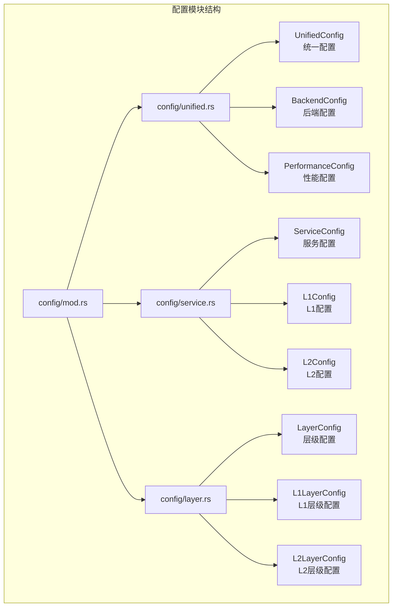
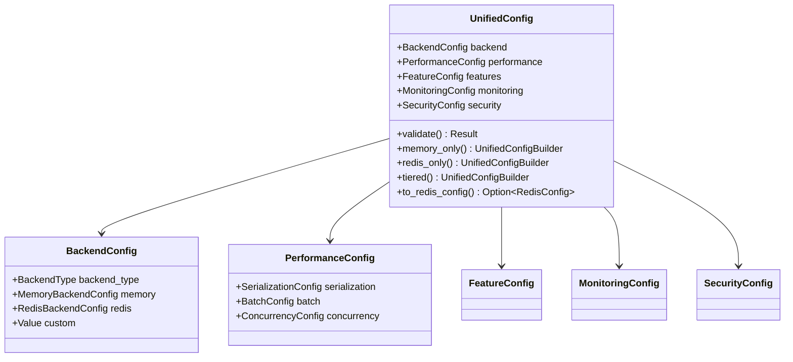
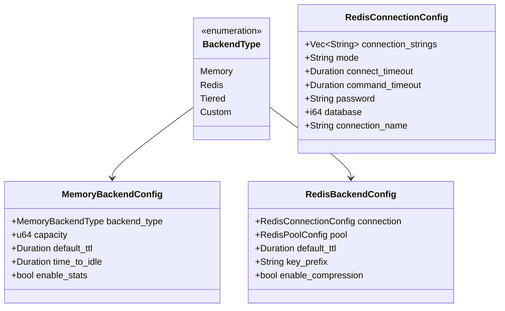
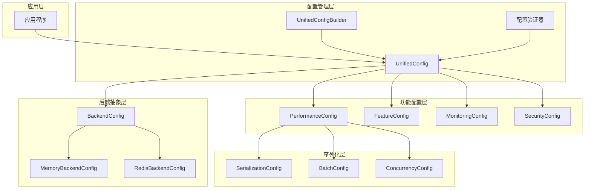
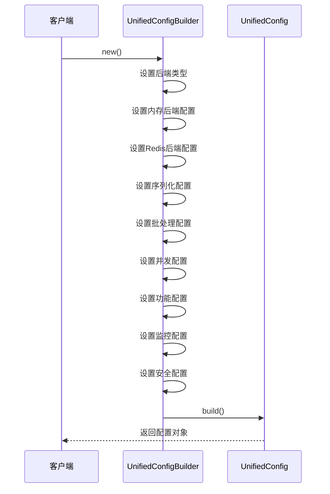
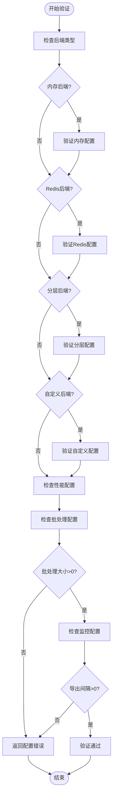
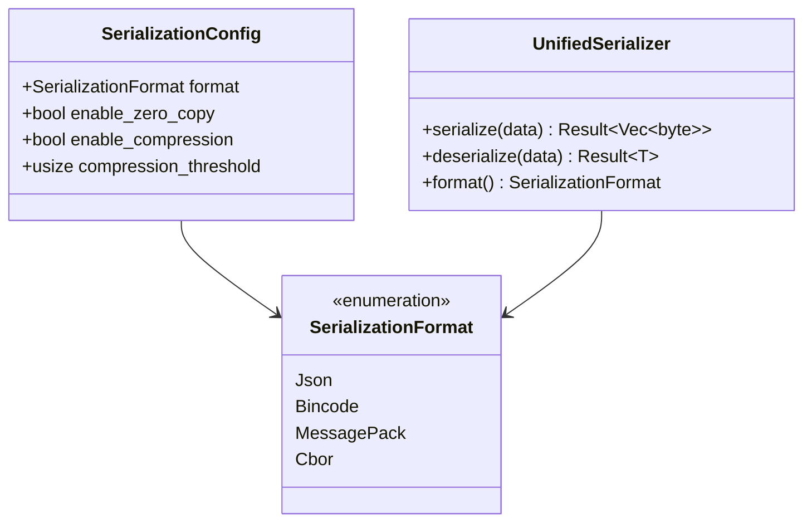
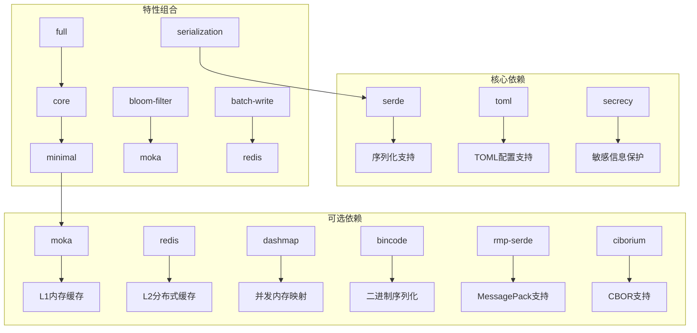

# 统一配置管理

<cite>
**本文档引用的文件**
- [unified.rs](file://src/config/unified.rs)
- [service.rs](file://src/config/service.rs)
- [layer.rs](file://src/config/layer.rs)
- [mod.rs](file://src/config/mod.rs)
- [lib.rs](file://src/lib.rs)
- [Cargo.toml](file://Cargo.toml)
- [dynamic_config.rs](file://examples/src/dynamic_config.rs)
- [test_config.toml](file://tests/test_config.toml)
- [unified.rs](file://src/serialization/unified.rs)
</cite>

## 目录
1. [简介](#简介)
2. [项目结构](#项目结构)
3. [核心组件](#核心组件)
4. [架构概览](#架构概览)
5. [详细组件分析](#详细组件分析)
6. [依赖分析](#依赖分析)
7. [性能考虑](#性能考虑)
8. [故障排除指南](#故障排除指南)
9. [结论](#结论)
10. [附录](#附录)

## 简介

Oxcache 的统一配置管理模块是整个缓存系统的核心基础设施，它提供了一个集中化的配置管理方案，将 L1 内存后端、L2 分布式后端、序列化配置、性能配置等各个方面的设置整合到一个统一的对象中。该模块的设计理念是通过单一配置源来简化缓存系统的部署和维护，同时保持高度的灵活性和可扩展性。

统一配置模块采用现代 Rust 设计模式，结合了特征门控（feature-gated）机制，使得配置系统能够根据编译时特性动态调整其功能集。这种设计既保证了最小化开销的轻量级使用场景，也支持完整功能的生产环境部署。

## 项目结构

统一配置管理模块位于 `src/config/` 目录下，包含以下关键文件：



**图表来源**
- [mod.rs](file://src/config/mod.rs#L15-L32)
- [unified.rs](file://src/config/unified.rs#L17-L33)
- [service.rs](file://src/config/service.rs#L105-L128)
- [layer.rs](file://src/config/layer.rs#L10-L22)

**章节来源**
- [mod.rs](file://src/config/mod.rs#L1-L32)
- [unified.rs](file://src/config/unified.rs#L1-L50)

## 核心组件

统一配置管理模块的核心由以下几个主要组件构成：

### UnifiedConfig - 统一配置主类

UnifiedConfig 是整个配置系统的核心，它将所有配置选项组织在一个单一的结构体中：



**图表来源**
- [unified.rs](file://src/config/unified.rs#L17-L33)
- [unified.rs](file://src/config/unified.rs#L35-L46)
- [unified.rs](file://src/config/unified.rs#L123-L132)

### 后端配置体系

后端配置体系提供了灵活的后端选择机制，支持多种缓存后端的组合使用：



**图表来源**
- [unified.rs](file://src/config/unified.rs#L48-L59)
- [unified.rs](file://src/config/unified.rs#L61-L74)
- [unified.rs](file://src/config/unified.rs#L76-L89)
- [unified.rs](file://src/config/unified.rs#L91-L121)

**章节来源**
- [unified.rs](file://src/config/unified.rs#L17-L987)

## 架构概览

统一配置管理模块采用了分层架构设计，确保了配置系统的可扩展性和可维护性：



**图表来源**
- [unified.rs](file://src/config/unified.rs#L468-L546)
- [unified.rs](file://src/config/unified.rs#L548-L662)

## 详细组件分析

### 配置构建器模式

UnifiedConfigBuilder 实现了流畅接口（fluent interface）模式，提供了直观的配置构建体验：



**图表来源**
- [unified.rs](file://src/config/unified.rs#L469-L546)

### 配置验证机制

配置验证是统一配置管理模块的重要安全保障，确保配置的有效性和一致性：



**图表来源**
- [unified.rs](file://src/config/unified.rs#L548-L608)

### 配置序列化与反序列化

统一配置管理模块支持多种配置格式的序列化和反序列化：



**图表来源**
- [unified.rs](file://src/config/unified.rs#L134-L145)
- [unified.rs](file://src/config/unified.rs#L135-L145)
- [unified.rs](file://src/serialization/unified.rs#L146-L161)

**章节来源**
- [unified.rs](file://src/config/unified.rs#L548-L662)
- [unified.rs](file://src/serialization/unified.rs#L146-L474)

### 便捷配置函数

统一配置模块提供了多个便捷函数来快速创建常见的配置模式：

| 函数名 | 描述 | 特性要求 |
|--------|------|----------|
| `simple_memory()` | 创建简单的内存缓存配置 | 无 |
| `simple_redis()` | 创建简单的Redis缓存配置 | `redis` 特性 |
| `simple_tiered()` | 创建简单的分层缓存配置 | `moka` 和 `redis` 特性 |
| `high_performance_memory()` | 创建高性能内存缓存配置 | `bincode` 特性 |
| `production_redis()` | 创建生产环境Redis配置 | `redis` 特性 |

**章节来源**
- [unified.rs](file://src/config/unified.rs#L664-L800)

## 依赖分析

统一配置管理模块的依赖关系体现了其特征门控的设计理念：



**图表来源**
- [Cargo.toml](file://Cargo.toml#L235-L347)
- [lib.rs](file://src/lib.rs#L436-L443)

**章节来源**
- [Cargo.toml](file://Cargo.toml#L235-L347)
- [lib.rs](file://src/lib.rs#L436-L525)

## 性能考虑

统一配置管理模块在设计时充分考虑了性能优化：

### 零拷贝优化
- `enable_zero_copy` 选项支持零拷贝序列化，减少内存分配和数据复制
- 在高吞吐量场景下显著降低 CPU 开销

### 批处理优化
- `BatchConfig` 提供批量操作支持，通过批处理减少网络往返
- `parallel_processing` 选项启用并行处理能力

### 内存管理
- `enable_stats` 选项收集统计信息，帮助监控内存使用情况
- `time_to_idle` 支持基于时间的内存回收

## 故障排除指南

### 常见配置错误

| 错误类型 | 错误信息 | 解决方案 |
|----------|----------|----------|
| 后端配置缺失 | "Memory backend configuration is required" | 确保为所选后端类型提供完整配置 |
| 特性依赖错误 | "Tiered backend requires both 'moka' and 'redis' features" | 启用所需的特性组合 |
| 配置验证失败 | "Batch max size must be greater than 0" | 检查配置参数的有效性 |
| 路径安全问题 | "Symbolic links are not allowed for configuration files" | 使用绝对路径并避免符号链接 |

### 调试技巧

1. **启用详细日志**：使用 `LogLevel::Debug` 获取详细的配置加载信息
2. **验证配置**：在应用启动时调用 `validate()` 方法检查配置有效性
3. **使用便捷函数**：通过 `convenience` 模块提供的函数快速创建标准配置

**章节来源**
- [unified.rs](file://src/config/unified.rs#L548-L608)
- [unified.rs](file://src/config/unified.rs#L1216-L1440)

## 结论

Oxcache 的统一配置管理模块通过精心设计的架构和丰富的功能，为缓存系统的部署和维护提供了强大的支持。其特征门控设计确保了灵活性和效率的平衡，而完善的验证机制则保证了配置的安全性和可靠性。

该模块的主要优势包括：
- **统一性**：单一配置源简化了缓存系统的管理
- **灵活性**：支持多种后端组合和配置模式
- **安全性**：内置配置验证和路径安全检查
- **可扩展性**：模块化设计便于功能扩展和定制

通过合理使用统一配置管理模块，开发者可以快速搭建适合特定需求的缓存解决方案，无论是简单的内存缓存还是复杂的分布式缓存架构。

## 附录

### 配置示例

以下是一些常用的配置示例，展示了如何在代码中创建和使用统一配置：

#### 基础内存缓存配置
```rust
let config = UnifiedConfig::memory_only()
    .memory_backend(MemoryBackendConfig {
        backend_type: MemoryBackendType::Moka,
        capacity: 10000,
        default_ttl: Some(Duration::from_secs(3600)),
        enable_stats: true,
    })
    .build();
```

#### 生产环境Redis配置
```rust
let config = UnifiedConfig::redis_only()
    .redis_backend(RedisBackendConfig {
        connection: RedisConnectionConfig {
            connection_strings: vec!["redis://localhost:6379".to_string()],
            mode: "standalone".to_string(),
            connect_timeout: Duration::from_secs(10),
            command_timeout: Duration::from_secs(5),
        },
        pool: RedisPoolConfig {
            max_size: 20,
            min_size: 5,
            idle_timeout: Some(Duration::from_secs(300)),
        },
        default_ttl: Some(Duration::from_secs(3600)),
        enable_compression: true,
    })
    .features(FeatureConfig {
        enable_metrics: true,
        enable_health_checks: true,
        enable_locking: true,
    })
    .build();
```

#### 分层缓存配置
```rust
let config = UnifiedConfig::tiered()
    .memory_backend(MemoryBackendConfig {
        backend_type: MemoryBackendType::DashMap,
        capacity: 100000,
        default_ttl: Some(Duration::from_secs(3600)),
    })
    .redis_backend(RedisBackendConfig {
        connection: RedisConnectionConfig {
            connection_strings: vec!["redis://localhost:6379".to_string()],
            mode: "standalone".to_string(),
        },
        pool: RedisPoolConfig {
            max_size: 50,
            min_size: 10,
        },
    })
    .build();
```

### 最佳实践

1. **配置验证**：始终在应用启动时验证配置的有效性
2. **特性管理**：根据实际需求启用必要的特性，避免不必要的依赖
3. **监控配置**：启用适当的监控和日志记录，便于问题诊断
4. **安全考虑**：使用环境变量管理敏感配置，如数据库密码和连接字符串
5. **性能调优**：根据应用场景调整缓存大小、TTL和批处理参数

### 常见配置模式

| 模式 | 适用场景 | 推荐配置 |
|------|----------|----------|
| 开发环境 | 快速开发和测试 | `simple_memory()` + `LogLevel::Debug` |
| 生产环境 | 高可用和高性能 | `production_redis()` + 完整监控 |
| 性能测试 | 压力测试和基准测试 | `high_performance_memory()` + 批处理优化 |
| 分布式部署 | 多节点和高并发 | `simple_tiered()` + 负载均衡 |