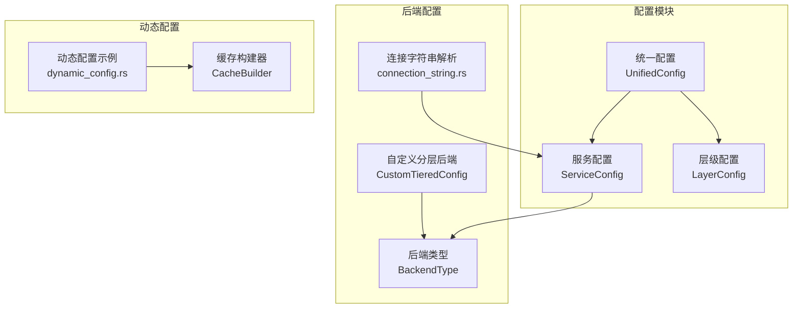
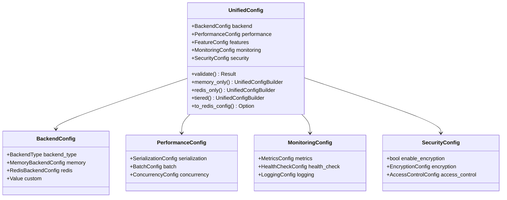
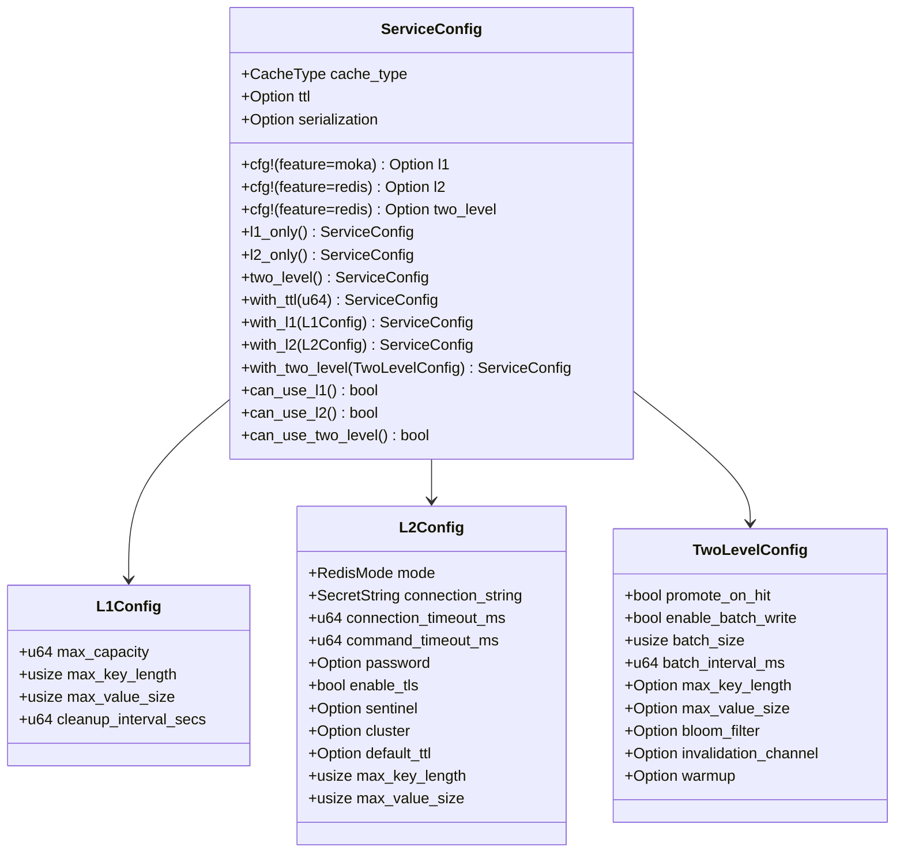
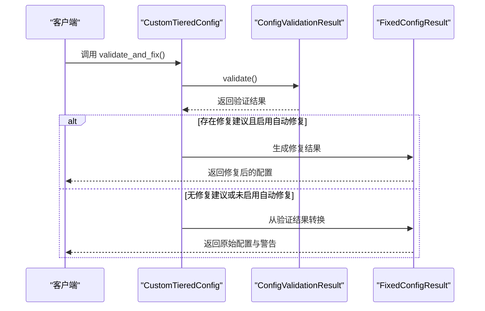
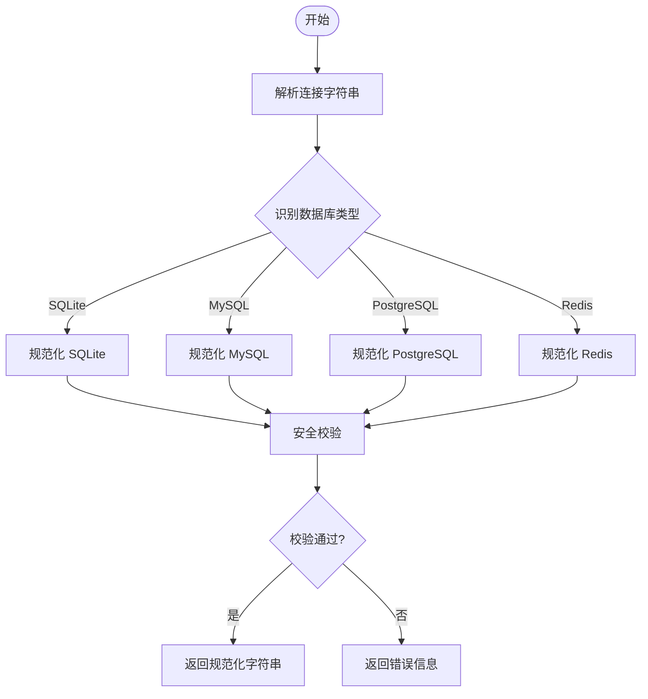
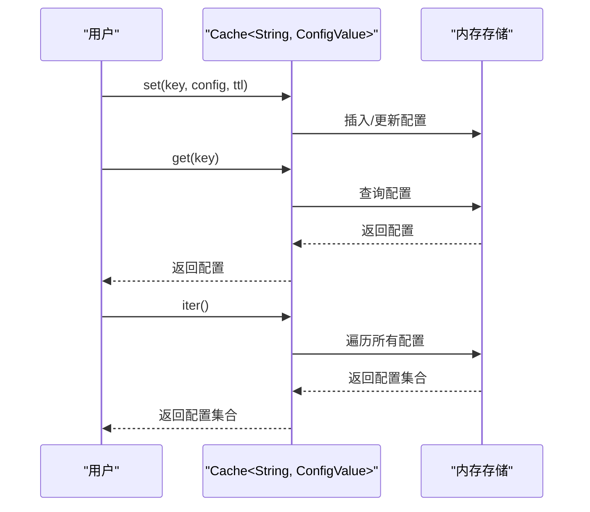
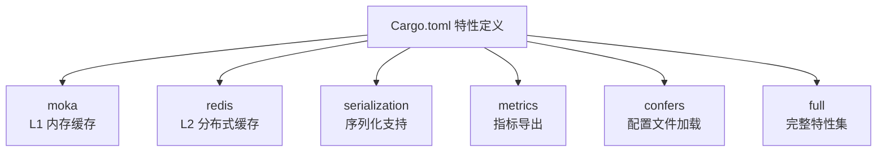

# 配置系统

<cite>
**本文档引用的文件**
- [src/config/mod.rs](file://src/config/mod.rs)
- [src/config/unified.rs](file://src/config/unified.rs)
- [src/config/service.rs](file://src/config/service.rs)
- [src/config/layer.rs](file://src/config/layer.rs)
- [src/backend/custom_tiered.rs](file://src/backend/custom_tiered.rs)
- [src/database/connection_string.rs](file://src/database/connection_string.rs)
- [src/builder/cache_builder.rs](file://src/builder/cache_builder.rs)
- [Cargo.toml](file://Cargo.toml)
- [docs/CONFIG_VALIDATION.md](file://docs/CONFIG_VALIDATION.md)
- [examples/src/dynamic_config.rs](file://examples/src/dynamic_config.rs)
- [tests/test_config.toml](file://tests/test_config.toml)
</cite>

## 目录
1. [简介](#简介)
2. [项目结构](#项目结构)
3. [核心组件](#核心组件)
4. [架构总览](#架构总览)
5. [详细组件分析](#详细组件分析)
6. [依赖关系分析](#依赖关系分析)
7. [性能考量](#性能考量)
8. [故障排除指南](#故障排除指南)
9. [结论](#结论)
10. [附录](#附录)

## 简介
本章节全面介绍 Oxcache 的配置系统，涵盖统一配置管理、服务配置、后端配置以及动态配置等能力。重点说明配置文件结构与语法、全局设置、服务定义、L1/L2 后端配置等；解释配置验证机制（连接字符串解析、参数范围检查、依赖关系验证）；介绍动态配置更新的实现原理与使用方法；提供完整配置示例与最佳实践；阐明配置优先级与覆盖规则；并给出常见配置错误的诊断与解决方案。

## 项目结构
Oxcache 的配置系统由多个模块协同组成：
- 统一配置模块：集中管理后端、性能、监控、安全等配置项
- 服务配置模块：面向服务维度的缓存配置，支持 L1/L2/双层缓存
- 层级配置模块：提供 L1/L2/L3 的默认配置模板
- 自定义分层后端：支持灵活的后端类型组合与自动修复
- 连接字符串解析与验证：数据库与 Redis 连接字符串的解析、规范化与安全校验
- 构建器与动态配置：通过构建器与缓存接口实现高级配置与动态更新

**图表来源**
- [src/config/unified.rs](file://src/config/unified.rs#L17-L33)
- [src/config/service.rs](file://src/config/service.rs#L105-L128)
- [src/config/layer.rs](file://src/config/layer.rs#L14-L22)
- [src/backend/custom_tiered.rs](file://src/backend/custom_tiered.rs#L362-L466)
- [src/database/connection_string.rs](file://src/database/connection_string.rs#L14-L39)
- [examples/src/dynamic_config.rs](file://examples/src/dynamic_config.rs#L10-L18)
- [src/builder/cache_builder.rs](file://src/builder/cache_builder.rs#L38-L45)

**章节来源**
- [src/config/mod.rs](file://src/config/mod.rs#L11-L32)
- [src/config/unified.rs](file://src/config/unified.rs#L17-L33)
- [src/config/service.rs](file://src/config/service.rs#L105-L128)
- [src/config/layer.rs](file://src/config/layer.rs#L14-L22)
- [src/backend/custom_tiered.rs](file://src/backend/custom_tiered.rs#L362-L466)
- [src/database/connection_string.rs](file://src/database/connection_string.rs#L14-L39)
- [examples/src/dynamic_config.rs](file://examples/src/dynamic_config.rs#L10-L18)
- [src/builder/cache_builder.rs](file://src/builder/cache_builder.rs#L38-L45)

## 核心组件
- 统一配置（UnifiedConfig）：集中管理后端、性能、监控、安全等配置，提供验证与便捷构造器
- 服务配置（ServiceConfig）：按服务维度定义缓存类型、TTL、序列化等，支持 feature-gated 的 L1/L2/双层配置
- 层级配置（LayerConfig）：提供 L1/L2/L3 的默认配置模板，便于继承与复用
- 自定义分层后端（CustomTieredConfig）：灵活组合 L1/L2/L3 后端类型，内置自动修复与安全校验
- 连接字符串解析（connection_string.rs）：支持 SQLite/MySQL/PostgreSQL/Redis 的解析、规范化与安全校验
- 动态配置（dynamic_config.rs）：通过缓存接口实现配置的动态增删改查与分组统计
- 构建器（CacheBuilder）：提供高级配置能力（TTL、容量、批写、自动提升）

**章节来源**
- [src/config/unified.rs](file://src/config/unified.rs#L17-L33)
- [src/config/service.rs](file://src/config/service.rs#L105-L128)
- [src/config/layer.rs](file://src/config/layer.rs#L14-L22)
- [src/backend/custom_tiered.rs](file://src/backend/custom_tiered.rs#L766-L779)
- [src/database/connection_string.rs](file://src/database/connection_string.rs#L275-L290)
- [examples/src/dynamic_config.rs](file://examples/src/dynamic_config.rs#L20-L132)
- [src/builder/cache_builder.rs](file://src/builder/cache_builder.rs#L38-L45)

## 架构总览
统一配置系统通过模块化设计实现高内聚、低耦合的配置管理：
- 统一配置模块负责整体配置的聚合与验证
- 服务配置模块面向业务服务，提供 feature-gated 的配置能力
- 层级配置模块提供默认模板，减少重复配置
- 自定义分层后端模块支持灵活组合与自动修复
- 连接字符串解析模块保障数据库与 Redis 连接的安全与一致性
- 动态配置示例展示通过缓存接口实现配置的实时更新与查询

```mermaid
graph TB
Unified["UnifiedConfig<br/>统一配置"] --> BackendCfg["BackendConfig<br/>后端配置"]
Unified --> PerfCfg["PerformanceConfig<br/>性能配置"]
Unified --> MonCfg["MonitoringConfig<br/>监控配置"]
Unified --> SecCfg["SecurityConfig<br/>安全配置"]
Service["ServiceConfig<br/>服务配置"] --> CacheType["CacheType<br/>缓存类型"]
Service --> L1Cfg["L1Config<br/>L1配置"]
Service --> L2Cfg["L2Config<br/>L2配置"]
Service --> TwoLevelCfg["TwoLevelConfig<br/>双层配置"]
Layer["LayerConfig<br/>层级配置"] --> L1Layer["L1LayerConfig<br/>L1层级配置"]
Layer --> L2Layer["L2LayerConfig<br/>L2层级配置"]
Layer --> TwoLevelLayer["TwoLevelLayerConfig<br/>双层层级配置"]
CustomTiered["CustomTieredConfig<br/>自定义分层后端"] --> L1Backend["BackendType::L1"]
CustomTiered --> L2Backend["BackendType::L2"]
CustomTiered --> L3Backend["BackendType::L3"]
```

**图表来源**
- [src/config/unified.rs](file://src/config/unified.rs#L21-L33)
- [src/config/service.rs](file://src/config/service.rs#L112-L128)
- [src/config/layer.rs](file://src/config/layer.rs#L14-L22)
- [src/backend/custom_tiered.rs](file://src/backend/custom_tiered.rs#L362-L466)

**章节来源**
- [src/config/unified.rs](file://src/config/unified.rs#L17-L33)
- [src/config/service.rs](file://src/config/service.rs#L112-L128)
- [src/config/layer.rs](file://src/config/layer.rs#L14-L22)
- [src/backend/custom_tiered.rs](file://src/backend/custom_tiered.rs#L362-L466)

## 详细组件分析

### 统一配置（UnifiedConfig）
统一配置模块提供集中化的配置入口，包含后端、性能、监控、安全四大类配置，并提供验证与便捷构造器：
- 后端配置：支持 Memory/Redis/Tiered/Custom 四种后端类型，分别对应内存、Redis、分层与自定义后端
- 性能配置：包含序列化、批处理、并发控制等性能相关参数
- 监控配置：包含指标导出、健康检查、日志级别等可观测性配置
- 安全配置：包含加密、访问控制等安全相关配置

统一配置提供多种便捷构造器：
- memory_only()/redis_only()/tiered()：快速创建内存/Redis/分层缓存配置
- high_performance_memory()/production_redis()：高性能与生产环境推荐配置
- validate()：执行配置验证，包括后端类型、批处理大小、指标导出间隔等

**图表来源**
- [src/config/unified.rs](file://src/config/unified.rs#L21-L33)
- [src/config/unified.rs](file://src/config/unified.rs#L35-L46)
- [src/config/unified.rs](file://src/config/unified.rs#L123-L132)
- [src/config/unified.rs](file://src/config/unified.rs#L190-L199)
- [src/config/unified.rs](file://src/config/unified.rs#L266-L275)

**章节来源**
- [src/config/unified.rs](file://src/config/unified.rs#L17-L33)
- [src/config/unified.rs](file://src/config/unified.rs#L548-L662)

### 服务配置（ServiceConfig）
服务配置模块面向具体服务，提供缓存类型、TTL、序列化等配置，并通过 feature-gated 的方式支持 L1/L2/双层缓存：
- 缓存类型：L1/L2/TwoLevel 三种类型，分别对应内存缓存、Redis 缓存与双层缓存
- TTL：统一的缓存过期时间配置
- 序列化：支持 JSON/Bincode/MessagePack/CBOR 等序列化类型
- L1/L2/TwoLevel 配置：根据 feature 条件编译，提供默认配置与便捷构造器

服务配置还提供多种便捷构造器：
- l1_only()/l2_only()/two_level()：快速创建 L1/L2/双层缓存配置
- with_ttl()/with_l1()/with_l2()/with_two_level()：链式配置方法
- can_use_l1()/can_use_l2()/can_use_two_level()：检查当前 feature 状态

**图表来源**
- [src/config/service.rs](file://src/config/service.rs#L112-L128)
- [src/config/service.rs](file://src/config/service.rs#L299-L314)
- [src/config/service.rs](file://src/config/service.rs#L360-L391)
- [src/config/service.rs](file://src/config/service.rs#L493-L516)

**章节来源**
- [src/config/service.rs](file://src/config/service.rs#L105-L128)
- [src/config/service.rs](file://src/config/service.rs#L140-L297)

### 层级配置（LayerConfig）
层级配置模块提供 L1/L2/L3 的默认配置模板，便于服务配置继承与复用：
- L1LayerConfig：内存缓存的默认配置，包含容量、键值限制、清理间隔与淘汰策略
- L2LayerConfig：分布式缓存的默认配置，包含连接字符串、超时、TTL、键值限制
- TwoLevelLayerConfig：双层缓存的默认行为配置，包含提升策略、批写开关与批写参数

层级配置支持链式设置方法，便于快速定制默认模板。

**章节来源**
- [src/config/layer.rs](file://src/config/layer.rs#L14-L47)
- [src/config/layer.rs](file://src/config/layer.rs#L52-L95)
- [src/config/layer.rs](file://src/config/layer.rs#L100-L155)
- [src/config/layer.rs](file://src/config/layer.rs#L157-L206)

### 自定义分层后端（CustomTieredConfig）
自定义分层后端模块支持灵活组合 L1/L2/L3 后端类型，并提供自动修复与安全校验：
- 后端类型：Moka/DashMap/Redis/Sqlite/Tiered/Custom 等，每种类型具有推荐层级限制
- 层级限制：L1Only/L2AndL3Only/Any，用于防止错误的层级分配
- 配置验证：validate() 检查后端类型与层级匹配，支持参数范围检查
- 自动修复：validate_and_fix() 在启用自动修复时自动纠正不合法配置
- 路径安全：load_from_file() 支持绝对路径、规范化与符号链接防护

**图表来源**
- [src/backend/custom_tiered.rs](file://src/backend/custom_tiered.rs#L1077-L1095)
- [src/backend/custom_tiered.rs](file://src/backend/custom_tiered.rs#L1251-L1296)

**章节来源**
- [src/backend/custom_tiered.rs](file://src/backend/custom_tiered.rs#L766-L779)
- [src/backend/custom_tiered.rs](file://src/backend/custom_tiered.rs#L1077-L1095)
- [src/backend/custom_tiered.rs](file://src/backend/custom_tiered.rs#L1251-L1296)

### 连接字符串解析与验证
连接字符串解析模块提供数据库与 Redis 连接字符串的解析、规范化与安全校验：
- 类型识别：自动识别 SQLite/MySQL/PostgreSQL/Redis 四种类型
- 解析与规范化：支持多种格式的连接字符串，输出标准化格式
- 安全校验：检查主机地址、路径合法性、目录权限等
- 环境推荐：根据不同环境（开发/测试/生产）生成推荐连接字符串
- 路径安全：确保配置文件路径为绝对路径，防止路径遍历与符号链接攻击

**图表来源**
- [src/database/connection_string.rs](file://src/database/connection_string.rs#L275-L290)
- [src/database/connection_string.rs](file://src/database/connection_string.rs#L540-L586)

**章节来源**
- [src/database/connection_string.rs](file://src/database/connection_string.rs#L14-L39)
- [src/database/connection_string.rs](file://src/database/connection_string.rs#L275-L290)
- [src/database/connection_string.rs](file://src/database/connection_string.rs#L540-L586)

### 动态配置更新
动态配置通过缓存接口实现配置的实时更新与查询：
- 初始化配置：批量插入配置项，包含键、值、类型与更新时间
- 查询配置：按键查询配置，支持批量查询与迭代遍历
- 更新配置：修改现有配置并验证更新结果
- 导出与分组：支持导出全部配置并按类型分组统计
- 清理测试数据：完成示例后清理缓存数据

**图表来源**
- [examples/src/dynamic_config.rs](file://examples/src/dynamic_config.rs#L20-L132)

**章节来源**
- [examples/src/dynamic_config.rs](file://examples/src/dynamic_config.rs#L10-L132)

## 依赖关系分析
Oxcache 的配置系统通过 Cargo features 实现灵活的依赖控制：
- moka：启用 L1 内存缓存（Moka/DashMap）
- redis：启用 L2 分布式缓存（Redis）
- serialization：启用序列化支持（JSON/Bincode/MessagePack/CBOR）
- metrics：启用 OpenTelemetry 指标
- confers：启用配置文件加载与动态配置
- full：启用所有特性，提供最完整的功能集

**图表来源**
- [Cargo.toml](file://Cargo.toml#L235-L347)

**章节来源**
- [Cargo.toml](file://Cargo.toml#L235-L347)

## 性能考量
- 批处理与并发：统一配置中的批处理与并发配置可显著提升吞吐量
- 序列化优化：选择合适的序列化格式与压缩策略可降低网络与存储开销
- 缓存层级：合理配置 L1/L2 层级容量与 TTL，平衡延迟与命中率
- 连接池：Redis 连接池大小与超时设置影响连接建立与命令执行效率
- 自动修复：在保证稳定性的前提下启用自动修复，减少人工干预

## 故障排除指南
- 配置验证失败：检查验证报告中的错误信息，启用自动修复或手动修正配置
- 参数越界：确保容量、TTL、TTI 等参数在合法范围内
- 路径验证失败：使用绝对路径，确保路径在允许目录内，避免符号链接
- 连接字符串错误：使用规范化后的连接字符串，检查主机地址与认证信息
- 功能特性缺失：确认编译时启用所需特性，如 moka、redis、serialization 等

**章节来源**
- [docs/CONFIG_VALIDATION.md](file://docs/CONFIG_VALIDATION.md#L444-L487)

## 结论
Oxcache 的配置系统通过统一配置、服务配置、层级配置与自定义分层后端实现了高度模块化与可扩展的配置管理。配合连接字符串解析与动态配置能力，开发者可以在不同环境下快速部署并安全地管理缓存配置。通过完善的验证机制与自动修复功能，系统能够在保证稳定性的同时提升运维效率。

## 附录

### 配置文件结构与语法
- 全局设置：统一配置中的 backend、performance、monitoring、security 等字段
- 服务定义：ServiceConfig 中的 cache_type、ttl、serialization、L1/L2/TwoLevel 配置
- L1/L2 后端配置：MemoryBackendConfig、RedisBackendConfig、L1Config、L2Config、TwoLevelConfig
- 自定义分层配置：CustomTieredConfig 支持 L1/L2/L3 后端类型组合与自动修复

**章节来源**
- [src/config/unified.rs](file://src/config/unified.rs#L21-L33)
- [src/config/service.rs](file://src/config/service.rs#L112-L128)
- [src/config/layer.rs](file://src/config/layer.rs#L52-L95)
- [src/backend/custom_tiered.rs](file://src/backend/custom_tiered.rs#L766-L779)

### 配置验证机制
- 连接字符串解析：支持 SQLite/MySQL/PostgreSQL/Redis 的解析与规范化
- 参数范围检查：容量、TTL、TTI 等参数的范围校验
- 依赖关系验证：后端类型与层级的匹配检查
- 自动修复：在启用自动修复时自动纠正不合法配置

**章节来源**
- [src/database/connection_string.rs](file://src/database/connection_string.rs#L540-L586)
- [src/backend/custom_tiered.rs](file://src/backend/custom_tiered.rs#L1077-L1095)

### 动态配置更新实现原理
- 通过缓存接口实现配置的实时增删改查
- 支持批量操作与迭代遍历
- 提供配置分组统计与导出功能

**章节来源**
- [examples/src/dynamic_config.rs](file://examples/src/dynamic_config.rs#L20-L132)

### 配置示例与最佳实践
- 简单内存缓存：使用 simple_memory() 快速创建
- 生产环境 Redis：使用 production_redis() 获取推荐配置
- 高性能内存：在启用 bincode 时使用 high_performance_memory()
- 分层缓存：根据业务需求选择 L1/L2/双层缓存组合

**章节来源**
- [src/config/unified.rs](file://src/config/unified.rs#L664-L800)

### 配置优先级与覆盖规则
- 统一配置优先于服务配置：统一配置提供全局默认值，服务配置可覆盖
- 服务配置优先于层级配置：服务配置可覆盖层级默认值
- 动态配置优先于静态配置：运行时动态更新的配置可覆盖静态配置
- 自动修复优先于错误配置：在启用自动修复时，系统会自动纠正不合法配置

**章节来源**
- [src/config/unified.rs](file://src/config/unified.rs#L548-L608)
- [src/config/service.rs](file://src/config/service.rs#L140-L297)
- [src/backend/custom_tiered.rs](file://src/backend/custom_tiered.rs#L1077-L1095)

### 配置错误诊断与解决方案
- 配置验证失败：查看验证报告，启用自动修复或手动修正
- 参数越界：调整参数至合法范围
- 路径验证失败：使用绝对路径并确保目录权限正确
- 连接字符串错误：使用规范化后的连接字符串并检查认证信息
- 功能特性缺失：确认编译时启用所需特性

**章节来源**
- [docs/CONFIG_VALIDATION.md](file://docs/CONFIG_VALIDATION.md#L444-L487)