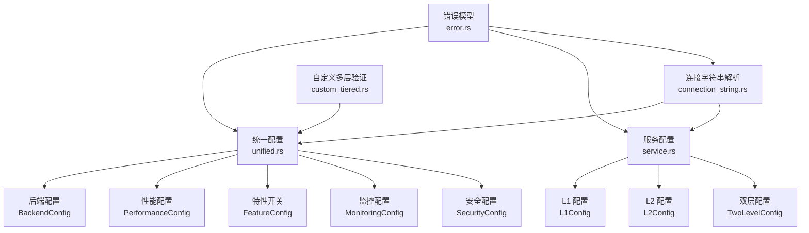
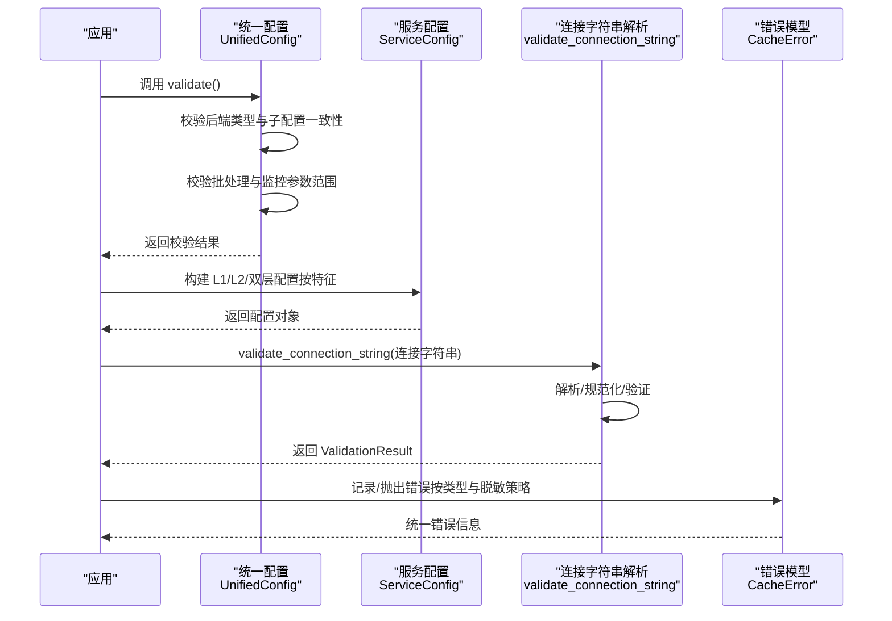
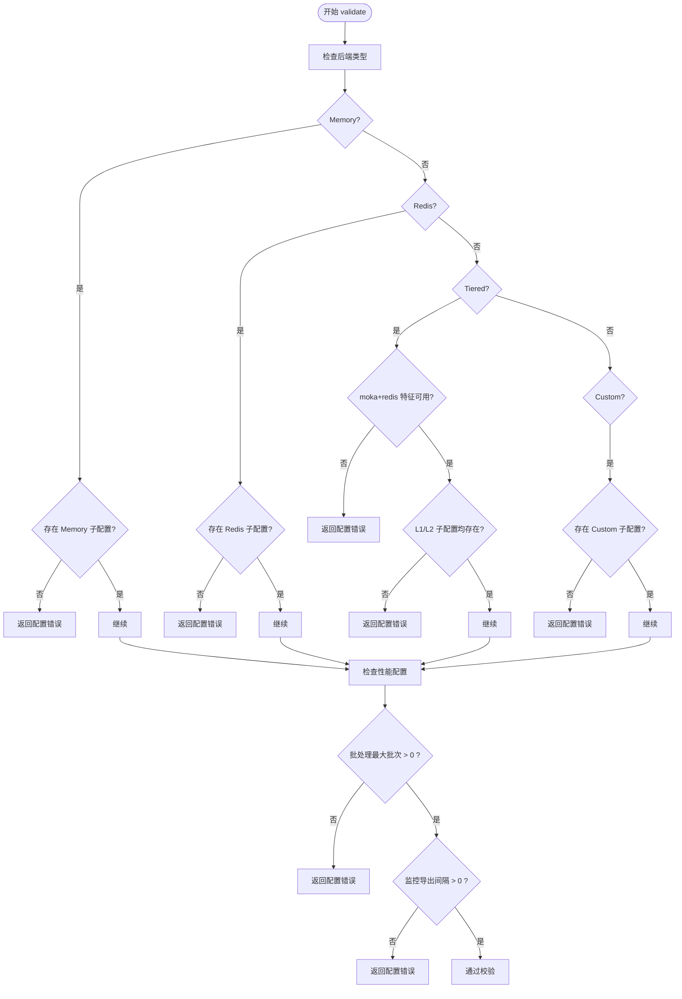
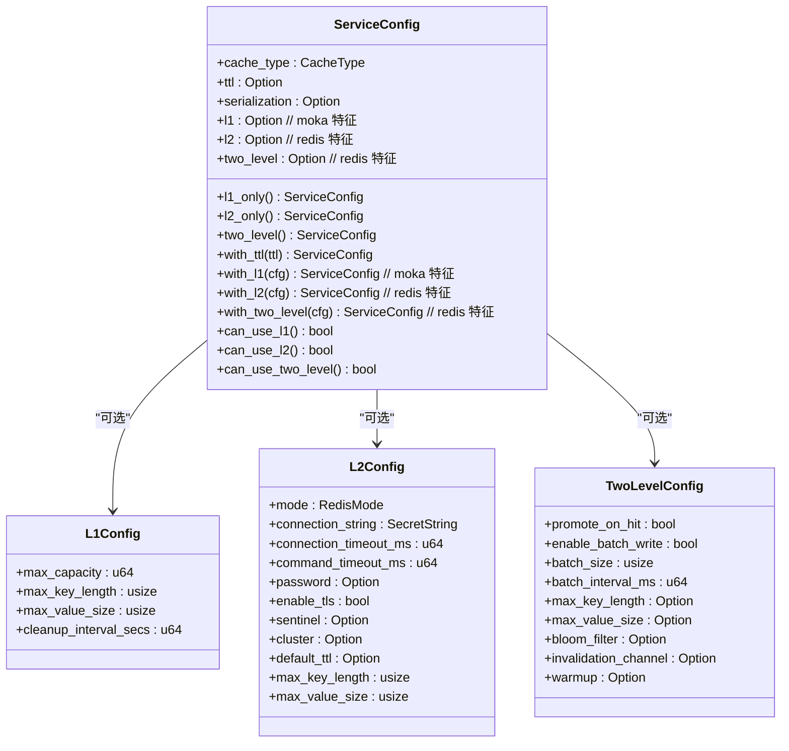
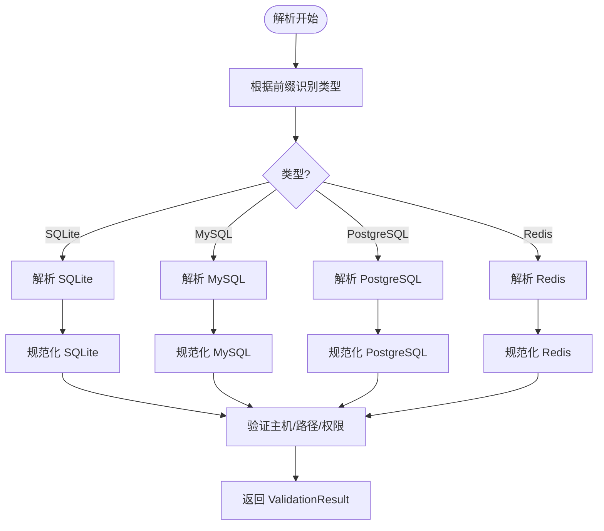
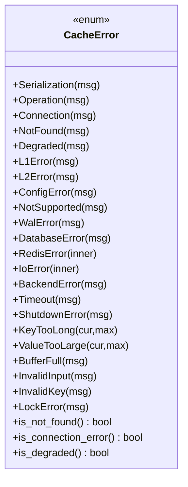
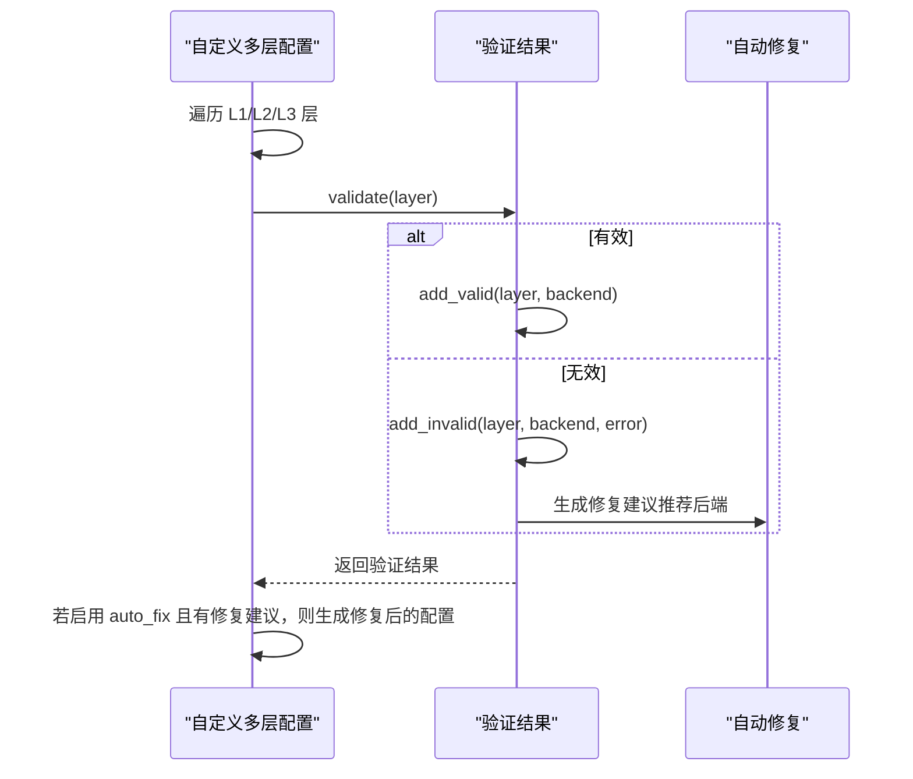
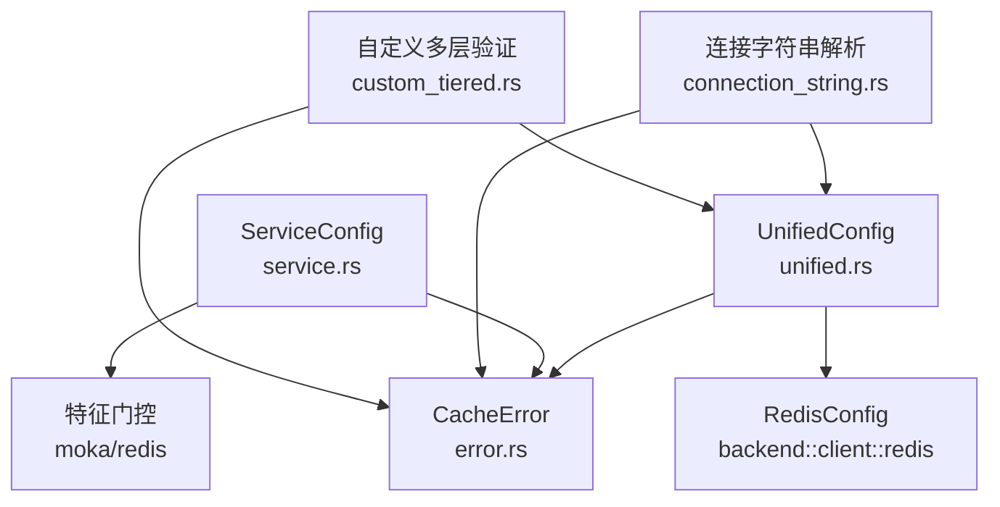

# 配置验证

<cite>
**本文引用的文件**
- [src/config/mod.rs](file://src/config/mod.rs)
- [src/config/service.rs](file://src/config/service.rs)
- [src/config/unified.rs](file://src/config/unified.rs)
- [src/database/connection_string.rs](file://src/database/connection_string.rs)
- [src/error.rs](file://src/error.rs)
- [src/backend/custom_tiered.rs](file://src/backend/custom_tiered.rs)
- [tests/config/config_test.rs](file://tests/config/config_test.rs)
- [examples/src/dynamic_config.rs](file://examples/src/dynamic_config.rs)
</cite>

## 目录
1. [简介](#简介)
2. [项目结构](#项目结构)
3. [核心组件](#核心组件)
4. [架构总览](#架构总览)
5. [详细组件分析](#详细组件分析)
6. [依赖关系分析](#依赖关系分析)
7. [性能考量](#性能考量)
8. [故障排查指南](#故障排查指南)
9. [结论](#结论)
10. [附录](#附录)

## 简介
本章节系统阐述 Oxcache 的配置验证机制与实现原理，重点覆盖：
- 配置验证的重要性与在缓存系统中的作用
- 连接字符串解析与规范化（Redis、数据库等）
- 参数范围检查与依赖关系验证
- 错误处理与错误信息生成机制
- 实际使用示例与常见错误诊断
- 不同环境下的行为差异与注意事项

## 项目结构
Oxcache 的配置验证涉及多个模块协同工作：
- 统一配置模块：集中管理后端、性能、特性、监控、安全等配置，并提供校验与构建器
- 服务配置模块：面向服务维度的配置（L1/L2/双层），并提供特征门控
- 连接字符串解析模块：对 SQLite、MySQL、PostgreSQL、Redis 的连接字符串进行解析、规范化与验证
- 错误模型模块：统一的错误类型与错误信息生成策略
- 自定义多层配置验证：针对三层缓存的依赖关系与参数范围进行验证与自动修复建议

**图表来源**
- [src/config/unified.rs](file://src/config/unified.rs#L17-L662)
- [src/config/service.rs](file://src/config/service.rs#L105-L297)
- [src/database/connection_string.rs](file://src/database/connection_string.rs#L14-L389)
- [src/error.rs](file://src/error.rs#L45-L208)
- [src/backend/custom_tiered.rs](file://src/backend/custom_tiered.rs#L1038-L1240)

**章节来源**
- [src/config/mod.rs](file://src/config/mod.rs#L1-L32)
- [src/config/unified.rs](file://src/config/unified.rs#L17-L662)
- [src/config/service.rs](file://src/config/service.rs#L105-L297)
- [src/database/connection_string.rs](file://src/database/connection_string.rs#L14-L389)
- [src/error.rs](file://src/error.rs#L45-L208)
- [src/backend/custom_tiered.rs](file://src/backend/custom_tiered.rs#L1038-L1240)

## 核心组件
- 统一配置与校验：提供 validate 方法，确保后端类型与子配置一致、批处理参数有效、监控导出间隔合理等
- 服务配置与特征门控：按 moka/redis 特征提供 L1/L2/双层配置，避免在不满足特征时出现非法配置
- 连接字符串解析与验证：解析并规范化 SQLite/MySQL/PostgreSQL/Redis，同时进行有效性与环境推荐校验
- 错误模型：统一的错误类型与信息生成，支持脱敏与分类判断
- 多层配置验证与自动修复：对 L1/L2/L3 层级进行依赖关系与参数范围验证，并给出修复建议

**章节来源**
- [src/config/unified.rs](file://src/config/unified.rs#L548-L608)
- [src/config/service.rs](file://src/config/service.rs#L105-L297)
- [src/database/connection_string.rs](file://src/database/connection_string.rs#L540-L586)
- [src/error.rs](file://src/error.rs#L75-L208)
- [src/backend/custom_tiered.rs](file://src/backend/custom_tiered.rs#L1038-L1240)

## 架构总览
下图展示了配置验证在系统中的关键交互流程：统一配置校验、服务配置特征门控、连接字符串解析与规范化、错误生成与分类。

**图表来源**
- [src/config/unified.rs](file://src/config/unified.rs#L548-L608)
- [src/config/service.rs](file://src/config/service.rs#L105-L297)
- [src/database/connection_string.rs](file://src/database/connection_string.rs#L540-L586)
- [src/error.rs](file://src/error.rs#L75-L208)

## 详细组件分析

### 统一配置验证（UnifiedConfig.validate）
- 后端类型一致性校验：Memory/Redis/Tiered/Custom 需要对应子配置存在；Tiered 需要 moka+redis 特征同时开启
- 性能配置校验：批处理最大批次必须大于 0；监控指标导出间隔必须大于 0
- 构建器与便捷函数：提供 memory_only/redis_only/tiered/simple/high_performance/production 等便捷配置

**图表来源**
- [src/config/unified.rs](file://src/config/unified.rs#L548-L608)

**章节来源**
- [src/config/unified.rs](file://src/config/unified.rs#L548-L608)
- [src/config/unified.rs](file://src/config/unified.rs#L610-L809)

### 服务配置与特征门控（ServiceConfig）
- L1/L2/双层配置按特征门控：moka 特征决定 L1 可用性，redis 特征决定 L2/双层可用性
- 提供 with_xxx 方法设置各层配置，can_use_xxx 判断当前运行环境是否允许使用某层
- 通过 create 函数族快速生成 L1_only/L2_only/two_level，自动适配特征缺失场景

**图表来源**
- [src/config/service.rs](file://src/config/service.rs#L105-L297)
- [src/config/service.rs](file://src/config/service.rs#L299-L542)

**章节来源**
- [src/config/service.rs](file://src/config/service.rs#L105-L297)
- [src/config/service.rs](file://src/config/service.rs#L299-L542)

### 连接字符串解析与规范化（connection_string.rs）
- 类型推断：根据前缀自动识别 SQLite/MySQL/PostgreSQL/Redis
- 解析逻辑：
  - SQLite：支持 :memory:、相对/绝对路径、查询参数
  - MySQL/PostgreSQL：解析用户名/密码/主机/端口/数据库/查询参数
  - Redis：解析 :password@host:port
- 规范化与验证：
  - normalize_connection_string：输出标准格式
  - validate_connection_string：校验主机必填、SQLite 路径存在性与权限提示
  - get_recommended_connection_string：按环境生成推荐格式（开发/测试/生产）
  - ensure_database_directory：确保 SQLite 数据目录存在
  - 密码脱敏：支持 redaction 参数控制是否屏蔽密码

**图表来源**
- [src/database/connection_string.rs](file://src/database/connection_string.rs#L23-L389)
- [src/database/connection_string.rs](file://src/database/connection_string.rs#L540-L586)

**章节来源**
- [src/database/connection_string.rs](file://src/database/connection_string.rs#L23-L389)
- [src/database/connection_string.rs](file://src/database/connection_string.rs#L540-L586)
- [src/database/connection_string.rs](file://src/database/connection_string.rs#L588-L685)
- [src/database/connection_string.rs](file://src/database/connection_string.rs#L728-L768)
- [src/database/connection_string.rs](file://src/database/connection_string.rs#L770-L800)

### 错误处理与错误信息生成（error.rs）
- 错误类型：配置错误、序列化错误、连接错误、超时、数据库错误、键过长/值过大、锁错误等
- 统一错误信息模板：提供清晰的用户指引与建议
- 脱敏策略：对连接字符串中的密码进行掩码处理，避免敏感信息泄露
- 分类辅助：提供 is_not_found/is_connection_error/is_degraded 等辅助判断

**图表来源**
- [src/error.rs](file://src/error.rs#L75-L208)

**章节来源**
- [src/error.rs](file://src/error.rs#L75-L208)

### 自定义多层配置验证（custom_tiered.rs）
- 对 L1/L2/L3 层分别进行验证，记录有效/无效层与修复建议
- 生成验证报告：包含“配置有效/无效”、“具体问题”、“自动修复建议”
- 支持自动修复：在启用 auto_fix 时，基于推荐后端类型进行修复

**图表来源**
- [src/backend/custom_tiered.rs](file://src/backend/custom_tiered.rs#L1038-L1240)
- [src/backend/custom_tiered.rs](file://src/backend/custom_tiered.rs#L1242-L1317)

**章节来源**
- [src/backend/custom_tiered.rs](file://src/backend/custom_tiered.rs#L1038-L1240)
- [src/backend/custom_tiered.rs](file://src/backend/custom_tiered.rs#L1242-L1317)

## 依赖关系分析
- 统一配置依赖错误模型与后端客户端配置（RedisConfig）
- 服务配置依赖特征门控（moka/redis）与序列化格式
- 连接字符串解析模块独立于其他模块，但被统一配置与服务配置间接使用
- 自定义多层验证依赖后端类型与推荐策略

**图表来源**
- [src/config/unified.rs](file://src/config/unified.rs#L7-L9)
- [src/config/service.rs](file://src/config/service.rs#L27-L31)
- [src/database/connection_string.rs](file://src/database/connection_string.rs#L11-L15)
- [src/backend/custom_tiered.rs](file://src/backend/custom_tiered.rs#L1038-L1240)

**章节来源**
- [src/config/unified.rs](file://src/config/unified.rs#L7-L9)
- [src/config/service.rs](file://src/config/service.rs#L27-L31)
- [src/database/connection_string.rs](file://src/database/connection_string.rs#L11-L15)
- [src/backend/custom_tiered.rs](file://src/backend/custom_tiered.rs#L1038-L1240)

## 性能考量
- 统一配置校验在启动阶段执行，避免运行时因配置错误导致的失败重试
- 连接字符串解析与规范化在初始化阶段完成，减少运行时解析开销
- 特征门控避免在不满足条件下创建无效配置，降低后续运行时分支判断成本
- 错误模型统一化，便于快速定位问题，减少调试与回滚成本

[本节为通用指导，无需特定文件引用]

## 故障排查指南
- 统一配置校验失败
  - 现象：调用 validate() 返回配置错误
  - 原因：后端类型与子配置不匹配、批处理最大批次为 0、监控导出间隔为 0
  - 处理：根据错误信息补充缺失的子配置或调整参数
  - 参考：[src/config/unified.rs](file://src/config/unified.rs#L548-L608)

- 服务配置特征不满足
  - 现象：L1/L2/双层配置不可用
  - 原因：moka/redis 特征未启用
  - 处理：启用相应特性或改用可用配置组合
  - 参考：[src/config/service.rs](file://src/config/service.rs#L283-L296)

- 连接字符串解析/验证失败
  - 现象：validate_connection_string 返回错误或警告
  - 原因：缺少主机、SQLite 路径不存在或权限不足
  - 处理：修正连接字符串、确保目录存在并具备写权限
  - 参考：[src/database/connection_string.rs](file://src/database/connection_string.rs#L540-L586)

- 错误信息脱敏与分类
  - 现象：日志中连接字符串被脱敏
  - 原因：安全策略
  - 处理：使用非脱敏输出进行本地调试，生产环境保持脱敏
  - 参考：[src/error.rs](file://src/error.rs#L12-L43)

- 多层配置验证与自动修复
  - 现象：验证报告包含无效层与修复建议
  - 原因：层级间依赖关系或参数范围不满足
  - 处理：根据建议调整后端类型或参数
  - 参考：[src/backend/custom_tiered.rs](file://src/backend/custom_tiered.rs#L1038-L1240)

**章节来源**
- [src/config/unified.rs](file://src/config/unified.rs#L548-L608)
- [src/config/service.rs](file://src/config/service.rs#L283-L296)
- [src/database/connection_string.rs](file://src/database/connection_string.rs#L540-L586)
- [src/error.rs](file://src/error.rs#L12-L43)
- [src/backend/custom_tiered.rs](file://src/backend/custom_tiered.rs#L1038-L1240)

## 结论
Oxcache 的配置验证体系通过统一配置校验、服务配置特征门控、连接字符串解析与规范化、错误模型统一化以及多层配置验证与自动修复，形成了从“配置构建—解析—校验—错误处理—修复建议”的完整闭环。该体系确保了在不同环境下配置的一致性与安全性，降低了运行时风险，并提供了清晰的诊断与修复路径。

[本节为总结，无需特定文件引用]

## 附录

### 使用示例与最佳实践
- 统一配置示例
  - 使用 memory_only/redis_only/tiered 等便捷函数快速构建配置
  - 在生产环境使用 production_redis 等高可用配置
  - 参考：[src/config/unified.rs](file://src/config/unified.rs#L610-L809)

- 动态配置示例
  - 使用 Cache 管理动态配置键值，支持分组与导出
  - 参考：[examples/src/dynamic_config.rs](file://examples/src/dynamic_config.rs#L1-L133)

- 配置测试示例
  - 使用新 API 进行 SET/GET/DELETE/CLEAR 测试
  - 参考：[tests/config/config_test.rs](file://tests/config/config_test.rs#L11-L99)

**章节来源**
- [src/config/unified.rs](file://src/config/unified.rs#L610-L809)
- [examples/src/dynamic_config.rs](file://examples/src/dynamic_config.rs#L1-L133)
- [tests/config/config_test.rs](file://tests/config/config_test.rs#L11-L99)

### 常见配置错误与诊断
- 后端类型与子配置不匹配
  - 现象：Tiered 需要 L1/L2 同时存在且特征满足
  - 处理：启用 moka+redis 特征或提供完整的 L1/L2 配置
  - 参考：[src/config/unified.rs](file://src/config/unified.rs#L568-L583)

- 批处理与监控参数异常
  - 现象：max_batch_size 为 0 或 export_interval 为 0
  - 处理：调整为正值
  - 参考：[src/config/unified.rs](file://src/config/unified.rs#L593-L605)

- 连接字符串缺少主机或路径问题
  - 现象：MySQL/PostgreSQL/Redis 缺少主机；SQLite 路径不存在
  - 处理：补齐主机；确保 SQLite 目录存在并具备写权限
  - 参考：[src/database/connection_string.rs](file://src/database/connection_string.rs#L573-L578)

**章节来源**
- [src/config/unified.rs](file://src/config/unified.rs#L568-L605)
- [src/database/connection_string.rs](file://src/database/connection_string.rs#L573-L578)