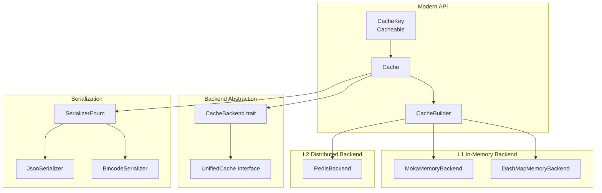
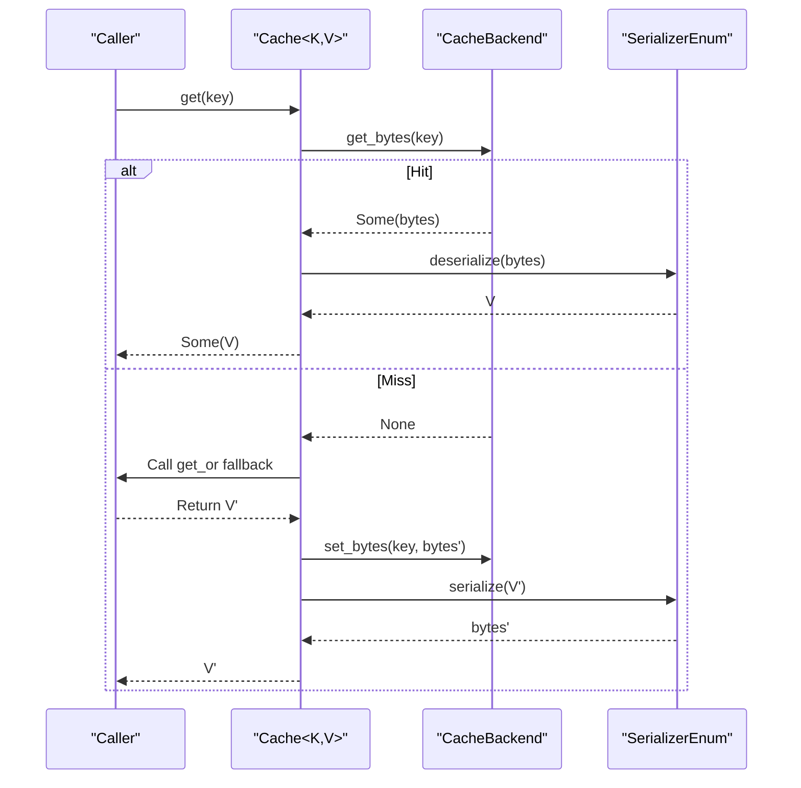
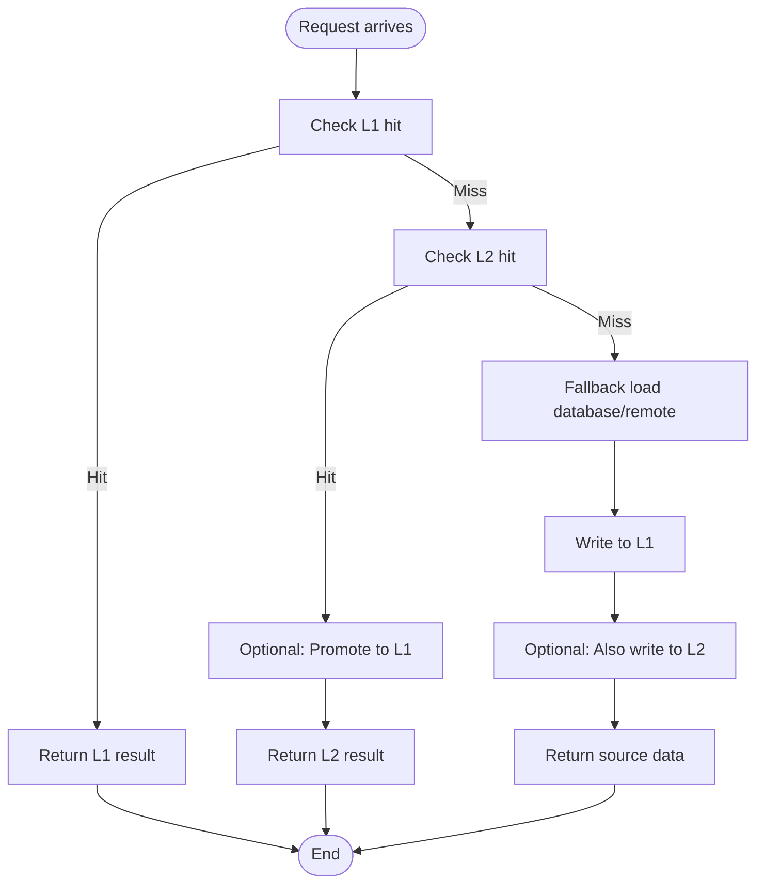
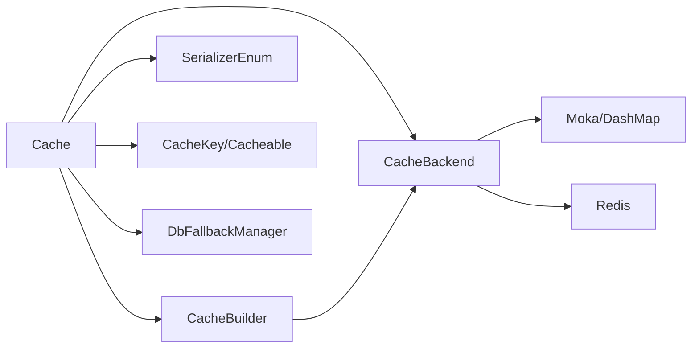

# Core Concepts

<cite>
**Files referenced in this article**
- [src/lib.rs](file://src/lib.rs)
- [src/cache.rs](file://src/cache.rs)
- [src/cache_interface.rs](file://src/cache_interface.rs)
- [src/backend/mod.rs](file://src/backend/mod.rs)
- [src/backend/client/mod.rs](file://src/backend/client/mod.rs)
- [src/builder/cache_builder.rs](file://src/builder/cache_builder.rs)
- [src/traits/cache_key.rs](file://src/traits/cache_key.rs)
- [src/traits/cacheable.rs](file://src/traits/cacheable.rs)
- [src/backend/custom_tiered.rs](file://src/backend/custom_tiered.rs)
- [src/serialization/mod.rs](file://src/serialization/mod.rs)
- [src/client/db_loader.rs](file://src/client/db_loader.rs)
</cite>

## Table of Contents
1. [Introduction](#introduction)
2. [Project Structure](#project-structure)
3. [Core Components](#core-components)
4. [Architecture Overview](#architecture-overview)
5. [Detailed Component Analysis](#detailed-component-analysis)
6. [Dependency Analysis](#dependency-analysis)
7. [Performance Considerations](#performance-considerations)
8. [Troubleshooting Guide](#troubleshooting-guide)
9. [Conclusion](#conclusion)
10. [Appendix](#appendix)

## Introduction
This file is aimed at readers who wish to deeply understand the design and implementation of Oxcache's multi-level cache system. The content revolves around the following topics:
- Multi-level cache architecture (L1 in-memory cache and L2 distributed cache) collaboration mechanisms
- Type-safe cache interface design (generic parameters, constraints, and compile-time guarantees)
- Application of async programming models in cache systems (Future, Pin, Send, etc.)
- Lifecycle management (differences and use cases between TTL and TTI)
- Hit/miss handling processes and data synchronization between L1/L2
- Architecture diagrams and data flow diagrams to help quickly establish overall understanding

## Project Structure
Oxcache adopts a "modern API + pluggable backend" organization:
- Modern API: Provides type-safe unified entry point through Cache<K, V>
- Backend plugins: L1 in-memory backend (Moka/DashMap), L2 distributed backend (Redis), can be enabled on demand
- Configuration and building: Builder pattern provides flexible configuration (TTL, capacity, batch write, auto-promotion, etc.)
- Serialization: Unified Serializer abstraction, supporting JSON/bincode, etc.
- Utilities and extensions: Database fallback, statistics export, feature switches, etc.



**Chart source**
- [src/cache.rs](file://src/cache.rs#L117-L120)
- [src/builder/cache_builder.rs](file://src/builder/cache_builder.rs#L38-L45)
- [src/backend/mod.rs](file://src/backend/mod.rs#L26-L29)
- [src/backend/client/mod.rs](file://src/backend/client/mod.rs#L13-L24)
- [src/serialization/mod.rs](file://src/serialization/mod.rs#L74-L79)

**Section source**
- [src/lib.rs](file://src/lib.rs#L1-L176)
- [src/backend/mod.rs](file://src/backend/mod.rs#L1-L59)

## Core Components
- Cache<K, V>: Type-safe cache entry, encapsulates backend operations, provides high-level APIs like get/set/delete/exists/get_or, and supports batch operations and statistics queries
- CacheBuilder<K, V>: Chainable configuration builder, supports setting TTL, capacity, batch write, auto-promotion, etc.
- CacheKey/Cacheable: Type constraints, ensure keys and values have deterministic string representations and serializable capabilities
- UnifiedCache: Unified abstraction, integrates underlying byte operations, intra-layer operations, distributed locks, batch operations, and statistics
- Backend implementations: MokaMemoryBackend, DashMapMemoryBackend, RedisBackend (enabled by features)
- Serialization: SerializerEnum uniformly encapsulates JSON/bincode, automatically handles serialization/deserialization with Cache's get/set

**Section source**
- [src/cache.rs](file://src/cache.rs#L117-L120)
- [src/builder/cache_builder.rs](file://src/builder/cache_builder.rs#L38-L45)
- [src/traits/cache_key.rs](file://src/traits/cache_key.rs#L38-L49)
- [src/traits/cacheable.rs](file://src/traits/cacheable.rs#L35-L45)
- [src/cache_interface.rs](file://src/cache_interface.rs#L24-L300)
- [src/backend/client/mod.rs](file://src/backend/client/mod.rs#L13-L34)
- [src/serialization/mod.rs](file://src/serialization/mod.rs#L74-L97)

## Architecture Overview
Oxcache's modern API exposes unified interface through Cache<K, V>, internally delegating to specific backends that implement CacheBackend. For multi-level cache scenarios, L1/L2/L3 backends can be combined through custom tiered configuration (CustomTieredConfig); when Redis is not enabled, L2/L3 automatically degrades to in-memory backends.

```mermaid
classDiagram
class Cache_K_V_ {
+new() Result
+memory() Result
+redis(url) Result
+builder() CacheBuilder
+get(key) Result<Option<V>>
+set(key,value) Result
+set_with_ttl(key,value,ttl) Result
+delete(key) Result
+exists(key) Result<bool>
+get_or(key,fallback) Result<V>
+set_many(items) Result
+get_many(keys) Result<HashMap>
+delete_many(keys) Result
+clear() Result
+stats() Result<HashMap>
+health_check() Result<bool>
+shutdown() Result
+to_cache_ops() CacheOps
+register_for_macro(name) void
}
class CacheBuilder_K_V_ {
-backend_builder : Option
-ttl : Option
-capacity : Option
-batch_writes : bool
-auto_promote : bool
+ttl(d) Self
+capacity(n) Self
+batch_writes(bool) Self
+auto_promote(bool) Self
+backend(builder) Self
+build() Result<Cache>
}
class CacheKey {
<<trait>>
+to_key_string() String
}
class Cacheable {
<<trait>>
}
class UnifiedCache {
<<trait>>
+get_bytes(key) Result<Option<Vec<u8>>>
+set_bytes(key,val,ttl) Result
+delete(key) Result
+exists(key) Result<bool>
+clear() Result
+close() Result
+ttl(key) Result<Option<Duration>>
+expire(key,ttl) Result<bool>
+health_check() Result<bool>
+stats() Result<HashMap>
+get_l1_bytes(key) Result<Option<Vec<u8>>>
+get_l2_bytes(key) Result<Option<Vec<u8>>>
+set_l1_bytes(key,val,ttl) Result
+set_l2_bytes(key,val,ttl) Result
+clear_l1() Result
+clear_l2() Result
+lock(key,ttl) Result<Option<String>>
+unlock(key,val) Result<bool>
+get_typed(key) Result<Option<T>>
+set_typed(key,val,ttl) Result
+set_l1_typed(key,val,ttl) Result
+set_l2_typed(key,val,ttl) Result
+get_or_fetch(key,ttl,fetch) Result<T>
+try_get_typed(key) Result<Option<T>>
+remove_typed(key) Result<Option<T>>
+contains(key) Result<bool>
+set_many_bytes(items) Result
+get_many_bytes(keys) Result<HashMap>
+delete_many(keys) Result
+set_many_typed(items) Result
+get_many_typed(keys) Result<HashMap>
+serializer() SerializerEnum
+as_any() Any
+into_any_arc() Any
}
class SerializerEnum {
+serialize(value) Result<Vec<u8>>
+deserialize(data) Result<T>
}
Cache_K_V_ --> CacheBuilder_K_V_ : "uses"
Cache_K_V_ --> UnifiedCache : "delegates"
Cache_K_V_ --> SerializerEnum : "serializes"
CacheBuilder_K_V_ --> Cache_K_V_ : "builds"
Cache_K_V_ ..|> CacheKey : "K : CacheKey"
Cache_K_V_ ..|> Cacheable : "V : Cacheable"
```

**Chart source**
- [src/cache.rs](file://src/cache.rs#L117-L646)
- [src/builder/cache_builder.rs](file://src/builder/cache_builder.rs#L38-L209)
- [src/cache_interface.rs](file://src/cache_interface.rs#L24-L300)
- [src/traits/cache_key.rs](file://src/traits/cache_key.rs#L38-L49)
- [src/traits/cacheable.rs](file://src/traits/cacheable.rs#L35-L45)
- [src/serialization/mod.rs](file://src/serialization/mod.rs#L74-L97)

## Detailed Component Analysis

### Type-Safe Cache Interface Design
- Constraints on generic parameters K, V:
  - K: CacheKey, ensures keys can be converted to stable strings
  - V: Cacheable (when serialization is enabled), ensures values can be serialized/deserialized
- Purpose and benefits:
  - Limit key/value types at compile time, avoid runtime type errors
  - Ensure serialization consistency through trait boundaries, simplify upper-layer calls
- Applicable scenarios:
  - Business entities directly as value types (e.g., users, orders)
  - Custom key types (e.g., UserId wrapper)

**Section source**
- [src/cache.rs](file://src/cache.rs#L134-L138)
- [src/traits/cache_key.rs](file://src/traits/cache_key.rs#L38-L49)
- [src/traits/cacheable.rs](file://src/traits/cacheable.rs#L35-L45)

### Async Programming Model and Concurrency Semantics
- Future/Pin/Send:
  - Cache/K/V methods all return async Futures, internally abstracted through async_trait
  - Ensure cross-task passing and concurrency safety through Send/Sync constraints
  - Batch operations and fallback loading use timeout and retry mechanisms to avoid blocking
- Key manifestations:
  - get/set/delete/exists/stats are all async
  - get_or/fallback_load supports async fallback and timeout control
  - Batch interfaces implemented through iterators + async loops

**Section source**
- [src/cache.rs](file://src/cache.rs#L241-L408)
- [src/cache_interface.rs](file://src/cache_interface.rs#L18-L300)
- [src/client/db_loader.rs](file://src/client/db_loader.rs#L170-L292)

### Lifecycle Management: Differences and Use of TTL vs TTI
- TTL (Time To Live):
  - Starts timing from write moment, expires when time is up
  - Suitable for data with strong "time sensitivity" (e.g., verification codes, temporary tokens)
- TTI (Time To Idle):
  - Starts timing from last access moment, expires when threshold is exceeded
  - Suitable for "hot but irregularly accessed" data (e.g., configuration snapshots)
- Configuration entry points:
  - CacheBuilder supports setting TTL
  - In-memory backends (Moka/DashMap) support TTL/TTI parameters
- Notes:
  - Maximum values of TTL/TTI are limited by configuration validation to avoid resource waste
  - Different backends have varying degrees of support for TTL/TTI, need to enable by features

**Section source**
- [src/builder/cache_builder.rs](file://src/builder/cache_builder.rs#L82-L105)
- [src/backend/custom_tiered.rs](file://src/backend/custom_tiered.rs#L234-L277)
- [src/backend/custom_tiered.rs](file://src/backend/custom_tiered.rs#L684-L732)

### Hit and Miss Handling Processes
- Hit process (Cache<K,V>):
  - Pass underlying byte results to serializer for deserialization to V
- Miss process (Cache<K,V>):
  - Call get_or, if cache is empty, execute fallback function, write to cache and return after success
- Fallback loading (database fallback):
  - Supports single-key and batch fallback with timeout and exponential backoff retry
  - Automatically degrades when health check fails (no fallback triggered)



**Chart source**
- [src/cache.rs](file://src/cache.rs#L241-L408)
- [src/cache_interface.rs](file://src/cache_interface.rs#L133-L197)
- [src/serialization/mod.rs](file://src/serialization/mod.rs#L81-L97)

**Section source**
- [src/cache.rs](file://src/cache.rs#L396-L408)
- [src/client/db_loader.rs](file://src/client/db_loader.rs#L170-L292)

### L1/L2 Layer Collaboration and Data Synchronization
- Tiered backend (CustomTieredConfig):
  - L1: Local high-speed in-memory cache (Moka/DashMap)
  - L2/L3: Local persistent or distributed cache (Redis/Sqlite)
  - Supports automatic repair configuration and tier limit validation
- Promotion strategy (AutoPromote):
  - Can automatically promote L2 data to L1 on miss to reduce subsequent cold start overhead
- Degradation and fault tolerance:
  - When Redis is unavailable, L2/L3 automatically degrades to in-memory backend
- Unified interface:
  - Through UnifiedCache abstraction, masks L1/L2 differences, provides consistent get/set/expire/clear operations externally



**Chart source**
- [src/backend/custom_tiered.rs](file://src/backend/custom_tiered.rs#L766-L800)
- [src/cache_interface.rs](file://src/cache_interface.rs#L438-L487)

**Section source**
- [src/backend/custom_tiered.rs](file://src/backend/custom_tiered.rs#L309-L451)
- [src/cache_interface.rs](file://src/cache_interface.rs#L438-L487)

### Combination of Serialization and Type Safety
- Serializer enum (SerializerEnum):
  - Unified serialize/deserialize interface, supports JSON and bincode
- Cache<K,V> get/set:
  - set: Serialize V first, then write to backend
  - get: Read bytes from backend, then deserialize to V
- Feature switches:
  - When serialization feature is not enabled, get/set returns error prompts to avoid implicit failures

**Section source**
- [src/cache.rs](file://src/cache.rs#L241-L325)
- [src/serialization/mod.rs](file://src/serialization/mod.rs#L74-L97)

## Dependency Analysis
- Module coupling and cohesion:
  - Cache and CacheBuilder are highly cohesive, reduce construction complexity through Builder
  - Backend modules (backend/client) are decoupled from Cache, connected through trait abstraction
  - Serialization module is independent, shared by Cache and backends
- External dependencies and integration:
  - Redis backend enabled by features, automatically degrades when not enabled
  - Database fallback (DbFallbackManager) optionally enabled, avoiding forced dependencies
- Circular dependencies:
  - No circular imports found; module responsibilities are clear



**Chart source**
- [src/cache.rs](file://src/cache.rs#L117-L120)
- [src/builder/cache_builder.rs](file://src/builder/cache_builder.rs#L38-L45)
- [src/backend/client/mod.rs](file://src/backend/client/mod.rs#L13-L34)
- [src/traits/cache_key.rs](file://src/traits/cache_key.rs#L38-L49)
- [src/traits/cacheable.rs](file://src/traits/cacheable.rs#L35-L45)
- [src/client/db_loader.rs](file://src/client/db_loader.rs#L114-L136)

**Section source**
- [src/lib.rs](file://src/lib.rs#L435-L499)
- [src/backend/mod.rs](file://src/backend/mod.rs#L1-L59)

## Performance Considerations
- L1 priority: Prioritizing L1 hits can significantly reduce latency
- Batch writing: Enabling batch write can reduce network/IO overhead (enabled by features)
- Reasonable TTL/TTI settings: Avoid too long causing high memory usage, too short causing frequent fallbacks
- Auto-promotion (AutoPromote): Improves hit rates for hot data
- Serialization cost: JSON is more universal, bincode is more efficient; choose based on scenario
- Timeout and retry: Database fallback should set reasonable timeout and retry to avoid avalanches

## Troubleshooting Guide
- Common issues and localization:
  - get/set reports "serialization feature required": Confirm serialization or full feature is enabled
  - Redis unavailable causing L2/L3 failures: Check connection string and network; system will automatically degrade
  - TTL/TTI configuration exceptions: Check if exceeding maximum value limits
  - Database fallback failures: Check timeout and retry logs, confirm connection pool health
- Recommended steps:
  - Use health_check and stats to investigate backend health and statistics
  - Gradually narrow scope: L1 first, then L2, finally fallback
  - Enable more detailed log levels (trace/debug) to observe serialization and fallback paths

**Section source**
- [src/cache.rs](file://src/cache.rs#L260-L263)
- [src/backend/custom_tiered.rs](file://src/backend/custom_tiered.rs#L234-L277)
- [src/client/db_loader.rs](file://src/client/db_loader.rs#L170-L292)

## Conclusion
Oxcache provides a type-safe, scalable, configurable multi-level cache solution through modern APIs and pluggable backends. Its core advantages are:
- Clear type constraints and serialization abstractions ensure usability and correctness
- Clear async model and timeout/retry mechanisms improve robustness
- Flexible tiered configuration and automatic degradation balance performance and reliability
It is recommended to reasonably set TTL/TTI, enable batch write and auto-promotion according to business characteristics in production environments, and monitor and optimize fallback paths.

## Appendix
- Key terms
  - L1: Local in-memory cache (Moka/DashMap)
  - L2/L3: Local persistent or distributed cache (Redis/Sqlite)
  - TTL: Time To Live (timed from write)
  - TTI: Time To Idle (timed from last access)
  - AutoPromote: Promote L2 data to L1 on miss
