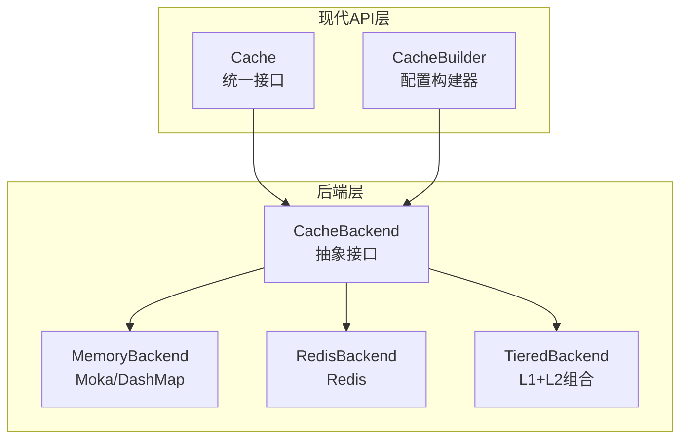
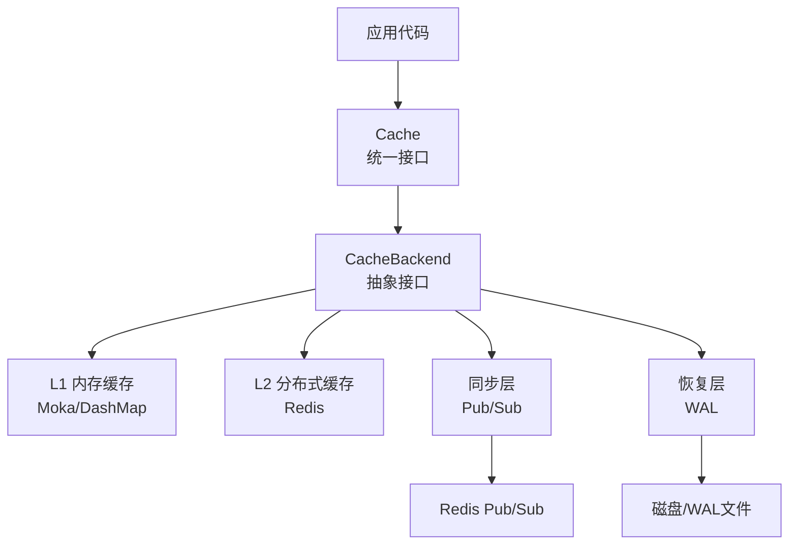
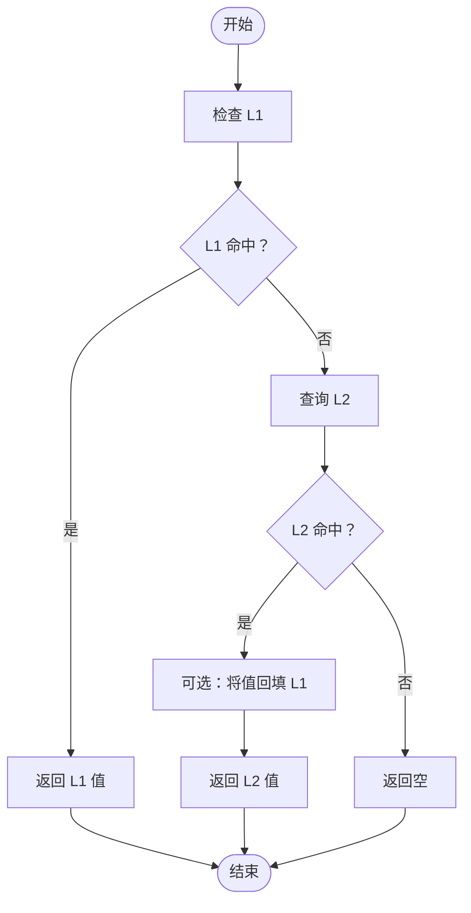
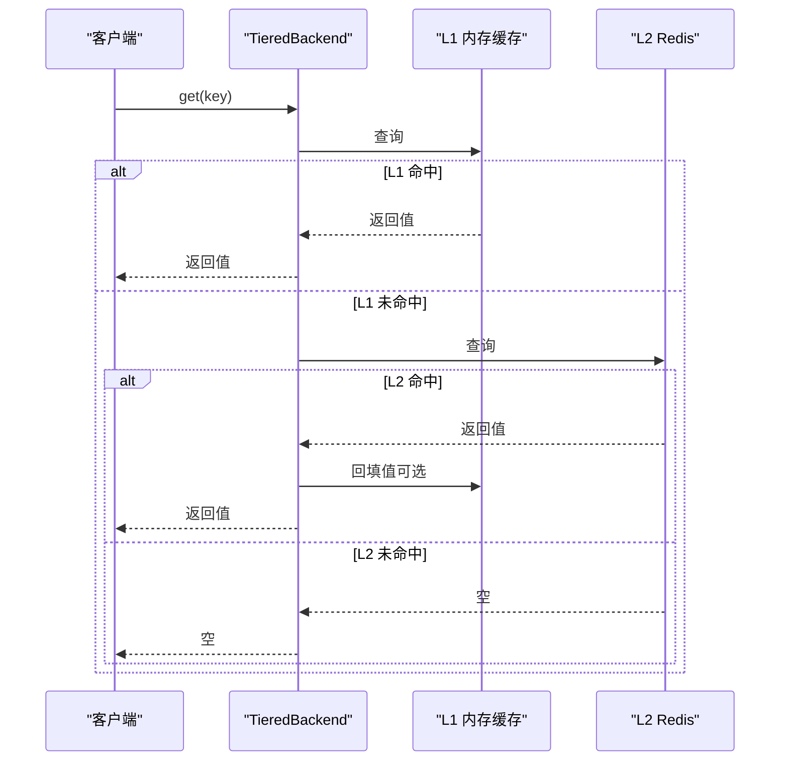
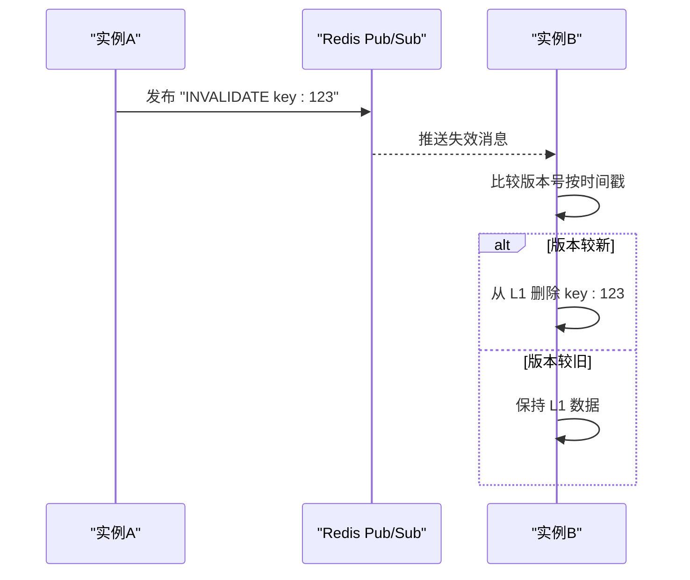
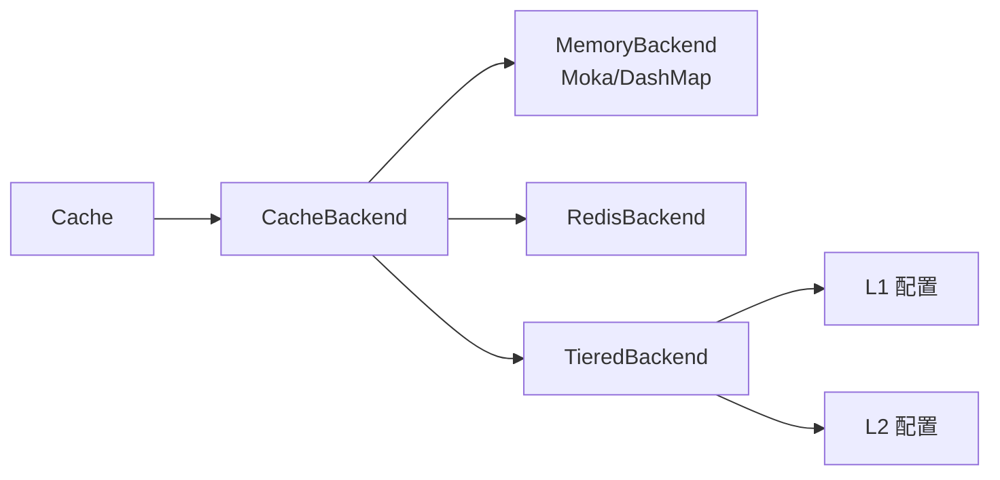

# 多级缓存架构

<cite>
**本文引用的文件**
- [src/lib.rs](file://src/lib.rs)
- [src/cache.rs](file://src/cache.rs)
- [src/backend/mod.rs](file://src/backend/mod.rs)
- [src/backend/interface.rs](file://src/backend/interface.rs)
- [src/backend/custom_tiered.rs](file://src/backend/custom_tiered.rs)
- [src/backend/client/mod.rs](file://src/backend/client/mod.rs)
- [examples/src/02_advanced/example_cache_promotion.rs](file://examples/src/02_advanced/example_cache_promotion.rs)
- [examples/src/02_advanced/example_invalidation.rs](file://examples/src/02_advanced/example_invalidation.rs)
- [docs/ARCHITECTURE.md](file://docs/ARCHITECTURE.md)
</cite>

## 目录
1. [简介](#简介)
2. [项目结构](#项目结构)
3. [核心组件](#核心组件)
4. [架构总览](#架构总览)
5. [详细组件分析](#详细组件分析)
6. [依赖分析](#依赖分析)
7. [性能考量](#性能考量)
8. [故障排查指南](#故障排查指南)
9. [结论](#结论)
10. [附录](#附录)

## 简介
本文件系统性阐述 Oxcache 的多级缓存架构设计，重点围绕 L1 内存缓存与 L2 Redis 分布式缓存的协作机制，包括数据流向、缓存策略、一致性保障与性能优化。文档还解释两级缓存的优势：L1 提供极低延迟的本地访问，L2 提供跨实例共享与持久化能力；并通过失效传播与数据同步机制确保最终一致性。最后给出架构图与流程图，帮助读者快速理解 L1/L2 的交互、命中优先级、回退机制与错误处理。

## 项目结构
Oxcache 采用“现代 API + 插件化后端”的架构组织方式：
- 现代 API 层：对外暴露统一的 Cache<K, V> 接口，屏蔽底层后端差异
- 后端层：抽象出 CacheBackend trait，支持内存、Redis、自定义分层等多种后端
- 配置与构建：通过 Builder 模式与自定义分层配置，灵活组合 L1/L2/L3
- 示例与文档：提供缓存提升、失效策略等实践示例，并配套架构文档

**图表来源**
- [src/cache.rs](file://src/cache.rs#L117-L120)
- [src/backend/interface.rs](file://src/backend/interface.rs#L46-L166)
- [src/backend/mod.rs](file://src/backend/mod.rs#L26-L45)
- [src/backend/client/mod.rs](file://src/backend/client/mod.rs#L13-L28)

**章节来源**
- [src/lib.rs](file://src/lib.rs#L1-L176)
- [src/cache.rs](file://src/cache.rs#L117-L120)
- [src/backend/mod.rs](file://src/backend/mod.rs#L1-L59)
- [src/backend/interface.rs](file://src/backend/interface.rs#L1-L264)
- [src/backend/client/mod.rs](file://src/backend/client/mod.rs#L1-L34)

## 核心组件
- Cache<K, V>：面向用户的统一缓存接口，提供 get/set/get_or 等常用操作，内部委托给 CacheBackend
- CacheBackend trait：定义后端统一能力，包括 get/set/delete/exists/clear/close/ttl/expire/health_check/stats
- MemoryBackend：L1 内存后端，支持 Moka 与 DashMap 两种实现
- RedisBackend：L2 分布式后端，支持 Standalone/Sentinel/Cluster 等模式
- TieredBackend：自定义分层后端，可按需组合 L1/L2/L3，具备层级限制与自动修复能力
- CacheBuilder/CustomTieredConfig：提供高级配置能力，如容量、TTL、序列化、后端类型等

**章节来源**
- [src/cache.rs](file://src/cache.rs#L117-L646)
- [src/backend/interface.rs](file://src/backend/interface.rs#L46-L166)
- [src/backend/mod.rs](file://src/backend/mod.rs#L26-L59)
- [src/backend/custom_tiered.rs](file://src/backend/custom_tiered.rs#L362-L517)

## 架构总览
Oxcache 的多级缓存采用“L1 内存 + L2 Redis”的两级架构，结合批处理、健康检查与 WAL 恢复，实现高吞吐、低延迟与强可观测性。现代 API 通过 Cache<K, V> 对外提供一致体验，内部通过 CacheBackend 抽象对接不同后端。

**图表来源**
- [docs/ARCHITECTURE.md](file://docs/ARCHITECTURE.md#L36-L73)
- [src/cache.rs](file://src/cache.rs#L117-L120)
- [src/backend/interface.rs](file://src/backend/interface.rs#L46-L166)

**章节来源**
- [docs/ARCHITECTURE.md](file://docs/ARCHITECTURE.md#L17-L73)

## 详细组件分析

### L1 内存缓存（Moka/DashMap）
- 设计目标：提供纳秒级延迟的本地缓存，承载热点数据
- 实现要点：
  - Moka：基于 TinyLFU 的 LRU/TinyLFU 混合淘汰策略，适合高并发读写
  - DashMap：纯并发 HashMap，无驱逐策略，适合只读或长生命周期数据
- 配置能力：通过 CustomTieredConfig 为 L1 设置容量、TTL、TTI 等参数
- 性能特征：读写延迟通常在 50-200ns（P99），线程安全且锁粒度细

**章节来源**
- [src/backend/client/mod.rs](file://src/backend/client/mod.rs#L13-L28)
- [src/backend/custom_tiered.rs](file://src/backend/custom_tiered.rs#L684-L732)
- [docs/ARCHITECTURE.md](file://docs/ARCHITECTURE.md#L136-L158)

### L2 Redis 缓存（分布式共享与持久化）
- 设计目标：提供跨实例共享、持久化与高可用能力
- 实现要点：
  - 支持 Standalone/Sentinel/Cluster 模式，具备连接池与自动重连
  - 提供批处理写入（MSET）优化吞吐，结合 WAL 增强可靠性
  - 通过 Pub/Sub 实现跨实例失效传播
- 性能特征：读写延迟通常在 1-5ms（P99），写入可通过批处理达到 200-500K ops/sec

**章节来源**
- [src/backend/client/mod.rs](file://src/backend/client/mod.rs#L25-L28)
- [docs/ARCHITECTURE.md](file://docs/ARCHITECTURE.md#L159-L176)

### TieredBackend（L1/L2 组合）
- 设计目标：在 L1 与 L2 之间建立协同工作流，最大化命中率与延迟表现
- 读路径（命中优先级）：
  1) L1 命中 → 直接返回
  2) L1 未命中 → 查询 L2
  3) L2 命中 → 将值回填 L1（可选提升策略）
  4) L2 未命中 → 返回空
- 写路径（写入策略）：
  1) 写 L1（异步，立即可见）
  2) 写 L2（异步，可批量）
  3) 写 WAL（可选，增强持久化）
  4) 发布失效消息（可选，跨实例一致性）

**图表来源**
- [docs/ARCHITECTURE.md](file://docs/ARCHITECTURE.md#L201-L216)

**章节来源**
- [docs/ARCHITECTURE.md](file://docs/ARCHITECTURE.md#L201-L216)
- [src/backend/custom_tiered.rs](file://src/backend/custom_tiered.rs#L362-L517)

### 缓存提升策略（Promotion）
- 场景：当 L2 命中时，将值回填至 L1，使热数据在后续访问中走 L1 路径
- 示例：参考示例程序，演示从 L2 命中后提升到 L1 的效果

**图表来源**
- [examples/src/02_advanced/example_cache_promotion.rs](file://examples/src/02_advanced/example_cache_promotion.rs#L24-L60)

**章节来源**
- [examples/src/02_advanced/example_cache_promotion.rs](file://examples/src/02_advanced/example_cache_promotion.rs#L1-L66)

### 失效策略与一致性
- 单键失效：delete(key) 同时清理 L1/L2
- 批量失效：clear() 清空 L1/L2
- TTL 失效：通过 set_with_ttl(key, value, ttl) 设置过期时间
- 写入时失效（Write-Invalidation）：更新 key 时直接覆盖，避免陈旧数据
- 跨实例一致性：通过 Redis Pub/Sub 发布失效消息，接收方在 L1 中按版本比较决定是否清除

**图表来源**
- [docs/ARCHITECTURE.md](file://docs/ARCHITECTURE.md#L553-L562)

**章节来源**
- [examples/src/02_advanced/example_invalidation.rs](file://examples/src/02_advanced/example_invalidation.rs#L67-L148)
- [docs/ARCHITECTURE.md](file://docs/ARCHITECTURE.md#L542-L574)

### 错误处理与降级
- L2 故障降级：检测到 Redis 连接异常时切换为 L1-only 模式，继续服务并记录告警
- 网络分区：实例继续使用本地数据，失效消息排队，恢复后通过版本化机制对齐
- 磁盘故障（WAL）：暂停 WAL 写入并记录严重错误，系统继续运行但降低持久性

**章节来源**
- [docs/ARCHITECTURE.md](file://docs/ARCHITECTURE.md#L575-L607)

## 依赖分析
- 现代 API 依赖后端抽象：Cache<K, V> 通过 Arc<dyn CacheBackend> 与具体后端解耦
- 后端实现依赖：MemoryBackend 与 RedisBackend 分别依赖 Moka/DashMap 与 Redis 客户端
- 配置依赖：CustomTieredConfig 通过 BackendProvider 与 LayerBackendConfig 组合 L1/L2/L3
- 特性开关：通过 Cargo features 控制后端可用性（moka、dashmap、redis 等）

**图表来源**
- [src/cache.rs](file://src/cache.rs#L117-L120)
- [src/backend/interface.rs](file://src/backend/interface.rs#L46-L166)
- [src/backend/custom_tiered.rs](file://src/backend/custom_tiered.rs#L766-L799)

**章节来源**
- [src/cache.rs](file://src/cache.rs#L117-L120)
- [src/backend/custom_tiered.rs](file://src/backend/custom_tiered.rs#L766-L799)

## 性能考量
- L1 优化：Moka 的 TinyLFU 淘汰策略与并发设计，提供纳秒级延迟
- L2 优化：批处理写入（MSET）、连接池复用、二进制序列化（Bincode）
- 读路径优化：命中优先走 L1，L2 命中时可回填 L1，减少后续 miss
- 写路径优化：L1 异步写入即时生效，L2 批量写入提升吞吐
- 观测与调优：通过 stats/health_check 获取运行指标，结合配置调整容量与 TTL

**章节来源**
- [docs/ARCHITECTURE.md](file://docs/ARCHITECTURE.md#L608-L646)

## 故障排查指南
- 常见问题
  - L2 不可用：检查 Redis 连接字符串、网络连通性与认证配置
  - 写入吞吐低：确认是否启用批处理写入与合适的批大小
  - 命中率低：评估 L1 容量与 TTL 设置，观察热点数据是否频繁回填 L1
  - 跨实例不一致：确认 Pub/Sub 通道是否正常，版本号比较逻辑是否正确
- 建议步骤
  - 使用 health_check 与 stats 排查后端状态
  - 在 L2 失败时观察系统是否降级为 L1-only
  - 通过日志与指标定位延迟瓶颈（L1 vs L2）

**章节来源**
- [src/cache.rs](file://src/cache.rs#L534-L572)
- [docs/ARCHITECTURE.md](file://docs/ARCHITECTURE.md#L575-L607)

## 结论
Oxcache 的多级缓存架构通过 L1 内存缓存与 L2 Redis 的协同，实现了低延迟与高可用的平衡。借助统一的 CacheBackend 抽象与现代 API，开发者可以以最小成本获得高性能、可观测、可扩展的缓存能力。通过批处理、版本化失效与 WAL 恢复，系统在复杂生产环境中具备良好的韧性与一致性保障。

## 附录
- 适用场景与性能特征
  - L1（内存）：高频读取、短生命周期数据，追求纳秒级延迟
  - L2（Redis）：跨实例共享、持久化需求、热点数据备份，延迟约 1-5ms
  - Tiered（组合）：兼顾命中率与延迟，适合通用业务场景
- 参考示例
  - 缓存提升：[示例](file://examples/src/02_advanced/example_cache_promotion.rs#L24-L60)
  - 失效策略：[示例](file://examples/src/02_advanced/example_invalidation.rs#L67-L148)
