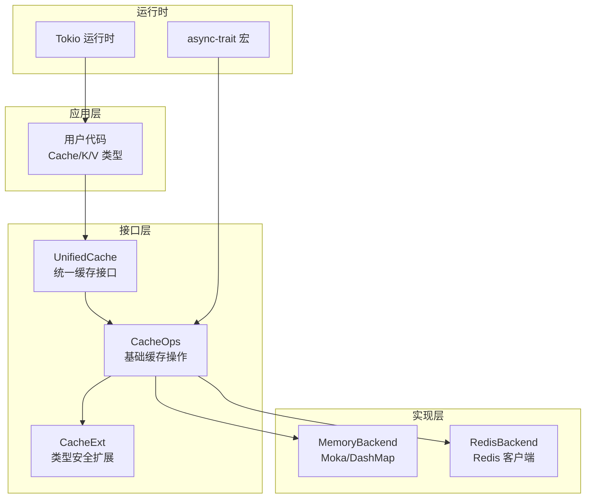
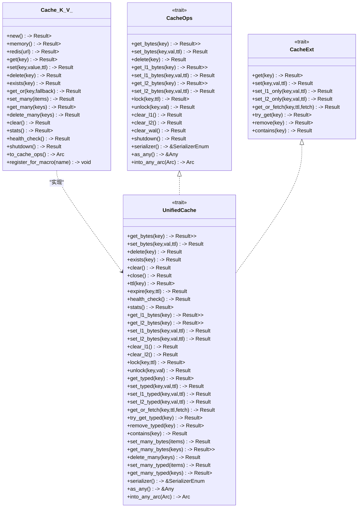
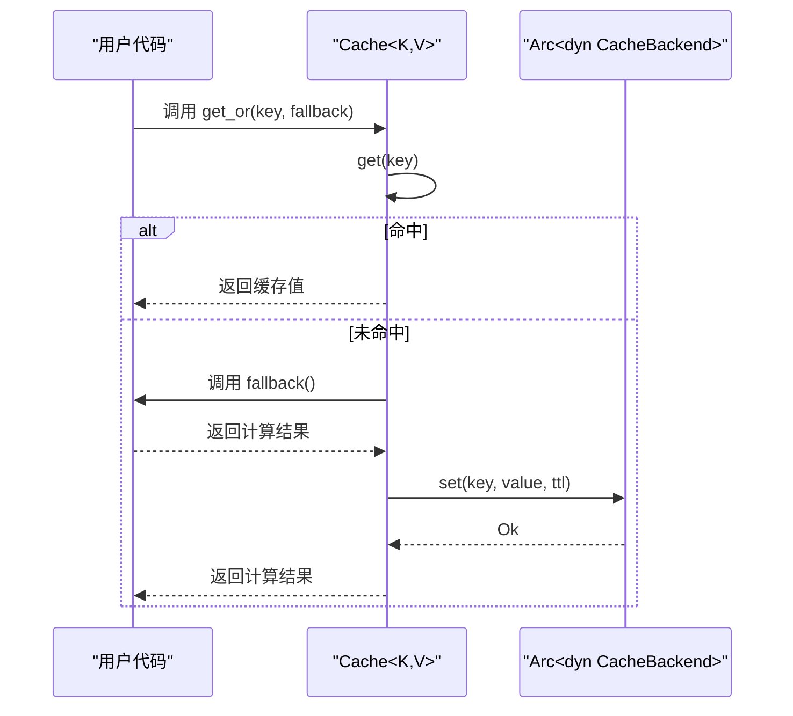
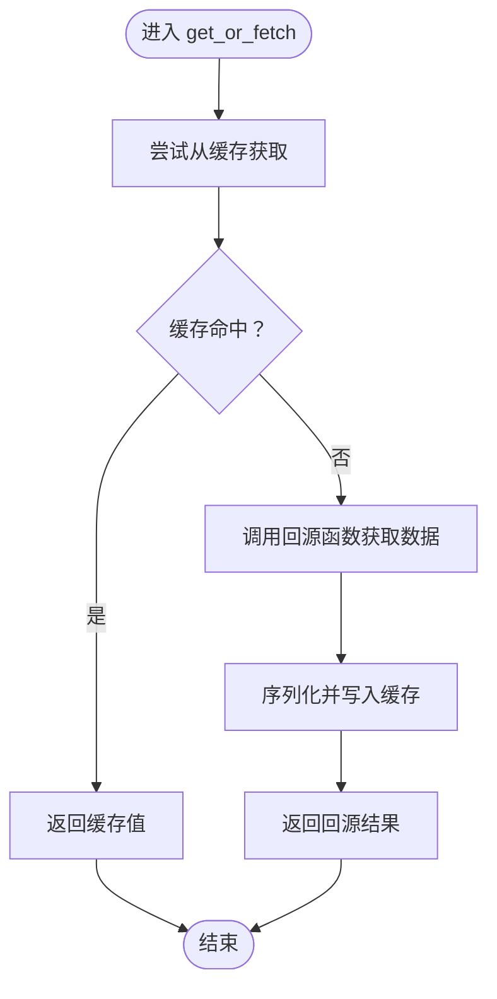
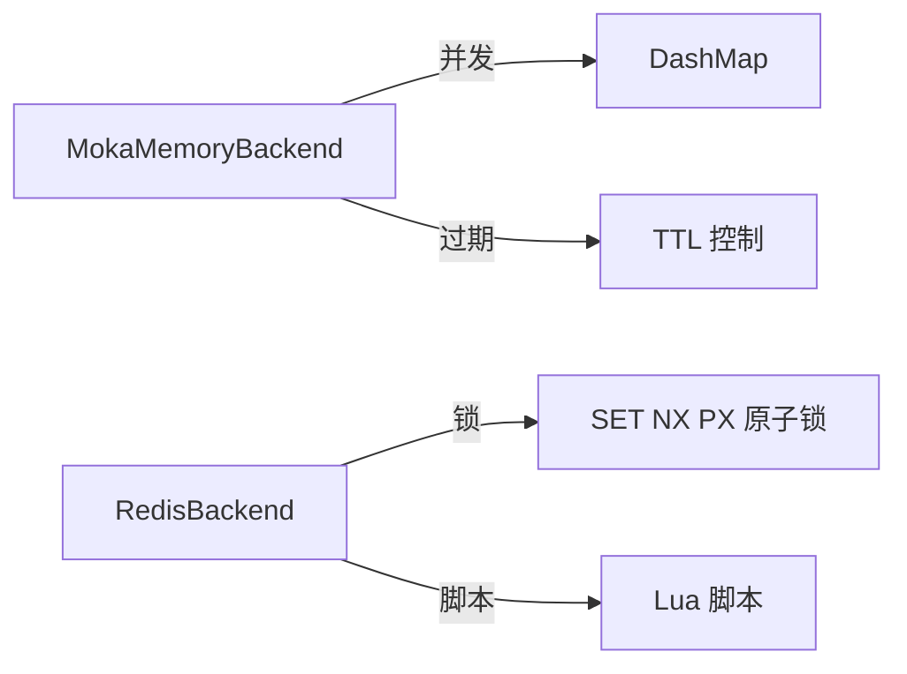
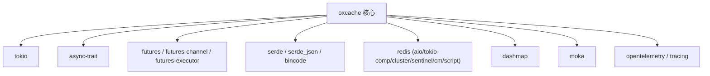

# 异步编程模型

<cite>
**本文引用的文件**
- [src/lib.rs](file://src/lib.rs)
- [src/cache.rs](file://src/cache.rs)
- [src/cache_interface.rs](file://src/cache_interface.rs)
- [src/client/mod.rs](file://src/client/mod.rs)
- [src/backend/mod.rs](file://src/backend/mod.rs)
- [src/backend/client/mod.rs](file://src/backend/client/mod.rs)
- [Cargo.toml](file://Cargo.toml)
- [examples/target/debug/deps/async_trait-02ab9dc49d625e62.d](file://examples/target/debug/deps/async_trait-02ab9dc49d625e62.d)
- [examples/target/debug/deps/futures_channel-659b6d78f2e818fa.d](file://examples/target/debug/deps/futures_channel-659b6d78f2e818fa.d)
- [examples/target/debug/deps/futures_executor-751fff1e65e0add5.d](file://examples/target/debug/deps/futures_executor-751fff1e65e0add5.d)
- [examples/target/debug/deps/pin_project_internal-d9484dde4e785ea9.d](file://examples/target/debug/deps/pin_project_internal-d9484dde4e785ea9.d)
- [examples/target/debug/deps/pin_project_lite-34f8cf99cf65284d.d](file://examples/target/debug/deps/pin_project_lite-34f8cf99cf65284d.d)
- [examples/target/debug/deps/pin_utils-e9ec6c8ec04d919e.d](file://examples/target/debug/deps/pin_utils-e9ec6c8ec04d919e.d)
- [tests/integration/lock_warmup_test.rs](file://tests/integration/lock_warmup_test.rs)
- [tests/integration/single_flight_test.rs](file://tests/integration/single_flight_test.rs)
</cite>

## 目录
1. [简介](#简介)
2. [项目结构](#项目结构)
3. [核心组件](#核心组件)
4. [架构总览](#架构总览)
5. [详细组件分析](#详细组件分析)
6. [依赖分析](#依赖分析)
7. [性能考虑](#性能考虑)
8. [故障排查指南](#故障排查指南)
9. [结论](#结论)

## 简介
本文件围绕 Oxcache 在异步编程模型下的设计与实现进行深入解析，重点覆盖以下主题：
- 异步接口与 Future、Pin、Send 等异步概念的应用
- async_trait 的使用与异步接口设计原则
- 生命周期管理与资源释放策略
- 并发控制（锁机制、原子操作与无锁数据结构）
- 错误处理、超时控制与取消机制
- 与 Tokio 运行时的集成与性能优化

## 项目结构
Oxcache 采用“现代 API + 插件式后端”的分层架构，核心入口位于根模块导出，统一对外暴露 Cache、UnifiedCache、CacheOps 等异步接口；后端通过特性开关选择内存或 Redis 实现，并以 trait 抽象屏蔽差异。

图示来源
- [src/lib.rs](file://src/lib.rs#L517-L639)
- [src/cache_interface.rs](file://src/cache_interface.rs#L18-L300)
- [src/client/mod.rs](file://src/client/mod.rs#L18-L305)
- [src/backend/client/mod.rs](file://src/backend/client/mod.rs#L1-L34)

章节来源
- [src/lib.rs](file://src/lib.rs#L517-L639)
- [src/cache_interface.rs](file://src/cache_interface.rs#L18-L300)
- [src/client/mod.rs](file://src/client/mod.rs#L18-L305)
- [src/backend/client/mod.rs](file://src/backend/client/mod.rs#L1-L34)

## 核心组件
- Cache<K, V>：面向用户的统一缓存类型，封装底层 CacheBackend，提供类型安全的 get/set/delete/exists 等异步操作，以及 get_or、批量操作、统计查询、健康检查、优雅关闭等高级能力。
- UnifiedCache：统一抽象，合并 CacheBackend、CacheOps、CacheExt 的能力，提供统一的字节级与类型级操作、分层操作、分布式锁、批量操作、统计与健康检查。
- CacheOps/CacheExt：分别定义字节级与类型级操作接口，支持 L1/L2 分层写入、分布式锁、批量操作、健康检查与统计。
- 后端实现：MemoryBackend（Moka/DashMap）、RedisBackend（可选），通过特性开关启用。

章节来源
- [src/cache.rs](file://src/cache.rs#L117-L646)
- [src/cache_interface.rs](file://src/cache_interface.rs#L18-L300)
- [src/client/mod.rs](file://src/client/mod.rs#L18-L305)
- [src/backend/client/mod.rs](file://src/backend/client/mod.rs#L1-L34)

## 架构总览
Oxcache 的异步架构以 async_trait 为基石，通过 trait 对外暴露统一的异步接口；内部以 Arc<dyn Trait> 承载后端实现，确保跨层传递与生命周期管理的一致性；运行时由 Tokio 提供异步调度与并发原语。

图示来源
- [src/cache.rs](file://src/cache.rs#L117-L646)
- [src/cache_interface.rs](file://src/cache_interface.rs#L18-L300)
- [src/client/mod.rs](file://src/client/mod.rs#L18-L305)

## 详细组件分析

### 组件一：Cache<K, V> 的异步接口与生命周期
- 异步接口：所有读写操作均返回 Result<T>，内部通过 await 调用底层 CacheBackend 的异步方法，保证非阻塞。
- 生命周期：提供 shutdown() 优雅关闭后端连接；clear() 清空缓存；health_check() 健康检查；stats() 获取统计信息。
- 类型安全：通过 serde 序列化/反序列化实现类型安全的 get/set；当未启用序列化特性时，get/set 会返回错误提示。
- 高级模式：get_or 提供缓存-旁路（cache-aside）模式，先查缓存，缺失则回源计算并写回缓存。

图示来源
- [src/cache.rs](file://src/cache.rs#L396-L408)
- [src/cache.rs](file://src/cache.rs#L241-L264)

章节来源
- [src/cache.rs](file://src/cache.rs#L117-L646)

### 组件二：UnifiedCache 的统一抽象与分层能力
- 统一抽象：将 CacheBackend、CacheOps、CacheExt 能力整合到单一接口，便于上层统一调用。
- 分层操作：提供 get_l1_bytes/get_l2_bytes/set_l1_bytes/set_l2_bytes/clear_l1/clear_l2 等分层操作，默认未实现的分层操作返回 NotSupported 错误。
- 分布式锁：lock/unlock 提供基于 Redis 的分布式锁能力（需后端支持）。
- 批量操作：set_many_bytes/get_many_bytes/delete_many/set_many_typed/get_many_typed 提供高性能批量读写。
- 序列化：serializer() 返回当前使用的序列化器，支持 JSON/Bincode 等格式。

图示来源
- [src/cache_interface.rs](file://src/cache_interface.rs#L178-L197)

章节来源
- [src/cache_interface.rs](file://src/cache_interface.rs#L18-L300)

### 组件三：CacheOps/CacheExt 的异步设计与 Send/Sync 边界
- async_trait：通过 async_trait 宏为 trait 自动生成异步分发代码，使 trait 方法可异步调用。
- Send/Sync：CacheOps/CacheExt/UnifiedCache 均标注 Send + Sync，确保跨线程安全传递与并发访问。
- Any 转换：as_any/into_any_arc 支持动态类型转换与 Arc 下的向下转型，便于框架内注册与管理。

章节来源
- [src/client/mod.rs](file://src/client/mod.rs#L18-L305)
- [src/cache_interface.rs](file://src/cache_interface.rs#L24-L300)

### 组件四：后端实现与并发控制
- 内存后端：MokaMemoryBackend（TinyLFU/LRU + 自动过期）与 DashMapMemoryBackend（并发哈希表 + 手动 TTL），均通过特性开关启用。
- Redis 后端：RedisBackend（可选），支持集群、哨兵、脚本等高级特性，配合 lock/unlock 实现分布式锁。
- 并发控制：内存后端使用并发容器（DashMap/Moka）实现无锁/低锁开销；Redis 后端通过 SET NX PX 原子命令实现分布式锁。

图示来源
- [src/backend/client/mod.rs](file://src/backend/client/mod.rs#L1-L34)
- [tests/integration/lock_warmup_test.rs](file://tests/integration/lock_warmup_test.rs#L46-L77)

章节来源
- [src/backend/client/mod.rs](file://src/backend/client/mod.rs#L1-L34)
- [tests/integration/lock_warmup_test.rs](file://tests/integration/lock_warmup_test.rs#L46-L77)

### 组件五：Pin、Future 与运行时集成
- Future：所有异步方法返回 Future，通过 await 在 Tokio 中调度执行。
- Pin：在宏展开与 trait 对象分发过程中，Pin 语义确保悬垂指针安全；项目中通过 async-trait 与 futures-channel 等生态间接体现 Pin 的稳定性。
- Tokio：Tokio 1.x 提供 full 特性，启用计时器、I/O、任务调度等能力；与 redis/aio、tokio-util 等协作完成高性能异步网络与批处理。

章节来源
- [Cargo.toml](file://Cargo.toml#L25-L28)
- [Cargo.toml](file://Cargo.toml#L85-L89)
- [Cargo.toml](file://Cargo.toml#L169-L176)
- [examples/target/debug/deps/async_trait-02ab9dc49d625e62.d](file://examples/target/debug/deps/async_trait-02ab9dc49d625e62.d#L1-L12)
- [examples/target/debug/deps/futures_channel-659b6d78f2e818fa.d](file://examples/target/debug/deps/futures_channel-659b6d78f2e818fa.d#L1-L3)
- [examples/target/debug/deps/futures_executor-751fff1e65e0add5.d](file://examples/target/debug/deps/futures_executor-751fff1e65e0add5.d#L1-L9)
- [examples/target/debug/deps/pin_project_internal-d9484dde4e785ea9.d](file://examples/target/debug/deps/pin_project_internal-d9484dde4e785ea9.d#L5-L12)
- [examples/target/debug/deps/pin_project_lite-34f8cf99cf65284d.d](file://examples/target/debug/deps/pin_project_lite-34f8cf99cf65284d.d#L1-L7)
- [examples/target/debug/deps/pin_utils-e9ec6c8ec04d919e.d](file://examples/target/debug/deps/pin_utils-e9ec6c8ec04d919e.d#L1-L9)

## 依赖分析
- 运行时与异步生态：Tokio、async-trait、futures、futures-channel、futures-executor 等构成异步执行与通道基础设施。
- 序列化：serde/serde_json/bincode 等用于类型安全的序列化与反序列化。
- Redis：redis（aio、tokio-comp、cluster-async、sentinel、connection-manager、script）提供高性能异步 Redis 访问。
- 并发工具：dashmap、moka、crossbeam-queue 等用于无锁/低锁并发数据结构。
- 观测性：opentelemetry、tracing、tracing-opentelemetry、opentelemetry-otlp 等用于指标与日志采集。

图示来源
- [Cargo.toml](file://Cargo.toml#L20-L186)
- [Cargo.toml](file://Cargo.toml#L141-L165)

章节来源
- [Cargo.toml](file://Cargo.toml#L20-L186)

## 性能考虑
- 无锁/低锁并发：优先使用 DashMap/Moka 等并发容器，降低锁竞争；Redis 后端通过原子命令实现分布式锁，避免额外协调成本。
- 批量写入：通过 set_many_typed/set_many_bytes 减少网络往返与序列化开销。
- 序列化策略：根据场景选择 JSON/Bincode，结合 compression/flate2 优化存储体积。
- 运行时优化：release 配置启用 LTO、单代码单元、移除 panic 回溯与调试符号，提升二进制体积与执行效率。
- 资源复用：Redis 连接池与连接管理特性减少连接创建与销毁开销。

## 故障排查指南
- 序列化特性缺失：未启用 serialization/serialization-cache 时，类型安全的 get/set 会报错；请启用对应特性或改用字节级接口。
- 分布式锁未实现：部分后端（如纯内存后端）默认不支持 lock/unlock；需要 Redis 后端或自定义实现。
- 单飞/去重：新 API 需要新的 TieredBackend 实现；当前单飞模式测试为占位，需按需扩展。
- 生命周期与优雅关闭：使用 shutdown() 释放后端资源；注意在应用退出前调用，避免资源泄漏。

章节来源
- [src/cache.rs](file://src/cache.rs#L245-L264)
- [src/cache_interface.rs](file://src/cache_interface.rs#L63-L114)
- [tests/integration/single_flight_test.rs](file://tests/integration/single_flight_test.rs#L20-L24)

## 结论
Oxcache 在异步编程模型下，通过 async_trait 抽象统一异步接口，以 Arc<dyn Trait> 实现跨层传递与生命周期管理；后端以特性开关灵活选择内存或 Redis 实现，并借助并发容器与原子命令实现高效并发控制。结合 Tokio 运行时与生态工具，项目在性能、可维护性与可扩展性之间取得良好平衡。建议在生产环境中启用必要的观测性与压缩特性，并针对业务场景选择合适的序列化与后端实现。
