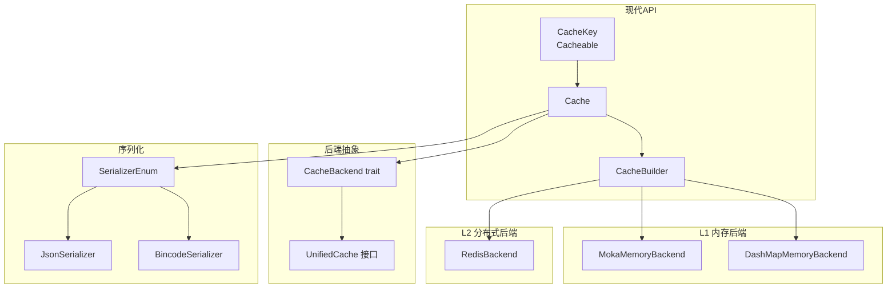
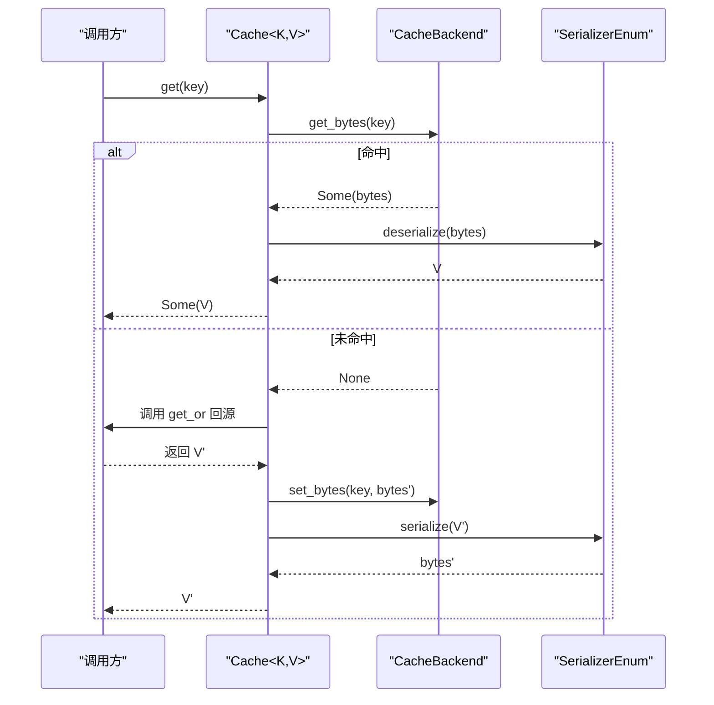
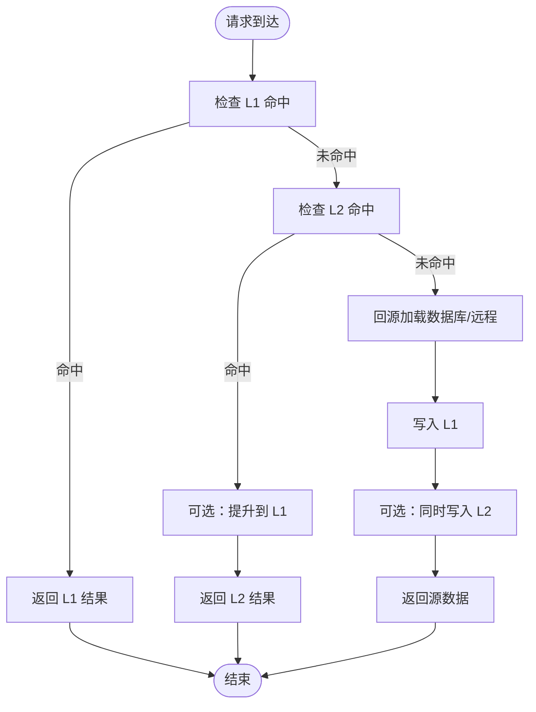
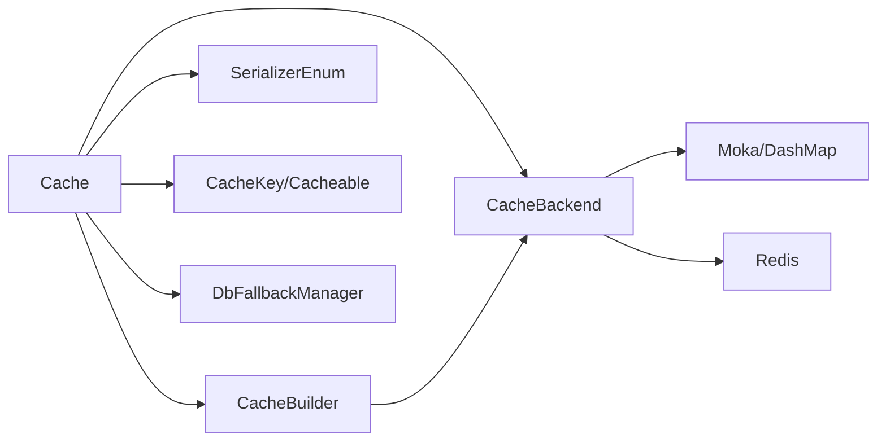

# 核心概念

<cite>
**本文引用的文件**
- [src/lib.rs](file://src/lib.rs)
- [src/cache.rs](file://src/cache.rs)
- [src/cache_interface.rs](file://src/cache_interface.rs)
- [src/backend/mod.rs](file://src/backend/mod.rs)
- [src/backend/client/mod.rs](file://src/backend/client/mod.rs)
- [src/builder/cache_builder.rs](file://src/builder/cache_builder.rs)
- [src/traits/cache_key.rs](file://src/traits/cache_key.rs)
- [src/traits/cacheable.rs](file://src/traits/cacheable.rs)
- [src/backend/custom_tiered.rs](file://src/backend/custom_tiered.rs)
- [src/serialization/mod.rs](file://src/serialization/mod.rs)
- [src/client/db_loader.rs](file://src/client/db_loader.rs)
</cite>

## 目录
1. [引言](#引言)
2. [项目结构](#项目结构)
3. [核心组件](#核心组件)
4. [架构总览](#架构总览)
5. [详细组件分析](#详细组件分析)
6. [依赖关系分析](#依赖关系分析)
7. [性能考量](#性能考量)
8. [故障排查指南](#故障排查指南)
9. [结论](#结论)
10. [附录](#附录)

## 引言
本文件面向希望深入理解 Oxcache 多级缓存系统的设计与实现的读者。内容围绕以下主题展开：
- 多级缓存架构（L1 内存缓存与 L2 分布式缓存）协作机制
- 类型安全的缓存接口设计（泛型参数、约束与编译期保证）
- 异步编程模型在缓存系统中的应用（Future、Pin、Send 等）
- 生命周期管理（TTL 与 TTI 的区别与使用场景）
- 命中/未命中处理流程与 L1/L2 间的数据同步
- 架构图与数据流图，帮助快速建立整体认知

## 项目结构
Oxcache 采用“现代 API + 插件化后端”的组织方式：
- 现代 API：通过 Cache<K, V> 提供类型安全的统一入口
- 后端插件：L1 内存后端（Moka/DashMap），L2 分布式后端（Redis），可按需启用
- 配置与构建：Builder 模式提供灵活配置（TTL、容量、批写、自动提升等）
- 序列化：统一 Serializer 抽象，支持 JSON/bincode 等
- 工具与扩展：数据库回源、统计导出、特性开关等



**图表来源**
- [src/cache.rs](file://src/cache.rs#L117-L120)
- [src/builder/cache_builder.rs](file://src/builder/cache_builder.rs#L38-L45)
- [src/backend/mod.rs](file://src/backend/mod.rs#L26-L29)
- [src/backend/client/mod.rs](file://src/backend/client/mod.rs#L13-L24)
- [src/serialization/mod.rs](file://src/serialization/mod.rs#L74-L79)

**章节来源**
- [src/lib.rs](file://src/lib.rs#L1-L176)
- [src/backend/mod.rs](file://src/backend/mod.rs#L1-L59)

## 核心组件
- Cache<K, V>：类型安全的缓存入口，封装后端操作，提供 get/set/delete/exists/get_or 等高级 API，并支持批量操作与统计查询
- CacheBuilder<K, V>：链式配置构建器，支持设置 TTL、容量、批写、自动提升等
- CacheKey/Cacheable：类型约束，确保键与值具备确定的字符串表示与可序列化能力
- UnifiedCache：统一抽象，整合底层字节操作、层内操作、分布式锁、批量操作与统计
- 后端实现：MokaMemoryBackend、DashMapMemoryBackend、RedisBackend（按特性启用）
- 序列化：SerializerEnum 统一封装 JSON/bincode，配合 Cache 的 get/set 自动完成序列化/反序列化

**章节来源**
- [src/cache.rs](file://src/cache.rs#L117-L120)
- [src/builder/cache_builder.rs](file://src/builder/cache_builder.rs#L38-L45)
- [src/traits/cache_key.rs](file://src/traits/cache_key.rs#L38-L49)
- [src/traits/cacheable.rs](file://src/traits/cacheable.rs#L35-L45)
- [src/cache_interface.rs](file://src/cache_interface.rs#L24-L300)
- [src/backend/client/mod.rs](file://src/backend/client/mod.rs#L13-L34)
- [src/serialization/mod.rs](file://src/serialization/mod.rs#L74-L97)

## 架构总览
Oxcache 的现代 API 通过 Cache<K, V> 对外暴露统一接口，内部委托给实现了 CacheBackend 的具体后端。对于多级缓存场景，可通过自定义分层配置（CustomTieredConfig）组合 L1/L2/L3 后端；在未启用 Redis 的情况下，L2/L3 会自动降级为内存后端。

```mermaid
classDiagram
class Cache_K_V_ {
+new() Result
+memory() Result
+redis(url) Result
+builder() CacheBuilder
+get(key) Result<Option<V>>
+set(key,value) Result
+set_with_ttl(key,value,ttl) Result
+delete(key) Result
+exists(key) Result<bool>
+get_or(key,fallback) Result<V>
+set_many(items) Result
+get_many(keys) Result<HashMap>
+delete_many(keys) Result
+clear() Result
+stats() Result<HashMap>
+health_check() Result<bool>
+shutdown() Result
+to_cache_ops() CacheOps
+register_for_macro(name) void
}
class CacheBuilder_K_V_ {
-backend_builder : Option
-ttl : Option
-capacity : Option
-batch_writes : bool
-auto_promote : bool
+ttl(d) Self
+capacity(n) Self
+batch_writes(bool) Self
+auto_promote(bool) Self
+backend(builder) Self
+build() Result<Cache>
}
class CacheKey {
<<trait>>
+to_key_string() String
}
class Cacheable {
<<trait>>
}
class UnifiedCache {
<<trait>>
+get_bytes(key) Result<Option<Vec<u8>>>
+set_bytes(key,val,ttl) Result
+delete(key) Result
+exists(key) Result<bool>
+clear() Result
+close() Result
+ttl(key) Result<Option<Duration>>
+expire(key,ttl) Result<bool>
+health_check() Result<bool>
+stats() Result<HashMap>
+get_l1_bytes(key) Result<Option<Vec<u8>>>
+get_l2_bytes(key) Result<Option<Vec<u8>>>
+set_l1_bytes(key,val,ttl) Result
+set_l2_bytes(key,val,ttl) Result
+clear_l1() Result
+clear_l2() Result
+lock(key,ttl) Result<Option<String>>
+unlock(key,val) Result<bool>
+get_typed(key) Result<Option<T>>
+set_typed(key,val,ttl) Result
+set_l1_typed(key,val,ttl) Result
+set_l2_typed(key,val,ttl) Result
+get_or_fetch(key,ttl,fetch) Result<T>
+try_get_typed(key) Result<Option<T>>
+remove_typed(key) Result<Option<T>>
+contains(key) Result<bool>
+set_many_bytes(items) Result
+get_many_bytes(keys) Result<HashMap>
+delete_many(keys) Result
+set_many_typed(items) Result
+get_many_typed(keys) Result<HashMap>
+serializer() SerializerEnum
+as_any() Any
+into_any_arc() Any
}
class SerializerEnum {
+serialize(value) Result<Vec<u8>>
+deserialize(data) Result<T>
}
Cache_K_V_ --> CacheBuilder_K_V_ : "使用"
Cache_K_V_ --> UnifiedCache : "委托"
Cache_K_V_ --> SerializerEnum : "序列化"
CacheBuilder_K_V_ --> Cache_K_V_ : "构建"
Cache_K_V_ ..|> CacheKey : "K : CacheKey"
Cache_K_V_ ..|> Cacheable : "V : Cacheable"
```

**图表来源**
- [src/cache.rs](file://src/cache.rs#L117-L646)
- [src/builder/cache_builder.rs](file://src/builder/cache_builder.rs#L38-L209)
- [src/cache_interface.rs](file://src/cache_interface.rs#L24-L300)
- [src/traits/cache_key.rs](file://src/traits/cache_key.rs#L38-L49)
- [src/traits/cacheable.rs](file://src/traits/cacheable.rs#L35-L45)
- [src/serialization/mod.rs](file://src/serialization/mod.rs#L74-L97)

## 详细组件分析

### 类型安全的缓存接口设计
- 泛型参数 K、V 的约束：
  - K: CacheKey，确保键可转换为稳定字符串
  - V: Cacheable（在启用序列化的前提下），确保值可序列化/反序列化
- 作用与收益：
  - 在编译期限定键/值类型，避免运行时类型错误
  - 通过 trait 边界保证序列化一致性，简化上层调用
- 适用场景：
  - 业务实体直接作为值类型（如用户、订单）
  - 自定义键类型（如 UserId 包装器）

**章节来源**
- [src/cache.rs](file://src/cache.rs#L134-L138)
- [src/traits/cache_key.rs](file://src/traits/cache_key.rs#L38-L49)
- [src/traits/cacheable.rs](file://src/traits/cacheable.rs#L35-L45)

### 异步编程模型与并发语义
- Future/Pin/Send：
  - Cache/K/V 的方法均返回异步 Future，内部通过 async_trait 抽象
  - 通过 Send/Sync 约束保证跨任务传递与并发安全
  - 批量操作与回源加载均采用超时与重试机制，避免阻塞
- 关键体现：
  - get/set/delete/exists/stats 等均为 async
  - get_or/fallback_load 支持异步回源与超时控制
  - 批量接口通过迭代器 + 异步循环实现

**章节来源**
- [src/cache.rs](file://src/cache.rs#L241-L408)
- [src/cache_interface.rs](file://src/cache_interface.rs#L18-L300)
- [src/client/db_loader.rs](file://src/client/db_loader.rs#L170-L292)

### 生命周期管理：TTL 与 TTI 的区别与使用
- TTL（生存时间）：
  - 从写入时刻开始计时，到期即失效
  - 适合“时效性”强的数据（如验证码、临时令牌）
- TTI（闲置时间）：
  - 从最近访问时刻开始计时，超过阈值则失效
  - 适合“热点但不定时访问”的数据（如配置快照）
- 配置入口：
  - CacheBuilder 支持设置 TTL
  - 内存后端（Moka/DashMap）支持 TTL/TTI 参数
- 注意事项：
  - TTL/TTI 的最大值受配置校验限制，避免过大导致资源浪费
  - 不同后端对 TTL/TTI 的支持程度不同，需按特性启用

**章节来源**
- [src/builder/cache_builder.rs](file://src/builder/cache_builder.rs#L82-L105)
- [src/backend/custom_tiered.rs](file://src/backend/custom_tiered.rs#L234-L277)
- [src/backend/custom_tiered.rs](file://src/backend/custom_tiered.rs#L684-L732)

### 命中与未命中的处理流程
- 命中流程（Cache<K,V>）：
  - 将底层字节结果交给序列化器反序列化为 V
- 未命中流程（Cache<K,V>）：
  - 调用 get_or，若缓存为空则执行回源函数，成功后写入缓存并返回
- 回源加载（数据库回源）：
  - 支持单键与批量回源，带超时与指数退避重试
  - 健康检查失败时自动降级（不触发回源）



**图表来源**
- [src/cache.rs](file://src/cache.rs#L241-L408)
- [src/cache_interface.rs](file://src/cache_interface.rs#L133-L197)
- [src/serialization/mod.rs](file://src/serialization/mod.rs#L81-L97)

**章节来源**
- [src/cache.rs](file://src/cache.rs#L396-L408)
- [src/client/db_loader.rs](file://src/client/db_loader.rs#L170-L292)

### L1/L2 层协作与数据同步
- 分层后端（CustomTieredConfig）：
  - L1：本地高速内存缓存（Moka/DashMap）
  - L2/L3：本地持久化或分布式缓存（Redis/Sqlite）
  - 支持自动修复配置与层级限制校验
- 升级策略（AutoPromote）：
  - 未命中时可将 L2 数据自动提升至 L1，减少后续冷启动开销
- 降级与容错：
  - 当 Redis 不可用时，L2/L3 自动降级为内存后端
- 统一接口：
  - 通过 UnifiedCache 抽象，屏蔽 L1/L2 的差异，对外提供一致的 get/set/expire/clear 等操作



**图表来源**
- [src/backend/custom_tiered.rs](file://src/backend/custom_tiered.rs#L766-L800)
- [src/cache_interface.rs](file://src/cache_interface.rs#L438-L487)

**章节来源**
- [src/backend/custom_tiered.rs](file://src/backend/custom_tiered.rs#L309-L451)
- [src/cache_interface.rs](file://src/cache_interface.rs#L438-L487)

### 序列化与类型安全的结合
- 序列化器枚举（SerializerEnum）：
  - 统一 serialize/deserialize 接口，支持 JSON 与 bincode
- Cache<K,V> 的 get/set：
  - set：先序列化 V，再写入后端
  - get：从后端读取字节，再反序列化为 V
- 特性开关：
  - 未启用序列化特性时，get/set 会返回错误提示，避免隐式失败

**章节来源**
- [src/cache.rs](file://src/cache.rs#L241-L325)
- [src/serialization/mod.rs](file://src/serialization/mod.rs#L74-L97)

## 依赖关系分析
- 模块耦合与内聚：
  - Cache 与 CacheBuilder 高内聚，通过 Builder 降低构造复杂度
  - 后端模块（backend/client）与 Cache 解耦，通过 trait 抽象对接
  - 序列化模块独立，被 Cache 与后端共享
- 外部依赖与集成：
  - Redis 后端按特性启用，未启用时自动降级
  - 数据库回源（DbFallbackManager）可选启用，避免强制依赖
- 循环依赖：
  - 未发现循环导入；各模块职责清晰



**图表来源**
- [src/cache.rs](file://src/cache.rs#L117-L120)
- [src/builder/cache_builder.rs](file://src/builder/cache_builder.rs#L38-L45)
- [src/backend/client/mod.rs](file://src/backend/client/mod.rs#L13-L34)
- [src/traits/cache_key.rs](file://src/traits/cache_key.rs#L38-L49)
- [src/traits/cacheable.rs](file://src/traits/cacheable.rs#L35-L45)
- [src/client/db_loader.rs](file://src/client/db_loader.rs#L114-L136)

**章节来源**
- [src/lib.rs](file://src/lib.rs#L435-L499)
- [src/backend/mod.rs](file://src/backend/mod.rs#L1-L59)

## 性能考量
- L1 优先：优先命中 L1 可显著降低延迟
- 批量写入：开启批写可减少网络/IO 开销（按特性启用）
- TTL/TTI 合理设置：避免过长导致内存占用过高，过短导致频繁回源
- 自动提升（AutoPromote）：对热点数据提升命中率
- 序列化成本：JSON 更通用，bincode 更高效；根据场景选择
- 超时与重试：数据库回源应设置合理超时与重试，避免雪崩

## 故障排查指南
- 常见问题与定位：
  - get/set 报错“需要序列化特性”：确认启用 serialization 或 full 特性
  - Redis 不可用导致 L2/L3 失败：检查连接字符串与网络；系统会自动降级
  - TTL/TTI 配置异常：检查是否超出最大值限制
  - 数据库回源失败：查看超时与重试日志，确认连接池健康
- 建议步骤：
  - 使用 health_check 与 stats 排查后端健康与统计
  - 逐步缩小范围：先 L1，再 L2，最后回源
  - 启用更详细的日志级别（trace/debug）观察序列化与回源路径

**章节来源**
- [src/cache.rs](file://src/cache.rs#L260-L263)
- [src/backend/custom_tiered.rs](file://src/backend/custom_tiered.rs#L234-L277)
- [src/client/db_loader.rs](file://src/client/db_loader.rs#L170-L292)

## 结论
Oxcache 通过现代 API 与插件化后端，提供了类型安全、可扩展、可配置的多级缓存方案。其核心优势在于：
- 明确的类型约束与序列化抽象，保障易用性与正确性
- 清晰的异步模型与超时/重试机制，提升鲁棒性
- 灵活的分层配置与自动降级，兼顾性能与可靠性
建议在生产环境中结合业务特点合理设置 TTL/TTI、启用批写与自动提升，并对回源路径进行监控与优化。

## 附录
- 关键术语
  - L1：本地内存缓存（Moka/DashMap）
  - L2/L3：本地持久化或分布式缓存（Redis/Sqlite）
  - TTL：生存时间（从写入计时）
  - TTI：闲置时间（从最近访问计时）
  - AutoPromote：未命中时将 L2 数据提升至 L1
