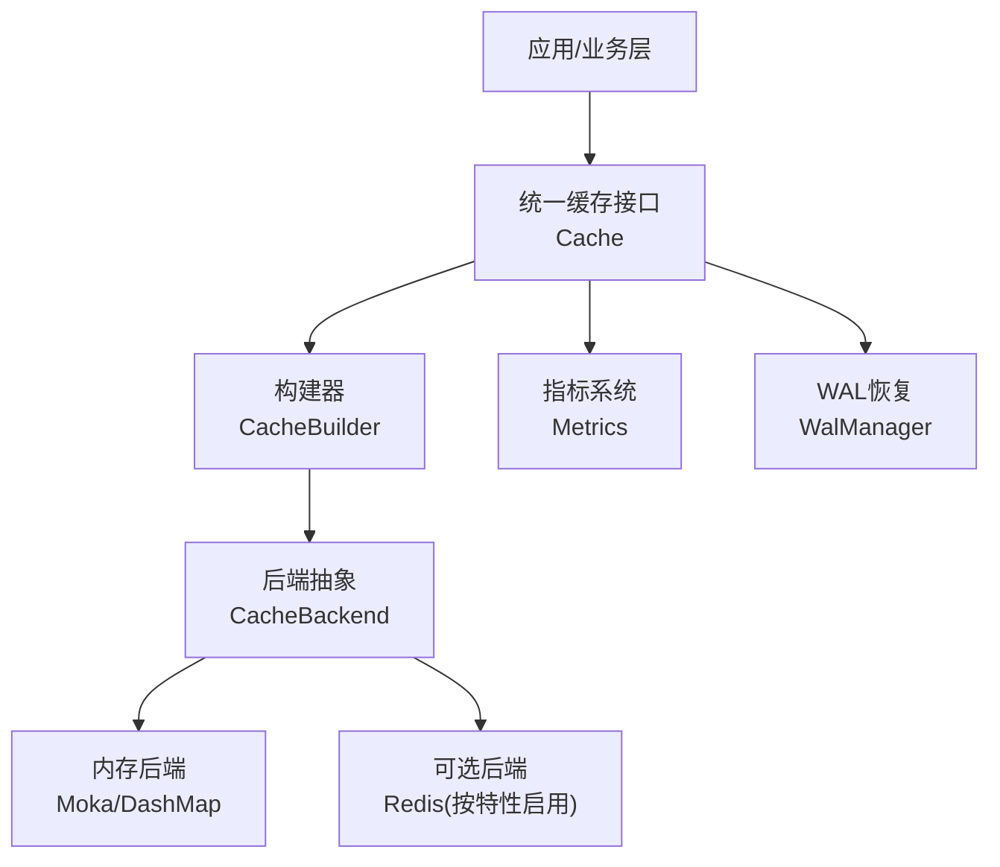
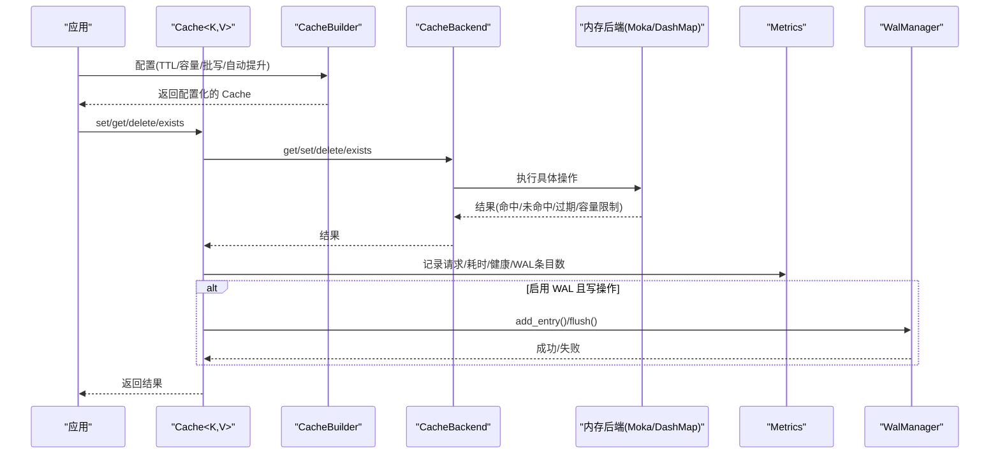
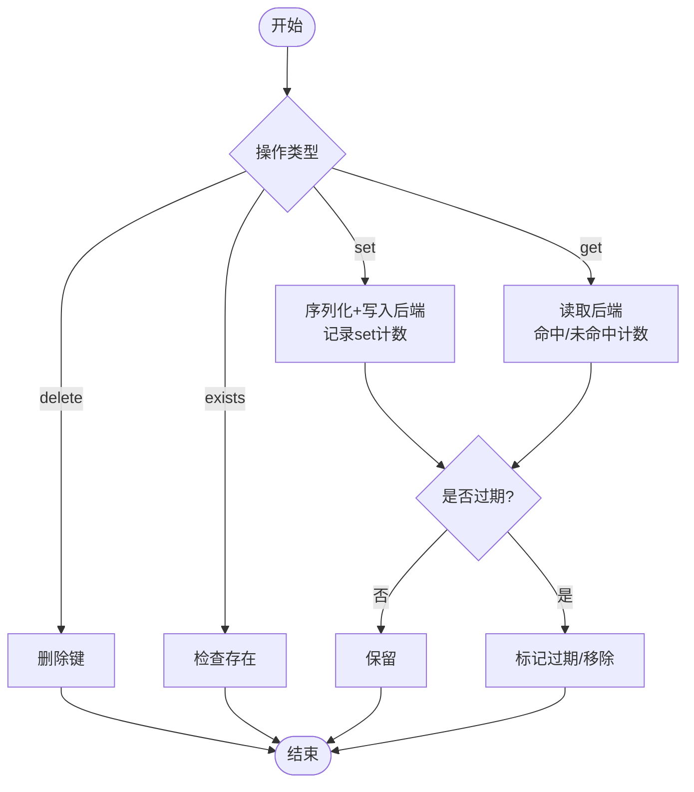
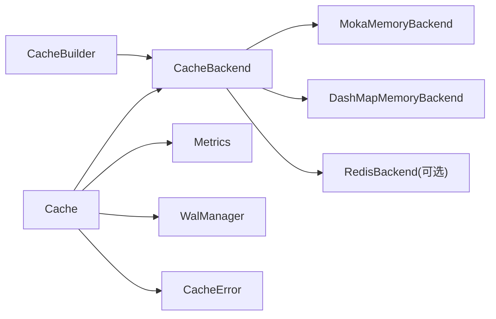

# 生命周期管理

<cite>
**本文引用的文件**
- [src/cache.rs](file://src/cache.rs)
- [src/backend/mod.rs](file://src/backend/mod.rs)
- [src/backend/client/mod.rs](file://src/backend/client/mod.rs)
- [src/backend/client/moka/mod.rs](file://src/backend/client/moka/mod.rs)
- [src/backend/client/dashmap/mod.rs](file://src/backend/client/dashmap/mod.rs)
- [src/builder/cache_builder.rs](file://src/builder/cache_builder.rs)
- [src/metrics.rs](file://src/metrics.rs)
- [src/recovery/wal.rs](file://src/recovery/wal.rs)
- [src/error.rs](file://src/error.rs)
</cite>

## 目录
1. [简介](#简介)
2. [项目结构](#项目结构)
3. [核心组件](#核心组件)
4. [架构总览](#架构总览)
5. [详细组件分析](#详细组件分析)
6. [依赖关系分析](#依赖关系分析)
7. [性能考量](#性能考量)
8. [故障排查指南](#故障排查指南)
9. [结论](#结论)
10. [附录](#附录)

## 简介
本章节聚焦 Oxcache 的缓存数据生命周期管理机制，系统阐述 TTL（生存时间）与 TTI（闲置时间）的差异、过期策略与回收机制、缓存项的创建/更新/访问/销毁流程、内存与垃圾回收、容量控制与逐出策略（LRU/LFU 等）、生命周期监控与调试方法（统计与性能分析）、以及故障恢复与数据一致性保障。

## 项目结构
围绕生命周期管理的关键模块与文件如下：
- 统一缓存接口与高级构建器：src/cache.rs、src/builder/cache_builder.rs
- 后端抽象与客户端实现：src/backend/mod.rs、src/backend/client/mod.rs、src/backend/client/moka/mod.rs、src/backend/client/dashmap/mod.rs
- 指标与监控：src/metrics.rs
- 故障恢复与 WAL：src/recovery/wal.rs
- 错误类型与诊断：src/error.rs

图表来源
- [src/cache.rs](file://src/cache.rs#L117-L120)
- [src/builder/cache_builder.rs](file://src/builder/cache_builder.rs#L38-L45)
- [src/backend/mod.rs](file://src/backend/mod.rs#L26-L27)
- [src/backend/client/mod.rs](file://src/backend/client/mod.rs#L13-L19)
- [src/metrics.rs](file://src/metrics.rs#L79-L98)
- [src/recovery/wal.rs](file://src/recovery/wal.rs#L59-L65)

章节来源
- [src/cache.rs](file://src/cache.rs#L117-L120)
- [src/builder/cache_builder.rs](file://src/builder/cache_builder.rs#L38-L45)
- [src/backend/mod.rs](file://src/backend/mod.rs#L26-L27)
- [src/backend/client/mod.rs](file://src/backend/client/mod.rs#L13-L19)
- [src/metrics.rs](file://src/metrics.rs#L79-L98)
- [src/recovery/wal.rs](file://src/recovery/wal.rs#L59-L65)

## 核心组件
- 统一缓存接口 Cache<K,V>：提供 get/set/delete/exists/get_or 等操作，并封装后端能力；支持序列化与反序列化（按特性启用）。
- 构建器 CacheBuilder：支持设置 TTL、容量、批写开关、自动提升（两级缓存场景）等高级配置。
- 后端抽象与实现：通过 CacheBackend 抽象，内存后端默认采用 Moka（LRU/TinyLFU 自动过期），也可选择 DashMap（并发哈希表+手动 TTL）。
- 指标系统 Metrics：高频 L1/L2 命中/未命中/设置/删除计数使用原子计数器，低频指标使用无锁并发映射；支持导出 Prometheus/JSON。
- WAL 管理器 WalManager：在启用 wal-recovery 特性时，记录写入操作，支持批量刷盘、后台定时刷新、事务性重放与清理。

章节来源
- [src/cache.rs](file://src/cache.rs#L117-L646)
- [src/builder/cache_builder.rs](file://src/builder/cache_builder.rs#L38-L208)
- [src/backend/mod.rs](file://src/backend/mod.rs#L13-L26)
- [src/backend/client/mod.rs](file://src/backend/client/mod.rs#L13-L33)
- [src/metrics.rs](file://src/metrics.rs#L79-L660)
- [src/recovery/wal.rs](file://src/recovery/wal.rs#L59-L430)

## 架构总览
生命周期管理贯穿“配置—创建—访问—过期回收—销毁”的完整链路。下图展示从应用调用到后端执行、再到指标与 WAL 的交互：

图表来源
- [src/cache.rs](file://src/cache.rs#L241-L515)
- [src/builder/cache_builder.rs](file://src/builder/cache_builder.rs#L193-L208)
- [src/backend/mod.rs](file://src/backend/mod.rs#L26-L27)
- [src/metrics.rs](file://src/metrics.rs#L103-L254)
- [src/recovery/wal.rs](file://src/recovery/wal.rs#L174-L191)

## 详细组件分析

### TTL 与 TTI 的区别及应用场景
- TTL（生存时间）：自写入/更新时刻起，超过该时长即视为过期。适用于“时效性”强的数据，如会话令牌、短期配置。
- TTI（闲置时间）：自最后一次访问时刻起，超过该时长未再次访问则过期。适用于“冷热不均”的数据，避免长期占用内存。
- 在当前代码库中，TTL 作为 set 接口参数传入后端；TTI 的校验与验证逻辑存在于自定义两级缓存配置的校验函数中，表明其在两级缓存策略中具有明确边界。

章节来源
- [src/cache.rs](file://src/cache.rs#L287-L325)
- [src/backend/custom_tiered.rs](file://src/backend/custom_tiered.rs#L250-L277)

### 过期策略与回收机制
- Moka 内存后端：内置 LRU/TinyLFU 策略与自动过期，满足 TTL 场景下的高效回收。
- DashMap 内存后端：基于并发哈希表，TTL 由上层控制（手动检查过期），适合需要细粒度 TTL 管理的场景。
- 两级缓存策略：在未命中时可自动从 L2 提升至 L1，结合 TTL/TTI 实现“热数据常驻、冷数据淘汰”。

章节来源
- [src/backend/client/moka/mod.rs](file://src/backend/client/moka/mod.rs#L10-L13)
- [src/backend/client/dashmap/mod.rs](file://src/backend/client/dashmap/mod.rs#L10-L13)
- [src/backend/custom_tiered.rs](file://src/backend/custom_tiered.rs#L233-L277)

### 缓存项的创建、更新、访问与销毁
- 创建/更新：set/set_with_ttl 将序列化后的值写入后端，携带 TTL；若启用 WAL，则异步追加 WAL 条目。
- 访问：get/exists 返回命中/未命中；命中计数与总操作数由原子计数器累加。
- 销毁：delete 移除键；clear 清空缓存；shutdown 关闭后端资源。
- 回收：内存后端根据容量与过期策略进行逐出；DashMap 需要上层定期扫描过期项。

图表来源
- [src/cache.rs](file://src/cache.rs#L241-L515)
- [src/metrics.rs](file://src/metrics.rs#L103-L254)

章节来源
- [src/cache.rs](file://src/cache.rs#L241-L515)
- [src/metrics.rs](file://src/metrics.rs#L103-L254)

### 内存管理与垃圾回收
- 原子计数器：L1/L2 命中/未命中/设置/删除计数使用原子操作，降低锁竞争。
- 并发映射：低频指标使用无锁并发映射（DashMap），避免阻塞。
- 后端回收：Moka/DashMap 负责内存回收与容量控制；应用层通过容量配置与 TTL/TTI 辅助回收。
- WAL 批量刷盘：后台定时刷新与手动触发刷新，使用事务批量写入，失败时回滚并保留待重试。

章节来源
- [src/metrics.rs](file://src/metrics.rs#L17-L98)
- [src/recovery/wal.rs](file://src/recovery/wal.rs#L139-L163)
- [src/recovery/wal.rs](file://src/recovery/wal.rs#L277-L372)

### 容量控制与逐出策略
- 容量上限：通过构建器设置容量，内存后端在接近上限时触发逐出。
- 逐出策略：
  - Moka：LRU/TinyLFU 自动过期，优先淘汰过期与低频访问项。
  - DashMap：需上层定期扫描过期项并主动删除。
- 两级缓存：可配置自动提升（L2 miss 时提升至 L1），结合 TTL/TTI 与容量上限实现“热数据常驻、冷数据淘汰”。

章节来源
- [src/builder/cache_builder.rs](file://src/builder/cache_builder.rs#L87-L105)
- [src/backend/client/moka/mod.rs](file://src/backend/client/moka/mod.rs#L10-L13)
- [src/backend/client/dashmap/mod.rs](file://src/backend/client/dashmap/mod.rs#L10-L13)
- [src/backend/custom_tiered.rs](file://src/backend/custom_tiered.rs#L233-L277)

### 生命周期监控与调试
- 指标采集：
  - 高频指标：L1/L2 get/set/delete 命中/未命中/总操作数。
  - 低频指标：请求总量、健康状态、WAL 条目数、操作耗时（平均值）、批量写入缓冲区大小/成功率/吞吐量。
  - 支持导出 Prometheus 文本格式与 JSON。
- 统计快照：可生成 CacheStats 并计算命中率、总体命中率等。
- 调试建议：
  - 开启 metrics/moka 或 enhanced-stats 特性以启用指标。
  - 结合 get_metrics_string/export_prometheus_format 导出监控数据。
  - 使用 health_check/exists/stats 辅助定位后端异常。

章节来源
- [src/metrics.rs](file://src/metrics.rs#L79-L660)
- [src/cache.rs](file://src/cache.rs#L517-L572)

### 故障恢复与数据一致性
- WAL（预写日志）：
  - 写入前先落盘，支持批量刷盘、后台定时刷新、手动触发刷新。
  - 事务性批量写入，失败回滚并保留条目以便重试。
  - 提供 replay_all 将 WAL 条目重放到可重放后端，成功后清理 WAL。
- 一致性保障：
  - WAL 与后端操作顺序：先 WAL，再后端；失败时 WAL 保留，确保重启后可重放。
  - 重放采用事务，全部成功才清理，避免部分重放导致不一致。

章节来源
- [src/recovery/wal.rs](file://src/recovery/wal.rs#L59-L430)
- [src/error.rs](file://src/error.rs#L75-L208)

## 依赖关系分析
- Cache<K,V> 依赖 CacheBackend 抽象，后端可替换为 Moka/DashMap/Redis（按特性启用）。
- CacheBuilder 负责装配后端与高级配置（TTL/容量/批写/自动提升）。
- Metrics 与 WAL 独立于后端，分别提供监控与持久化能力。
- 错误类型集中定义，便于统一处理与诊断。

图表来源
- [src/cache.rs](file://src/cache.rs#L117-L120)
- [src/builder/cache_builder.rs](file://src/builder/cache_builder.rs#L193-L208)
- [src/backend/mod.rs](file://src/backend/mod.rs#L26-L27)
- [src/backend/client/mod.rs](file://src/backend/client/mod.rs#L22-L33)
- [src/metrics.rs](file://src/metrics.rs#L79-L98)
- [src/recovery/wal.rs](file://src/recovery/wal.rs#L59-L65)
- [src/error.rs](file://src/error.rs#L75-L208)

章节来源
- [src/cache.rs](file://src/cache.rs#L117-L120)
- [src/builder/cache_builder.rs](file://src/builder/cache_builder.rs#L193-L208)
- [src/backend/mod.rs](file://src/backend/mod.rs#L26-L27)
- [src/backend/client/mod.rs](file://src/backend/client/mod.rs#L22-L33)
- [src/metrics.rs](file://src/metrics.rs#L79-L98)
- [src/recovery/wal.rs](file://src/recovery/wal.rs#L59-L65)
- [src/error.rs](file://src/error.rs#L75-L208)

## 性能考量
- 原子计数器与无锁并发映射：降低高并发下的锁竞争，提升指标采集性能。
- 批量写入与后台刷新：减少频繁 I/O，提高吞吐；失败回滚避免数据丢失。
- TTL/TTI 与容量上限：结合 LRU/TinyLFU 等策略，平衡命中率与内存占用。
- 建议：
  - 根据业务特征调整 TTL/TTI 与容量。
  - 启用 metrics/moka 或 enhanced-stats 以持续观测命中率与延迟。
  - 对热点数据适当增大容量并开启自动提升（两级缓存）。

[本节为通用指导，无需列出章节来源]

## 故障排查指南
- 常见错误类型与定位：
  - NotFound：键不存在，检查 get_or/fallback 是否正确触发。
  - L1Error/L2Error：内存压力或后端不可用，检查容量与健康状态。
  - Connection/RedisError：网络/连接问题，检查连接串与服务可用性。
  - WalError/DatabaseError：WAL 写入失败，检查磁盘空间与权限。
- 排查步骤：
  - 使用 health_check/exists/stats 获取后端状态与统计。
  - 查看指标：命中率、操作耗时、WAL 条目数、批量写入吞吐。
  - 若启用 WAL，尝试 replay_all 重放并观察日志。
  - 检查错误类型与 is_* 方法辅助判断错误类别。

章节来源
- [src/error.rs](file://src/error.rs#L75-L208)
- [src/cache.rs](file://src/cache.rs#L534-L572)
- [src/metrics.rs](file://src/metrics.rs#L256-L361)
- [src/recovery/wal.rs](file://src/recovery/wal.rs#L378-L429)

## 结论
Oxcache 的生命周期管理以“配置—创建—访问—过期回收—销毁”为主线，结合 TTL/TTI、容量与逐出策略（LRU/TinyLFU）、指标监控与 WAL 恢复，形成完整的可观测、可恢复、可扩展的缓存体系。通过 CacheBuilder 与多后端抽象，用户可在不同场景下灵活选择最适合的策略组合，并借助 Metrics 与 WAL 实现稳定可靠的生产级缓存服务。

[本节为总结性内容，无需列出章节来源]

## 附录
- 关键路径参考：
  - 统一缓存接口与操作：[src/cache.rs](file://src/cache.rs#L241-L572)
  - 构建器与配置：[src/builder/cache_builder.rs](file://src/builder/cache_builder.rs#L65-L208)
  - 后端抽象与实现：[src/backend/mod.rs](file://src/backend/mod.rs#L26-L27)、[src/backend/client/mod.rs](file://src/backend/client/mod.rs#L13-L33)
  - 指标系统：[src/metrics.rs](file://src/metrics.rs#L103-L660)
  - WAL 管理：[src/recovery/wal.rs](file://src/recovery/wal.rs#L174-L429)
  - 错误类型：[src/error.rs](file://src/error.rs#L75-L208)

[本节为补充索引，无需列出章节来源]