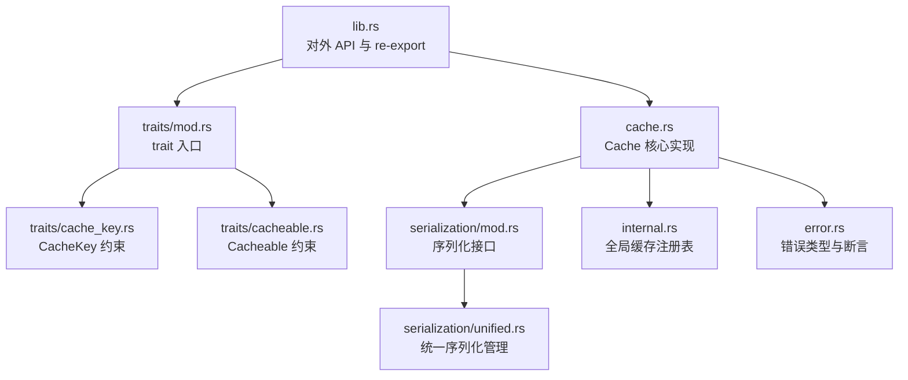
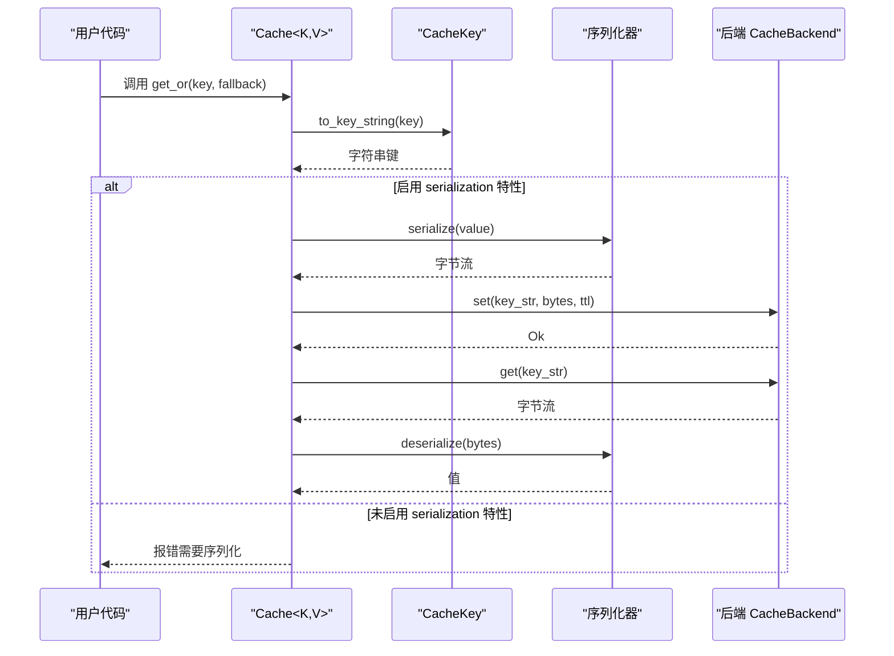
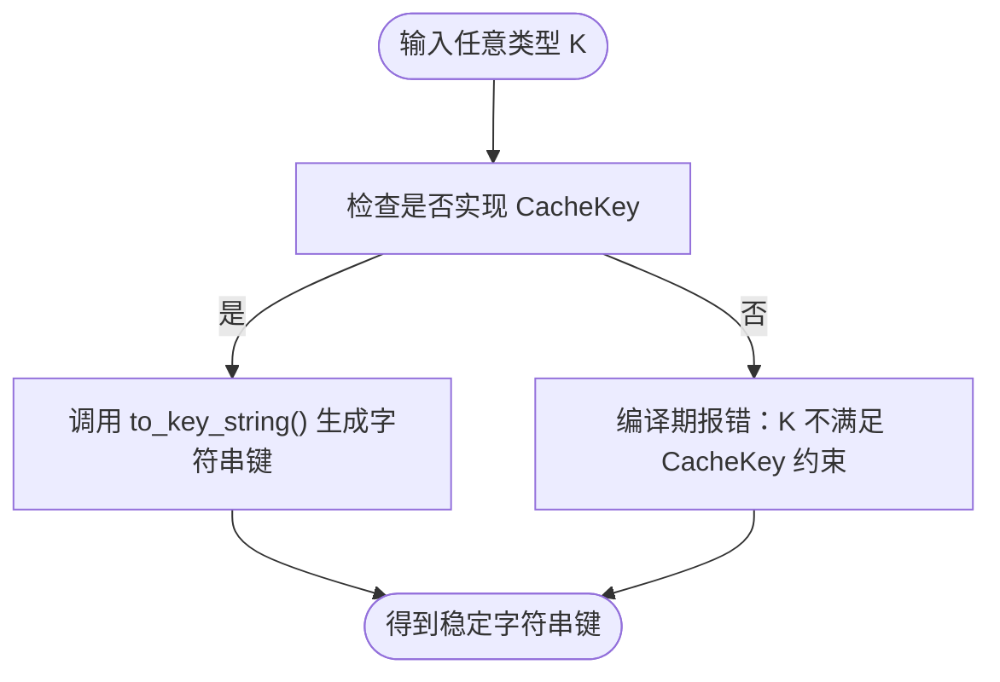
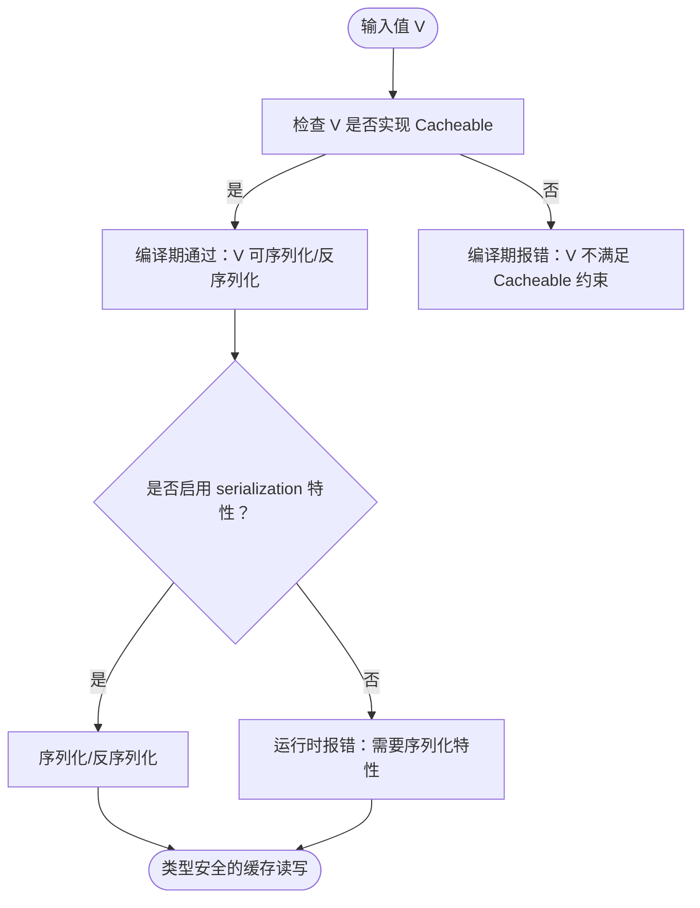
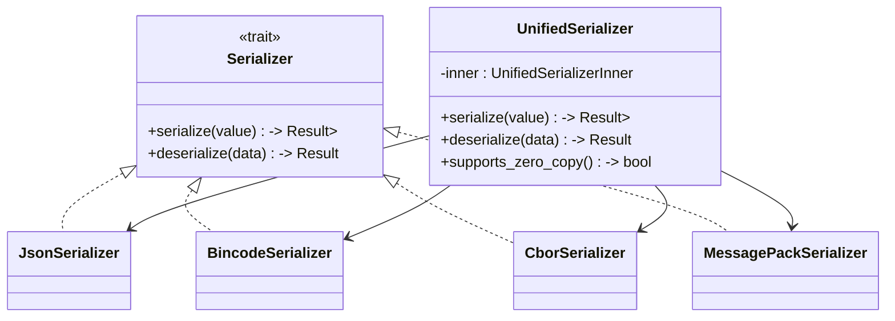
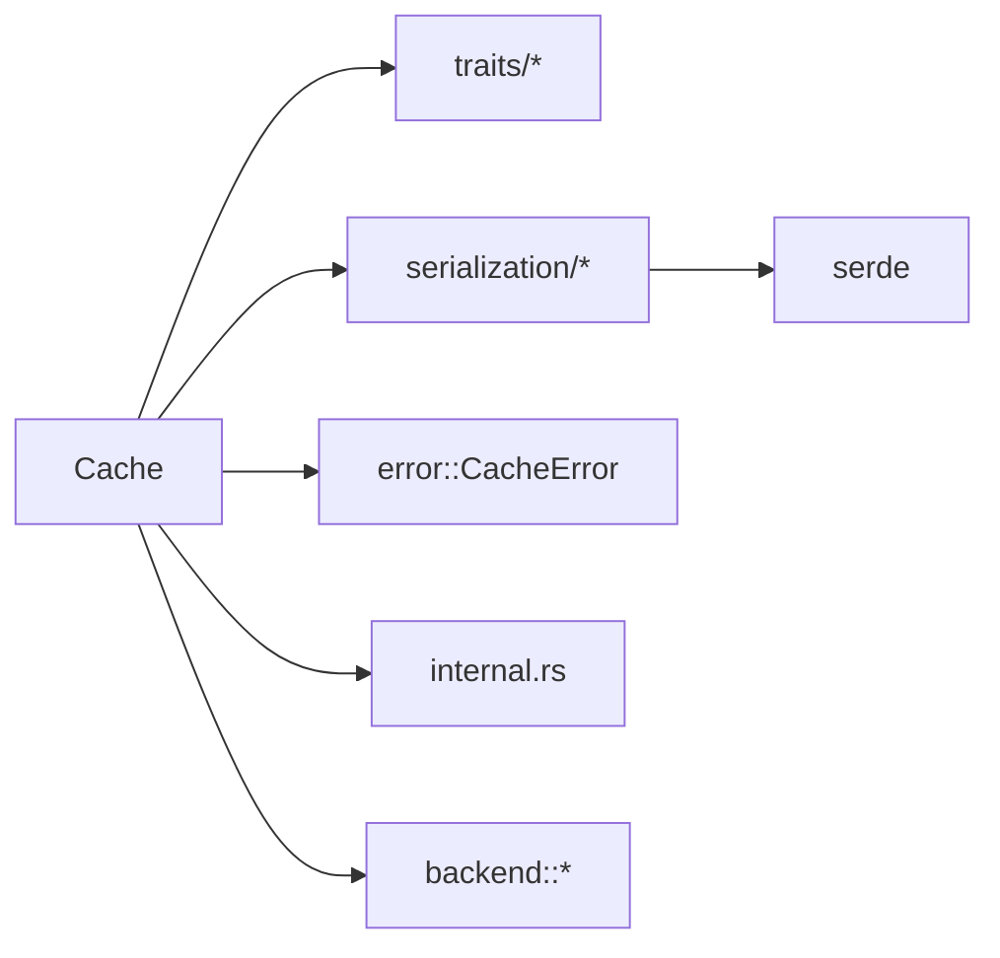

# 类型安全设计

<cite>
**本文档引用的文件**
- [src/lib.rs](file://src/lib.rs)
- [src/cache.rs](file://src/cache.rs)
- [src/traits/cache_key.rs](file://src/traits/cache_key.rs)
- [src/traits/cacheable.rs](file://src/traits/cacheable.rs)
- [src/traits/mod.rs](file://src/traits/mod.rs)
- [src/serialization/mod.rs](file://src/serialization/mod.rs)
- [src/serialization/unified.rs](file://src/serialization/unified.rs)
- [src/internal.rs](file://src/internal.rs)
- [src/error.rs](file://src/error.rs)
- [examples/src/01_basics/example_basic_operations.rs](file://examples/src/01_basics/example_basic_operations.rs)
- [examples/src/01_basics/example_comprehensive_usage.rs](file://examples/src/01_basics/example_comprehensive_usage.rs)
</cite>

## 目录
1. [简介](#简介)
2. [项目结构](#项目结构)
3. [核心组件](#核心组件)
4. [架构总览](#架构总览)
5. [详细组件分析](#详细组件分析)
6. [依赖分析](#依赖分析)
7. [性能考虑](#性能考虑)
8. [故障排除指南](#故障排除指南)
9. [结论](#结论)

## 简介
本文件系统性阐述 Oxcache 的类型安全设计原则与实现机制，重点围绕泛型参数 K（键类型）与 V（值类型）展开，解释 CacheKey 与 Cacheable 两大 trait 的约束作用，以及类型系统如何在编译期与运行期共同防止类型错误。文档还覆盖字符串键、复合键与自定义类型的处理方式，并结合具体示例说明如何通过编译器确保数据正确性。最后，我们解析泛型实现中的技术细节，包括类型擦除与运行时类型转换的边界。

## 项目结构
Oxcache 的现代 API 采用“泛型 + trait 约束”的设计，核心入口位于 lib.rs 中 re-export 的 Cache 类型与 traits 模块；Cache 实现位于 cache.rs；键与值的类型约束分别由 traits/cache_key.rs 与 traits/cacheable.rs 提供；序列化子系统位于 serialization 子模块，统一管理多种序列化格式；内部注册表与全局缓存宏支持位于 internal.rs；错误类型集中定义于 error.rs。



图表来源
- [src/lib.rs](file://src/lib.rs#L517-L639)
- [src/cache.rs](file://src/cache.rs#L87-L120)
- [src/traits/mod.rs](file://src/traits/mod.rs#L7-L11)
- [src/traits/cache_key.rs](file://src/traits/cache_key.rs#L38-L49)
- [src/traits/cacheable.rs](file://src/traits/cacheable.rs#L7-L41)
- [src/serialization/mod.rs](file://src/serialization/mod.rs#L41-L97)
- [src/serialization/unified.rs](file://src/serialization/unified.rs#L18-L50)
- [src/internal.rs](file://src/internal.rs#L15-L39)
- [src/error.rs](file://src/error.rs#L45-L208)

章节来源
- [src/lib.rs](file://src/lib.rs#L517-L639)
- [src/cache.rs](file://src/cache.rs#L87-L120)
- [src/traits/mod.rs](file://src/traits/mod.rs#L7-L11)

## 核心组件
- 泛型 Cache<K, V>：对外暴露统一的缓存接口，其中 K 必须实现 CacheKey，V 必须实现 Cacheable。该设计在编译期就将“键类型”和“值类型”固定下来，避免运行时类型不匹配。
- CacheKey trait：负责将任意类型 K 转换为稳定的字符串键，提供默认实现（如 String、&str、整数类型），并允许用户为自定义类型实现更合适的键策略。
- Cacheable trait：约束值类型 V 必须可序列化与可反序列化，确保缓存读写路径上的数据一致性。
- 序列化子系统：在启用 serialization 特性时，Cache<K, V> 的 get/set 操作会在进入后端前进行序列化/反序列化；否则在编译期或运行期抛出明确错误。
- 内部注册表：为 #[cached] 宏提供全局缓存实例注册能力，避免宏在运行时查找失败。
- 错误体系：集中定义 CacheError 枚举，涵盖序列化、连接、超时、未找到、降级等多种错误，便于定位类型安全相关的异常。

章节来源
- [src/cache.rs](file://src/cache.rs#L117-L120)
- [src/traits/cache_key.rs](file://src/traits/cache_key.rs#L38-L49)
- [src/traits/cacheable.rs](file://src/traits/cacheable.rs#L7-L41)
- [src/serialization/mod.rs](file://src/serialization/mod.rs#L41-L97)
- [src/internal.rs](file://src/internal.rs#L15-L39)
- [src/error.rs](file://src/error.rs#L75-L208)

## 架构总览
Oxcache 的类型安全贯穿“接口层 → 约束层 → 序列化层 → 后端层”的全链路：



图表来源
- [src/cache.rs](file://src/cache.rs#L241-L408)
- [src/traits/cache_key.rs](file://src/traits/cache_key.rs#L38-L49)
- [src/serialization/mod.rs](file://src/serialization/mod.rs#L41-L97)

## 详细组件分析

### Cache<K, V> 类型安全设计
- 泛型约束：K: CacheKey、V: Cacheable，确保所有操作在编译期就锁定键与值的类型，避免运行时类型转换。
- 序列化路径：当启用 serialization 特性时，set/get 自动进行序列化/反序列化；否则直接报错，防止“无类型保证”的数据进入后端。
- 多键支持：通过 to_key_string 将任意实现 CacheKey 的类型统一转为字符串键，支持字符串、数字、自定义类型等。
- 批量操作：set_many/get_many/delete_many 在编译期保证迭代器元素类型与 K/V 对应，减少运行期错误。

```mermaid
classDiagram
class Cache_K_V {
+new() -> Result<Cache<K,V>>
+memory() -> Result<Cache<K,V>>
+redis(url) -> Result<Cache<K,V>>
+get(key : &K) -> Result<Option<V>>
+set(key : &K, value : &V) -> Result<()>
+set_with_ttl(key : &K, value : &V, ttl) -> Result<()>
+delete(key : &K) -> Result<()>
+exists(key : &K) -> Result<bool>
+get_or(key : &K, fallback) -> Result<V>
+set_many(items) -> Result<()>
+get_many(keys) -> Result<HashMap<String,V>>
+delete_many(keys) -> Result<()>
+clear() -> Result<()>
+stats() -> Result<HashMap<String,String>>
+health_check() -> Result<bool>
+shutdown() -> Result<()>
+to_cache_ops() -> CacheOps
+register_for_macro(name) -> ()
}
class CacheKey {
<<trait>>
+to_key_string() String
}
class Cacheable {
<<trait>>
+Serialize
+Deserialize<'de>
}
Cache_K_V --> CacheKey : "K : CacheKey"
Cache_K_V --> Cacheable : "V : Cacheable"
```

图表来源
- [src/cache.rs](file://src/cache.rs#L117-L120)
- [src/traits/cache_key.rs](file://src/traits/cache_key.rs#L38-L49)
- [src/traits/cacheable.rs](file://src/traits/cacheable.rs#L7-L41)

章节来源
- [src/cache.rs](file://src/cache.rs#L117-L120)
- [src/cache.rs](file://src/cache.rs#L241-L408)

### CacheKey 约束与键类型安全
- 默认实现：为 String、&str、u64/u128/i64/i32/u32/usize/isize 等常见类型提供 to_key_string 的 blanket 实现，确保这些类型可直接作为键使用。
- 自定义键：用户可为自定义类型（如 UserId）实现 CacheKey，从而获得稳定、可预测的键生成策略，避免运行时键冲突或格式错误。
- 类型擦除边界：CacheKey 的职责仅限于“字符串化”，并不参与值的序列化；因此不会引入运行时类型转换，仅在键层面保证类型安全。



图表来源
- [src/traits/cache_key.rs](file://src/traits/cache_key.rs#L51-L105)

章节来源
- [src/traits/cache_key.rs](file://src/traits/cache_key.rs#L38-L105)

### Cacheable 约束与值类型安全
- 约束定义：V: Cacheable 要求同时满足 serde::Serialize 与 for<'de> serde::Deserialize<'de>，确保值类型可双向序列化。
- 序列化特性开关：当未启用 serialization 特性时，get/set 操作会直接返回错误，阻止“无类型保证”的值进入缓存链路。
- 运行时类型转换：在启用 serialization 的情况下，Cache<K, V> 通过统一序列化器将 V 反序列化为具体类型，编译器在编译期已确保 V 的类型正确性。



图表来源
- [src/traits/cacheable.rs](file://src/traits/cacheable.rs#L7-L41)
- [src/cache.rs](file://src/cache.rs#L245-L263)
- [src/cache.rs](file://src/cache.rs#L310-L324)

章节来源
- [src/traits/cacheable.rs](file://src/traits/cacheable.rs#L7-L41)
- [src/cache.rs](file://src/cache.rs#L245-L263)
- [src/cache.rs](file://src/cache.rs#L310-L324)

### 序列化子系统与类型安全
- 统一接口：Serializer trait 规定 serialize/deserialize 的标准签名，确保不同格式（JSON、Bincode、CBOR、MessagePack）在 API 层一致。
- 多格式支持：UnifiedSerializer 以枚举形式封装不同格式的序列化器，按需选择；在启用 serialization 特性时，Cache<K, V> 使用统一序列化器完成 V 的持久化。
- 零拷贝与兼容：部分格式支持零拷贝序列化，但 JSON 等格式在当前实现中退化为常规序列化；统一接口屏蔽差异，保持类型安全。



图表来源
- [src/serialization/mod.rs](file://src/serialization/mod.rs#L41-L97)
- [src/serialization/unified.rs](file://src/serialization/unified.rs#L18-L50)
- [src/serialization/unified.rs](file://src/serialization/unified.rs#L27-L35)

章节来源
- [src/serialization/mod.rs](file://src/serialization/mod.rs#L41-L97)
- [src/serialization/unified.rs](file://src/serialization/unified.rs#L67-L253)

### 类型擦除与运行时类型转换
- 类型擦除边界：CacheKey 与 Cacheable 仅在编译期生效，运行时并不涉及“动态类型转换”。键的字符串化与值的序列化/反序列化均在编译期确定类型约束。
- 运行时类型转换：Oxcache 的序列化器基于 serde，反序列化时会根据编译期推断的类型 T 进行强类型转换；若数据与类型不匹配，将在反序列化阶段抛出错误，而非“静默错误”。
- 特性开关与运行时行为：当未启用 serialization 特性时，get/set 会直接返回错误，避免将未经序列化的值写入后端，从而防止“类型擦除”带来的运行时不确定性。

章节来源
- [src/cache.rs](file://src/cache.rs#L245-L263)
- [src/cache.rs](file://src/cache.rs#L310-L324)
- [src/error.rs](file://src/error.rs#L75-L208)

### 不同类型的安全保证示例
- 字符串键：直接使用 String/&str 作为 K，to_key_string 返回原字符串，类型安全且零成本。
- 数值键：u64/u32/i64 等数值类型通过 blanket 实现 to_key_string，保证键的稳定与唯一性。
- 自定义键：为 UserId 等类型实现 CacheKey，可定制键前缀或命名空间，避免键冲突。
- 值类型：通过 derive(serde::Serialize, serde::Deserialize) 的结构体自动满足 Cacheable 约束，确保序列化/反序列化安全。

章节来源
- [src/traits/cache_key.rs](file://src/traits/cache_key.rs#L51-L105)
- [src/traits/cacheable.rs](file://src/traits/cacheable.rs#L43-L45)
- [examples/src/01_basics/example_basic_operations.rs](file://examples/src/01_basics/example_basic_operations.rs#L14-L19)
- [examples/src/01_basics/example_comprehensive_usage.rs](file://examples/src/01_basics/example_comprehensive_usage.rs#L20-L35)

## 依赖分析
- 组件耦合：Cache<K, V> 依赖 traits（CacheKey/Cacheable）、serialization（序列化）、backend（后端抽象）、error（错误）；内部通过 internal.rs 提供全局注册表支持宏功能。
- 外部依赖：依赖 serde 进行序列化/反序列化；在启用 redis 特性时依赖 redis 后端；在启用 moka 特性时使用内存后端。
- 循环依赖：未发现循环依赖；traits 与 cache.rs 之间为单向依赖，符合 Rust 模块化设计。



图表来源
- [src/cache.rs](file://src/cache.rs#L11-L18)
- [src/serialization/mod.rs](file://src/serialization/mod.rs#L21-L31)
- [src/error.rs](file://src/error.rs#L75-L208)
- [src/internal.rs](file://src/internal.rs#L15-L39)

章节来源
- [src/cache.rs](file://src/cache.rs#L11-L18)
- [src/serialization/mod.rs](file://src/serialization/mod.rs#L21-L31)
- [src/error.rs](file://src/error.rs#L75-L208)
- [src/internal.rs](file://src/internal.rs#L15-L39)

## 性能考虑
- 编译期开销：泛型与 trait 约束在编译期完成类型检查，运行时无额外开销。
- 序列化成本：启用 serialization 特性时，get/set 会进行序列化/反序列化；可通过选择更紧凑的格式（如 Bincode）降低序列化成本。
- 零拷贝：在支持的格式下，序列化器可利用零拷贝优化；在不支持的格式（如 JSON）下会退化为常规序列化，但不影响类型安全。
- 批量操作：set_many/get_many/delete_many 通过迭代器批量处理，减少网络/IO 调用次数，提升吞吐。

## 故障排除指南
- 编译期错误：若 K 不实现 CacheKey 或 V 不满足 Cacheable 约束，编译器会直接报错，提示类型不匹配。
- 运行期错误：当未启用 serialization 特性时，调用 get/set 会返回序列化相关错误；应启用 serialization 特性或改用字节级操作。
- 键过长/值过大：CacheError::KeyTooLong/ValueTooLarge 会明确指出超出限制的阈值，需调整键或值大小。
- 未找到键：CacheError::NotFound 表示键不存在；可结合 exists 判断或使用 get_or 提供回退逻辑。
- 连接/超时：L1/L2 后端错误与超时错误会区分来源，便于定位问题。

章节来源
- [src/error.rs](file://src/error.rs#L75-L208)
- [src/cache.rs](file://src/cache.rs#L245-L263)
- [src/cache.rs](file://src/cache.rs#L310-L324)

## 结论
Oxcache 通过“泛型 + trait 约束”的设计，在编译期就将键类型 K 与值类型 V 固定，配合 CacheKey 与 Cacheable 的明确边界，确保了从接口到序列化的全链路类型安全。序列化子系统在启用特性时提供统一的多格式支持，未启用时则通过显式的错误阻止不安全的类型使用。整体设计兼顾了类型安全、性能与可扩展性，适合在生产环境中构建可靠的缓存层。