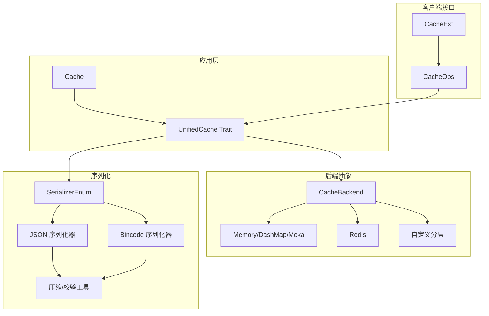
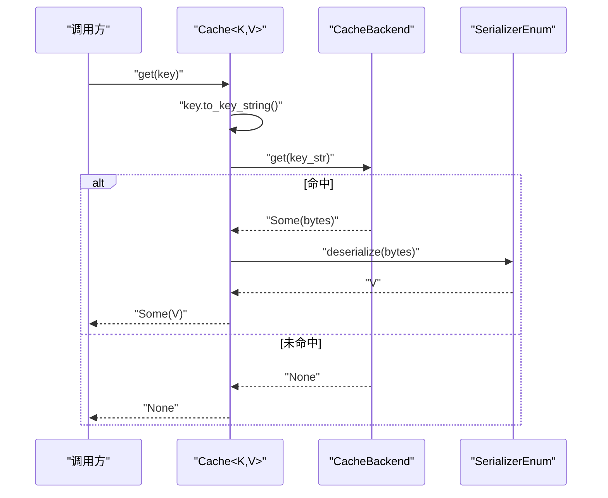
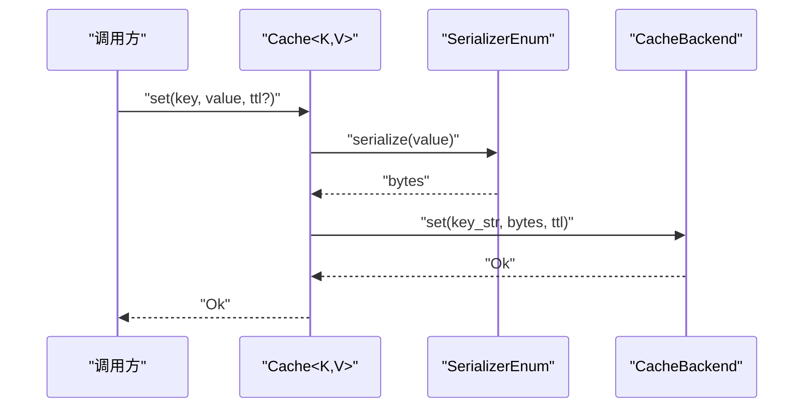
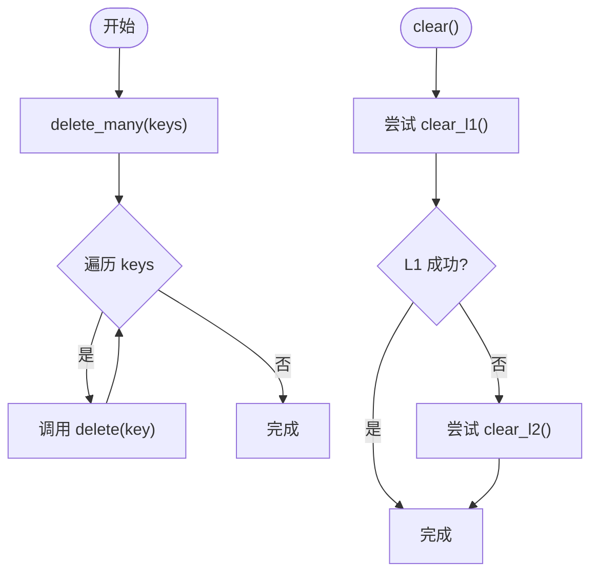
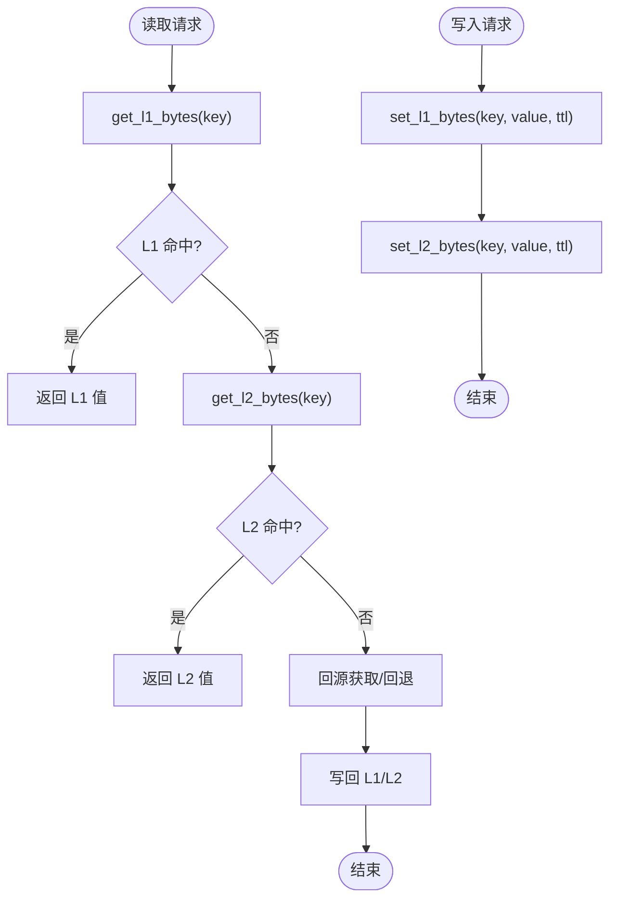
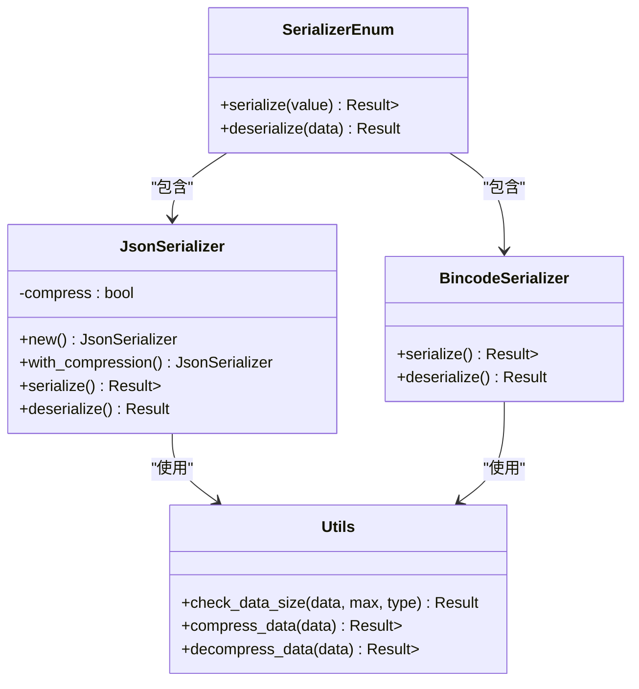
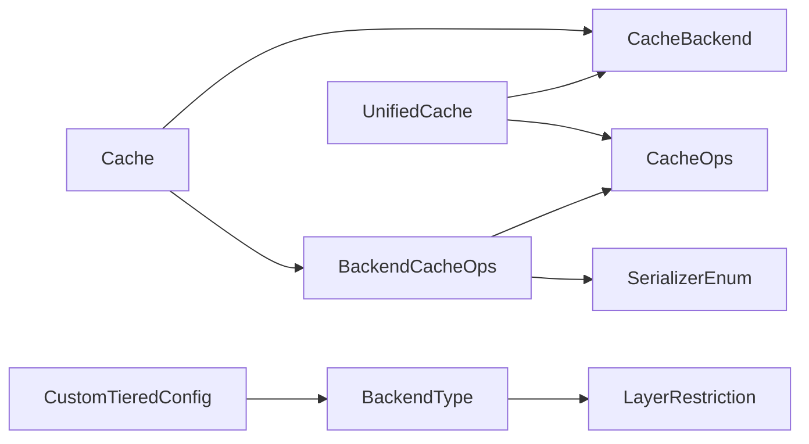

# 缓存操作流程

<cite>
**本文引用的文件**
- [src/cache.rs](file://src/cache.rs)
- [src/cache_interface.rs](file://src/cache_interface.rs)
- [src/backend/mod.rs](file://src/backend/mod.rs)
- [src/backend/interface.rs](file://src/backend/interface.rs)
- [src/backend/custom_tiered.rs](file://src/backend/custom_tiered.rs)
- [src/client/mod.rs](file://src/client/mod.rs)
- [src/serialization/mod.rs](file://src/serialization/mod.rs)
- [src/serialization/json.rs](file://src/serialization/json.rs)
- [src/serialization/bincode.rs](file://src/serialization/bincode.rs)
- [src/serialization/utils.rs](file://src/serialization/utils.rs)
</cite>

## 目录
1. [简介](#简介)
2. [项目结构](#项目结构)
3. [核心组件](#核心组件)
4. [架构总览](#架构总览)
5. [详细组件分析](#详细组件分析)
6. [依赖关系分析](#依赖关系分析)
7. [性能考量](#性能考量)
8. [故障排查指南](#故障排查指南)
9. [结论](#结论)

## 简介
本文件围绕 Oxcache 的缓存操作流程与数据流展开，重点覆盖以下方面：
- 缓存查找、插入、删除与批量操作的完整实现步骤
- L1/L2 层之间的数据同步机制（读写路径、回退策略与一致性）
- 序列化与反序列化处理流程（格式转换与错误处理）
- 典型场景流程图（命中、未命中、混合场景）
- 并发访问控制与线程安全机制

## 项目结构
Oxcache 采用“统一接口 + 插件化后端”的架构设计，核心由以下模块组成：
- 统一缓存接口与高层 API：Cache、UnifiedCache、CacheOps、CacheExt
- 后端抽象与插件：CacheBackend、Memory/DashMap/Moka、Redis、自定义分层
- 序列化子系统：Serializer、SerializerEnum、JSON/Bincode、压缩与安全工具
- 客户端适配与适配器：CacheOpsAdapter、BackendCacheOps

图表来源
- [src/cache.rs](file://src/cache.rs#L117-L646)
- [src/cache_interface.rs](file://src/cache_interface.rs#L24-L300)
- [src/client/mod.rs](file://src/client/mod.rs#L18-L304)
- [src/backend/interface.rs](file://src/backend/interface.rs#L46-L166)
- [src/backend/custom_tiered.rs](file://src/backend/custom_tiered.rs#L362-L466)
- [src/serialization/mod.rs](file://src/serialization/mod.rs#L41-L98)
- [src/serialization/json.rs](file://src/serialization/json.rs#L12-L99)
- [src/serialization/bincode.rs](file://src/serialization/bincode.rs#L12-L54)
- [src/serialization/utils.rs](file://src/serialization/utils.rs#L11-L75)

章节来源
- [src/cache.rs](file://src/cache.rs#L117-L646)
- [src/cache_interface.rs](file://src/cache_interface.rs#L24-L300)
- [src/client/mod.rs](file://src/client/mod.rs#L18-L304)
- [src/backend/interface.rs](file://src/backend/interface.rs#L46-L166)
- [src/backend/custom_tiered.rs](file://src/backend/custom_tiered.rs#L362-L466)
- [src/serialization/mod.rs](file://src/serialization/mod.rs#L41-L98)

## 核心组件
- Cache<K,V>：面向用户的类型安全缓存入口，负责键类型转换、序列化/反序列化、以及对底层 CacheBackend 的委托。
- UnifiedCache：统一的缓存接口，整合 CacheOps、CacheExt、CacheBackend 的能力，提供统一的字节/类型化操作、分层操作、批处理与统计等。
- CacheOps/CacheExt：定义字节级与类型级操作、分层操作、分布式锁、批处理等。
- CacheBackend：后端抽象，定义 get/set/delete/exists/clear/close/ttl/expire/health_check/stats 等核心方法。
- 自定义分层后端：支持 L1/L2/L3 的灵活组合与自动修复配置，提供后端类型与层级约束、配置校验与默认提供者。

章节来源
- [src/cache.rs](file://src/cache.rs#L117-L646)
- [src/cache_interface.rs](file://src/cache_interface.rs#L24-L300)
- [src/backend/interface.rs](file://src/backend/interface.rs#L46-L166)
- [src/backend/custom_tiered.rs](file://src/backend/custom_tiered.rs#L309-L466)

## 架构总览
Oxcache 的架构遵循“策略模式”与“适配器模式”：
- Cache 通过 CacheBackend 抽象与具体后端交互，屏蔽上层差异。
- CacheOps/CacheExt 提供统一的类型化与分层操作接口，便于扩展。
- UnifiedCache 将上述能力整合，形成统一的对外接口。
- 自定义分层后端可按需组合 L1/L2/L3，满足不同性能与一致性需求。

```mermaid
classDiagram
class Cache_K_V_ {
+new() Result
+memory() Result
+redis(url) Result
+get(key) Result<Option<V>>
+set(key, value) Result
+delete(key) Result
+exists(key) Result<bool>
+get_or(key, fallback) Result<V>
+set_many(items) Result
+get_many(keys) Result<HashMap>
+delete_many(keys) Result
+clear() Result
+stats() Result<HashMap>
+health_check() Result<bool>
+shutdown() Result
+to_cache_ops() Arc<CacheOps>
}
class UnifiedCache {
<<trait>>
+get_bytes(key) Result<Option<Vec<u8>>>
+set_bytes(key, value, ttl) Result
+delete(key) Result
+exists(key) Result<bool>
+clear() Result
+close() Result
+ttl(key) Result<Option<Duration>>
+expire(key, ttl) Result<bool>
+health_check() Result<bool>
+stats() Result<HashMap>
+get_l1_bytes(key) Result<Option<Vec<u8>>>
+get_l2_bytes(key) Result<Option<Vec<u8>>>
+set_l1_bytes(key, value, ttl) Result
+set_l2_bytes(key, value, ttl) Result
+lock(key, ttl) Result<Option<String>>
+unlock(key, value) Result<bool>
+get_typed<T>(key) Result<Option<T>>
+set_typed<T>(key, value, ttl) Result
+set_l1_typed<T>(key, value, ttl) Result
+set_l2_typed<T>(key, value, ttl) Result
+get_or_fetch<T>(key, ttl, fetch) Result<T>
+try_get_typed<T>(key) Result<Option<T>>
+remove_typed<T>(key) Result<Option<T>>
+contains(key) Result<bool>
+set_many_bytes(items) Result
+get_many_bytes(keys) Result<HashMap>
+delete_many(keys) Result
+set_many_typed<T>(items) Result
+get_many_typed<T>(keys) Result<HashMap>
+serializer() &SerializerEnum
+as_any() &Any
+into_any_arc(Arc<Self>) Arc<Any+Send+Sync>
}
class CacheOps {
<<trait>>
+get_bytes(key) Result<Option<Vec<u8>>>
+set_bytes(key, value, ttl) Result
+get_l1_bytes(key) Result<Option<Vec<u8>>>
+get_l2_bytes(key) Result<Option<Vec<u8>>>
+set_l1_bytes(key, value, ttl) Result
+set_l2_bytes(key, value, ttl) Result
+lock(key, ttl) Result<Option<String>>
+unlock(key, value) Result<bool>
+delete(key) Result
+serializer() &SerializerEnum
+as_any() &Any
+into_any_arc(Arc<Self>) Arc<Any+Send+Sync>
+clear_l1() Result
+clear_l2() Result
+clear_wal() Result
+shutdown() Result
}
class CacheBackend {
<<trait>>
+get(key) Result<Option<Vec<u8>>>
+set(key, value, ttl) Result
+delete(key) Result
+exists(key) Result<bool>
+clear() Result
+close() Result
+ttl(key) Result<Option<Duration>>
+expire(key, ttl) Result<bool>
+health_check() Result<bool>
+stats() Result<HashMap<String,String>>
}
Cache_K_V_ --> CacheBackend : "委托"
UnifiedCache <|.. CacheBackend : " blanket impl"
UnifiedCache <|.. CacheOps : " adapter"
CacheOps <|.. Cache_K_V_ : " BackendCacheOps"
```

图表来源
- [src/cache.rs](file://src/cache.rs#L117-L646)
- [src/cache_interface.rs](file://src/cache_interface.rs#L24-L300)
- [src/client/mod.rs](file://src/client/mod.rs#L18-L304)
- [src/backend/interface.rs](file://src/backend/interface.rs#L46-L166)

## 详细组件分析

### 1) 缓存查找流程（命中/未命中/混合）
- 类型安全查找：Cache::get 将 K 转为字符串键，调用 backend.get 获取字节，再通过序列化器反序列化为 V。
- 未命中：返回 None；若启用 get_or/fallback，则执行回调并写回缓存。
- 批量查找：Cache::get_many 逐个查询，仅返回存在的键值对。

图表来源
- [src/cache.rs](file://src/cache.rs#L241-L264)
- [src/cache_interface.rs](file://src/cache_interface.rs#L133-L143)
- [src/serialization/mod.rs](file://src/serialization/mod.rs#L71-L98)

章节来源
- [src/cache.rs](file://src/cache.rs#L241-L264)
- [src/cache_interface.rs](file://src/cache_interface.rs#L133-L143)

### 2) 缓存插入流程（含 TTL 与序列化）
- 类型安全插入：Cache::set 将 V 序列化为字节，调用 backend.set(key_str, bytes, ttl)。
- 批量插入：Cache::set_many 逐项 set。
- L1/L2 专用写入：通过 UnifiedCache 的 set_l1_typed/set_l2_typed 或 set_l1_bytes/set_l2_bytes 写入对应层级。

图表来源
- [src/cache.rs](file://src/cache.rs#L283-L325)
- [src/cache_interface.rs](file://src/cache_interface.rs#L145-L154)
- [src/serialization/mod.rs](file://src/serialization/mod.rs#L71-L98)

章节来源
- [src/cache.rs](file://src/cache.rs#L283-L325)
- [src/cache_interface.rs](file://src/cache_interface.rs#L145-L154)

### 3) 缓存删除与清理
- 删除单键：Cache::delete -> backend.delete
- 批量删除：Cache::delete_many 逐项删除
- 清理 L1/L2：CacheOpsAdapter::clear 对 L1/L2 清理进行回退（先 L1，失败则 L2）

图表来源
- [src/cache.rs](file://src/cache.rs#L343-L499)
- [src/cache_interface.rs](file://src/cache_interface.rs#L406-L412)
- [src/client/mod.rs](file://src/client/mod.rs#L243-L252)

章节来源
- [src/cache.rs](file://src/cache.rs#L343-L499)
- [src/cache_interface.rs](file://src/cache_interface.rs#L406-L412)
- [src/client/mod.rs](file://src/client/mod.rs#L243-L252)

### 4) L1/L2 层间同步与一致性
- 读路径：优先 L1，未命中回退至 L2；若 L2 也未命中，可结合 get_or_fetch 回源并写回 L1/L2。
- 写路径：可选择仅写 L1 或仅写 L2；也可按策略同时写入（取决于后端实现与配置）。
- 回退策略：CacheOpsAdapter::clear 在 L1 失败时回退到 L2，确保清理动作可达。
- 一致性：自定义分层后端通过 Layer 与 LayerRestriction 约束后端类型与层级，避免错误配置导致的一致性问题。

图表来源
- [src/cache_interface.rs](file://src/cache_interface.rs#L63-L113)
- [src/cache_interface.rs](file://src/cache_interface.rs#L438-L466)
- [src/backend/custom_tiered.rs](file://src/backend/custom_tiered.rs#L309-L360)

章节来源
- [src/cache_interface.rs](file://src/cache_interface.rs#L63-L113)
- [src/cache_interface.rs](file://src/cache_interface.rs#L438-L466)
- [src/backend/custom_tiered.rs](file://src/backend/custom_tiered.rs#L309-L360)

### 5) 序列化与反序列化处理
- SerializerEnum：统一管理 JSON 与 Bincode 等序列化器，支持多态调用。
- JSON：默认序列化器，支持可选压缩；反序列化时进行大小与深度限制保护。
- Bincode：紧凑二进制格式，适合高性能场景；同样进行大小限制。
- 工具：check_data_size、compress_data/decompress_data 提供安全与压缩能力。

图表来源
- [src/serialization/mod.rs](file://src/serialization/mod.rs#L71-L98)
- [src/serialization/json.rs](file://src/serialization/json.rs#L12-L99)
- [src/serialization/bincode.rs](file://src/serialization/bincode.rs#L12-L54)
- [src/serialization/utils.rs](file://src/serialization/utils.rs#L11-L75)

章节来源
- [src/serialization/mod.rs](file://src/serialization/mod.rs#L41-L98)
- [src/serialization/json.rs](file://src/serialization/json.rs#L12-L99)
- [src/serialization/bincode.rs](file://src/serialization/bincode.rs#L12-L54)
- [src/serialization/utils.rs](file://src/serialization/utils.rs#L11-L75)

### 6) 并发访问控制与线程安全
- CacheBackend 与 CacheOps 均声明为 Send + Sync，确保跨线程安全。
- Memory/DashMap/Moka 后端内部使用并发容器与锁（如 DashMap、Moka），保障高并发下的正确性。
- 分布式锁：CacheOps::lock/unlock 提供基于 SET NX PX 的简单分布式锁能力，适用于热点数据更新串行化。

章节来源
- [src/backend/interface.rs](file://src/backend/interface.rs#L46-L166)
- [src/client/mod.rs](file://src/client/mod.rs#L158-L304)
- [src/backend/client/mod.rs](file://src/backend/client/mod.rs#L13-L34)

## 依赖关系分析
- Cache 依赖 CacheBackend 与 SerializerEnum；通过 to_cache_ops 包装为 CacheOps 以便注册与宏使用。
- UnifiedCache 通过 blanket 实现适配 CacheBackend，并通过 CacheOpsAdapter 适配 CacheOps。
- 自定义分层后端通过 BackendType 与 LayerRestriction 约束后端类型与层级，避免非法配置。

图表来源
- [src/cache.rs](file://src/cache.rs#L31-L85)
- [src/cache_interface.rs](file://src/cache_interface.rs#L302-L373)
- [src/backend/custom_tiered.rs](file://src/backend/custom_tiered.rs#L362-L466)

章节来源
- [src/cache.rs](file://src/cache.rs#L31-L85)
- [src/cache_interface.rs](file://src/cache_interface.rs#L302-L373)
- [src/backend/custom_tiered.rs](file://src/backend/custom_tiered.rs#L362-L466)

## 性能考量
- 序列化开销：JSON/Bincode 的序列化/反序列化成本与数据大小相关；可开启压缩（JSON）降低网络/存储体积。
- 并发性能：Moka/DashMap 提供高并发读写；Redis 适合分布式场景。
- 批量操作：set_many/get_many/delete_many 通过循环调用 backend，建议在上层合并请求以减少往返。
- TTL 策略：合理设置 TTL 与过期更新（expire）可提升命中率与一致性。

## 故障排查指南
- 序列化错误：检查数据大小限制与格式兼容性；确认启用的序列化特性（如 bincode、flate2）。
- 后端不可用：当 Redis 特性未启用时，L3 后端会降级或报错；检查 feature 标记与配置。
- 分层配置错误：后端类型与层级不匹配会导致配置校验失败；参考 LayerRestriction 与自动修复配置。
- 清理失败：若 L1 清理失败，系统会回退到 L2；确认各层后端健康状态与权限。

章节来源
- [src/serialization/json.rs](file://src/serialization/json.rs#L77-L98)
- [src/serialization/bincode.rs](file://src/serialization/bincode.rs#L35-L53)
- [src/backend/custom_tiered.rs](file://src/backend/custom_tiered.rs#L568-L584)
- [src/cache_interface.rs](file://src/cache_interface.rs#L406-L412)

## 结论
Oxcache 通过统一接口与插件化后端，提供了清晰、可扩展且高性能的缓存能力。其分层架构与序列化子系统在保证易用性的同时兼顾了安全与性能。结合本文的流程图与最佳实践，可在不同场景下实现稳定高效的缓存策略。