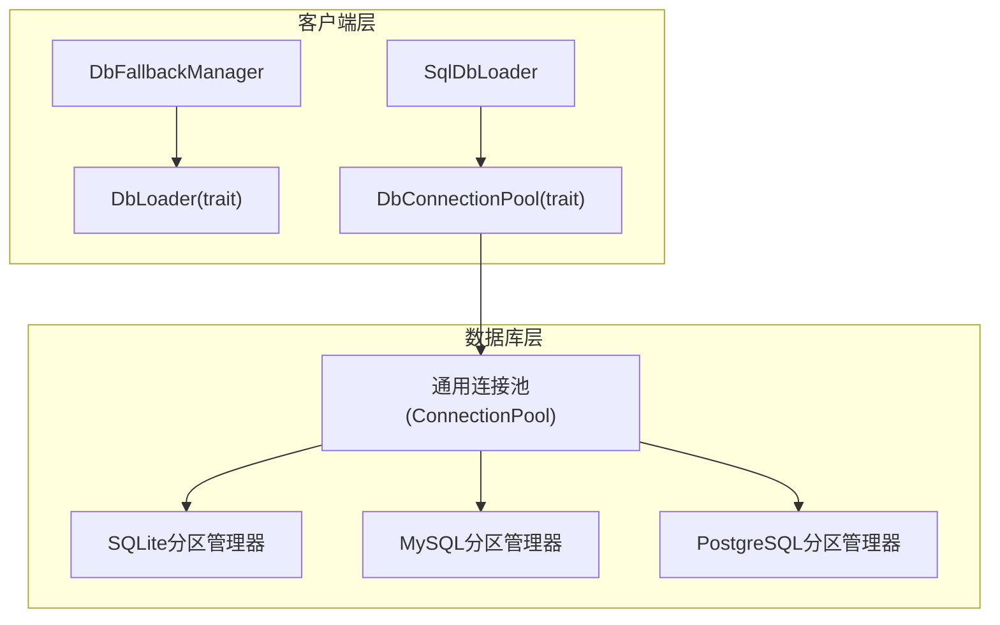
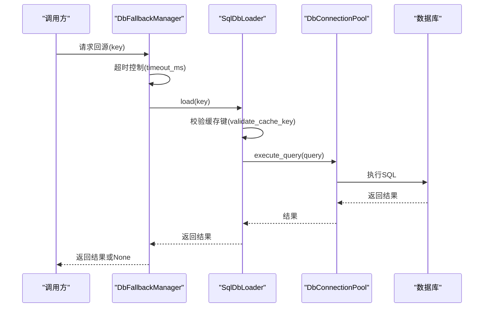
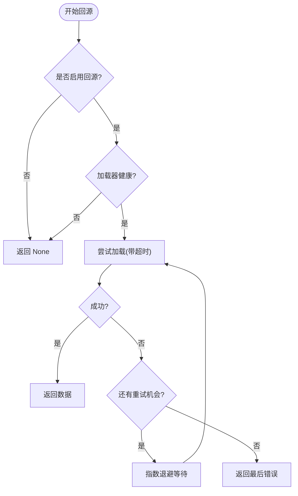
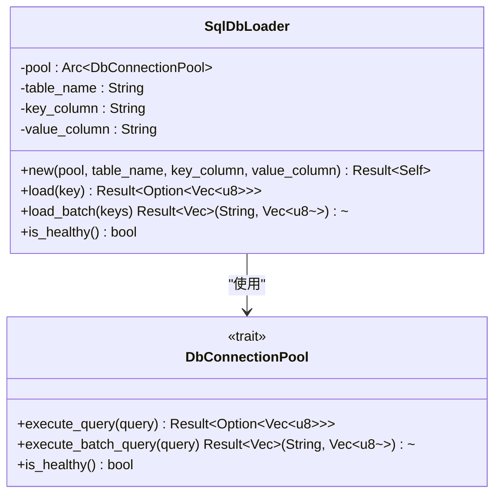
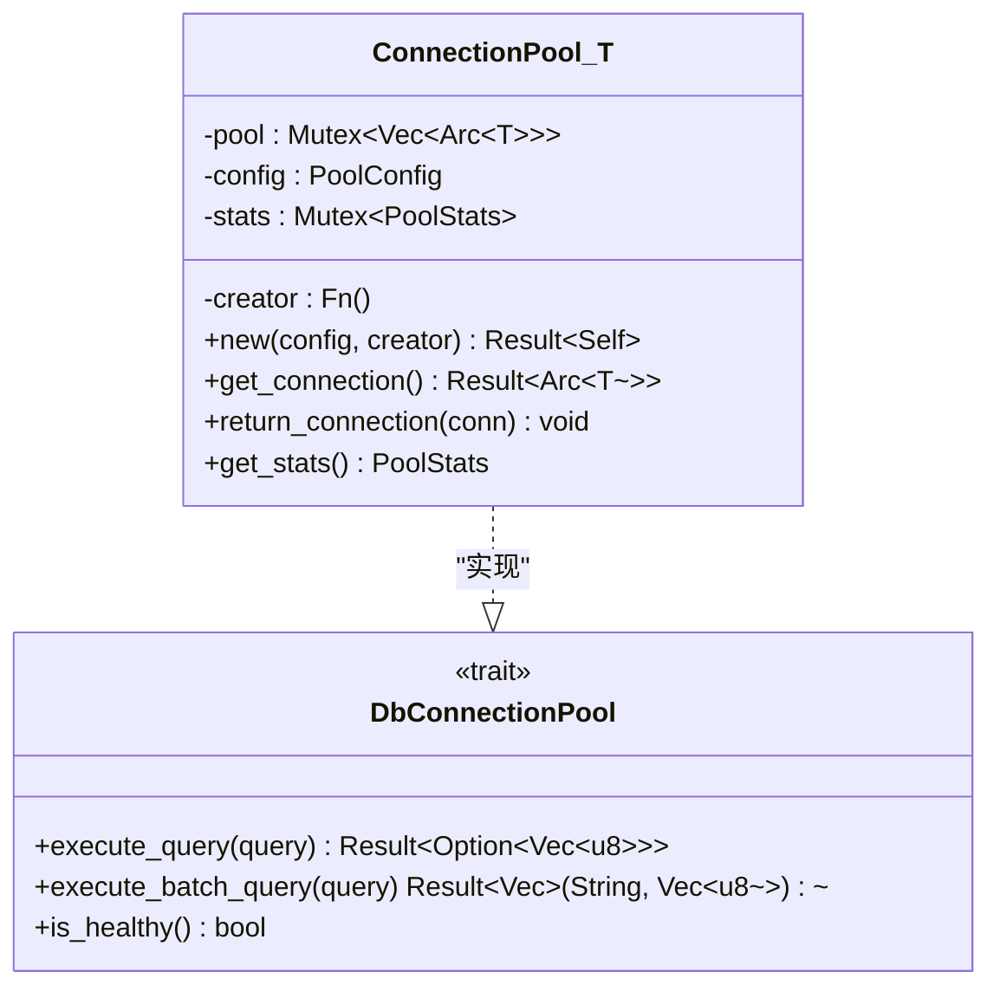
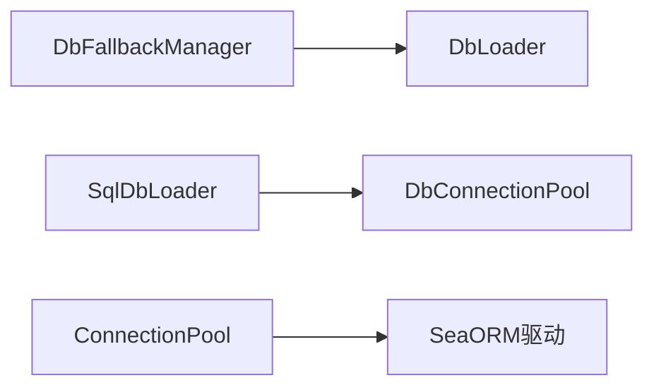

# 数据库加载器

<cite>
**本文引用的文件**
- [src/client/db_loader.rs](file://src/client/db_loader.rs)
- [src/database/common.rs](file://src/database/common.rs)
- [src/database/sqlite.rs](file://src/database/sqlite.rs)
- [src/database/mysql.rs](file://src/database/mysql.rs)
- [src/database/postgresql.rs](file://src/database/postgresql.rs)
- [src/database/mod.rs](file://src/database/mod.rs)
- [tests/database_test_utils.rs](file://tests/database_test_utils.rs)
- [tests/cross_database_integration_tests.rs](file://tests/cross_database_integration_tests.rs)
</cite>

## 目录
1. [简介](#简介)
2. [项目结构](#项目结构)
3. [核心组件](#核心组件)
4. [架构总览](#架构总览)
5. [详细组件分析](#详细组件分析)
6. [依赖关系分析](#依赖关系分析)
7. [性能考量](#性能考量)
8. [故障排查指南](#故障排查指南)
9. [结论](#结论)
10. [附录](#附录)

## 简介
本章节系统性介绍 Oxcache 的数据库加载器与回源管理能力，重点覆盖以下内容：
- DbLoader trait 的设计与职责边界：单键加载与批量加载接口、健康检查。
- SqlDbLoader 的实现细节：SQL 查询构造、参数转义、缓存键校验、错误处理。
- DbFallbackManager 的工作机制：重试策略、超时控制、健康检查与回源流程。
- 数据库连接池接口 DbConnectionPool 的设计与实现要求。
- 安全与性能实践：SQL 注入防护、缓存键验证、查询优化建议。
- 使用示例与最佳实践：如何实现自定义加载器、配置参数、处理异常。

## 项目结构
数据库加载器相关代码主要分布在以下模块：
- 客户端加载器与回源管理：src/client/db_loader.rs
- 通用数据库连接池与工具：src/database/common.rs
- 各数据库分区与连接管理：src/database/{sqlite,mysql,postgresql}.rs
- 数据库类型与分区抽象：src/database/mod.rs
- 测试与跨库一致性验证：tests/{database_test_utils,cross_database_integration_tests}.rs

图表来源
- [src/client/db_loader.rs](file://src/client/db_loader.rs#L84-L446)
- [src/database/common.rs](file://src/database/common.rs#L74-L161)
- [src/database/sqlite.rs](file://src/database/sqlite.rs#L18-L181)
- [src/database/mysql.rs](file://src/database/mysql.rs#L32-L185)
- [src/database/postgresql.rs](file://src/database/postgresql.rs#L41-L274)

章节来源
- [src/client/db_loader.rs](file://src/client/db_loader.rs#L1-L480)
- [src/database/common.rs](file://src/database/common.rs#L1-L386)
- [src/database/sqlite.rs](file://src/database/sqlite.rs#L1-L490)
- [src/database/mysql.rs](file://src/database/mysql.rs#L1-L570)
- [src/database/postgresql.rs](file://src/database/postgresql.rs#L1-L550)
- [src/database/mod.rs](file://src/database/mod.rs#L1-L43)

## 核心组件
- DbLoader：定义从数据库加载数据的异步接口，包括单键加载、批量加载与健康检查。
- SqlDbLoader：DbLoader 的示例实现，负责构建 SQL 查询、执行查询并通过连接池返回结果。
- DbFallbackManager：封装回源逻辑，提供带超时与指数退避重试的回源加载与批量回源。
- DbConnectionPool：数据库连接池抽象，定义查询与批量查询接口及健康检查。
- 通用连接池 ConnectionPool：通用的连接池实现，支持最小空闲连接、最大连接数、统计信息等。

章节来源
- [src/client/db_loader.rs](file://src/client/db_loader.rs#L84-L446)
- [src/database/common.rs](file://src/database/common.rs#L74-L161)

## 架构总览
数据库加载器采用“加载器 + 回源管理器 + 连接池”的分层设计：
- 上层通过 DbFallbackManager 发起回源请求，内部根据配置进行超时与重试控制。
- 回源请求委托给实现了 DbLoader 的具体加载器（如 SqlDbLoader）。
- SqlDbLoader 通过 DbConnectionPool 执行 SQL 查询，并对输入进行严格校验与转义。
- 连接池层可对接不同数据库的分区管理器，保证查询在正确的分区上执行。

图表来源
- [src/client/db_loader.rs](file://src/client/db_loader.rs#L171-L216)
- [src/client/db_loader.rs](file://src/client/db_loader.rs#L358-L376)
- [src/client/db_loader.rs](file://src/client/db_loader.rs#L435-L446)

## 详细组件分析

### DbLoader 与回源管理器
- 设计要点
  - 单键加载：load(key) 返回 Option<Vec<u8>>，未命中返回 None。
  - 批量加载：load_batch(keys) 返回 Vec<(String, Vec<u8>)>，便于批量回源。
  - 健康检查：is_healthy() 用于快速判断加载器可用性。
- 回源管理器
  - 超时控制：每个请求在 timeout_ms 内完成，超时返回 None 并记录日志。
  - 重试策略：最多 max_retries 次重试，采用指数退避（2^attempt 毫秒）。
  - 健康检查：若加载器不健康，直接跳过回源。
  - 批量回源：使用 tokio::time::timeout 控制整体批量超时。

图表来源
- [src/client/db_loader.rs](file://src/client/db_loader.rs#L171-L216)
- [src/client/db_loader.rs](file://src/client/db_loader.rs#L269-L286)

章节来源
- [src/client/db_loader.rs](file://src/client/db_loader.rs#L84-L112)
- [src/client/db_loader.rs](file://src/client/db_loader.rs#L114-L292)

### SqlDbLoader 实现
- 输入校验
  - SQL 标识符校验：表名、键列名、值列名必须满足标识符规则（字母、数字、下划线，且不以数字开头）。
  - 缓存键校验：键格式需符合白名单字符集合与长度限制。
- 查询构造与转义
  - 单键查询：构造 SELECT value FROM table WHERE key = 'escaped_key'。
  - 批量查询：构造 IN 列表，对每个键进行字符串转义后再拼接。
  - 标识符二次校验：在生成 SQL 前再次校验各标识符，防止注入。
- 错误处理
  - 对无效输入返回 InvalidInput 错误。
  - 对数据库错误统一包装为 DatabaseError 或 Timeout。
- 健康检查
  - 委托连接池的 is_healthy()。

图表来源
- [src/client/db_loader.rs](file://src/client/db_loader.rs#L295-L433)
- [src/client/db_loader.rs](file://src/client/db_loader.rs#L435-L446)

章节来源
- [src/client/db_loader.rs](file://src/client/db_loader.rs#L295-L433)

### 数据库连接池接口与实现
- DbConnectionPool
  - execute_query：执行单条查询，返回 Option<Vec<u8>>。
  - execute_batch_query：执行批量查询，返回 Vec<(String, Vec<u8>)>。
  - is_healthy：检查连接池健康状态。
- 通用连接池 ConnectionPool<T>
  - 支持最小空闲连接、最大连接数、动态扩容、统计信息。
  - get_connection/return_connection：连接生命周期管理。
  - get_stats：返回活跃/空闲/总数等统计。

图表来源
- [src/client/db_loader.rs](file://src/client/db_loader.rs#L435-L446)
- [src/database/common.rs](file://src/database/common.rs#L74-L161)

章节来源
- [src/database/common.rs](file://src/database/common.rs#L74-L161)

### 数据库分区与连接管理（跨库）
- SQLite
  - 标识符验证与转义：使用双引号包裹并转义内部双引号；禁止保留字。
  - 视图与主表：通过视图聚合主表与分区表，提供统一查询入口。
- MySQL
  - 标识符验证：仅允许字母、数字、下划线，且不以数字开头；禁止保留字。
  - 分区命名与重组：支持按月份创建分区，必要时重组相邻分区。
- PostgreSQL
  - 标识符验证：仅允许字母、数字、下划线，且不以数字开头；禁止保留字。
  - 分区创建：使用声明式 RANGE 分区，创建默认分区。
- 跨库一致性测试
  - 验证不同数据库的分区命名与清理行为一致性。

章节来源
- [src/database/sqlite.rs](file://src/database/sqlite.rs#L24-L92)
- [src/database/mysql.rs](file://src/database/mysql.rs#L394-L446)
- [src/database/postgresql.rs](file://src/database/postgresql.rs#L112-L207)
- [tests/cross_database_integration_tests.rs](file://tests/cross_database_integration_tests.rs#L38-L144)

## 依赖关系分析
- 组件耦合
  - DbFallbackManager 依赖 DbLoader；SqlDbLoader 依赖 DbConnectionPool。
  - DbConnectionPool 与具体数据库实现解耦，通过 ConnectionPool<T> 抽象。
- 外部依赖
  - SeaORM 用于数据库连接与语句执行。
  - Tokio 的超时与并发工具用于回源与分区管理。
- 潜在循环依赖
  - 代码结构清晰，无循环依赖迹象。

图表来源
- [src/client/db_loader.rs](file://src/client/db_loader.rs#L114-L125)
- [src/client/db_loader.rs](file://src/client/db_loader.rs#L295-L305)
- [src/database/common.rs](file://src/database/common.rs#L74-L83)

章节来源
- [src/client/db_loader.rs](file://src/client/db_loader.rs#L1-L480)
- [src/database/common.rs](file://src/database/common.rs#L1-L386)

## 性能考量
- 查询优化建议
  - 为缓存键列建立索引，加速单键与批量查询。
  - 批量查询使用 IN 列表时，注意 IN 参数数量上限，必要时拆分批次。
  - 使用分区表按时间维度切分数据，减少扫描范围。
- 连接池优化
  - 合理设置 min_idle 与 max_size，平衡延迟与资源占用。
  - 监控活跃连接数与等待请求数，避免连接池耗尽。
- 超时与重试
  - 为单次回源设置合理 timeout_ms，避免阻塞主流程。
  - 重试间隔采用指数退避，降低数据库压力峰值。

## 故障排查指南
- 常见问题与定位
  - 回源失败：检查 DbFallbackManager 的 enabled 与 max_retries 设置；确认加载器 is_healthy() 返回 true。
  - 超时：调整 timeout_ms；观察批量回源是否因 IN 列表过大导致超时。
  - SQL 注入风险：确保表名、列名均通过 validate_sql_identifier 校验；避免拼接不受控的标识符。
  - 连接池耗尽：增大 max_size 或减少并发；检查是否有连接泄漏。
- 日志与监控
  - 使用 tracing 日志级别区分 info/debug/warn/error，便于定位问题。
  - 通过 get_stats 获取连接池统计信息，评估资源使用情况。

章节来源
- [src/client/db_loader.rs](file://src/client/db_loader.rs#L171-L216)
- [src/database/common.rs](file://src/database/common.rs#L148-L160)

## 结论
Oxcache 的数据库加载器通过清晰的接口分层与严格的输入校验，提供了高可靠、可扩展的回源能力。结合连接池与分区管理，可在多数据库环境下保持一致的行为与性能表现。建议在生产环境中配合合理的超时与重试策略、索引与分区设计，以及完善的监控告警体系，持续优化回源链路的稳定性与吞吐。

## 附录

### 使用示例与最佳实践
- 自定义数据库加载器
  - 实现 DbLoader trait：提供 load 与 load_batch 方法，并在其中调用自定义连接池执行 SQL。
  - 在 load_batch 中对 keys 进行批量校验与转义，避免单条拼接带来的性能与安全问题。
- 配置加载器参数
  - DbFallbackConfig：控制是否启用回源、超时时间与最大重试次数。
  - 连接池配置：根据业务 QPS 与数据库承载能力设置 min_idle 与 max_size。
- 处理加载异常
  - 对 InvalidInput 错误进行快速失败与告警。
  - 对 DatabaseError 与 Timeout 进行分级处理，必要时触发降级策略。

章节来源
- [src/client/db_loader.rs](file://src/client/db_loader.rs#L448-L479)
- [src/database/common.rs](file://src/database/common.rs#L29-L51)