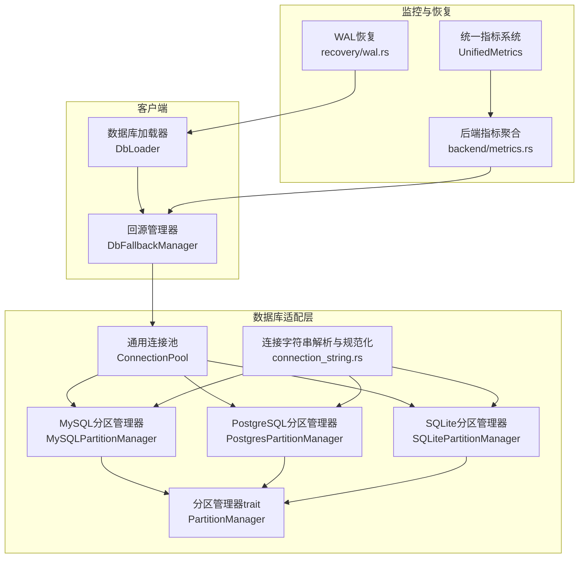
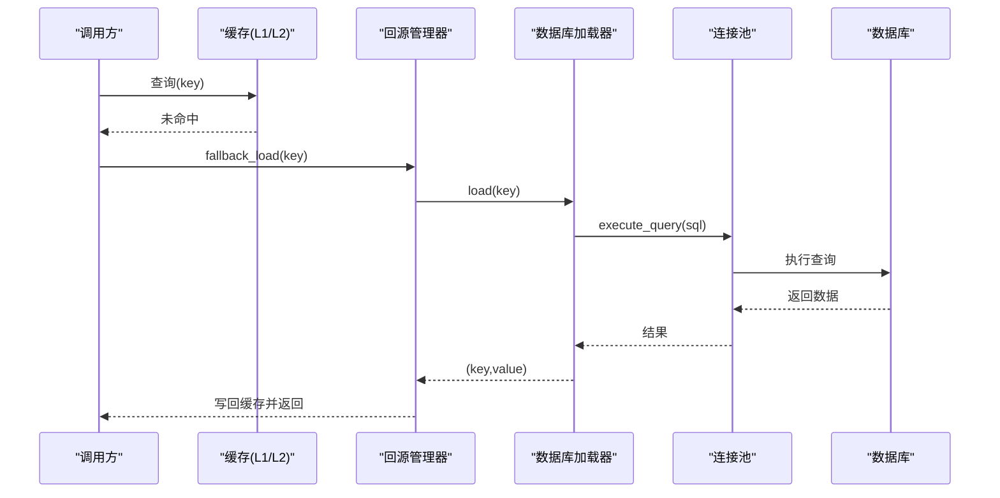
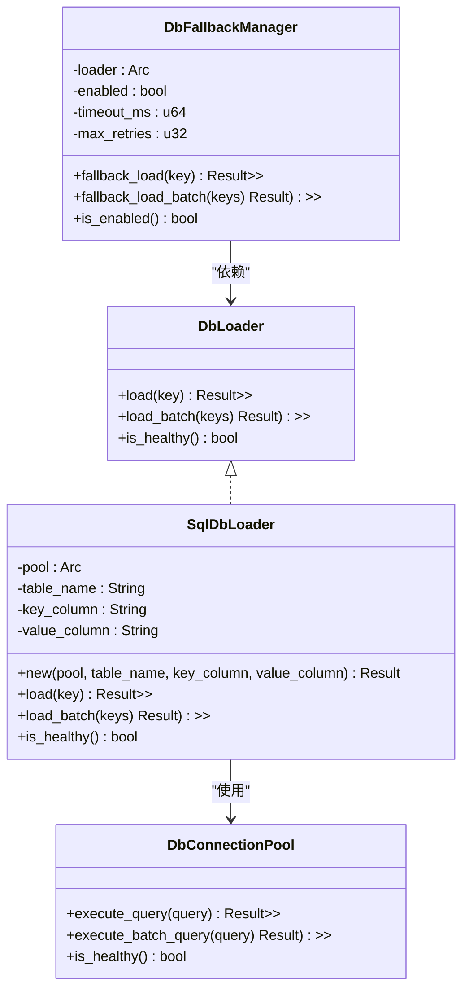
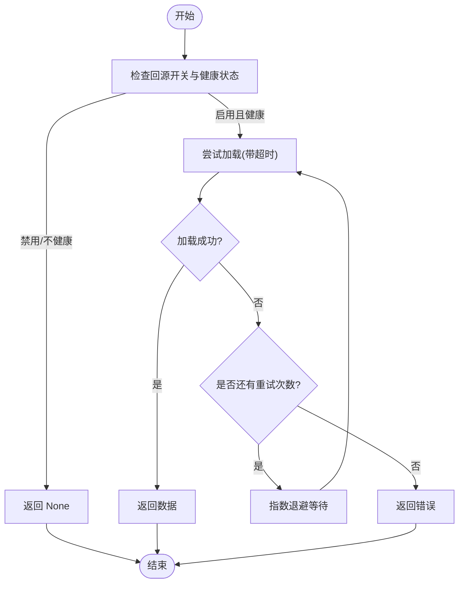
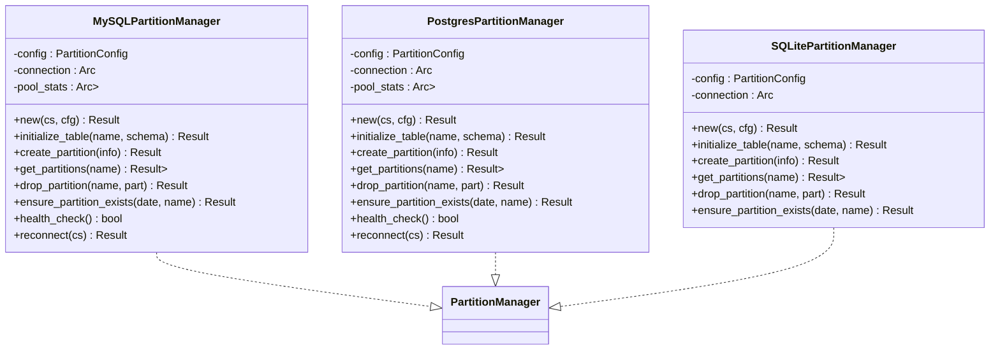
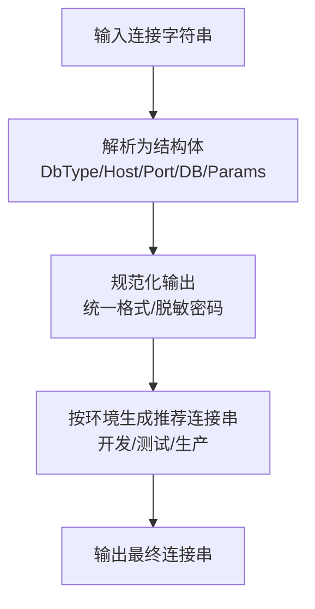
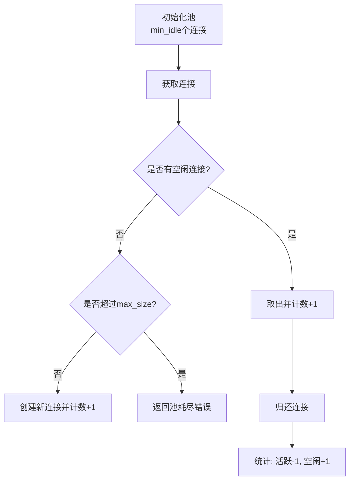
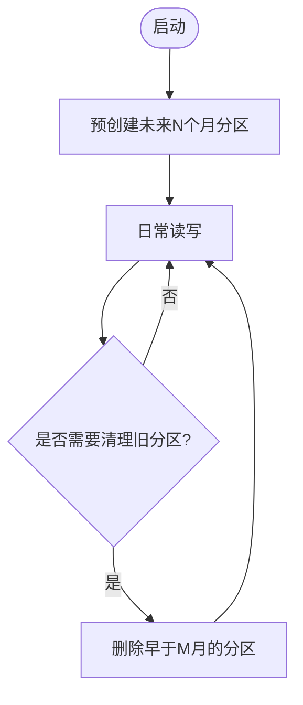
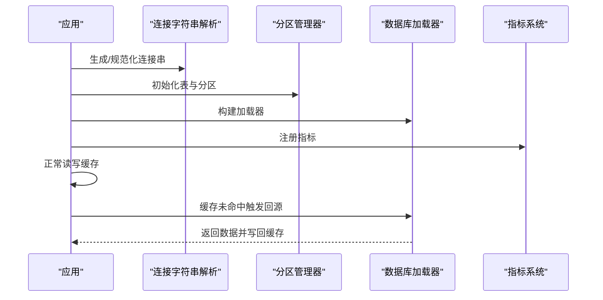
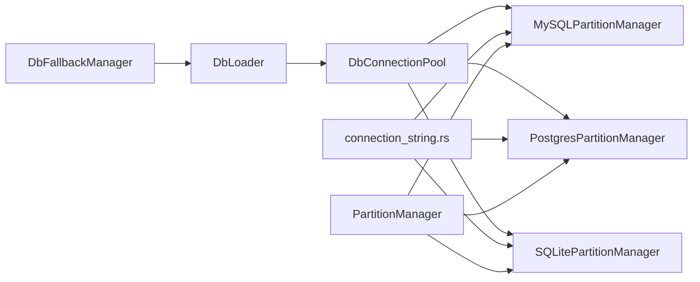

# 数据库集成

<cite>
**本文引用的文件**
- [src/client/db_loader.rs](file://src/client/db_loader.rs)
- [src/database/mod.rs](file://src/database/mod.rs)
- [src/database/mysql.rs](file://src/database/mysql.rs)
- [src/database/postgresql.rs](file://src/database/postgresql.rs)
- [src/database/sqlite.rs](file://src/database/sqlite.rs)
- [src/database/connection_string.rs](file://src/database/connection_string.rs)
- [src/database/common.rs](file://src/database/common.rs)
- [src/database/partition/mod.rs](file://src/database/partition/mod.rs)
- [src/error.rs](file://src/error.rs)
- [src/metrics/unified.rs](file://src/metrics/unified.rs)
- [src/backend/metrics.rs](file://src/backend/metrics.rs)
- [src/recovery/wal.rs](file://src/recovery/wal.rs)
- [tests/test_config.toml](file://tests/test_config.toml)
- [examples/src/dynamic_config.rs](file://examples/src/dynamic_config.rs)
</cite>

## 目录
1. [简介](#简介)
2. [项目结构](#项目结构)
3. [核心组件](#核心组件)
4. [架构总览](#架构总览)
5. [详细组件分析](#详细组件分析)
6. [依赖关系分析](#依赖关系分析)
7. [性能考虑](#性能考虑)
8. [故障排查指南](#故障排查指南)
9. [结论](#结论)
10. [附录](#附录)

## 简介
本章节系统阐述 Oxcache 的数据库集成方案，覆盖数据库加载器、缓存旁路模式、连接管理与池化、分区策略、一致性保障、性能监控与故障处理等方面。文档面向不同技术背景的读者，既提供高层概览，也给出代码级的可视化与流程说明，帮助快速理解并落地数据库集成。

## 项目结构
Oxcache 的数据库集成主要分布在以下模块：
- 客户端侧：数据库加载器与旁路逻辑，负责在缓存未命中时从数据库回源加载数据
- 数据库侧：MySQL、PostgreSQL、SQLite 的分区管理与连接池封装
- 工具与规范：连接字符串解析与规范化、通用连接池、分区策略抽象
- 监控与恢复：统一指标采集、性能快照、WAL 恢复

**图表来源**
- [src/client/db_loader.rs](file://src/client/db_loader.rs#L114-L292)
- [src/database/mysql.rs](file://src/database/mysql.rs#L32-L185)
- [src/database/postgresql.rs](file://src/database/postgresql.rs#L40-L273)
- [src/database/sqlite.rs](file://src/database/sqlite.rs#L18-L181)
- [src/database/connection_string.rs](file://src/database/connection_string.rs#L23-L38)
- [src/database/common.rs](file://src/database/common.rs#L74-L161)
- [src/metrics/unified.rs](file://src/metrics/unified.rs#L159-L509)
- [src/backend/metrics.rs](file://src/backend/metrics.rs#L524-L695)
- [src/recovery/wal.rs](file://src/recovery/wal.rs#L51-L96)

**章节来源**
- [src/database/mod.rs](file://src/database/mod.rs#L17-L42)
- [src/database/connection_string.rs](file://src/database/connection_string.rs#L23-L38)

## 核心组件
- 数据库加载器与回源管理器：在缓存未命中时从数据库加载数据，支持单键与批量加载、超时控制、指数退避重试、健康检查
- 分区管理器与策略：按月分区，支持 MySQL、PostgreSQL、SQLite；提供预创建与过期清理能力
- 连接字符串解析与规范化：统一解析与生成推荐连接串，支持脱敏输出
- 通用连接池：最小空闲、最大连接、超时与统计
- 监控与恢复：统一指标、性能快照、WAL 恢复

**章节来源**
- [src/client/db_loader.rs](file://src/client/db_loader.rs#L84-L112)
- [src/database/partition/mod.rs](file://src/database/partition/mod.rs#L15-L37)
- [src/database/common.rs](file://src/database/common.rs#L29-L51)

## 架构总览
数据库集成采用“缓存优先 + 回源兜底”的模式。当 L1/L2 缓存未命中时，通过回源管理器触发数据库加载器执行查询，将结果写回缓存。数据库侧通过分区管理器按月维护历史数据，连接池负责资源管理与健康检查。

**图表来源**
- [src/client/db_loader.rs](file://src/client/db_loader.rs#L161-L216)
- [src/database/common.rs](file://src/database/common.rs#L104-L134)

## 详细组件分析

### 数据库加载器与回源管理器
- DbLoader trait：定义单键与批量加载接口，以及健康检查
- DbFallbackManager：封装回源逻辑，支持超时、重试、健康检查、批量加载
- SqlDbLoader：基于 SeaORM 的 SQL 加载器，内置 SQL 标识符校验与字符串转义，支持单键与批量查询

**图表来源**
- [src/client/db_loader.rs](file://src/client/db_loader.rs#L84-L112)
- [src/client/db_loader.rs](file://src/client/db_loader.rs#L114-L292)
- [src/client/db_loader.rs](file://src/client/db_loader.rs#L294-L433)

**章节来源**
- [src/client/db_loader.rs](file://src/client/db_loader.rs#L84-L112)
- [src/client/db_loader.rs](file://src/client/db_loader.rs#L114-L292)
- [src/client/db_loader.rs](file://src/client/db_loader.rs#L294-L433)

### 缓存旁路模式工作流
- 启用条件：回源开关开启且加载器健康
- 单键回源：带超时与指数退避重试
- 批量回源：超时控制，失败即返回错误
- 关键点：输入校验（缓存键、SQL 标识符）、SQL 转义、健康检查

**图表来源**
- [src/client/db_loader.rs](file://src/client/db_loader.rs#L161-L216)
- [src/client/db_loader.rs](file://src/client/db_loader.rs#L269-L286)

**章节来源**
- [src/client/db_loader.rs](file://src/client/db_loader.rs#L161-L216)
- [src/client/db_loader.rs](file://src/client/db_loader.rs#L218-L267)

### 支持的数据库类型与集成要点
- MySQL：基于 SeaORM 连接，按月分区，支持标识符校验与转义，连接池统计与健康检查
- PostgreSQL：基于 SeaORM 连接，声明式分区，标识符校验与双引号转义，连接池统计与健康检查
- SQLite：本地文件或内存数据库，视图合并主表与分区表，标识符校验与双引号转义

**图表来源**
- [src/database/mysql.rs](file://src/database/mysql.rs#L32-L185)
- [src/database/postgresql.rs](file://src/database/postgresql.rs#L40-L273)
- [src/database/sqlite.rs](file://src/database/sqlite.rs#L18-L181)
- [src/database/partition/mod.rs](file://src/database/partition/mod.rs#L108-L182)

**章节来源**
- [src/database/mysql.rs](file://src/database/mysql.rs#L392-L568)
- [src/database/postgresql.rs](file://src/database/postgresql.rs#L499-L548)
- [src/database/sqlite.rs](file://src/database/sqlite.rs#L182-L489)

### 连接字符串解析与规范化
- 解析：支持 SQLite、MySQL、PostgreSQL、Redis，自动识别协议与参数
- 规范化：统一输出格式，支持密码脱敏
- 推荐：按环境生成推荐连接串（开发/测试/生产），便于运维与安全

**图表来源**
- [src/database/connection_string.rs](file://src/database/connection_string.rs#L275-L289)
- [src/database/connection_string.rs](file://src/database/connection_string.rs#L383-L391)
- [src/database/connection_string.rs](file://src/database/connection_string.rs#L595-L602)

**章节来源**
- [src/database/connection_string.rs](file://src/database/connection_string.rs#L275-L289)
- [src/database/connection_string.rs](file://src/database/connection_string.rs#L383-L391)
- [src/database/connection_string.rs](file://src/database/connection_string.rs#L595-L602)

### 通用连接池与池化策略
- 配置：最大连接数、最小空闲、连接/空闲超时
- 行为：空闲池取用、池耗尽动态创建、统计活跃/空闲/等待
- 适用：数据库加载器与分区管理器均可复用

**图表来源**
- [src/database/common.rs](file://src/database/common.rs#L85-L161)

**章节来源**
- [src/database/common.rs](file://src/database/common.rs#L29-L51)
- [src/database/common.rs](file://src/database/common.rs#L85-L161)

### 分区策略与生命周期管理
- 策略：按月分区（Monthly），支持范围分区扩展
- 生命周期：预创建未来 N 个月分区、清理过期分区（保留 M 个月）
- 标识符安全：严格校验表名/列名，防止注入；转义标识符

**图表来源**
- [src/database/partition/mod.rs](file://src/database/partition/mod.rs#L129-L182)

**章节来源**
- [src/database/partition/mod.rs](file://src/database/partition/mod.rs#L15-L37)
- [src/database/partition/mod.rs](file://src/database/partition/mod.rs#L129-L182)

### 数据库与缓存一致性保障
- 写入路径：应用写入缓存，同时持久化到数据库；WAL 记录写入以支持恢复
- 读取路径：缓存未命中时回源数据库，校验与转义降低注入风险
- 一致性建议：在高并发场景下，建议结合 TTL 与版本号策略，必要时使用分布式锁或单飞（single flight）避免击穿

**章节来源**
- [src/recovery/wal.rs](file://src/recovery/wal.rs#L51-L96)

### 完整集成示例（思路与步骤）
- 配置连接：使用连接字符串解析与规范化，按环境生成推荐连接串
- 初始化分区：根据表结构与分区策略创建分区表或普通表
- 启动加载器：构建 SqlDbLoader，配置表名/键列/值列
- 回源策略：设置回源开关、超时与重试参数
- 监控与恢复：接入统一指标系统，定期导出 Prometheus 指标；启用 WAL 以提升可靠性

**图表来源**
- [src/database/connection_string.rs](file://src/database/connection_string.rs#L595-L602)
- [src/database/mysql.rs](file://src/database/mysql.rs#L187-L210)
- [src/client/db_loader.rs](file://src/client/db_loader.rs#L294-L353)
- [src/metrics/unified.rs](file://src/metrics/unified.rs#L159-L273)

**章节来源**
- [src/database/connection_string.rs](file://src/database/connection_string.rs#L595-L602)
- [src/database/mysql.rs](file://src/database/mysql.rs#L187-L210)
- [src/client/db_loader.rs](file://src/client/db_loader.rs#L294-L353)
- [src/metrics/unified.rs](file://src/metrics/unified.rs#L159-L273)

## 依赖关系分析
- 组件耦合：回源管理器依赖 DbLoader；SqlDbLoader 依赖 DbConnectionPool；分区管理器实现 PartitionManager；连接字符串模块被各数据库实现依赖
- 外部依赖：SeaORM 用于数据库连接与查询；Tokio 异步运行时；Tracing 日志；DashMap、OnceCell 等并发容器
- 循环依赖：未发现循环导入；模块边界清晰

**图表来源**
- [src/client/db_loader.rs](file://src/client/db_loader.rs#L114-L125)
- [src/database/mysql.rs](file://src/database/mysql.rs#L32-L37)
- [src/database/postgresql.rs](file://src/database/postgresql.rs#L40-L44)
- [src/database/sqlite.rs](file://src/database/sqlite.rs#L18-L21)
- [src/database/connection_string.rs](file://src/database/connection_string.rs#L23-L38)

**章节来源**
- [src/client/db_loader.rs](file://src/client/db_loader.rs#L114-L125)
- [src/database/mysql.rs](file://src/database/mysql.rs#L32-L37)
- [src/database/postgresql.rs](file://src/database/postgresql.rs#L40-L44)
- [src/database/sqlite.rs](file://src/database/sqlite.rs#L18-L21)
- [src/database/connection_string.rs](file://src/database/connection_string.rs#L23-L38)

## 性能考虑
- 连接池优化：合理设置 min_idle 与 max_size，避免池耗尽；关注 idle_timeout 与 acquire_timeout
- 查询优化：批量加载减少往返；索引设计与分区裁剪（按月分区）提升扫描效率
- 超时与重试：为回源设置合理超时与指数退避，避免雪崩
- 指标监控：利用统一指标系统记录命中率、延迟分布、错误计数，定期导出 Prometheus 指标进行趋势分析

**章节来源**
- [src/database/common.rs](file://src/database/common.rs#L29-L51)
- [src/client/db_loader.rs](file://src/client/db_loader.rs#L161-L216)
- [src/metrics/unified.rs](file://src/metrics/unified.rs#L159-L273)
- [src/backend/metrics.rs](file://src/backend/metrics.rs#L524-L695)

## 故障排查指南
- 连接失败：检查连接字符串格式与参数；使用规范化输出比对；查看脱敏后的错误信息定位问题
- 连接池耗尽：增大 max_size 或缩短连接超时；观察池统计信息
- 分区异常：确认标识符校验与转义；检查分区策略与预创建/清理逻辑
- 回源失败：检查回源开关、健康检查、超时与重试配置；核对缓存键与 SQL 标识符合法性
- 指标异常：核对指标导出格式与标签；关注错误计数与延迟分布

**章节来源**
- [src/database/connection_string.rs](file://src/database/connection_string.rs#L540-L586)
- [src/database/common.rs](file://src/database/common.rs#L104-L134)
- [src/database/mysql.rs](file://src/database/mysql.rs#L103-L110)
- [src/database/postgresql.rs](file://src/database/postgresql.rs#L209-L216)
- [src/client/db_loader.rs](file://src/client/db_loader.rs#L177-L180)
- [src/error.rs](file://src/error.rs#L146-L148)

## 结论
Oxcache 的数据库集成以“缓存优先 + 回源兜底”为核心，结合分区策略、连接池与统一指标体系，提供了高可用、可观测、可扩展的数据库集成方案。通过连接字符串规范化、严格的标识符校验与转义、以及完善的监控与恢复机制，能够在多数据库环境下稳定运行并满足性能与一致性要求。

## 附录
- 配置示例：参考测试配置文件中的数据库与分区参数
- 数据库集成示例：详见 [数据库集成示例](file://examples/src/05_database/example_database_integration.rs#L25-L160)，展示了完整的数据库集成使用场景
- 动态配置示例：展示如何在应用中组织与分类配置项

**章节来源**
- [tests/test_config.toml](file://tests/test_config.toml#L1-L32)
- [examples/src/dynamic_config.rs](file://examples/src/dynamic_config.rs#L102-L132)