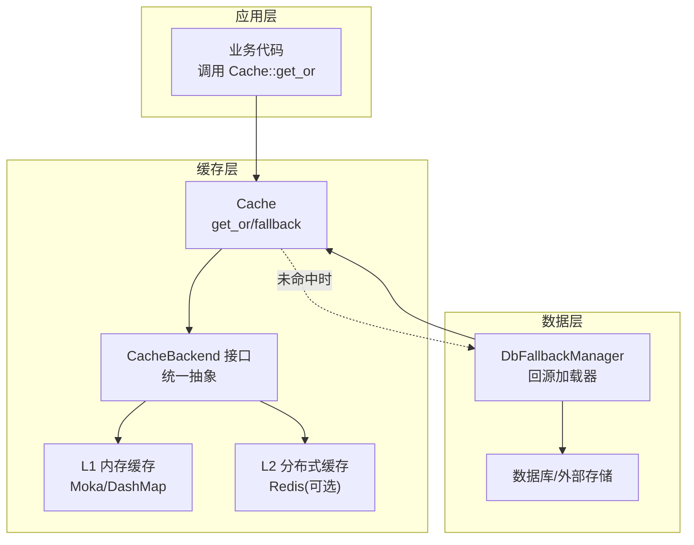
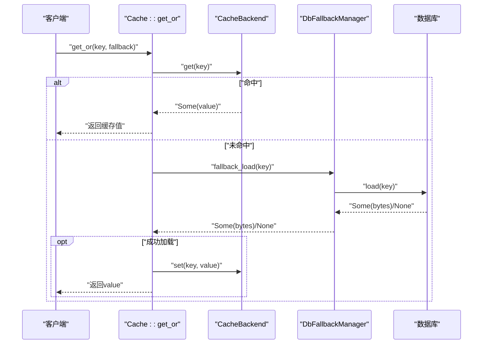
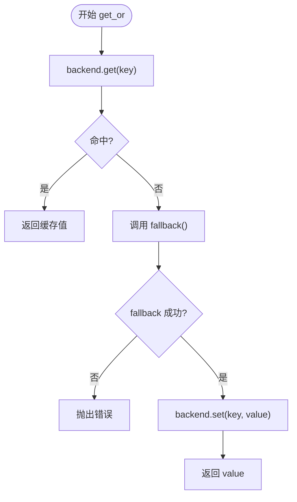
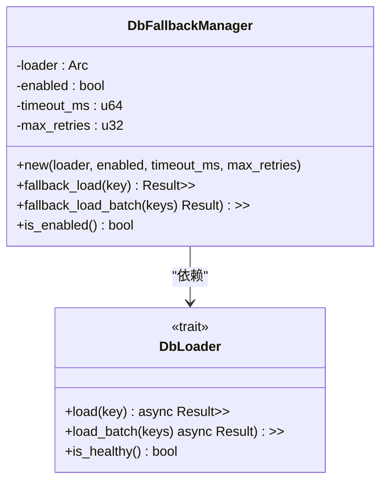
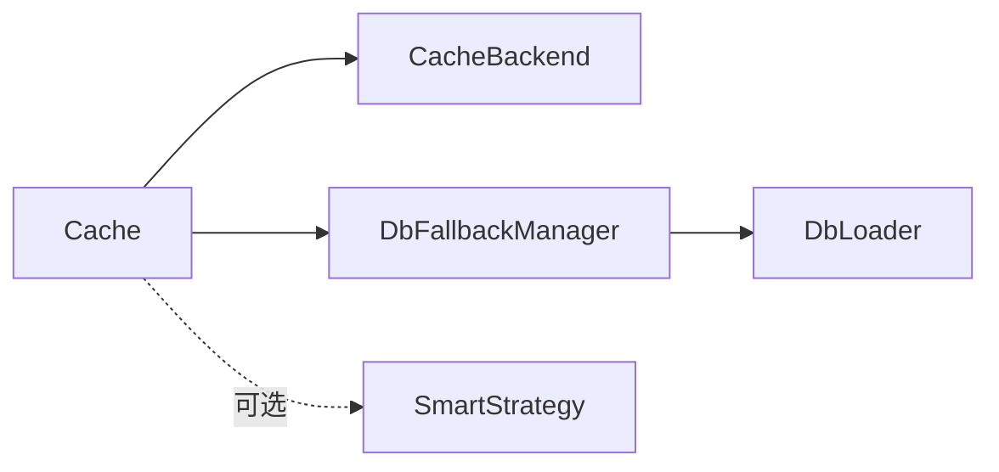

# 缓存旁路模式

<cite>
**本文档引用的文件**
- [lib.rs](file://src/lib.rs)
- [cache.rs](file://src/cache.rs)
- [db_loader.rs](file://src/client/db_loader.rs)
- [interface.rs](file://src/backend/interface.rs)
- [custom_tiered.rs](file://src/backend/custom_tiered.rs)
- [smart_strategy.rs](file://src/smart_strategy.rs)
- [cache_builder.rs](file://src/builder/cache_builder.rs)
- [example_new_api.rs](file://examples/src/01_basics/example_new_api.rs)
- [example_invalidation.rs](file://examples/src/02_advanced/example_invalidation.rs)
- [API_REFERENCE.md](file://docs/API_REFERENCE.md)
</cite>

## 目录
1. [简介](#简介)
2. [项目结构](#项目结构)
3. [核心组件](#核心组件)
4. [架构总览](#架构总览)
5. [详细组件分析](#详细组件分析)
6. [依赖关系分析](#依赖关系分析)
7. [性能考量](#性能考量)
8. [故障排查指南](#故障排查指南)
9. [结论](#结论)
10. [附录](#附录)

## 简介
本文件系统性阐述 Oxcache 的缓存旁路模式（Cache-Aside Pattern），重点说明缓存未命中时如何自动绕过缓存直接访问数据库的完整流程，涵盖数据加载、序列化、写入缓存等环节，并对比旁路模式与传统直写/回写模式的差异与优势。文档还提供旁路模式的配置项、调优参数、监控指标与运维建议，帮助读者在不同业务场景下做出合理选择。

## 项目结构
Oxcache 采用模块化设计，围绕现代 API 的 Cache 抽象构建，底层通过统一的 CacheBackend 接口适配内存与分布式缓存。旁路模式由 Cache::get_or 提供，结合数据库回源加载器 DbFallbackManager 实现“缓存未命中 -> 数据库回源 -> 写回缓存”的闭环。

**图表来源**
- [cache.rs](file://src/cache.rs#L396-L408)
- [db_loader.rs](file://src/client/db_loader.rs#L114-L292)
- [interface.rs](file://src/backend/interface.rs#L46-L166)

**章节来源**
- [lib.rs](file://src/lib.rs#L1-L680)
- [cache.rs](file://src/cache.rs#L1-L783)
- [db_loader.rs](file://src/client/db_loader.rs#L1-L480)
- [interface.rs](file://src/backend/interface.rs#L1-L264)

## 核心组件
- Cache::get_or：实现旁路模式的核心入口，先查缓存，未命中则调用回退函数加载数据并写回缓存。
- DbFallbackManager：封装数据库回源逻辑，支持超时控制、重试策略、批量回源与健康检查。
- CacheBackend：统一缓存后端接口，屏蔽 L1/L2 差异，使旁路模式可在任意后端上工作。
- SmartStrategy：命中率统计与预取决策，辅助旁路模式在低命中场景下提升吞吐。

**章节来源**
- [cache.rs](file://src/cache.rs#L396-L408)
- [db_loader.rs](file://src/client/db_loader.rs#L114-L292)
- [interface.rs](file://src/backend/interface.rs#L46-L166)
- [smart_strategy.rs](file://src/smart_strategy.rs#L1-L556)

## 架构总览
旁路模式在 Oxcache 中通过以下链路实现：
- 应用调用 Cache::get_or(key, fallback)
- Cache::get_or 先调用 backend.get(key)
- 若命中，直接返回；若未命中，调用 fallback() 从数据库加载
- 将数据库结果写回缓存 backend.set(key, value)
- 返回结果给应用

**图表来源**
- [cache.rs](file://src/cache.rs#L396-L408)
- [db_loader.rs](file://src/client/db_loader.rs#L171-L216)

**章节来源**
- [cache.rs](file://src/cache.rs#L241-L408)
- [db_loader.rs](file://src/client/db_loader.rs#L171-L216)

## 详细组件分析

### 旁路模式核心流程：Cache::get_or
- 功能：先查缓存，未命中则调用回退函数加载数据，再写回缓存。
- 关键点：
  - 序列化：读取字节后按需反序列化为具体类型（需启用 serialization 特性）。
  - 写回：将回退函数返回的结果序列化后写入缓存。
  - 异常：回退函数失败时不写回，保持缓存一致性。

**图表来源**
- [cache.rs](file://src/cache.rs#L396-L408)

**章节来源**
- [cache.rs](file://src/cache.rs#L396-L408)

### 数据库回源加载器：DbFallbackManager
- 职责：在缓存未命中时，从数据库加载数据，支持超时、重试、批量加载与健康检查。
- 关键参数：
  - enabled：是否启用回源
  - timeout_ms：单次加载超时
  - max_retries：最大重试次数（指数退避）
  - loader.is_healthy()：健康检查
- 批量回源：fallback_load_batch(keys) 支持批量加载并超时保护。

**图表来源**
- [db_loader.rs](file://src/client/db_loader.rs#L114-L292)
- [db_loader.rs](file://src/client/db_loader.rs#L84-L112)

**章节来源**
- [db_loader.rs](file://src/client/db_loader.rs#L114-L292)

### 缓存后端接口：CacheBackend
- 统一抽象：get/set/delete/exists/clear/close/ttl/expire/health_check/stats。
- 作用：使旁路模式与具体后端解耦，支持 L1 内存、L2 Redis、或自定义实现。

**章节来源**
- [interface.rs](file://src/backend/interface.rs#L46-L166)

### 智能策略：命中率与预取
- 用途：在旁路模式下，可通过命中率统计判断是否需要预取，降低未命中带来的抖动。
- 组件：HitRateCollector、PrefetchDecider、CompressionDecider。
- 旁路模式配合：当命中率下降时，可提前触发预取，减少后续未命中概率。

**章节来源**
- [smart_strategy.rs](file://src/smart_strategy.rs#L1-L556)

### 分层缓存与旁路模式的关系
- CustomTieredConfig 支持 L1/L2/L3 层级配置，旁路模式可在任一层级上工作。
- 旁路模式不改变层级结构，仅在未命中时触发回源逻辑。

**章节来源**
- [custom_tiered.rs](file://src/backend/custom_tiered.rs#L766-L779)

### 配置与调优参数
- CacheBuilder（高级配置）：
  - ttl：默认 TTL
  - capacity：内存后端容量
  - batch_writes：批写开关（Redis 场景）
  - auto_promote：分层缓存自动提升（L2->L1）
- DbFallbackManager（旁路模式关键参数）：
  - enabled：启用/禁用回源
  - timeout_ms：单次加载超时
  - max_retries：最大重试次数（指数退避）
- 示例：示例程序展示了 get_or 的典型用法。

**章节来源**
- [cache_builder.rs](file://src/builder/cache_builder.rs#L60-L172)
- [db_loader.rs](file://src/client/db_loader.rs#L448-L480)
- [example_new_api.rs](file://examples/src/01_basics/example_new_api.rs#L220-L271)

## 依赖关系分析
- Cache 依赖 CacheBackend 接口，实现与后端解耦。
- DbFallbackManager 依赖 DbLoader trait，实现数据库回源。
- SmartStrategy 与 Cache 独立，可选集成以优化命中率。
- 示例程序展示 get_or 的使用方式。

**图表来源**
- [cache.rs](file://src/cache.rs#L117-L120)
- [db_loader.rs](file://src/client/db_loader.rs#L84-L112)
- [smart_strategy.rs](file://src/smart_strategy.rs#L355-L421)

**章节来源**
- [cache.rs](file://src/cache.rs#L117-L120)
- [db_loader.rs](file://src/client/db_loader.rs#L84-L112)
- [smart_strategy.rs](file://src/smart_strategy.rs#L355-L421)

## 性能考量
- 旁路模式优势：
  - 数据一致性：未命中时从数据库加载，避免脏读。
  - 低耦合：通过 CacheBackend 抽象，旁路逻辑可跨 L1/L2/自定义后端复用。
- 性能影响：
  - 未命中开销：需一次数据库往返；可通过批量回源、超时与重试策略缓解。
  - 写回成本：回退成功后写回缓存，增加一次序列化与写入。
- 优化建议：
  - 启用 serialization 特性以支持类型安全的序列化。
  - 使用 SmartStrategy 的命中率统计与预取，降低未命中概率。
  - 对热点数据启用 auto_promote（分层缓存）以提升 L1 命中。

**章节来源**
- [cache.rs](file://src/cache.rs#L241-L325)
- [smart_strategy.rs](file://src/smart_strategy.rs#L241-L315)

## 故障排查指南
- 常见问题与定位：
  - 回源未生效：检查 DbFallbackManager.enabled 与 loader.is_healthy()。
  - 超时失败：调整 timeout_ms；观察 fallback_load/fallback_load_batch 的超时日志。
  - 重试耗尽：确认 max_retries 设置与指数退避间隔。
  - 序列化错误：确保启用 serialization 特性；检查序列化/反序列化一致性。
- 运维建议：
  - 开启 tracing 日志，关注 get_or、fallback_load、set 等关键步骤。
  - 使用 health_check 与 stats 监控缓存健康度与命中率。
  - 在高并发场景下评估 batch_writes 与 auto_promote 的效果。

**章节来源**
- [db_loader.rs](file://src/client/db_loader.rs#L171-L216)
- [cache.rs](file://src/cache.rs#L554-L572)

## 结论
Oxcache 的旁路模式通过 Cache::get_or 将“缓存未命中 -> 数据库回源 -> 写回缓存”流程标准化，结合 DbFallbackManager 的超时、重试与批量回源能力，既保证数据一致性，又具备良好的可扩展性。配合 SmartStrategy 的命中率统计与预取，旁路模式在复杂业务场景下可显著降低未命中带来的性能波动。通过合理的配置与监控，旁路模式可成为高可靠、高性能缓存架构的重要组成部分。

## 附录

### 旁路模式与传统模式对比
- 传统直写/回写模式：缓存与存储同步写入，一致性强但耦合度高。
- 旁路模式：应用侧显式处理未命中，灵活性高，适合需要严格控制一致性与可观测性的场景。

### 适用场景
- 读多写少、强一致要求高的数据（如配置、元数据）。
- 需要细粒度控制回源策略与重试的系统。
- 需要与多种后端（内存/Redis/自定义）协同的场景。

### 最佳实践
- 明确回源超时与重试策略，避免阻塞请求。
- 对热点数据启用 auto_promote（分层缓存）与预取。
- 使用 SmartStrategy 的命中率统计持续优化旁路策略。
- 在示例程序中参考 get_or 的使用方式，确保异常路径不写回缓存。

**章节来源**
- [example_new_api.rs](file://examples/src/01_basics/example_new_api.rs#L220-L271)
- [API_REFERENCE.md](file://docs/API_REFERENCE.md#L215-L277)