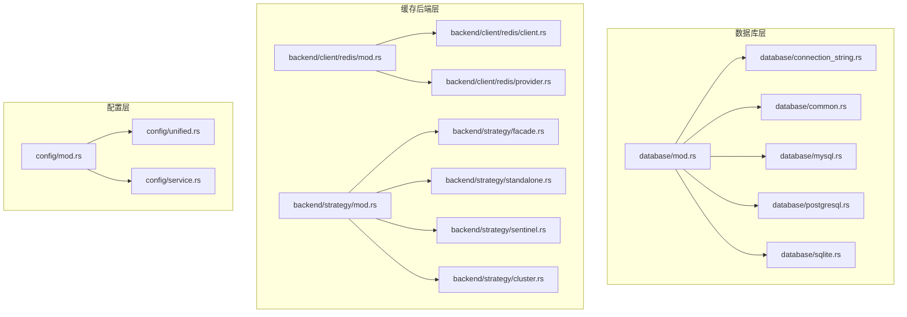
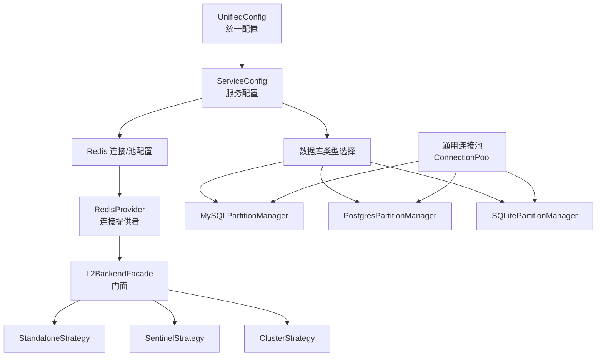
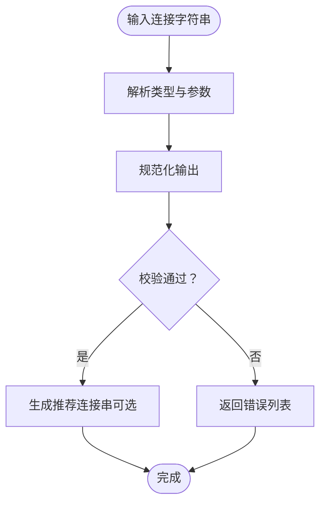
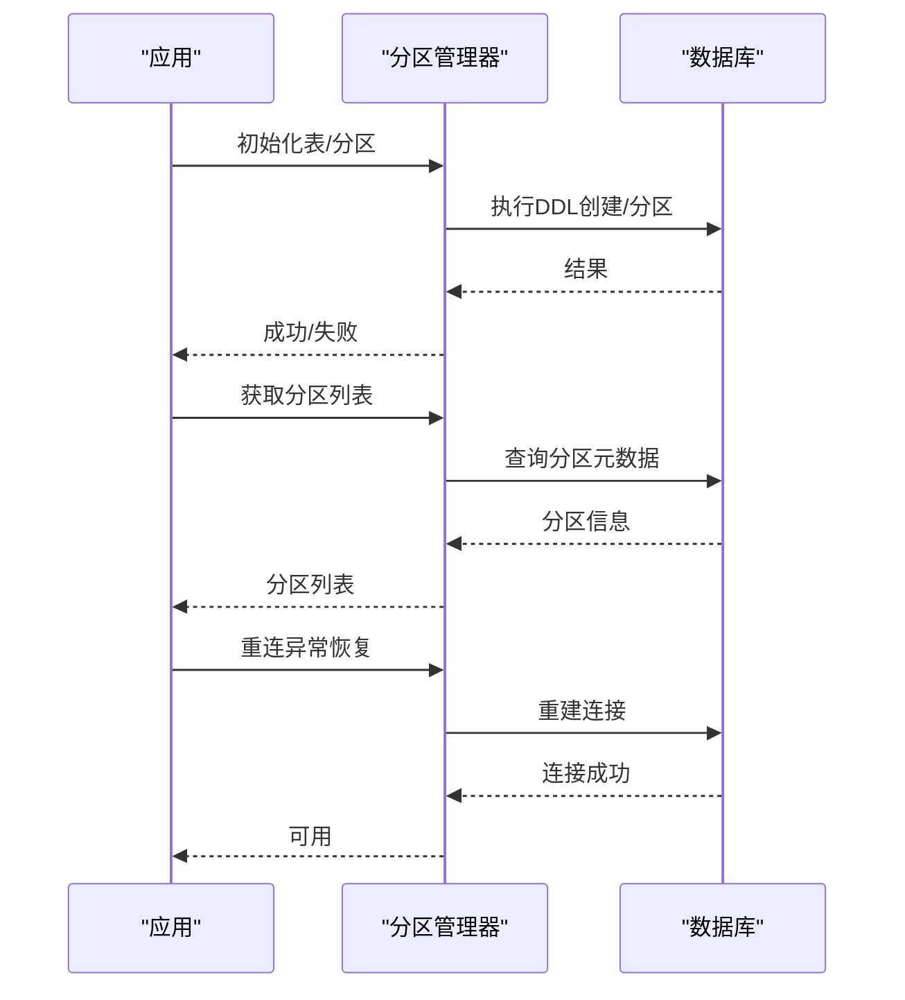
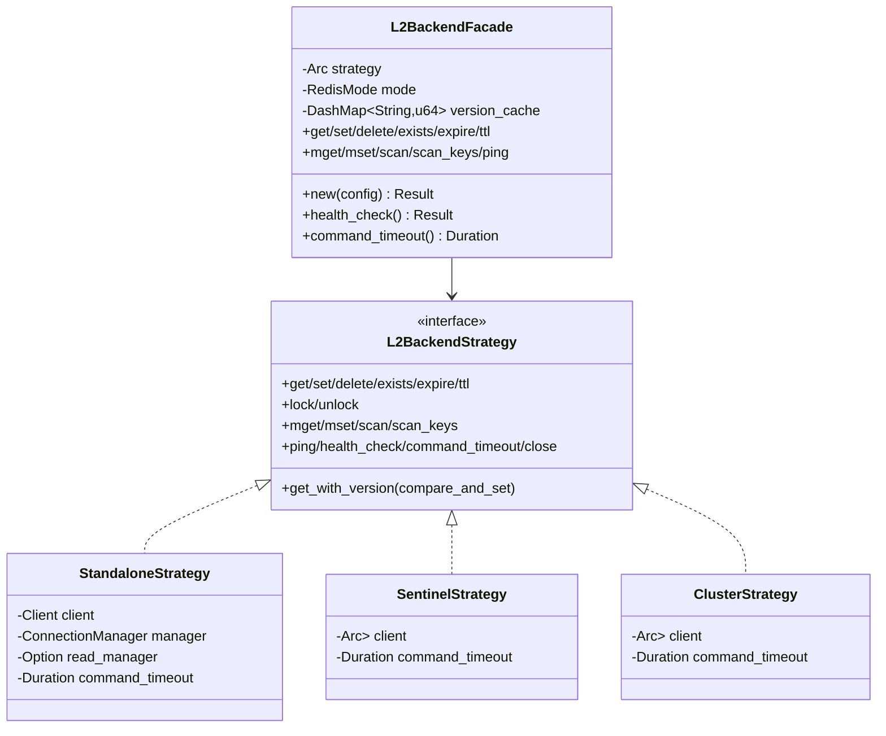
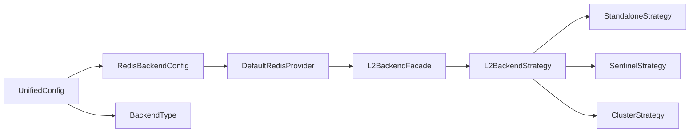

# 连接管理

<cite>
**本文引用的文件**
- [src/lib.rs](file://src/lib.rs)
- [src/database/mod.rs](file://src/database/mod.rs)
- [src/database/connection_string.rs](file://src/database/connection_string.rs)
- [src/database/common.rs](file://src/database/common.rs)
- [src/database/mysql.rs](file://src/database/mysql.rs)
- [src/database/postgresql.rs](file://src/database/postgresql.rs)
- [src/database/sqlite.rs](file://src/database/sqlite.rs)
- [src/backend/client/redis/mod.rs](file://src/backend/client/redis/mod.rs)
- [src/backend/client/redis/client.rs](file://src/backend/client/redis/client.rs)
- [src/backend/client/redis/provider.rs](file://src/backend/client/redis/provider.rs)
- [src/backend/strategy/mod.rs](file://src/backend/strategy/mod.rs)
- [src/backend/strategy/facade.rs](file://src/backend/strategy/facade.rs)
- [src/backend/strategy/standalone.rs](file://src/backend/strategy/standalone.rs)
- [src/backend/strategy/sentinel.rs](file://src/backend/strategy/sentinel.rs)
- [src/backend/strategy/cluster.rs](file://src/backend/strategy/cluster.rs)
- [src/config/mod.rs](file://src/config/mod.rs)
- [src/config/unified.rs](file://src/config/unified.rs)
- [src/config/service.rs](file://src/config/service.rs)
</cite>

## 目录
1. [简介](#简介)
2. [项目结构](#项目结构)
3. [核心组件](#核心组件)
4. [架构总览](#架构总览)
5. [详细组件分析](#详细组件分析)
6. [依赖关系分析](#依赖关系分析)
7. [性能考量](#性能考量)
8. [故障排查指南](#故障排查指南)
9. [结论](#结论)
10. [附录](#附录)

## 简介
本文件系统性阐述 Oxcache 的数据库与缓存连接管理方案，覆盖连接字符串解析与校验、连接池设计与生命周期、不同数据库类型（SQLite、MySQL、PostgreSQL）与 Redis 的连接配置、连接状态监控、故障处理与降级策略、性能优化与运维指标等。文档面向开发者与运维人员，既提供代码级细节，也给出可操作的配置建议与最佳实践。

## 项目结构
Oxcache 将连接管理按职责拆分至多个模块：
- 数据库连接与连接池：位于 database 子模块，提供通用连接池、连接字符串解析与校验、各数据库的分区管理与连接统计。
- 缓存后端与 Redis 连接：位于 backend/client/redis 与 backend/strategy，提供 Redis 客户端、连接提供者、门面与多种部署模式（单机、哨兵、集群）的策略实现。
- 配置体系：位于 config 子模块，提供统一配置结构与服务配置，支撑连接参数、超时、池大小等关键参数的集中管理。



**图表来源**
- [src/database/mod.rs](file://src/database/mod.rs#L1-L43)
- [src/database/connection_string.rs](file://src/database/connection_string.rs#L1-L1150)
- [src/database/common.rs](file://src/database/common.rs#L1-L386)
- [src/database/mysql.rs](file://src/database/mysql.rs#L1-L570)
- [src/database/postgresql.rs](file://src/database/postgresql.rs#L1-L550)
- [src/database/sqlite.rs](file://src/database/sqlite.rs#L1-L490)
- [src/backend/client/redis/mod.rs](file://src/backend/client/redis/mod.rs#L1-L15)
- [src/backend/client/redis/client.rs](file://src/backend/client/redis/client.rs#L1-L522)
- [src/backend/client/redis/provider.rs](file://src/backend/client/redis/provider.rs#L1-L195)
- [src/backend/strategy/mod.rs](file://src/backend/strategy/mod.rs#L1-L24)
- [src/backend/strategy/facade.rs](file://src/backend/strategy/facade.rs#L1-L223)
- [src/backend/strategy/standalone.rs](file://src/backend/strategy/standalone.rs#L1-L420)
- [src/backend/strategy/sentinel.rs](file://src/backend/strategy/sentinel.rs#L1-L433)
- [src/backend/strategy/cluster.rs](file://src/backend/strategy/cluster.rs#L1-L437)
- [src/config/mod.rs](file://src/config/mod.rs#L1-L32)
- [src/config/unified.rs](file://src/config/unified.rs#L1-L1016)
- [src/config/service.rs](file://src/config/service.rs#L1-L641)

**章节来源**
- [src/lib.rs](file://src/lib.rs#L1-L680)
- [src/database/mod.rs](file://src/database/mod.rs#L1-L43)

## 核心组件
- 连接字符串解析与校验：支持 SQLite、MySQL、PostgreSQL、Redis，提供规范化、验证、推荐连接串生成、测试环境识别、目录确保等能力。
- 通用连接池：基于异步互斥锁的轻量连接池，支持最小空闲连接、最大连接数、活跃/空闲连接统计。
- 数据库分区管理：针对 MySQL、PostgreSQL、SQLite 提供分区表初始化、分区创建/删除、分区扫描与校验，内置 SQL 注入防护与标识符校验。
- Redis 连接与策略：提供 Redis 客户端、连接提供者、门面模式封装的策略（单机、哨兵、集群），支持连接超时、命令超时、认证、TLS、读写分离、SCAN、MGET/MSET、锁与 CAS 等。
- 配置体系：UnifiedConfig 与 ServiceConfig 提供统一的后端、性能、监控、安全配置，支持 Redis 连接模式、池大小、超时、密钥前缀、压缩等。

**章节来源**
- [src/database/connection_string.rs](file://src/database/connection_string.rs#L1-L1150)
- [src/database/common.rs](file://src/database/common.rs#L1-L386)
- [src/database/mysql.rs](file://src/database/mysql.rs#L1-L570)
- [src/database/postgresql.rs](file://src/database/postgresql.rs#L1-L550)
- [src/database/sqlite.rs](file://src/database/sqlite.rs#L1-L490)
- [src/backend/client/redis/client.rs](file://src/backend/client/redis/client.rs#L1-L522)
- [src/backend/client/redis/provider.rs](file://src/backend/client/redis/provider.rs#L1-L195)
- [src/backend/strategy/facade.rs](file://src/backend/strategy/facade.rs#L1-L223)
- [src/config/unified.rs](file://src/config/unified.rs#L1-L1016)
- [src/config/service.rs](file://src/config/service.rs#L1-L641)

## 架构总览
Oxcache 的连接管理采用“配置驱动 + 策略模式 + 通用连接池”的架构：
- 配置层：统一配置结构与服务配置，决定后端类型、连接参数、超时、池大小、监控与安全策略。
- 策略层：Redis 通过门面聚合不同部署模式（单机、哨兵、集群），对外暴露一致的 L2BackendStrategy 接口。
- 连接层：通用连接池负责连接生命周期管理；数据库侧通过 SeaORM 连接池参数控制连接上限、空闲超时、最大生存期等。
- 安全与监控：连接字符串脱敏、TLS 强制（生产）、健康检查、指标导出、日志级别与格式控制。



**图表来源**
- [src/config/unified.rs](file://src/config/unified.rs#L1-L1016)
- [src/config/service.rs](file://src/config/service.rs#L1-L641)
- [src/backend/client/redis/provider.rs](file://src/backend/client/redis/provider.rs#L1-L195)
- [src/backend/strategy/facade.rs](file://src/backend/strategy/facade.rs#L1-L223)
- [src/backend/strategy/standalone.rs](file://src/backend/strategy/standalone.rs#L1-L420)
- [src/backend/strategy/sentinel.rs](file://src/backend/strategy/sentinel.rs#L1-L433)
- [src/backend/strategy/cluster.rs](file://src/backend/strategy/cluster.rs#L1-L437)
- [src/database/common.rs](file://src/database/common.rs#L1-L386)
- [src/database/mysql.rs](file://src/database/mysql.rs#L1-L570)
- [src/database/postgresql.rs](file://src/database/postgresql.rs#L1-L550)
- [src/database/sqlite.rs](file://src/database/sqlite.rs#L1-L490)

## 详细组件分析

### 连接字符串解析与校验
- 支持类型：SQLite、MySQL、PostgreSQL、Redis，自动推断类型并解析主机、端口、数据库名、用户名、密码、参数等。
- 规范化：输出标准格式，支持密码脱敏展示；提供推荐连接串模板（开发/测试/生产）。
- 校验：SQLite 路径存在性与权限检查；MySQL/PostgreSQL 必须提供主机；Redis 必须使用 TLS 生产环境。
- 工具：提取 SQLite 文件路径、判断测试环境、确保数据库目录存在。



**图表来源**
- [src/database/connection_string.rs](file://src/database/connection_string.rs#L1-L1150)

**章节来源**
- [src/database/connection_string.rs](file://src/database/connection_string.rs#L1-L1150)

### 通用连接池
- 设计要点：最小空闲连接预热、动态扩容至最大连接数、活跃/空闲连接统计、连接归还与复用。
- 生命周期：获取连接时若池空则创建新连接（受最大连接数限制）；归还时放入池中；统计信息包含活跃、空闲、总连接数。
- 适用场景：数据库连接池（SeaORM）与 Redis 连接管理（ConnectionManager）均可参考此模型。

```mermaid
classDiagram
class PoolConfig {
+uint32 max_size
+uint32 min_idle
+uint64 connection_timeout
+uint64 idle_timeout
}
class PoolStats {
+uint32 active_connections
+uint32 idle_connections
+uint32 waiting_requests
+uint32 total_connections
}
class ConnectionPool~T~ {
-Mutex<Vec<Arc<T>>> pool
-PoolConfig config
-Box<Fn() -> Result<Arc<T>>> creator
-Mutex<PoolStats> stats
+new(config, creator) Result
+get_connection() Result<Arc<T>>
+return_connection(conn)
+get_stats() PoolStats
}
```

**图表来源**
- [src/database/common.rs](file://src/database/common.rs#L1-L386)

**章节来源**
- [src/database/common.rs](file://src/database/common.rs#L1-L386)

### 数据库分区管理（MySQL/PostgreSQL/SQLite）
- MySQL：SeaORM 连接池参数（最大/最小连接、连接超时、空闲超时、最大生存期、获取超时），健康检查与重连，分区创建/删除/扫描，SQL 注入防护（标识符校验、参数化查询、转义）。
- PostgreSQL：声明式分区（DEFAULT 分区），分区范围解析，健康检查与重连，标识符校验与关键字过滤。
- SQLite：单连接（1），路径规范化与目录确保，视图/表联合查询，分区表动态维护。



**图表来源**
- [src/database/mysql.rs](file://src/database/mysql.rs#L1-L570)
- [src/database/postgresql.rs](file://src/database/postgresql.rs#L1-L550)
- [src/database/sqlite.rs](file://src/database/sqlite.rs#L1-L490)

**章节来源**
- [src/database/mysql.rs](file://src/database/mysql.rs#L1-L570)
- [src/database/postgresql.rs](file://src/database/postgresql.rs#L1-L550)
- [src/database/sqlite.rs](file://src/database/sqlite.rs#L1-L490)

### Redis 连接与策略
- 客户端与连接：支持单机、哨兵、集群模式；强制生产环境使用 TLS；连接超时与命令超时可配置；支持密码认证与数据库选择。
- 门面与策略：L2BackendFacade 根据配置选择策略（Standalone/Sentinel/Cluster），统一对外接口；Standalone 支持读写分离（主从连接管理器）。
- 连接提供者：DefaultRedisProvider 负责根据配置构建客户端与连接管理器，处理超时与认证。
- 健康检查：Ping/Info 命令用于健康状态评估；支持锁（SET NX/PX + Lua 脚本解锁）、CAS（Lua 脚本）、SCAN/MGET/MSET 等高级操作。



**图表来源**
- [src/backend/strategy/facade.rs](file://src/backend/strategy/facade.rs#L1-L223)
- [src/backend/strategy/standalone.rs](file://src/backend/strategy/standalone.rs#L1-L420)
- [src/backend/strategy/sentinel.rs](file://src/backend/strategy/sentinel.rs#L1-L433)
- [src/backend/strategy/cluster.rs](file://src/backend/strategy/cluster.rs#L1-L437)
- [src/backend/client/redis/provider.rs](file://src/backend/client/redis/provider.rs#L1-L195)

**章节来源**
- [src/backend/client/redis/client.rs](file://src/backend/client/redis/client.rs#L1-L522)
- [src/backend/client/redis/provider.rs](file://src/backend/client/redis/provider.rs#L1-L195)
- [src/backend/strategy/facade.rs](file://src/backend/strategy/facade.rs#L1-L223)
- [src/backend/strategy/standalone.rs](file://src/backend/strategy/standalone.rs#L1-L420)
- [src/backend/strategy/sentinel.rs](file://src/backend/strategy/sentinel.rs#L1-L433)
- [src/backend/strategy/cluster.rs](file://src/backend/strategy/cluster.rs#L1-L437)

### 配置体系与参数
- UnifiedConfig：统一后端、性能、监控、安全配置；支持序列化、批处理、并发、特性开关、指标导出、健康检查、日志级别与格式。
- ServiceConfig：服务级配置，支持 L1/L2/TwoLevel 缓存类型，feature-gated 的 L1/L2 配置。
- Redis 配置：连接字符串、模式（standalone/sentinel/cluster）、连接/命令超时、密码、数据库编号、连接名、池大小、默认 TTL、键前缀、压缩等。

**章节来源**
- [src/config/unified.rs](file://src/config/unified.rs#L1-L1016)
- [src/config/service.rs](file://src/config/service.rs#L1-L641)

## 依赖关系分析
- 模块耦合：database 与 backend 独立，通过配置与接口解耦；Redis 策略通过 Provider 与具体部署解耦。
- 外部依赖：SeaORM（数据库 ORM/连接池）、redis-rs（Redis 客户端/哨兵/集群）、dashmap（版本缓存）、secrecy（敏感配置）、tokio/tracing（异步与日志）。
- 循环依赖：未见循环导入；策略与门面通过 trait 解耦。



**图表来源**
- [src/config/unified.rs](file://src/config/unified.rs#L1-L1016)
- [src/backend/client/redis/provider.rs](file://src/backend/client/redis/provider.rs#L1-L195)
- [src/backend/strategy/facade.rs](file://src/backend/strategy/facade.rs#L1-L223)
- [src/backend/strategy/standalone.rs](file://src/backend/strategy/standalone.rs#L1-L420)
- [src/backend/strategy/sentinel.rs](file://src/backend/strategy/sentinel.rs#L1-L433)
- [src/backend/strategy/cluster.rs](file://src/backend/strategy/cluster.rs#L1-L437)

**章节来源**
- [src/config/unified.rs](file://src/config/unified.rs#L1-L1016)
- [src/backend/strategy/facade.rs](file://src/backend/strategy/facade.rs#L1-L223)

## 性能考量
- 连接复用：连接池减少连接建立开销；Redis 使用 ConnectionManager 复用连接；数据库侧 SeaORM 连接池参数控制吞吐与资源占用。
- 空闲连接回收：合理设置 idle_timeout 与 max_lifetime，避免连接泄漏与资源浪费。
- 最大连接数限制：max_size/min_size 控制并发度与资源消耗，结合业务 QPS 与 RT 调优。
- 读写分离：StandaloneStrategy 支持主从连接管理器，读请求走从库，降低主库压力。
- 批量操作：Redis 支持 MGET/MSET；UnifiedConfig 支持批处理配置，降低网络往返。
- 压缩与序列化：UnifiedConfig 支持压缩阈值与序列化格式，平衡 CPU 与带宽。
- 监控与指标：健康检查、连接耗时、利用率、失败次数等指标用于性能分析与容量规划。

[本节为通用指导，无需特定文件引用]

## 故障排查指南
- 连接字符串问题：使用 validate_connection_string 与 normalize_connection_string_with_redaction 定位格式与参数错误；检查主机、端口、密码、TLS 等。
- 数据库连接异常：MySQL/PG 的健康检查与重连流程；SeaORM 连接超时与获取超时参数；日志记录错误上下文并脱敏敏感信息。
- Redis 连接失败：检查 TLS 强制策略、连接超时、命令超时、密码认证；哨兵/集群模式下的节点可达性与主从切换。
- 键空间扫描与清理：使用 SCAN/MATCH/COUNT 与批量删除（注意安全校验与速率控制）。
- 连接池耗尽：观察活跃连接数与等待请求数，调整 max_size 与 min_idle；必要时增加数据库/Redis 实例或优化查询。

**章节来源**
- [src/database/connection_string.rs](file://src/database/connection_string.rs#L1-L1150)
- [src/database/mysql.rs](file://src/database/mysql.rs#L1-L570)
- [src/database/postgresql.rs](file://src/database/postgresql.rs#L1-L550)
- [src/backend/client/redis/client.rs](file://src/backend/client/redis/client.rs#L1-L522)
- [src/backend/client/redis/provider.rs](file://src/backend/client/redis/provider.rs#L1-L195)

## 结论
Oxcache 的连接管理以“配置驱动 + 策略模式 + 通用连接池”为核心，兼顾多数据库与 Redis 的差异化需求，提供完善的连接字符串解析、连接池生命周期、分区管理、健康检查与故障恢复能力。通过合理的参数配置与监控指标，可在不同负载与环境下获得稳定、高性能的连接体验。

[本节为总结，无需特定文件引用]

## 附录

### 不同数据库类型的连接配置要点
- SQLite
  - 连接字符串：支持绝对/相对路径与内存数据库；推荐生产使用绝对路径。
  - 目录确保：自动创建缺失目录；路径与权限校验。
  - 连接池：单连接（1），适合本地/测试场景。
- MySQL
  - 连接池参数：max/min 连接、连接/空闲/最大生存/获取超时。
  - 健康检查：Ping/Info；异常时重连并记录耗时。
  - 分区：按月分区，SQL 注入防护与标识符校验。
- PostgreSQL
  - 分区：声明式分区（DEFAULT），范围解析与关键字过滤。
  - 连接池参数：max/min 连接、连接/空闲/最大生存/获取超时。
  - 健康检查：Ping/Info；异常时重连并记录耗时。

**章节来源**
- [src/database/sqlite.rs](file://src/database/sqlite.rs#L1-L490)
- [src/database/mysql.rs](file://src/database/mysql.rs#L1-L570)
- [src/database/postgresql.rs](file://src/database/postgresql.rs#L1-L550)

### Redis 连接与部署模式
- 单机（Standalone）：主库连接管理器；支持读写分离（主从）。
- 哨兵（Sentinel）：自动主从切换；支持认证；读从库可选。
- 集群（Cluster）：自动槽位路由；键分布与跨节点操作注意事项。
- 安全：生产强制 TLS；密码认证；连接名与数据库编号可配置。
- 超时：连接超时与命令超时；健康检查与锁/解锁/比较设置（CAS）。

**章节来源**
- [src/backend/client/redis/client.rs](file://src/backend/client/redis/client.rs#L1-L522)
- [src/backend/client/redis/provider.rs](file://src/backend/client/redis/provider.rs#L1-L195)
- [src/backend/strategy/standalone.rs](file://src/backend/strategy/standalone.rs#L1-L420)
- [src/backend/strategy/sentinel.rs](file://src/backend/strategy/sentinel.rs#L1-L433)
- [src/backend/strategy/cluster.rs](file://src/backend/strategy/cluster.rs#L1-L437)

### 连接池配置与调优建议
- 初始最小空闲连接：min_idle 预热连接，降低突发请求延迟。
- 最大连接数：max_size 与业务 QPS/RT 匹配，避免过度占用资源。
- 空闲回收：idle_timeout 与 max_lifetime 平衡资源占用与连接复用。
- 数据库池参数：SeaORM ConnectOptions 的 max/min/超时参数需与应用负载匹配。
- Redis 连接管理：ConnectionManager 自动复用；结合命令超时与健康检查。

**章节来源**
- [src/database/common.rs](file://src/database/common.rs#L1-L386)
- [src/database/mysql.rs](file://src/database/mysql.rs#L1-L570)
- [src/database/postgresql.rs](file://src/database/postgresql.rs#L1-L550)
- [src/config/unified.rs](file://src/config/unified.rs#L1-L1016)

### 运维监控与指标
- 连接耗时：连接建立耗时、命令执行耗时。
- 连接池指标：活跃/空闲/总连接数、等待请求数、失败次数。
- 健康检查：周期性 Ping/Info；失败阈值与自动恢复。
- 日志：日志级别、格式、脱敏策略；操作日志与性能日志可选。
- 指标导出：Prometheus/JSON/InfluxDB 等格式与导出间隔。

**章节来源**
- [src/database/mysql.rs](file://src/database/mysql.rs#L1-L570)
- [src/database/postgresql.rs](file://src/database/postgresql.rs#L1-L550)
- [src/config/unified.rs](file://src/config/unified.rs#L1-L1016)
