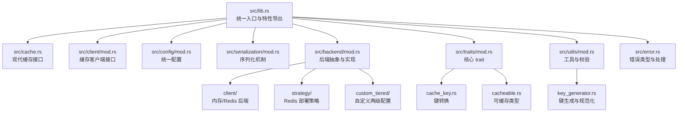
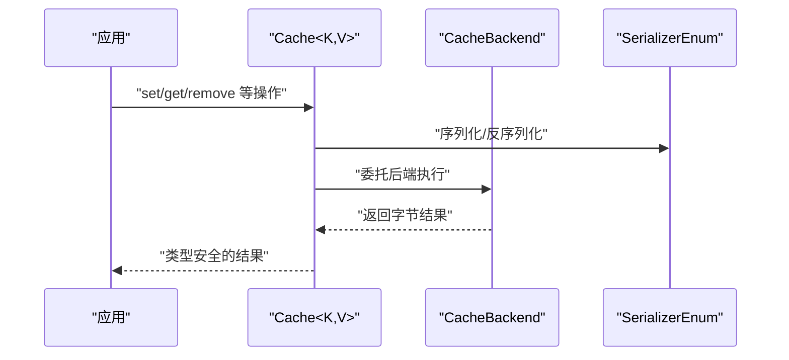
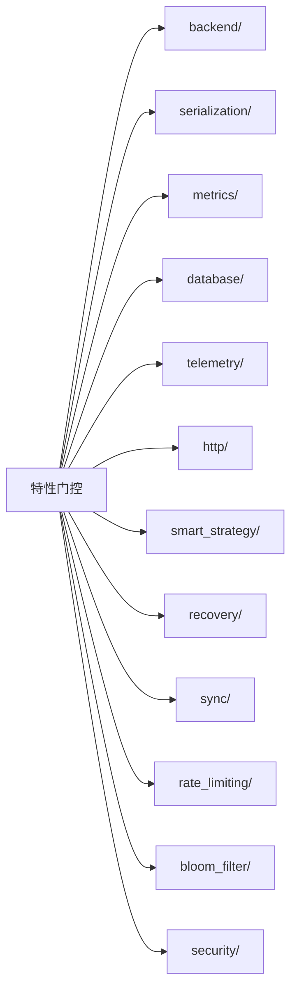

# Rust 代码风格指南

<cite>
**本文档引用的文件**
- [Cargo.toml](file://Cargo.toml)
- [src/lib.rs](file://src/lib.rs)
- [src/cache.rs](file://src/cache.rs)
- [src/backend/mod.rs](file://src/backend/mod.rs)
- [src/config/mod.rs](file://src/config/mod.rs)
- [src/serialization/mod.rs](file://src/serialization/mod.rs)
- [src/client/mod.rs](file://src/client/mod.rs)
- [src/traits/mod.rs](file://src/traits/mod.rs)
- [src/traits/cache_key.rs](file://src/traits/cache_key.rs)
- [src/traits/cacheable.rs](file://src/traits/cacheable.rs)
- [src/utils/mod.rs](file://src/utils/mod.rs)
- [src/utils/key_generator.rs](file://src/utils/key_generator.rs)
- [src/error.rs](file://src/error.rs)
- [README.md](file://README.md)
</cite>

## 目录
1. [简介](#简介)
2. [项目结构](#项目结构)
3. [核心组件](#核心组件)
4. [架构总览](#架构总览)
5. [详细组件分析](#详细组件分析)
6. [依赖分析](#依赖分析)
7. [性能考虑](#性能考虑)
8. [故障排除指南](#故障排除指南)
9. [结论](#结论)
10. [附录](#附录)

## 简介
本指南系统阐述 Oxcache 项目的 Rust 代码风格规范与工程实践，覆盖命名约定、模块组织、代码格式化与静态分析工具使用、API 设计原则以及与 rust-lang/rfcs 的最佳实践对齐。目标是帮助开发者在保持一致性的同时提升可读性、可维护性与可扩展性。

## 项目结构
Oxcache 采用按功能域分层的模块组织方式，核心模块位于 src 目录下，每个子模块聚焦特定能力域，并通过 lib.rs 进行统一导出与特性门控控制。

**图表来源**
- [src/lib.rs](file://src/lib.rs#L417-L520)
- [src/backend/mod.rs](file://src/backend/mod.rs#L1-L59)
- [src/config/mod.rs](file://src/config/mod.rs#L1-L32)
- [src/serialization/mod.rs](file://src/serialization/mod.rs#L1-L98)
- [src/client/mod.rs](file://src/client/mod.rs#L1-L305)
- [src/traits/mod.rs](file://src/traits/mod.rs#L1-L12)
- [src/utils/mod.rs](file://src/utils/mod.rs#L1-L51)
- [src/error.rs](file://src/error.rs#L1-L289)

**章节来源**
- [src/lib.rs](file://src/lib.rs#L417-L520)
- [src/backend/mod.rs](file://src/backend/mod.rs#L1-L59)
- [src/config/mod.rs](file://src/config/mod.rs#L1-L32)
- [src/serialization/mod.rs](file://src/serialization/mod.rs#L1-L98)
- [src/client/mod.rs](file://src/client/mod.rs#L1-L305)
- [src/traits/mod.rs](file://src/traits/mod.rs#L1-L12)
- [src/utils/mod.rs](file://src/utils/mod.rs#L1-L51)
- [src/error.rs](file://src/error.rs#L1-L289)

## 核心组件
- 现代缓存接口：通过 Cache 结构体提供类型安全的缓存操作，支持内存与 Redis 后端切换。
- 客户端接口：定义 CacheOps 与 CacheExt，统一读写、批量操作、锁与清理等能力。
- 配置系统：统一配置入口，按特性导出 L1/L2/两层配置类型。
- 序列化机制：支持 JSON、可选的 bincode、MessagePack/CBOR 等，提供统一适配器。
- 后端抽象：定义 CacheBackend 接口，内存与 Redis 后端实现分离。
- 核心 trait：CacheKey 与 Cacheable，约束键与值的类型边界。
- 工具与校验：键生成、规范化、安全日志与连接串脱敏。
- 错误体系：统一的 CacheError 枚举与 Result 类型别名，提供丰富的错误分类与辅助判断方法。

**章节来源**
- [src/cache.rs](file://src/cache.rs#L117-L200)
- [src/client/mod.rs](file://src/client/mod.rs#L154-L305)
- [src/config/mod.rs](file://src/config/mod.rs#L15-L32)
- [src/serialization/mod.rs](file://src/serialization/mod.rs#L41-L98)
- [src/backend/mod.rs](file://src/backend/mod.rs#L25-L59)
- [src/traits/cache_key.rs](file://src/traits/cache_key.rs#L38-L49)
- [src/traits/cacheable.rs](file://src/traits/cacheable.rs#L7-L46)
- [src/utils/key_generator.rs](file://src/utils/key_generator.rs#L47-L208)
- [src/error.rs](file://src/error.rs#L45-L214)

## 架构总览
现代 API 的核心交互流程如下：

**图表来源**
- [src/cache.rs](file://src/cache.rs#L117-L200)
- [src/client/mod.rs](file://src/client/mod.rs#L154-L305)
- [src/serialization/mod.rs](file://src/serialization/mod.rs#L71-L98)

## 详细组件分析

### 命名约定
- 类型名称使用 PascalCase：如 CacheConfig、L1Backend、MemoryBackendType、KeyGenerator、CacheError。
- 函数与方法名称使用 snake_case：如 get_client、set_value、validate_cache_key、generate_full。
- 常量使用 SCREAMING_SNAKE_CASE：如 DEFAULT_MAX_KEY_LENGTH、DEFAULT_NAMESPACE、VALID_KEY_CHARS。
- 私有字段使用带下划线前缀的 snake_case：如 _internal_field（示例：_phantom、_prefix 等）。
- 特性门控常量与宏：如 VERSION、has_feature、require_feature、check_feature_dependence 等。

上述约定在以下文件中得到体现：
- 类型与常量：[src/cache.rs](file://src/cache.rs#L117-L120)，[src/utils/key_generator.rs](file://src/utils/key_generator.rs#L17-L29)，[src/error.rs](file://src/error.rs#L9-L10)
- 函数与方法：[src/utils/key_generator.rs](file://src/utils/key_generator.rs#L128-L142)，[src/utils/key_generator.rs](file://src/utils/key_generator.rs#L154-L175)
- 私有字段：[src/cache.rs](file://src/cache.rs#L119-L120)，[src/utils/key_generator.rs](file://src/utils/key_generator.rs#L48-L52)
- 特性门控与导出：[src/lib.rs](file://src/lib.rs#L644-L646)，[src/lib.rs](file://src/lib.rs#L183-L252)

**章节来源**
- [src/cache.rs](file://src/cache.rs#L117-L120)
- [src/utils/key_generator.rs](file://src/utils/key_generator.rs#L17-L29)
- [src/error.rs](file://src/error.rs#L9-L10)
- [src/utils/key_generator.rs](file://src/utils/key_generator.rs#L128-L142)
- [src/utils/key_generator.rs](file://src/utils/key_generator.rs#L154-L175)
- [src/cache.rs](file://src/cache.rs#L119-L120)
- [src/lib.rs](file://src/lib.rs#L644-L646)
- [src/lib.rs](file://src/lib.rs#L183-L252)

### 模块组织原则
- src/lib.rs：统一入口，按特性门控导出模块与类型，集中 re-export。
- backend/：后端抽象与实现，按功能拆分为 client/、strategy/、custom_tiered/ 等。
- client/：缓存客户端接口与扩展方法。
- config/：统一配置入口，按层导出 L1/L2/两层配置。
- serialization/：序列化机制与适配器，支持多种格式。
- traits/：核心 trait（CacheKey、Cacheable）。
- utils/：工具与校验（键生成、规范化、安全日志）。
- error/：统一错误类型与处理。

**章节来源**
- [src/lib.rs](file://src/lib.rs#L417-L520)
- [src/backend/mod.rs](file://src/backend/mod.rs#L1-L59)
- [src/config/mod.rs](file://src/config/mod.rs#L1-L32)
- [src/serialization/mod.rs](file://src/serialization/mod.rs#L1-L98)
- [src/client/mod.rs](file://src/client/mod.rs#L1-L305)
- [src/traits/mod.rs](file://src/traits/mod.rs#L1-L12)
- [src/utils/mod.rs](file://src/utils/mod.rs#L1-L51)
- [src/error.rs](file://src/error.rs#L1-L289)

### 代码格式化与静态分析工具
- rustfmt：使用默认配置进行格式化，建议在提交前执行 cargo fmt --all。
- clippy：启用严格规则，建议在提交前执行 cargo clippy --all-targets --all-features，并修复警告。
- 预提交钩子：仓库提供脚本（scripts/precommit_clippy.sh、scripts/precommit_tests.sh 等），可在本地集成。

**章节来源**
- [Cargo.toml](file://Cargo.toml#L352-L377)
- [README.md](file://README.md#L1-L414)

### API 设计原则（参考 rust-lang/rfcs 最佳实践）
- 单一职责：各模块职责明确，接口清晰，避免过度耦合。
- 类型安全：通过泛型与 trait（CacheKey、Cacheable）保证键与值的类型安全。
- 可组合性：通过特性门控与 re-export，允许用户按需启用功能。
- 可观测性：错误类型丰富且可判断（is_not_found、is_connection_error、is_degraded），便于上层处理。
- 兼容性：提供向后兼容别名与默认实现，降低迁移成本。

**章节来源**
- [src/cache.rs](file://src/cache.rs#L87-L120)
- [src/traits/cache_key.rs](file://src/traits/cache_key.rs#L38-L49)
- [src/traits/cacheable.rs](file://src/traits/cacheable.rs#L7-L46)
- [src/error.rs](file://src/error.rs#L228-L288)
- [src/lib.rs](file://src/lib.rs#L517-L520)

## 依赖分析
特性门控与模块导出关系如下：

**图表来源**
- [src/lib.rs](file://src/lib.rs#L435-L512)

**章节来源**
- [src/lib.rs](file://src/lib.rs#L435-L512)

## 性能考虑
- 优先使用内存后端（Moka/DashMap）进行热点数据缓存，降低网络延迟。
- 合理设置序列化格式与压缩策略，平衡 CPU 与带宽消耗。
- 利用批处理写入与智能预热，减少 Redis 压力。
- 通过指标与可观测性监控缓存命中率与延迟分布，持续优化配置。

[本节为通用指导，无需具体文件引用]

## 故障排除指南
- 键校验失败：检查键长度与字符集，确保符合规范。
- 连接错误：确认连接串格式与可达性，必要时启用脱敏日志定位问题。
- 功能依赖错误：根据编译期提示启用所需特性或使用 full 特性组合。
- 错误分类判断：利用 is_not_found、is_connection_error、is_degraded 等辅助方法快速定位问题类型。

**章节来源**
- [src/utils/key_generator.rs](file://src/utils/key_generator.rs#L154-L175)
- [src/error.rs](file://src/error.rs#L228-L288)
- [src/lib.rs](file://src/lib.rs#L670-L680)

## 结论
Oxcache 在命名约定、模块组织、工具链与 API 设计方面体现了良好的工程实践。遵循本指南有助于在团队内达成一致，提升代码质量与协作效率。

[本节为总结性内容，无需具体文件引用]

## 附录
- 快速命令清单
  - 格式化：cargo fmt --all
  - 代码检查：cargo clippy --all-targets --all-features
  - 运行测试：cargo test
  - 运行基准：cargo bench

**章节来源**
- [Cargo.toml](file://Cargo.toml#L352-L377)
- [README.md](file://README.md#L1-L414)