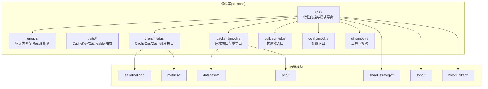
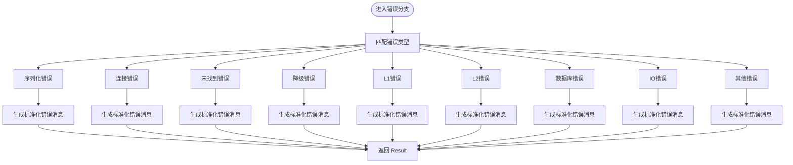
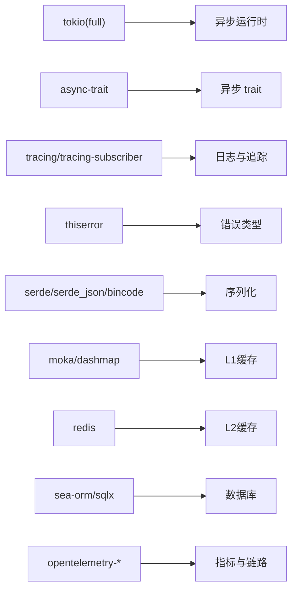

# 代码规范

<cite>
**本文引用的文件**
- [Cargo.toml](file://Cargo.toml)
- [src/lib.rs](file://src/lib.rs)
- [src/error.rs](file://src/error.rs)
- [src/cache.rs](file://src/cache.rs)
- [src/backend/mod.rs](file://src/backend/mod.rs)
- [src/traits/mod.rs](file://src/traits/mod.rs)
- [src/traits/cache_key.rs](file://src/traits/cache_key.rs)
- [src/traits/cacheable.rs](file://src/traits/cacheable.rs)
- [src/client/mod.rs](file://src/client/mod.rs)
- [src/builder/mod.rs](file://src/builder/mod.rs)
- [src/config/mod.rs](file://src/config/mod.rs)
- [src/utils/mod.rs](file://src/utils/mod.rs)
- [examples/Cargo.toml](file://examples/Cargo.toml)
</cite>

## 目录
1. [简介](#简介)
2. [项目结构与模块划分](#项目结构与模块划分)
3. [核心组件与职责](#核心组件与职责)
4. [架构总览](#架构总览)
5. [详细组件规范](#详细组件规范)
6. [依赖关系分析](#依赖关系分析)
7. [性能与并发规范](#性能与并发规范)
8. [错误处理规范](#错误处理规范)
9. [异步与运行时规范](#异步与运行时规范)
10. [文档注释与示例规范](#文档注释与示例规范)
11. [代码格式化与静态分析](#代码格式化与静态分析)
12. [结论](#结论)

## 简介
本文件系统性梳理 Oxcache 项目的代码规范与最佳实践，覆盖命名约定、模块组织、错误处理、异步编程、文档注释、格式化与静态分析等方面，并结合项目实际源码进行说明，帮助贡献者与使用者遵循一致的工程标准。

## 项目结构与模块划分
- 核心库模块
  - 根模块导出与特性门控：通过特性开关控制可选模块与功能，保证最小可用与按需扩展。
  - 新版现代 API：以 Cache、CacheOps、CacheKey、Cacheable 为核心抽象，提供类型安全的缓存接口。
  - 后端抽象：统一 CacheBackend 接口，支持内存与 Redis 等不同实现。
  - 工具与通用能力：键校验、安全日志、密钥脱敏等。
- 可选模块
  - 序列化、指标、数据库、HTTP 缓存、智能策略、批写入、CLI、布隆过滤器等均通过特性开启。
- 示例与宏
  - examples 子项目演示完整用法；macros 子包提供过程宏支持。



图表来源
- [src/lib.rs](file://src/lib.rs#L417-L512)
- [src/client/mod.rs](file://src/client/mod.rs#L1-L305)
- [src/backend/mod.rs](file://src/backend/mod.rs#L1-L59)
- [src/traits/mod.rs](file://src/traits/mod.rs#L1-L12)
- [src/builder/mod.rs](file://src/builder/mod.rs#L1-L12)
- [src/config/mod.rs](file://src/config/mod.rs#L1-L32)
- [src/utils/mod.rs](file://src/utils/mod.rs#L1-L51)

章节来源
- [Cargo.toml](file://Cargo.toml#L235-L347)
- [src/lib.rs](file://src/lib.rs#L417-L512)

## 核心组件与职责
- Cache<K, V>
  - 类型安全的统一缓存接口，封装底层 CacheBackend。
  - 通过 CacheExt 提供 get/set/remove 等高级操作。
- CacheOps/CacheExt
  - 定义字节级读写与序列化器交互；扩展提供类型化读写、条件获取、锁等。
- CacheKey/Cacheable
  - 键到字符串的转换；值的序列化/反序列化约束。
- 错误体系
  - 以 thiserror 定义 CacheError 枚举，统一 Result<T> 别名，提供错误分类与辅助判断方法。
- 特性门控与空实现
  - 通过宏与 cfg 条件编译生成空实现，保证禁用特性时 API 可用且行为明确。

章节来源
- [src/cache.rs](file://src/cache.rs#L87-L120)
- [src/client/mod.rs](file://src/client/mod.rs#L18-L305)
- [src/traits/cache_key.rs](file://src/traits/cache_key.rs#L38-L49)
- [src/traits/cacheable.rs](file://src/traits/cacheable.rs#L7-L41)
- [src/error.rs](file://src/error.rs#L75-L213)

## 架构总览
```mermaid
classDiagram
class Cache_K_V_ {
+new() -> Result<Cache<K,V>>
+memory() -> Result<Cache<K,V>>
+redis(url) -> Result<Cache<K,V>>
+get(key) -> Result<Option<V>>
+set(key, value, ttl) -> Result<()>
+get_or_fetch(key, ttl, fetch) -> Result<V>
}
class CacheOps {
<<trait>>
+get_bytes(key) -> Result<Option<Vec<u8>>>
+set_bytes(key, bytes, ttl) -> Result<()>
+delete(key) -> Result<()>
+lock(key, ttl) -> Result<Option<String>>
+unlock(key, value) -> Result<bool>
+serializer() -> SerializerEnum
+shutdown() -> Result<()>
}
class CacheExt {
<<trait>>
+get<T>(key) -> Result<Option<T>>
+set<T>(key, value, ttl) -> Result<()>
+get_or_fetch<T,F,Fut>(key, ttl, fetch) -> Result<T>
}
class CacheKey {
<<trait>>
+to_key_string() -> String
}
class Cacheable {
<<trait>>
}
Cache_K_V_ --> CacheOps : "组合"
Cache_K_V_ --> CacheExt : "组合"
Cache_K_V_ --> CacheKey : "K : CacheKey"
Cache_K_V_ --> Cacheable : "V : Cacheable"
```

图表来源
- [src/cache.rs](file://src/cache.rs#L117-L120)
- [src/client/mod.rs](file://src/client/mod.rs#L157-L304)
- [src/traits/cache_key.rs](file://src/traits/cache_key.rs#L38-L49)
- [src/traits/cacheable.rs](file://src/traits/cacheable.rs#L7-L41)

## 详细组件规范

### 命名约定与风格
- 模块与文件
  - 使用小写加下划线命名，如 client、backend、traits、utils。
- 结构体与枚举
  - 使用帕斯卡命名，如 Cache、CacheError、MemoryBackend、RedisBackend。
- 枚举变体
  - 使用帕斯卡命名，如 L1Error、L2Error、NotFound、Degraded。
- 函数与方法
  - 使用小驼峰命名，如 new、memory、redis、get_bytes、set_bytes。
- 常量与静态
  - 使用 SCREAMING_SNAKE_CASE，如 MAX_CACHE_KEY_LENGTH、PASSWORD_MASK_ASTERISKS。
- 泛型参数
  - 使用单个大写字母，如 K、V、T。
- 特性名称
  - 使用小写短横线分隔，如 moka、redis、serialization、full-metrics。
- 导出与重导出
  - 保持对外 API 的一致性，避免破坏性变更；对废弃项保留兼容路径。

章节来源
- [src/cache.rs](file://src/cache.rs#L117-L120)
- [src/error.rs](file://src/error.rs#L75-L213)
- [src/utils/mod.rs](file://src/utils/mod.rs#L17-L23)
- [Cargo.toml](file://Cargo.toml#L235-L347)

### 模块组织与职责边界
- traits：定义跨层通用抽象（键、值）。
- client：定义操作接口与扩展方法，负责序列化器交互。
- backend：定义后端接口与具体实现入口，支持 L1/L2。
- builder：提供配置构建器，隔离复杂初始化流程。
- config：统一配置入口，按特性导出对应配置类型。
- utils：通用工具（键校验、脱敏、安全日志）。
- 错误：集中定义错误类型与 Result 别名。

章节来源
- [src/traits/mod.rs](file://src/traits/mod.rs#L1-L12)
- [src/client/mod.rs](file://src/client/mod.rs#L1-L305)
- [src/backend/mod.rs](file://src/backend/mod.rs#L1-L59)
- [src/builder/mod.rs](file://src/builder/mod.rs#L1-L12)
- [src/config/mod.rs](file://src/config/mod.rs#L1-L32)
- [src/utils/mod.rs](file://src/utils/mod.rs#L1-L51)
- [src/error.rs](file://src/error.rs#L75-L213)

### 错误处理规范
- 使用 thiserror 宏派生错误类型，统一错误消息与上下文。
- 定义 Result<T> 别名，简化返回类型书写。
- 对外部错误（如 Redis、SeaORM、IO）进行适配转换。
- 提供错误分类辅助方法（如 is_not_found、is_connection_error、is_degraded）。
- 在日志与错误消息中避免泄露敏感信息（如连接串中的密码）。



图表来源
- [src/error.rs](file://src/error.rs#L75-L213)
- [src/error.rs](file://src/error.rs#L228-L288)

章节来源
- [src/error.rs](file://src/error.rs#L75-L213)
- [src/error.rs](file://src/error.rs#L228-L288)

### 异步编程规范
- 全面采用 async/await，接口返回 Future 并通过 ? 传播错误。
- 使用 async-trait 定义异步 trait，避免手动 Box。
- 在公共 API 中使用 tracing::instrument 注解关键方法，便于可观测性。
- 运行时选择 Tokio，启用 full 功能集，确保 spawn、rt、time 等能力可用。
- 在批写入、热身、WAL 等场景使用 tokio-util、futures 等工具优化吞吐与并发。

章节来源
- [src/client/mod.rs](file://src/client/mod.rs#L24-L111)
- [src/client/mod.rs](file://src/client/mod.rs#L157-L304)
- [Cargo.toml](file://Cargo.toml#L24-L28)
- [Cargo.toml](file://Cargo.toml#L169-L175)

### 文档注释与示例规范
- 根模块提供完整的使用示例与迁移指引，涵盖新旧 API、序列化、批处理、HTTP 缓存等。
- 公共 API（如 Cache、CacheOps、CacheExt、CacheKey、Cacheable）均提供文档注释与使用示例。
- 示例项目 examples/Cargo.toml 明确依赖与特性组合，便于读者直接运行。

章节来源
- [src/lib.rs](file://src/lib.rs#L10-L175)
- [src/cache.rs](file://src/cache.rs#L87-L116)
- [src/client/mod.rs](file://src/client/mod.rs#L18-L150)
- [src/traits/cache_key.rs](file://src/traits/cache_key.rs#L13-L37)
- [src/traits/cacheable.rs](file://src/traits/cacheable.rs#L13-L33)
- [examples/Cargo.toml](file://examples/Cargo.toml#L13-L34)

### 代码格式化与静态分析
- 格式化
  - 使用 rustfmt（建议在 CI 与本地统一配置）。
- 静态分析
  - 使用 clippy（建议在 CI 中执行）。
  - 使用 deny.toml 控制许可证与审计风险。
- Git 钩子
  - .pre-commit-config.yaml 集成 pre-commit 检查（测试、clippy、deny、license、secrets、toml 等）。

章节来源
- [Cargo.toml](file://Cargo.toml#L216-L229)
- [.pre-commit-config.yaml](file://.pre-commit-config.yaml)

## 依赖关系分析
- 运行时与异步
  - tokio(full)、async-trait、futures、tokio-util。
- 错误与日志
  - thiserror、anyhow、log、tracing、tracing-subscriber。
- 序列化与压缩
  - serde、serde_json、bincode、flate2、rmp-serde、ciborium、md5。
- 缓存与数据库
  - moka、dashmap、redis、sea-orm、sqlx、regex。
- 指标与可观测性
  - opentelemetry、opentelemetry_sdk、tracing-opentelemetry、opentelemetry-otlp。
- 高级特性
  - bloomfilter、murmur3、clap、confers、axum、http、tower、hyper、http-body-util。



图表来源
- [Cargo.toml](file://Cargo.toml#L24-L89)
- [Cargo.toml](file://Cargo.toml#L144-L164)
- [Cargo.toml](file://Cargo.toml#L191-L211)

章节来源
- [Cargo.toml](file://Cargo.toml#L20-L211)
- [Cargo.toml](file://Cargo.toml#L144-L164)
- [Cargo.toml](file://Cargo.toml#L191-L211)

## 性能与并发规范
- 发布配置
  - 开启 LTO、单代码单元、panic=abort、strip、关闭溢出检查，提升二进制体积与运行时性能。
- 并发模型
  - L1 使用 moka/dashmap；L2 使用 redis 的异步客户端；批写入与热身使用 tokio-util/futures。
- 指标与观测
  - 通过 opentelemetry 与 tracing 记录关键路径耗时与事件，便于定位热点。

章节来源
- [Cargo.toml](file://Cargo.toml#L352-L370)
- [Cargo.toml](file://Cargo.toml#L144-L164)

## 错误处理规范
- 错误类型设计
  - 以 CacheError 枚举覆盖序列化、连接、未找到、降级、L1/L2、配置、不支持、WAL、数据库、IO、超时、关闭、键/值大小、缓冲区、输入、锁等。
- 错误传播
  - 使用 ? 操作符在异步函数间传播；在外部错误处进行适配转换。
- 错误分类辅助
  - 提供 is_not_found、is_connection_error、is_degraded 等方法，便于上层逻辑快速分支。
- 敏感信息脱敏
  - 在 Redis 错误消息中对连接串进行脱敏处理，避免泄露密码等。

章节来源
- [src/error.rs](file://src/error.rs#L75-L213)
- [src/error.rs](file://src/error.rs#L228-L288)

## 异步与运行时规范
- 运行时
  - 使用 Tokio，启用 full 特性，确保 spawn、rt、time 等能力。
- 异步接口
  - 所有公共 API 采用 async/await；使用 async-trait 定义异步 trait。
- 观测性
  - 在关键方法上使用 tracing::instrument 注解，记录调用层级与耗时。
- 并发工具
  - 批写入、热身、WAL 等场景使用 tokio-util、futures。

章节来源
- [Cargo.toml](file://Cargo.toml#L24-L28)
- [src/client/mod.rs](file://src/client/mod.rs#L24-L111)
- [src/client/mod.rs](file://src/client/mod.rs#L157-L304)
- [Cargo.toml](file://Cargo.toml#L169-L175)

## 文档注释与示例规范
- 根模块文档
  - 提供新旧 API 对比、示例、特性列表与迁移指南。
- 公共 API 文档
  - Cache、CacheOps、CacheExt、CacheKey、Cacheable 均提供文档注释与使用示例。
- 示例项目
  - examples/Cargo.toml 明确依赖与特性组合，便于直接运行。

章节来源
- [src/lib.rs](file://src/lib.rs#L10-L175)
- [src/cache.rs](file://src/cache.rs#L87-L116)
- [src/client/mod.rs](file://src/client/mod.rs#L18-L150)
- [src/traits/cache_key.rs](file://src/traits/cache_key.rs#L13-L37)
- [src/traits/cacheable.rs](file://src/traits/cacheable.rs#L13-L33)
- [examples/Cargo.toml](file://examples/Cargo.toml#L13-L34)

## 代码格式化与静态分析
- 格式化
  - 使用 rustfmt（建议在 CI 与本地统一配置）。
- 静态分析
  - 使用 clippy（建议在 CI 中执行）。
  - 使用 deny.toml 控制许可证与审计风险。
- Git 钩子
  - .pre-commit-config.yaml 集成 pre-commit 检查（测试、clippy、deny、license、secrets、toml 等）。

章节来源
- [Cargo.toml](file://Cargo.toml#L216-L229)
- [.pre-commit-config.yaml](file://.pre-commit-config.yaml)

## 结论
Oxcache 项目在现代 Rust 生态下提供了清晰的模块化与特性门控设计，统一的错误处理与异步接口，完善的文档注释与示例，以及严格的格式化与静态分析流程。遵循本文档的规范，有助于保持代码一致性、可维护性与高性能。
