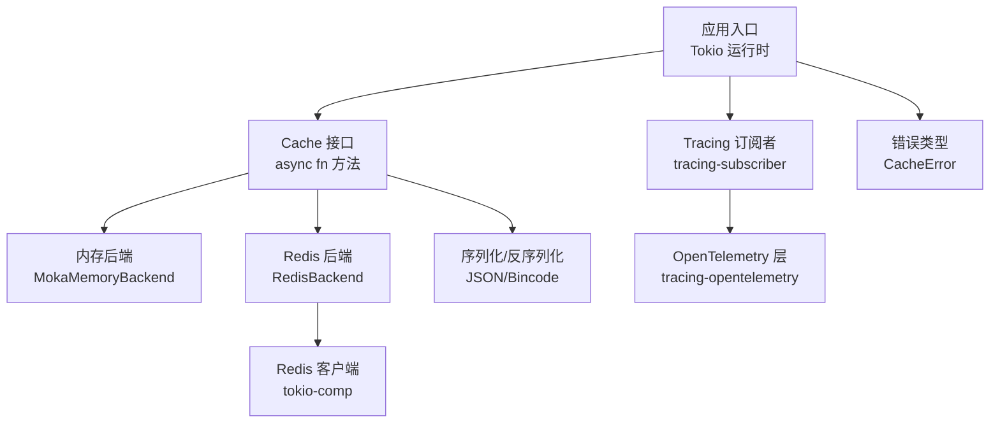
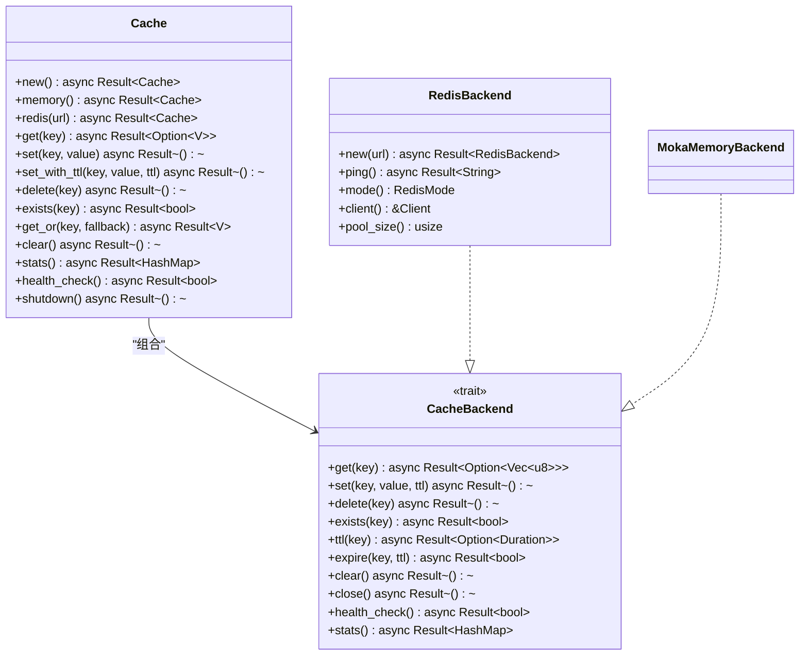
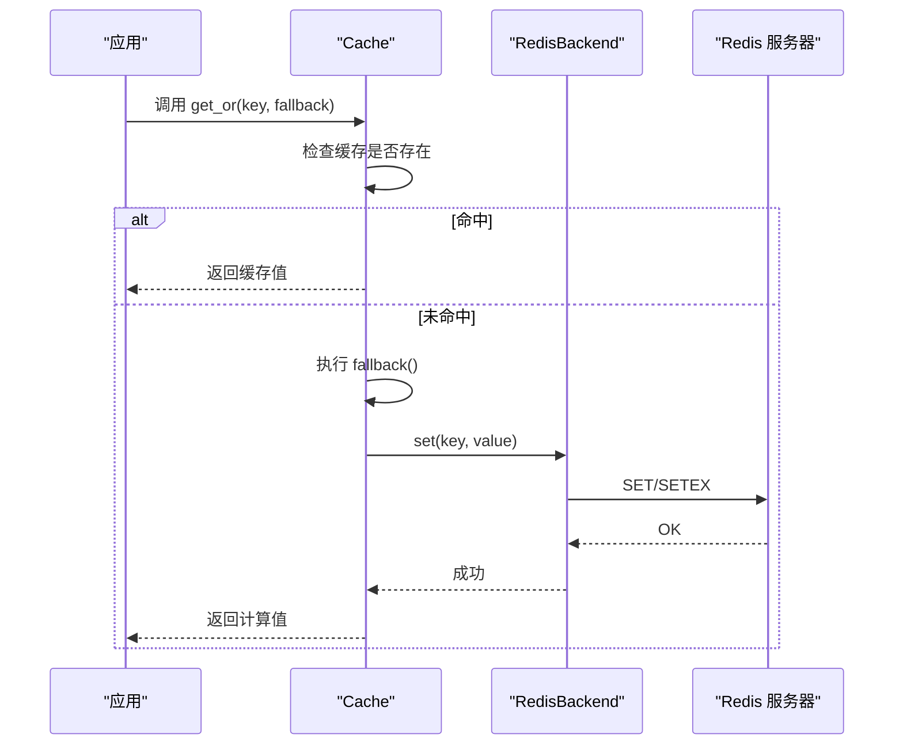
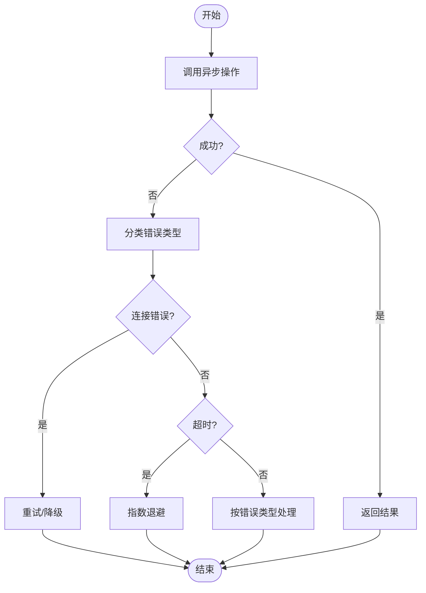
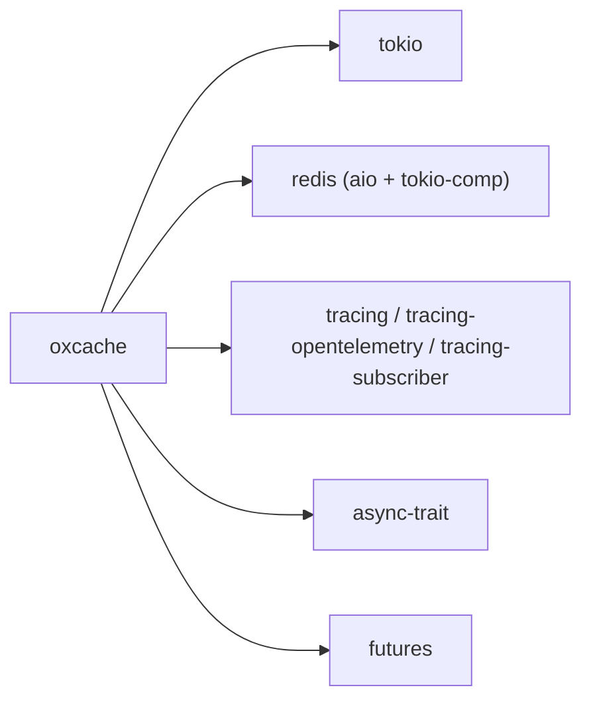

# 异步编程规范

<cite>
**本文档引用的文件**
- [Cargo.toml](file://Cargo.toml)
- [lib.rs](file://src/lib.rs)
- [cache.rs](file://src/cache.rs)
- [client.rs](file://src/backend/client/redis/client.rs)
- [telemetry.rs](file://src/telemetry.rs)
- [error.rs](file://src/error.rs)
- [custom_tiered.rs](file://src/backend/custom_tiered.rs)
- [lib.rs（宏）](file://macros/src/lib.rs)
- [miri_memory_test.rs](file://tests/performance/miri_memory_test.rs)
- [telemetry_test.rs](file://tests/feature/telemetry_test.rs)
</cite>

## 目录
1. [简介](#简介)
2. [项目结构](#项目结构)
3. [核心组件](#核心组件)
4. [架构总览](#架构总览)
5. [详细组件分析](#详细组件分析)
6. [依赖分析](#依赖分析)
7. [性能考虑](#性能考虑)
8. [故障排查指南](#故障排查指南)
9. [结论](#结论)

## 简介
本文件系统性梳理 Oxcache 项目中的异步编程规范与最佳实践，围绕以下主题展开：
- async/await 的正确使用：函数定义、Future 类型处理、await 表达式的使用时机
- Tokio 运行时集成与配置：异步任务创建、并发控制、资源管理
- Tracing 日志系统：#[tracing::instrument] 宏、info!/debug!/error! 宏的正确调用、Span 上下文管理
- 异步错误处理：错误传播、超时处理、取消机制
- 异步作用域与生命周期管理：避免悬空引用与资源泄漏

## 项目结构
Oxcache 采用模块化组织，异步相关的关键模块如下：
- 核心缓存接口与实现：src/cache.rs
- Redis 后端实现：src/backend/client/redis/client.rs
- 遥测与链路追踪：src/telemetry.rs
- 错误类型与传播：src/error.rs
- 自定义分层后端与 Tracing 使用：src/backend/custom_tiered.rs
- 宏扩展与异步工具：macros/src/lib.rs
- 运行时与测试：tests/performance/miri_memory_test.rs

图表来源
- [lib.rs](file://src/lib.rs#L1-L680)
- [cache.rs](file://src/cache.rs#L1-L783)
- [client.rs](file://src/backend/client/redis/client.rs#L1-L522)
- [telemetry.rs](file://src/telemetry.rs#L1-L57)
- [error.rs](file://src/error.rs#L1-L289)

章节来源
- [Cargo.toml](file://Cargo.toml#L20-L90)
- [lib.rs](file://src/lib.rs#L1-L680)

## 核心组件
- Cache<K, V>：现代 API 的统一缓存接口，提供 async get/set/delete 等方法，并内置 get_or 缓存穿透保护
- RedisBackend：基于 redis-rs 的异步后端，支持连接池与多种模式（Standalone/Sentinel/Cluster）
- Telemetry：提供 init_tracing 初始化 OpenTelemetry Tracing 的辅助函数
- CacheError：统一的错误类型，支持错误分类与传播

章节来源
- [cache.rs](file://src/cache.rs#L117-L646)
- [client.rs](file://src/backend/client/redis/client.rs#L66-L132)
- [telemetry.rs](file://src/telemetry.rs#L12-L56)
- [error.rs](file://src/error.rs#L75-L208)

## 架构总览
Oxcache 的异步架构以 Cache 为中心，向上提供类型安全的 API，向下通过可插拔的 CacheBackend 抽象对接内存与 Redis 后端。Redis 后端使用 tokio-comp 特性与 multiplexed 连接，保证高并发下的稳定性。

图表来源
- [cache.rs](file://src/cache.rs#L117-L646)
- [client.rs](file://src/backend/client/redis/client.rs#L215-L499)

## 详细组件分析

### async/await 使用规范
- 函数定义
  - 所有对外暴露的异步操作均使用 async fn 定义，返回 Result<T> 以便错误传播
  - 例如：Cache::get_or、RedisBackend 的 get/set/delete 等
- Future 类型处理
  - 使用 where 子句约束 F: FnOnce() -> Fut，Fut: Future<Output = Result<T>>，确保异步回调的类型安全
  - 例如：Cache::get_or 的泛型约束
- await 表达式使用时机
  - 在调用外部异步资源（Redis 连接、序列化器）时必须 await
  - 在条件分支中，对可能失败的操作使用 await 并立即匹配错误
  - 避免在循环中累积大量未完成的 Future，必要时使用批处理或并发限制

章节来源
- [cache.rs](file://src/cache.rs#L396-L408)
- [client.rs](file://src/backend/client/redis/client.rs#L217-L240)

### Tokio 运行时集成与配置
- 运行时依赖
  - 依赖 tokio 1.32，启用 features = ["full"]，提供完整的异步运行时能力
- 异步任务创建
  - 通过 async fn 暴露的 API 在应用侧创建任务（如 #[tokio::main]）
  - 测试中使用 Runtime::new().block_on(...) 执行异步代码，避免在真实运行时外直接 await
- 并发控制
  - Redis 后端使用 multiplexed 连接，减少连接开销；可通过连接池参数控制并发
  - 批量操作建议使用 set_many/get_many/delete_many，内部逐条 await，避免阻塞
- 资源管理
  - Cache::shutdown 调用后端 close，确保连接与资源释放
  - RedisBackend::clear 使用 SCAN + DEL 替代 FLUSHDB，避免影响其他连接

章节来源
- [Cargo.toml](file://Cargo.toml#L24-L26)
- [miri_memory_test.rs](file://tests/performance/miri_memory_test.rs#L20-L32)
- [cache.rs](file://src/cache.rs#L570-L572)
- [client.rs](file://src/backend/client/redis/client.rs#L390-L448)

### Tracing 日志系统使用
- 初始化
  - 提供 init_tracing(service_name, endpoint) 辅助函数，配置全局 TracerProvider 与 tracing subscriber
  - 生产环境可接入 OTLP exporter，当前实现默认为 no-op
- 宏与级别
  - 使用 #[tracing::instrument] 标注耗时或关键路径
  - 使用 info!/debug!/warn!/error! 记录事件与错误
- Span 上下文
  - 在异步链路中保持 Span 上下文，避免跨任务丢失
  - Redis 后端在关键操作（如 clear）记录调试信息

图表来源
- [cache.rs](file://src/cache.rs#L396-L408)
- [client.rs](file://src/backend/client/redis/client.rs#L242-L283)

章节来源
- [telemetry.rs](file://src/telemetry.rs#L12-L56)
- [client.rs](file://src/backend/client/redis/client.rs#L170-L171)
- [client.rs](file://src/backend/client/redis/client.rs#L445-L447)
- [custom_tiered.rs](file://src/backend/custom_tiered.rs#L56-L57)
- [custom_tiered.rs](file://src/backend/custom_tiered.rs#L633-L634)

### 异步错误处理最佳实践
- 错误传播
  - 所有异步操作返回 Result<T>，使用 ? 操作符向上传播
  - Redis 后端将连接错误与操作错误区分，便于降级与重试策略
- 超时处理
  - Redis 后端在连接阶段使用 tokio::time::timeout 控制超时
  - 建议在上层业务逻辑中结合超时策略（如请求级超时）避免长时间阻塞
- 取消机制
  - 当前实现未显式使用取消令牌；如需支持可引入 CancellationToken 模式
- 错误分类
  - CacheError 提供多种错误类型（Serialization/Connection/Timeout/NotFound 等），便于精准处理

图表来源
- [error.rs](file://src/error.rs#L75-L208)
- [client.rs](file://src/backend/client/redis/client.rs#L185-L205)

章节来源
- [error.rs](file://src/error.rs#L75-L208)
- [client.rs](file://src/backend/client/redis/client.rs#L185-L205)

### 异步作用域与生命周期管理
- 生命周期
  - Cache 持有 Arc<dyn CacheBackend>，确保跨任务共享与安全释放
  - RedisBackend 内部持有 Arc<Client>，避免重复创建连接
- 作用域
  - 在函数作用域内创建的 Future 应尽快 await，避免悬挂
  - 批量操作使用迭代器逐条 await，避免一次性堆积大量 Future
- 资源泄漏防护
  - 使用 Cache::shutdown 关闭后端连接
  - RedisBackend::clear 使用 SCAN 迭代删除，避免一次性锁表

章节来源
- [cache.rs](file://src/cache.rs#L117-L120)
- [client.rs](file://src/backend/client/redis/client.rs#L72-L77)
- [client.rs](file://src/backend/client/redis/client.rs#L390-L448)

## 依赖分析
- Tokio 运行时：提供异步调度与超时控制
- redis：aio + tokio-comp + cluster-async + sentinel + connection-manager + script，适配多模式部署
- tracing/tracing-opentelemetry/tracing-subscriber：链路追踪与日志订阅
- async-trait：为异步 trait 提供运行时派发
- futures：提供异步集合与流处理工具

图表来源
- [Cargo.toml](file://Cargo.toml#L24-L90)

章节来源
- [Cargo.toml](file://Cargo.toml#L24-L90)

## 性能考虑
- 连接复用：Redis 后端使用 multiplexed 连接，减少握手开销
- 批量操作：优先使用 set_many/get_many/delete_many，降低网络往返
- 序列化成本：在启用 serialization 特性时，注意序列化/反序列化的 CPU 开销
- 超时与退避：合理设置命令超时与重试退避，避免雪崩效应

## 故障排查指南
- Redis 连接失败
  - 检查连接字符串是否使用 rediss://（生产环境），或设置 OXCACHE_ALLOW_INSECURE_REDIS（仅测试）
  - 使用 health_check/ping 验证连通性
- 超时与降级
  - 观察 CacheError::Timeout 与 CacheError::Degraded，结合日志定位瓶颈
- 遥测初始化冲突
  - init_tracing 会设置全局 subscriber，若应用已有初始化，可能出现冲突；建议由应用层统一管理

章节来源
- [client.rs](file://src/backend/client/redis/client.rs#L167-L205)
- [error.rs](file://src/error.rs#L171-L174)
- [telemetry_test.rs](file://tests/feature/telemetry_test.rs#L10-L40)

## 结论
Oxcache 的异步编程实践遵循 Rust 异步生态标准：以 async/await 为核心，结合 Tokio 运行时与 Redis 异步客户端，构建高性能的两级缓存系统。通过统一的错误类型与 Tracing 日志体系，实现可观测与可维护的异步代码。建议在生产环境中：
- 明确运行时初始化与订阅者配置，避免全局状态冲突
- 合理设置超时与重试策略，保障系统稳定性
- 使用 #[tracing::instrument] 标注关键路径，配合 OpenTelemetry 输出链路数据
- 通过批量操作与连接复用提升吞吐，避免资源泄漏与悬挂 Future