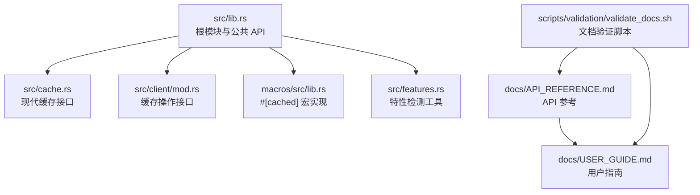
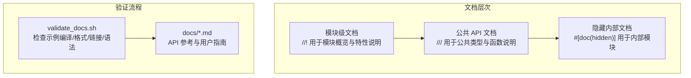
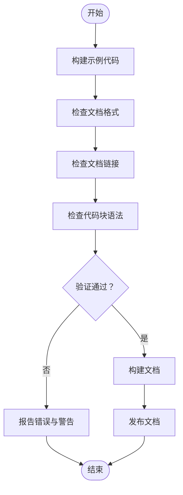
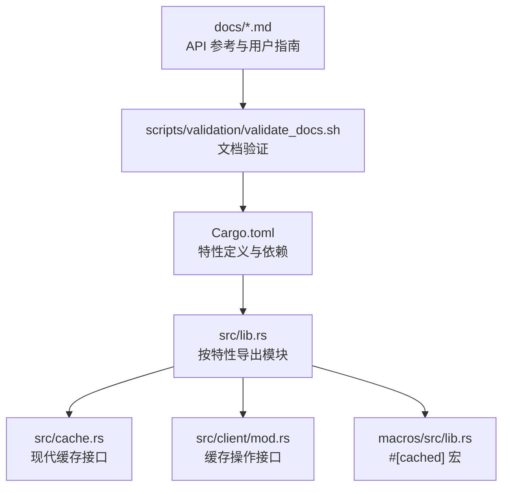

# 文档注释规范

<cite>
**本文档引用的文件**
- [src/lib.rs](file://src/lib.rs)
- [macros/src/lib.rs](file://macros/src/lib.rs)
- [src/cache.rs](file://src/cache.rs)
- [src/client/mod.rs](file://src/client/mod.rs)
- [scripts/validation/validate_docs.sh](file://scripts/validation/validate_docs.sh)
- [docs/API_REFERENCE.md](file://docs/API_REFERENCE.md)
- [docs/USER_GUIDE.md](file://docs/USER_GUIDE.md)
- [Cargo.toml](file://Cargo.toml)
</cite>

## 目录
1. [引言](#引言)
2. [项目结构](#项目结构)
3. [核心组件](#核心组件)
4. [架构总览](#架构总览)
5. [详细组件分析](#详细组件分析)
6. [依赖分析](#依赖分析)
7. [性能考虑](#性能考虑)
8. [故障排除指南](#故障排除指南)
9. [结论](#结论)
10. [附录](#附录)

## 引言
本文件系统性阐述 Oxcache 项目的文档注释规范与 API 文档编写标准，涵盖 doc comment 的使用方法、标准格式、示例编写、一致性维护与构建发布流程。目标是帮助贡献者与使用者以一致的方式编写高质量的文档，确保文档与代码同步、可读且可维护。

## 项目结构
Oxcache 采用模块化设计，核心 API 位于根模块，公共接口通过 re-export 暴露；宏实现位于独立的子包；文档注释广泛分布在各模块中，形成完整的 API 文档体系。

**图表来源**
- [src/lib.rs](file://src/lib.rs#L1-L680)
- [src/cache.rs](file://src/cache.rs#L1-L200)
- [src/client/mod.rs](file://src/client/mod.rs#L1-L200)
- [macros/src/lib.rs](file://macros/src/lib.rs#L1-L314)
- [docs/API_REFERENCE.md](file://docs/API_REFERENCE.md#L1-L200)
- [docs/USER_GUIDE.md](file://docs/USER_GUIDE.md#L1-L200)
- [scripts/validation/validate_docs.sh](file://scripts/validation/validate_docs.sh#L1-L118)

**章节来源**
- [src/lib.rs](file://src/lib.rs#L1-L680)
- [Cargo.toml](file://Cargo.toml#L1-L377)

## 核心组件
- 根模块与公共 API：集中暴露现代缓存接口、配置类型、错误类型与特性检测工具，便于外部直接使用。
- 现代缓存接口：提供类型安全的缓存操作，支持内存与 Redis 后端，以及构建器模式配置。
- 缓存操作接口：定义统一的缓存操作抽象，支持序列化/反序列化、L1/L2 分离操作与批量操作。
- #[cached] 宏：零样板代码的缓存装饰器，支持多种键生成策略与缓存类型。
- 文档验证脚本：自动化检查示例编译、文档格式、链接有效性与代码块语法。

**章节来源**
- [src/lib.rs](file://src/lib.rs#L1-L680)
- [src/cache.rs](file://src/cache.rs#L87-L200)
- [src/client/mod.rs](file://src/client/mod.rs#L154-L200)
- [macros/src/lib.rs](file://macros/src/lib.rs#L45-L314)
- [scripts/validation/validate_docs.sh](file://scripts/validation/validate_docs.sh#L1-L118)

## 架构总览
Oxcache 的文档注释遵循“模块级文档 + 公共 API 文档 + 宏与内部隐藏”的分层策略，配合文档验证脚本确保质量。

**图表来源**
- [src/lib.rs](file://src/lib.rs#L420-L425)
- [src/lib.rs](file://src/lib.rs#L630-L635)
- [scripts/validation/validate_docs.sh](file://scripts/validation/validate_docs.sh#L20-L103)
- [docs/API_REFERENCE.md](file://docs/API_REFERENCE.md#L1-L200)
- [docs/USER_GUIDE.md](file://docs/USER_GUIDE.md#L1-L200)

## 详细组件分析

### 文档注释类型与使用规范
- 模块级文档：使用 //! 书写模块级别的总体说明，适合概述模块职责、特性开关与注意事项。
- 公共 API 文档：使用 /// 为公共类型、枚举、结构体、特征与函数编写详细说明，包含参数、返回值、示例与错误处理。
- 隐藏内部文档：使用 #[doc(hidden)] 标记内部模块或导出项，避免对外暴露实现细节。

示例路径
- 模块级文档：[src/lib.rs](file://src/lib.rs#L1-L10)
- 公共 API 文档：[src/cache.rs](file://src/cache.rs#L87-L116)
- 隐藏内部文档：[src/lib.rs](file://src/lib.rs#L420-L425)

**章节来源**
- [src/lib.rs](file://src/lib.rs#L1-L680)
- [src/cache.rs](file://src/cache.rs#L87-L116)

### 文档注释标准格式
- 标题层级：使用 # 标题组织内容，保持层级清晰。
- 参数说明：# 参数 部分列出函数/方法的所有输入参数，明确类型与含义。
- 返回值描述：# 返回值 部分说明返回值的类型与语义，必要时说明可能的错误类型。
- 使用示例：# 示例 部分提供可编译的最小示例，展示常见用法。
- 错误情况：# 错误 部分说明可能发生的错误类型与触发条件，便于调用方正确处理。

示例路径
- 参数/返回值/示例：[src/client/mod.rs](file://src/client/mod.rs#L71-L111)
- 参数/返回值/示例：[src/client/mod.rs](file://src/client/mod.rs#L160-L200)

**章节来源**
- [src/client/mod.rs](file://src/client/mod.rs#L71-L111)
- [src/client/mod.rs](file://src/client/mod.rs#L160-L200)

### #[cached] 宏的文档注释示例
- 宏参数：服务名、TTL、键格式、键前缀、键生成器、缓存类型等。
- 行为说明：缓存命中/未命中逻辑、序列化/反序列化、错误回退（键无效或客户端不可用）。
- 使用示例：提供启用宏特性的依赖配置与基本使用方式。

示例路径
- 宏参数与行为：[macros/src/lib.rs](file://macros/src/lib.rs#L45-L100)
- 键生成策略：[macros/src/lib.rs](file://macros/src/lib.rs#L150-L255)
- 使用示例与配置：[docs/API_REFERENCE.md](file://docs/API_REFERENCE.md#L93-L133)

**章节来源**
- [macros/src/lib.rs](file://macros/src/lib.rs#L45-L314)
- [docs/API_REFERENCE.md](file://docs/API_REFERENCE.md#L93-L133)

### 现代缓存接口的文档注释示例
- 类型参数：K（键类型，需实现 CacheKey）、V（值类型，需实现 Cacheable）。
- 构造方法：new、memory、redis 等，说明返回值与示例。
- 操作方法：get、set、get_or_fetch、remove、contains 等，包含参数、返回值与示例。

示例路径
- 结构体与构造方法：[src/cache.rs](file://src/cache.rs#L87-L196)
- 操作方法：[src/cache.rs](file://src/cache.rs#L134-L200)

**章节来源**
- [src/cache.rs](file://src/cache.rs#L87-L200)

### 文档注释的编写流程与最佳实践
- 规范先行：在编写代码前先规划注释结构，确保覆盖参数、返回值、示例与错误。
- 示例驱动：优先提供可编译的示例，减少理解成本。
- 一致性维护：遵循现有模块的注释风格，保持术语与格式统一。
- 版本兼容：在注释中标注版本信息与废弃提示，便于迁移。

示例路径
- 版本与废弃提示：[docs/API_REFERENCE.md](file://docs/API_REFERENCE.md#L3-L11)

**章节来源**
- [docs/API_REFERENCE.md](file://docs/API_REFERENCE.md#L3-L11)

### 文档验证与构建发布流程
- 示例编译检查：验证示例代码可编译，避免文档与实际 API 不一致。
- 文档格式检查：确保标题层级与基本格式符合要求。
- 链接有效性检查：扫描 Markdown 链接，防止文档间断链。
- 代码块语法检查：检查代码块闭合与基本语法完整性。
- 构建与发布：通过文档验证脚本确保文档质量，再进行构建与发布。

**图表来源**
- [scripts/validation/validate_docs.sh](file://scripts/validation/validate_docs.sh#L20-L103)

**章节来源**
- [scripts/validation/validate_docs.sh](file://scripts/validation/validate_docs.sh#L1-L118)

## 依赖分析
- 特性开关：通过 Cargo.toml 的 features 字段控制功能启用，根模块根据特性条件导出相应模块与类型。
- 宏与内部模块：#[cached] 宏位于独立包，内部模块通过 #[doc(hidden)] 隐藏，避免对外暴露实现细节。
- 文档与代码一致性：通过文档验证脚本确保 API 参考与用户指南中的示例与链接有效。

**图表来源**
- [Cargo.toml](file://Cargo.toml#L235-L347)
- [src/lib.rs](file://src/lib.rs#L417-L680)
- [src/cache.rs](file://src/cache.rs#L1-L200)
- [src/client/mod.rs](file://src/client/mod.rs#L1-L200)
- [macros/src/lib.rs](file://macros/src/lib.rs#L1-L314)
- [scripts/validation/validate_docs.sh](file://scripts/validation/validate_docs.sh#L1-L118)

**章节来源**
- [Cargo.toml](file://Cargo.toml#L235-L347)
- [src/lib.rs](file://src/lib.rs#L417-L680)

## 性能考虑
- 文档注释本身不影响运行时性能，但良好的注释可提升开发效率与减少调试成本。
- 在高频调用的 API 上，注释应简洁明了，避免冗长描述影响阅读速度。
- 对于复杂算法或关键路径，建议在注释中简述策略与边界条件，便于后续性能分析与优化。

## 故障排除指南
- 文档验证失败：检查示例编译错误、标题缺失、断链与代码块未闭合等问题。
- API 不匹配：确认注释中的示例与实际 API 是否一致，必要时更新注释或修复实现。
- 特性相关问题：当启用特定特性时，确保注释中对条件导出与行为差异进行说明。

**章节来源**
- [scripts/validation/validate_docs.sh](file://scripts/validation/validate_docs.sh#L106-L118)

## 结论
Oxcache 的文档注释规范以“模块级文档、公共 API 文档、隐藏内部文档”为核心，结合标准化的格式与严格的验证流程，确保文档质量与代码一致性。遵循本文档的规范与最佳实践，可显著提升文档的可读性、可维护性与用户体验。

## 附录
- 参考示例路径
  - 模块级文档：[src/lib.rs](file://src/lib.rs#L1-L10)
  - 公共 API 文档（参数/返回值/示例）：[src/client/mod.rs](file://src/client/mod.rs#L71-L111)
  - 宏参数与行为：[macros/src/lib.rs](file://macros/src/lib.rs#L45-L100)
  - 现代缓存接口示例：[src/cache.rs](file://src/cache.rs#L87-L196)
  - 文档验证脚本：[scripts/validation/validate_docs.sh](file://scripts/validation/validate_docs.sh#L1-L118)
  - API 参考与用户指南：[docs/API_REFERENCE.md](file://docs/API_REFERENCE.md#L1-L200), [docs/USER_GUIDE.md](file://docs/USER_GUIDE.md#L1-L200)