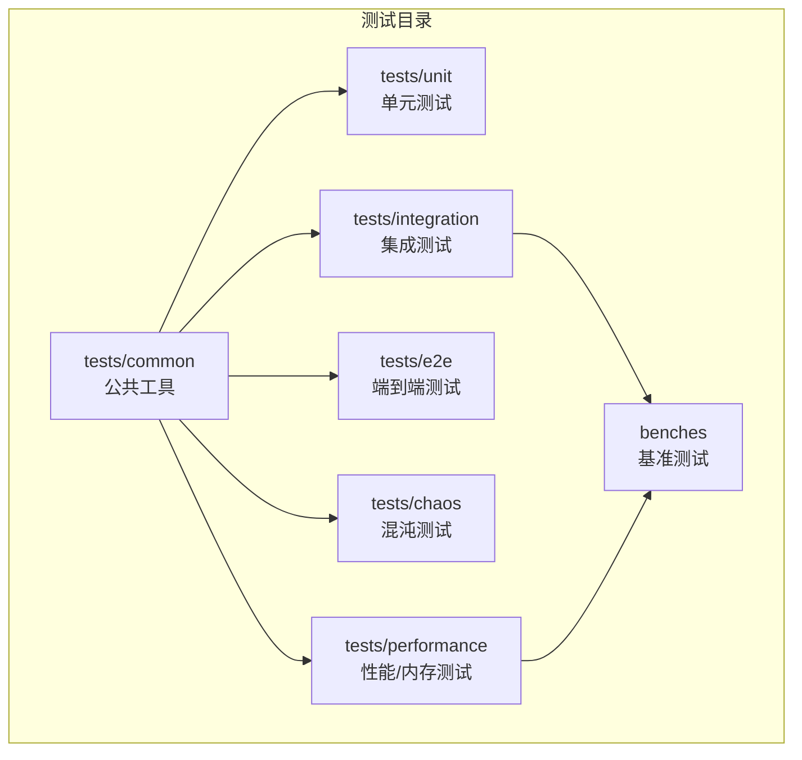
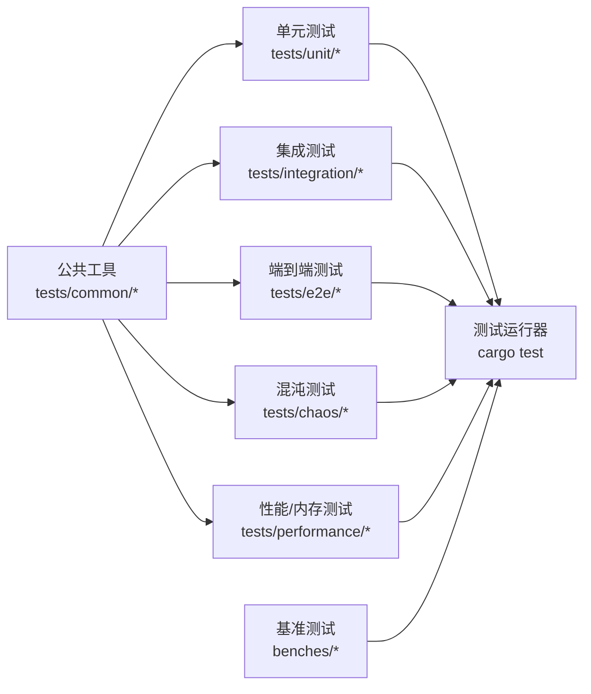
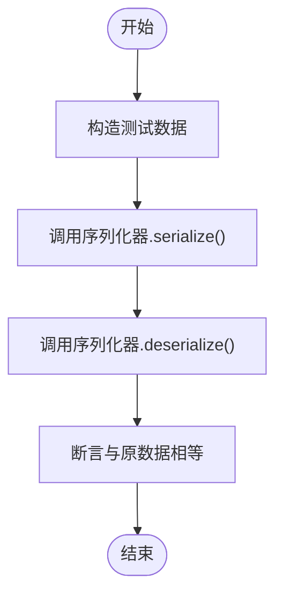
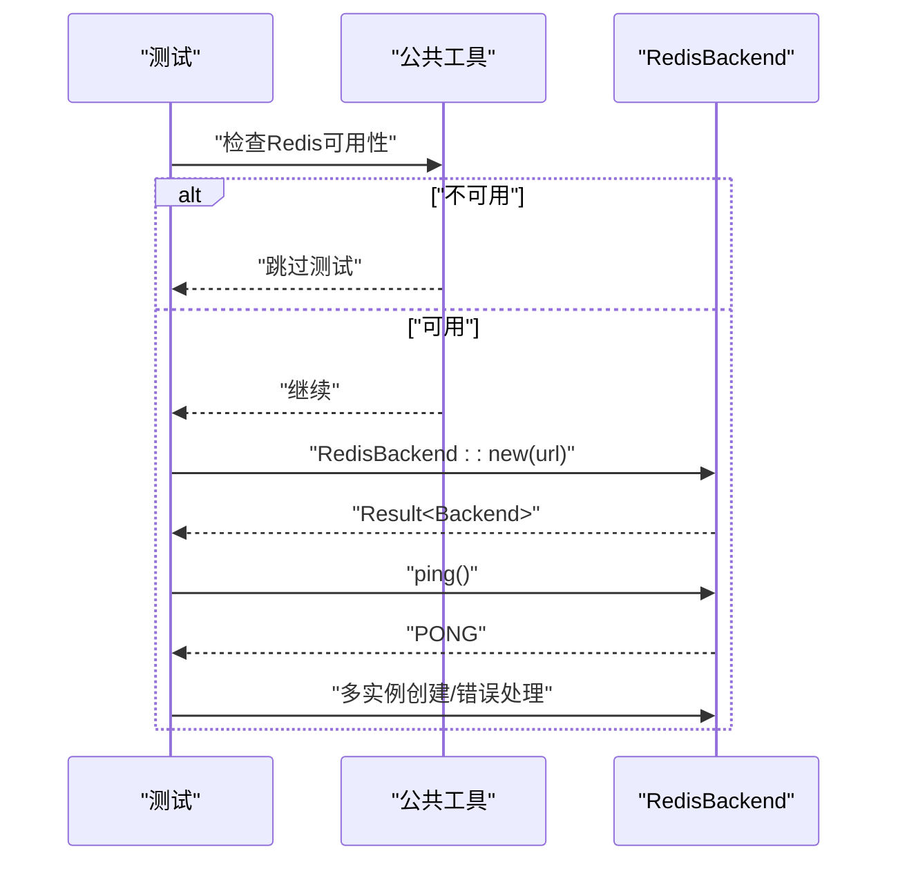
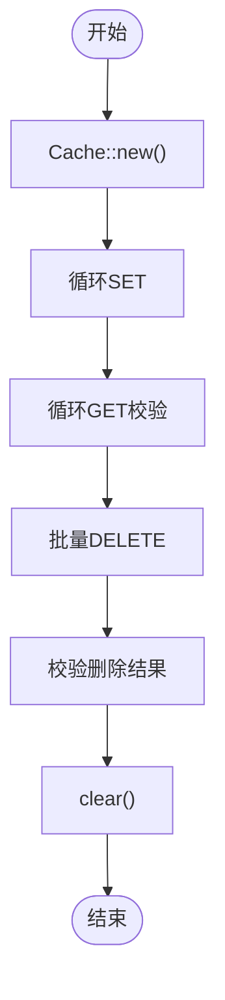
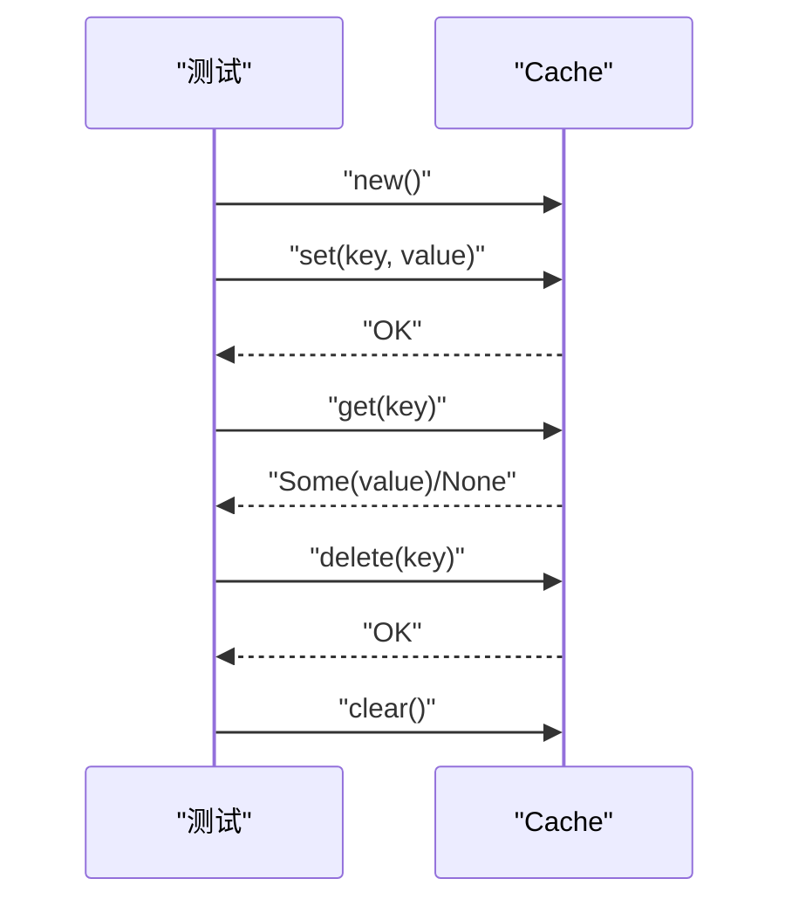
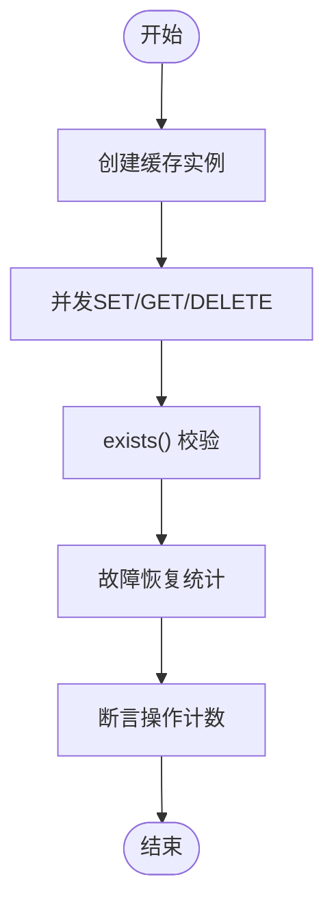
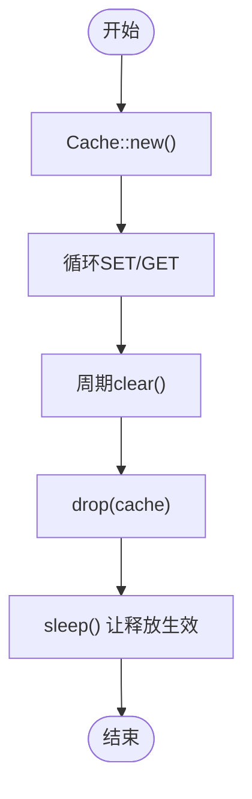
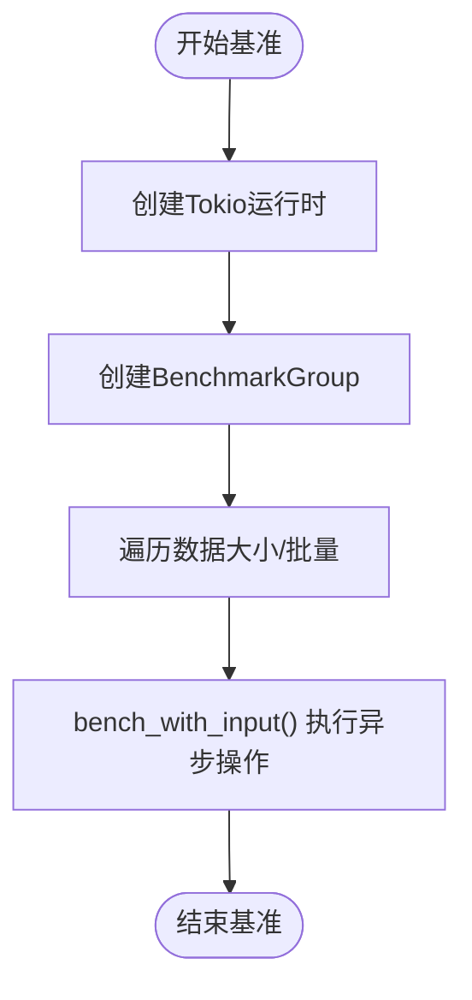
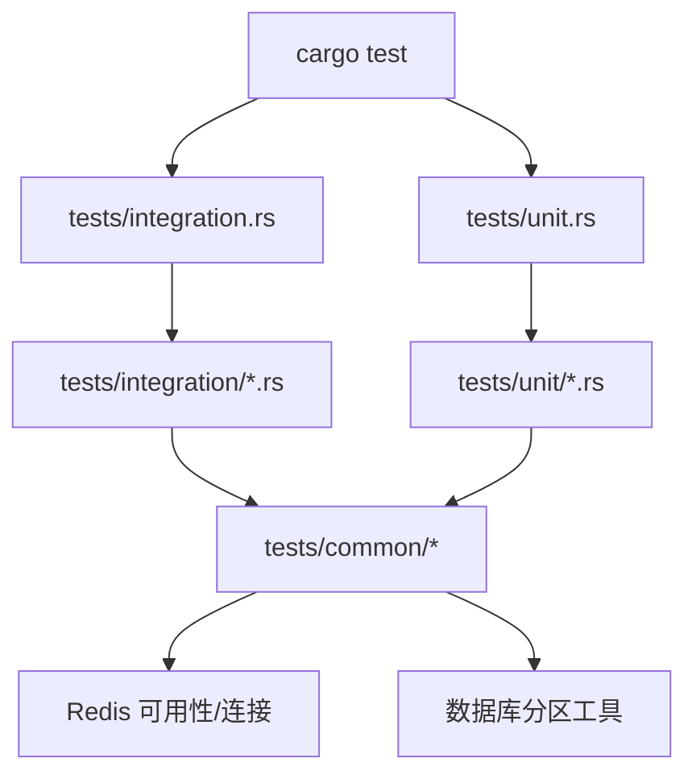

# 测试规范

<cite>
**本文引用的文件**
- [Cargo.toml](file://Cargo.toml)
- [tests/TEST_CATEGORIES.md](file://tests/TEST_CATEGORIES.md)
- [tests/common/mod.rs](file://tests/common/mod.rs)
- [tests/common/redis_test_utils.rs](file://tests/common/redis_test_utils.rs)
- [tests/common/database_test_utils.rs](file://tests/common/database_test_utils.rs)
- [tests/integration.rs](file://tests/integration.rs)
- [tests/unit.rs](file://tests/unit.rs)
- [tests/unit/serialization_test.rs](file://tests/unit/serialization_test.rs)
- [tests/integration/redis_test.rs](file://tests/integration/redis_test.rs)
- [tests/integration/comprehensive_test.rs](file://tests/integration/comprehensive_test.rs)
- [tests/chaos/random_failure_test.rs](file://tests/chaos/random_failure_test.rs)
- [tests/e2e/macro_test.rs](file://tests/e2e/macro_test.rs)
- [benches/cache_benchmark.rs](file://benches/cache_benchmark.rs)
- [tests/performance/memory_tests.rs](file://tests/performance/memory_tests.rs)
- [tests/performance/memory_leak_test.rs](file://tests/performance/memory_leak_test.rs)
</cite>

## 目录
1. [引言](#引言)
2. [项目结构](#项目结构)
3. [核心组件](#核心组件)
4. [架构总览](#架构总览)
5. [详细组件分析](#详细组件分析)
6. [依赖分析](#依赖分析)
7. [性能考量](#性能考量)
8. [故障排查指南](#故障排查指南)
9. [结论](#结论)
10. [附录](#附录)

## 引言
本文件系统化阐述 Oxcache 项目的测试规范与编写标准，覆盖测试目录组织、各类测试的编写方法、运行与验证流程、以及最佳实践。文档面向不同技术背景的读者，既提供高层概览，也给出可操作的细节指引。

## 项目结构
Oxcache 的测试采用按“功能域+层级”混合组织方式：
- tests/common：公共测试工具与基础设施（日志、Redis/数据库连接辅助、资源清理等）
- tests/unit：单元测试（如序列化器）
- tests/integration：集成测试（缓存流程、Redis、数据库、指标、安全、性能、恢复等）
- tests/e2e：端到端测试（宏驱动的完整链路）
- tests/chaos：混沌工程测试（故障注入与恢复）
- tests/performance：性能与内存相关测试（含基准与泄漏检测）
- benches：基准测试（Criterion）

图表来源
- [tests/common/mod.rs](file://tests/common/mod.rs#L1-L184)
- [tests/unit.rs](file://tests/unit.rs#L1-L12)
- [tests/integration.rs](file://tests/integration.rs#L1-L62)
- [tests/e2e/macro_test.rs](file://tests/e2e/macro_test.rs#L1-L104)
- [tests/chaos/random_failure_test.rs](file://tests/chaos/random_failure_test.rs#L1-L138)
- [benches/cache_benchmark.rs](file://benches/cache_benchmark.rs#L1-L100)

章节来源
- [tests/TEST_CATEGORIES.md](file://tests/TEST_CATEGORIES.md#L1-L177)

## 核心组件
- 公共测试工具
  - 日志初始化与环境过滤
  - Redis 连接可用性判断与等待、URL 解析
  - 数据库分区测试工具（临时 SQLite、分区创建/清理、并发分区操作）
- 测试入口模块
  - tests/integration.rs：集中声明集成测试模块
  - tests/unit.rs：集中声明单元测试模块
- 测试运行与分类
  - cargo test 支持按测试模块运行（如 --test integration）
  - 提供运行示例与命令约定

章节来源
- [tests/common/mod.rs](file://tests/common/mod.rs#L18-L184)
- [tests/common/redis_test_utils.rs](file://tests/common/redis_test_utils.rs#L1-L77)
- [tests/common/database_test_utils.rs](file://tests/common/database_test_utils.rs#L1-L254)
- [tests/integration.rs](file://tests/integration.rs#L1-L62)
- [tests/unit.rs](file://tests/unit.rs#L1-L12)
- [tests/TEST_CATEGORIES.md](file://tests/TEST_CATEGORIES.md#L112-L137)

## 架构总览
测试体系围绕“公共工具 + 功能域测试 + 基准/性能”的分层设计，确保：
- 可复用的基础设施（日志、Redis/数据库连接、资源清理）
- 明确的功能域划分（单元/集成/端到端/混沌/性能）
- 可扩展的入口模块（通过 #[path = "..."] 组织）

图表来源
- [tests/unit.rs](file://tests/unit.rs#L1-L12)
- [tests/integration.rs](file://tests/integration.rs#L1-L62)
- [tests/common/mod.rs](file://tests/common/mod.rs#L1-L184)
- [benches/cache_benchmark.rs](file://benches/cache_benchmark.rs#L1-L100)

## 详细组件分析

### 单元测试：序列化器
- 目标：验证序列化器的往返一致性与压缩行为
- 方法：构造测试数据结构，分别执行序列化/反序列化，断言相等；对压缩场景验证往返正确性
- 关注点：类型覆盖（字符串、字节、布尔等）、边界值（空键/空值、长键）

图表来源
- [tests/unit/serialization_test.rs](file://tests/unit/serialization_test.rs#L17-L51)

章节来源
- [tests/unit/serialization_test.rs](file://tests/unit/serialization_test.rs#L1-L52)

### 集成测试：Redis 连接与基本操作
- 目标：验证 RedisBackend 的创建、PING、连接串变体、多实例连接、错误处理
- 方法：通过公共工具判断 Redis 可用性；构造 RedisBackend 实例；执行 PING；验证不同连接串格式；错误场景断言
- 关注点：环境变量优先（REDIS_URL、OXCACHE_ALLOW_INSECURE_REDIS）；跳过不可用环境；超时等待

图表来源
- [tests/integration/redis_test.rs](file://tests/integration/redis_test.rs#L16-L153)
- [tests/common/redis_test_utils.rs](file://tests/common/redis_test_utils.rs#L38-L65)

章节来源
- [tests/integration/redis_test.rs](file://tests/integration/redis_test.rs#L1-L153)
- [tests/common/redis_test_utils.rs](file://tests/common/redis_test_utils.rs#L1-L77)

### 综合测试：新 API 缓存全流程
- 目标：验证新 Cache API 的基本/批量/类型/边界场景
- 方法：创建缓存实例；SET/GET/DELETE/清空；批量写入读取；多类型键值；空键/空值/长键等边界
- 关注点：日志初始化；断言结果；清理资源

图表来源
- [tests/integration/comprehensive_test.rs](file://tests/integration/comprehensive_test.rs#L13-L139)

章节来源
- [tests/integration/comprehensive_test.rs](file://tests/integration/comprehensive_test.rs#L1-L139)

### 端到端测试：宏驱动的完整链路
- 目标：覆盖基本缓存操作、结构体缓存、批量操作
- 方法：使用 Cache::new 创建实例；执行 SET/GET/DELETE；批量写读；最终清理
- 关注点：结构体序列化/反序列化一致性；批量操作吞吐验证

图表来源
- [tests/e2e/macro_test.rs](file://tests/e2e/macro_test.rs#L20-L103)

章节来源
- [tests/e2e/macro_test.rs](file://tests/e2e/macro_test.rs#L1-L104)

### 混沌测试：随机故障与恢复
- 目标：验证在 Redis 不稳定/故障场景下的稳定性与恢复能力
- 方法：并发写入、存在性检查、删除验证、故障恢复统计
- 关注点：#[ignore] 标记真实环境依赖；并发场景下的健壮性

图表来源
- [tests/chaos/random_failure_test.rs](file://tests/chaos/random_failure_test.rs#L18-L138)

章节来源
- [tests/chaos/random_failure_test.rs](file://tests/chaos/random_failure_test.rs#L1-L138)

### 性能测试：内存与吞吐
- 目标：检测内存泄漏、大/小对象、批量与并发场景下的性能
- 方法：大量 SET/GET 循环；定期 clear；并发写读；大对象填充；断言清理后无残留
- 关注点：Redis 可用性检查；清理与 drop；睡眠让 GC/释放生效

图表来源
- [tests/performance/memory_tests.rs](file://tests/performance/memory_tests.rs#L22-L177)
- [tests/performance/memory_leak_test.rs](file://tests/performance/memory_leak_test.rs#L20-L79)

章节来源
- [tests/performance/memory_tests.rs](file://tests/performance/memory_tests.rs#L1-L177)
- [tests/performance/memory_leak_test.rs](file://tests/performance/memory_leak_test.rs#L1-L79)

### 基准测试：L1 缓存性能
- 目标：评估不同数据规模、批量大小下的 SET/GET 性能
- 方法：Criterion 异步基准；black_box 包裹输入；按数据大小/批量分组
- 关注点：异步运行时；吞吐设置；分组维度

图表来源
- [benches/cache_benchmark.rs](file://benches/cache_benchmark.rs#L13-L99)

章节来源
- [benches/cache_benchmark.rs](file://benches/cache_benchmark.rs#L1-L100)

## 依赖分析
- 测试运行与入口
  - tests/integration.rs 与 tests/unit.rs 通过 #[path = "..."] 将各测试文件纳入统一模块树
  - cargo test 支持按模块运行（如 --test integration）
- Redis 与数据库依赖
  - Redis 可用性检查基于环境变量（REDIS_URL、OXCACHE_ALLOW_INSECURE_REDIS），并提供等待/超时逻辑
  - 数据库测试工具提供临时 SQLite、分区创建/清理、并发分区操作等
- 开发依赖
  - Criterion 用于基准测试
  - serial_test、rand、mockall 等用于并发与模拟

图表来源
- [tests/integration.rs](file://tests/integration.rs#L10-L61)
- [tests/unit.rs](file://tests/unit.rs#L10-L12)
- [tests/common/mod.rs](file://tests/common/mod.rs#L45-L184)
- [Cargo.toml](file://Cargo.toml#L216-L223)

章节来源
- [tests/integration.rs](file://tests/integration.rs#L1-L62)
- [tests/unit.rs](file://tests/unit.rs#L1-L12)
- [tests/common/mod.rs](file://tests/common/mod.rs#L1-L184)
- [Cargo.toml](file://Cargo.toml#L216-L223)

## 性能考量
- 基准测试
  - 使用 Criterion 异步基准，关注不同数据规模与批量的吞吐表现
  - 通过分组维度（数据大小、批量）对比性能差异
- 内存与泄漏
  - 大量循环 SET/GET + 定期清理 + 最终 drop，验证无泄漏
  - 并发场景下观察稳定性与资源回收
- Redis 可用性
  - 在集成测试前进行可用性检查与等待，避免 CI 中不稳定因素

章节来源
- [benches/cache_benchmark.rs](file://benches/cache_benchmark.rs#L1-L100)
- [tests/performance/memory_tests.rs](file://tests/performance/memory_tests.rs#L1-L177)
- [tests/performance/memory_leak_test.rs](file://tests/performance/memory_leak_test.rs#L1-L79)
- [tests/common/redis_test_utils.rs](file://tests/common/redis_test_utils.rs#L38-L65)

## 故障排查指南
- Redis 不可用
  - 确认环境变量：REDIS_URL、OXCACHE_ALLOW_INSECURE_REDIS
  - 使用公共工具的等待/超时逻辑，避免立即失败
  - 在 CI 中可设置跳过标志以绕过 Redis 依赖
- 数据库分区测试
  - 注意表名合法性校验，防止注入风险
  - 使用临时 SQLite 文件，确保测试隔离与可清理
- 并发与资源清理
  - 在性能/内存测试中，定期清理与最终 drop 是关键
  - 并发任务完成后需等待 join，避免悬挂

章节来源
- [tests/common/mod.rs](file://tests/common/mod.rs#L45-L184)
- [tests/common/database_test_utils.rs](file://tests/common/database_test_utils.rs#L57-L109)
- [tests/performance/memory_tests.rs](file://tests/performance/memory_tests.rs#L22-L177)

## 结论
Oxcache 的测试体系以“公共工具 + 功能域测试 + 基准/性能”为核心，结合环境变量与等待机制，确保在多样化环境中稳定运行。建议在新增测试时遵循既有目录与命名约定，充分利用公共工具，覆盖边界与错误场景，并通过基准测试持续监控性能回归。

## 附录
- 测试运行命令示例
  - 运行全部测试：cargo test
  - 运行集成测试模块：cargo test --test integration
  - 运行特定测试：cargo test --test integration -- test_two_level_cache_flow
- 新增测试步骤
  - 集成测试：在 tests/integration/ 下创建文件；在 tests/integration.rs 中添加 #[path = "..."] 声明
  - 单元测试：在 tests/unit/ 下创建文件；在 tests/unit.rs 中添加 #[path = "..."] 声明
  - 使用公共工具：use crate::common::*
  - Redis 可用性检查：is_redis_available()

章节来源
- [tests/TEST_CATEGORIES.md](file://tests/TEST_CATEGORIES.md#L112-L177)
- [tests/integration.rs](file://tests/integration.rs#L10-L61)
- [tests/unit.rs](file://tests/unit.rs#L10-L12)