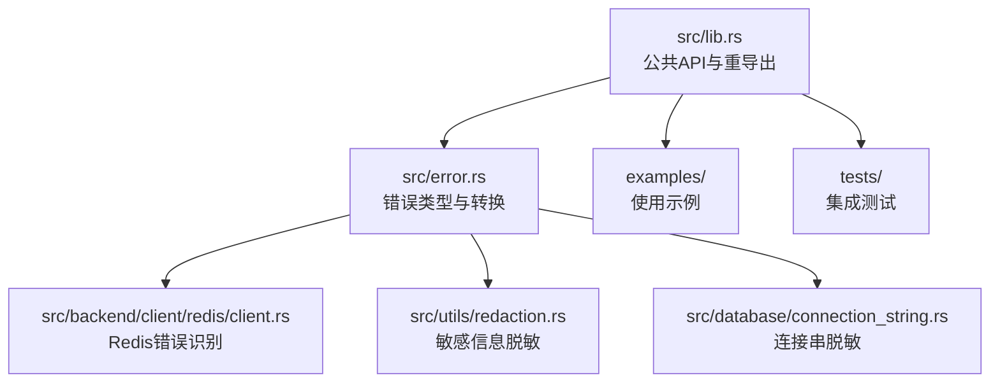
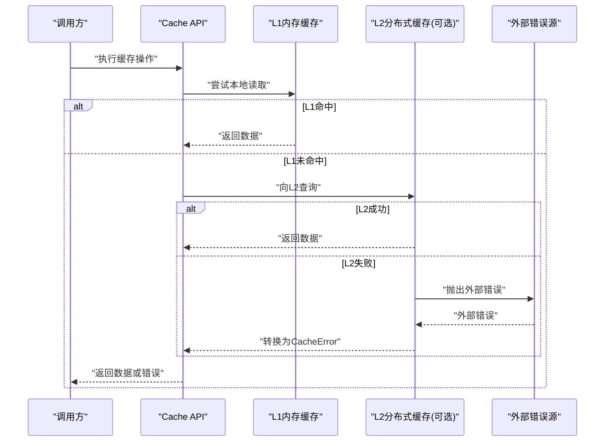
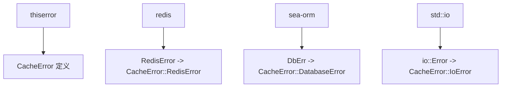

# 错误处理规范

<cite>
**本文档引用的文件**
- [src/error.rs](file://src/error.rs)
- [src/lib.rs](file://src/lib.rs)
- [Cargo.toml](file://Cargo.toml)
- [examples/src/01_basics/example_basic_operations.rs](file://examples/src/01_basics/example_basic_operations.rs)
- [examples/src/redis_native.rs](file://examples/src/redis_native.rs)
- [src/backend/client/redis/client.rs](file://src/backend/client/redis/client.rs)
- [src/utils/redaction.rs](file://src/utils/redaction.rs)
- [src/database/connection_string.rs](file://src/database/connection_string.rs)
- [tests/chaos/random_failure_test.rs](file://tests/chaos/random_failure_test.rs)
</cite>

## 目录
1. [简介](#简介)
2. [项目结构](#项目结构)
3. [核心组件](#核心组件)
4. [架构概览](#架构概览)
5. [详细组件分析](#详细组件分析)
6. [依赖分析](#依赖分析)
7. [性能考虑](#性能考虑)
8. [故障排查指南](#故障排查指南)
9. [结论](#结论)

## 简介
本文件系统性阐述 Oxcache 项目的错误处理规范与最佳实践，重点围绕 thiserror 宏的使用方法展开，涵盖错误类型设计、错误传播模式、用户友好消息与调试信息的设计原则，以及在不同模块间的错误传递与转换策略。通过 CacheError 枚举的具体变体与配套工具函数，帮助开发者构建一致、可维护且易于诊断的错误处理体系。

## 项目结构
Oxcache 的错误处理主要集中在核心模块中，通过统一的错误类型与便捷的错误转换实现跨模块协作。关键位置如下：
- 核心错误类型定义与导出：src/error.rs
- 公共 API 重导出：src/lib.rs
- 依赖声明：Cargo.toml
- 使用示例与集成点：examples/ 与 tests/

**图表来源**
- [src/lib.rs](file://src/lib.rs#L569-L569)
- [src/error.rs](file://src/error.rs#L75-L213)
- [src/backend/client/redis/client.rs](file://src/backend/client/redis/client.rs#L500-L504)
- [src/utils/redaction.rs](file://src/utils/redaction.rs#L72-L115)
- [src/database/connection_string.rs](file://src/database/connection_string.rs#L770-L800)

**章节来源**
- [src/lib.rs](file://src/lib.rs#L569-L569)
- [src/error.rs](file://src/error.rs#L75-L213)

## 核心组件
- 错误类型定义：CacheError 枚举，使用 #[derive(Error)] 自动生成错误实现，并通过 #[error(...)] 定义用户友好消息模板。
- 错误传播：Result<T> 类型别名简化返回签名；通过 ? 操作符在异步函数中传播错误。
- 错误转换：From<T> 实现将外部错误类型转换为 CacheError，便于在不同模块间传递。
- 辅助工具：is_not_found()、is_connection_error()、is_degraded() 等便捷方法，提升错误分支判断的可读性与一致性。

**章节来源**
- [src/error.rs](file://src/error.rs#L75-L213)
- [src/error.rs](file://src/error.rs#L228-L288)

## 架构概览
Oxcache 的错误处理遵循“统一错误类型 + 可选外部错误转换”的架构。上层业务逻辑通过 Result<T> 与 ? 操作符进行错误传播，底层模块（如 Redis、IO、数据库）通过 From<T> 实现将自身错误转换为 CacheError，从而保证调用方获得一致的错误语义与用户体验。

**图表来源**
- [src/error.rs](file://src/error.rs#L215-L226)
- [src/backend/client/redis/client.rs](file://src/backend/client/redis/client.rs#L500-L504)

## 详细组件分析

### thiserror 宏与 #[derive(Error)] 的使用
- #[derive(Error)] 自动生成 Display、Debug 等 trait 实现，减少样板代码。
- #[error(...)] 为每个变体提供用户可读的消息模板，支持占位符注入，便于携带上下文信息。
- #[from] 用于自动实现 From<T> 转换，使外部错误无缝融入 CacheError 体系。

示例路径参考：
- [CacheError 变体定义](file://src/error.rs#L75-L208)
- [Result 类型别名](file://src/error.rs#L210-L213)

**章节来源**
- [src/error.rs](file://src/error.rs#L75-L213)

### 错误消息格式设计与用户友好性
- 采用分层描述：先给出错误类别（如 Serialization、Connection、Redis 等），再提供具体原因与建议。
- 提供可操作的修复建议（例如检查网络连通性、调整超时时间、确认配置文件等）。
- 对于敏感信息（如连接串密码），通过脱敏处理避免泄露。

示例路径参考：
- [RedisError 脱敏消息](file://src/error.rs#L150-L161)
- [sanitize_connection_string 实现](file://src/error.rs#L13-L43)
- [normalize_connection_string_with_redaction](file://src/database/connection_string.rs#L770-L800)

**章节来源**
- [src/error.rs](file://src/error.rs#L13-L43)
- [src/error.rs](file://src/error.rs#L150-L161)
- [src/database/connection_string.rs](file://src/database/connection_string.rs#L770-L800)

### 错误转换与跨模块传递
- 通过 From<ExternalError> 实现将外部错误转换为 CacheError，保持调用链一致。
- 对于数据库错误（SeaORM）、IO 错误等，统一映射到对应变体，便于上层统一处理。

示例路径参考：
- [From<sea_orm::DbErr>](file://src/error.rs#L215-L220)
- [From<std::io::Error>](file://src/error.rs#L222-L226)

**章节来源**
- [src/error.rs](file://src/error.rs#L215-L226)

### 错误传播模式与 Result 返回约定
- 所有公共 API 返回 Result<T, CacheError>，使用 ? 操作符在异步函数中传播错误。
- 在示例中，main 函数返回 Box<dyn std::error::Error>，体现了与 anyhow 的协同使用。

示例路径参考：
- [示例：基本 CRUD 操作](file://examples/src/01_basics/example_basic_operations.rs#L21-L72)
- [示例：Redis 原生客户端](file://examples/src/redis_native.rs#L19-L114)

**章节来源**
- [examples/src/01_basics/example_basic_operations.rs](file://examples/src/01_basics/example_basic_operations.rs#L21-L72)
- [examples/src/redis_native.rs](file://examples/src/redis_native.rs#L19-L114)

### Redis 错误识别与降级处理
- 提供 is_connection_error() 工具函数，基于 RedisError 的超时与 IO 错误特征判断连接类错误。
- 结合 CacheError::is_connection_error()，可在上层逻辑中快速区分连接异常与其他错误类型。

示例路径参考：
- [is_connection_error 实现](file://src/backend/client/redis/client.rs#L500-L504)
- [CacheError::is_connection_error](file://src/error.rs#L263-L268)

**章节来源**
- [src/backend/client/redis/client.rs](file://src/backend/client/redis/client.rs#L500-L504)
- [src/error.rs](file://src/error.rs#L263-L268)

### 故障注入与混沌测试中的错误处理
- 在混沌测试中，对缓存创建、设置、获取等操作进行错误捕获与输出，验证系统在 Redis 不可用场景下的稳定性与恢复能力。

示例路径参考：
- [随机故障测试](file://tests/chaos/random_failure_test.rs#L18-L49)

**章节来源**
- [tests/chaos/random_failure_test.rs](file://tests/chaos/random_failure_test.rs#L18-L49)

### 错误类型设计示例：CacheError 枚举
CacheError 枚举覆盖了缓存系统常见错误场景，包括但不限于：
- 序列化错误（Serialization）
- 操作错误（Operation）
- 连接错误（Connection）
- 未找到错误（NotFound）
- 降级错误（Degraded）
- L1/L2 缓存错误（L1Error、L2Error）
- 配置错误（ConfigError、Configuration）
- 不支持的操作（NotSupported）
- WAL 错误（WalError）
- 数据库错误（DatabaseError）
- Redis 错误（RedisError，含脱敏）
- IO 错误（IoError）
- 后端错误（BackendError）
- 超时错误（Timeout）
- 关闭错误（ShutdownError）
- 键/值大小限制（KeyTooLong、ValueTooLarge）
- 缓冲区已满（BufferFull）
- 无效输入/键（InvalidInput、InvalidKey）
- 锁错误（LockError）

示例路径参考：
- [CacheError 完整定义](file://src/error.rs#L75-L208)

**章节来源**
- [src/error.rs](file://src/error.rs#L75-L208)

### 错误分支判断与调试信息
- is_not_found()：快速判断“键不存在”场景，便于实现缓存旁路策略。
- is_connection_error()：统一识别连接类异常，便于触发降级或重试。
- is_degraded()：识别缓存降级状态，指导上层采取保守策略。

示例路径参考：
- [is_not_found](file://src/error.rs#L244-L246)
- [is_connection_error](file://src/error.rs#L263-L268)
- [is_degraded](file://src/error.rs#L285-L287)

**章节来源**
- [src/error.rs](file://src/error.rs#L244-L287)

## 依赖分析
- thiserror：提供 #[derive(Error)] 与 #[error(...)] 的宏支持，是错误类型设计的核心依赖。
- redis：在启用 redis 特性时，通过 #[from] 将 redis::RedisError 转换为 CacheError::RedisError。
- sea-orm：在启用 database 特性时，将 DbErr 转换为 CacheError::DatabaseError。
- tokio/std::io：作为常见外部错误源，分别映射到 IoError 与通用 Operation/Backend 错误。

**图表来源**
- [Cargo.toml](file://Cargo.toml#L34-L36)
- [src/error.rs](file://src/error.rs#L150-L161)
- [src/error.rs](file://src/error.rs#L215-L226)

**章节来源**
- [Cargo.toml](file://Cargo.toml#L34-L36)
- [src/error.rs](file://src/error.rs#L150-L161)
- [src/error.rs](file://src/error.rs#L215-L226)

## 性能考虑
- 错误消息模板应简洁明了，避免在高频路径中进行昂贵的字符串拼接。
- 脱敏处理仅在需要时进行，避免对非敏感路径造成额外开销。
- 使用便捷方法（如 is_not_found、is_connection_error）替代复杂的匹配逻辑，提升分支判断效率。

## 故障排查指南
- 连接类错误：优先检查网络连通性、服务可用性与超时配置；利用 is_connection_error() 快速定位。
- Redis 相关：关注脱敏后的连接串提示，确认认证信息与主机地址；必要时开启更详细的日志。
- 数据库错误：核对连接字符串与 SQL 语法，结合 From<DbErr> 的转换信息定位问题。
- IO 错误：检查磁盘空间、权限与文件路径；根据 IoError 的上下文信息进行修复。
- 降级模式：当出现 Degraded 错误时，建议降低功能复杂度或切换到 L1 本地缓存。

**章节来源**
- [src/error.rs](file://src/error.rs#L93-L174)
- [src/error.rs](file://src/error.rs#L150-L161)
- [src/error.rs](file://src/error.rs#L215-L226)

## 结论
Oxcache 的错误处理体系以 thiserror 为核心，通过统一的 CacheError 枚举与 From<T> 转换，实现了跨模块的一致性与可维护性。配合用户友好消息、脱敏处理与便捷的错误分支判断方法，既提升了用户体验，也增强了系统的可观测性与可诊断性。遵循本文档的规范与最佳实践，可在新功能开发与现有模块扩展中保持一致的错误处理风格。