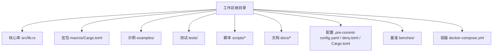
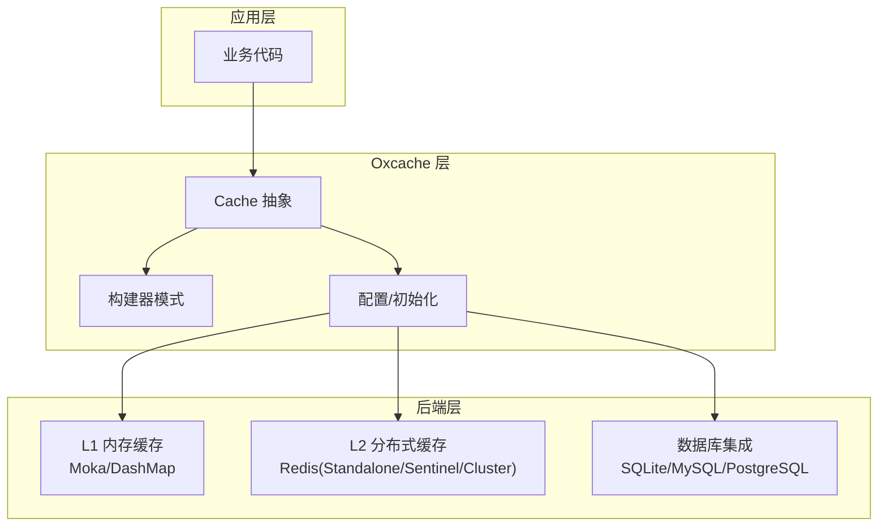
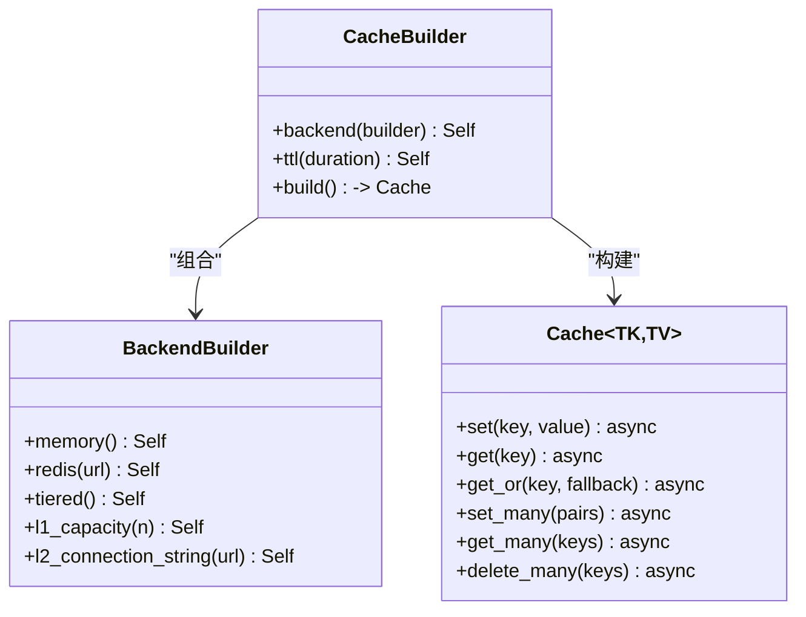
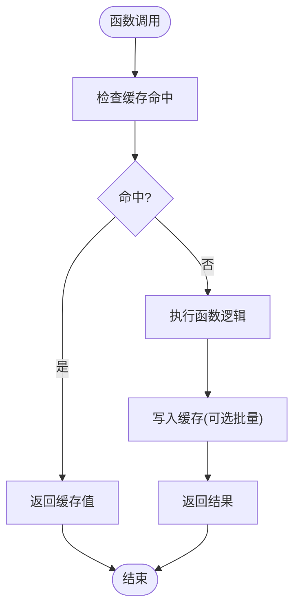
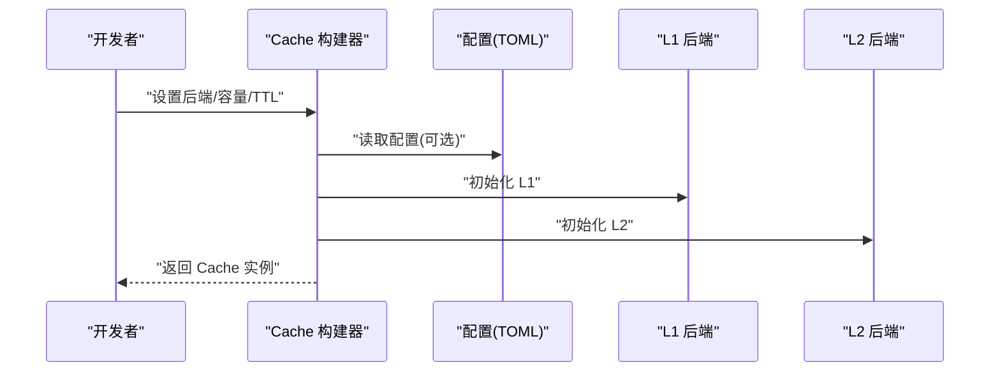
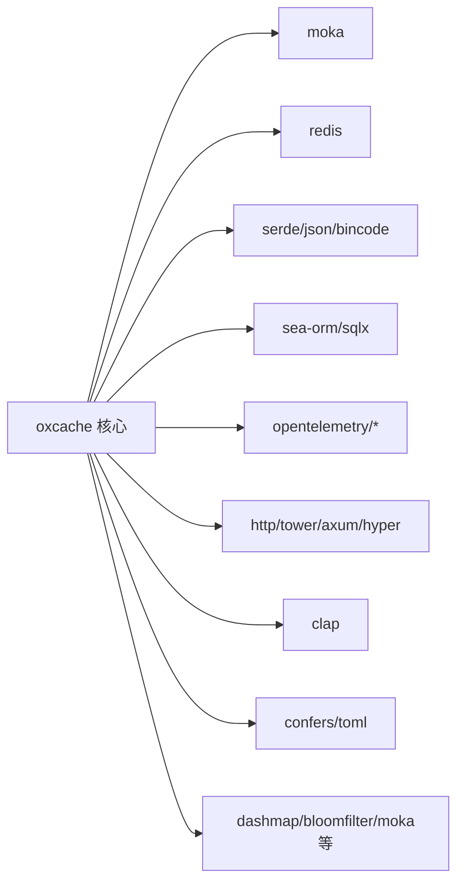
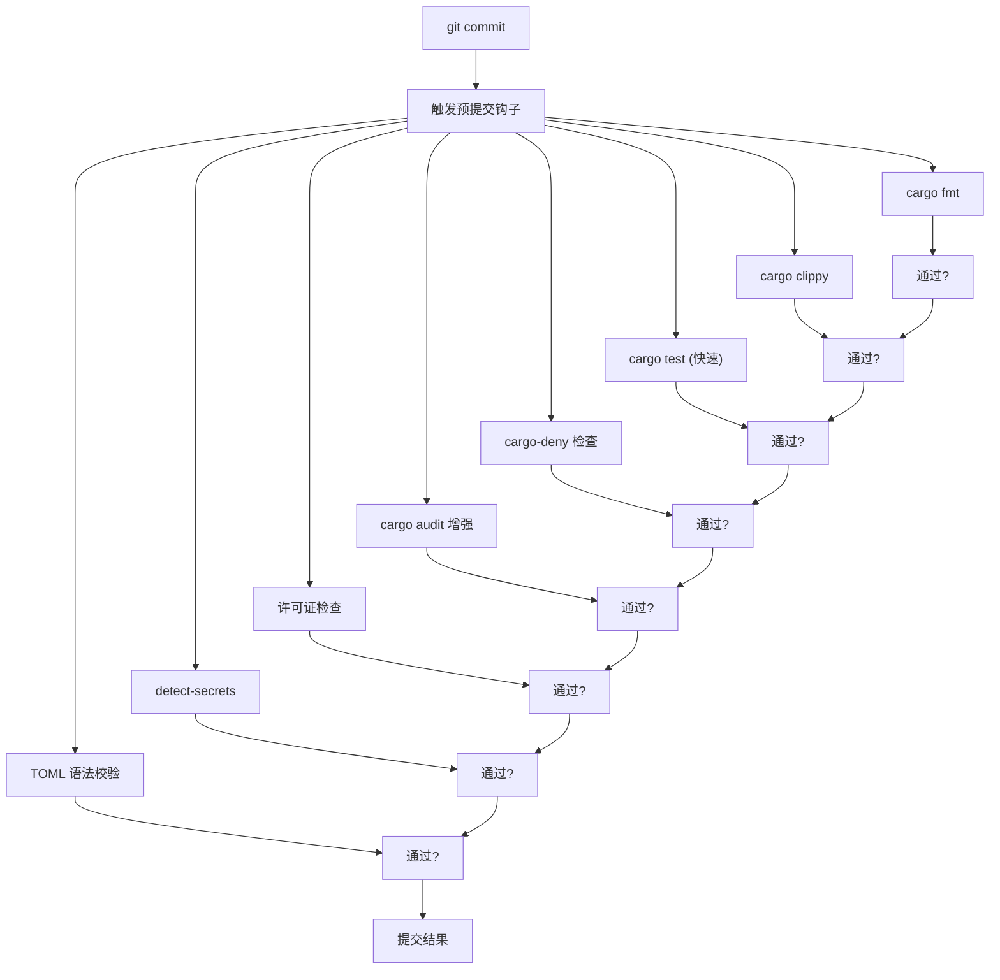

# 开发指南

<cite>
**本文引用的文件**  
- [README.md](file://README.md)
- [Cargo.toml](file://Cargo.toml)
- [.pre-commit-config.yaml](file://.pre-commit-config.yaml)
- [scripts/precommit_clippy.sh](file://scripts/precommit_clippy.sh)
- [scripts/precommit_tests.sh](file://scripts/precommit_tests.sh)
- [scripts/run_all_tests.sh](file://scripts/run_all_tests.sh)
- [deny.toml](file://deny.toml)
- [docker-compose.yml](file://docker-compose.yml)
- [src/lib.rs](file://src/lib.rs)
- [macros/Cargo.toml](file://macros/Cargo.toml)
- [.gitignore](file://.gitignore)
- [docs/API_REFERENCE.md](file://docs/API_REFERENCE.md)
</cite>

## 目录
1. [简介](#简介)
2. [项目结构](#项目结构)
3. [核心组件](#核心组件)
4. [架构总览](#架构总览)
5. [详细组件分析](#详细组件分析)
6. [依赖关系分析](#依赖关系分析)
7. [性能与优化](#性能与优化)
8. [故障排查指南](#故障排查指南)
9. [结论](#结论)
10. [附录](#附录)

## 简介
本指南面向希望参与 Oxcache 项目开发与贡献的工程师，系统阐述开发流程、代码规范、构建与发布流程、预提交检查机制、持续集成与自动化测试策略、代码评审标准、版本与发布管理、开发工具使用与故障排除，以及项目治理与社区参与方式。内容基于仓库中的配置文件、脚本与文档进行归纳总结，确保新老成员都能快速上手并高质量交付。

## 项目结构
Oxcache 是一个采用 Rust 编写的高性能两级缓存库，支持 L1（内存）+ L2（Redis 分布式）架构，并提供现代化 API、宏缓存、可观测性、批量写入、WAL 恢复、布隆过滤、速率限制、数据库集成、HTTP 缓存、CLI 等高级能力。项目采用工作区组织，包含核心库、宏包、示例与测试。

- 核心库与模块
  - src/lib.rs：对外 API、功能入口与文档
  - src/backend/*：后端实现（L1/L2、策略、度量、重试/熔断、分片锁等）
  - src/builder/*：现代 API 构建器
  - src/client/*：客户端封装与 TTL 控制
  - src/config/*：统一配置与服务配置
  - src/database/*：数据库集成（SQLite/MySQL/PostgreSQL）
  - src/http/*：HTTP 缓存适配
  - src/metrics/*：指标采集
  - src/recovery/*：WAL 恢复
  - src/security/*：安全相关工具
  - src/serialization/*：序列化与压缩
  - src/sync/*：同步与预热
  - src/cli/*：命令行接口
  - src/traits/utils/*：通用 trait 与工具
- 宏包
  - macros/Cargo.toml：#[cached] 等过程宏定义
- 示例与基准
  - examples/：功能示例
  - benches/：基准测试
- 测试与环境
  - tests/：单元/集成/端到端/混沌/分区/性能等测试
  - docker-compose.yml：本地 Redis/Sentinel/Cluster 与数据库测试环境
  - tests/real_env/*：真实环境编排（Sentinel/Cluster）
- 文档
  - docs/：架构、API、用户手册、安全、性能报告等
- 脚本与配置
  - scripts/*：预提交与测试脚本
  - .pre-commit-config.yaml：Git 预提交钩子
  - deny.toml：依赖安全与许可证策略
  - Cargo.toml：工作区与特性开关

**章节来源**
- [README.md](file://README.md#L1-L414)
- [Cargo.toml](file://Cargo.toml#L1-L377)
- [docker-compose.yml](file://docker-compose.yml#L1-L199)

## 核心组件
- 现代 API（推荐）
  - Cache<TK, TV>：类型安全的缓存抽象，支持内存/Redis 后端与构建器模式
  - 支持批量操作、键类型扩展、TTL 等
- 特性体系
  - minimal/core/full 三层特性集；按需启用 moka、redis、serialization、metrics、wal-recovery、batch-write、bloom-filter、rate-limiting、database、cli、http-cache 等
- 预处理宏
  - #[cached]：零样板缓存装饰器，支持服务名、TTL、自定义键格式等
- 配置与初始化
  - 支持从 TOML 文件初始化（需启用 confers/config-toml），也支持 Builder 模式
- 观测与运维
  - OpenTelemetry 指标、健康检查、优雅关闭、单飞、WAL 恢复、多实例 Pub/Sub 同步、批量写入优化

**章节来源**
- [src/lib.rs](file://src/lib.rs#L1-L200)
- [docs/API_REFERENCE.md](file://docs/API_REFERENCE.md#L1-L200)
- [Cargo.toml](file://Cargo.toml#L235-L347)

## 架构总览
Oxcache 的现代 API 通过 Cache 抽象统一 L1（内存）与 L2（Redis）访问，支持独立或两级组合模式。配置与初始化可采用 Builder 或配置文件方式；特性开关控制功能可用性与依赖。

**图表来源**
- [src/lib.rs](file://src/lib.rs#L10-L175)
- [Cargo.toml](file://Cargo.toml#L235-L347)

**章节来源**
- [src/lib.rs](file://src/lib.rs#L10-L175)
- [Cargo.toml](file://Cargo.toml#L235-L347)

## 详细组件分析

### 现代 API 与构建器
- Cache<TK, TV>：提供 set/get/get_or 等基础操作，支持任意实现 CacheKey 的键类型
- Builder 模式：BackendBuilder 支持内存/Redis/L1Only/L2Only/TwoLevel 组合
- 批量操作：set_many/get_many/delete_many
- TTL 与键生成策略：支持多种键生成算法与命名空间

**图表来源**
- [src/lib.rs](file://src/lib.rs#L10-L175)

**章节来源**
- [src/lib.rs](file://src/lib.rs#L10-L175)

### 预处理宏 #[cached]
- 功能：为异步函数提供零样板缓存装饰
- 参数：service、ttl、key、key_prefix、key_generator、cache_type
- 使用：需启用 macros 特性

**图表来源**
- [docs/API_REFERENCE.md](file://docs/API_REFERENCE.md#L93-L133)
- [Cargo.toml](file://Cargo.toml#L294-L295)

**章节来源**
- [docs/API_REFERENCE.md](file://docs/API_REFERENCE.md#L93-L133)
- [Cargo.toml](file://Cargo.toml#L294-L295)

### 配置与初始化
- TOML 配置：支持全局与服务级配置，含 L1/L2 参数、两层策略、批处理等
- 初始化方式：init_from_file（已弃用）或推荐使用 Builder 模式
- 特性要求：启用 confers/config-toml 以支持配置文件初始化

**图表来源**
- [docs/API_REFERENCE.md](file://docs/API_REFERENCE.md#L134-L188)
- [Cargo.toml](file://Cargo.toml#L332-L334)

**章节来源**
- [docs/API_REFERENCE.md](file://docs/API_REFERENCE.md#L134-L188)
- [Cargo.toml](file://Cargo.toml#L332-L334)

### 宏包与过程宏
- 名称：oxcache_macros
- 类型：proc-macro
- 依赖：syn/quote/proc-macro2
- 作用：提供 #[cached] 等属性宏

**章节来源**
- [macros/Cargo.toml](file://macros/Cargo.toml#L1-L15)

## 依赖关系分析
- 工作区与特性
  - default = full，最小化依赖 minimal，核心 core 在 minimal 基础上增加 redis
  - full 包含大量高级特性：macros、bloom-filter、rate-limiting、wal-recovery、database、cli、full-metrics、batch-write、http-cache 等
- 关键依赖
  - L1：moka、dashmap
  - L2：redis（aio、tokio-comp、cluster-async、sentinel、connection-manager、script）
  - 序列化：serde、serde_json、bincode、rmp-serde、ciborium、flate2
  - 数据库：sea-orm、sqlx
  - 指标：opentelemetry、opentelemetry_sdk、tracing-opentelemetry、opentelemetry-otlp、tracing-subscriber
  - HTTP：http、tower、axum、hyper、http-body-util
  - CLI：clap
  - 配置：confers、toml
- 依赖安全与许可证
  - deny.toml：RUSTSEC 数据源、忽略条目、允许许可证集合、来源校验

**图表来源**
- [Cargo.toml](file://Cargo.toml#L20-L377)
- [deny.toml](file://deny.toml#L1-L39)

**章节来源**
- [Cargo.toml](file://Cargo.toml#L20-L377)
- [deny.toml](file://deny.toml#L1-L39)

## 性能与优化
- 编译优化
  - release 配置：LTO、单代码生成单元、panic=abort、strip、关闭溢出检查
  - 依赖统一优化级别
- 性能特性
  - 批量写入：batch-write
  - 布隆过滤：bloom-filter
  - 智能策略：smart-strategy
  - TTL 控制：ttl-control
  - 两级缓存：tiered-cache
- 基准与测试
  - benches/：缓存/现代 API/Redis 基准
  - scripts/run_all_tests.sh：综合测试运行器，覆盖单元/集成/安全/内存/兼容性/代码质量

**章节来源**
- [Cargo.toml](file://Cargo.toml#L350-L377)
- [scripts/run_all_tests.sh](file://scripts/run_all_tests.sh#L93-L261)

## 故障排查指南

### 开发环境搭建
- Rust 工具链
  - 最低版本：1.70+
  - 推荐：最新稳定版
- 依赖管理
  - Cargo 工作区：根 Cargo.toml 管理特性与依赖
  - 宏包：macros/Cargo.toml
- IDE 配置
  - VS Code/IntelliJ IDEA：Rust 插件、RLS/Rust-analyzer
  - .gitignore：忽略目标目录、IDE 临时文件、日志、WAL 等

**章节来源**
- [README.md](file://README.md#L11-L12)
- [Cargo.toml](file://Cargo.toml#L1-L16)
- [.gitignore](file://.gitignore#L1-L100)

### 代码提交与预提交检查
- 预提交钩子
  - Rust 格式化：cargo fmt
  - Clippy：静态分析，严格模式
  - 快速测试：单元测试（跳过慢集成测试）
  - 依赖审计：cargo-deny
  - 安全扫描：cargo audit 增强版
  - 许可证合规：许可证检查
  - 秘密扫描：detect-secrets
  - TOML 校验：配置文件语法检查
- 脚本行为
  - scripts/precommit_clippy.sh：收集并分类警告，提供修复建议与参考链接
  - scripts/precommit_tests.sh：带超时的快速测试，失败时给出排查步骤
  - scripts/run_all_tests.sh：综合测试运行器，生成报告

**图表来源**
- [.pre-commit-config.yaml](file://.pre-commit-config.yaml#L1-L129)
- [scripts/precommit_clippy.sh](file://scripts/precommit_clippy.sh#L1-L63)
- [scripts/precommit_tests.sh](file://scripts/precommit_tests.sh#L1-L52)

**章节来源**
- [.pre-commit-config.yaml](file://.pre-commit-config.yaml#L1-L129)
- [scripts/precommit_clippy.sh](file://scripts/precommit_clippy.sh#L1-L63)
- [scripts/precommit_tests.sh](file://scripts/precommit_tests.sh#L1-L52)

### 持续集成与自动化测试
- CI 触发：GitHub Actions（badge 存在）
- 测试矩阵与策略
  - 单元测试：cargo test --lib
  - 集成测试：cargo test --test '*'
  - 安全审计：deny.toml 驱动的安全检查
  - 内存泄漏：scripts/memory_test.sh
  - Redis 兼容性：cargo test redis_version_compatibility
  - 文档生成：cargo doc
- 本地环境
  - docker-compose.yml：一键启动 Redis/Standalone/Sentinel/Cluster 与数据库

**章节来源**
- [README.md](file://README.md#L5-L11)
- [scripts/run_all_tests.sh](file://scripts/run_all_tests.sh#L114-L261)
- [docker-compose.yml](file://docker-compose.yml#L1-L199)
- [deny.toml](file://deny.toml#L1-L39)

### 代码评审标准与流程
- 代码质量
  - 通过 cargo fmt 与 cargo clippy（严格模式）
  - 无新增安全漏洞（deny.toml）
  - 无敏感信息泄露（secret 扫描）
- 变更范围
  - 小步快跑，聚焦单一问题
  - 更新相关文档与测试
- 审查要点
  - 特性开关与依赖一致性
  - 错误处理与边界条件
  - 性能影响与回归测试

**章节来源**
- [.pre-commit-config.yaml](file://.pre-commit-config.yaml#L1-L129)
- [deny.toml](file://deny.toml#L1-L39)

### 发布流程与版本管理
- 版本号
  - 当前版本：0.1.4（库）、0.1.3（宏包）
- 特性与兼容性
  - full 特性自动启用所有依赖
  - v0.2.0+ 现代 API，弃用旧 API（init_from_file、get_client、shutdown_all）
- 发布建议
  - 变更日志与迁移指南
  - 文档更新与示例同步
  - 兼容性测试（Redis 版本、数据库）

**章节来源**
- [Cargo.toml](file://Cargo.toml#L3-L4)
- [macros/Cargo.toml](file://macros/Cargo.toml#L3-L4)
- [docs/API_REFERENCE.md](file://docs/API_REFERENCE.md#L3-L11)

### 开发工具使用与故障排除
- 常用命令
  - cargo fmt、cargo clippy、cargo test、cargo bench、cargo doc
  - cargo run --example、cargo run --bin
- 脚本辅助
  - scripts/run_all_tests.sh：综合测试与报告生成
  - scripts/precommit_*：预提交检查脚本
- 常见问题
  - 格式不一致：运行 cargo fmt
  - Clippy 警告：按提示修复或在必要时使用 #[allow(...)]
  - 测试失败：使用 -- --nocapture 查看详细输出
  - 依赖冲突：检查 deny.toml 与特性组合

**章节来源**
- [scripts/run_all_tests.sh](file://scripts/run_all_tests.sh#L214-L261)
- [scripts/precommit_clippy.sh](file://scripts/precommit_clippy.sh#L34-L58)
- [scripts/precommit_tests.sh](file://scripts/precommit_tests.sh#L24-L47)

## 结论
本指南从开发环境、代码规范、预提交检查、CI/测试策略、代码评审、发布与版本管理、工具与故障排除等维度，全面梳理了 Oxcache 的开发流程与贡献路径。建议新成员优先阅读现代 API 与特性体系，结合预提交钩子与综合测试脚本，确保高质量交付。

## 附录

### 分支管理与提交规范（建议）
- 分支策略
  - main：稳定发布线
  - develop：开发主线
  - feature/*：功能开发
  - hotfix/*：紧急修复
- 提交信息
  - 类型：feat/fix/docs/chore/refactor/perf/test/build/ci
  - 范围：模块/特性名称
  - 概述：简洁描述变更
  - 说明：必要时补充背景与影响

### 社区参与
- 问题与讨论：GitHub Issues
- 代码贡献：Fork + Pull Request + 预提交检查 + 评审
- 文档与示例：欢迎补充与改进
