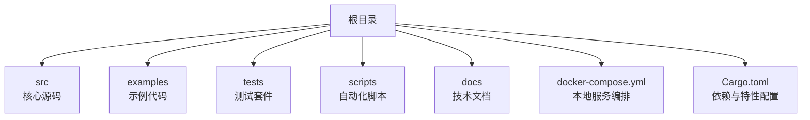
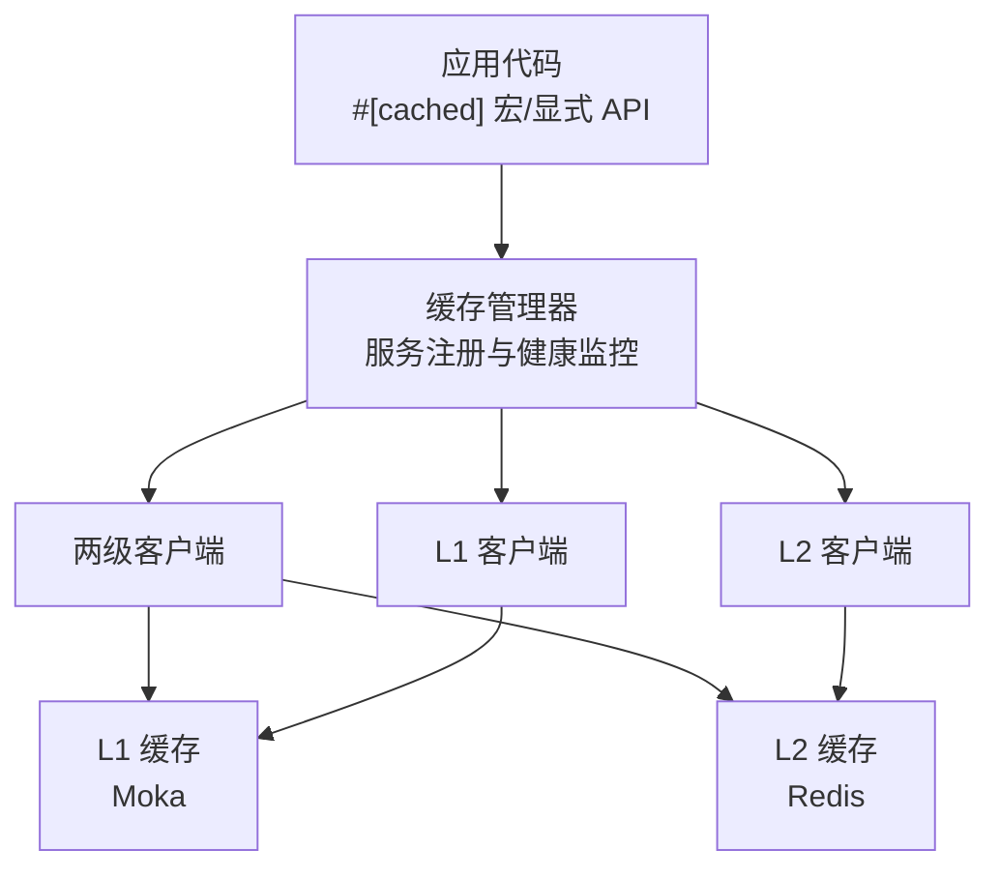

# 快速开始

<cite>
**本文引用的文件**
- [README.md](file://README.md)
- [Cargo.toml](file://Cargo.toml)
- [docker-compose.yml](file://docker-compose.yml)
- [.pre-commit-config.yaml](file://.pre-commit-config.yaml)
- [scripts/run_all_tests.sh](file://scripts/run_all_tests.sh)
- [scripts/precommit_clippy.sh](file://scripts/precommit_clippy.sh)
- [deny.toml](file://deny.toml)
- [src/lib.rs](file://src/lib.rs)
- [examples/src/01_basics/example_basic_operations.rs](file://examples/src/01_basics/example_basic_operations.rs)
- [examples/src/02_advanced/example_batch_write.rs](file://examples/src/02_advanced/example_batch_write.rs)
</cite>

## 目录
1. [简介](#简介)
2. [项目结构](#项目结构)
3. [核心组件](#核心组件)
4. [架构概览](#架构概览)
5. [详细组件分析](#详细组件分析)
6. [依赖分析](#依赖分析)
7. [性能考虑](#性能考虑)
8. [故障排除指南](#故障排除指南)
9. [结论](#结论)
10. [附录](#附录)

## 简介
欢迎来到 Oxcache 项目！这是一个高性能、生产级别的 Rust 两层缓存库，采用 L1（内存缓存）+ L2（Redis 分布式缓存）架构设计。本指南将帮助新开发者快速搭建开发环境、运行测试，并开始为项目贡献代码。

## 项目结构
Oxcache 项目采用模块化组织方式，主要包含以下关键目录与文件：
- src：核心源码，涵盖缓存管理器、客户端、后端实现、配置系统、序列化等
- examples：基础与高级使用示例，展示缓存的基本 CRUD 操作与批量写入优化
- tests：单元测试、集成测试、端到端测试及各类专项测试
- scripts：预提交钩子与自动化测试脚本
- docs：架构文档、用户指南、API 参考等技术文档
- docker-compose.yml：本地 Redis、Sentinel、Cluster 以及数据库服务的容器编排

图表来源
- [docker-compose.yml](file://docker-compose.yml#L1-L199)
- [Cargo.toml](file://Cargo.toml#L1-L377)

章节来源
- [docker-compose.yml](file://docker-compose.yml#L1-L199)
- [Cargo.toml](file://Cargo.toml#L1-L377)

## 核心组件
- 缓存管理器与客户端：提供统一的缓存接口，支持 L1、L2 以及两级缓存模式
- 后端实现：内存缓存（Moka）、分布式缓存（Redis，支持单机、Sentinel、Cluster）
- 配置系统：支持从配置文件初始化缓存，包含全局与服务级配置
- 序列化与压缩：支持多种序列化格式（JSON、Bincode 等）与可选压缩
- 观测性与指标：OpenTelemetry 集成，支持指标收集与导出
- 数据库集成：支持 SQLite、PostgreSQL、MySQL 等数据库连接与分区测试
- CLI 与 HTTP 缓存：提供命令行工具与 HTTP 缓存中间件能力

章节来源
- [src/lib.rs](file://src/lib.rs#L1-L200)
- [Cargo.toml](file://Cargo.toml#L235-L347)

## 架构概览
Oxcache 的整体架构由应用代码、缓存管理器、两级客户端与底层后端组成。应用通过宏或显式 API 初始化缓存，随后进行读写操作；两级客户端负责协调 L1 与 L2 的交互，确保一致性与性能。

图表来源
- [README.md](file://README.md#L277-L300)
- [src/lib.rs](file://src/lib.rs#L10-L175)

章节来源
- [README.md](file://README.md#L277-L300)
- [src/lib.rs](file://src/lib.rs#L10-L175)

## 详细组件分析

### 环境准备与前置条件
- Rust 工具链：推荐使用 Rust 1.75+（项目声明最低版本为 1.70+）
- Docker：用于本地启动 Redis、Sentinel、Cluster 以及数据库服务
- Git：版本控制与协作必备
- 可选：IDE（如 VS Code 或 IntelliJ IDEA）配合 Rust 插件

章节来源
- [README.md](file://README.md#L12-L12)
- [docker-compose.yml](file://docker-compose.yml#L1-L199)

### 克隆仓库与安装依赖
- 克隆仓库到本地
- 安装依赖：Rust 工具链与 Cargo 自动处理依赖；Docker 用于启动测试环境
- 如需最小依赖，可通过特性开关选择仅启用内存缓存（L1）

章节来源
- [Cargo.toml](file://Cargo.toml#L245-L252)

### 运行测试
- 单元测试：cargo test --lib
- 集成测试：cargo test --test '*'
- 综合测试：./scripts/run_all_tests.sh（包含单元、集成、安全审计、内存测试、Redis 版本兼容性测试与代码质量检查）
- 预提交钩子：./scripts/precommit_clippy.sh（静态分析与修复建议）

章节来源
- [scripts/run_all_tests.sh](file://scripts/run_all_tests.sh#L94-L136)
- [scripts/precommit_clippy.sh](file://scripts/precommit_clippy.sh#L1-L63)

### 开发环境配置
- IDE 设置：建议安装 Rust 插件，启用格式化与静态分析
- Rust 工具链：确保使用稳定的 Rust 版本，启用 clippy 与 rustfmt
- Git 配置：启用预提交钩子，自动执行格式化、静态分析与安全扫描
- 预提交配置：.pre-commit-config.yaml 中定义了格式化、Clippy、安全审计、密钥扫描与配置校验等钩子

章节来源
- [.pre-commit-config.yaml](file://.pre-commit-config.yaml#L1-L129)

### 开发工作流程
- 分支策略：建议采用功能分支开发，合并前通过 CI 与预提交检查
- 提交规范：遵循项目约定的提交信息风格，配合 pre-commit 钩子自动检查
- 代码质量：通过 clippy 与 rustfmt 保持一致的代码风格

章节来源
- [.pre-commit-config.yaml](file://.pre-commit-config.yaml#L1-L129)

### 示例与使用入门
- 基础示例：展示缓存的基本 CRUD 操作
- 高级示例：批量写入优化，演示并发与性能提升

章节来源
- [examples/src/01_basics/example_basic_operations.rs](file://examples/src/01_basics/example_basic_operations.rs#L1-L73)
- [examples/src/02_advanced/example_batch_write.rs](file://examples/src/02_advanced/example_batch_write.rs#L1-L154)

## 依赖分析
Oxcache 通过特性（features）灵活组合依赖，支持最小化、核心与完整功能集：
- 最小化（minimal）：仅启用内存缓存（Moka）与基础观测性
- 核心（core）：在 minimal 基础上增加 Redis 支持
- 完整（full）：启用全部高级特性，包括宏、批处理写入、WAL 恢复、布隆过滤、限流、数据库集成、CLI、指标导出、智能策略、原生 Redis 访问、增强统计、TTL 控制、分层缓存、额外序列化、动态配置、HTTP 缓存、序列化缓存等

```mermaid
graph TB
F["特性集合"] --> MIN["minimal<br/>内存缓存 + 基础观测性"]
F --> CORE["core<br/>minimal + Redis"]
F --> FULL["full<br/>core + 全部高级特性"]
MIN --> MOKA["moka"]
MIN --> TRACING["tracing"]
CORE --> REDIS["redis"]
CORE --> FUTURES["futures"]
FULL --> MACROS["macros"]
FULL --> BATCH["batch-write"]
FULL --> WAL["wal-recovery"]
FULL --> BF["bloom-filter"]
FULL --> RL["rate-limiting"]
FULL --> DB["database"]
FULL --> CLI["cli"]
FULL --> METRICS["metrics/full-metrics"]
FULL --> STRAT["smart-strategy"]
FULL --> NATIVE["redis-native"]
FULL --> STATS["enhanced-stats"]
FULL --> TTL["ttl-control"]
FULL --> TIER["tiered-cache"]
FULL --> EXT_SER["extra-serialization"]
FULL --> DYN_CFG["config-dynamic"]
FULL --> HTTP["http-cache"]
FULL --> SER_CACHE["serialization-cache"]
```

图表来源
- [Cargo.toml](file://Cargo.toml#L245-L347)

章节来源
- [Cargo.toml](file://Cargo.toml#L235-L347)

## 性能考虑
- L1 缓存（Moka）：纳秒级响应（P99 < 100ns），适合热点数据
- L2 缓存（Redis）：毫秒级响应（P99 < 5ms），支持单机、Sentinel、Cluster 模式
- 批量写入：通过智能批处理显著提升吞吐量
- 发布配置优化：启用 LTO、单代码生成单元、无 panic 回溯、剥离调试符号等

章节来源
- [README.md](file://README.md#L305-L335)
- [Cargo.toml](file://Cargo.toml#L352-L370)

## 故障排除指南
- 依赖缺失：确认已安装 Rust 1.75+ 与 Docker
- Redis 连接失败：使用 docker-compose 启动本地 Redis/Sentinel/Cluster，检查端口映射与健康检查
- 测试超时：调整 scripts/run_all_tests.sh 中的超时参数，或串行运行以定位问题
- 代码质量检查失败：根据 scripts/precommit_clippy.sh 的输出进行修复，优先使用自动修复
- 依赖安全审计：deny.toml 中配置了许可与漏洞策略，若出现告警请检查依赖版本与来源

章节来源
- [docker-compose.yml](file://docker-compose.yml#L1-L199)
- [scripts/run_all_tests.sh](file://scripts/run_all_tests.sh#L1-L388)
- [scripts/precommit_clippy.sh](file://scripts/precommit_clippy.sh#L1-L63)
- [deny.toml](file://deny.toml#L1-L39)

## 结论
通过本快速开始指南，您已经完成了 Oxcache 项目的环境搭建、依赖安装与测试运行，并了解了开发工作流程与常见问题的排查方法。建议结合 examples 与 docs 目录深入学习具体使用场景与架构细节，逐步参与项目贡献。

## 附录
- 快速命令参考
  - 启动本地 Redis/Sentinel/Cluster：docker-compose up -d
  - 运行单元测试：cargo test --lib
  - 运行集成测试：cargo test --test '*'
  - 运行综合测试：./scripts/run_all_tests.sh
  - 预提交静态分析：./scripts/precommit_clippy.sh

章节来源
- [docker-compose.yml](file://docker-compose.yml#L1-L199)
- [scripts/run_all_tests.sh](file://scripts/run_all_tests.sh#L1-L388)
- [scripts/precommit_clippy.sh](file://scripts/precommit_clippy.sh#L1-L63)