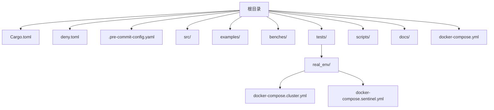
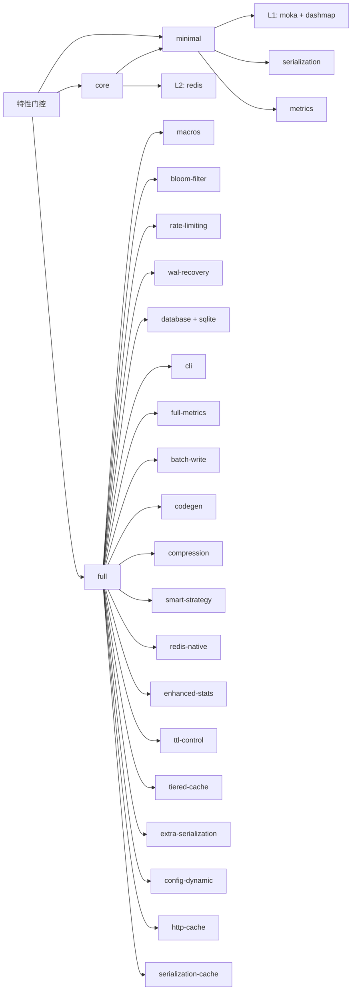
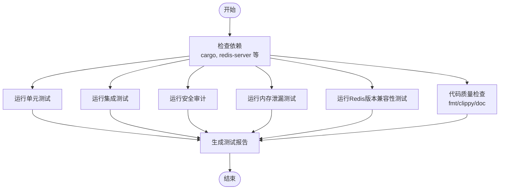
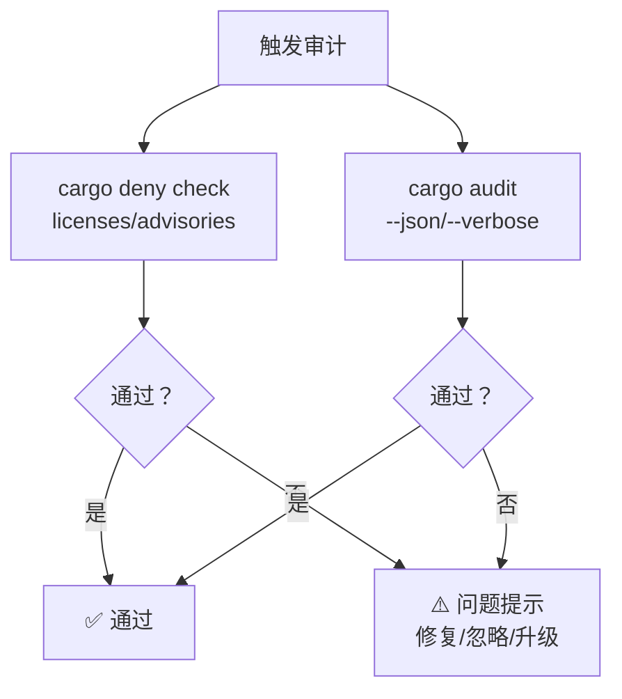
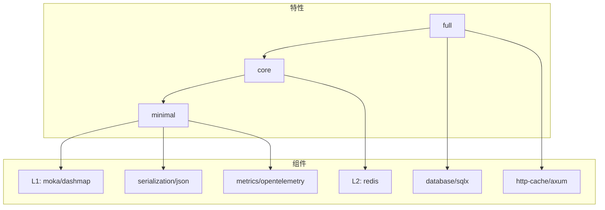

# 构建与发布

<cite>
**本文引用的文件**
- [Cargo.toml](file://Cargo.toml)
- [README.md](file://README.md)
- [deny.toml](file://deny.toml)
- [.pre-commit-config.yaml](file://.pre-commit-config.yaml)
- [scripts/precommit_clippy.sh](file://scripts/precommit_clippy.sh)
- [scripts/precommit_tests.sh](file://scripts/precommit_tests.sh)
- [scripts/run_all_tests.sh](file://scripts/run_all_tests.sh)
- [scripts/security_audit.sh](file://scripts/security_audit.sh)
- [scripts/validate-feature-combinations.sh](file://scripts/validate-feature-combinations.sh)
- [scripts/validate_docs.sh](file://scripts/validate_docs.sh)
- [scripts/precommit_deny.sh](file://scripts/precommit_deny.sh)
- [scripts/precommit_license.sh](file://scripts/precommit_license.sh)
- [docker-compose.yml](file://docker-compose.yml)
- [tests/real_env/docker-compose.cluster.yml](file://tests/real_env/docker-compose.cluster.yml)
- [tests/real_env/docker-compose.sentinel.yml](file://tests/real_env/docker-compose.sentinel.yml)
</cite>

## 目录
1. [简介](#简介)
2. [项目结构](#项目结构)
3. [核心组件](#核心组件)
4. [架构总览](#架构总览)
5. [详细组件分析](#详细组件分析)
6. [依赖关系分析](#依赖关系分析)
7. [性能考量](#性能考量)
8. [故障排查指南](#故障排查指南)
9. [结论](#结论)
10. [附录](#附录)

## 简介
本文件系统性阐述 Oxcache 项目的构建流程与发布管理，覆盖 Cargo 构建配置（依赖管理、特性门控、版本控制）、构建脚本（预提交检查、测试执行、许可证与安全审计）、发布流程（版本标记、变更日志、包发布）、持续集成与自动化测试策略、依赖许可证与安全审计流程，以及本地构建与发布的完整指南（含特性组合测试与验证），并介绍文档生成与发布流程。

## 项目结构
Oxcache 采用标准 Rust 工程布局，核心目录与文件如下：
- 根级配置：Cargo.toml（包元数据、依赖、特性、编译配置）、deny.toml（许可证与安全策略）、README.md（用户指南与特性说明）、.pre-commit-config.yaml（本地预提交钩子）
- 源码与模块：src/ 下按功能域划分（backend、builder、client、config、database、http、metrics、recovery、security、serialization、sync、traits、utils 等）
- 示例与基准：examples/、benches/（包含缓存、现代 API、Redis 基准）
- 测试与真实环境：tests/（单元、集成、端到端、混沌、跨数据库、分区、安全等）与 tests/real_env/（Redis 集群/哨兵环境）
- 脚本与工具：scripts/（预提交与综合测试、安全审计、特性组合验证、文档校验、Redis 性能/故障演练等）
- 文档：docs/（用户指南、架构、序列化、HTTP 缓存、安全、性能报告等）

**图表来源**
- [Cargo.toml](file://Cargo.toml#L1-L377)
- [deny.toml](file://deny.toml#L1-L39)
- [.pre-commit-config.yaml](file://.pre-commit-config.yaml#L1-L129)
- [docker-compose.yml](file://docker-compose.yml)
- [tests/real_env/docker-compose.cluster.yml](file://tests/real_env/docker-compose.cluster.yml)
- [tests/real_env/docker-compose.sentinel.yml](file://tests/real_env/docker-compose.sentinel.yml)

**章节来源**
- [Cargo.toml](file://Cargo.toml#L1-L377)
- [README.md](file://README.md#L1-L414)
- [.pre-commit-config.yaml](file://.pre-commit-config.yaml#L1-L129)

## 核心组件
- 包与特性体系
  - 包元数据：名称、版本、描述、仓库、关键字、分类、许可证等
  - 特性门控：minimal、core、full 三层特性集，以及细粒度组件特性（如 moka、redis、serialization、metrics、database、http-cache、cli、codegen 等）
  - 编译优化：release/profile 配置（LTO、单代码生成单元、panic=abort、strip、溢出检查关闭等）
- 依赖管理
  - 核心运行时：tokio、async-trait、lazy_static、once_cell
  - 序列化与压缩：serde、serde_json、flate2、bincode、rmp-serde、ciborium、md5
  - 观测性：opentelemetry、opentelemetry_sdk、tracing-opentelemetry、opentelemetry-otlp、tracing-subscriber
  - 数据库：sea-orm、sqlx（SQLite、runtime-tokio-rustls、macros、migrate）
  - Redis：redis（禁用默认特性，启用 aio、tokio-comp、cluster-async、sentinel、connection-manager、script）
  - L1 缓存：moka（禁用默认特性，启用 future）、dashmap
  - HTTP 支持：http、tower、axum、hyper、http-body-util
  - 工具：uuid、secrecy、regex、chrono、futures、tokio-util、clap、confers、bloomfilter、murmur3
- 开发与构建依赖：criterion、mockall、tempfile、serial_test、rand、ctor、anyhow（build-dependencies）
- 基准：[[bench]] cache_benchmark

**章节来源**
- [Cargo.toml](file://Cargo.toml#L1-L377)

## 架构总览
下图展示 Oxcache 的特性门控与依赖关系在构建阶段的映射，体现“特性 → 组件 → 依赖”的装配路径。

**图表来源**
- [Cargo.toml](file://Cargo.toml#L235-L346)

**章节来源**
- [Cargo.toml](file://Cargo.toml#L235-L346)

## 详细组件分析

### 构建与特性门控
- 特性层级
  - minimal：启用 L1（moka + dashmap）、tracing、metrics、serialization、chrono
  - core：minimal + redis + futures
  - full：core + 全量高级特性（宏、布隆过滤、限流、WAL、数据库、CLI、指标、批写、代码生成、压缩、智能策略、Redis 原生、增强统计、TTL 控制、两级缓存、额外序列化、动态配置、HTTP 缓存、序列化缓存）
- 组件特性
  - moka/dashmap-backend：L1 实现
  - redis：L2 实现
  - serialization/bincode/compression：序列化与压缩
  - opentelemetry/metrics/full-metrics：可观测性
  - database/sqlite：数据库集成
  - bloom-filter：缓存穿透防护
  - rate-limiting/wal-recovery：可靠性与安全
  - batch-write/ttl-control/redis-native/smart-strategy：高级能力
  - cli/confers：命令行与配置
  - http-cache/serialization-cache：HTTP 缓存与序列化缓存
- 编译配置
  - release：opt-level=3、LTO=fat、codegen-units=1、panic=abort、strip=true、overflow-checks=false
  - dev：debug=true
  - test：opt-level=0
  - 基准：cache_benchmark

**章节来源**
- [Cargo.toml](file://Cargo.toml#L235-L377)

### 本地构建与测试
- 快速构建与检查
  - cargo check（编译检查）
  - cargo fmt（格式化检查）
  - cargo clippy（静态分析，-D warnings）
  - cargo test（单元/集成/文档测试）
- 预提交钩子
  - Rust 格式化（cargo fmt）
  - Clippy（scripts/precommit_clippy.sh）
  - 快速测试（scripts/precommit_tests.sh）
  - 依赖审计（cargo deny check）
  - 安全扫描（cargo audit）
  - 许可证合规（cargo deny check licenses）
  - TOML 校验（scripts/precommit_toml.sh）
  - 秘密扫描（detect-secrets）
- 综合测试运行器（scripts/run_all_tests.sh）
  - 单元测试、集成测试、安全审计、内存泄漏测试、Redis 版本兼容性测试、代码质量检查（格式化、Clippy、文档生成）
  - 生成测试报告（test_report.md）
- 特性组合验证（scripts/validate-feature-combinations.sh）
  - 验证 Tier1（minimal/core/full）与 Tier2 组合（如 moka,redis,metrics 等）
  - 可选快速模式（仅编译检查）
  - 生成特性组合测试报告
- 文档验证（scripts/validate_docs.sh）
  - 示例代码编译
  - 文档格式与链接检查
  - 代码块语法检查

**图表来源**
- [scripts/run_all_tests.sh](file://scripts/run_all_tests.sh#L94-L261)

**章节来源**
- [scripts/precommit_clippy.sh](file://scripts/precommit_clippy.sh#L1-L63)
- [scripts/precommit_tests.sh](file://scripts/precommit_tests.sh#L1-L52)
- [scripts/run_all_tests.sh](file://scripts/run_all_tests.sh#L1-L388)
- [scripts/validate-feature-combinations.sh](file://scripts/validate-feature-combinations.sh#L1-L274)
- [scripts/validate_docs.sh](file://scripts/validate_docs.sh#L1-L118)

### 依赖许可证与安全审计
- 许可证策略（deny.toml）
  - 允许清单：MIT、Apache-2.0、BSD、ISC、Unicode、Zlib、CDLA、CC0、MPL 等
  - 最低置信度阈值：0.8
  - 禁止未知来源与未知 Git 源
- 安全审计（cargo-deny）
  - 预提交钩子：scripts/precommit_deny.sh
  - CI 中可配合 .pre-commit-config.yaml 使用 ghaction-deny
- 安全漏洞扫描（cargo-audit）
  - scripts/security_audit.sh：支持 JSON/人类可读输出、忽略特定 advisory、离线模式、生成摘要报告
  - 预提交钩子：scripts/precommit_audit.sh
- 许可证合规
  - scripts/precommit_license.sh：基于 cargo deny check licenses
  - deny.toml 中可配置例外与忽略列表

**图表来源**
- [deny.toml](file://deny.toml#L1-L39)
- [scripts/precommit_deny.sh](file://scripts/precommit_deny.sh#L1-L49)
- [scripts/precommit_license.sh](file://scripts/precommit_license.sh#L1-L52)
- [scripts/security_audit.sh](file://scripts/security_audit.sh#L1-L401)

**章节来源**
- [deny.toml](file://deny.toml#L1-L39)
- [.pre-commit-config.yaml](file://.pre-commit-config.yaml#L46-L78)
- [scripts/precommit_deny.sh](file://scripts/precommit_deny.sh#L1-L49)
- [scripts/precommit_license.sh](file://scripts/precommit_license.sh#L1-L52)
- [scripts/security_audit.sh](file://scripts/security_audit.sh#L1-L401)

### 持续集成与自动化测试策略
- 预提交钩子（.pre-commit-config.yaml）
  - Rust 工具链：fmt、clippy、fast tests
  - 依赖审计：cargo-deny
  - 安全扫描：cargo-audit
  - 许可证检查：cargo deny check licenses
  - 秘密扫描：detect-secrets
  - 配置校验：TOML 校验
- CI 策略建议
  - 在 CI 中运行完整测试套件（单元、集成、安全、内存、Redis 兼容性）
  - 定期运行 cargo audit 与 cargo deny
  - 对不同特性组合进行矩阵构建与测试（参考 validate-feature-combinations.sh）
  - 生成并归档测试报告与覆盖率

**章节来源**
- [.pre-commit-config.yaml](file://.pre-commit-config.yaml#L1-L129)

### 本地构建与发布完整指南
- 本地构建
  - 安装依赖：Rust 工具链、cargo、redis-server（可选）
  - 编译检查：cargo check
  - 格式化：cargo fmt --check
  - 静态分析：cargo clippy -- -D warnings
  - 单元测试：cargo test --lib
  - 集成测试：cargo test --test '*'
  - 文档生成：cargo doc --no-deps
- 特性组合测试
  - 快速验证：scripts/validate-feature-combinations.sh --quick
  - 全量验证：scripts/validate-feature-combinations.sh --all
  - 自定义组合：scripts/validate-feature-combinations.sh --features "moka,redis,metrics"
  - 生成报告：scripts/validate-feature-combinations.sh --all --report
- 安全与许可证
  - 依赖审计：cargo deny check
  - 安全扫描：cargo audit 或 scripts/security_audit.sh
  - 许可证合规：cargo deny check licenses
- 文档校验
  - scripts/validate_docs.sh：示例编译、文档格式、链接、代码块检查
- 发布准备
  - 更新版本：Cargo.toml 中 version 字段
  - 生成变更日志：根据提交记录维护 CHANGELOG.md
  - 本地打包：cargo package
  - 上传发布：cargo publish（确保 registry 配置正确）
- 发布后验证
  - CI 自动化测试与安全扫描
  - 本地安装验证：cargo install oxcache --version <new_version>

**章节来源**
- [Cargo.toml](file://Cargo.toml#L1-L377)
- [README.md](file://README.md#L1-L414)
- [scripts/validate-feature-combinations.sh](file://scripts/validate-feature-combinations.sh#L1-L274)
- [scripts/security_audit.sh](file://scripts/security_audit.sh#L1-L401)
- [scripts/validate_docs.sh](file://scripts/validate_docs.sh#L1-L118)

### 文档生成与发布流程
- 文档内容
  - 用户指南、API 参考、架构设计、序列化、HTTP 缓存、安全、性能报告等
- 生成与校验
  - 生成：cargo doc --no-deps
  - 校验：scripts/validate_docs.sh（示例编译、格式、链接、代码块）
- 发布
  - 通过 docs.rs 自动发布 API 文档（根目录配置已启用 docs.rs badge）
  - 本地生成后可部署至静态站点或 GitHub Pages

**章节来源**
- [README.md](file://README.md#L387-L391)
- [scripts/validate_docs.sh](file://scripts/validate_docs.sh#L1-L118)

## 依赖关系分析
- 依赖分类与用途
  - 运行时：tokio、async-trait、lazy_static、once_cell
  - 序列化与压缩：serde、serde_json、bincode、rmp-serde、ciborium、md5、flate2
  - 观测性：opentelemetry、opentelemetry_sdk、tracing-opentelemetry、opentelemetry-otlp、tracing-subscriber
  - 数据库：sea-orm、sqlx（SQLite、runtime-tokio-rustls、macros、migrate）
  - Redis：redis（禁用默认特性，启用 aio、tokio-comp、cluster-async、sentinel、connection-manager、script）
  - L1 缓存：moka（禁用默认特性，启用 future）、dashmap
  - HTTP：http、tower、axum、hyper、http-body-util
  - 工具：uuid、secrecy、regex、chrono、futures、tokio-util、clap、confers、bloomfilter、murmur3
- 特性到依赖映射
  - minimal → moka、dashmap、tracing、metrics、serialization、chrono
  - core → minimal + redis + futures
  - full → core + 所有高级特性（宏、布隆过滤、限流、WAL、数据库、CLI、指标、批写、代码生成、压缩、智能策略、Redis 原生、增强统计、TTL 控制、两级缓存、额外序列化、动态配置、HTTP 缓存、序列化缓存）

**图表来源**
- [Cargo.toml](file://Cargo.toml#L235-L346)

**章节来源**
- [Cargo.toml](file://Cargo.toml#L20-L186)

## 性能考量
- 编译优化
  - release：LTO=fat、单代码生成单元、panic=abort、strip=true、溢出检查关闭
  - 依赖统一优化：profile.release.package."*" opt-level=3
- 运行时优化
  - L1：moka（future 特性）+ dashmap
  - L2：redis（aio、tokio-comp、cluster-async、sentinel、connection-manager、script）
  - 批处理：batch-write（tokio-util）
  - 智能策略：smart-strategy（compression、metrics、moka）
- 基准测试
  - benches/ 包含 cache_benchmark、modern_api_benchmark、redis_benchmark
  - 综合测试运行器可运行性能相关测试

**章节来源**
- [Cargo.toml](file://Cargo.toml#L352-L377)
- [benches/cache_benchmark.rs](file://benches/cache_benchmark.rs)
- [benches/modern_api_benchmark.rs](file://benches/modern_api_benchmark.rs)
- [benches/redis_benchmark.rs](file://benches/redis_benchmark.rs)
- [scripts/run_all_tests.sh](file://scripts/run_all_tests.sh#L114-L136)

## 故障排查指南
- 预提交失败
  - 格式化：cargo fmt --check；修复后重新提交
  - Clippy：scripts/precommit_clippy.sh 提供自动修复与问题分类
  - 快速测试：scripts/precommit_tests.sh 提供调试步骤
  - 依赖审计：scripts/precommit_deny.sh 与 scripts/precommit_license.sh 提供修复建议
  - 安全扫描：scripts/security_audit.sh 支持离线模式与忽略特定 advisory
- 综合测试失败
  - scripts/run_all_tests.sh 生成详细日志与测试报告，定位失败模块
  - 内存泄漏：scripts/memory_test.sh
  - Redis 兼容性：scripts/redis_perf_test.sh、scripts/test_redis_failover.sh
- 特性组合问题
  - scripts/validate-feature-combinations.sh：快速编译检查与报告生成
- 文档问题
  - scripts/validate_docs.sh：示例编译、链接与格式检查

**章节来源**
- [scripts/precommit_clippy.sh](file://scripts/precommit_clippy.sh#L1-L63)
- [scripts/precommit_tests.sh](file://scripts/precommit_tests.sh#L1-L52)
- [scripts/precommit_deny.sh](file://scripts/precommit_deny.sh#L1-L49)
- [scripts/precommit_license.sh](file://scripts/precommit_license.sh#L1-L52)
- [scripts/security_audit.sh](file://scripts/security_audit.sh#L1-L401)
- [scripts/run_all_tests.sh](file://scripts/run_all_tests.sh#L1-L388)
- [scripts/validate-feature-combinations.sh](file://scripts/validate-feature-combinations.sh#L1-L274)
- [scripts/validate_docs.sh](file://scripts/validate_docs.sh#L1-L118)

## 结论
Oxcache 通过完善的 Cargo 特性门控与依赖管理、严格的预提交与综合测试流程、以及系统化的安全与许可证审计，构建了高可靠、高性能且易于扩展的两层缓存库。结合本地与 CI 的自动化测试与文档校验，能够稳定支撑从开发到发布的全流程。

## 附录
- 真实环境与 Redis 集成
  - docker-compose.yml：通用开发环境
  - tests/real_env/docker-compose.cluster.yml：Redis 集群
  - tests/real_env/docker-compose.sentinel.yml：Redis 哨兵
- 示例与基准
  - examples/：基础与高级示例
  - benches/：缓存、现代 API、Redis 基准
- 文档与报告
  - docs/：用户指南、架构、序列化、HTTP 缓存、安全、性能报告等
  - 各类测试报告与摘要（test_report.md、feature-combinations-report.md 等）

**章节来源**
- [docker-compose.yml](file://docker-compose.yml)
- [tests/real_env/docker-compose.cluster.yml](file://tests/real_env/docker-compose.cluster.yml)
- [tests/real_env/docker-compose.sentinel.yml](file://tests/real_env/docker-compose.sentinel.yml)
- [README.md](file://README.md#L387-L391)
