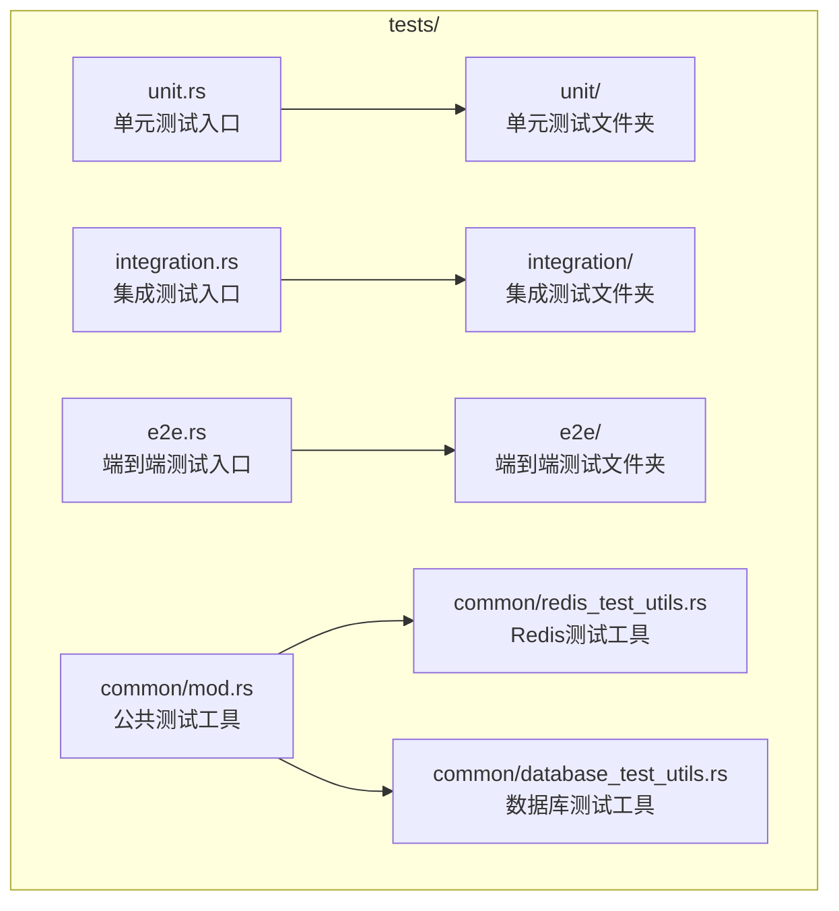
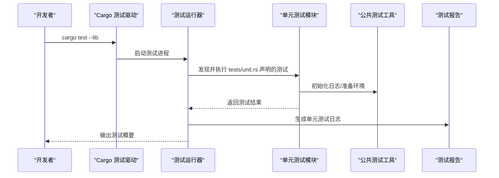
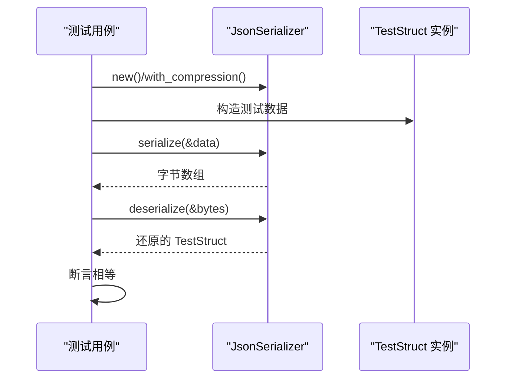
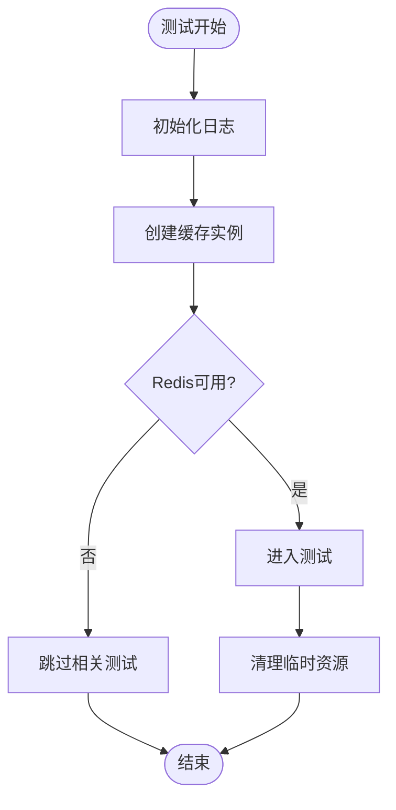
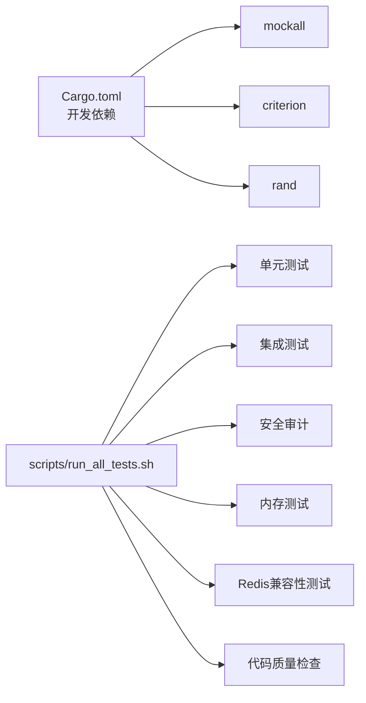

# 单元测试

<cite>
**本文引用的文件**
- [Cargo.toml](file://Cargo.toml)
- [tests/unit.rs](file://tests/unit.rs)
- [tests/unit/serialization_test.rs](file://tests/unit/serialization_test.rs)
- [tests/TEST_CATEGORIES.md](file://tests/TEST_CATEGORIES.md)
- [tests/common/mod.rs](file://tests/common/mod.rs)
- [tests/common/redis_test_utils.rs](file://tests/common/redis_test_utils.rs)
- [tests/common/database_test_utils.rs](file://tests/common/database_test_utils.rs)
- [tests/test_utils.rs](file://tests/test_utils.rs)
- [tests/integration.rs](file://tests/integration.rs)
- [scripts/run_all_tests.sh](file://scripts/run_all_tests.sh)
</cite>

## 目录
1. [简介](#简介)
2. [项目结构](#项目结构)
3. [核心组件](#核心组件)
4. [架构总览](#架构总览)
5. [详细组件分析](#详细组件分析)
6. [依赖分析](#依赖分析)
7. [性能考虑](#性能考虑)
8. [故障排查指南](#故障排查指南)
9. [结论](#结论)
10. [附录](#附录)

## 简介
本章节概述 Oxcache 项目的单元测试目标与范围，明确单元测试在整体测试金字塔中的定位，并总结当前仓库中单元测试的覆盖情况与扩展方向。

- 目标与范围
  - 单元测试聚焦“最小可测单元”，验证独立函数、结构体、模块内部行为与边界条件，确保核心逻辑稳定可靠。
  - 当前仓库中单元测试主要覆盖序列化子系统，后续可扩展至缓存接口、键生成、错误处理、工具函数等模块。
- 与其他测试层级的关系
  - 单元测试位于最底层，集成测试验证组件交互，端到端测试覆盖完整用户场景，性能/安全/混沌测试保障系统鲁棒性。

**章节来源**
- [tests/TEST_CATEGORIES.md](file://tests/TEST_CATEGORIES.md#L1-L177)

## 项目结构
Oxcache 的测试组织采用按“功能域+测试类型”分层的目录结构，便于定位与维护。单元测试集中于 tests/unit/ 目录，通过 tests/unit.rs 汇总模块声明；公共测试工具位于 tests/common/，提供日志、Redis/数据库连接辅助等。

**图表来源**
- [tests/unit.rs](file://tests/unit.rs#L1-L12)
- [tests/integration.rs](file://tests/integration.rs#L1-L62)
- [tests/common/mod.rs](file://tests/common/mod.rs#L1-L184)

**章节来源**
- [tests/unit.rs](file://tests/unit.rs#L1-L12)
- [tests/integration.rs](file://tests/integration.rs#L1-L62)
- [tests/common/mod.rs](file://tests/common/mod.rs#L1-L184)

## 核心组件
- 单元测试入口模块 tests/unit.rs
  - 通过 #[path = "..."] 属性声明单元测试文件，当前仅包含序列化测试模块。
- 序列化单元测试 tests/unit/serialization_test.rs
  - 验证 JSON 序列化器的往返一致性与压缩功能，覆盖基本数据结构的序列化/反序列化路径。
- 公共测试工具 tests/common/mod.rs
  - 提供统一的日志初始化、缓存创建、Redis/数据库可用性检测与等待、资源清理等能力。
- Redis/数据库测试工具
  - tests/common/redis_test_utils.rs：封装 Redis 连接与简单读写校验。
  - tests/common/database_test_utils.rs：封装分区管理、并发分区操作、保留期清理等数据库测试常用流程。

**章节来源**
- [tests/unit.rs](file://tests/unit.rs#L1-L12)
- [tests/unit/serialization_test.rs](file://tests/unit/serialization_test.rs#L1-L52)
- [tests/common/mod.rs](file://tests/common/mod.rs#L1-L184)
- [tests/common/redis_test_utils.rs](file://tests/common/redis_test_utils.rs#L1-L77)
- [tests/common/database_test_utils.rs](file://tests/common/database_test_utils.rs#L1-L254)

## 架构总览
单元测试运行与组织的总体流程如下：

**图表来源**
- [scripts/run_all_tests.sh](file://scripts/run_all_tests.sh#L94-L112)
- [tests/unit.rs](file://tests/unit.rs#L1-L12)
- [tests/common/mod.rs](file://tests/common/mod.rs#L18-L40)

## 详细组件分析

### 序列化单元测试
- 测试目标
  - 验证 JsonSerializer 的序列化/反序列化往返一致性。
  - 验证启用压缩后的数据体积与正确性。
- 关键断言
  - 结构体字段完全相等。
  - 压缩后仍能正确还原。
- 可扩展点
  - 增加更多数据类型（Option、Vec、HashMap）的往返测试。
  - 增加边界值与异常路径（非法字节流、损坏数据）测试。
  - 增加不同序列化器（如 bincode、MessagePack）的对比测试。

**图表来源**
- [tests/unit/serialization_test.rs](file://tests/unit/serialization_test.rs#L17-L51)

**章节来源**
- [tests/unit/serialization_test.rs](file://tests/unit/serialization_test.rs#L1-L52)

### 公共测试工具与环境准备
- 日志初始化
  - 通过 Once 全局初始化 tracing_subscriber，统一输出格式与级别。
- 缓存创建
  - 提供默认内存缓存实例创建的便捷方法，便于单元测试直接使用。
- Redis/数据库可用性检测
  - 提供等待与连接检查工具，简化集成测试前置条件。
- 资源清理
  - 提供 WAL/数据库文件清理方法，避免测试间污染。

**图表来源**
- [tests/common/mod.rs](file://tests/common/mod.rs#L18-L40)
- [tests/test_utils.rs](file://tests/test_utils.rs#L27-L48)
- [tests/common/redis_test_utils.rs](file://tests/common/redis_test_utils.rs#L68-L76)

**章节来源**
- [tests/common/mod.rs](file://tests/common/mod.rs#L1-L184)
- [tests/test_utils.rs](file://tests/test_utils.rs#L1-L122)
- [tests/common/redis_test_utils.rs](file://tests/common/redis_test_utils.rs#L1-L77)

## 依赖分析
- 开发依赖
  - mockall：用于构造 mock 对象，模拟外部依赖或 L2 后端。
  - criterion：基准测试（benchmark），可用于性能回归测试。
  - rand、serial_test：随机性与串行化测试辅助。
- 特性开关
  - 单元测试通常在默认特性集下运行；若需测试特定功能（如 Redis、序列化器），可通过特性组合验证。
- 测试运行器
  - scripts/run_all_tests.sh 提供统一的测试编排，包含单元测试、集成测试、安全审计、内存测试、Redis 兼容性测试与代码质量检查。

**图表来源**
- [Cargo.toml](file://Cargo.toml#L216-L222)
- [scripts/run_all_tests.sh](file://scripts/run_all_tests.sh#L94-L136)

**章节来源**
- [Cargo.toml](file://Cargo.toml#L216-L222)
- [scripts/run_all_tests.sh](file://scripts/run_all_tests.sh#L94-L136)

## 性能考虑
- 单元测试应保持轻量与快速，避免引入外部依赖或长时间阻塞。
- 若需性能回归测试，建议使用基准测试（benchmark）而非普通单元测试。
- 对于序列化/反序列化的性能敏感路径，可在基准测试中进行对比。

[本节为通用指导，无需具体文件引用]

## 故障排查指南
- 单元测试失败定位
  - 使用 -- --nocapture 输出所有日志，结合 tests/common/mod.rs 的日志初始化确认输出。
  - 检查是否因 Redis/数据库不可用导致测试跳过或失败。
- 环境问题
  - 确认 Redis 可用性检测逻辑与环境变量（如 OXCACHE_SKIP_REDIS_TESTS、REDIS_URL）。
  - 数据库测试注意 SQL 注入防护与表名合法性校验。
- 资源清理
  - 使用 tests/test_utils.rs 中的清理函数，避免残留文件影响后续测试。

**章节来源**
- [tests/common/mod.rs](file://tests/common/mod.rs#L41-L50)
- [tests/common/database_test_utils.rs](file://tests/common/database_test_utils.rs#L57-L63)
- [tests/test_utils.rs](file://tests/test_utils.rs#L114-L121)

## 结论
- 当前单元测试以序列化为核心，覆盖基本往返与压缩场景，具备良好的起点。
- 建议逐步扩展到缓存接口、键生成、错误处理、工具函数等模块，形成更全面的单元测试矩阵。
- 通过公共测试工具与统一运行器，提升测试稳定性与可维护性。

[本节为总结性内容，无需具体文件引用]

## 附录

### 单元测试编写指南
- 测试用例设计原则
  - 每个测试只验证一个行为或边界条件。
  - 使用最小化输入与可预测的期望值。
  - 对异常路径进行显式断言。
- 断言方法
  - 使用标准断言（相等、包含、抛错等）。
  - 对复杂结构使用结构化断言，避免忽略字段。
- Mock 对象使用
  - 使用 mockall 构造外部依赖的替身，隔离被测单元。
  - 对关键接口进行行为验证（调用次数、参数匹配）。
- 运行与调试
  - 使用 cargo test --lib 运行单元测试，配合 -- --nocapture 查看输出。
  - 通过 scripts/run_all_tests.sh 统一运行与生成报告。
- 最佳实践与常见模式
  - 将公共逻辑抽取到 tests/common/，复用日志、连接、清理等工具。
  - 对外部依赖（Redis/数据库）增加可用性检测与等待逻辑。
  - 为每个功能域建立清晰的测试文件与模块划分。

**章节来源**
- [tests/TEST_CATEGORIES.md](file://tests/TEST_CATEGORIES.md#L112-L177)
- [scripts/run_all_tests.sh](file://scripts/run_all_tests.sh#L94-L112)
- [tests/common/mod.rs](file://tests/common/mod.rs#L18-L40)
