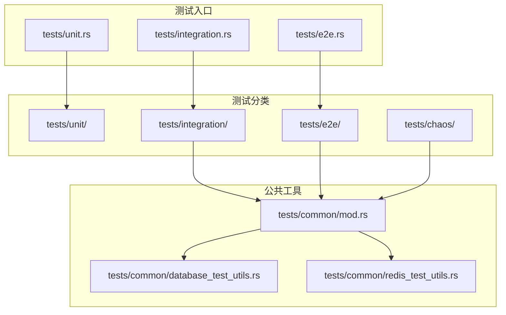
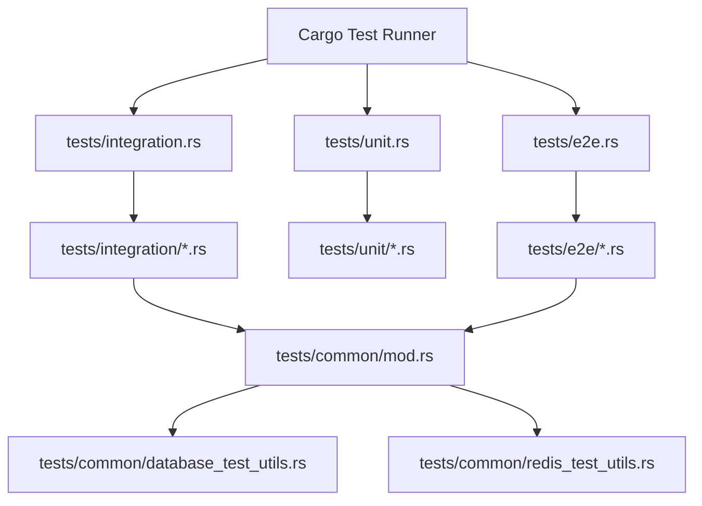
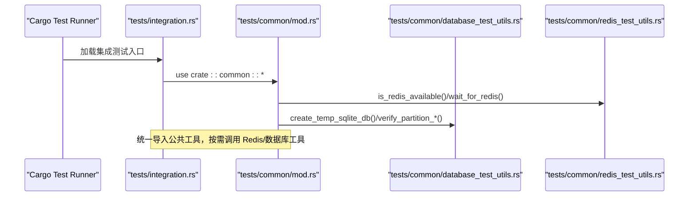
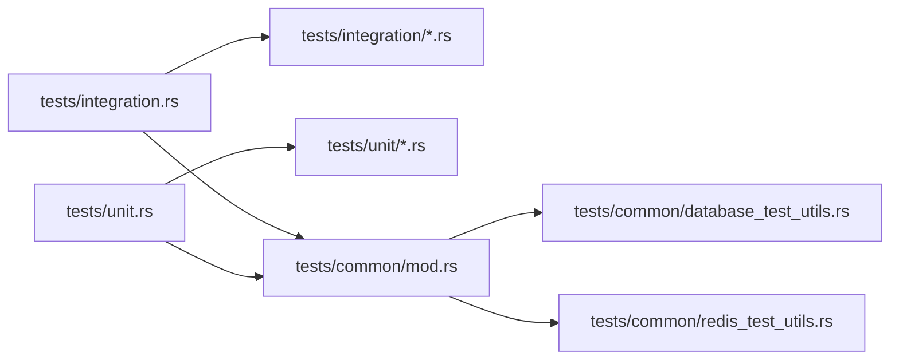

# 测试分类与组织

<cite>
**本文引用的文件**
- [tests/README.md](file://tests/README.md)
- [tests/TEST_CATEGORIES.md](file://tests/TEST_CATEGORIES.md)
- [tests/integration.rs](file://tests/integration.rs)
- [tests/unit.rs](file://tests/unit.rs)
- [tests/common/mod.rs](file://tests/common/mod.rs)
- [tests/common/database_test_utils.rs](file://tests/common/database_test_utils.rs)
- [tests/common/redis_test_utils.rs](file://tests/common/redis_test_utils.rs)
- [tests/test_config.toml](file://tests/test_config.toml)
- [tests/integration/comprehensive_test.rs](file://tests/integration/comprehensive_test.rs)
- [tests/chaos/random_failure_test.rs](file://tests/chaos/random_failure_test.rs)
- [tests/e2e/macro_test.rs](file://tests/e2e/macro_test.rs)
- [tests/unit/serialization_test.rs](file://tests/unit/serialization_test.rs)
</cite>

## 目录
1. [简介](#简介)
2. [项目结构](#项目结构)
3. [核心组件](#核心组件)
4. [架构总览](#架构总览)
5. [详细组件分析](#详细组件分析)
6. [依赖关系分析](#依赖关系分析)
7. [性能考虑](#性能考虑)
8. [故障排查指南](#故障排查指南)
9. [结论](#结论)
10. [附录](#附录)

## 简介
本文件系统性阐述 Oxcache 项目的测试分类体系与组织结构，重点说明以下内容：
- 测试目录结构：tests/unit（单元测试）、tests/integration（集成测试）、tests/e2e（端到端测试）、tests/chaos（混沌工程测试）的职责与覆盖范围
- 测试工具与辅助模块：database_test_utils.rs、redis_test_utils.rs 等通用测试工具的使用方法
- 测试配置文件 test_config.toml 的作用与配置项
- 测试运行环境的搭建与依赖管理

## 项目结构
Oxcache 的测试子系统采用“按类别分层 + 按功能分组”的组织方式，配合统一的入口模块与公共工具，形成清晰可维护的测试体系。

图表来源
- [tests/integration.rs](file://tests/integration.rs#L1-L62)
- [tests/unit.rs](file://tests/unit.rs#L1-L12)
- [tests/common/mod.rs](file://tests/common/mod.rs#L1-L184)
- [tests/common/database_test_utils.rs](file://tests/common/database_test_utils.rs#L1-L254)
- [tests/common/redis_test_utils.rs](file://tests/common/redis_test_utils.rs#L1-L77)

章节来源
- [tests/README.md](file://tests/README.md#L1-L214)
- [tests/TEST_CATEGORIES.md](file://tests/TEST_CATEGORIES.md#L1-L177)
- [tests/integration.rs](file://tests/integration.rs#L1-L62)
- [tests/unit.rs](file://tests/unit.rs#L1-L12)

## 核心组件
- 测试入口模块
  - tests/integration.rs：集中声明并组织所有集成测试模块，便于统一运行与维护
  - tests/unit.rs：集中声明单元测试模块
- 公共测试工具
  - tests/common/mod.rs：提供日志初始化、缓存初始化、Redis 可用性检测、等待可用、唯一服务名生成、资源清理等通用能力
  - tests/common/database_test_utils.rs：提供分区配置、表清理、并发分区操作、保留期清理等数据库测试工具
  - tests/common/redis_test_utils.rs：提供 Redis 连接测试、可用性检测、键清理等 Redis 测试工具
- 配置文件
  - tests/test_config.toml：用于数据库分区测试的配置，包含数据库连接串与分区策略参数

章节来源
- [tests/integration.rs](file://tests/integration.rs#L1-L62)
- [tests/unit.rs](file://tests/unit.rs#L1-L12)
- [tests/common/mod.rs](file://tests/common/mod.rs#L1-L184)
- [tests/common/database_test_utils.rs](file://tests/common/database_test_utils.rs#L1-L254)
- [tests/common/redis_test_utils.rs](file://tests/common/redis_test_utils.rs#L1-L77)
- [tests/test_config.toml](file://tests/test_config.toml#L1-L32)

## 架构总览
测试体系围绕“入口模块 + 公共工具 + 分类目录”的结构展开，测试文件通过路径属性组织，入口模块统一聚合，公共工具提供跨测试复用的能力。

图表来源
- [tests/integration.rs](file://tests/integration.rs#L1-L62)
- [tests/unit.rs](file://tests/unit.rs#L1-L12)
- [tests/common/mod.rs](file://tests/common/mod.rs#L1-L184)
- [tests/common/database_test_utils.rs](file://tests/common/database_test_utils.rs#L1-L254)
- [tests/common/redis_test_utils.rs](file://tests/common/redis_test_utils.rs#L1-L77)

## 详细组件分析

### 测试分类与职责
- 单元测试（tests/unit）
  - 职责：验证单个模块或组件的内部逻辑，通常不依赖外部服务
  - 示例：序列化功能测试
- 集成测试（tests/integration）
  - 职责：验证多组件协作行为，常依赖 Redis、数据库等外部服务
  - 示例：综合功能测试、双层缓存、Redis 集成、生命周期管理、指标收集、性能测试、故障恢复等
- 端到端测试（tests/e2e）
  - 职责：模拟真实用户场景，验证完整请求/响应链路
  - 示例：宏端到端测试，覆盖基本缓存操作、结构体缓存、批量操作
- 混沌工程测试（tests/chaos）
  - 职责：在不稳定环境下评估系统的韧性与恢复能力
  - 示例：随机故障测试，验证在 Redis 不稳定时的稳定性与恢复

章节来源
- [tests/README.md](file://tests/README.md#L88-L155)
- [tests/TEST_CATEGORIES.md](file://tests/TEST_CATEGORIES.md#L63-L111)

### 入口模块与组织方式
- tests/integration.rs：通过路径属性集中声明集成测试模块，便于统一运行与扩展
- tests/unit.rs：通过路径属性集中声明单元测试模块
- tests/common/mod.rs：作为公共模块入口，导出日志、缓存、Redis 可用性、等待、清理等工具

章节来源
- [tests/integration.rs](file://tests/integration.rs#L1-L62)
- [tests/unit.rs](file://tests/unit.rs#L1-L12)
- [tests/common/mod.rs](file://tests/common/mod.rs#L1-L184)

### 公共测试工具详解
- 日志与缓存初始化
  - setup_logging：初始化日志订阅器，按需只初始化一次
  - setup_cache：创建默认内存缓存实例，供测试使用
- Redis 可用性与等待
  - is_redis_available：基于环境变量判断是否跳过 Redis 测试
  - get_redis_url / get_redis_url_insecure：根据环境变量或特性选择安全/非安全 Redis URL
  - wait_for_redis / wait_for_redis_url / wait_for_redis_cluster / wait_for_sentinel：等待外部 Redis 服务可用
- 资源清理
  - generate_unique_service_name：生成带 UUID 的唯一服务名，保证测试隔离
  - cleanup_service：清理 WAL 与数据库文件

章节来源
- [tests/common/mod.rs](file://tests/common/mod.rs#L18-L184)

### 数据库测试工具
- TestConfig：从文件加载测试配置（PostgreSQL/MySQL 连接串、分区开关、策略、保留月数）
- create_partition_config：构造分区配置对象
- cleanup_postgres_table：校验表名后执行 Docker psql 清理命令
- create_temp_sqlite_db：创建临时 SQLite 文件并返回连接串
- verify_partition_creation / verify_partition_cleanup：验证分区创建与清理逻辑
- test_concurrent_partition_operations：并发分区操作测试

章节来源
- [tests/common/database_test_utils.rs](file://tests/common/database_test_utils.rs#L17-L254)

### Redis 测试工具
- create_redis_backend_with_real_redis：创建 RedisBackend 实例
- create_standalone_config / wait_for_redis / is_redis_available_default：连接与可用性辅助
- test_redis_connection：执行 SET/GET/DELETE 基本操作验证
- is_redis_available / cleanup_test_keys：可用性检测与键清理

章节来源
- [tests/common/redis_test_utils.rs](file://tests/common/redis_test_utils.rs#L16-L77)

### 测试配置文件 test_config.toml
- 作用：为数据库分区测试提供配置，包括 PostgreSQL/MySQL/SQLite 连接串与分区策略
- 关键配置项：
  - [database]：postgres_url、mysql_url、sqlite_path
  - [partitioning]：enabled、strategy（如 monthly）、retention_partitions
  - [partitioning.postgres] / [partitioning.mysql] / [partitioning.sqlite]：各数据库的分区天数

章节来源
- [tests/test_config.toml](file://tests/test_config.toml#L1-L32)

### 典型测试用例分析

#### 单元测试：序列化功能
- 目标：验证 JSON 序列化器的往返与压缩功能
- 方法：构造测试结构体，分别调用序列化与反序列化，断言相等性

章节来源
- [tests/unit/serialization_test.rs](file://tests/unit/serialization_test.rs#L1-L52)

#### 集成测试：综合功能
- 目标：验证新 Cache API 的基本操作（SET/GET/DELETE/CLEAR），以及不同数据类型的缓存
- 方法：逐项执行操作并断言结果；覆盖空键/空值/长键等边界情况

章节来源
- [tests/integration/comprehensive_test.rs](file://tests/integration/comprehensive_test.rs#L1-L139)

#### 端到端测试：宏端到端
- 目标：验证从创建缓存到基本操作再到批量操作的完整流程
- 方法：依次执行 SET/GET/DELETE，并对结构体与批量场景进行断言

章节来源
- [tests/e2e/macro_test.rs](file://tests/e2e/macro_test.rs#L1-L104)

#### 混沌工程测试：随机故障
- 目标：在不稳定 Redis 环境下验证缓存的稳定性与恢复能力
- 方法：执行 SET/GET/EXISTS/DELETE 等操作，验证并发访问与故障恢复后的正确性

章节来源
- [tests/chaos/random_failure_test.rs](file://tests/chaos/random_failure_test.rs#L1-L138)

### 测试运行流程（序列图）

图表来源
- [tests/integration.rs](file://tests/integration.rs#L1-L62)
- [tests/common/mod.rs](file://tests/common/mod.rs#L1-L184)
- [tests/common/database_test_utils.rs](file://tests/common/database_test_utils.rs#L1-L254)
- [tests/common/redis_test_utils.rs](file://tests/common/redis_test_utils.rs#L1-L77)

## 依赖关系分析
- 入口模块依赖公共模块：tests/integration.rs 与 tests/unit.rs 通过路径属性引入公共模块
- 公共模块依赖具体工具：common/mod.rs 统一导出 database_test_utils.rs 与 redis_test_utils.rs
- 测试文件依赖入口模块：集成测试通过 integration.rs 聚合，单元测试通过 unit.rs 聚合

图表来源
- [tests/integration.rs](file://tests/integration.rs#L1-L62)
- [tests/unit.rs](file://tests/unit.rs#L1-L12)
- [tests/common/mod.rs](file://tests/common/mod.rs#L1-L184)
- [tests/common/database_test_utils.rs](file://tests/common/database_test_utils.rs#L1-L254)
- [tests/common/redis_test_utils.rs](file://tests/common/redis_test_utils.rs#L1-L77)

章节来源
- [tests/integration.rs](file://tests/integration.rs#L1-L62)
- [tests/unit.rs](file://tests/unit.rs#L1-L12)
- [tests/common/mod.rs](file://tests/common/mod.rs#L1-L184)

## 性能考虑
- 测试运行建议
  - 使用入口模块统一运行：cargo test --test integration 或 cargo test --test unit
  - 跳过网络测试：cargo test --all-features -- --skip redis
  - 开启数据库测试：OXCACHE_TEST_DATABASE=1 cargo test
  - 开启 Redis 测试：cargo test --features redis
- 工具复用
  - 通过公共模块提供的等待与清理工具，减少重复代码，提升测试稳定性

章节来源
- [tests/README.md](file://tests/README.md#L156-L184)
- [tests/common/mod.rs](file://tests/common/mod.rs#L18-L184)

## 故障排查指南
- Redis 可用性问题
  - 检查环境变量：REDIS_URL、OXCACHE_ALLOW_INSECURE_REDIS、OXCACHE_SKIP_REDIS_TESTS
  - 使用等待工具：wait_for_redis / wait_for_redis_url / wait_for_redis_cluster / wait_for_sentinel
- 数据库分区问题
  - 校验表名格式：validate_table_name，防止 SQL 注入
  - 使用临时 SQLite：create_temp_sqlite_db
  - 验证分区创建与清理：verify_partition_creation / verify_partition_cleanup
- 资源清理
  - 使用 generate_unique_service_name 生成唯一服务名，避免冲突
  - 使用 cleanup_service 清理 WAL 与数据库文件

章节来源
- [tests/common/mod.rs](file://tests/common/mod.rs#L41-L184)
- [tests/common/database_test_utils.rs](file://tests/common/database_test_utils.rs#L55-L254)
- [tests/common/redis_test_utils.rs](file://tests/common/redis_test_utils.rs#L25-L77)

## 结论
Oxcache 的测试体系通过“入口模块 + 公共工具 + 分类目录”的结构实现了高内聚、低耦合的组织方式。公共工具统一抽象了日志、缓存、Redis 可用性与数据库分区等能力，既提升了测试复用性，也降低了测试编写成本。结合 test_config.toml 的配置化管理与丰富的运行选项，能够灵活适配不同环境与需求。

## 附录
- 测试运行速查
  - 运行所有测试：cargo test --all-features --workspace
  - 运行集成测试：cargo test --test integration
  - 运行端到端测试：cargo test --test e2e
  - 运行单元测试：cargo test --test unit
  - 跳过网络测试：cargo test --all-features -- --skip redis
  - 开启数据库测试：OXCACHE_TEST_DATABASE=1 cargo test
  - 开启 Redis 测试：cargo test --features redis

章节来源
- [tests/README.md](file://tests/README.md#L156-L184)