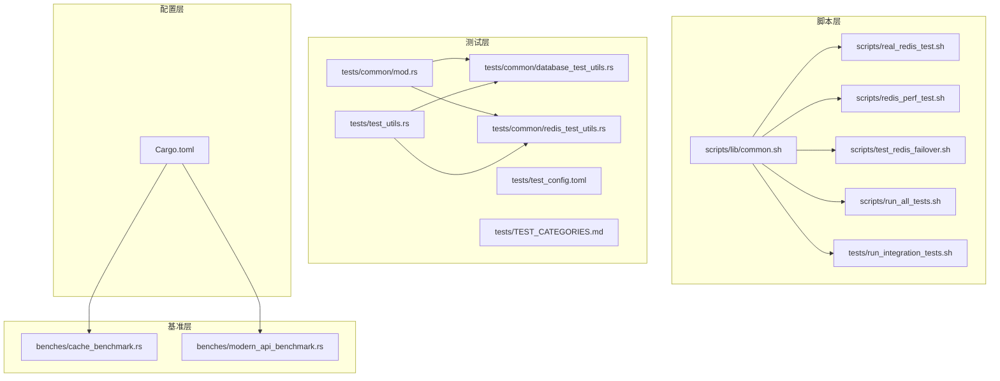
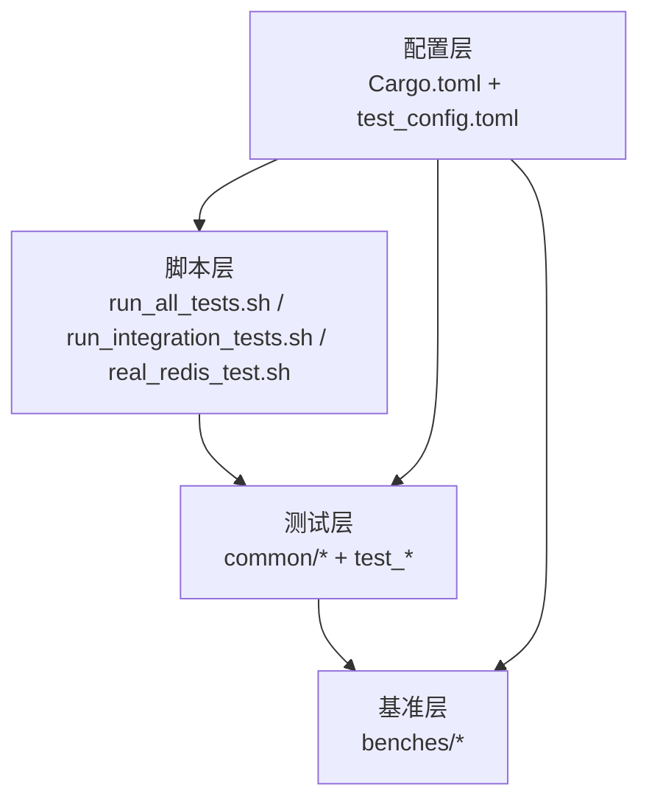
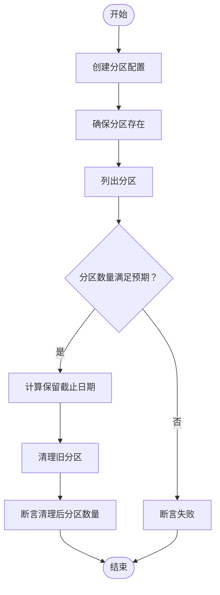
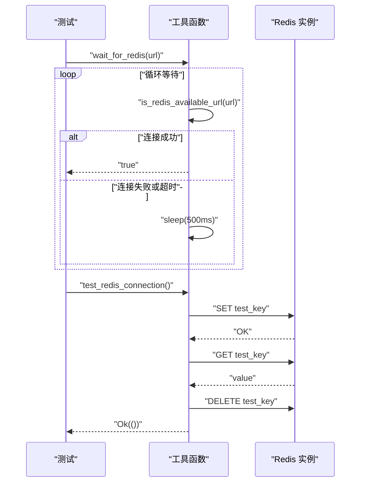
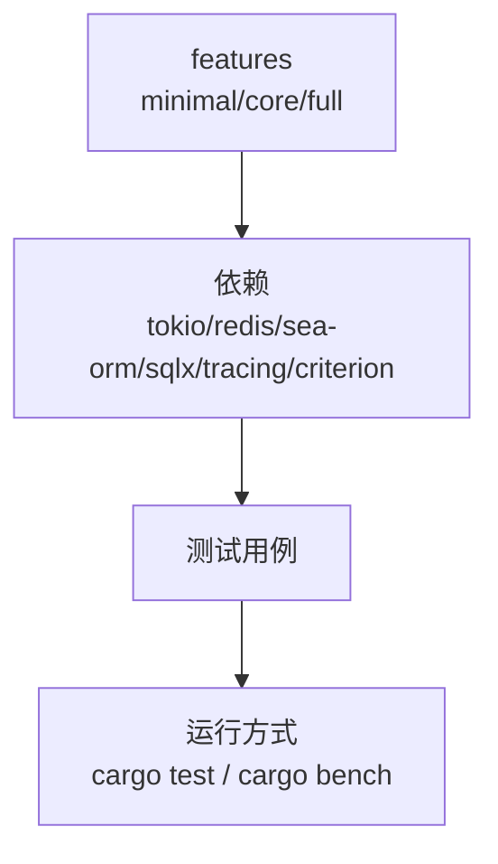

# 测试工具与辅助

<cite>
**本文引用的文件**
- [scripts/lib/common.sh](file://scripts/lib/common.sh)
- [scripts/real_redis_test.sh](file://scripts/real_redis_test.sh)
- [scripts/redis_perf_test.sh](file://scripts/redis_perf_test.sh)
- [scripts/test_redis_failover.sh](file://scripts/test_redis_failover.sh)
- [scripts/run_all_tests.sh](file://scripts/run_all_tests.sh)
- [tests/run_integration_tests.sh](file://tests/run_integration_tests.sh)
- [tests/common/mod.rs](file://tests/common/mod.rs)
- [tests/common/database_test_utils.rs](file://tests/common/database_test_utils.rs)
- [tests/common/redis_test_utils.rs](file://tests/common/redis_test_utils.rs)
- [tests/test_utils.rs](file://tests/test_utils.rs)
- [tests/test_config.toml](file://tests/test_config.toml)
- [tests/TEST_CATEGORIES.md](file://tests/TEST_CATEGORIES.md)
- [benches/cache_benchmark.rs](file://benches/cache_benchmark.rs)
- [benches/modern_api_benchmark.rs](file://benches/modern_api_benchmark.rs)
- [Cargo.toml](file://Cargo.toml)
</cite>

## 目录
1. [简介](#简介)
2. [项目结构](#项目结构)
3. [核心组件](#核心组件)
4. [架构概览](#架构概览)
5. [详细组件分析](#详细组件分析)
6. [依赖分析](#依赖分析)
7. [性能考虑](#性能考虑)
8. [故障排查指南](#故障排查指南)
9. [结论](#结论)
10. [附录](#附录)

## 简介
本章节系统梳理 Oxcache 项目中的测试工具与辅助设施，覆盖数据库测试工具、Redis 测试工具、通用测试工具、自动化测试脚本、性能测试与基准测试、调试与覆盖率工具、以及测试环境配置与依赖管理。目标是帮助开发者快速理解并高效使用测试体系，同时为持续集成与本地开发提供可操作的实践指南。

## 项目结构
测试相关资源主要分布在以下位置：
- scripts/：自动化测试与环境准备脚本，包含通用库 common.sh、Redis 真实环境测试脚本、性能测试脚本、故障切换测试脚本等
- tests/：测试源代码与配置，包含公共测试工具 common/、各类测试用例、测试配置文件 test_config.toml、测试分类说明 TEST_CATEGORIES.md
- benches/：基准测试，用于评估 L1/L2 缓存性能
- Cargo.toml：测试特性开关、依赖与配置

**图表来源**
- [scripts/lib/common.sh](file://scripts/lib/common.sh#L1-L232)
- [scripts/real_redis_test.sh](file://scripts/real_redis_test.sh#L1-L462)
- [scripts/redis_perf_test.sh](file://scripts/redis_perf_test.sh)
- [scripts/test_redis_failover.sh](file://scripts/test_redis_failover.sh)
- [scripts/run_all_tests.sh](file://scripts/run_all_tests.sh)
- [tests/run_integration_tests.sh](file://tests/run_integration_tests.sh#L1-L103)
- [tests/common/mod.rs](file://tests/common/mod.rs#L1-L184)
- [tests/common/database_test_utils.rs](file://tests/common/database_test_utils.rs#L1-L254)
- [tests/common/redis_test_utils.rs](file://tests/common/redis_test_utils.rs#L1-L77)
- [tests/test_utils.rs](file://tests/test_utils.rs#L1-L122)
- [tests/test_config.toml](file://tests/test_config.toml#L1-L32)
- [tests/TEST_CATEGORIES.md](file://tests/TEST_CATEGORIES.md#L1-L177)
- [benches/cache_benchmark.rs](file://benches/cache_benchmark.rs#L1-L100)
- [benches/modern_api_benchmark.rs](file://benches/modern_api_benchmark.rs#L1-L158)
- [Cargo.toml](file://Cargo.toml#L1-L377)

**章节来源**
- [scripts/lib/common.sh](file://scripts/lib/common.sh#L1-L232)
- [tests/TEST_CATEGORIES.md](file://tests/TEST_CATEGORIES.md#L1-L177)

## 核心组件
- 通用测试工具
  - 日志与环境初始化：统一的日志初始化、唯一服务名生成、资源清理等
  - Redis 可用性检测与等待：支持默认 URL、集群、Sentinel 的可用性检测与等待
  - 数据库分区测试工具：分区配置、表清理、并发分区操作、保留期清理等
- 自动化测试脚本
  - run_all_tests.sh：一键运行所有测试（含预提交检查）
  - run_integration_tests.sh：数据库分区集成测试（Docker 环境）
  - real_redis_test.sh：Redis 真实环境测试（Sentinel/Cluster），含压力测试与报告生成
  - redis_perf_test.sh：Redis 性能测试脚本（占位）
  - test_redis_failover.sh：Redis 故障切换测试脚本（占位）
- 基准测试
  - cache_benchmark.rs：L1 缓存设置/获取/不同数据大小/批量操作基准
  - modern_api_benchmark.rs：新 API 的 L1 基准测试（命中/未命中/批量/吞吐）

**章节来源**
- [tests/common/mod.rs](file://tests/common/mod.rs#L18-L184)
- [tests/common/database_test_utils.rs](file://tests/common/database_test_utils.rs#L17-L254)
- [tests/common/redis_test_utils.rs](file://tests/common/redis_test_utils.rs#L1-L77)
- [tests/test_utils.rs](file://tests/test_utils.rs#L1-L122)
- [scripts/run_all_tests.sh](file://scripts/run_all_tests.sh)
- [tests/run_integration_tests.sh](file://tests/run_integration_tests.sh#L1-L103)
- [scripts/real_redis_test.sh](file://scripts/real_redis_test.sh#L1-L462)
- [benches/cache_benchmark.rs](file://benches/cache_benchmark.rs#L1-L100)
- [benches/modern_api_benchmark.rs](file://benches/modern_api_benchmark.rs#L1-L158)

## 架构概览
测试体系由“脚本层-测试层-基准层-配置层”构成，脚本层负责环境准备与自动化执行；测试层提供通用工具与具体测试用例；基准层提供性能评估；配置层统一管理特性开关与依赖。

**图表来源**
- [scripts/run_all_tests.sh](file://scripts/run_all_tests.sh)
- [tests/run_integration_tests.sh](file://tests/run_integration_tests.sh#L1-L103)
- [scripts/real_redis_test.sh](file://scripts/real_redis_test.sh#L1-L462)
- [tests/common/mod.rs](file://tests/common/mod.rs#L1-L184)
- [benches/cache_benchmark.rs](file://benches/cache_benchmark.rs#L1-L100)
- [Cargo.toml](file://Cargo.toml#L1-L377)
- [tests/test_config.toml](file://tests/test_config.toml#L1-L32)

## 详细组件分析

### 数据库测试工具
- 功能要点
  - 测试配置结构体：封装 PostgreSQL/MySQL 连接串、分区策略与保留月数
  - 分区配置创建：启用/禁用、策略、保留月数
  - PostgreSQL 表清理：校验表名防注入，通过 Docker psql 命令清理
  - SQLite 临时数据库：创建临时文件与连接串
  - 分区创建与验证：确保分区存在、列出分区、断言数量
  - 旧分区清理：基于保留期计算截止日期并清理
  - 并发分区操作：多任务并发创建分区并断言结果
- 复杂度与性能
  - 分区创建/查询：单次 O(1) 或 O(n)（取决于底层实现）
  - 并发操作：多任务并发创建，注意锁与幂等性
  - 清理逻辑：按月计算截止日期，避免溢出与边界问题

**图表来源**
- [tests/common/database_test_utils.rs](file://tests/common/database_test_utils.rs#L42-L205)

**章节来源**
- [tests/common/database_test_utils.rs](file://tests/common/database_test_utils.rs#L1-L254)

### Redis 测试工具
- 功能要点
  - Redis URL 解析：优先使用环境变量，支持明文/加密连接
  - 可用性检测：检查环境变量开关，简化实现
  - 连接等待：超时循环检测连接可用性
  - 集群/Sentinel 等待：提供默认实现（简化）
  - 基本连通性测试：SET/GET/DELETE 验证
  - 测试键清理：占位实现
- 异步与超时
  - 使用 tokio::time::timeout 控制连接超时
  - 等待循环采用固定间隔休眠，避免忙轮询

**图表来源**
- [tests/common/redis_test_utils.rs](file://tests/common/redis_test_utils.rs#L17-L65)
- [tests/common/mod.rs](file://tests/common/mod.rs#L83-L132)

**章节来源**
- [tests/common/redis_test_utils.rs](file://tests/common/redis_test_utils.rs#L1-L77)
- [tests/common/mod.rs](file://tests/common/mod.rs#L41-L150)

### 通用测试工具与环境初始化
- 功能要点
  - 日志初始化：tracing-subscriber 初始化，仅首次调用
  - 缓存设置：创建默认内存缓存实例
  - Redis 可用性检测：环境变量开关控制
  - 服务名生成：UUID 追加确保隔离
  - 资源清理：删除 WAL 与 SQLite 文件
- 使用建议
  - 在每个测试前调用 setup_logging，保证可观测性
  - 使用 generate_unique_service_name 避免跨测试干扰

**章节来源**
- [tests/common/mod.rs](file://tests/common/mod.rs#L18-L184)
- [tests/test_utils.rs](file://tests/test_utils.rs#L27-L122)

### 自动化测试脚本

#### run_all_tests.sh
- 功能
  - 统一入口：运行所有测试与预提交检查
  - 依赖检查：Rust、Cargo、Miri、Valgrind 等
  - 统计与报告：测试统计、Markdown 报告生成
  - 超时执行：对耗时命令设置超时
- 使用
  - 直接执行脚本，或传入参数控制行为

**章节来源**
- [scripts/lib/common.sh](file://scripts/lib/common.sh#L46-L232)
- [scripts/run_all_tests.sh](file://scripts/run_all_tests.sh)

#### run_integration_tests.sh
- 功能
  - 数据库分区集成测试专用脚本
  - Docker 环境准备：PostgreSQL、MySQL、SQLite
  - 健康检查：pg_isready、mysqladmin、SQLite 文件存在
  - 运行测试：cargo test --test ...，支持 --verbose 输出
  - 清理：docker-compose down
- 使用
  - 确保 Docker 正常运行
  - 可选传入 --verbose 查看调试日志

**章节来源**
- [tests/run_integration_tests.sh](file://tests/run_integration_tests.sh#L1-L103)

#### real_redis_test.sh
- 功能
  - Redis 真实环境测试：Sentinel/Cluster 模式
  - 环境启动：docker-compose 启停、健康检查
  - 测试用例：连接、基本操作、故障转移、数据分布
  - 压力测试：并发、时长、数据大小
  - 报告生成：Markdown 测试报告
- 使用
  - 选择模式：sentinel、cluster、stress、stop、all
  - 依赖 Docker/Docker Compose

**章节来源**
- [scripts/real_redis_test.sh](file://scripts/real_redis_test.sh#L1-L462)

#### redis_perf_test.sh / test_redis_failover.sh
- 功能
  - redis_perf_test.sh：Redis 性能测试脚本（占位）
  - test_redis_failover.sh：Redis 故障切换测试脚本（占位）
- 建议
  - 结合 real_redis_test.sh 的环境，完善具体测试场景

**章节来源**
- [scripts/redis_perf_test.sh](file://scripts/redis_perf_test.sh)
- [scripts/test_redis_failover.sh](file://scripts/test_redis_failover.sh)

### 基准测试

#### cache_benchmark.rs
- 测试内容
  - L1 缓存设置/获取/不同数据大小/批量操作
  - 使用 Criterion 异步运行，结合 black_box
- 使用
  - cargo bench --bench cache_benchmark

**章节来源**
- [benches/cache_benchmark.rs](file://benches/cache_benchmark.rs#L1-L100)

#### modern_api_benchmark.rs
- 测试内容
  - 新 API 的 L1 基准：命中/未命中/批量/吞吐
  - 预填充数据，分组基准测试
- 使用
  - cargo bench --bench modern_api_benchmark

**章节来源**
- [benches/modern_api_benchmark.rs](file://benches/modern_api_benchmark.rs#L1-L158)

## 依赖分析
- 测试特性与依赖
  - features：minimal/core/full 等特性集合，控制测试覆盖范围
  - 依赖：tokio、redis、sea-orm/sqlx、tracing、criterion 等
- 测试分类与入口
  - TEST_CATEGORIES.md 描述测试组织结构与运行方式
  - tests/common/mod.rs 作为公共工具入口，导出工具函数

**图表来源**
- [Cargo.toml](file://Cargo.toml#L235-L346)
- [tests/TEST_CATEGORIES.md](file://tests/TEST_CATEGORIES.md#L112-L136)

**章节来源**
- [Cargo.toml](file://Cargo.toml#L216-L377)
- [tests/TEST_CATEGORIES.md](file://tests/TEST_CATEGORIES.md#L1-L177)

## 性能考虑
- 基准测试
  - 使用 Criterion 异步基准，关注吞吐与延迟
  - 覆盖不同数据大小与批量场景
- 压力测试
  - real_redis_test.sh 提供并发与时长配置
  - 关注连接池、序列化开销与网络抖动影响
- 资源与隔离
  - 使用 generate_unique_service_name 避免资源冲突
  - Docker 环境下合理设置资源限制

[本节为通用指导，无需特定文件引用]

## 故障排查指南
- Docker 环境
  - Docker 未运行：脚本会检测并报错，需先启动 Docker
  - docker-compose 未安装：按提示安装
- Redis 可用性
  - 环境变量 OXCACHE_SKIP_REDIS_TESTS：跳过 Redis 测试
  - REDIS_URL/OXCACHE_ALLOW_INSECURE_REDIS：控制连接串与加密
  - wait_for_redis：超时或连接拒绝时检查网络与防火墙
- 数据库分区
  - PostgreSQL 表名校验：防止注入，确认表名格式
  - SQLite 临时文件：确保路径可写
- 基准测试
  - Criterion 报错：检查异步运行时上下文与 black_box 使用
- 报告与统计
  - common.sh 提供测试统计与 Markdown 报告生成，便于定位问题

**章节来源**
- [tests/run_integration_tests.sh](file://tests/run_integration_tests.sh#L30-L88)
- [tests/common/mod.rs](file://tests/common/mod.rs#L41-L150)
- [tests/common/database_test_utils.rs](file://tests/common/database_test_utils.rs#L55-L109)
- [scripts/lib/common.sh](file://scripts/lib/common.sh#L186-L210)

## 结论
Oxcache 的测试体系以脚本层自动化、测试层通用工具与具体用例、基准层性能评估为核心，配合配置层的特性开关与依赖管理，形成完整、可扩展且易于维护的测试基础设施。通过合理使用这些工具与脚本，可以高效地验证缓存功能、数据库集成、Redis 真实环境与性能表现，并为持续改进提供数据支撑。

## 附录

### 测试脚本使用清单
- run_all_tests.sh：一键运行所有测试与预提交检查
- run_integration_tests.sh：数据库分区集成测试（Docker 环境）
- real_redis_test.sh：Redis 真实环境测试（Sentinel/Cluster/压力/报告）
- redis_perf_test.sh：Redis 性能测试（占位）
- test_redis_failover.sh：Redis 故障切换测试（占位）

**章节来源**
- [scripts/run_all_tests.sh](file://scripts/run_all_tests.sh)
- [tests/run_integration_tests.sh](file://tests/run_integration_tests.sh#L1-L103)
- [scripts/real_redis_test.sh](file://scripts/real_redis_test.sh#L1-L462)
- [scripts/redis_perf_test.sh](file://scripts/redis_perf_test.sh)
- [scripts/test_redis_failover.sh](file://scripts/test_redis_failover.sh)

### 测试环境配置与依赖管理
- 环境变量
  - OXCACHE_SKIP_REDIS_TESTS：跳过 Redis 测试
  - REDIS_URL：自定义 Redis 连接串
  - OXCACHE_ALLOW_INSECURE_REDIS：允许明文连接
- 配置文件
  - test_config.toml：数据库分区测试配置（PostgreSQL/MySQL/SQLite、分区策略、保留期）
- 特性开关
  - Cargo.toml features：minimal/core/full 等，控制测试覆盖范围

**章节来源**
- [tests/test_config.toml](file://tests/test_config.toml#L1-L32)
- [Cargo.toml](file://Cargo.toml#L235-L346)
- [tests/common/mod.rs](file://tests/common/mod.rs#L52-L81)