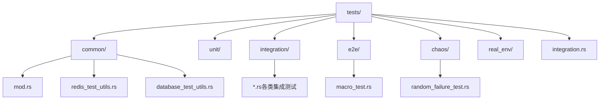
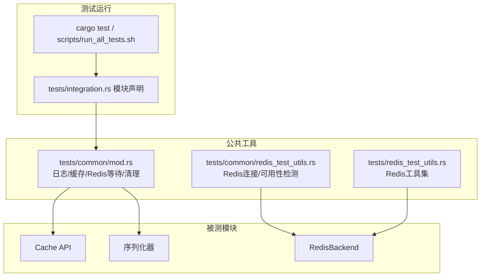
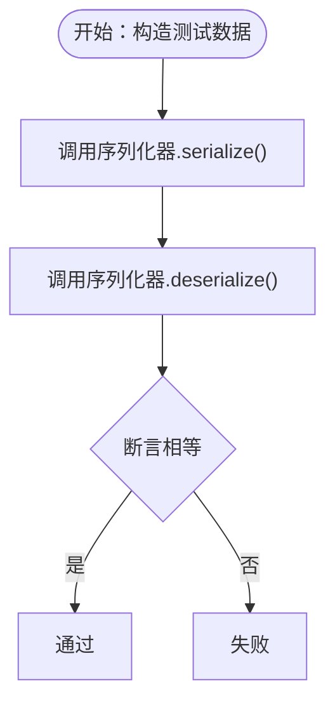
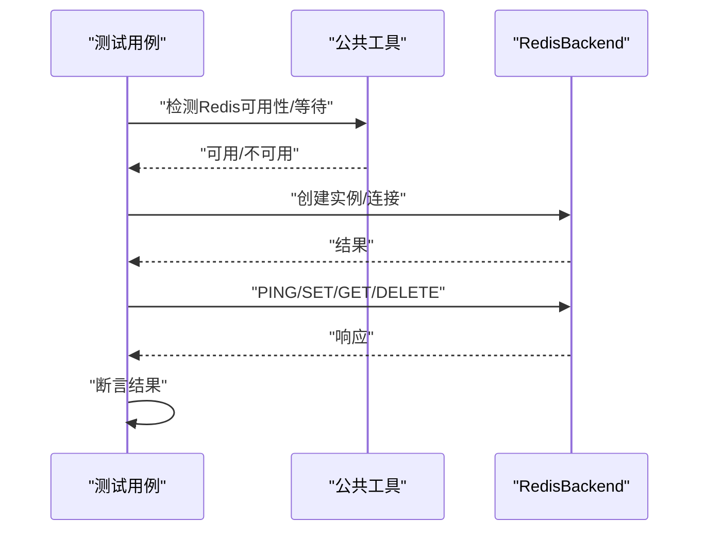
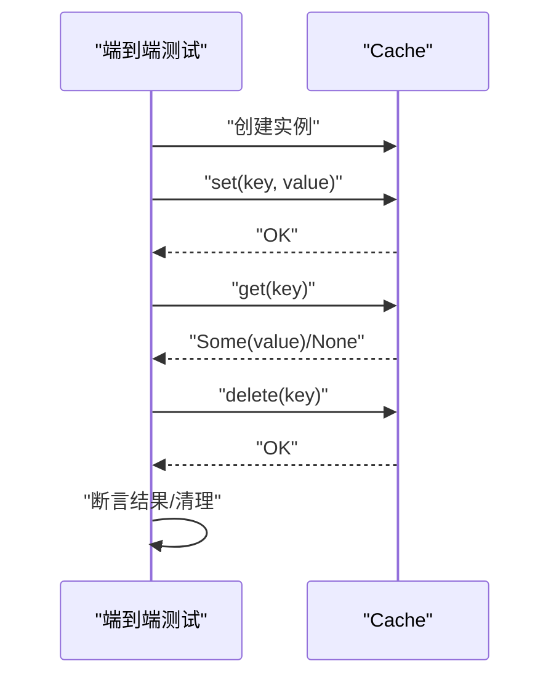
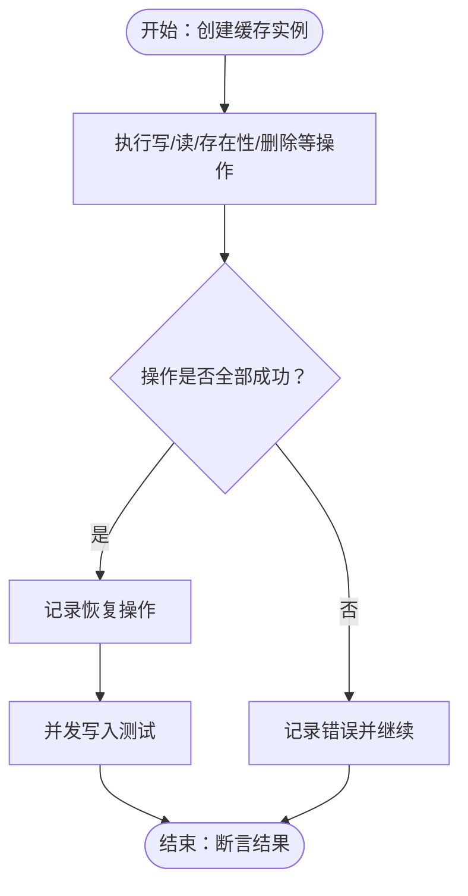
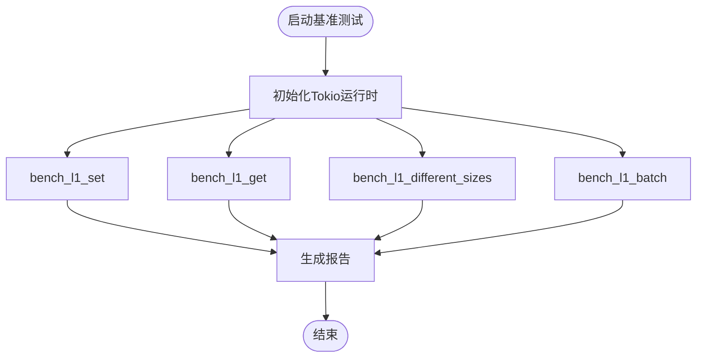
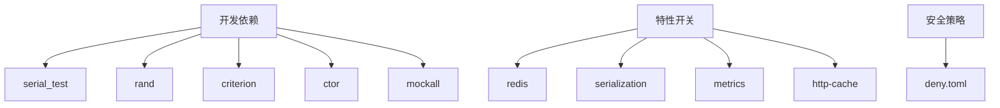

# 测试流程

<cite>
**本文引用的文件**
- [Cargo.toml](file://Cargo.toml)
- [tests/TEST_CATEGORIES.md](file://tests/TEST_CATEGORIES.md)
- [tests/common/mod.rs](file://tests/common/mod.rs)
- [tests/common/redis_test_utils.rs](file://tests/common/redis_test_utils.rs)
- [tests/redis_test_utils.rs](file://tests/redis_test_utils.rs)
- [tests/integration.rs](file://tests/integration.rs)
- [tests/integration/comprehensive_test.rs](file://tests/integration/comprehensive_test.rs)
- [tests/integration/redis_test.rs](file://tests/integration/redis_test.rs)
- [tests/unit/serialization_test.rs](file://tests/unit/serialization_test.rs)
- [tests/e2e/macro_test.rs](file://tests/e2e/macro_test.rs)
- [tests/chaos/random_failure_test.rs](file://tests/chaos/random_failure_test.rs)
- [benches/cache_benchmark.rs](file://benches/cache_benchmark.rs)
- [scripts/run_all_tests.sh](file://scripts/run_all_tests.sh)
- [tests/test_config.toml](file://tests/test_config.toml)
- [deny.toml](file://deny.toml)
</cite>

## 目录
1. [引言](#引言)
2. [项目结构](#项目结构)
3. [核心组件](#核心组件)
4. [架构总览](#架构总览)
5. [详细组件分析](#详细组件分析)
6. [依赖分析](#依赖分析)
7. [性能考虑](#性能考虑)
8. [故障排查指南](#故障排查指南)
9. [结论](#结论)
10. [附录](#附录)

## 引言
本文件系统性阐述 Oxcache 项目的测试策略与测试流程，覆盖单元测试、集成测试、端到端测试、混沌工程测试等，并对测试结构组织、编写指南、运行命令与脚本、工具与依赖、环境配置与 Redis 测试设置、覆盖率与质量保证流程进行深入说明，帮助开发者高效开展测试工作。

## 项目结构
Oxcache 的测试采用按“测试类别”分层的目录组织方式，便于定位与维护：
- tests/common：公共测试工具与环境准备（日志、Redis/数据库可用性检测、等待、清理等）
- tests/unit：单元测试（面向独立模块的功能与边界）
- tests/integration：集成测试（跨模块、跨组件交互）
- tests/e2e：端到端测试（从用户视角验证完整流程）
- tests/chaos：混沌工程测试（模拟故障与恢复）
- tests/real_env：真实环境配置（Redis 集群/Sentinel 示例）
- benches：基准测试（性能评估）

图表来源
- [tests/TEST_CATEGORIES.md](file://tests/TEST_CATEGORIES.md#L9-L61)
- [tests/integration.rs](file://tests/integration.rs#L10-L61)

章节来源
- [tests/TEST_CATEGORIES.md](file://tests/TEST_CATEGORIES.md#L7-L61)

## 核心组件
- 测试入口与组织
  - tests/integration.rs 作为集成测试模块入口，集中声明各子模块，统一由 cargo test --test integration 运行。
- 公共测试工具
  - tests/common/mod.rs 提供日志初始化、缓存创建、Redis 可用性检测与等待、清理资源等通用能力。
  - tests/common/redis_test_utils.rs 与 tests/redis_test_utils.rs 提供 Redis 连接、可用性检测、等待集群/Sentinel 就绪等工具。
- 测试分类与覆盖
  - 单元测试：tests/unit/serialization_test.rs 展示序列化器的往返与压缩功能。
  - 集成测试：tests/integration/comprehensive_test.rs、tests/integration/redis_test.rs 等覆盖缓存 API、Redis 后端、连接字符串变化等。
  - 端到端测试：tests/e2e/macro_test.rs 验证 Cache 基本流程与批量操作。
  - 混沌测试：tests/chaos/random_failure_test.rs 演示故障场景下的稳定性与恢复能力。
- 基准测试
  - benches/cache_benchmark.rs 提供 L1 缓存的 set/get/不同数据大小/批量等基准测试入口。

章节来源
- [tests/integration.rs](file://tests/integration.rs#L10-L61)
- [tests/common/mod.rs](file://tests/common/mod.rs#L18-L184)
- [tests/common/redis_test_utils.rs](file://tests/common/redis_test_utils.rs#L1-L200)
- [tests/redis_test_utils.rs](file://tests/redis_test_utils.rs#L1-L232)
- [tests/unit/serialization_test.rs](file://tests/unit/serialization_test.rs#L1-L52)
- [tests/integration/comprehensive_test.rs](file://tests/integration/comprehensive_test.rs#L1-L139)
- [tests/integration/redis_test.rs](file://tests/integration/redis_test.rs#L1-L153)
- [tests/e2e/macro_test.rs](file://tests/e2e/macro_test.rs#L1-L104)
- [tests/chaos/random_failure_test.rs](file://tests/chaos/random_failure_test.rs#L1-L138)
- [benches/cache_benchmark.rs](file://benches/cache_benchmark.rs#L1-L100)

## 架构总览
下图展示测试体系在运行时的关键交互：测试驱动调用公共工具与被测模块，Redis/数据库等外部依赖通过工具层进行可用性检测与等待，最终产出测试结果与日志。

图表来源
- [tests/integration.rs](file://tests/integration.rs#L10-L61)
- [tests/common/mod.rs](file://tests/common/mod.rs#L18-L184)
- [tests/common/redis_test_utils.rs](file://tests/common/redis_test_utils.rs#L1-L200)
- [tests/redis_test_utils.rs](file://tests/redis_test_utils.rs#L1-L232)

## 详细组件分析

### 单元测试：序列化器
- 目标：验证序列化器的往返一致性与压缩功能。
- 关键点：构造测试数据，分别调用 serialize/deserialize，断言相等；开启压缩路径亦需一致。
- 最佳实践：覆盖空值、长键、复杂结构等边界；保持测试独立，避免共享状态。

图表来源
- [tests/unit/serialization_test.rs](file://tests/unit/serialization_test.rs#L17-L51)

章节来源
- [tests/unit/serialization_test.rs](file://tests/unit/serialization_test.rs#L1-L52)

### 集成测试：缓存 API 综合与 Redis 后端
- 缓存 API 综合测试：验证 SET/GET/DELETE/CLEAR 等基本流程与多类型缓存实例。
- Redis 后端测试：Standalone 模式创建、PING、连接字符串变化、多次连接、错误处理等。
- 关键点：通过公共工具检测 Redis 可用性；对连接字符串容错与错误路径进行断言。

图表来源
- [tests/integration/comprehensive_test.rs](file://tests/integration/comprehensive_test.rs#L14-L62)
- [tests/integration/redis_test.rs](file://tests/integration/redis_test.rs#L16-L91)
- [tests/common/mod.rs](file://tests/common/mod.rs#L45-L124)

章节来源
- [tests/integration/comprehensive_test.rs](file://tests/integration/comprehensive_test.rs#L1-L139)
- [tests/integration/redis_test.rs](file://tests/integration/redis_test.rs#L1-L153)
- [tests/common/mod.rs](file://tests/common/mod.rs#L45-L124)

### 端到端测试：Cache 基本流程
- 目标：从用户视角验证 Cache 的基本生命周期（SET/GET/DELETE），以及批量操作与结构体缓存。
- 关键点：使用 Cache::new() 创建实例；覆盖字符串、结构体、批量写入/读取；最后清理。

图表来源
- [tests/e2e/macro_test.rs](file://tests/e2e/macro_test.rs#L21-L103)

章节来源
- [tests/e2e/macro_test.rs](file://tests/e2e/macro_test.rs#L1-L104)

### 混沌工程测试：随机故障与恢复
- 目标：在存在随机 Redis 故障场景下，验证缓存的稳定性与恢复能力，包括并发写入与故障恢复。
- 关键点：使用 #[ignore] 标记依赖真实 Redis 环境；并发场景下验证写入/读取一致性；统计操作成功数。

图表来源
- [tests/chaos/random_failure_test.rs](file://tests/chaos/random_failure_test.rs#L18-L137)

章节来源
- [tests/chaos/random_failure_test.rs](file://tests/chaos/random_failure_test.rs#L1-L138)

### 性能测试：基准测试
- 目标：评估 L1 缓存的 set/get、不同数据大小、批量写入等性能指标。
- 工具：criterion 基准框架；通过 benches/cache_benchmark.rs 定义基准组与输入参数。

图表来源
- [benches/cache_benchmark.rs](file://benches/cache_benchmark.rs#L13-L99)

章节来源
- [benches/cache_benchmark.rs](file://benches/cache_benchmark.rs#L1-L100)

## 依赖分析
- 开发依赖
  - serial_test：用于串行化测试，避免并发冲突（如 Redis/数据库资源竞争）。
  - rand：随机性支持（可用于混沌测试）。
  - criterion：基准测试框架。
  - ctor、mockall：辅助测试（构造器、Mock）。
- 功能特性与测试
  - Cargo.toml 中定义了丰富的特性（如 redis、serialization、metrics、http-cache 等），测试会根据特性启用与否选择性运行。
- 安全与合规
  - deny.toml 配置了许可证策略与漏洞忽略清单，保障第三方依赖安全基线。

图表来源
- [Cargo.toml](file://Cargo.toml#L216-L222)
- [Cargo.toml](file://Cargo.toml#L235-L346)
- [deny.toml](file://deny.toml#L1-L39)

章节来源
- [Cargo.toml](file://Cargo.toml#L216-L222)
- [Cargo.toml](file://Cargo.toml#L235-L346)
- [deny.toml](file://deny.toml#L1-L39)

## 性能考虑
- 基准测试建议
  - 使用 benches/cache_benchmark.rs 作为入口，针对不同数据规模与批量大小进行对比。
  - 在 CI 中固定硬件环境，确保结果可比性。
- 集成测试中的性能关注
  - 对涉及 Redis 的测试，优先复用连接与实例，减少创建/销毁开销。
  - 使用公共工具的等待与可用性检测，避免无效重试导致的性能损耗。

[本节为通用指导，无需具体文件分析]

## 故障排查指南
- Redis 可用性问题
  - 使用公共工具的 is_redis_available()/wait_for_redis() 检查与等待；确认环境变量 REDIS_URL/OXCACHE_ALLOW_INSECURE_REDIS。
  - 若测试被标记 #[ignore]，请确保真实 Redis 环境可用。
- 日志与诊断
  - 通过 common::setup_logging() 初始化日志，结合测试输出定位问题。
- 资源清理
  - 使用 cleanup_service() 清理 WAL 与数据库文件，避免残留影响后续测试。

章节来源
- [tests/common/mod.rs](file://tests/common/mod.rs#L18-L184)
- [tests/common/redis_test_utils.rs](file://tests/common/redis_test_utils.rs#L83-L150)
- [tests/redis_test_utils.rs](file://tests/redis_test_utils.rs#L68-L200)

## 结论
Oxcache 的测试体系以“公共工具 + 分类组织 + 明确入口”的方式构建，覆盖单元、集成、端到端与混沌工程测试，并辅以基准测试与安全策略。通过合理的运行脚本与环境配置，能够稳定地验证缓存核心功能、Redis 集成、HTTP 缓存、序列化与性能表现，形成完善的质量保证闭环。

[本节为总结，无需具体文件分析]

## 附录

### 测试运行命令与脚本
- 运行所有测试
  - cargo test
- 运行集成测试
  - cargo test --test integration
- 运行特定测试
  - cargo test --test integration -- test_two_level_cache_flow
- 运行脚本
  - scripts/run_all_tests.sh：综合测试运行器，支持并行/串行、超时、输出目录、安全审计、内存测试、Redis 兼容性测试、代码质量检查等。

章节来源
- [tests/TEST_CATEGORIES.md](file://tests/TEST_CATEGORIES.md#L112-L136)
- [scripts/run_all_tests.sh](file://scripts/run_all_tests.sh#L1-L388)

### 测试编写指南
- 单元测试
  - 针对独立模块与边界条件；使用 #[test]；断言返回值与错误路径。
- 集成测试
  - 通过 #[path = "..."] 组织模块；使用 common::setup_logging()；在需要 Redis/数据库时使用 is_redis_available()/wait_for_*()。
- 端到端测试
  - 从用户视角验证完整流程；覆盖结构体缓存、批量操作与清理。
- 混沌工程测试
  - 使用 #[ignore] 标记依赖真实环境；并发场景下验证稳定性与恢复。

章节来源
- [tests/TEST_CATEGORIES.md](file://tests/TEST_CATEGORIES.md#L138-L177)
- [tests/integration.rs](file://tests/integration.rs#L10-L61)
- [tests/common/mod.rs](file://tests/common/mod.rs#L18-L184)

### 测试环境配置与 Redis 设置
- 环境变量
  - REDIS_URL：Redis 连接地址（默认优先 rediss://，可通过 OXCACHE_ALLOW_INSECURE_REDIS 改为 redis://）。
  - OXCACHE_SKIP_REDIS_TESTS：跳过 Redis 相关测试。
- Redis 可用性检测
  - is_redis_available()/is_redis_available_url()/wait_for_redis()/wait_for_redis_cluster()/wait_for_sentinel() 提供多种等待与检测策略。
- 配置文件
  - tests/test_config.toml：数据库分区测试的连接与策略配置示例。

章节来源
- [tests/common/mod.rs](file://tests/common/mod.rs#L45-L150)
- [tests/common/redis_test_utils.rs](file://tests/common/redis_test_utils.rs#L83-L200)
- [tests/redis_test_utils.rs](file://tests/redis_test_utils.rs#L74-L200)
- [tests/test_config.toml](file://tests/test_config.toml#L1-L32)

### 覆盖率与质量保证流程
- 覆盖率生成
  - 仓库未直接内置覆盖率生成脚本；可在本地使用 cargo-tarpaulin 或其它覆盖率工具进行补充分析。
- 质量保证
  - deny.toml：许可证与漏洞策略。
  - scripts/run_all_tests.sh：代码格式化、Clippy、文档生成等质量检查。
  - benchmarks：性能回归基线。

章节来源
- [deny.toml](file://deny.toml#L1-L39)
- [scripts/run_all_tests.sh](file://scripts/run_all_tests.sh#L214-L261)
- [benches/cache_benchmark.rs](file://benches/cache_benchmark.rs#L1-L100)