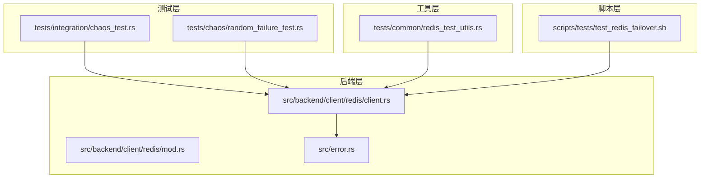
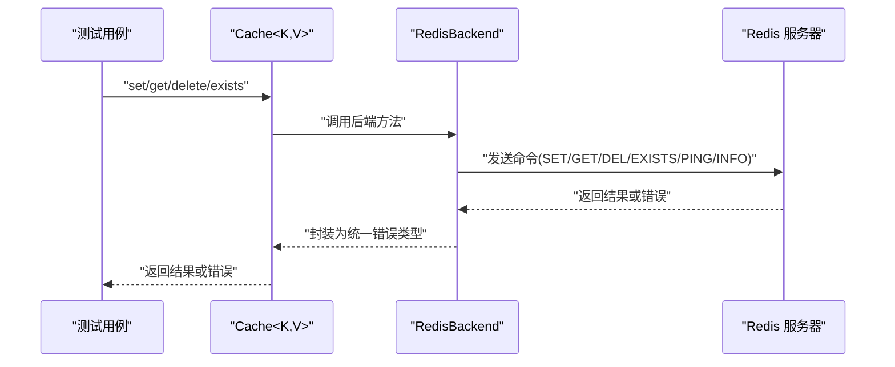
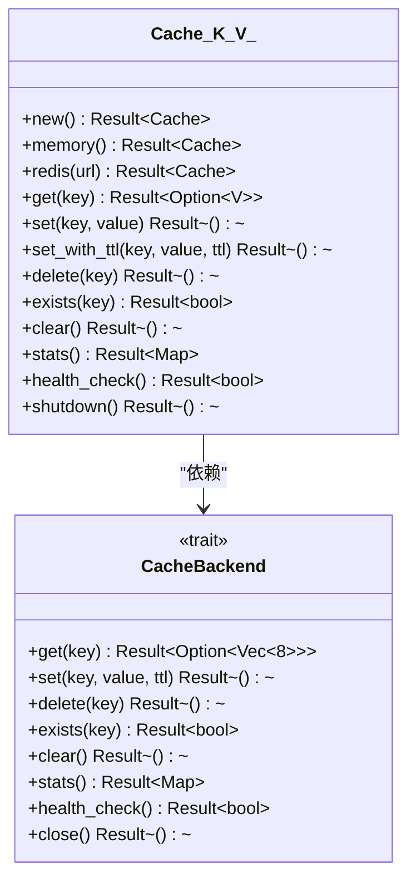
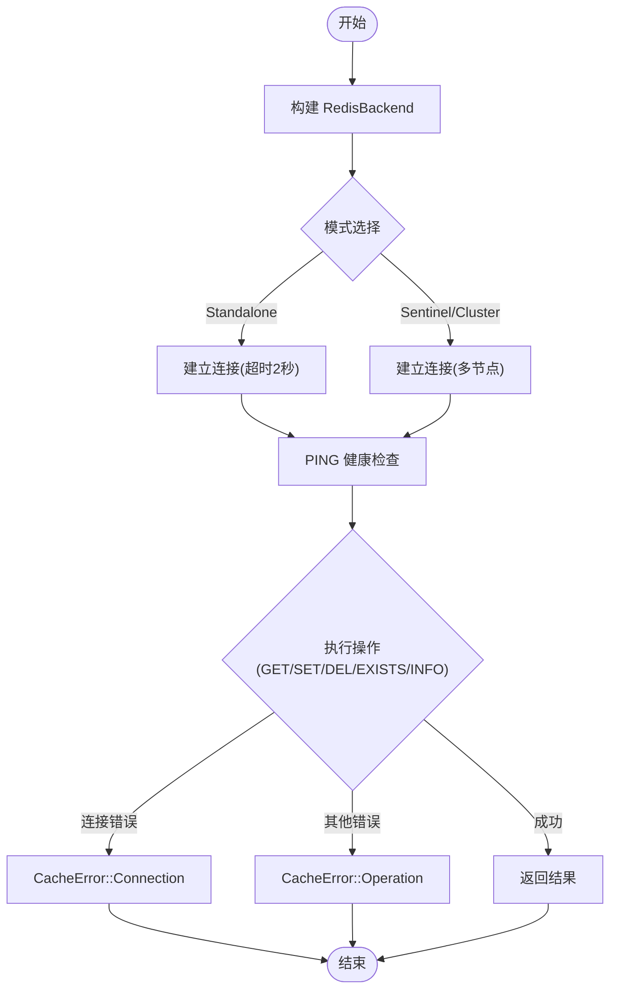
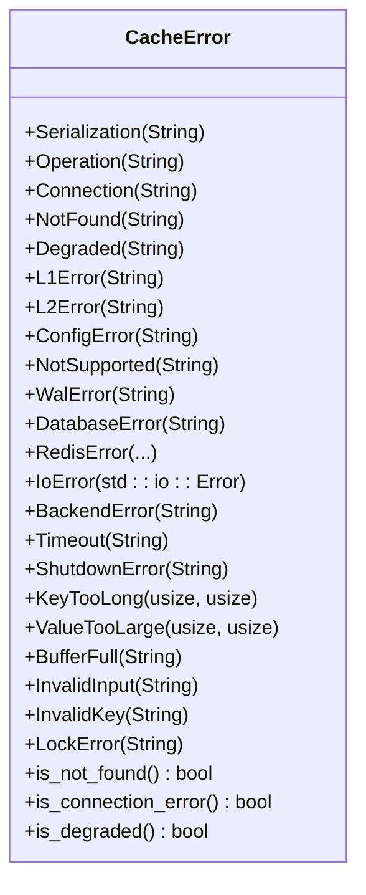
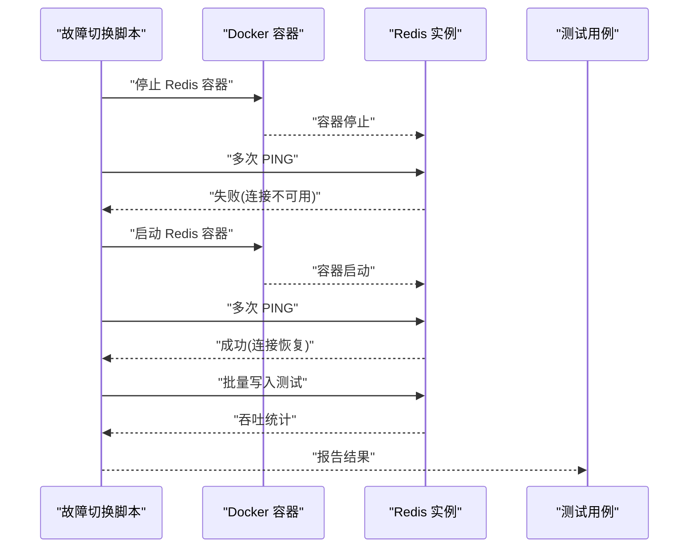
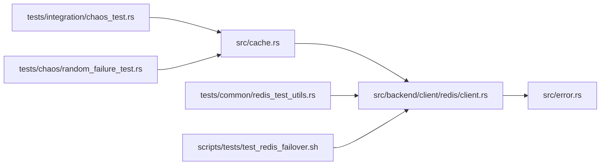

# 混沌工程测试

<cite>
**本文引用的文件**
- [tests/chaos/random_failure_test.rs](file://tests/chaos/random_failure_test.rs)
- [tests/integration/chaos_test.rs](file://tests/integration/chaos_test.rs)
- [src/backend/client/redis/client.rs](file://src/backend/client/redis/client.rs)
- [src/backend/client/redis/mod.rs](file://src/backend/client/redis/mod.rs)
- [src/error.rs](file://src/error.rs)
- [src/cache.rs](file://src/cache.rs)
- [tests/common/redis_test_utils.rs](file://tests/common/redis_test_utils.rs)
- [scripts/tests/test_redis_failover.sh](file://scripts/tests/test_redis_failover.sh)
</cite>

## 目录
1. [简介](#简介)
2. [项目结构](#项目结构)
3. [核心组件](#核心组件)
4. [架构总览](#架构总览)
5. [详细组件分析](#详细组件分析)
6. [依赖关系分析](#依赖关系分析)
7. [性能考量](#性能考量)
8. [故障注入与安全实践](#故障注入与安全实践)
9. [结论](#结论)
10. [附录](#附录)

## 简介
本文件系统性阐述 Oxcache 的混沌工程测试策略与故障注入方法，聚焦于模拟真实生产环境中的网络故障、Redis 连接异常、缓存失效等场景，验证缓存系统在异常条件下的稳定性与自愈能力。内容涵盖混沌测试设计原则、实施步骤、故障注入工具使用、测试场景设计与结果分析，并给出安全实践与风险控制建议。

## 项目结构
围绕混沌测试与故障注入的关键目录与文件如下：
- 测试层：集成混沌测试与随机故障测试，分别覆盖基础故障恢复与并发/快速操作场景
- 后端层：Redis 后端实现与错误类型定义，支撑故障注入与错误分类
- 工具层：Redis 连接可用性检测与测试工具封装
- 脚本层：Redis 故障切换与重连测试脚本，用于容器化环境下的自动化演练

**图表来源**
- [tests/integration/chaos_test.rs](file://tests/integration/chaos_test.rs#L1-L93)
- [tests/chaos/random_failure_test.rs](file://tests/chaos/random_failure_test.rs#L1-L138)
- [src/backend/client/redis/client.rs](file://src/backend/client/redis/client.rs#L1-L522)
- [src/backend/client/redis/mod.rs](file://src/backend/client/redis/mod.rs#L1-L15)
- [src/error.rs](file://src/error.rs#L1-L289)
- [tests/common/redis_test_utils.rs](file://tests/common/redis_test_utils.rs#L1-L77)
- [scripts/tests/test_redis_failover.sh](file://scripts/tests/test_redis_failover.sh#L1-L127)

**章节来源**
- [tests/integration/chaos_test.rs](file://tests/integration/chaos_test.rs#L1-L93)
- [tests/chaos/random_failure_test.rs](file://tests/chaos/random_failure_test.rs#L1-L138)
- [src/backend/client/redis/client.rs](file://src/backend/client/redis/client.rs#L1-L522)
- [src/error.rs](file://src/error.rs#L1-L289)
- [tests/common/redis_test_utils.rs](file://tests/common/redis_test_utils.rs#L1-L77)
- [scripts/tests/test_redis_failover.sh](file://scripts/tests/test_redis_failover.sh#L1-L127)

## 核心组件
- 缓存接口与统一 API：提供类型安全的缓存操作入口，屏蔽后端差异，便于在不同后端（内存/Redis）间切换与测试
- Redis 后端实现：封装连接池、命令执行、健康检查、统计信息与错误分类，为混沌测试提供可注入的故障点
- 错误类型体系：对连接、超时、降级、后端错误等进行细粒度分类，支撑测试断言与结果分析
- 测试工具与脚本：提供 Redis 可用性检测、容器化故障切换与重连测试，辅助自动化混沌演练

**章节来源**
- [src/cache.rs](file://src/cache.rs#L117-L646)
- [src/backend/client/redis/client.rs](file://src/backend/client/redis/client.rs#L15-L522)
- [src/error.rs](file://src/error.rs#L45-L289)
- [tests/common/redis_test_utils.rs](file://tests/common/redis_test_utils.rs#L1-L77)
- [scripts/tests/test_redis_failover.sh](file://scripts/tests/test_redis_failover.sh#L1-L127)

## 架构总览
下图展示从测试调用到后端执行的链路，以及关键的故障注入位置与错误分类路径。

**图表来源**
- [src/cache.rs](file://src/cache.rs#L241-L370)
- [src/backend/client/redis/client.rs](file://src/backend/client/redis/client.rs#L215-L499)

**章节来源**
- [src/cache.rs](file://src/cache.rs#L241-L370)
- [src/backend/client/redis/client.rs](file://src/backend/client/redis/client.rs#L215-L499)

## 详细组件分析

### 组件一：缓存接口与统一 API
- 设计要点
  - 类型安全：通过泛型 K/V 约束键值类型，结合序列化器实现自动序列化/反序列化
  - 后端抽象：统一 CacheBackend 接口，支持内存与 Redis 等多种后端
  - 常用操作：get/set/delete/exists/clear/stats/health_check 等
- 混沌测试价值
  - 验证在 Redis 不可用时，缓存仍能正常工作（内存后端）
  - 验证错误分类与降级行为的一致性

**图表来源**
- [src/cache.rs](file://src/cache.rs#L117-L646)
- [src/backend/client/redis/client.rs](file://src/backend/client/redis/client.rs#L215-L230)

**章节来源**
- [src/cache.rs](file://src/cache.rs#L117-L646)

### 组件二：Redis 后端实现与错误分类
- 连接与模式
  - 支持 Standalone/Sentinel/Cluster 三种模式
  - 连接字符串必须使用 TLS（rediss://），开发/测试可通过环境变量放宽限制
  - 提供健康检查（PING）、统计（INFO memory）与批量清理（SCAN+DEL）
- 错误分类
  - 连接错误：超时、IO 错误等
  - 操作错误：命令执行失败但非连接问题
  - 后端错误：通用后端异常
- 混沌测试价值
  - 通过脚本或外部手段中断 Redis，验证连接错误与降级路径
  - 验证健康检查与统计接口在异常状态下的表现

**图表来源**
- [src/backend/client/redis/client.rs](file://src/backend/client/redis/client.rs#L162-L213)
- [src/backend/client/redis/client.rs](file://src/backend/client/redis/client.rs#L215-L499)
- [src/error.rs](file://src/error.rs#L93-L174)

**章节来源**
- [src/backend/client/redis/client.rs](file://src/backend/client/redis/client.rs#L162-L213)
- [src/backend/client/redis/client.rs](file://src/backend/client/redis/client.rs#L215-L499)
- [src/error.rs](file://src/error.rs#L93-L174)

### 组件三：错误类型体系与断言
- 错误分类
  - 连接错误、超时、后端错误、降级、未找到等
  - 提供 is_connection_error/is_degraded/is_not_found 等便捷判断
- 混沌测试价值
  - 在故障注入后，断言错误类型是否符合预期
  - 验证降级模式下的行为一致性

**图表来源**
- [src/error.rs](file://src/error.rs#L75-L289)

**章节来源**
- [src/error.rs](file://src/error.rs#L75-L289)

### 组件四：测试工具与脚本
- Redis 可用性检测
  - 提供连接可用性判断与基本 CRUD 验证
- Redis 故障切换与重连脚本
  - 容器化环境下模拟 Redis 停止/重启，验证重连与吞吐恢复
  - 多轮 PING 与批量写入测试，评估恢复性能

**图表来源**
- [scripts/tests/test_redis_failover.sh](file://scripts/tests/test_redis_failover.sh#L1-L127)
- [tests/common/redis_test_utils.rs](file://tests/common/redis_test_utils.rs#L38-L65)

**章节来源**
- [tests/common/redis_test_utils.rs](file://tests/common/redis_test_utils.rs#L1-L77)
- [scripts/tests/test_redis_failover.sh](file://scripts/tests/test_redis_failover.sh#L1-L127)

## 依赖关系分析
- 测试依赖缓存接口与 Redis 后端，后端依赖错误类型体系
- 工具层提供 Redis 可用性检测，脚本层提供容器化故障演练
- 依赖关系清晰，耦合度低，便于扩展新后端或新测试场景

**图表来源**
- [tests/integration/chaos_test.rs](file://tests/integration/chaos_test.rs#L1-L93)
- [tests/chaos/random_failure_test.rs](file://tests/chaos/random_failure_test.rs#L1-L138)
- [src/cache.rs](file://src/cache.rs#L117-L646)
- [src/backend/client/redis/client.rs](file://src/backend/client/redis/client.rs#L1-L522)
- [src/error.rs](file://src/error.rs#L1-L289)
- [tests/common/redis_test_utils.rs](file://tests/common/redis_test_utils.rs#L1-L77)
- [scripts/tests/test_redis_failover.sh](file://scripts/tests/test_redis_failover.sh#L1-L127)

**章节来源**
- [tests/integration/chaos_test.rs](file://tests/integration/chaos_test.rs#L1-L93)
- [tests/chaos/random_failure_test.rs](file://tests/chaos/random_failure_test.rs#L1-L138)
- [src/cache.rs](file://src/cache.rs#L117-L646)
- [src/backend/client/redis/client.rs](file://src/backend/client/redis/client.rs#L1-L522)
- [src/error.rs](file://src/error.rs#L1-L289)
- [tests/common/redis_test_utils.rs](file://tests/common/redis_test_utils.rs#L1-L77)
- [scripts/tests/test_redis_failover.sh](file://scripts/tests/test_redis_failover.sh#L1-L127)

## 性能考量
- 连接池与超时：Redis 后端支持连接池参数与命令超时，合理配置可提升高并发下的稳定性
- 健康检查与统计：定期 PING 与 INFO memory 可作为性能监控与故障预警手段
- 批量清理：使用 SCAN+DEL 替代 FLUSHDB，避免影响其他连接/数据库，降低清理成本

**章节来源**
- [src/backend/client/redis/client.rs](file://src/backend/client/redis/client.rs#L28-L64)
- [src/backend/client/redis/client.rs](file://src/backend/client/redis/client.rs#L455-L499)
- [src/backend/client/redis/client.rs](file://src/backend/client/redis/client.rs#L390-L448)

## 故障注入与安全实践

### 设计原则
- 明确目标：聚焦网络抖动、连接中断、服务重启、瞬时超时等高频故障
- 渐进增强：从单点故障到复合故障，逐步提高复杂度
- 可观测性：确保错误分类、日志与指标完整，便于回溯与分析
- 可重复性：脚本化与容器化，保证环境一致与结果可复现

### 实施步骤
- 环境准备
  - 准备 Redis 单机/哨兵/集群环境，确保 TLS 或开发模式配置正确
  - 启用测试忽略标记，仅在具备真实 Redis 的环境中运行
- 场景设计
  - 基础故障恢复：验证 set/get/delete/exists 在 Redis 不可用时的行为
  - 并发与快速操作：多协程并发写入与读取，验证锁与一致性
  - 故障切换与重连：容器化停止/启动 Redis，验证重连与吞吐恢复
- 执行与记录
  - 使用测试注解与脚本执行，记录每次操作结果与耗时
  - 断言错误类型与行为是否符合预期
- 结果分析
  - 统计成功率、失败率与平均耗时
  - 分析错误分布与热点故障点，优化超时与重试策略

### 故障注入工具与方法
- 容器化故障注入
  - 通过停止/启动 Redis 容器模拟服务不可用与恢复
  - 使用脚本进行多轮 PING 与批量写入，评估恢复性能
- 网络层面注入
  - 使用防火墙规则临时阻断 Redis 端口，观察连接超时与降级
- 代码层面注入
  - 在测试中构造特定错误分支，验证错误分类与降级逻辑

### 安全实践与风险控制
- 环境隔离：混沌测试在独立容器或测试集群中进行，避免影响生产流量
- 权限最小化：仅授予测试所需的最小权限，避免误删数据或破坏服务
- 限流与熔断：在测试中模拟超时与熔断，验证系统保护机制
- 回滚与清理：测试结束后自动清理测试数据，恢复网络与服务状态
- 监控告警：在测试期间开启日志与指标监控，及时发现异常

**章节来源**
- [tests/chaos/random_failure_test.rs](file://tests/chaos/random_failure_test.rs#L18-L138)
- [tests/integration/chaos_test.rs](file://tests/integration/chaos_test.rs#L15-L92)
- [scripts/tests/test_redis_failover.sh](file://scripts/tests/test_redis_failover.sh#L1-L127)
- [tests/common/redis_test_utils.rs](file://tests/common/redis_test_utils.rs#L1-L77)
- [src/backend/client/redis/client.rs](file://src/backend/client/redis/client.rs#L167-L205)

## 结论
Oxcache 的混沌工程测试以“统一缓存接口 + 可插拔后端 + 细粒度错误分类”为核心，结合容器化脚本与测试工具，能够有效模拟并验证 Redis 连接异常、服务重启、网络抖动等真实故障场景。通过渐进式场景设计与可观测性保障，系统在异常条件下展现出良好的稳定性与自愈能力。建议持续扩展故障类型与复杂度，并完善自动化监控与告警体系，以进一步提升生产环境的韧性。

## 附录
- 测试用例参考
  - 基础故障恢复：[tests/integration/chaos_test.rs](file://tests/integration/chaos_test.rs#L15-L46)
  - 并发与快速操作：[tests/integration/chaos_test.rs](file://tests/integration/chaos_test.rs#L48-L92)
  - 随机 Redis 故障：[tests/chaos/random_failure_test.rs](file://tests/chaos/random_failure_test.rs#L18-L138)
- 后端与错误
  - Redis 后端实现：[src/backend/client/redis/client.rs](file://src/backend/client/redis/client.rs#L162-L499)
  - 错误类型体系：[src/error.rs](file://src/error.rs#L75-L289)
- 工具与脚本
  - Redis 可用性检测：[tests/common/redis_test_utils.rs](file://tests/common/redis_test_utils.rs#L38-L65)
  - 故障切换与重连脚本：[scripts/tests/test_redis_failover.sh](file://scripts/tests/test_redis_failover.sh#L1-L127)