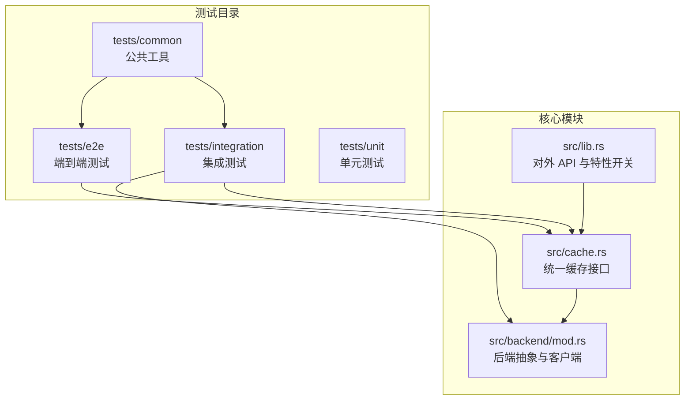
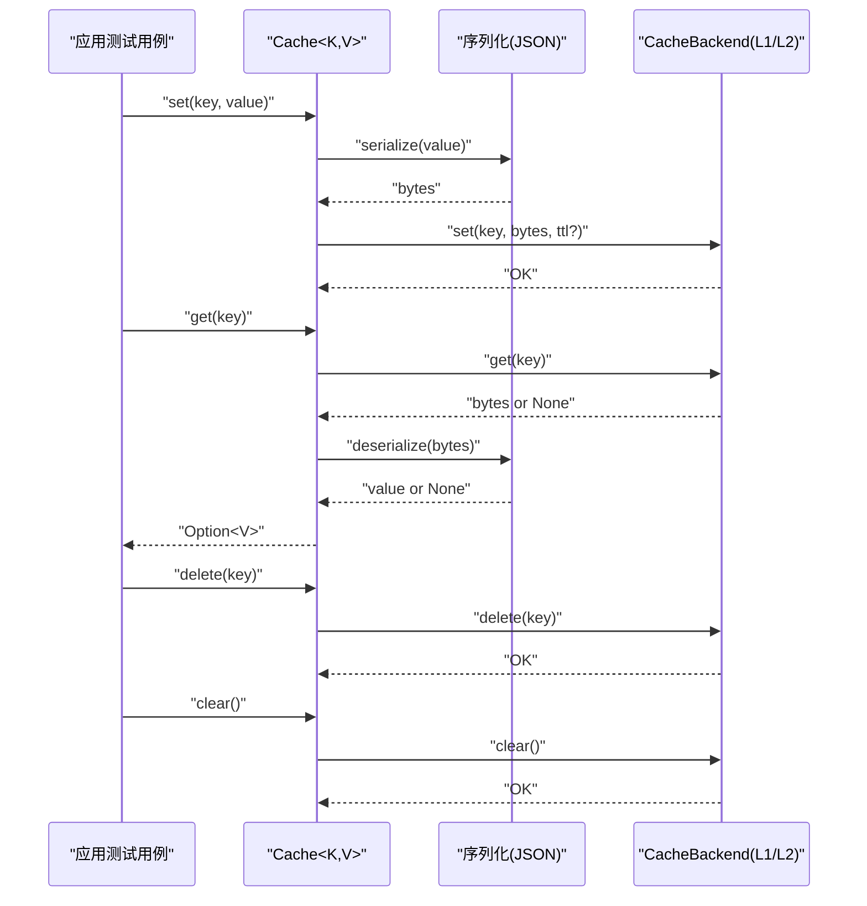
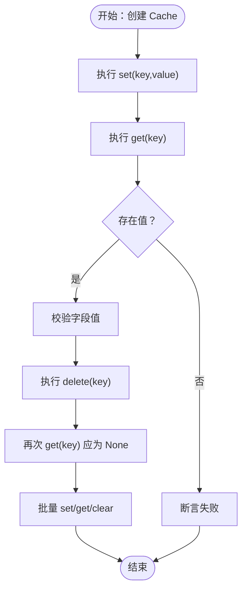
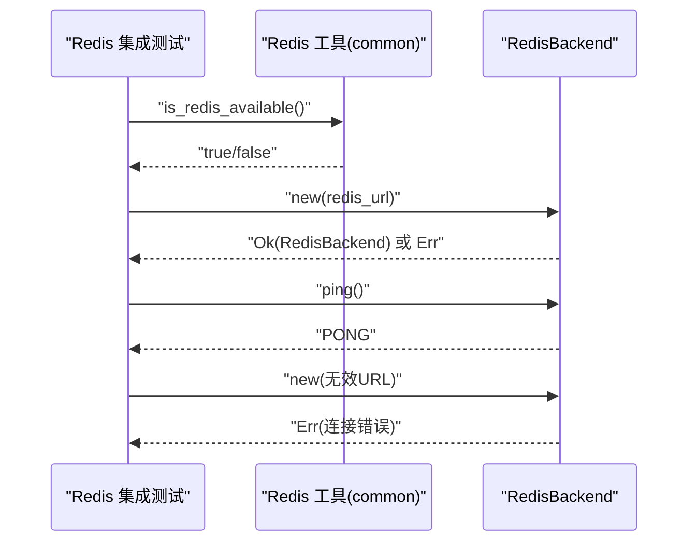
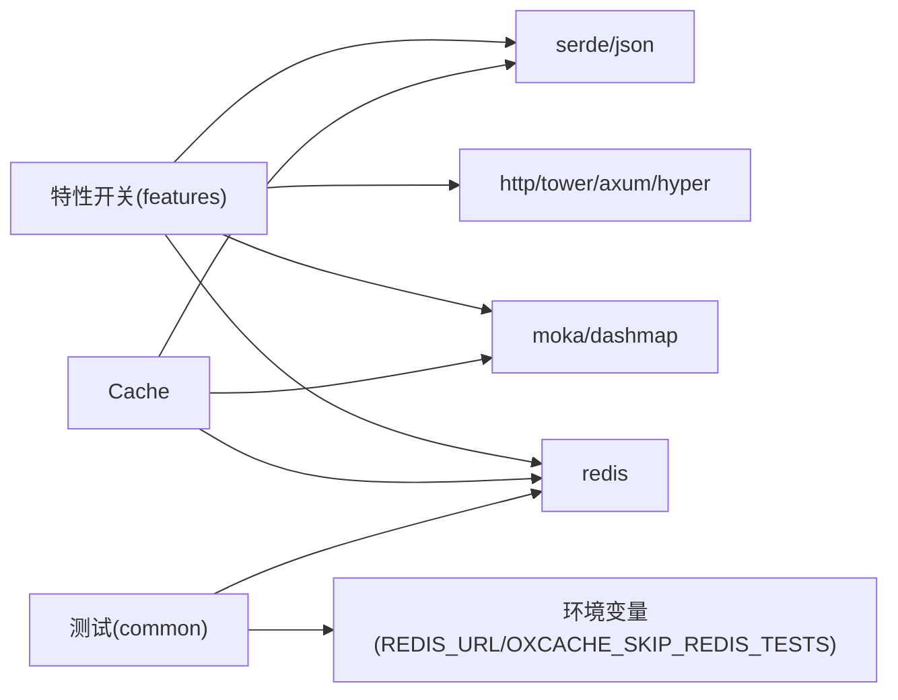

# 端到端测试

<cite>
**本文引用的文件**
- [tests/e2e.rs](file://tests/e2e.rs)
- [tests/e2e/macro_test.rs](file://tests/e2e/macro_test.rs)
- [tests/TEST_CATEGORIES.md](file://tests/TEST_CATEGORIES.md)
- [tests/common/mod.rs](file://tests/common/mod.rs)
- [tests/common/redis_test_utils.rs](file://tests/common/redis_test_utils.rs)
- [tests/integration/redis_test.rs](file://tests/integration/redis_test.rs)
- [tests/integration/comprehensive_test.rs](file://tests/integration/comprehensive_test.rs)
- [tests/integration/http_cache_test.rs](file://tests/integration/http_cache_test.rs)
- [src/lib.rs](file://src/lib.rs)
- [src/cache.rs](file://src/cache.rs)
- [src/backend/mod.rs](file://src/backend/mod.rs)
- [Cargo.toml](file://Cargo.toml)
- [README.md](file://README.md)
</cite>

## 目录
1. [简介](#简介)
2. [项目结构](#项目结构)
3. [核心组件](#核心组件)
4. [架构总览](#架构总览)
5. [详细组件分析](#详细组件分析)
6. [依赖分析](#依赖分析)
7. [性能考虑](#性能考虑)
8. [故障排查指南](#故障排查指南)
9. [结论](#结论)
10. [附录](#附录)

## 简介
本章节系统阐述 Oxcache 项目的端到端测试策略与实现方法，目标是验证从应用层到缓存层的完整功能链路，覆盖宏装饰器测试、完整使用场景测试、Redis 集成测试以及 HTTP 缓存测试等。文档同时提供测试环境配置与运行指南、测试数据流与状态管理方法、以及结果验证策略，帮助开发者快速理解并扩展测试体系。

## 项目结构
Oxcache 的测试组织遵循“按功能域分层 + 按测试类型分层”的双维度结构：
- tests/e2e：端到端测试，聚焦真实使用场景与宏装饰器行为
- tests/integration：集成测试，覆盖 L1/L2 后端交互、Redis 模式、HTTP 缓存等
- tests/common：公共测试工具，封装日志、Redis/数据库可用性检测、资源清理等
- tests/unit：单元测试（本仓库示例包含序列化单元测试）

图表来源
- [tests/e2e.rs](file://tests/e2e.rs#L1-L16)
- [tests/integration/redis_test.rs](file://tests/integration/redis_test.rs#L1-L153)
- [src/cache.rs](file://src/cache.rs#L117-L120)
- [src/backend/mod.rs](file://src/backend/mod.rs#L26-L45)

章节来源
- [tests/TEST_CATEGORIES.md](file://tests/TEST_CATEGORIES.md#L1-L61)
- [tests/e2e.rs](file://tests/e2e.rs#L1-L16)
- [tests/integration/redis_test.rs](file://tests/integration/redis_test.rs#L1-L153)

## 核心组件
- 端到端测试入口与组织
  - tests/e2e.rs 作为模块入口，声明宏装饰器端到端测试与公共模块
  - tests/e2e/macro_test.rs 包含基本缓存、结构体缓存、批量操作三类 E2E 场景
- 统一缓存接口
  - src/cache.rs 提供 Cache<K, V> 类型安全接口，支持 set/get/delete/exists/get_or 等常用操作
  - 支持序列化（JSON）与 TTL 控制，便于 E2E 场景下的数据一致性验证
- 后端抽象
  - src/backend/mod.rs 暴露 CacheBackend 接口与客户端实现（Moka/DashMap/Redis），为集成测试提供真实后端
- 公共测试工具
  - tests/common/mod.rs 提供日志初始化、Redis 可用性检测、等待可用、资源清理等能力
  - tests/common/redis_test_utils.rs 提供 Redis 连接测试与 URL 解析工具

章节来源
- [tests/e2e.rs](file://tests/e2e.rs#L10-L16)
- [tests/e2e/macro_test.rs](file://tests/e2e/macro_test.rs#L1-L104)
- [src/cache.rs](file://src/cache.rs#L117-L120)
- [src/backend/mod.rs](file://src/backend/mod.rs#L26-L45)
- [tests/common/mod.rs](file://tests/common/mod.rs#L18-L184)
- [tests/common/redis_test_utils.rs](file://tests/common/redis_test_utils.rs#L1-L77)

## 架构总览
端到端测试从应用视角出发，调用统一缓存接口，经由序列化层与后端抽象，最终落到 L1（内存）或 L2（Redis）实现。测试关注点包括：
- 应用层：Cache::new()/set()/get()/delete()/get_or()/set_many()/get_many()/clear() 等 API 的行为
- 序列化层：JSON 序列化/反序列化对结构体的支持
- 后端层：内存后端（Moka/DashMap）与 Redis 后端的连通性与一致性
- 状态管理：缓存命中/未命中、TTL 生效、批量操作原子性、清理与健康检查

图表来源
- [src/cache.rs](file://src/cache.rs#L241-L325)
- [src/cache.rs](file://src/cache.rs#L343-L346)
- [src/cache.rs](file://src/cache.rs#L513-L515)

章节来源
- [src/cache.rs](file://src/cache.rs#L241-L346)
- [src/cache.rs](file://src/cache.rs#L513-L515)

## 详细组件分析

### 端到端测试：宏装饰器与完整使用场景
- 测试目标
  - 验证 Cache::new() 创建内存缓存实例
  - 验证基本 SET/GET/DELETE 工作流
  - 验证结构体序列化与反序列化的完整性
  - 验证批量写入/读取/清理的一致性
- 关键验证点
  - set/get/delete 成功返回
  - 结构体字段值匹配
  - 批量场景中每个 key 的值正确
  - clear 后 get 返回 None
- 运行方式
  - cargo test --test e2e
  - 或单独运行具体测试函数

图表来源
- [tests/e2e/macro_test.rs](file://tests/e2e/macro_test.rs#L20-L48)
- [tests/e2e/macro_test.rs](file://tests/e2e/macro_test.rs#L50-L76)
- [tests/e2e/macro_test.rs](file://tests/e2e/macro_test.rs#L78-L103)

章节来源
- [tests/e2e.rs](file://tests/e2e.rs#L10-L16)
- [tests/e2e/macro_test.rs](file://tests/e2e/macro_test.rs#L1-L104)

### Redis 集成测试（端到端链路）
- 测试目标
  - 验证 RedisBackend 在 Standalone 模式下的创建与连接
  - 验证 PING 命令返回值
  - 验证多种连接字符串格式的兼容性
  - 验证多次连接与错误连接的处理
- 关键验证点
  - RedisBackend::new() 对有效 URL 成功
  - ping() 返回 "PONG"
  - 无效 URL 导致创建失败
  - 多实例并发创建均成功
- 运行方式
  - cargo test --test integration -- test_redis_backend_ping
  - 或 cargo test --test integration -- test_redis_backend_standalone_creation

图表来源
- [tests/integration/redis_test.rs](file://tests/integration/redis_test.rs#L16-L91)
- [tests/common/redis_test_utils.rs](file://tests/common/redis_test_utils.rs#L38-L65)

章节来源
- [tests/integration/redis_test.rs](file://tests/integration/redis_test.rs#L1-L153)
- [tests/common/redis_test_utils.rs](file://tests/common/redis_test_utils.rs#L1-L77)

### HTTP 缓存测试（端到端链路）
- 测试目标
  - 验证 HttpCacheResponse 结构体字段（状态码、头部、ETag、Body 等）
  - 验证序列化/反序列化对响应对象的影响
  - 验证多种状态码与复杂头部集合的行为
- 关键验证点
  - 基本响应结构体字段正确
  - ETag 存在时头部包含对应键值
  - 多个标准头部可同时存在
  - JSON 序列化/反序列化成功
- 运行方式
  - cargo test --test integration -- test_http_cache_response_basic

章节来源
- [tests/integration/http_cache_test.rs](file://tests/integration/http_cache_test.rs#L1-L127)

### 综合功能测试（端到端链路）
- 测试目标
  - 验证 Cache API 的综合功能：基本 CRUD、批量操作、类型多样性、边界情况
  - 验证不同类型缓存（String/Vec<u8>/i32/i64/bool）的正确性
  - 验证空键/空值/长键等边界场景
- 关键验证点
  - 批量 set/get/delete/clear 正确
  - 不同类型值读写一致
  - 边界键值处理无异常
- 运行方式
  - cargo test --test integration -- test_comprehensive_cache_api
  - cargo test --test integration -- test_different_cache_types
  - cargo test --test integration -- test_edge_cases

章节来源
- [tests/integration/comprehensive_test.rs](file://tests/integration/comprehensive_test.rs#L1-L139)

## 依赖分析
- 特性与后端依赖
  - Cache::memory() 依赖 moka/dashmap 后端；Cache::redis() 依赖 redis 后端
  - 序列化功能依赖 serde/serde_json；HTTP 缓存依赖 http/tower/axum/hyper
- 测试特性开关
  - 测试通过环境变量与特性组合控制 Redis 可用性与测试范围
  - 公共工具提供 is_redis_available()/wait_for_redis() 等辅助

图表来源
- [Cargo.toml](file://Cargo.toml#L235-L346)
- [src/cache.rs](file://src/cache.rs#L177-L203)
- [tests/common/mod.rs](file://tests/common/mod.rs#L45-L106)

章节来源
- [Cargo.toml](file://Cargo.toml#L235-L346)
- [src/cache.rs](file://src/cache.rs#L177-L203)
- [tests/common/mod.rs](file://tests/common/mod.rs#L45-L106)

## 性能考虑
- 端到端测试应优先关注正确性与稳定性，避免引入高开销的基准测试
- 如需性能回归验证，建议结合 benches 目录的基准测试，而非在 E2E 中重复测量
- 批量操作测试应控制批量大小与并发度，避免对 CI 环境造成压力

## 故障排查指南
- Redis 不可用
  - 现象：Redis 相关测试跳过或失败
  - 排查：检查环境变量 REDIS_URL 与 OXCACHE_SKIP_REDIS_TESTS；确认 Redis 服务可达
  - 参考：tests/common/mod.rs 中的 is_redis_available()/wait_for_redis()
- 序列化错误
  - 现象：get/set 报错提示需要启用序列化功能
  - 排查：确认启用 serialization/serde-json 特性；确保值类型实现 Cacheable
  - 参考：src/cache.rs 中关于序列化分支的处理
- 健康检查与清理
  - 建议在测试前后调用 cache.health_check()/cache.clear()，确保测试隔离
  - 参考：src/cache.rs 中 health_check()/clear() 的实现

章节来源
- [tests/common/mod.rs](file://tests/common/mod.rs#L45-L124)
- [src/cache.rs](file://src/cache.rs#L554-L572)
- [src/cache.rs](file://src/cache.rs#L513-L515)

## 结论
Oxcache 的端到端测试策略以“真实使用场景”为核心，覆盖从应用层到缓存层的关键路径，并通过公共工具与特性开关实现灵活的环境适配。宏装饰器与完整使用场景测试保证了 Cache API 的可用性，Redis 集成测试保障了分布式后端的连通性与一致性，HTTP 缓存测试则验证了高级功能的正确性。建议在持续集成中按需启用特性与后端，确保测试稳定与可维护。

## 附录

### 端到端测试环境配置与运行指南
- 环境准备
  - Redis（可选）：设置 REDIS_URL 或允许非 TLS 连接（OXCACHE_ALLOW_INSECURE_REDIS）
  - 日志：测试自动初始化 tracing 日志，级别为 debug
- 运行命令
  - 运行全部测试：cargo test
  - 运行端到端测试：cargo test --test e2e
  - 运行集成测试：cargo test --test integration
  - 运行特定测试：cargo test --test integration -- test_redis_backend_ping

章节来源
- [tests/TEST_CATEGORIES.md](file://tests/TEST_CATEGORIES.md#L112-L137)
- [tests/common/mod.rs](file://tests/common/mod.rs#L18-L26)
- [tests/common/mod.rs](file://tests/common/mod.rs#L45-L81)