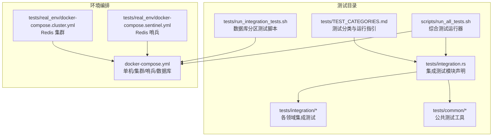
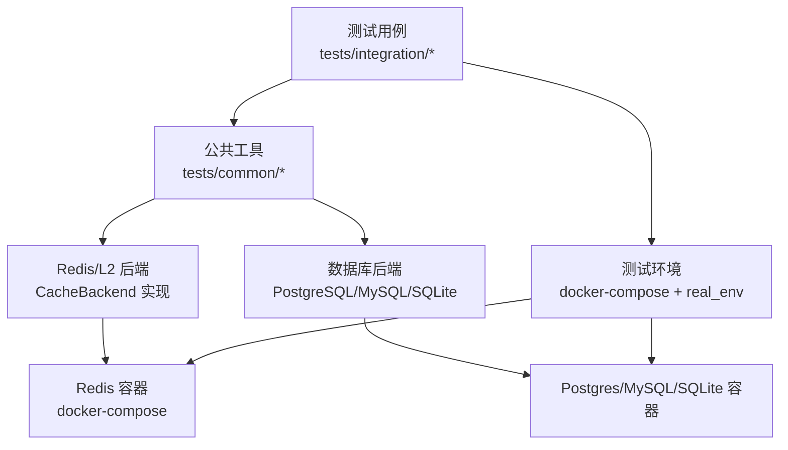
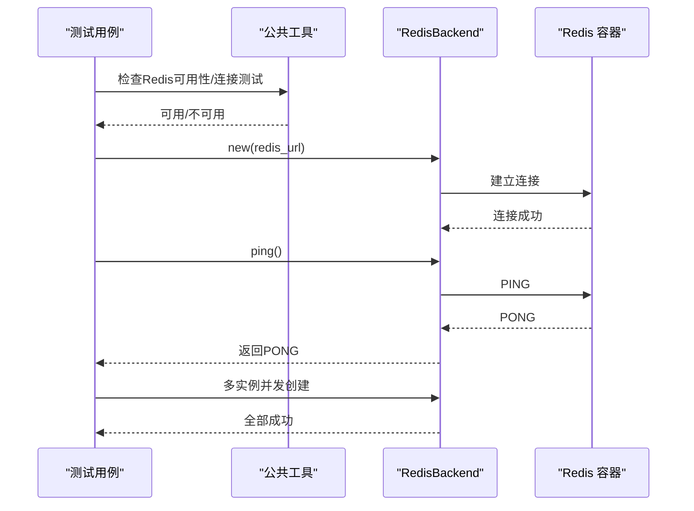
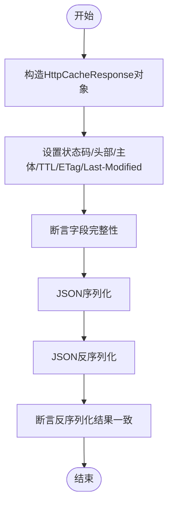
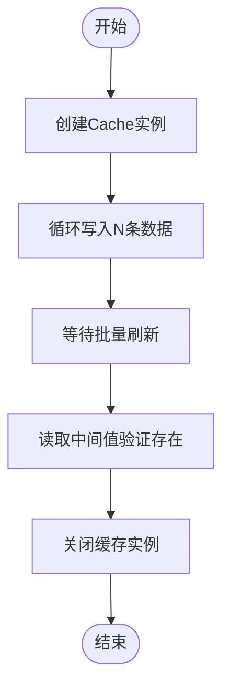
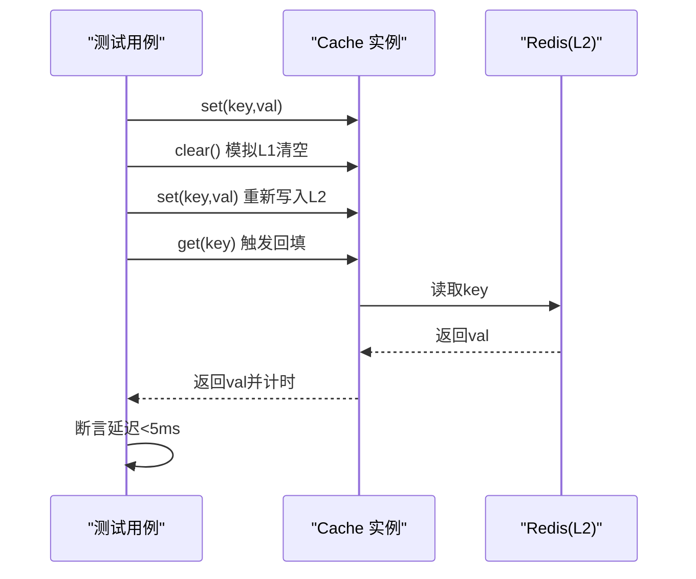
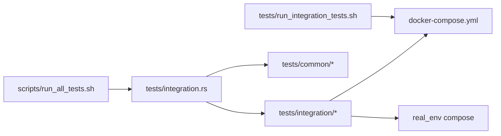

# 集成测试

<cite>
**本文引用的文件**
- [tests/integration.rs](file://tests/integration.rs)
- [tests/TEST_CATEGORIES.md](file://tests/TEST_CATEGORIES.md)
- [tests/run_integration_tests.sh](file://tests/run_integration_tests.sh)
- [scripts/run_all_tests.sh](file://scripts/run_all_tests.sh)
- [docker-compose.yml](file://docker-compose.yml)
- [tests/real_env/docker-compose.cluster.yml](file://tests/real_env/docker-compose.cluster.yml)
- [tests/real_env/docker-compose.sentinel.yml](file://tests/real_env/docker-compose.sentinel.yml)
- [tests/integration/redis_test.rs](file://tests/integration/redis_test.rs)
- [tests/integration/http_cache_test.rs](file://tests/integration/http_cache_test.rs)
- [tests/integration/lifecycle_test.rs](file://tests/integration/lifecycle_test.rs)
- [tests/integration/batch_write_test.rs](file://tests/integration/batch_write_test.rs)
- [tests/integration/comprehensive_test.rs](file://tests/integration/comprehensive_test.rs)
- [tests/integration/performance_test.rs](file://tests/integration/performance_test.rs)
- [tests/common/redis_test_utils.rs](file://tests/common/redis_test_utils.rs)
</cite>

## 目录
1. [引言](#引言)
2. [项目结构](#项目结构)
3. [核心组件](#核心组件)
4. [架构总览](#架构总览)
5. [详细组件分析](#详细组件分析)
6. [依赖关系分析](#依赖关系分析)
7. [性能考量](#性能考量)
8. [故障排查指南](#故障排查指南)
9. [结论](#结论)
10. [附录](#附录)

## 引言
本文件系统性阐述 Oxcache 的集成测试策略与实施方法，覆盖多组件协作、缓存链路、后端交互等关键目标。内容包含 Redis 集成测试、HTTP 缓存集成测试、生命周期测试、批量写入测试等场景，并提供环境搭建指南（Docker 配置、Redis 集群与哨兵）、测试数据准备、环境隔离与清理策略，帮助开发者高效落地与维护集成测试。

## 项目结构
Oxcache 的测试采用分层组织：tests/integration 下按功能域划分具体测试文件；通过 tests/integration.rs 统一声明与聚合；配套 docker-compose 提供真实环境容器编排；scripts 提供一键运行与报告生成脚本。

**图示来源**
- [tests/integration.rs](file://tests/integration.rs#L1-L62)
- [tests/TEST_CATEGORIES.md](file://tests/TEST_CATEGORIES.md#L1-L177)
- [tests/run_integration_tests.sh](file://tests/run_integration_tests.sh#L1-L103)
- [scripts/run_all_tests.sh](file://scripts/run_all_tests.sh#L1-L388)
- [docker-compose.yml](file://docker-compose.yml#L1-L199)
- [tests/real_env/docker-compose.cluster.yml](file://tests/real_env/docker-compose.cluster.yml#L1-L169)
- [tests/real_env/docker-compose.sentinel.yml](file://tests/real_env/docker-compose.sentinel.yml#L1-L135)

**章节来源**
- [tests/integration.rs](file://tests/integration.rs#L1-L62)
- [tests/TEST_CATEGORIES.md](file://tests/TEST_CATEGORIES.md#L1-L177)

## 核心组件
- 集成测试入口与组织
  - tests/integration.rs 通过 #[path = "..."] 统一声明各领域测试模块，形成清晰的“模块声明 + 功能文件”结构，便于扩展与维护。
- 公共测试工具
  - tests/common/redis_test_utils.rs 提供 Redis 可用性检测、连接测试、后端创建等通用能力，降低重复代码。
- 环境编排与运行脚本
  - docker-compose.yml 提供 Redis 单机、哨兵、集群与数据库服务；real_env 下的 cluster/sentinel compose 用于真实高可用场景；run_all_tests.sh 与 run_integration_tests.sh 提供统一运行与报告生成。

**章节来源**
- [tests/integration.rs](file://tests/integration.rs#L10-L62)
- [tests/common/redis_test_utils.rs](file://tests/common/redis_test_utils.rs#L1-L77)
- [docker-compose.yml](file://docker-compose.yml#L1-L199)
- [tests/real_env/docker-compose.cluster.yml](file://tests/real_env/docker-compose.cluster.yml#L1-L169)
- [tests/real_env/docker-compose.sentinel.yml](file://tests/real_env/docker-compose.sentinel.yml#L1-L135)
- [tests/run_integration_tests.sh](file://tests/run_integration_tests.sh#L1-L103)
- [scripts/run_all_tests.sh](file://scripts/run_all_tests.sh#L1-L388)

## 架构总览
下图展示集成测试在真实环境中的交互关系：测试通过公共工具连接 Redis/L2 后端，验证缓存链路与多组件协作；数据库测试通过 docker-compose 启动 PostgreSQL/MySQL/SQLite 并进行分区与跨库集成验证。

**图示来源**
- [tests/integration/redis_test.rs](file://tests/integration/redis_test.rs#L1-L153)
- [tests/common/redis_test_utils.rs](file://tests/common/redis_test_utils.rs#L1-L77)
- [docker-compose.yml](file://docker-compose.yml#L1-L199)

## 详细组件分析

### Redis 集成测试
- 目标
  - 验证 RedisBackend 在 Standalone/Cluster/Sentinel 场景下的可用性、连接字符串容错、PING 命令、多实例并发连接与错误处理。
- 关键场景
  - Standalone 模式创建与基本操作
  - 连接字符串变体（含 DB 选择）测试
  - PING 命令返回值校验
  - 多实例并发连接
  - 无效连接字符串错误处理
- 实施要点
  - 使用公共工具检测 Redis 可用性与连通性
  - 通过 docker-compose 提供本地 Redis 单机服务
  - 对连接错误进行断言，确保错误路径可被覆盖

**图示来源**
- [tests/integration/redis_test.rs](file://tests/integration/redis_test.rs#L16-L153)
- [tests/common/redis_test_utils.rs](file://tests/common/redis_test_utils.rs#L38-L65)
- [docker-compose.yml](file://docker-compose.yml#L7-L17)

**章节来源**
- [tests/integration/redis_test.rs](file://tests/integration/redis_test.rs#L1-L153)
- [tests/common/redis_test_utils.rs](file://tests/common/redis_test_utils.rs#L1-L77)

### HTTP 缓存集成测试
- 目标
  - 验证 HTTP 缓存响应模型的字段完整性、ETag/Headers 支持、序列化与反序列化正确性。
- 关键场景
  - 基础响应结构
  - ETag 字段存在与一致性
  - 多 Header 场景
  - 不同状态码响应
  - JSON 序列化/反序列化
- 实施要点
  - 仅在启用 http-cache 与 redis 特性时运行
  - 使用 HashMap 表达响应头，验证 ETag/Last-Modified 等字段

**图示来源**
- [tests/integration/http_cache_test.rs](file://tests/integration/http_cache_test.rs#L10-L127)

**章节来源**
- [tests/integration/http_cache_test.rs](file://tests/integration/http_cache_test.rs#L1-L127)

### 生命周期测试
- 目标
  - 验证缓存客户端生命周期管理（创建、运行、关闭）。
- 当前状态
  - 新 API 需要重新实现 TwoLevelClient 相关能力，当前为简化版本，标注注释并跳过测试。
- 建议
  - 在新 API 完成生命周期实现后补齐测试用例。

**章节来源**
- [tests/integration/lifecycle_test.rs](file://tests/integration/lifecycle_test.rs#L1-L25)

### 批量写入测试
- 目标
  - 验证批量写入对性能的提升与正确性，确保数据最终可见。
- 关键场景
  - 快速写入 N 个项目
  - 等待批量刷新
  - 校验中间值存在
  - 清理资源
- 实施要点
  - 使用新 API Cache::redis 创建 Redis 缓存实例
  - 通过 sleep 等待批量刷新窗口
  - shutdown 清理资源

**图示来源**
- [tests/integration/batch_write_test.rs](file://tests/integration/batch_write_test.rs#L16-L46)

**章节来源**
- [tests/integration/batch_write_test.rs](file://tests/integration/batch_write_test.rs#L1-L46)

### 综合功能测试
- 目标
  - 验证新 Cache API 的基础 SET/GET/DELETE/CLEAR 等核心能力与多类型支持。
- 关键场景
  - 基础 CRUD 循环
  - 多类型缓存实例（String/Vec<u8>/i32/i64/bool）
  - 边界情况（空键/空值/长键）
- 实施要点
  - 逐项断言操作成功与结果正确
  - 清理阶段调用 clear 清空数据

**章节来源**
- [tests/integration/comprehensive_test.rs](file://tests/integration/comprehensive_test.rs#L1-L139)

### 性能测试
- 目标
  - 验证回填延迟（L1未命中、L2命中）是否满足 NF2 要求（<5ms），并验证 Redis 故障时的降级行为。
- 关键场景
  - 回填延迟测量：清空 L1 后读取，统计耗时并断言
  - Redis 故障降级：连接无效端口，首次操作报错
- 实施要点
  - 使用 Instant 计时
  - 通过 clear 模拟 L1 清空
  - 验证错误路径与日志提示

**图示来源**
- [tests/integration/performance_test.rs](file://tests/integration/performance_test.rs#L19-L99)

**章节来源**
- [tests/integration/performance_test.rs](file://tests/integration/performance_test.rs#L1-L99)

## 依赖关系分析
- 模块耦合
  - tests/integration.rs 作为聚合入口，集中声明各领域测试模块，降低上层调用复杂度。
  - tests/common 提供 Redis/L2 后端抽象与工具函数，被多个测试复用。
- 外部依赖
  - Redis/L2 后端实现依赖 Redis 容器；数据库测试依赖 Postgres/MySQL/SQLite 容器。
- 运行脚本
  - run_all_tests.sh 统一调度单元/集成/安全/内存/兼容性/质量检查，生成汇总报告。
  - run_integration_tests.sh 专注数据库分区测试，包含 Docker 启停与健康检查。

**图示来源**
- [tests/integration.rs](file://tests/integration.rs#L10-L62)
- [scripts/run_all_tests.sh](file://scripts/run_all_tests.sh#L114-L136)
- [tests/run_integration_tests.sh](file://tests/run_integration_tests.sh#L42-L92)
- [docker-compose.yml](file://docker-compose.yml#L1-L199)

**章节来源**
- [tests/integration.rs](file://tests/integration.rs#L1-L62)
- [scripts/run_all_tests.sh](file://scripts/run_all_tests.sh#L114-L136)
- [tests/run_integration_tests.sh](file://tests/run_integration_tests.sh#L1-L103)

## 性能考量
- 回填延迟测试
  - 通过 clear 模拟 L1 未命中，验证从 L2 加载数据的延迟是否满足 <5ms 的性能目标。
- 批量写入
  - 通过批量写入减少网络往返，结合等待刷新窗口验证吞吐与一致性。
- 环境因素
  - Redis 远程或网络不稳定可能导致延迟测试失败，建议优先使用本地 Docker 环境。

[本节为通用指导，无需列出具体文件来源]

## 故障排查指南
- Redis 不可用
  - 症状：测试跳过或连接失败
  - 排查：确认 docker-compose 正常启动 Redis 容器；使用公共工具进行连接测试；检查环境变量 OXCACHE_SKIP_REDIS_TESTS 是否被设置
- 数据库分区测试失败
  - 症状：PostgreSQL/MySQL/SQLite 未就绪
  - 排查：查看 run_integration_tests.sh 的健康检查输出；确认容器日志与端口映射
- 报告生成与日志定位
  - run_all_tests.sh 将各测试输出重定向至独立日志文件，便于定位失败原因
- 清理策略
  - Redis：公共工具提供清理占位接口，可在需要时扩展
  - 数据库：docker-compose 自动挂载卷，测试结束后可保留数据以便复盘

**章节来源**
- [tests/common/redis_test_utils.rs](file://tests/common/redis_test_utils.rs#L67-L77)
- [tests/run_integration_tests.sh](file://tests/run_integration_tests.sh#L30-L92)
- [scripts/run_all_tests.sh](file://scripts/run_all_tests.sh#L94-L136)

## 结论
Oxcache 的集成测试体系以模块化组织、公共工具复用与真实环境编排为核心，覆盖 Redis/L2 后端、HTTP 缓存、生命周期、批量写入与性能等关键场景。通过 docker-compose 与 real_env compose 提供多样化部署形态，配合 run_all_tests.sh 与 run_integration_tests.sh 实现自动化运行与报告生成。建议在新 API 完成生命周期与更多降级策略后进一步完善测试矩阵，持续保障多组件协同的稳定性与性能。

## 附录

### 环境搭建指南
- 本地 Redis 单机
  - 使用 docker-compose.yml 启动 redis-standalone，端口映射 6379:6379
- Redis 集群
  - 使用 tests/real_env/docker-compose.cluster.yml 启动 6 节点集群，自动创建并检查状态
- Redis 哨兵
  - 使用 tests/real_env/docker-compose.sentinel.yml 启动主/从节点与 3 个哨兵，提供高可用测试
- 数据库分区测试
  - 使用 run_integration_tests.sh 启动 PostgreSQL/MySQL/SQLite，等待服务就绪后运行分区测试

**章节来源**
- [docker-compose.yml](file://docker-compose.yml#L7-L17)
- [tests/real_env/docker-compose.cluster.yml](file://tests/real_env/docker-compose.cluster.yml#L1-L169)
- [tests/real_env/docker-compose.sentinel.yml](file://tests/real_env/docker-compose.sentinel.yml#L1-L135)
- [tests/run_integration_tests.sh](file://tests/run_integration_tests.sh#L42-L92)

### 测试数据准备与清理
- 测试数据准备
  - Redis：通过公共工具进行 SET/GET/DELETE 基本操作验证
  - 数据库：依赖 docker-compose 自动创建数据库与表结构
- 清理策略
  - Redis：可扩展公共工具的清理接口
  - 数据库：容器停止后数据持久化在卷中，可选择保留或清理卷

**章节来源**
- [tests/common/redis_test_utils.rs](file://tests/common/redis_test_utils.rs#L38-L65)
- [docker-compose.yml](file://docker-compose.yml#L148-L199)
