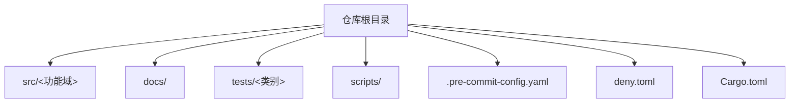
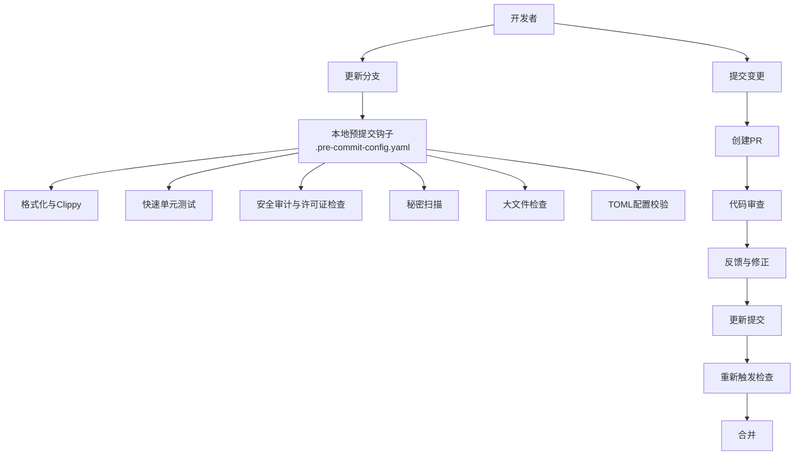
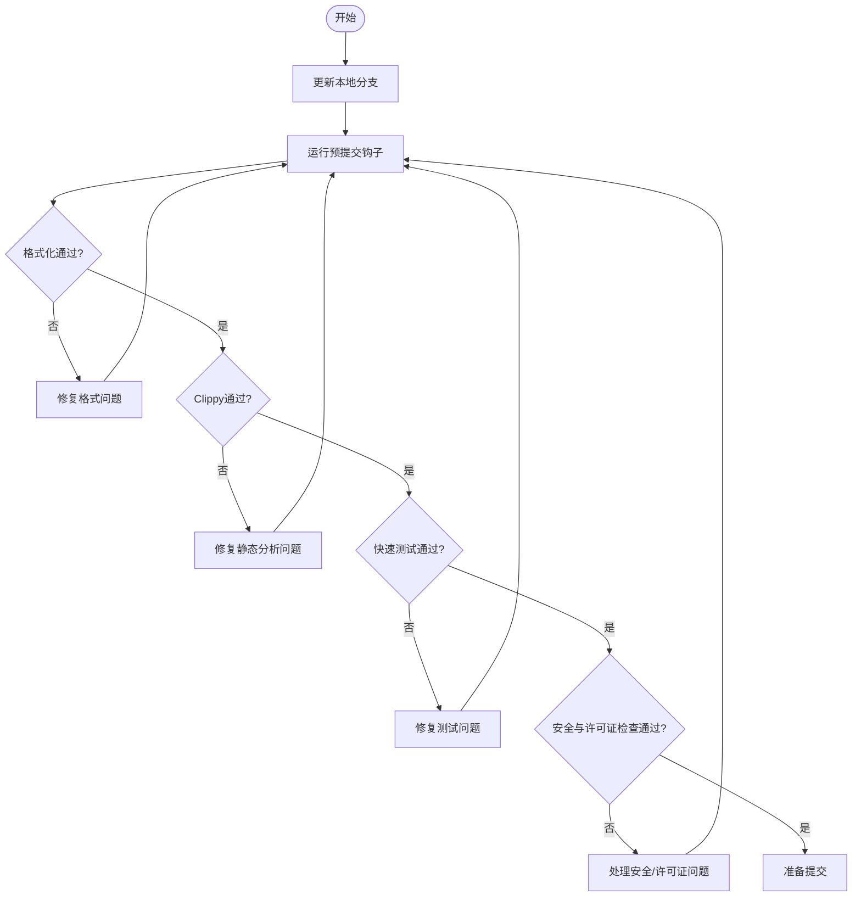
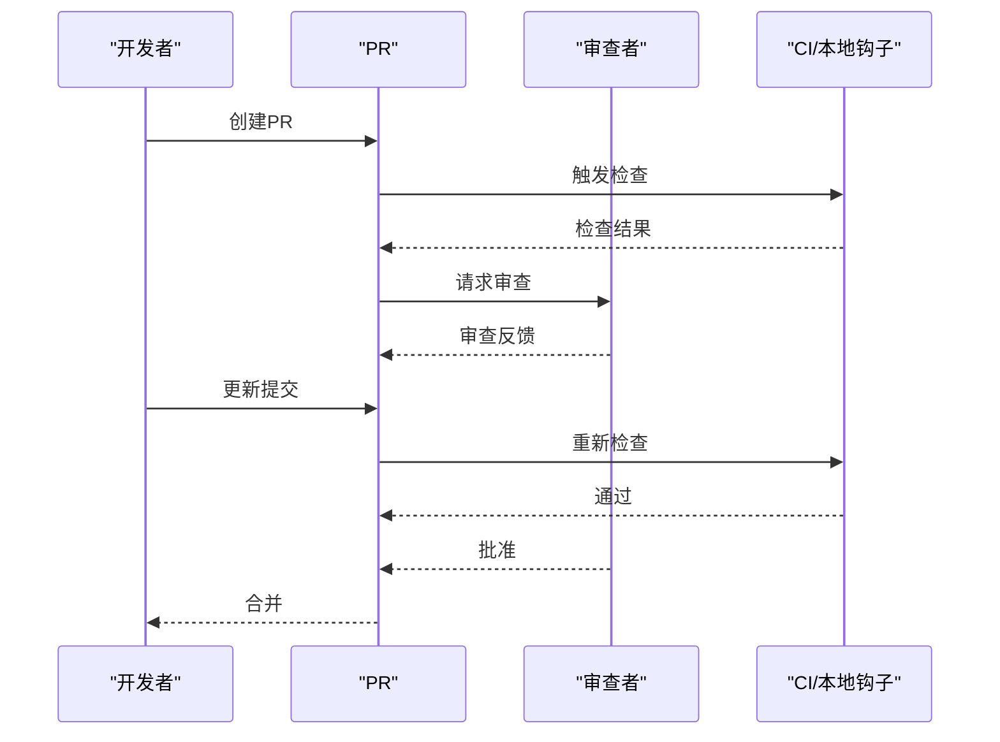
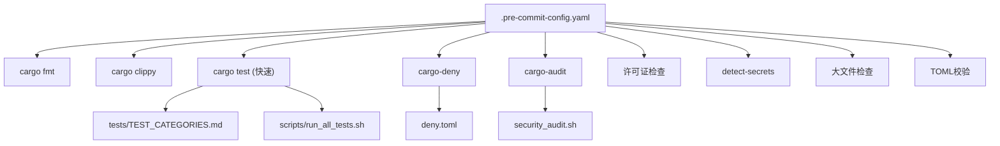

# Pull Request 流程

<cite>
**本文引用的文件**
- [.pre-commit-config.yaml](file://.pre-commit-config.yaml)
- [Cargo.toml](file://Cargo.toml)
- [README.md](file://README.md)
- [docs/USER_GUIDE.md](file://docs/USER_GUIDE.md)
- [docs/ARCHITECTURE.md](file://docs/ARCHITECTURE.md)
- [scripts/precommit_clippy.sh](file://scripts/precommit_clippy.sh)
- [scripts/precommit_tests.sh](file://scripts/precommit_tests.sh)
- [scripts/run_all_tests.sh](file://scripts/run_all_tests.sh)
- [scripts/security_audit.sh](file://scripts/security_audit.sh)
- [deny.toml](file://deny.toml)
- [tests/TEST_CATEGORIES.md](file://tests/TEST_CATEGORIES.md)
- [scripts/lib/common.sh](file://scripts/lib/common.sh)
</cite>

## 目录
1. [引言](#引言)
2. [项目结构](#项目结构)
3. [核心组件](#核心组件)
4. [架构总览](#架构总览)
5. [详细组件分析](#详细组件分析)
6. [依赖关系分析](#依赖关系分析)
7. [性能考虑](#性能考虑)
8. [故障排除指南](#故障排除指南)
9. [结论](#结论)
10. [附录](#附录)

## 引言
本文件系统化阐述 Oxcache 项目的 Pull Request 创建与审查流程，覆盖从更新分支、运行本地检查、提交变更到创建 PR 的完整步骤；明确 PR 检查清单的各项要求（代码风格、测试、文档、提交信息等）；说明代码审查流程（审查者分配、反馈处理、修改更新）；并给出合并前的最终检查与合并策略，确保代码质量与项目稳定性。

## 项目结构
Oxcache 采用模块化与功能分层的组织方式：
- 核心库位于 src/，按功能域划分为 backend、builder、client、config、database、http、metrics、recovery、security、serialization、sync、traits、utils 等子模块
- 文档位于 docs/，包含用户指南、架构说明、API 参考、安全策略等
- 测试位于 tests/，按类别组织（integration、unit、e2e、chaos 等）
- 脚本位于 scripts/，提供预提交钩子、安全审计、综合测试等自动化工具
- 配置文件包括 .pre-commit-config.yaml、deny.toml、Cargo.toml 等

章节来源
- [Cargo.toml](file://Cargo.toml#L1-L377)
- [tests/TEST_CATEGORIES.md](file://tests/TEST_CATEGORIES.md#L1-L177)

## 核心组件
- 预提交钩子系统：通过 .pre-commit-config.yaml 配置 Rust 格式化、Clippy、快速测试、安全审计、许可证合规、秘密扫描、大文件检查、TOML 校验等
- 代码质量与安全：deny.toml 管理漏洞与许可证策略；security_audit.sh 提供安全审计能力
- 测试体系：tests/TEST_CATEGORIES.md 描述测试分类与运行方式；scripts/run_all_tests.sh 提供综合测试运行器
- 文档与规范：README.md、docs/USER_GUIDE.md、docs/ARCHITECTURE.md 提供使用与架构说明

章节来源
- [.pre-commit-config.yaml](file://.pre-commit-config.yaml#L1-L129)
- [deny.toml](file://deny.toml#L1-L39)
- [scripts/security_audit.sh](file://scripts/security_audit.sh#L1-L401)
- [tests/TEST_CATEGORIES.md](file://tests/TEST_CATEGORIES.md#L1-L177)
- [scripts/run_all_tests.sh](file://scripts/run_all_tests.sh#L1-L388)
- [README.md](file://README.md#L1-L414)
- [docs/USER_GUIDE.md](file://docs/USER_GUIDE.md#L1-L800)
- [docs/ARCHITECTURE.md](file://docs/ARCHITECTURE.md#L1-L723)

## 架构总览
下图展示 PR 流程中涉及的关键组件与交互：

图表来源
- [.pre-commit-config.yaml](file://.pre-commit-config.yaml#L1-L129)
- [scripts/precommit_clippy.sh](file://scripts/precommit_clippy.sh#L1-L62)
- [scripts/precommit_tests.sh](file://scripts/precommit_tests.sh#L1-L51)
- [scripts/security_audit.sh](file://scripts/security_audit.sh#L1-L401)
- [deny.toml](file://deny.toml#L1-L39)

## 详细组件分析

### 1. 更新分支与本地检查
- 基于主干创建特性分支，保持与上游同步，减少冲突
- 在提交前运行本地预提交钩子，确保通过格式化、静态分析、快速测试、安全与合规检查

图表来源
- [.pre-commit-config.yaml](file://.pre-commit-config.yaml#L1-L129)
- [scripts/precommit_clippy.sh](file://scripts/precommit_clippy.sh#L1-L62)
- [scripts/precommit_tests.sh](file://scripts/precommit_tests.sh#L1-L51)
- [scripts/security_audit.sh](file://scripts/security_audit.sh#L1-L401)
- [deny.toml](file://deny.toml#L1-L39)

章节来源
- [.pre-commit-config.yaml](file://.pre-commit-config.yaml#L1-L129)
- [scripts/precommit_clippy.sh](file://scripts/precommit_clippy.sh#L1-L62)
- [scripts/precommit_tests.sh](file://scripts/precommit_tests.sh#L1-L51)
- [scripts/security_audit.sh](file://scripts/security_audit.sh#L1-L401)
- [deny.toml](file://deny.toml#L1-L39)

### 2. PR 检查清单
- 代码风格与格式
  - 通过 cargo fmt 检查与修复
  - 通过 Clippy 静态分析，遵循建议或必要时添加允许注解
- 测试要求
  - 本地快速测试通过（优先保证核心路径）
  - 如涉及复杂功能，补充单元/集成测试
- 文档更新
  - 更新相关文档（docs/USER_GUIDE.md、docs/ARCHITECTURE.md 等）
  - 更新 README.md 中的变更说明
- 提交信息规范
  - 使用清晰、简洁的提交信息，描述变更动机与影响
  - 遵循项目约定的提交格式（建议在团队内统一）

章节来源
- [README.md](file://README.md#L1-L414)
- [docs/USER_GUIDE.md](file://docs/USER_GUIDE.md#L1-L800)
- [docs/ARCHITECTURE.md](file://docs/ARCHITECTURE.md#L1-L723)
- [.pre-commit-config.yaml](file://.pre-commit-config.yaml#L1-L129)

### 3. 代码审查流程
- 审查者分配
  - 根据变更范围与模块归属，指派相关维护者或领域专家
- 反馈处理
  - 对审查意见逐条响应，必要时提供背景说明
  - 修改后重新提交，触发新一轮检查
- 合并策略
  - 至少一名维护者批准
  - 所有检查通过（含 CI 与本地钩子）
  - 无阻塞性审查意见

图表来源
- [.pre-commit-config.yaml](file://.pre-commit-config.yaml#L1-L129)
- [scripts/precommit_clippy.sh](file://scripts/precommit_clippy.sh#L1-L62)
- [scripts/precommit_tests.sh](file://scripts/precommit_tests.sh#L1-L51)
- [scripts/security_audit.sh](file://scripts/security_audit.sh#L1-L401)
- [deny.toml](file://deny.toml#L1-L39)

### 4. 合并前最终检查与策略
- 最终检查
  - 本地再次运行综合测试（如需）
  - 确认文档与变更日志更新
  - 确保提交信息清晰、符合规范
- 合并策略
  - 优先使用 Squash 合并以保持提交历史整洁
  - 关联相关 Issue 与测试用例
  - 合并后清理分支

章节来源
- [scripts/run_all_tests.sh](file://scripts/run_all_tests.sh#L1-L388)
- [tests/TEST_CATEGORIES.md](file://tests/TEST_CATEGORIES.md#L1-L177)

## 依赖关系分析
- 预提交钩子依赖
  - Rust 工具链（cargo、rustc）、Git、外部工具（cargo-audit、detect-secrets 等）
- 安全与许可证策略
  - deny.toml 定义漏洞数据库、允许的许可证集合、依赖白名单
- 测试与文档
  - tests/TEST_CATEGORIES.md 描述测试分类与运行方式
  - scripts/run_all_tests.sh 提供统一的测试运行与报告生成

图表来源
- [.pre-commit-config.yaml](file://.pre-commit-config.yaml#L1-L129)
- [deny.toml](file://deny.toml#L1-L39)
- [scripts/security_audit.sh](file://scripts/security_audit.sh#L1-L401)
- [tests/TEST_CATEGORIES.md](file://tests/TEST_CATEGORIES.md#L1-L177)
- [scripts/run_all_tests.sh](file://scripts/run_all_tests.sh#L1-L388)

章节来源
- [.pre-commit-config.yaml](file://.pre-commit-config.yaml#L1-L129)
- [deny.toml](file://deny.toml#L1-L39)
- [scripts/security_audit.sh](file://scripts/security_audit.sh#L1-L401)
- [tests/TEST_CATEGORIES.md](file://tests/TEST_CATEGORIES.md#L1-L177)
- [scripts/run_all_tests.sh](file://scripts/run_all_tests.sh#L1-L388)

## 性能考虑
- 预提交阶段仅运行“快速测试”，避免长时间等待
- 综合测试可在本地或 CI 中按需运行，确保关键路径稳定
- 通过 Clippy 与格式化减少潜在性能隐患与维护成本

## 故障排除指南
- 预提交失败
  - 格式化失败：运行格式化工具修复
  - Clippy 失败：根据输出定位问题，必要时使用允许注解
  - 测试失败：查看详细输出，定位失败用例并修复
  - 安全/许可证问题：根据 deny.toml 与审计报告调整依赖或策略
- 审查反馈
  - 对审查意见逐条响应，提供背景说明或修改方案
  - 修改后重新提交，确保通过所有检查

章节来源
- [scripts/precommit_clippy.sh](file://scripts/precommit_clippy.sh#L1-L62)
- [scripts/precommit_tests.sh](file://scripts/precommit_tests.sh#L1-L51)
- [scripts/security_audit.sh](file://scripts/security_audit.sh#L1-L401)
- [deny.toml](file://deny.toml#L1-L39)
- [scripts/lib/common.sh](file://scripts/lib/common.sh#L1-L232)

## 结论
通过严格的预提交钩子、完善的测试与安全策略、清晰的审查流程与合并策略，Oxcache 项目能够高效、稳定地推进变更。建议在团队内统一约定提交信息格式与审查反馈响应流程，持续优化检查项与测试覆盖面，保障代码质量与项目长期健康发展。

## 附录
- 快速参考
  - 运行本地检查：预提交钩子自动执行
  - 运行综合测试：使用综合测试脚本
  - 安全审计：使用安全审计脚本
  - 查看测试分类：参考测试组织指南

章节来源
- [scripts/run_all_tests.sh](file://scripts/run_all_tests.sh#L1-L388)
- [scripts/security_audit.sh](file://scripts/security_audit.sh#L1-L401)
- [tests/TEST_CATEGORIES.md](file://tests/TEST_CATEGORIES.md#L1-L177)
- [scripts/lib/common.sh](file://scripts/lib/common.sh#L1-L232)
