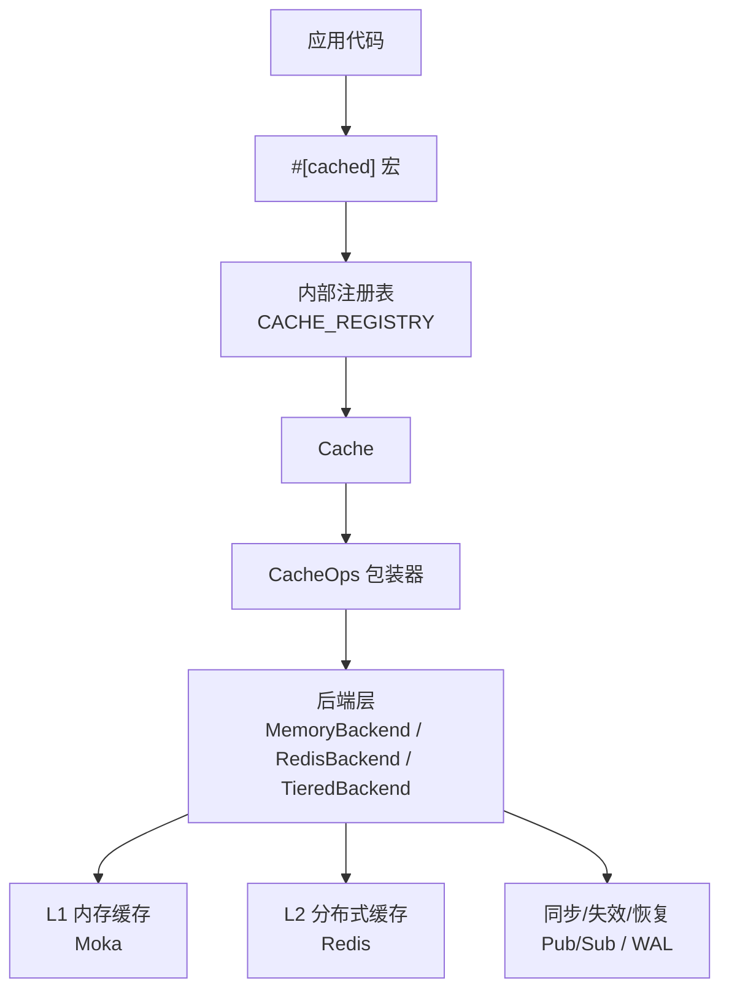
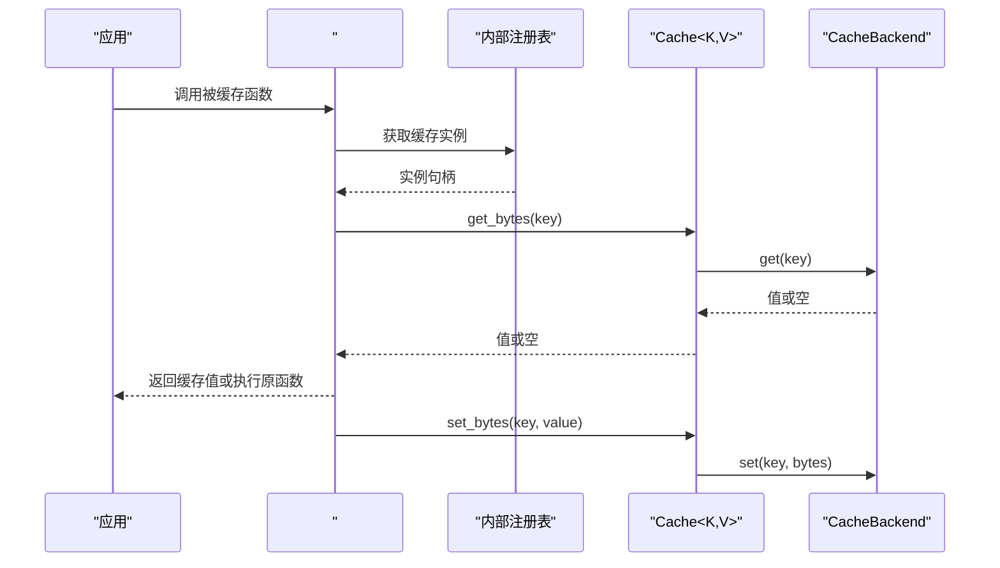
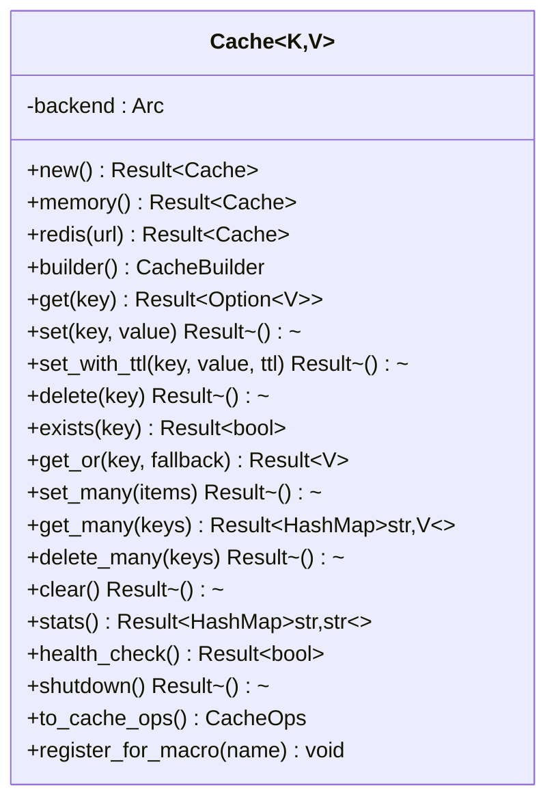
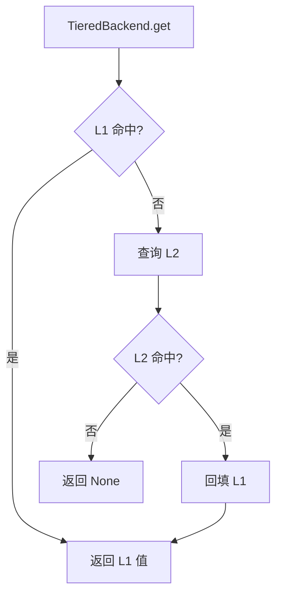
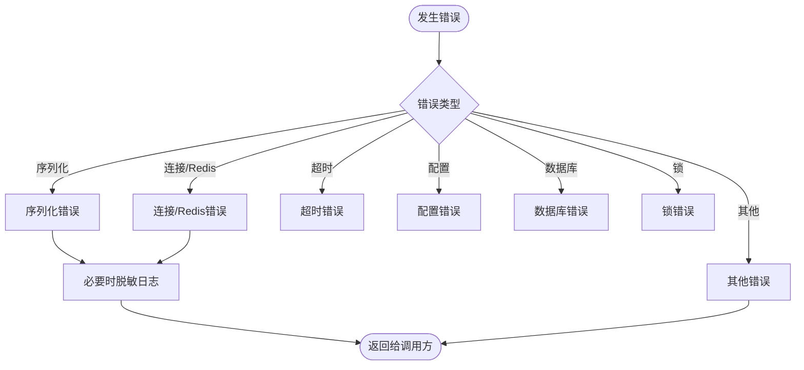
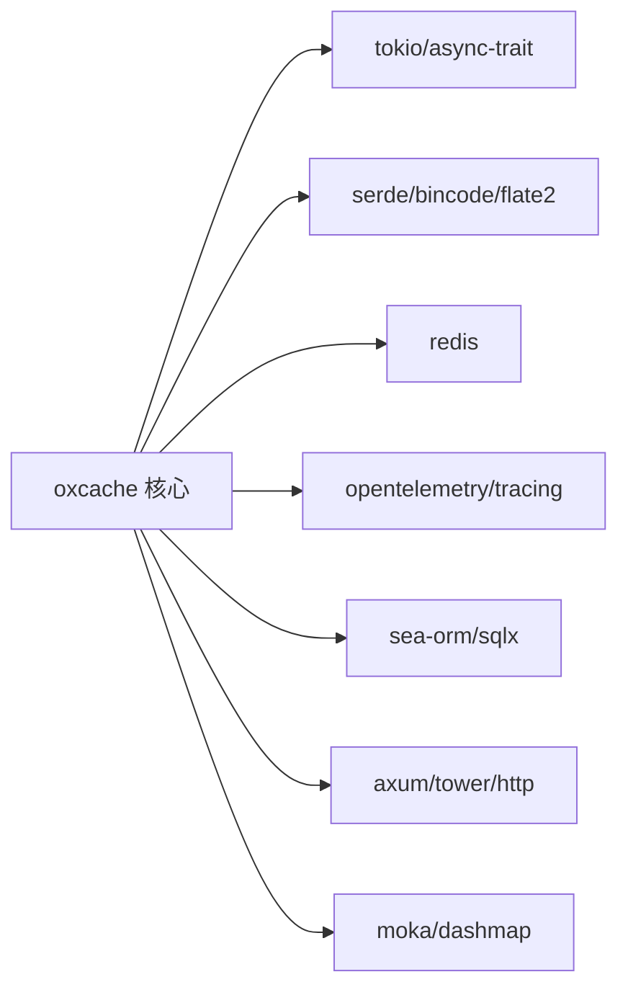
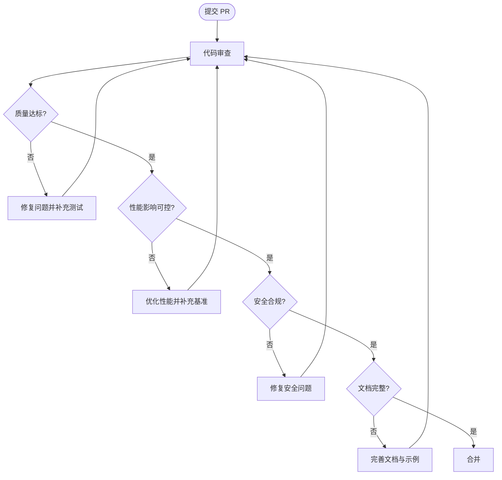

# 代码审查标准

<cite>
**本文引用的文件**
- [README.md](file://README.md)
- [Cargo.toml](file://Cargo.toml)
- [src/lib.rs](file://src/lib.rs)
- [src/cache.rs](file://src/cache.rs)
- [src/backend/mod.rs](file://src/backend/mod.rs)
- [src/error.rs](file://src/error.rs)
- [docs/ARCHITECTURE.md](file://docs/ARCHITECTURE.md)
- [docs/API_REFERENCE.md](file://docs/API_REFERENCE.md)
- [benches/cache_benchmark.rs](file://benches/cache_benchmark.rs)
- [scripts/pre-commit/precommit_clippy.sh](file://scripts/pre-commit/precommit_clippy.sh)
- [scripts/tests/run_all_tests.sh](file://scripts/tests/run_all_tests.sh)
- [tests/unit.rs](file://tests/unit.rs)
</cite>

## 目录
1. [引言](#引言)
2. [项目结构](#项目结构)
3. [核心组件](#核心组件)
4. [架构概览](#架构概览)
5. [详细组件分析](#详细组件分析)
6. [依赖分析](#依赖分析)
7. [性能考量](#性能考量)
8. [故障排查指南](#故障排查指南)
9. [结论](#结论)
10. [附录](#附录)

## 引言
本文件为 Oxcache 项目的代码审查标准与最佳实践指南，面向贡献者与维护者，旨在统一代码质量、性能、安全性、可测试性与可维护性要求。审查重点覆盖：代码质量、性能影响、安全性考虑、测试覆盖率、文档完整性、错误处理、异步编程实践等；并提供可复用的审查清单模板与检查要点，以及有效反馈与沟通建议。

## 项目结构
Oxcache 是一个高性能两级缓存库，采用现代 Rust 架构，支持 L1（内存，Moka）+ L2（Redis 分布式）缓存，并提供零代码变更的缓存宏、可观测性、安全防护与自动降级能力。项目采用分层模块化设计，核心模块包括：
- 现代化 API（Cache、CacheOps、Builder）
- 后端抽象（MemoryBackend、RedisBackend、TieredBackend）
- 客户端与工具（序列化、指标、安全、HTTP 缓存等）
- 功能特性门控（feature flags）与条件编译
- 全面的测试与基准测试套件

图表来源
- [docs/ARCHITECTURE.md](file://docs/ARCHITECTURE.md#L36-L73)
- [src/cache.rs](file://src/cache.rs#L117-L120)

章节来源
- [README.md](file://README.md#L16-L58)
- [docs/ARCHITECTURE.md](file://docs/ARCHITECTURE.md#L34-L73)

## 核心组件
- 现代化 API（推荐）：Cache、CacheOps、Builder 模式，提供类型安全的缓存接口与灵活配置。
- 后端抽象：统一 CacheBackend trait，支持内存与 Redis 后端及两级缓存组合。
- 宏与注册表：#[cached] 宏通过内部注册表实现服务名到缓存实例的映射。
- 错误模型：统一的 CacheError 枚举，支持敏感信息脱敏与错误分类判断。
- 特性门控：通过 feature flags 控制功能启用，编译期依赖校验与占位实现。

章节来源
- [src/cache.rs](file://src/cache.rs#L87-L120)
- [src/backend/mod.rs](file://src/backend/mod.rs#L13-L26)
- [src/error.rs](file://src/error.rs#L75-L208)
- [src/lib.rs](file://src/lib.rs#L417-L460)

## 架构概览
Oxcache 的架构强调“高性能、可靠性、易用性、可观测性与安全性”。两级缓存读写路径、失效传播、健康检查与 WAL 恢复构成核心运行机制。宏驱动的零代码变更缓存接入，配合 Builder 模式与配置文件，实现从简单到复杂的渐进式使用。

图表来源
- [docs/ARCHITECTURE.md](file://docs/ARCHITECTURE.md#L381-L406)
- [src/cache.rs](file://src/cache.rs#L241-L264)

章节来源
- [docs/ARCHITECTURE.md](file://docs/ARCHITECTURE.md#L375-L406)

## 详细组件分析

### 组件一：现代化缓存接口（Cache）
- 类型安全与泛型：K、V 必须实现 CacheKey、Cacheable，保证键值序列化与反序列化一致。
- 生命周期与资源管理：提供 shutdown/close 接口，确保优雅释放后端资源。
- 批量操作：set_many/get_many/delete_many，便于高吞吐场景优化。
- 注册与宏支持：to_cache_ops/register_for_macro，使 #[cached] 宏可按服务名检索缓存实例。

图表来源
- [src/cache.rs](file://src/cache.rs#L117-L646)

章节来源
- [src/cache.rs](file://src/cache.rs#L117-L646)

### 组件二：后端抽象与实现
- 抽象层：CacheBackend trait 定义 get/set/delete/exists/clear/stats/health_check/close 等统一接口。
- 内存后端：MokaMemoryBackend，支持 TinyLFU 等高效淘汰策略。
- Redis 后端：支持 Standalone/Sentinel/Cluster，连接池与批写优化。
- 两级后端：读命中 L1，未命中再查 L2 并回填 L1；写入 L1 立即生效，L2 异步批写并持久化。

图表来源
- [docs/ARCHITECTURE.md](file://docs/ARCHITECTURE.md#L201-L216)

章节来源
- [src/backend/mod.rs](file://src/backend/mod.rs#L13-L26)
- [docs/ARCHITECTURE.md](file://docs/ARCHITECTURE.md#L177-L216)

### 组件三：错误模型与安全
- 统一错误类型：CacheError 枚举涵盖序列化、连接、超时、配置、数据库、锁等错误类别。
- 敏感信息脱敏：对连接字符串进行脱敏处理，避免日志泄露。
- 错误分类辅助：提供 is_not_found/is_connection_error/is_degraded 等便捷判断。

图表来源
- [src/error.rs](file://src/error.rs#L75-L208)

章节来源
- [src/error.rs](file://src/error.rs#L75-L208)

### 组件四：特性门控与条件编译
- 特性组合：通过 feature flags 控制功能启用，如 moka、redis、serialization、metrics、wal-recovery、batch-write、bloom-filter、rate-limiting、http-cache 等。
- 编译期依赖校验：使用宏在编译期断言特性依赖关系，避免运行时错误。
- 占位实现：当特性未启用时，通过空实现结构体/方法保持接口一致性。

章节来源
- [Cargo.toml](file://Cargo.toml#L235-L346)
- [src/lib.rs](file://src/lib.rs#L670-L680)

## 依赖分析
- 依赖分层：核心依赖（tokio、async-trait、thiserror、anyhow）、序列化（serde、bincode、flate2）、数据库（sea-orm、sqlx）、Redis（redis）、可观测性（opentelemetry、tracing）、HTTP（axum、tower、http）等。
- 特性与依赖映射：各特性开启时自动引入对应依赖，未启用时通过条件编译与占位实现避免无用代码膨胀。
- 性能优化：release 配置启用 LTO、单代码生成单元、panic abort、strip、溢出检查关闭等。

图表来源
- [Cargo.toml](file://Cargo.toml#L20-L186)

章节来源
- [Cargo.toml](file://Cargo.toml#L235-L377)

## 性能考量
- L1/L2 性能目标：L1 读写约 50-100ns（P99），L2 读写约 1-5ms（P99）。
- 批写优化：L2 批写通过 MSET 提升吞吐，结合 flush 策略平衡延迟与吞吐。
- 连接池与并发：Redis 连接池与锁无关并发设计，降低竞争。
- 基准测试：提供 L1 基准测试，覆盖不同数据大小与批量场景。

章节来源
- [README.md](file://README.md#L328-L335)
- [benches/cache_benchmark.rs](file://benches/cache_benchmark.rs#L1-L100)
- [docs/ARCHITECTURE.md](file://docs/ARCHITECTURE.md#L608-L646)

## 故障排查指南
- 错误分类与定位：优先根据 CacheError 类型快速定位（连接、序列化、超时、配置等）。
- 日志与脱敏：利用脱敏后的连接字符串与统一错误消息，避免敏感信息泄露。
- 健康检查与降级：通过 health_check 判断后端健康状态，必要时进入 L1-only 模式。
- 回收与重放：WAL 在 Redis 恢复后重放，确保数据不丢失。

章节来源
- [src/error.rs](file://src/error.rs#L228-L288)
- [docs/ARCHITECTURE.md](file://docs/ARCHITECTURE.md#L276-L312)

## 结论
Oxcache 通过现代化 API、抽象后端、特性门控与完善的测试体系，提供了生产级的两级缓存能力。代码审查应围绕“质量—性能—安全—可测试—可维护”五个维度展开，结合本文提供的清单与流程，持续提升代码质量与交付稳定性。

## 附录

### 代码审查清单模板（可直接使用）
- 代码质量
  - 是否遵循 Rust 最佳实践（async/await、错误处理、所有权）？
  - 是否通过 Clippy（无新增警告）与格式化检查？
  - 是否存在重复代码与过度工程化？
- 性能影响
  - 是否引入阻塞或 CPU 密集操作？
  - 是否使用合适的并发与批处理策略？
  - 是否考虑 L1/L2 性能差异与热点数据处理？
- 安全性考虑
  - 是否对敏感信息（连接字符串、密钥）进行脱敏处理？
  - 是否存在输入验证与越界风险（键长度、值大小）？
  - 是否避免潜在的 DoS 攻击面（速率限制、超时）？
- 测试覆盖率
  - 是否补充单元测试与集成测试？
  - 是否覆盖边界条件（空键、超大值、并发冲突）？
  - 是否包含性能回归测试（基准）？
- 文档完整性
  - 是否更新 API 文档与架构说明？
  - 是否补充使用示例与注意事项？
- 错误处理
  - 是否使用统一的错误类型与错误分类？
  - 是否提供有意义的错误消息与上下文？
- 异步编程实践
  - 是否避免在 async 函数中阻塞运行时？
  - 是否合理使用超时与取消？
  - 是否正确传递错误而不吞噬异常？

### 审查检查要点
- 架构合理性
  - 是否符合两级缓存一致性模型与失效传播机制？
  - 是否充分利用特性门控与条件编译？
- 边界条件处理
  - 键/值大小限制、空值、不存在键的处理是否一致？
- 资源管理
  - 是否在 shutdown 中释放资源？是否避免资源泄漏？

### 审查反馈与沟通
- 建设性建议
  - 明确指出问题与改进方向，提供替代方案与参考实现路径。
- 问题解决流程
  - 评审意见与修改建议形成闭环，必要时进行二次评审与回归测试。

### 审查流程图（概念示意）

### 代码审查关注点与示例路径
- 现代化 API 使用
  - Cache::builder/Cache::memory/Cache::redis 的正确使用与配置
  - 参考：[src/cache.rs](file://src/cache.rs#L140-L222)
- 宏与注册表
  - #[cached] 宏的服务名解析与注册流程
  - 参考：[docs/ARCHITECTURE.md](file://docs/ARCHITECTURE.md#L379-L406)
- 错误处理与脱敏
  - CacheError 的分类与脱敏日志
  - 参考：[src/error.rs](file://src/error.rs#L75-L208)
- 特性门控与编译期校验
  - check_feature_dependence 与占位实现
  - 参考：[src/lib.rs](file://src/lib.rs#L670-L680)
- 测试与质量保障
  - 单元测试、集成测试、安全审计、内存测试与代码质量检查
  - 参考：[tests/unit.rs](file://tests/unit.rs#L1-L12)，[scripts/tests/run_all_tests.sh](file://scripts/tests/run_all_tests.sh#L94-L261)，[scripts/pre-commit/precommit_clippy.sh](file://scripts/pre-commit/precommit_clippy.sh#L1-L62)
- 性能基准
  - L1 基准测试与批量场景
  - 参考：[benches/cache_benchmark.rs](file://benches/cache_benchmark.rs#L1-L100)
