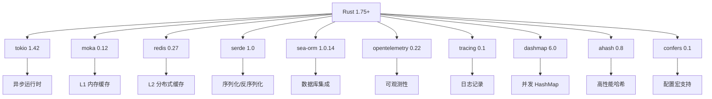

# 分支管理策略

<cite>
**本文档引用的文件**
- [AGENTS.md](file://AGENTS.md)
- [IFLOW.md](file://IFLOW.md)
- [.gitignore](file://.gitignore)
- [README.md](file://README.md)
- [docs/USER_GUIDE.md](file://docs/USER_GUIDE.md)
- [docs/ARCHITECTURE.md](file://docs/ARCHITECTURE.md)
- [scripts/precommit_tests.sh](file://scripts/precommit_tests.sh)
- [scripts/precommit_secrets.sh](file://scripts/precommit_secrets.sh)
- [scripts/precommit_audit.sh](file://scripts/precommit_audit.sh)
</cite>

## 目录
1. [引言](#引言)
2. [项目结构](#项目结构)
3. [核心组件](#核心组件)
4. [架构概览](#架构概览)
5. [详细组件分析](#详细组件分析)
6. [依赖分析](#依赖分析)
7. [性能考虑](#性能考虑)
8. [故障排除指南](#故障排除指南)
9. [结论](#结论)

## 引言

Oxcache 是一个高性能、生产级的 Rust 双层缓存库，提供 L1（Moka 内存缓存）+ L2（Redis 分布式缓存）的双层架构。该项目通过 `#[cached]` 宏实现零侵入式缓存，并通过 Pub/Sub 机制确保多实例缓存一致性。

### 核心特性

- **极致性能**：L1 纳秒级响应（P99 < 100ns），L2 毫秒级响应（P99 < 5ms）
- **零侵入式**：通过 `#[cached]` 宏一行代码启用缓存
- **自动故障恢复**：Redis 故障时自动降级，恢复后自动重放 WAL
- **多实例同步**：基于 Pub/Sub + 版本号的失效同步机制
- **批量优化**：智能批量写入，大幅提升吞吐量
- **生产级可靠**：完整的可观测性、健康检查、混沌测试验证
- **安全防护**：布隆过滤器防缓存穿透，速率限制防 DoS 攻击
- **缓存预热**：支持锁预热和数据库加载预热

## 项目结构

Oxcache 项目采用模块化的组织方式，主要目录结构如下：

```mermaid
graph TD
A[oxcache/] --> B[src/]
A --> C[macros/]
A --> D[tests/]
A --> E[examples/]
A --> F[benches/]
A --> G[scripts/]
A --> H[docs/]
B --> B1[backend/] # 缓存后端实现
B --> B2[client/] # 缓存客户端
B --> B3[config/] # 配置系统
B --> B4[sync/] # 同步机制
B --> B5[recovery/] # 故障恢复
B --> B6[database/] # 数据库集成
B --> B7[serialization/] # 序列化支持
B --> B8[cli/] # CLI 工具
B --> B9[lib.rs] # 库入口
D --> D1[integration/]
D --> D2[unit/]
D --> D3[e2e/]
D --> D4[chaos/]
G --> G1[precommit_*]
G --> G2[run_all_tests.sh]
H --> H1[USER_GUIDE.md]
H --> H2[ARCHITECTURE.md]
H --> H3[API_REFERENCE.md]
```

**图表来源**
- [IFLOW.md](file://IFLOW.md#L54-L126)

## 核心组件

### 缓存管理器 (manager.rs)

负责初始化和管理所有缓存客户端。使用 `DashMap` 存储客户端实例，支持并发访问。

```rust
// 使用 Builder 模式初始化缓存（新推荐方式）
use oxcache::{oxcache_config, ServiceConfig};

let config = oxcache_config()
    .with_service("default", ServiceConfig::two_level())
    .build();

oxcache::init(config).await?;

// 获取客户端
let client = get_client("default")?;

// 使用 confers 宏初始化（需要 confers 特性）
#[oxcache::init_config]
fn load_config() -> oxcache::OxcacheConfig {
    // 配置定义
}

// 关闭所有客户端
shutdown_all().await?;
```

### 配置系统 (config/)

支持多层配置结构：

- `GlobalConfig`: 全局默认配置
- `ServiceConfig`: 服务级配置
- `OxcacheConfig`: 统一配置入口（新）
- `LayerConfig`: 层级化配置
- `L1Config`: L1 缓存配置
- `L2Config`: L2 缓存配置
- `TwoLevelConfig`: 双层缓存配置
- `BloomFilterConfig`: 布隆过滤器配置
- `CacheType`: 缓存类型枚举
- `RedisMode`: Redis 模式（Standalone/Sentinel/Cluster）

### 缓存宏 (macros/src/lib.rs)

提供 `#[cached]` 属性宏，支持以下参数：
- `service`: 缓存服务名称
- `ttl`: 缓存过期时间（秒）
- `key`: 自定义缓存键格式
- `cache_type`: 缓存类型（"two-level", "l1-only", "l2-only"）
- `strategy`: 缓存策略

### 客户端接口 (client/)

所有客户端实现 `CacheOps` trait：

```rust
#[async_trait]
pub trait CacheOps: Send + Sync {
    async fn get<T>(&self, key: &str) -> Result<Option<T>>
    async fn set<T>(&self, key: &str, value: &T, ttl: Option<u64>) -> Result<()>
    async fn delete(&self, key: &str) -> Result<()>
    async fn exists(&self, key: &str) -> Result<bool>
    async fn clear(&self) -> Result<()>
    // ... 更多方法
}
```

**章节来源**
- [IFLOW.md](file://IFLOW.md#L254-L337)

## 架构概览

Oxcache 采用双层缓存架构，结合了 L1 内存缓存和 L2 分布式缓存的优势：

```mermaid
graph TD
A[Application<br/>Functions with #[cached]] --> B[Internal Registry<br/>CACHE_REGISTRY]
B --> C[Cache<K,V>]
B --> D[Backend Layer]
C --> E[CacheOps Wrapper]
D --> F[MemoryBackend]
D --> G[RedisBackend]
D --> H[TieredBackend]
F --> I[L1 Cache<br/>Moka]
G --> J[L2 Cache<br/>Redis]
H --> I
H --> J
D --> K[Sync Layer<br/>Pub/Sub]
D --> L[Recovery<br/>WAL]
K --> M[Pub/Sub Channel]
L --> N[WAL Storage]
style A fill:#e1f5fe
style B fill:#f3e5f5
style C fill:#e8f5e8
style D fill:#fff3e0
style E fill:#f1f8e9
style F fill:#e8f5e8
style G fill:#fdf2e9
style H fill:#fff3e0
style I fill:#f1f8e9
style J fill:#fdf2e9
style K fill:#fff3e0
style L fill:#fce4ec
style M fill:#fff3e0
style N fill:#fce4ec
```

**图表来源**
- [docs/ARCHITECTURE.md](file://docs/ARCHITECTURE.md#L36-L73)

## 详细组件分析

### 分支管理策略

根据项目文档，Oxcache 采用标准的 Git 分支管理策略：

#### 主分支策略

- **main**: 稳定发布版本分支
  - 用于发布稳定版本
  - 代码经过充分测试和审查
  - 保持高度稳定性

#### 开发分支策略

- **develop**: 日常开发分支
  - 集成所有新功能和修复
  - 作为主要的开发基线
  - 定期与 main 分支同步

#### 功能分支策略

- **feature/**: 新功能开发分支
  - 格式：`feature/功能描述`
  - 用于隔离新功能开发
  - 开发完成后合并到 develop

- **fix/**: Bug 修复分支
  - 格式：`fix/修复描述`
  - 用于隔离 bug 修复
  - 修复完成后合并到 develop

#### 文档分支策略

- **docs/**: 文档更新分支
  - 格式：`docs/文档类型`
  - 专门用于文档维护和改进
  - 保持文档与代码同步

#### 提交规范

遵循 Conventional Commits 规范：
- 格式：`<type>(<scope>): <subject>`
- 类型：feat, fix, docs, style, refactor, test, chore

**章节来源**
- [AGENTS.md](file://AGENTS.md#L143-L148)

### 分支创建和同步流程

#### 从 develop 创建特性分支

```bash
# 1. 从 develop 分支创建新分支
git checkout develop
git pull origin develop
git checkout -b feature/new-feature

# 2. 开发过程中定期同步主分支
git checkout develop
git pull origin develop
git checkout feature/new-feature
git rebase develop

# 3. 推送分支到远程
git push origin feature/new-feature

# 4. 创建 Pull Request 进行代码审查
```

#### 保持分支与主分支同步

```bash
# 同步 develop 分支
git checkout develop
git pull origin develop

# 重新变基特性分支
git checkout feature/new-feature
git rebase develop

# 强制推送（如果需要）
git push origin feature/new-feature --force-with-lease
```

#### 分支合并策略

```bash
# 合并特性分支到 develop
git checkout develop
git merge feature/new-feature
git push origin develop

# 删除已合并的分支
git branch -d feature/new-feature
git push origin --delete feature/new-feature
```

### 预提交钩子和质量保证

项目实现了完善的预提交钩子系统：

#### 快速单元测试钩子

```bash
#!/bin/bash
# Pre-commit Hook: Fast Unit Tests
# ==================================
# Runs fast unit tests, skipping slow integration tests

echo "Running fast unit tests..."
if timeout 120 cargo test --lib --bins -- --test-threads=4 2>&1 | head -150; then
    echo "✅ Unit tests passed"
    exit 0
else
    echo "❌ 测试失败"
    # 显示排查步骤
    echo "🔧 排查步骤:"
    echo "  1. 查看完整输出: cargo test --lib -- --nocapture"
    echo "  2. 检查编译错误: cargo check --all-features"
    echo "  3. 运行单个测试: cargo test --lib test_name -- --nocapture"
    exit 1
fi
```

#### 秘密检测钩子

```bash
#!/bin/bash
# Pre-commit Hook: Secret Detection
# ====================================
# Detects accidental secret/key exposure

echo "Checking for accidental secrets..."
if command -v detect-secrets &> /dev/null; then
    if detect-secrets scan --baseline .secrets.baseline 2>/dev/null | \
       jq -e '.results | keys | length == 0' 2>/dev/null; then
        echo "✅ No secrets detected"
        exit 0
    else
        echo "⚠️ 可能检测到敏感信息"
        # 显示检测到的敏感信息类型
        echo "📚 敏感信息类型:"
        echo "  - API密钥、密码、令牌"
        echo "  - 私钥、证书"
        exit 1
    fi
fi
```

#### 依赖审计钩子

```bash
#!/bin/bash
# Pre-commit Hook: Cargo Audit (Enhanced)
# ==========================================
# Enhanced vulnerability scanning with RUSTSEC database

echo "Running enhanced cargo audit..."
if ! command -v cargo-audit &> /dev/null; then
    echo "cargo-audit未安装,请手动安装: cargo install cargo-audit"
    exit 1
fi

# 执行依赖安全扫描
cargo audit
```

**章节来源**
- [scripts/precommit_tests.sh](file://scripts/precommit_tests.sh#L1-L52)
- [scripts/precommit_secrets.sh](file://scripts/precommit_secrets.sh#L1-L42)
- [scripts/precommit_audit.sh](file://scripts/precommit_audit.sh#L1-L24)

### 最佳实践和团队协作注意事项

#### 分支命名最佳实践

1. **语义化命名**
   - 使用清晰的功能描述
   - 避免使用缩写和模糊术语
   - 保持命名一致性

2. **分支粒度**
   - 功能分支应该专注单一功能
   - 避免在一个分支中实现多个不相关的功能
   - 保持分支的短期性和专注性

#### 团队协作注意事项

1. **代码审查流程**
   - 所有分支变更都需要 Pull Request 审查
   - 审查者应该关注代码质量和设计一致性
   - 及时响应审查反馈

2. **冲突解决**
   - 定期 rebase develop 分支
   - 使用 `git rebase` 而非 `git merge` 保持线性历史
   - 解决冲突时保持代码简洁性

3. **文档同步**
   - 功能分支中的文档变更应该及时更新
   - API 变更需要相应的文档更新
   - 保持中文和英文文档同步

**章节来源**
- [AGENTS.md](file://AGENTS.md#L143-L148)
- [IFLOW.md](file://IFLOW.md#L245-L251)

## 依赖分析

### 技术栈依赖

Oxcache 项目采用现代化的 Rust 技术栈：



**图表来源**
- [IFLOW.md](file://IFLOW.md#L37-L51)

### 特性标志系统

项目使用特性标志来控制功能组合：

| 特性 | 目的 |
|------|------|
| `moka` | 启用 Moka L1 缓存 |
| `redis` | 启用 Redis L2 缓存 |
| `serialization` | JSON 序列化 |
| `metrics` | OpenTelemetry 指标 |
| `wal-recovery` | 预写日志 |
| `batch-write` | 优化批量写入器 |

**章节来源**
- [AGENTS.md](file://AGENTS.md#L132-L142)

## 性能考虑

### 缓存性能指标

- **L1 缓存**: 50-100ns (P99, 内存中)
- **L2 缓存**: 1-5ms (Redis, 本地回环)
- **数据库**: 10-50ms (典型 SQL 查询)
- **L1 操作**: 5-10M ops/sec
- **L2 单次写入**: 50-100K ops/sec
- **L2 批量写入**: 200-500K ops/sec

### 性能优化技术

1. **批量写入**: 缓冲多个操作，使用 MSET 批量写入
2. **连接池**: 复用 Redis 连接
3. **无锁 L1**: Moka 的并发缓存设计
4. **二进制序列化**: Bincode 减少负载大小
5. **AHash**: 高性能哈希算法

**章节来源**
- [docs/ARCHITECTURE.md](file://docs/ARCHITECTURE.md#L634-L646)

## 故障排除指南

### 常见问题诊断

#### Redis 连接失败

检查 `config.toml` 中的连接字符串：

```toml
[services.your_service.l2]
mode = "standalone"
connection_string = "redis://127.0.0.1:6379"
```

#### 缓存未命中率高

- 增加 TTL
- 检查数据更新频率
- 启用 `promote_on_hit`
- 调整 L1 缓存容量
- 检查布隆过滤器配置

#### 内存泄漏

运行内存泄漏测试：

```bash
./scripts/valgrind_memory_test.sh
```

#### 性能下降

- 检查批量写入配置
- 使用 Bincode 序列化
- 检查网络延迟
- 分析指标数据
- 使用 `ahash` 替代默认哈希

#### 速率限制触发

检查速率限制配置：

```rust
RateLimitConfig {
    max_requests_per_second: 1000,  // 调整限制值
    burst_capacity: 2000,           // 调整突发容量
    block_duration_secs: 10,
}
```

**章节来源**
- [IFLOW.md](file://IFLOW.md#L446-L492)

## 结论

Oxcache 项目的分支管理策略体现了现代软件开发的最佳实践，通过明确的分支模型、严格的代码审查流程和完善的自动化测试体系，确保了代码质量和开发效率。

### 核心优势

1. **清晰的分支策略**：主分支稳定、开发分支活跃、功能分支隔离
2. **完善的质量保证**：预提交钩子、自动化测试、依赖审计
3. **标准化的工作流程**：Conventional Commits、Pull Request 审查
4. **文档驱动开发**：完整的文档体系和变更追踪

### 实施建议

1. **严格遵守分支策略**：所有开发工作都应在适当的分支上进行
2. **及时同步主分支**：定期 rebase develop 分支，避免长期偏离
3. **重视代码审查**：通过 Pull Request 确保代码质量
4. **维护文档同步**：功能变更时及时更新相关文档

通过遵循这些策略和最佳实践，团队可以高效地协作开发，同时保持代码库的高质量和稳定性。