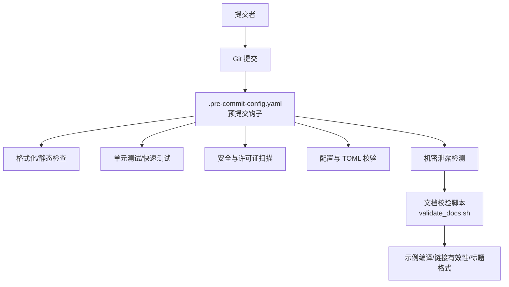
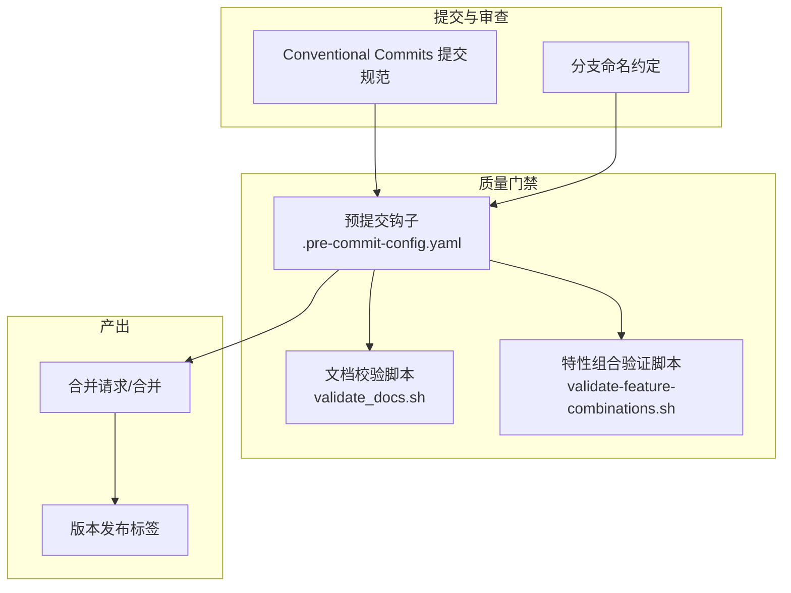
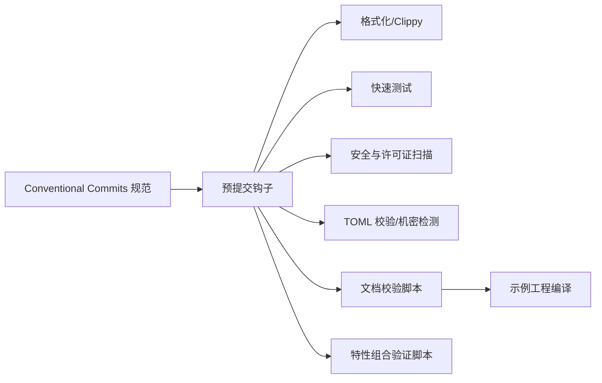

# 提交规范

<cite>
**本文引用的文件**
- [README.md](file://README.md)
- [.pre-commit-config.yaml](file://.pre-commit-config.yaml)
- [AGENTS.md](file://AGENTS.md)
- [docs/USER_GUIDE.md](file://docs/USER_GUIDE.md)
- [scripts/validate_docs.sh](file://scripts/validate_docs.sh)
- [scripts/validate-feature-combinations.sh](file://scripts/validate-feature-combinations.sh)
</cite>

## 目录
1. [简介](#简介)
2. [项目结构](#项目结构)
3. [核心组件](#核心组件)
4. [架构总览](#架构总览)
5. [详细组件分析](#详细组件分析)
6. [依赖分析](#依赖分析)
7. [性能考虑](#性能考虑)
8. [故障排查指南](#故障排查指南)
9. [结论](#结论)
10. [附录](#附录)

## 简介
本文件系统性阐述 Oxcache 项目的 Conventional Commits 提交规范，明确提交消息的标准格式、各类提交类型的语义与使用边界，并提供可直接参考的示例与最佳实践。同时结合仓库中的预提交钩子与文档校验脚本，给出与提交规范协同的工作流建议。

## 项目结构
- 仓库采用模块化组织，核心代码位于 src/，示例位于 examples/，文档位于 docs/，自动化脚本位于 scripts/，根目录包含构建与质量门禁配置。
- 提交规范与工作流由以下文件共同体现：
  - 提交规范与分支命名约定：AGENTS.md
  - 预提交钩子配置：.pre-commit-config.yaml
  - 文档校验脚本：scripts/validate_docs.sh
  - 特性组合验证脚本：scripts/validate-feature-combinations.sh

图表来源
- [.pre-commit-config.yaml](file://.pre-commit-config.yaml#L1-L129)
- [scripts/validate_docs.sh](file://scripts/validate_docs.sh#L1-L84)

章节来源
- [README.md](file://README.md#L1-L414)
- [.pre-commit-config.yaml](file://.pre-commit-config.yaml#L1-L129)
- [AGENTS.md](file://AGENTS.md#L146-L147)
- [scripts/validate_docs.sh](file://scripts/validate_docs.sh#L1-L84)

## 核心组件
- 提交消息标准格式
  - 格式：type(scope): subject
  - 必填部分：type、subject
  - 可选部分：scope
- 提交类型（type）语义
  - feat：新增功能
  - fix：修复缺陷
  - docs：仅文档变更
  - style：不影响逻辑的格式化/排版
  - refactor：重构（既不修复错误也不新增功能）
  - test：新增/修改测试
  - chore：日常维护类任务（依赖更新、CI 配置等）

章节来源
- [AGENTS.md](file://AGENTS.md#L146-L147)

## 架构总览
下图展示了“提交规范”在项目中的落地位置与协作关系：

图表来源
- [AGENTS.md](file://AGENTS.md#L146-L147)
- [.pre-commit-config.yaml](file://.pre-commit-config.yaml#L1-L129)
- [scripts/validate_docs.sh](file://scripts/validate_docs.sh#L1-L84)
- [scripts/validate-feature-combinations.sh](file://scripts/validate-feature-combinations.sh#L63-L166)

## 详细组件分析

### 提交消息标准格式与字段说明
- 结构组成
  - type：提交类型，限定为以下之一：feat、fix、docs、style、refactor、test、chore
  - scope：可选，表示变更的影响范围（如模块名、子系统名）
  - subject：简短描述，说明变更内容，首字母无需大写，结尾不加句号
- 书写要点
  - subject 控制在 50 字符以内更易阅读
  - 如需详细说明，在第二行留空，第三行起写正文
  - 正文中可引用问题编号、关联变更或迁移说明

章节来源
- [AGENTS.md](file://AGENTS.md#L146-L147)

### 提交类型详解与使用边界
- feat（新功能）
  - 适用：引入新的对外 API、新增缓存策略、新后端实现等
  - 示例：feat(redis): 添加 Sentinel 模式支持
- fix（修复）
  - 适用：修复 bug、修正行为偏差、修复竞态条件等
  - 示例：fix(cli): 修复健康检查状态输出错位
- docs（文档）
  - 适用：仅文档变更，不涉及代码逻辑
  - 示例：docs: 更新贡献指南中的提交规范章节
- style（代码格式）
  - 适用：空白、缩进、分号等格式调整，不改变逻辑
  - 示例：style: 统一文件末尾换行
- refactor（重构）
  - 适用：不改变外部行为的内部结构调整
  - 示例：refactor(client): 抽离公共错误处理逻辑
- test（测试）
  - 适用：新增/修改测试用例、测试工具脚本
  - 示例：test: 为批处理写入增加单元测试
- chore（日常维护）
  - 适用：升级依赖、CI 配置、脚本维护等
  - 示例：chore(deps): 升级 moka 到最新稳定版

章节来源
- [AGENTS.md](file://AGENTS.md#L146-L147)

### 提交描述写作规范
- 清晰性
  - 用词准确，避免模糊表达；如“修复”应说明“修复了什么问题”
- 简洁性
  - subject 控制在 50 字符内；正文分段说明背景、动机、影响范围
- 信息丰富性
  - 关联问题：在正文中以“Closes #xxx”“Fixes #xxx”等形式引用
  - 关联变更：说明对其他模块的影响或需要同步升级的依赖
- 与工作流衔接
  - 预提交钩子会在提交前自动执行格式化、静态检查、快速测试等，确保提交质量

章节来源
- [.pre-commit-config.yaml](file://.pre-commit-config.yaml#L1-L129)
- [scripts/validate_docs.sh](file://scripts/validate_docs.sh#L1-L84)

### 提交示例（按类型分类）
- feat
  - feat(redis): 新增 Redis Sentinel 模式配置项
  - feat(api): 增加 HTTP 缓存中间件
- fix
  - fix(serialization): 修复 JSON 序列化在空值场景下的异常
  - fix(batch): 修复批量写入触发条件导致的死循环
- docs
  - docs: 修正 README 中的版本号与特性说明
  - docs: 补充 CLI 子命令的使用说明
- style
  - style: 统一所有示例代码的注释风格
- refactor
  - refactor(config): 将配置解析逻辑拆分为独立模块
- test
  - test: 为 bloom filter 增加边界条件测试
  - test: 新增特性组合验证脚本的测试用例
- chore
  - chore(deps): 升级 tokio 到 1.32
  - chore(ci): 优化 GitHub Actions 并行度

章节来源
- [AGENTS.md](file://AGENTS.md#L146-L147)
- [scripts/validate-feature-combinations.sh](file://scripts/validate-feature-combinations.sh#L63-L166)

### 与文档校验的协同
- 文档校验脚本会检查：
  - 示例代码可编译
  - 文档标题层级与格式
  - Markdown 链接有效性
- 提交文档变更时，建议先在本地运行该脚本，确保通过后再提交，以减少 CI 失败概率

章节来源
- [scripts/validate_docs.sh](file://scripts/validate_docs.sh#L1-L84)

### 与特性组合验证的协同
- 特性组合验证脚本用于确保不同特性组合在编译、单元测试、文档测试层面均能通过
- 提交涉及特性开关或特性组合变更时，建议先在本地运行该脚本，保证提交不会破坏特性矩阵

章节来源
- [scripts/validate-feature-combinations.sh](file://scripts/validate-feature-combinations.sh#L63-L166)

## 依赖分析
- 提交规范与质量门禁的耦合关系
  - 提交规范约束了消息格式与类型，预提交钩子负责在提交阶段强制执行质量检查
  - 文档校验与特性组合验证脚本进一步保障提交内容的可维护性与兼容性
- 外部依赖与集成点
  - 预提交钩子依赖本地工具链（cargo、git、shell 脚本）
  - 文档校验依赖示例工程的可编译性
  - 特性组合验证依赖 Cargo 特性系统与测试框架

图表来源
- [.pre-commit-config.yaml](file://.pre-commit-config.yaml#L1-L129)
- [scripts/validate_docs.sh](file://scripts/validate_docs.sh#L1-L84)
- [scripts/validate-feature-combinations.sh](file://scripts/validate-feature-combinations.sh#L63-L166)

章节来源
- [.pre-commit-config.yaml](file://.pre-commit-config.yaml#L1-L129)
- [scripts/validate_docs.sh](file://scripts/validate_docs.sh#L1-L84)
- [scripts/validate-feature-combinations.sh](file://scripts/validate-feature-combinations.sh#L63-L166)

## 性能考虑
- 提交阶段的性能
  - 预提交钩子尽量保持“快速失败”，避免长耗时任务阻塞提交流程
  - 将重型任务（如全量测试）放在 CI 中执行，提交阶段仅做“快速检查”
- 文档与特性验证的开销
  - 文档校验与特性组合验证建议在本地开发时按需运行，避免频繁触发

## 故障排查指南
- 提交被拒绝（CI/预提交失败）
  - 检查提交消息是否符合 type(scope): subject 格式
  - 确认类型是否属于允许集合：feat、fix、docs、style、refactor、test、chore
  - 查看预提交钩子输出，定位格式化、静态检查或测试失败的具体原因
- 文档链接或示例编译失败
  - 使用文档校验脚本在本地先行检查，修复链接与示例编译问题
- 特性组合不兼容
  - 使用特性组合验证脚本确认当前特性组合是否通过编译与测试

章节来源
- [.pre-commit-config.yaml](file://.pre-commit-config.yaml#L1-L129)
- [scripts/validate_docs.sh](file://scripts/validate_docs.sh#L1-L84)
- [scripts/validate-feature-combinations.sh](file://scripts/validate-feature-combinations.sh#L63-L166)

## 结论
Oxcache 项目通过“Conventional Commits + 预提交钩子 + 文档与特性验证脚本”的组合，形成从提交到合并的质量闭环。遵循统一的提交消息格式与类型语义，有助于提升代码可读性、可追溯性与可维护性；配合本地校验与 CI 门禁，可显著降低回归风险并提高团队协作效率。

## 附录
- 分支命名约定
  - feature/*：新功能
  - fix/*：缺陷修复
- 提交类型速查
  - feat、fix、docs、style、refactor、test、chore

章节来源
- [AGENTS.md](file://AGENTS.md#L146-L147)
