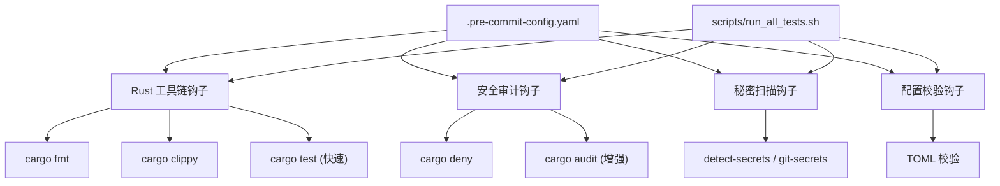
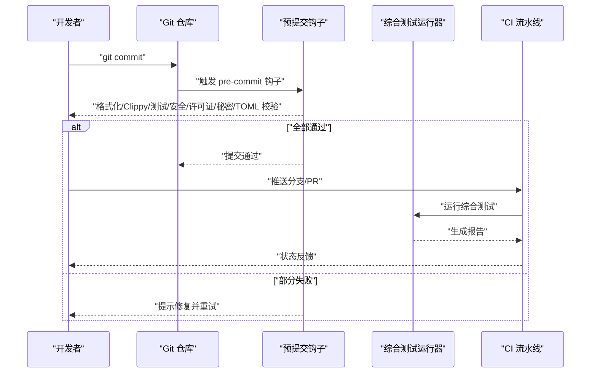
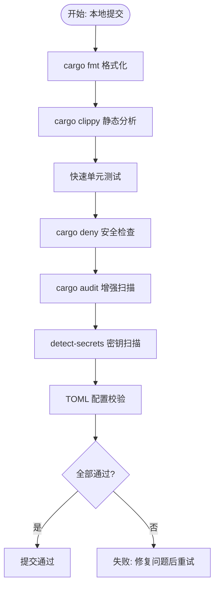
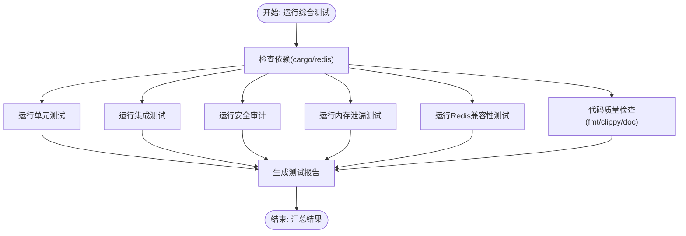
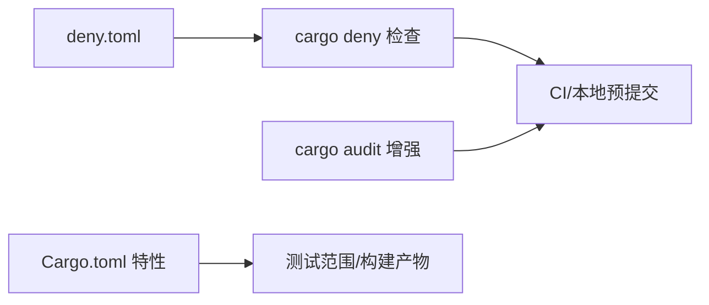

# 贡献流程

<cite>
**本文引用的文件**
- [README.md](file://README.md)
- [.pre-commit-config.yaml](file://.pre-commit-config.yaml)
- [scripts/precommit_clippy.sh](file://scripts/precommit_clippy.sh)
- [scripts/precommit_tests.sh](file://scripts/precommit_tests.sh)
- [scripts/precommit_license.sh](file://scripts/precommit_license.sh)
- [scripts/precommit_deny.sh](file://scripts/precommit_deny.sh)
- [scripts/precommit_audit.sh](file://scripts/precommit_audit.sh)
- [scripts/precommit_secrets.sh](file://scripts/precommit_secrets.sh)
- [scripts/precommit_toml.sh](file://scripts/precommit_toml.sh)
- [scripts/run_all_tests.sh](file://scripts/run_all_tests.sh)
- [deny.toml](file://deny.toml)
- [Cargo.toml](file://Cargo.toml)
</cite>

## 目录
1. [简介](#简介)
2. [项目结构](#项目结构)
3. [核心组件](#核心组件)
4. [架构总览](#架构总览)
5. [详细组件分析](#详细组件分析)
6. [依赖分析](#依赖分析)
7. [性能考虑](#性能考虑)
8. [故障排查指南](#故障排查指南)
9. [结论](#结论)
10. [附录](#附录)

## 简介
本文件系统化阐述 Oxcache 项目的贡献流程与协作规范，覆盖分支管理策略、提交规范、Pull Request 流程、预提交检查机制、代码审查标准以及问题报告与功能请求流程。内容基于仓库中的配置与脚本文件整理而成，旨在帮助贡献者高效、一致地参与开发。

## 项目结构
- 仓库采用多模块组织：核心库、宏扩展、示例、测试与脚本。
- 贡献相关的关键位置：
  - 预提交配置：.pre-commit-config.yaml
  - 预提交检查脚本：scripts/ 下的一系列 precommit_*.sh
  - 综合测试运行器：scripts/run_all_tests.sh
  - 依赖安全与许可证配置：deny.toml
  - 工程元数据与特性开关：Cargo.toml

图表来源
- [.pre-commit-config.yaml](file://.pre-commit-config.yaml#L1-L129)
- [scripts/run_all_tests.sh](file://scripts/run_all_tests.sh#L1-L388)

章节来源
- [.pre-commit-config.yaml](file://.pre-commit-config.yaml#L1-L129)
- [scripts/run_all_tests.sh](file://scripts/run_all_tests.sh#L1-L388)

## 核心组件
- 预提交钩子系统：统一在本地执行格式化、静态分析、测试、安全审计、许可证与秘密扫描、配置校验等检查，保证提交质量与一致性。
- 综合测试运行器：集中执行单元测试、集成测试、安全审计、内存测试、Redis 兼容性测试与代码质量检查，并生成报告。
- 依赖治理：通过 cargo-deny 与 deny.toml 控制漏洞与许可证风险；cargo-audit 增强漏洞扫描；detect-secrets 防止密钥泄露。
- 工程元数据：Cargo.toml 定义特性开关与发布配置，影响构建与测试范围。

章节来源
- [.pre-commit-config.yaml](file://.pre-commit-config.yaml#L1-L129)
- [scripts/precommit_clippy.sh](file://scripts/precommit_clippy.sh#L1-L63)
- [scripts/precommit_tests.sh](file://scripts/precommit_tests.sh#L1-L52)
- [scripts/precommit_deny.sh](file://scripts/precommit_deny.sh#L1-L49)
- [scripts/precommit_audit.sh](file://scripts/precommit_audit.sh#L1-L66)
- [scripts/precommit_secrets.sh](file://scripts/precommit_secrets.sh#L1-L65)
- [scripts/precommit_toml.sh](file://scripts/precommit_toml.sh#L1-L70)
- [scripts/run_all_tests.sh](file://scripts/run_all_tests.sh#L1-L388)
- [deny.toml](file://deny.toml#L1-L39)
- [Cargo.toml](file://Cargo.toml#L1-L377)

## 架构总览
下图展示从开发者本地提交到 CI 的整体流程，涵盖预提交检查与综合测试运行器的职责分工。

图表来源
- [.pre-commit-config.yaml](file://.pre-commit-config.yaml#L1-L129)
- [scripts/run_all_tests.sh](file://scripts/run_all_tests.sh#L1-L388)

## 详细组件分析

### 分支管理策略
- main：主分支，用于发布稳定版本与归档。
- develop：开发分支，作为功能集成与同步的汇聚点。
- feature/*：功能开发分支，命名规范为 feature/<主题>，完成后合并至 develop 或 main。
- fix/*：缺陷修复分支，命名规范为 fix/<问题描述>，修复后合并回 main 与 develop。
- docs/*：文档改进分支，命名规范为 docs/<范围>，仅包含文档变更。
- 备注：以上策略为通用约定，具体分支保护规则与合并策略由项目维护者在仓库设置中定义。

### 提交规范
- 采用 Conventional Commits 规范，提交消息应包含类型、可选作用域与简要描述，必要时补充破坏性变更说明与修复的 Issue 编号。
- 类型分类建议：
  - feat：新增功能
  - fix：缺陷修复
  - docs：文档更新
  - style：不影响逻辑的格式化调整
  - refactor：重构但不改变行为
  - perf：性能优化
  - test：测试相关
  - chore：构建流程、依赖管理等杂务
- 示例格式（语义化描述）：
  - feat(cli): 新增健康检查命令
  - fix(redis): 修复连接池泄漏
  - docs: 更新贡献指南
  - chore(deps): 升级依赖版本

### Pull Request 流程
- 基于 feature/*、fix/*、docs/* 分支创建 PR，目标分支通常为 develop 或 main（视项目策略而定）。
- PR 合并前要求：
  - 通过所有预提交检查
  - 通过 CI 中的综合测试运行器（或等效的流水线）
  - 通过代码审查（见下一节）
- 分支更新：若目标分支有新提交，建议在 PR 开启后定期 rebase 或 merge 以保持最新，避免冲突积累。

### 预提交检查机制
- Rust 工具链钩子
  - cargo fmt：统一代码风格
  - cargo clippy：静态分析，严格模式（-D warnings）
  - cargo test（快速）：仅运行快速单元测试，避免慢集成测试
- 安全审计钩子
  - cargo deny：依赖安全与许可证检查
  - cargo audit（增强）：RUSTSEC 数据库漏洞扫描
- 秘密扫描钩子
  - detect-secrets/git-secrets：检测敏感信息泄露
- 配置校验钩子
  - TOML 校验：Cargo.toml 与 deny.toml 等配置文件格式校验

图表来源
- [.pre-commit-config.yaml](file://.pre-commit-config.yaml#L1-L129)
- [scripts/precommit_clippy.sh](file://scripts/precommit_clippy.sh#L1-L63)
- [scripts/precommit_tests.sh](file://scripts/precommit_tests.sh#L1-L52)
- [scripts/precommit_deny.sh](file://scripts/precommit_deny.sh#L1-L49)
- [scripts/precommit_audit.sh](file://scripts/precommit_audit.sh#L1-L66)
- [scripts/precommit_secrets.sh](file://scripts/precommit_secrets.sh#L1-L65)
- [scripts/precommit_toml.sh](file://scripts/precommit_toml.sh#L1-L70)

章节来源
- [.pre-commit-config.yaml](file://.pre-commit-config.yaml#L1-L129)
- [scripts/precommit_clippy.sh](file://scripts/precommit_clippy.sh#L1-L63)
- [scripts/precommit_tests.sh](file://scripts/precommit_tests.sh#L1-L52)
- [scripts/precommit_deny.sh](file://scripts/precommit_deny.sh#L1-L49)
- [scripts/precommit_audit.sh](file://scripts/precommit_audit.sh#L1-L66)
- [scripts/precommit_secrets.sh](file://scripts/precommit_secrets.sh#L1-L65)
- [scripts/precommit_toml.sh](file://scripts/precommit_toml.sh#L1-L70)

### 综合测试运行器
- 功能概览
  - 运行单元测试、集成测试、安全审计、内存泄漏测试、Redis 版本兼容性测试与代码质量检查
  - 生成测试报告，汇总各单项测试结果
  - 支持超时控制、并行/串行模式与输出目录自定义
- 关键流程
  - 依赖检查（cargo、Redis 等）
  - 逐项执行测试与检查
  - 生成 Markdown 报告并统计通过/失败/跳过数量
- 使用建议
  - 在本地提交前运行综合测试，确保改动不会引入回归
  - 在 CI 中同样执行该运行器，以获得一致的测试结果

图表来源
- [scripts/run_all_tests.sh](file://scripts/run_all_tests.sh#L1-L388)

章节来源
- [scripts/run_all_tests.sh](file://scripts/run_all_tests.sh#L1-L388)

### 代码审查标准与流程
- 审查清单（建议）
  - 是否遵循 Conventional Commits 提交规范
  - 是否通过所有预提交检查与综合测试
  - 代码是否清晰、注释是否充分、复杂逻辑是否有解释
  - 是否引入新的依赖或升级现有依赖，是否符合 deny.toml 与许可证策略
  - 是否存在潜在的安全隐患（如硬编码凭据、不安全的 Lua 脚本、未验证的输入）
  - 是否影响性能或引入竞态条件
  - 是否更新相关文档与示例
- 反馈处理
  - 对审查意见进行逐条响应与修改
  - 修改后重新触发 CI 与必要的测试
  - 保持 PR 描述与变更范围一致
- 合并策略
  - 至少一名维护者批准
  - 通过 CI 与审查后方可合并
  - 小步快跑，优先合并无风险的 fix/* 与 docs/*

### 问题报告与功能请求
- 问题报告（Bug Report）
  - 在提交前先运行综合测试，确认问题可复现
  - 提供最小可复现步骤、期望行为、实际行为、环境信息（操作系统、Rust 版本、Redis 版本等）
  - 如涉及安全问题，请私下联系维护者，避免公开披露
- 功能请求（Feature Request）
  - 说明使用场景、收益与对齐项目目标
  - 若涉及依赖升级或特性开关，需评估对齐 deny.toml 与 Cargo.toml 的可行性
  - 可先行讨论设计思路，再提交实现

## 依赖分析
- 依赖安全与许可证
  - deny.toml 定义了漏洞数据库、许可证白名单、禁止策略与忽略列表
  - cargo-deny 与 cargo audit 共同保障依赖安全
- 依赖治理流程
  - 任何新增/升级依赖需先通过 cargo deny 与 cargo audit 检查
  - 若出现许可证不兼容，需在 deny.toml 中明确允许或替换依赖
- 特性开关与测试范围
  - Cargo.toml 的 features 影响测试集与构建产物，确保在不同特性组合下的稳定性

图表来源
- [deny.toml](file://deny.toml#L1-L39)
- [.pre-commit-config.yaml](file://.pre-commit-config.yaml#L47-L68)
- [Cargo.toml](file://Cargo.toml#L235-L346)

章节来源
- [deny.toml](file://deny.toml#L1-L39)
- [.pre-commit-config.yaml](file://.pre-commit-config.yaml#L47-L68)
- [Cargo.toml](file://Cargo.toml#L235-L346)

## 性能考虑
- 预提交阶段仅运行“快速”单元测试，避免阻塞提交流程；完整集成测试与性能测试在 CI 中执行。
- 综合测试运行器支持超时控制与并行/串行模式，便于在不同硬件条件下平衡速度与稳定性。
- 通过特性开关裁剪不必要的功能，减少编译与测试负担。

## 故障排查指南
- Clippy 失败
  - 自动修复：cargo clippy --workspace --fix
  - 手动修复：查看详细警告并针对性修改
  - 误报处理：在代码中添加 #[allow(clippy::lint_name)]
- 测试失败
  - 查看完整输出：cargo test --lib -- --nocapture
  - 检查编译错误：cargo check --all-features
  - 运行单个测试定位问题
- 依赖安全问题
  - 使用 cargo deny check 与 cargo audit 获取详细报告
  - 更新到修复版本或在 deny.toml 中临时忽略（需说明原因）
- 许可证合规问题
  - 在 deny.toml 的 [licenses] 中添加允许的许可证表达式
  - 对例外依赖进行明确标注
- 秘密泄露检测
  - 若为误报，更新 .secrets.baseline
  - 若为真阳性，立即移除并轮换相关密钥

章节来源
- [scripts/precommit_clippy.sh](file://scripts/precommit_clippy.sh#L1-L63)
- [scripts/precommit_tests.sh](file://scripts/precommit_tests.sh#L1-L52)
- [scripts/precommit_deny.sh](file://scripts/precommit_deny.sh#L1-L49)
- [scripts/precommit_audit.sh](file://scripts/precommit_audit.sh#L1-L66)
- [scripts/precommit_license.sh](file://scripts/precommit_license.sh#L1-L52)
- [scripts/precommit_secrets.sh](file://scripts/precommit_secrets.sh#L1-L65)

## 结论
通过统一的预提交检查、完善的依赖治理与综合测试运行器，Oxcache 项目在本地与 CI 环境中实现了高质量的交付流程。遵循本文档的分支与提交规范、严格按代码审查清单执行、及时处理各类检查失败，将显著提升贡献效率与代码质量。

## 附录
- 术语
  - 预提交检查：在本地提交前自动执行的多项质量与安全检查
  - 综合测试运行器：集中执行多种测试与检查并生成报告的脚本
- 参考
  - Conventional Commits：https://www.conventionalcommits.org/
  - cargo-deny：https://embarkstudios.github.io/cargo-deny/
  - cargo-audit：https://github.com/RustSec/cargo-audit
  - detect-secrets：https://github.com/Yelp/detect-secrets
