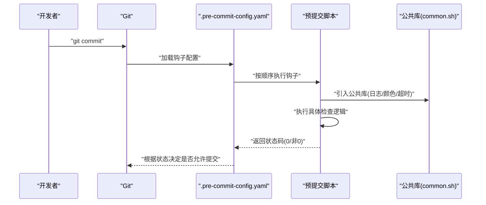
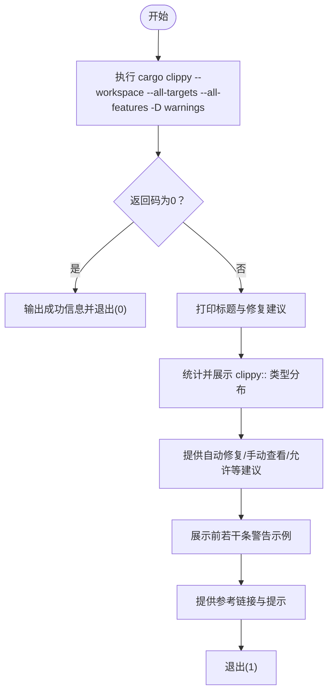
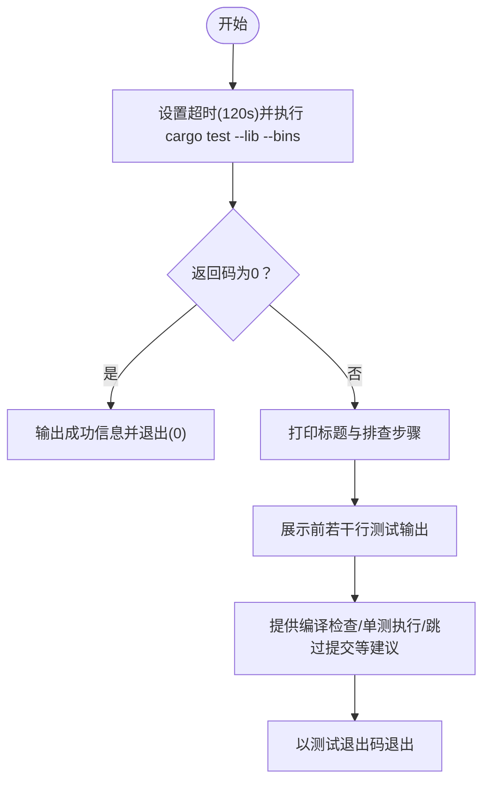
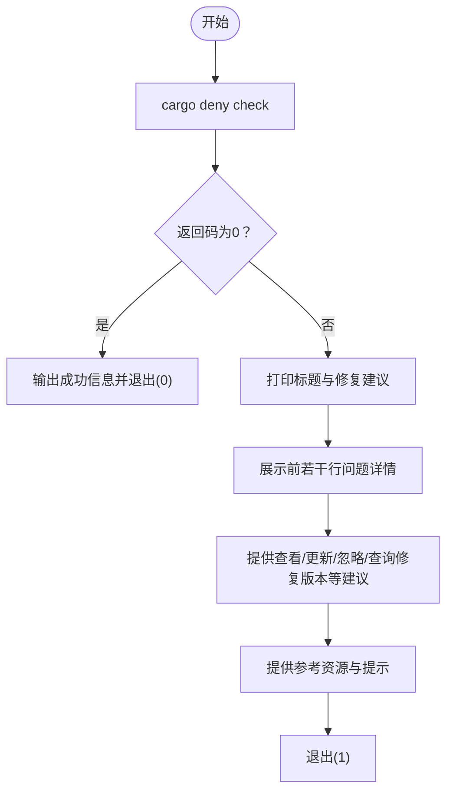
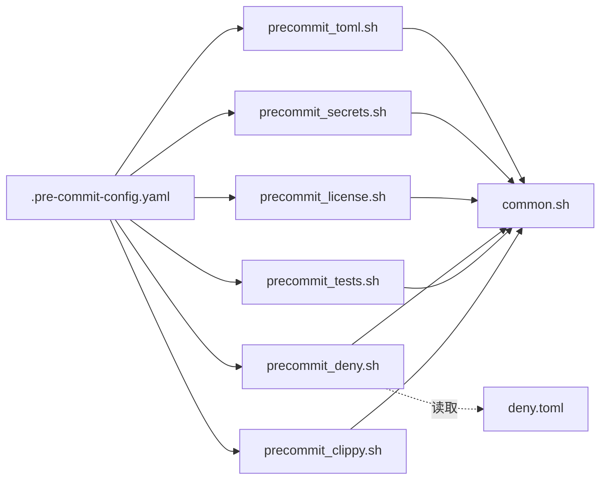

# 预提交检查

<cite>
**本文引用的文件**
- [.pre-commit-config.yaml](file://.pre-commit-config.yaml)
- [scripts/lib/common.sh](file://scripts/lib/common.sh)
- [scripts/pre-commit/precommit_clippy.sh](file://scripts/pre-commit/precommit_clippy.sh)
- [scripts/pre-commit/precommit_tests.sh](file://scripts/pre-commit/precommit_tests.sh)
- [scripts/pre-commit/precommit_deny.sh](file://scripts/pre-commit/precommit_deny.sh)
- [scripts/pre-commit/precommit_license.sh](file://scripts/pre-commit/precommit_license.sh)
- [scripts/pre-commit/precommit_secrets.sh](file://scripts/pre-commit/precommit_secrets.sh)
- [scripts/pre-commit/precommit_toml.sh](file://scripts/pre-commit/precommit_toml.sh)
- [deny.toml](file://deny.toml)
</cite>

## 目录
1. [简介](#简介)
2. [项目结构](#项目结构)
3. [核心组件](#核心组件)
4. [架构概览](#架构概览)
5. [详细组件分析](#详细组件分析)
6. [依赖关系分析](#依赖关系分析)
7. [性能考虑](#性能考虑)
8. [故障排查指南](#故障排查指南)
9. [结论](#结论)

## 简介
本文件系统性介绍 Oxcache 项目的自动化预提交检查机制。通过 Git 预提交钩子与一组专用脚本，项目在每次提交前自动执行多项质量与安全检查，包括代码风格与静态分析、快速单元测试、依赖安全审计、许可证合规、敏感信息扫描以及配置文件校验。这些检查既能在本地开发环境自动触发，也支持手动独立运行，帮助开发者在提交前尽早发现问题。

## 项目结构
Oxcache 的预提交检查由以下部分组成：
- 预提交配置：集中定义各检查钩子及其行为
- 检查脚本：每个功能一个脚本，负责具体检查逻辑
- 公共库：提供统一的日志、颜色输出、依赖检查、超时控制等通用能力
- 依赖配置：如 cargo-deny 的许可与漏洞策略

```mermaid
graph TB
PC[".pre-commit-config.yaml<br/>定义钩子与执行入口"] --> CLP["precommit_clippy.sh<br/>静态分析"]
PC --> TST["precommit_tests.sh<br/>快速单元测试"]
PC --> DNY["precommit_deny.sh<br/>依赖安全审计"]
PC --> LCN["precommit_license.sh<br/>许可证合规"]
PC --> SRT["precommit_secrets.sh<br/>敏感信息扫描"]
PC --> TOM["precommit_toml.sh<br/>TOML配置校验"]
CLP --> COM["common.sh<br/>日志/颜色/超时"]
TST --> COM
DNY --> COM
LCN --> COM
SRT --> COM
TOM --> COM
DNY -. 读取 . 否则跳过 .-> DENY["deny.toml<br/>许可/漏洞策略"]
```

**图表来源**
- [.pre-commit-config.yaml](file://.pre-commit-config.yaml#L1-L129)
- [scripts/pre-commit/precommit_clippy.sh](file://scripts/pre-commit/precommit_clippy.sh#L1-L62)
- [scripts/pre-commit/precommit_tests.sh](file://scripts/pre-commit/precommit_tests.sh#L1-L51)
- [scripts/pre-commit/precommit_deny.sh](file://scripts/pre-commit/precommit_deny.sh#L1-L48)
- [scripts/pre-commit/precommit_license.sh](file://scripts/pre-commit/precommit_license.sh#L1-L51)
- [scripts/pre-commit/precommit_secrets.sh](file://scripts/pre-commit/precommit_secrets.sh#L1-L64)
- [scripts/pre-commit/precommit_toml.sh](file://scripts/pre-commit/precommit_toml.sh#L1-L74)
- [scripts/lib/common.sh](file://scripts/lib/common.sh#L1-L232)
- [deny.toml](file://deny.toml#L1-L39)

**章节来源**
- [.pre-commit-config.yaml](file://.pre-commit-config.yaml#L1-L129)

## 核心组件
- 预提交配置文件：集中声明所有钩子，指定执行命令、语言、文件类型过滤、阶段与全局设置
- 检查脚本：按功能拆分，每个脚本独立完成自身职责，并复用公共库
- 公共库：提供颜色输出、日志、依赖检查、超时执行、测试统计等通用能力
- 依赖策略：deny.toml 定义许可白名单、漏洞忽略列表、来源限制等

**章节来源**
- [.pre-commit-config.yaml](file://.pre-commit-config.yaml#L1-L129)
- [scripts/lib/common.sh](file://scripts/lib/common.sh#L1-L232)
- [deny.toml](file://deny.toml#L1-L39)

## 架构概览
下图展示了预提交钩子在本地执行的整体流程：Git 触发 -> 读取配置 -> 执行对应脚本 -> 输出结果并决定是否允许提交。



**图表来源**
- [.pre-commit-config.yaml](file://.pre-commit-config.yaml#L1-L129)
- [scripts/lib/common.sh](file://scripts/lib/common.sh#L1-L232)

## 详细组件分析

### Clippy 静态分析检查（precommit_clippy.sh）
- 功能概述：调用 cargo clippy 对工作区进行静态分析，严格模式（将警告视为错误），并在失败时输出问题分类、修复建议与参考链接。
- 关键特性：
  - 使用工作区与全部目标/特性进行分析，覆盖全面
  - 将输出重定向到临时文件以便分类统计与展示
  - 提供自动修复、手动查看、条件允许等三种处理方式
- 失败时输出：问题分类统计、前若干条警告示例、修复指引与参考链接
- 适用场景：提交前快速发现潜在问题，避免将警告带入主分支



**图表来源**
- [scripts/pre-commit/precommit_clippy.sh](file://scripts/pre-commit/precommit_clippy.sh#L1-L62)

**章节来源**
- [scripts/pre-commit/precommit_clippy.sh](file://scripts/pre-commit/precommit_clippy.sh#L1-L62)

### 快速单元测试检查（precommit_tests.sh）
- 功能概述：在限定时间内运行库与二进制目标的单元测试，使用多线程加速，失败时给出排查步骤与替代命令。
- 关键特性：
  - 超时控制（默认 120 秒），避免长时间阻塞
  - 仅运行快速单元测试，不包含耗时的集成测试
  - 输出前若干行日志便于快速定位
- 失败时输出：排查步骤、编译检查、单测执行、跳过测试等建议



**图表来源**
- [scripts/pre-commit/precommit_tests.sh](file://scripts/pre-commit/precommit_tests.sh#L1-L51)

**章节来源**
- [scripts/pre-commit/precommit_tests.sh](file://scripts/pre-commit/precommit_tests.sh#L1-L51)

### 依赖安全审计（precommit_deny.sh）
- 功能概述：使用 cargo-deny 检查依赖中的安全漏洞与策略违规；若失败，提供查看详细问题、更新依赖、临时忽略与查看修复版本等建议。
- 关键特性：
  - 直接调用 cargo deny check
  - 读取 deny.toml 中的策略（忽略列表、许可白名单、来源限制等）
- 失败时输出：问题详情、修复建议与参考资源链接



**图表来源**
- [scripts/pre-commit/precommit_deny.sh](file://scripts/pre-commit/precommit_deny.sh#L1-L48)
- [deny.toml](file://deny.toml#L1-L39)

**章节来源**
- [scripts/pre-commit/precommit_deny.sh](file://scripts/pre-commit/precommit_deny.sh#L1-L48)
- [deny.toml](file://deny.toml#L1-L39)

### 许可证合规检查（precommit_license.sh）
- 功能概述：使用 cargo-deny 检查依赖许可证合规性；若失败，展示许可证详情与常见修复方法（允许特定许可证、为特定依赖例外等）。
- 关键特性：
  - 专门针对许可证子命令进行检查
  - 输出许可证类型说明与配置指引
- 失败时输出：许可证详情、允许/例外配置建议与许可证说明

**章节来源**
- [scripts/pre-commit/precommit_license.sh](file://scripts/pre-commit/precommit_license.sh#L1-L51)
- [deny.toml](file://deny.toml#L11-L24)

### 敏感信息扫描（precommit_secrets.sh）
- 功能概述：优先使用 detect-secrets 扫描可能的敏感信息暴露；若未安装，则回退到 git-secrets 或提示安装；若无工具则跳过但给出建议。
- 关键特性：
  - 读取 .secrets.baseline 基线文件进行对比
  - 支持误报标记与真阳性处理建议
- 失败时输出：检测到的敏感信息类型与位置、误报/真阳性处理建议

**章节来源**
- [scripts/pre-commit/precommit_secrets.sh](file://scripts/pre-commit/precommit_secrets.sh#L1-L64)

### TOML 配置校验（precommit_toml.sh）
- 功能概述：对 Cargo.toml 与其他相关 TOML 文件进行有效性校验；若失败，输出常见问题与参考链接。
- 关键特性：
  - 校验 Cargo.toml 与 examples/*/Cargo.toml、macros/Cargo.toml
  - 若存在 deny.toml 则一并校验其配置有效性
- 失败时输出：常见语法/键名/版本/依赖问题与参考链接

**章节来源**
- [scripts/pre-commit/precommit_toml.sh](file://scripts/pre-commit/precommit_toml.sh#L1-L74)

## 依赖关系分析
- 预提交配置文件集中声明各钩子与其入口命令，脚本通过 bash 调用，语言类型与文件过滤由配置控制
- 所有脚本均依赖公共库提供的日志、颜色、超时与测试统计等能力
- 依赖安全与许可证检查依赖 cargo-deny 与 deny.toml 策略
- 敏感信息扫描依赖 detect-secrets 或 git-secrets 工具



**图表来源**
- [.pre-commit-config.yaml](file://.pre-commit-config.yaml#L1-L129)
- [scripts/lib/common.sh](file://scripts/lib/common.sh#L1-L232)
- [scripts/pre-commit/precommit_clippy.sh](file://scripts/pre-commit/precommit_clippy.sh#L1-L62)
- [scripts/pre-commit/precommit_tests.sh](file://scripts/pre-commit/precommit_tests.sh#L1-L51)
- [scripts/pre-commit/precommit_deny.sh](file://scripts/pre-commit/precommit_deny.sh#L1-L48)
- [scripts/pre-commit/precommit_license.sh](file://scripts/pre-commit/precommit_license.sh#L1-L51)
- [scripts/pre-commit/precommit_secrets.sh](file://scripts/pre-commit/precommit_secrets.sh#L1-L64)
- [scripts/pre-commit/precommit_toml.sh](file://scripts/pre-commit/precommit_toml.sh#L1-L74)
- [deny.toml](file://deny.toml#L1-L39)

## 性能考虑
- 快速测试：通过限制线程数与超时时间，保证本地提交检查的响应速度
- 仅静态分析：Clippy 采用严格模式，避免在本地引入警告
- 选择性校验：TOML 校验仅针对关键清单文件，减少不必要的开销
- 工具缓存：detect-secrets 基线文件避免重复扫描已知误报

[本节为通用指导，无需列出来源]

## 故障排查指南

### 通用排查步骤
- 检查工具安装：确认 Rust 工具链、cargo、cargo-deny、detect-secrets、git-secrets 等工具可用
- 查看输出：根据脚本输出的“修复建议/排查步骤”逐项处理
- 临时跳过：仅在确有必要时使用跳过选项，不建议长期绕过

**章节来源**
- [scripts/lib/common.sh](file://scripts/lib/common.sh#L46-L121)

### Clippy 失败
- 自动修复：使用提供的自动修复命令尝试一次性解决
- 手动修复：查看详细警告并逐条处理
- 条件允许：对于明确的误报，可在代码中添加允许注解
- 参考链接：访问官方 Clippy 文档与跳过警告说明

**章节来源**
- [scripts/pre-commit/precommit_clippy.sh](file://scripts/pre-commit/precommit_clippy.sh#L33-L58)

### 测试失败
- 编译检查：先运行编译检查确保无编译错误
- 单测定位：运行单个测试用例定位具体失败点
- 跳过提交：仅在文档/配置修改且确认无逻辑变更时使用跳过选项

**章节来源**
- [scripts/pre-commit/precommit_tests.sh](file://scripts/pre-commit/precommit_tests.sh#L23-L36)

### 依赖安全审计失败
- 查看详细：直接运行安全审计命令查看具体问题
- 更新依赖：尝试更新有问题的包或整体依赖
- 临时忽略：在策略配置中添加忽略项，但需定期清理
- 查询修复：使用依赖树查看修复版本

**章节来源**
- [scripts/pre-commit/precommit_deny.sh](file://scripts/pre-commit/precommit_deny.sh#L21-L43)
- [deny.toml](file://deny.toml#L4-L9)

### 许可证合规失败
- 允许特定许可证：在策略配置中添加允许项
- 为特定依赖例外：在策略配置中为特定包设置例外
- 许可证说明：了解常见许可证类型与风险

**章节来源**
- [scripts/pre-commit/precommit_license.sh](file://scripts/pre-commit/precommit_license.sh#L26-L47)
- [deny.toml](file://deny.toml#L11-L24)

### 敏感信息扫描告警
- 验证真伪：区分误报与真实敏感信息
- 误报处理：将误报加入基线文件
- 真阳性处理：立即移除敏感信息并轮换密钥

**章节来源**
- [scripts/pre-commit/precommit_secrets.sh](file://scripts/pre-commit/precommit_secrets.sh#L28-L46)

### TOML 配置校验失败
- 常见问题：语法错误、键名不支持、版本格式错误、依赖不存在
- 参考规范：TOML 规范与 Cargo 清单格式

**章节来源**
- [scripts/pre-commit/precommit_toml.sh](file://scripts/pre-commit/precommit_toml.sh#L52-L67)

## 结论
Oxcache 的预提交检查体系通过清晰的配置与脚本分工，实现了对代码质量、安全性与合规性的多维度保障。建议在本地开发中始终启用这些检查，并在失败时按照脚本提供的指引快速修复。对于偶发的误报或特殊情况，应谨慎使用允许/跳过机制，并尽快回归到严格策略。
