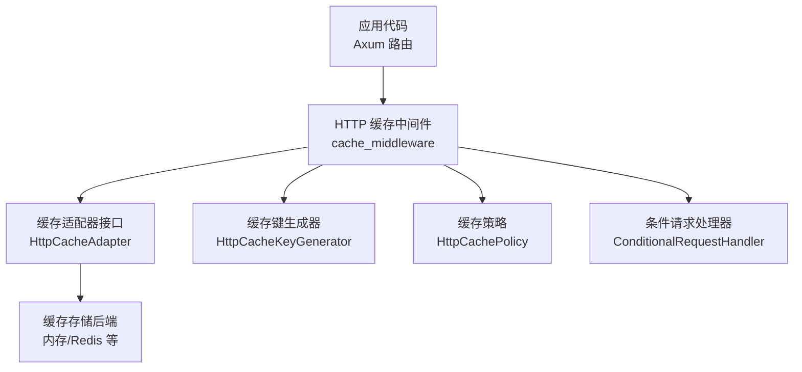
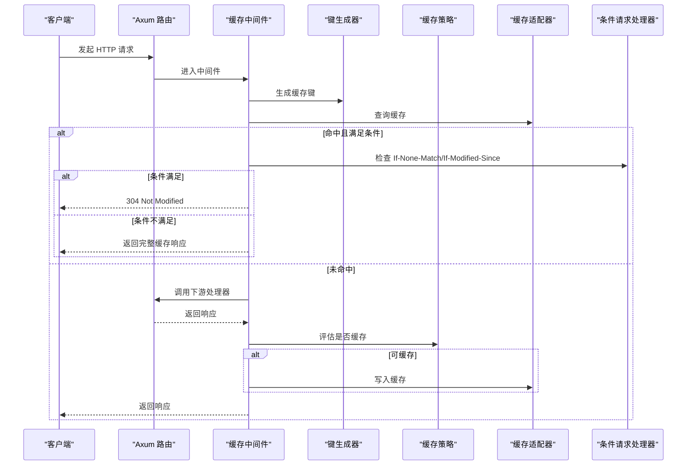
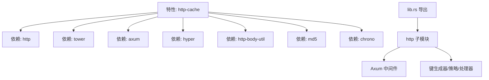

# HTTP 缓存

<cite>
**本文引用的文件**
- [src/http/mod.rs](file://src/http/mod.rs)
- [src/http/axum.rs](file://src/http/axum.rs)
- [src/lib.rs](file://src/lib.rs)
- [Cargo.toml](file://Cargo.toml)
- [examples/src/http_cache.rs](file://examples/src/http_cache.rs)
- [tests/integration/http_cache_test.rs](file://tests/integration/http_cache_test.rs)
</cite>

## 目录
1. [简介](#简介)
2. [项目结构](#项目结构)
3. [核心组件](#核心组件)
4. [架构总览](#架构总览)
5. [组件详解](#组件详解)
6. [依赖关系分析](#依赖关系分析)
7. [性能考量](#性能考量)
8. [故障排查指南](#故障排查指南)
9. [结论](#结论)
10. [附录](#附录)

## 简介
本章节概述 Oxcache 的 HTTP 缓存能力，重点说明其与 Axum 框架的集成方式、请求-响应处理流程、HTTP 缓存协议（缓存控制头、条件请求、缓存验证）的实现要点，以及在 Web 应用中集成该中间件的方法。文档还提供完整的实现示例（GET 缓存、POST 处理、缓存失效策略）、配置方法（缓存时间、缓存键生成、内容过滤）与性能优化建议及常见问题诊断。

## 项目结构
Oxcache 的 HTTP 缓存能力位于独立的 http 模块中，Axum 中间件封装在该模块内；公共 API 在根库导出中暴露；示例与测试分别位于 examples 与 tests 目录。

图表来源
- [src/http/axum.rs](file://src/http/axum.rs#L64-L149)
- [src/http/mod.rs](file://src/http/mod.rs#L190-L235)

章节来源
- [src/http/mod.rs](file://src/http/mod.rs#L1-L746)
- [src/http/axum.rs](file://src/http/axum.rs#L1-L305)
- [src/lib.rs](file://src/lib.rs#L505-L629)

## 核心组件
- HTTP 缓存响应模型：封装状态码、响应头、正文、缓存时间、TTL、ETag、Last-Modified 等字段，便于序列化与传输。
- 缓存键生成器：可配置是否包含方法、URI 查询参数、HTTP 版本，以及对特定请求头（如 Accept-Encoding、Vary、Authorization）进行考虑，最终生成固定长度的哈希键。
- 缓存策略：定义可缓存的状态码集合、默认 TTL、是否优先使用响应头中的 TTL、忽略路径模式、键前缀等。
- 条件请求处理器：解析 If-None-Match 与 If-Modified-Since，支持返回 304 Not Modified 或完整响应；并能基于响应体生成强/弱 ETag。
- 缓存标签管理器：维护“标签→缓存键”的映射，支持按标签或模式批量失效。
- Axum 中间件：在请求进入业务逻辑之前尝试读取缓存，命中则直接返回；未命中则执行业务逻辑并将响应写入缓存；支持通过自定义头跳过缓存。

章节来源
- [src/http/mod.rs](file://src/http/mod.rs#L22-L188)
- [src/http/mod.rs](file://src/http/mod.rs#L190-L235)
- [src/http/mod.rs](file://src/http/mod.rs#L327-L473)
- [src/http/mod.rs](file://src/http/mod.rs#L475-L558)
- [src/http/axum.rs](file://src/http/axum.rs#L19-L149)

## 架构总览
下图展示 HTTP 缓存中间件在 Axum 中的调用链路与关键对象交互。

图表来源
- [src/http/axum.rs](file://src/http/axum.rs#L64-L149)
- [src/http/mod.rs](file://src/http/mod.rs#L327-L473)
- [src/http/mod.rs](file://src/http/mod.rs#L190-L235)

## 组件详解

### HTTP 缓存响应模型与策略
- HttpCacheResponse：包含状态码、响应头、正文、缓存时间、TTL、ETag、Last-Modified。支持序列化，便于持久化或跨进程传输。
- HttpCachePolicy：定义可缓存状态码、默认 TTL、是否从响应头提取 TTL（优先级）、忽略路径模式、键前缀等。提供从响应头解析 TTL 的辅助方法。

章节来源
- [src/http/mod.rs](file://src/http/mod.rs#L22-L32)
- [src/http/mod.rs](file://src/http/mod.rs#L118-L188)

### 缓存键生成器
- 可配置项：是否包含方法、查询参数、HTTP 版本；可排除特定请求头；对 Accept-Encoding、Vary、Authorization 等重要头进行考虑。
- 生成算法：将关键部分拼接后计算 MD5，输出固定长度十六进制字符串，避免键过长。

章节来源
- [src/http/mod.rs](file://src/http/mod.rs#L34-L106)

### 条件请求处理
- 支持 If-None-Match 与 If-Modified-Since 两种条件请求头。
- 若命中条件，返回 304 Not Modified；否则返回完整缓存响应。
- 提供 ETag 生成（强/弱），并能从缓存响应构造标准的 304 响应（复制 ETag/Last-Modified，设置 Date 头）。

章节来源
- [src/http/mod.rs](file://src/http/mod.rs#L327-L473)

### 缓存标签管理器
- 维护标签到缓存键的映射，支持：
  - 为缓存键添加标签；
  - 按标签批量失效；
  - 按模式失效（委托给适配器）；
  - 清空映射。

章节来源
- [src/http/mod.rs](file://src/http/mod.rs#L475-L558)

### Axum 中间件
- 支持通过自定义请求头跳过缓存（bypass_header）。
- 生成缓存键，查询缓存；命中则根据条件请求决定返回 304 或完整响应；未命中则执行下游处理器并将响应写入缓存。
- 写入缓存时会：
  - 从响应头提取 TTL（若开启 use_header_ttl）；
  - 生成 ETag；
  - 记录 cached_at 时间戳；
  - 通过适配器持久化。

章节来源
- [src/http/axum.rs](file://src/http/axum.rs#L64-L149)

### 公共 API 导出
- 当启用 http-cache 或 full 特性时，库会在公共 API 中导出 HTTP 缓存相关类型：CacheMiddlewareConfig、CacheMiddlewareState、HttpCacheAdapter、HttpCacheKeyGenerator、HttpCachePolicy、HttpCacheResponse、HttpRequest 等。

章节来源
- [src/lib.rs](file://src/lib.rs#L624-L629)

## 依赖关系分析
- 功能特性开关：http-cache 特性启用 HTTP 缓存所需依赖（http、tower、axum、hyper、http-body-util、md5、chrono 等）。
- 模块导出：当启用 http-cache 或 full 特性时，lib.rs 将 http 子模块导出到公共 API。
- 中间件依赖：Axum 中间件依赖 http 模块提供的类型与工具。

图表来源
- [Cargo.toml](file://Cargo.toml#L47-L67)
- [Cargo.toml](file://Cargo.toml#L343)
- [src/lib.rs](file://src/lib.rs#L505-L507)
- [src/lib.rs](file://src/lib.rs#L624-L629)

章节来源
- [Cargo.toml](file://Cargo.toml#L47-L67)
- [Cargo.toml](file://Cargo.toml#L343)
- [src/lib.rs](file://src/lib.rs#L505-L507)
- [src/lib.rs](file://src/lib.rs#L624-L629)

## 性能考量
- 键生成复杂度：键生成器对请求头进行筛选与拼接后计算 MD5，整体为线性复杂度，适合高频请求场景。
- 条件请求开销：命中缓存时仅做头比较与时间比较，成本极低；未命中时需要收集下游响应体再写入缓存，注意避免大体积响应频繁写入。
- TTL 优先级：优先使用响应头中的 max-age，其次回退到策略默认 TTL，减少重复计算。
- ETag 生成：基于响应体摘要，命中条件请求时可显著降低带宽消耗。
- 并发安全：标签管理器使用并发容器，保证高并发下的失效与查询性能。
- 缓存命中率：通过统计接口（在库中导出）监控命中率，结合策略调整缓存键与 TTL。

[本节为通用性能建议，无需特定文件引用]

## 故障排查指南
- 304 未生效
  - 检查客户端是否发送了 If-None-Match 或 If-Modified-Since。
  - 确认服务端是否正确生成并携带 ETag/Last-Modified。
  - 排查缓存键是否一致（方法、URI、查询参数、版本、头是否被纳入）。
- 缓存未命中
  - 确认状态码是否在可缓存列表中。
  - 检查是否设置了 bypass_header 并在请求中携带该头。
  - 核对策略中的 ignore_patterns 是否误匹配了路径。
- TTL 不生效
  - 确认 use_header_ttl 已启用，且响应头中包含 Cache-Control:max-age=...
- 缓存失效不彻底
  - 使用标签管理器按标签失效，或使用模式匹配失效。
  - 对于路径模式，支持单星与双星通配，注意正则转换规则。
- 示例与测试参考
  - 参考集成测试对 HttpCacheResponse 结构、ETag、多响应头、不同状态码的验证。
  - 参考示例程序了解基本缓存 API 的使用方式。

章节来源
- [tests/integration/http_cache_test.rs](file://tests/integration/http_cache_test.rs#L19-L96)
- [src/http/mod.rs](file://src/http/mod.rs#L475-L558)
- [src/http/mod.rs](file://src/http/mod.rs#L327-L473)

## 结论
Oxcache 的 HTTP 缓存模块提供了与 Axum 深度集成的中间件，具备完善的缓存键生成、策略配置、条件请求处理与标签失效能力。通过合理配置 TTL、键生成规则与忽略模式，可在保证正确性的前提下显著提升响应速度与带宽利用率。配合统计与测试工具，可进一步优化命中率与稳定性。

[本节为总结性内容，无需特定文件引用]

## 附录

### 如何在 Web 应用中集成 HTTP 缓存中间件
- 启用特性：在 Cargo.toml 中启用 http-cache 或 full 特性。
- 实现适配器：实现 HttpCacheAdapter 接口（内存/Redis 等均可），用于读取/写入/删除/按模式失效缓存。
- 配置中间件：
  - 创建 CacheMiddlewareConfig，注入适配器、键生成器、策略与可选的 bypass_header。
  - 将中间件挂载到 Axum 路由。
- 使用示例参考：examples/src/http_cache.rs 展示了缓存 API 的基本用法，可作为理解缓存响应结构与统计信息的起点。

章节来源
- [Cargo.toml](file://Cargo.toml#L343)
- [src/http/axum.rs](file://src/http/axum.rs#L19-L52)
- [examples/src/http_cache.rs](file://examples/src/http_cache.rs#L1-L108)

### 完整 HTTP 缓存实现示例（步骤说明）
- GET 请求缓存
  - 中间件在请求到达时生成缓存键并查询缓存。
  - 若命中且满足条件请求，则返回 304；否则返回完整缓存响应。
  - 未命中时执行下游处理器并将响应写入缓存（含 TTL 与 ETag）。
- POST 请求处理
  - 默认不缓存非 GET 请求；可通过策略与键生成器控制是否缓存。
  - 若需缓存，建议仅缓存幂等的 GET/HEAD 响应，避免副作用。
- 缓存失效策略
  - 标签失效：为缓存键添加标签，按标签批量失效。
  - 模式失效：支持路径模式（单星/双星）匹配，按模式批量删除。
  - 手动删除：针对具体键删除缓存。

章节来源
- [src/http/axum.rs](file://src/http/axum.rs#L64-L149)
- [src/http/mod.rs](file://src/http/mod.rs#L475-L558)

### 缓存策略配置方法
- 缓存时间
  - 默认 TTL：通过策略设置。
  - 响应头 TTL：启用 use_header_ttl 后优先使用 Cache-Control:max-age=...。
- 缓存键生成
  - include_method/include_query/include_version 控制键组成。
  - exclude_headers 可排除敏感头；系统自动考虑 Accept-Encoding、Vary、Authorization。
- 缓存内容过滤
  - ignore_patterns：忽略匹配的路径模式，避免无意义缓存。
  - key_prefix：为键增加前缀，便于多环境隔离。

章节来源
- [src/http/mod.rs](file://src/http/mod.rs#L118-L188)
- [src/http/mod.rs](file://src/http/mod.rs#L34-L106)

### HTTP 缓存工作原理与协议要点
- 缓存控制头
  - Cache-Control:max-age=...：声明最大存活时间。
  - ETag/If-None-Match：强校验，内容变化即失效。
  - Last-Modified/If-Modified-Since：基于时间的条件请求。
- 条件请求
  - 若命中 ETag 或 If-Modified-Since，则返回 304 Not Modified，客户端复用本地缓存。
- 缓存验证
  - 未命中时生成 ETag 并写入缓存；后续请求可触发条件请求，减少网络传输。

章节来源
- [src/http/mod.rs](file://src/http/mod.rs#L167-L187)
- [src/http/mod.rs](file://src/http/mod.rs#L327-L473)