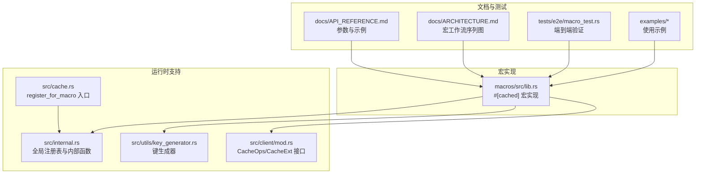
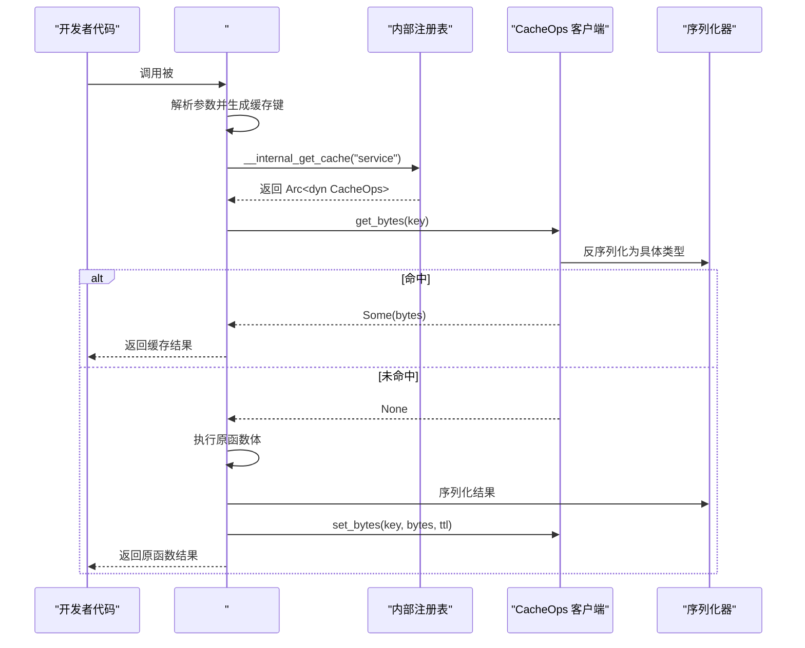
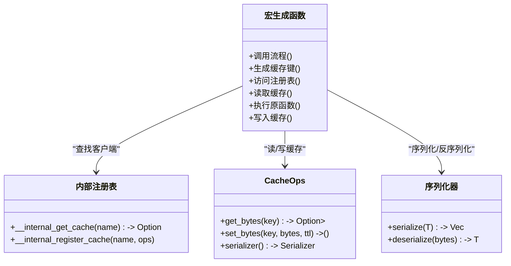
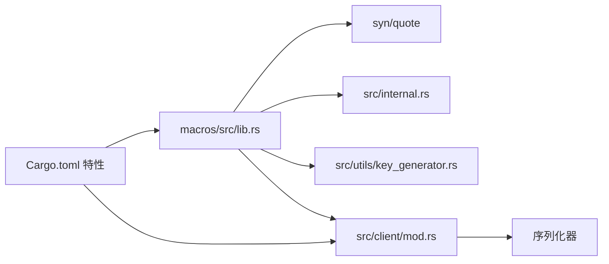

# 宏装饰器

<cite>
**本文引用的文件**
- [宏实现入口](file://macros/src/lib.rs)
- [内部注册表与宏支持](file://src/internal.rs)
- [缓存客户端接口](file://src/client/mod.rs)
- [缓存键生成器](file://src/utils/key_generator.rs)
- [缓存实例注册入口](file://src/cache.rs)
- [API 参考（含 #[cached] 参数说明）](file://docs/API_REFERENCE.md)
- [架构文档（#[cached] 工作流）](file://docs/ARCHITECTURE.md)
- [端到端测试（宏行为验证）](file://tests/e2e/macro_test.rs)
- [综合示例（包含 #[cached] 使用）](file://examples/src/01_basics/example_comprehensive_usage.rs)
- [动态配置示例（展示高级用法）](file://examples/src/dynamic_config.rs)
- [项目根 Cargo.toml（特性开关）](file://Cargo.toml)
</cite>

## 目录
1. [简介](#简介)
2. [项目结构](#项目结构)
3. [核心组件](#核心组件)
4. [架构总览](#架构总览)
5. [详细组件分析](#详细组件分析)
6. [依赖关系分析](#依赖关系分析)
7. [性能考量](#性能考量)
8. [故障排查指南](#故障排查指南)
9. [结论](#结论)
10. [附录](#附录)

## 简介
本章节面向希望在异步函数上零样板地添加缓存能力的开发者，系统性讲解 Oxcache 的 #[cached] 宏装饰器：如何使用、可配置项、编译期生成的缓存逻辑、与手动客户端方式的性能与选择建议、限制与注意事项、调试与排障方法，以及最佳实践与优化建议。读者无需深入理解底层实现即可高效使用，同时也能通过后续章节掌握其工作原理与边界。

## 项目结构
围绕 #[cached] 宏的关键代码分布在以下位置：
- 宏实现与生成逻辑位于 macros 子包
- 运行时注册表与内部支持位于 src/internal.rs
- 缓存客户端接口与序列化抽象位于 src/client/mod.rs
- 键生成策略与工具位于 src/utils/key_generator.rs
- 缓存实例对外注册入口位于 src/cache.rs
- API 参数与使用说明位于 docs/API_REFERENCE.md
- 宏工作流与序列图位于 docs/ARCHITECTURE.md
- 行为验证与示例位于 tests/e2e/macro_test.rs 与 examples/

**图表来源**
- [宏实现入口](file://macros/src/lib.rs#L45-L314)
- [内部注册表与宏支持](file://src/internal.rs#L15-L39)
- [缓存客户端接口](file://src/client/mod.rs#L154-L200)
- [缓存键生成器](file://src/utils/key_generator.rs#L47-L207)
- [缓存实例注册入口](file://src/cache.rs#L607-L646)
- [API 参考（含 #[cached] 参数说明）](file://docs/API_REFERENCE.md#L93-L133)
- [架构文档（#[cached] 工作流）](file://docs/ARCHITECTURE.md#L377-L406)
- [端到端测试（宏行为验证）](file://tests/e2e/macro_test.rs#L21-L104)
- [综合示例（包含 #[cached] 使用）](file://examples/src/01_basics/example_comprehensive_usage.rs#L37-L225)
- [动态配置示例（展示高级用法）](file://examples/src/dynamic_config.rs#L20-L133)

**章节来源**
- [宏实现入口](file://macros/src/lib.rs#L45-L314)
- [内部注册表与宏支持](file://src/internal.rs#L15-L39)
- [缓存客户端接口](file://src/client/mod.rs#L154-L200)
- [缓存键生成器](file://src/utils/key_generator.rs#L47-L207)
- [缓存实例注册入口](file://src/cache.rs#L607-L646)
- [API 参考（含 #[cached] 参数说明）](file://docs/API_REFERENCE.md#L93-L133)
- [架构文档（#[cached] 工作流）](file://docs/ARCHITECTURE.md#L377-L406)
- [端到端测试（宏行为验证）](file://tests/e2e/macro_test.rs#L21-L104)
- [综合示例（包含 #[cached] 使用）](file://examples/src/01_basics/example_comprehensive_usage.rs#L37-L225)
- [动态配置示例（展示高级用法）](file://examples/src/dynamic_config.rs#L20-L133)

## 核心组件
- #[cached] 宏：在编译期解析参数，生成带缓存逻辑的异步函数包装器。它负责：
  - 解析参数：service、ttl、key、key_prefix、key_generator、cache_type
  - 生成缓存键：支持自定义格式、内置多种键生成策略、命名空间与前缀
  - 访问缓存客户端：通过内部注册表按服务名获取 CacheOps 实例
  - 读取/写入缓存：基于序列化器进行字节级读写
  - 错误回退：当键非法或客户端缺失时，直接执行原函数
- 内部注册表：全局静态注册表保存服务名到 CacheOps 的映射，供宏生成代码在运行时查找缓存实例
- 键生成器：提供多种键生成策略（默认、simple、md5、murmur3、namespace），支持命名空间与前缀
- 客户端接口：统一的 CacheOps/CacheExt 抽象，屏蔽 L1/L2 实现差异，提供 get/set 等操作与序列化封装

**章节来源**
- [宏实现入口](file://macros/src/lib.rs#L45-L314)
- [内部注册表与宏支持](file://src/internal.rs#L15-L39)
- [缓存键生成器](file://src/utils/key_generator.rs#L47-L207)
- [缓存客户端接口](file://src/client/mod.rs#L154-L200)

## 架构总览
下图展示了 #[cached] 宏从“声明式装饰”到“运行时缓存命中/回源”的完整流程，包括键生成、客户端查找、序列化与存储等关键步骤。

**图表来源**
- [架构文档（#[cached] 工作流）](file://docs/ARCHITECTURE.md#L377-L406)
- [宏实现入口](file://macros/src/lib.rs#L257-L310)
- [内部注册表与宏支持](file://src/internal.rs#L28-L33)
- [缓存客户端接口](file://src/client/mod.rs#L24-L46)

## 详细组件分析

### 宏参数与配置项
- service（必需）：服务名，用于在内部注册表中定位缓存客户端
- ttl（可选）：TTL（秒），None 表示使用默认策略
- key（可选）：自定义键格式字符串，如 "user:{id}"，其中花括号占位符会被实参替换
- key_prefix（可选）：为默认键生成追加前缀
- key_generator（可选）：键生成策略，支持 "default"、"simple"、"md5"、"murmur3"、"namespace"
- cache_type（可选）："two-level"（默认，两层）、"l1-only"、"l2-only"

这些参数在宏解析阶段被提取，并在生成的函数体内用于：
- 生成缓存键（优先使用 key，其次 key_generator 或 key_prefix，最后默认策略）
- 选择写入层级（l1/l2/two-level）
- 传入 ttl 到 set_bytes

**章节来源**
- [宏实现入口](file://macros/src/lib.rs#L51-L100)
- [API 参考（含 #[cached] 参数说明）](file://docs/API_REFERENCE.md#L99-L108)

### 键生成策略与规则
- 自定义 key：直接使用 format!(pattern) 生成
- key_generator 为 "simple"：基于 service、函数名与实参生成简单键
- key_generator 为 "md5" 或 "murmur3"：对 service、函数名与实参进行哈希生成固定长度键
- key_generator 为 "namespace"：在 simple 基础上加入命名空间与可选前缀
- 默认策略：service:fn_name:args 的拼接形式

此外，宏在运行时还会对生成的键进行长度与字符校验，若超过最大长度或包含非法字符，则回退为直接执行原函数并记录警告日志。

**章节来源**
- [宏实现入口](file://macros/src/lib.rs#L151-L255)
- [缓存键生成器](file://src/utils/key_generator.rs#L47-L207)

### 客户端注册与查找
- 缓存实例通过 register_for_macro 注册到内部注册表，键为服务名
- 宏生成的代码在运行时通过 __internal_get_cache(service) 查找对应 CacheOps
- 若找不到或客户端不可用，宏直接执行原函数体，保证健壮性

**章节来源**
- [缓存实例注册入口](file://src/cache.rs#L607-L646)
- [内部注册表与宏支持](file://src/internal.rs#L21-L33)
- [宏实现入口](file://macros/src/lib.rs#L278-L282)

### 序列化与读写流程
- 读取：get_bytes 成功后，使用客户端 serializer 反序列化为目标类型
- 写入：仅当原函数返回 Ok(...) 时才序列化并写入缓存；根据 cache_type 选择 L1/L2/two-level
- ttl：由宏参数传入 set_bytes

**章节来源**
- [宏实现入口](file://macros/src/lib.rs#L284-L309)
- [缓存客户端接口](file://src/client/mod.rs#L24-L46)

### 类图：宏生成的函数与关键依赖

**图表来源**
- [宏实现入口](file://macros/src/lib.rs#L257-L310)
- [内部注册表与宏支持](file://src/internal.rs#L28-L33)
- [缓存客户端接口](file://src/client/mod.rs#L24-L46)

### 使用示例与场景
- 基础函数缓存：在 async 函数上添加 #[cached(service = "...", ttl = N)] 即可
- 自定义键：使用 key 参数控制键格式，如 "user:{id}"
- 多种键生成策略：根据业务需要选择 simple/md5/murmur3/namespace
- L1/L2 写入策略：cache_type 可选 "l1-only"/"l2-only"/"two-level"
- 端到端验证：参考 e2e 测试，确认 set/get/delete 基本流程可用
- 综合示例：包含内存/Redis/分层缓存、批量操作、TTL 控制等

**章节来源**
- [API 参考（含 #[cached] 参数说明）](file://docs/API_REFERENCE.md#L109-L133)
- [端到端测试（宏行为验证）](file://tests/e2e/macro_test.rs#L21-L104)
- [综合示例（包含 #[cached] 使用）](file://examples/src/01_basics/example_comprehensive_usage.rs#L37-L225)
- [动态配置示例（展示高级用法）](file://examples/src/dynamic_config.rs#L20-L133)

### 与手动客户端方式的对比与选择
- 零样板：#[cached] 通过宏自动注入缓存逻辑，减少重复代码
- 显式控制：手动客户端方式可更灵活地组合 get_or_fetch、批量操作、统计信息等高级能力
- 性能权衡：宏路径在命中时避免显式序列化/反序列化开销，但生成代码体积与编译时间略增；手动方式在复杂场景下可减少冗余序列化
- 选择建议：
  - 简单函数缓存：优先 #[cached]
  - 需要 get_or_fetch、批量、统计、降级策略：采用手动客户端
  - 对编译时间敏感或宏生成代码过多：评估手动方式

**章节来源**
- [缓存客户端接口](file://src/client/mod.rs#L71-L120)
- [API 参考（含 #[cached] 参数说明）](file://docs/API_REFERENCE.md#L93-L133)

## 依赖关系分析
- 宏实现依赖：
  - syn/quote：解析输入函数签名与生成输出代码
  - 内部注册表：通过 __internal_get_cache/__internal_register_cache 与运行时缓存实例交互
  - 键生成器：根据 key_generator 参数选择不同策略
  - 客户端接口：通过 CacheOps/CacheExt 抽象进行读写与序列化
- 特性开关：
  - 宏功能需启用 "macros" 特性
  - 序列化能力影响缓存读写与宏生成代码中的序列化路径
  - L1/L2 后端特性（如 moka、redis）决定可选的 cache_type 与性能表现

**图表来源**
- [宏实现入口](file://macros/src/lib.rs#L7-L11)
- [内部注册表与宏支持](file://src/internal.rs#L15-L39)
- [缓存客户端接口](file://src/client/mod.rs#L13-L16)
- [项目根 Cargo.toml（特性开关）](file://Cargo.toml#L22-L91)

**章节来源**
- [宏实现入口](file://macros/src/lib.rs#L7-L11)
- [内部注册表与宏支持](file://src/internal.rs#L15-L39)
- [缓存客户端接口](file://src/client/mod.rs#L13-L16)
- [项目根 Cargo.toml（特性开关）](file://Cargo.toml#L22-L91)

## 性能考量
- 键生成成本：simple/md5/murmur3/namespace 等策略在不同场景下的 CPU 开销不同，可根据键长度与冲突需求选择
- 序列化开销：宏在命中时仍需反序列化，在未命中时需序列化并写入；选择合适序列化器与压缩策略可降低网络/磁盘压力
- 写入层级：two-level 在命中率高时收益明显，但写放大与延迟也更高；l1-only 适合热点小对象，l2-only 适合跨节点共享
- 并发与锁：宏生成的函数为异步，注意避免与外部锁竞争；合理设置 TTL 与并发度
- 编译期成本：宏展开生成大量代码，对编译时间有影响；可在大型项目中按需启用

[本节为通用性能讨论，不直接分析特定文件]

## 故障排查指南
- 宏无法识别或编译报错
  - 确认已启用 "macros" 特性
  - 确保函数为 async 异步函数
- 缓存未生效
  - 检查是否已通过 register_for_macro 注册服务名
  - 确认服务名与宏参数一致
  - 检查键是否过长或包含非法字符导致回退
- 结果类型问题
  - 宏对 Result<T, E> 的 Ok 分支进行缓存；Err 不缓存
  - 确保返回类型可序列化
- 日志与可观测性
  - 宏在键过长或非法时会记录警告日志
  - 可结合 tracing/opentelemetry 观察缓存命中/未命中情况

**章节来源**
- [宏实现入口](file://macros/src/lib.rs#L261-L276)
- [内部注册表与宏支持](file://src/internal.rs#L28-L33)
- [缓存实例注册入口](file://src/cache.rs#L607-L646)
- [端到端测试（宏行为验证）](file://tests/e2e/macro_test.rs#L21-L104)

## 结论
#[cached] 宏以极低的样板代码为异步函数提供透明缓存能力，覆盖常见键生成策略与写入层级选择。配合 register_for_macro 与统一的 CacheOps 抽象，可在内存与分布式缓存之间灵活切换。对于更复杂的缓存模式（如 get_or_fetch、批量操作、统计与降级），手动客户端方式更具表达力与可控性。实践中应结合业务场景、性能目标与编译时间成本进行选择，并遵循本文的最佳实践与排障建议。

[本节为总结性内容，不直接分析特定文件]

## 附录

### 参数速查表
- service：服务名（必需）
- ttl：TTL（秒，可选）
- key：自定义键格式（可选）
- key_prefix：键前缀（可选）
- key_generator：键生成策略（可选，默认/简单/MD5/Murmur3/命名空间）
- cache_type：写入层级（可选，默认两层）

**章节来源**
- [API 参考（含 #[cached] 参数说明）](file://docs/API_REFERENCE.md#L99-L108)

### 最佳实践与优化建议
- 优先使用简洁稳定的 key_generator（如 simple/md5），避免过长键
- 对热点小对象考虑 l1-only，跨节点共享场景使用 two-level
- 合理设置 TTL，避免缓存雪崩；对不稳定数据使用较短 TTL
- 对大对象开启压缩或二进制序列化（如 bincode）以降低存储与网络开销
- 在大型项目中按需启用宏特性，平衡编译时间与开发效率
- 使用 tracing/opentelemetry 观察命中率与延迟，持续优化

[本节为通用建议，不直接分析特定文件]