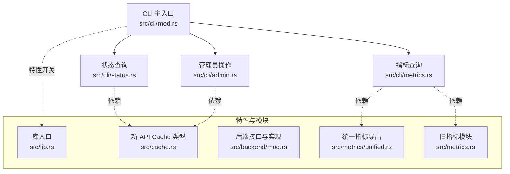
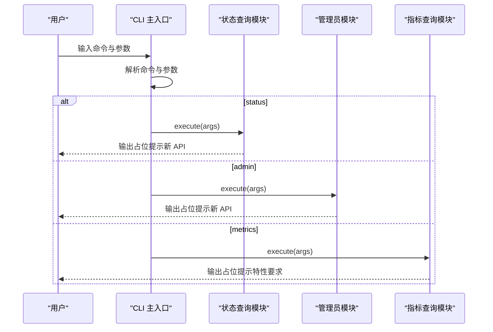
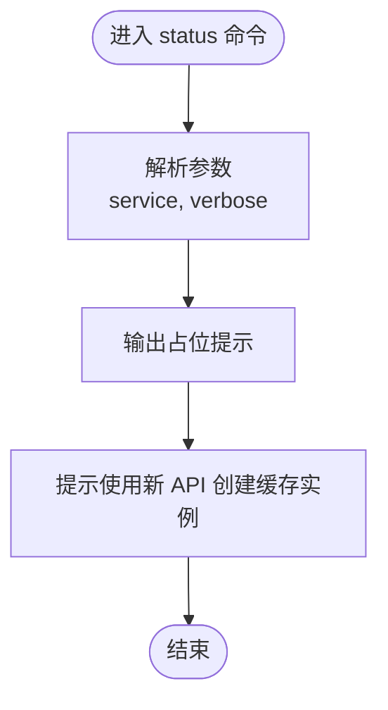
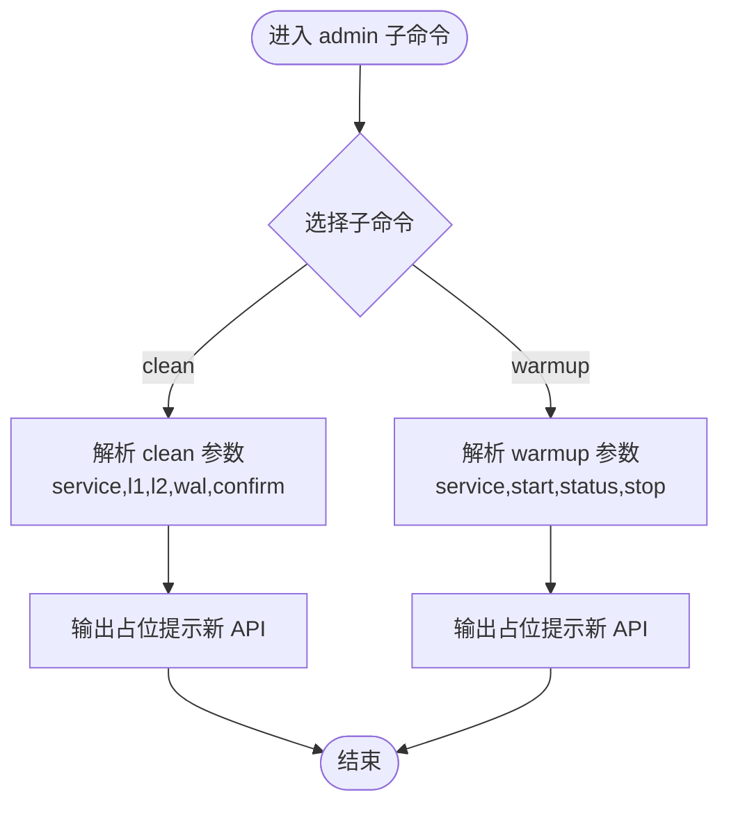
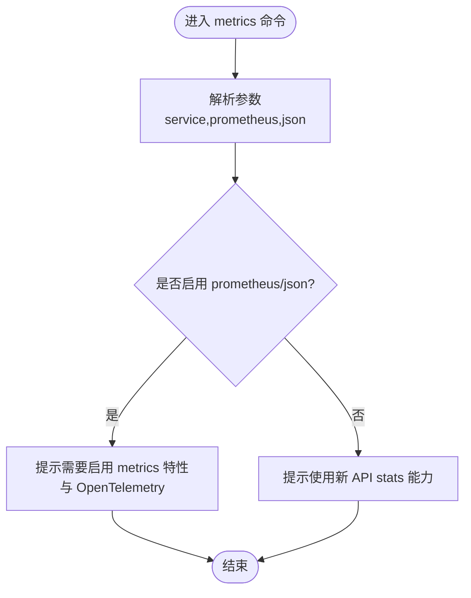
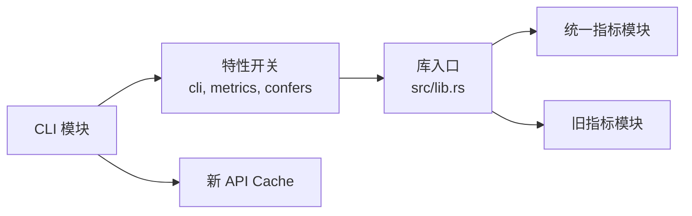

# CLI 工具

<cite>
**本文引用的文件**
- [src/cli/mod.rs](file://src/cli/mod.rs)
- [src/cli/admin.rs](file://src/cli/admin.rs)
- [src/cli/metrics.rs](file://src/cli/metrics.rs)
- [src/cli/status.rs](file://src/cli/status.rs)
- [src/lib.rs](file://src/lib.rs)
- [Cargo.toml](file://Cargo.toml)
- [src/cache.rs](file://src/cache.rs)
- [src/backend/mod.rs](file://src/backend/mod.rs)
- [src/metrics/unified.rs](file://src/metrics/unified.rs)
- [src/metrics.rs](file://src/metrics.rs)
- [tests/integration/cli_test.rs](file://tests/integration/cli_test.rs)
</cite>

## 目录
1. [简介](#简介)
2. [项目结构](#项目结构)
3. [核心组件](#核心组件)
4. [架构总览](#架构总览)
5. [详细组件分析](#详细组件分析)
6. [依赖分析](#依赖分析)
7. [性能考虑](#性能考虑)
8. [故障排查指南](#故障排查指南)
9. [结论](#结论)
10. [附录](#附录)

## 简介
本文件面向运维与开发人员，系统化说明 Oxcache 提供的命令行工具（CLI）能力与使用方法。当前仓库中的 CLI 模块为“占位实现”，其核心命令包括：
- status：查询缓存服务状态
- admin：管理员操作（清理、预热控制等）
- metrics：获取缓存指标

同时，CLI 的部分功能需要配合新的现代 API 与特定特性（如 metrics、confers 等）才能完整生效。本文将结合源码与特性配置，给出可操作的使用说明、常见运维场景示例以及自动化集成建议。

## 项目结构
CLI 相关代码位于 src/cli 目录，采用子命令模式组织，主入口解析命令并分发到对应模块执行。

图表来源
- [src/cli/mod.rs](file://src/cli/mod.rs#L10-L65)
- [src/cli/status.rs](file://src/cli/status.rs#L17-L25)
- [src/cli/admin.rs](file://src/cli/admin.rs#L11-L19)
- [src/cli/metrics.rs](file://src/cli/metrics.rs#L10-L24)
- [src/lib.rs](file://src/lib.rs#L449-L460)
- [src/cache.rs](file://src/cache.rs#L113-L200)
- [src/backend/mod.rs](file://src/backend/mod.rs#L13-L59)
- [src/metrics/unified.rs](file://src/metrics/unified.rs#L159-L715)
- [src/metrics.rs](file://src/metrics.rs#L294-L504)

章节来源
- [src/cli/mod.rs](file://src/cli/mod.rs#L10-L65)
- [src/lib.rs](file://src/lib.rs#L449-L460)

## 核心组件
- 命令定义与分发
  - 主命令结构与子命令注册：status、admin、metrics
  - 参数解析：service、verbose、prometheus、json、confirm 等
- 占位实现
  - status、admin、metrics 当前均为占位输出，提示需使用新 API 与特性支持
- 新 API 与特性
  - 新 Cache API 提供 clear、stats 等能力
  - metrics 特性开启后可导出 Prometheus/JSON 指标
  - confers 特性用于配置加载与 CLI 集成

章节来源
- [src/cli/mod.rs](file://src/cli/mod.rs#L18-L65)
- [src/cli/status.rs](file://src/cli/status.rs#L17-L25)
- [src/cli/admin.rs](file://src/cli/admin.rs#L11-L19)
- [src/cli/metrics.rs](file://src/cli/metrics.rs#L10-L24)
- [src/lib.rs](file://src/lib.rs#L449-L460)

## 架构总览
CLI 的调用流程如下：用户通过命令行输入 -> 解析器解析 -> 分发到具体子命令 -> 执行占位逻辑并提示使用新 API 与特性。

图表来源
- [src/cli/mod.rs](file://src/cli/mod.rs#L57-L65)
- [src/cli/status.rs](file://src/cli/status.rs#L17-L25)
- [src/cli/admin.rs](file://src/cli/admin.rs#L11-L19)
- [src/cli/metrics.rs](file://src/cli/metrics.rs#L10-L24)

## 详细组件分析

### status 子命令
- 功能定位：查询缓存服务状态
- 参数
  - --service/-s：服务名（可选）
  - --verbose/-v：详细输出（布尔）
- 当前行为：输出提示，说明需使用新 Cache API 创建缓存实例（memory/redis/new），并提供示例路径

图表来源
- [src/cli/status.rs](file://src/cli/status.rs#L17-L25)
- [src/cli/mod.rs](file://src/cli/mod.rs#L30-L37)

章节来源
- [src/cli/status.rs](file://src/cli/status.rs#L17-L25)
- [src/cli/mod.rs](file://src/cli/mod.rs#L20-L37)

### admin 子命令组
- 子命令
  - clean：清理缓存数据
  - warmup：缓存预热控制（start/status/stop）
- clean 参数
  - --service/-s：服务名（必填）
  - --l1：清理 L1 缓存
  - --l2：清理 L2 缓存
  - --wal：清理 WAL 日志
  - --confirm/-c：跳过确认
- warmup 参数
  - --service/-s：服务名（必填）
  - --start：开始预热
  - --status：检查预热状态
  - --stop：停止预热
- 当前行为：输出占位提示，说明需使用新 Cache API 的 clear 等方法，并提供示例路径

图表来源
- [src/cli/admin.rs](file://src/cli/admin.rs#L21-L61)
- [src/cli/mod.rs](file://src/cli/mod.rs#L23-L27)

章节来源
- [src/cli/admin.rs](file://src/cli/admin.rs#L11-L61)
- [src/cli/mod.rs](file://src/cli/mod.rs#L23-L27)

### metrics 子命令
- 功能定位：获取缓存指标
- 参数
  - --service/-s：服务名（可选）
  - --prometheus：输出 Prometheus 格式
  - --json：输出 JSON 格式
- 当前行为：若启用 prometheus/json，则提示需要启用 metrics 特性与 OpenTelemetry；否则提示需使用新 Cache API 的 stats 能力，并提供示例路径

图表来源
- [src/cli/metrics.rs](file://src/cli/metrics.rs#L10-L24)
- [src/cli/mod.rs](file://src/cli/mod.rs#L26-L49)

章节来源
- [src/cli/metrics.rs](file://src/cli/metrics.rs#L10-L24)
- [src/cli/mod.rs](file://src/cli/mod.rs#L26-L49)

### 新 API 与指标导出（背景知识）
- 新 Cache API
  - 提供 clear、stats 等方法，支持内存与 Redis 后端
- 指标导出
  - 统一指标模块支持 Prometheus/JSON 导出
  - 旧指标模块提供历史导出能力

章节来源
- [src/cache.rs](file://src/cache.rs#L113-L200)
- [src/metrics/unified.rs](file://src/metrics/unified.rs#L159-L715)
- [src/metrics.rs](file://src/metrics.rs#L294-L504)

## 依赖分析
- CLI 依赖特性
  - cli：启用 clap、dashmap、tracing、metrics
  - metrics：启用 opentelemetry、dashmap
  - confers：启用配置加载
- 模块耦合
  - CLI 与新 API（Cache）存在概念上的依赖关系（当前为占位提示）
  - 指标导出依赖统一指标模块与旧指标模块

图表来源
- [Cargo.toml](file://Cargo.toml#L345-L346)
- [src/lib.rs](file://src/lib.rs#L449-L460)
- [src/metrics/unified.rs](file://src/metrics/unified.rs#L159-L715)
- [src/metrics.rs](file://src/metrics.rs#L294-L504)

章节来源
- [Cargo.toml](file://Cargo.toml#L345-L346)
- [src/lib.rs](file://src/lib.rs#L449-L460)

## 性能考虑
- CLI 当前为占位实现，无直接性能开销
- 指标导出涉及并发映射与格式化，建议在生产环境启用 metrics 特性并合理配置导出频率
- 使用新 API 的 stats 能力进行轻量级状态查询，避免频繁重载或阻塞操作

## 故障排查指南
- CLI 不可用或报错
  - 确认已启用 cli 特性（默认启用 full）
  - 若仅需 CLI，可在 Cargo.toml 中启用 cli 特性
- 指标无法导出
  - 若使用 --prometheus/--json，需启用 metrics 特性与 OpenTelemetry
  - 若未启用相应特性，CLI 将提示需要启用
- 状态/管理员功能无效
  - 当前为占位提示，需使用新 Cache API 创建缓存实例并调用相应方法

章节来源
- [src/cli/metrics.rs](file://src/cli/metrics.rs#L10-L24)
- [src/cli/status.rs](file://src/cli/status.rs#L17-L25)
- [src/cli/admin.rs](file://src/cli/admin.rs#L11-L19)
- [Cargo.toml](file://Cargo.toml#L345-L346)

## 结论
- 当前 CLI 为占位实现，核心功能提示使用新 Cache API 与特性（metrics、confers）
- 在启用相应特性后，CLI 将具备更完整的运维能力（状态查询、管理员操作、指标导出）
- 建议在生产环境中启用 metrics 特性并结合统一指标模块进行监控与告警

## 附录

### CLI 命令与参数速览
- status
  - --service/-s：服务名（可选）
  - --verbose/-v：详细输出
- admin
  - clean
    - --service/-s：服务名（必填）
    - --l1：清理 L1
    - --l2：清理 L2
    - --wal：清理 WAL
    - --confirm/-c：跳过确认
  - warmup
    - --service/-s：服务名（必填）
    - --start：开始预热
    - --status：检查预热状态
    - --stop：停止预热
- metrics
  - --service/-s：服务名（可选）
  - --prometheus：输出 Prometheus 格式
  - --json：输出 JSON 格式

章节来源
- [src/cli/mod.rs](file://src/cli/mod.rs#L30-L49)
- [src/cli/admin.rs](file://src/cli/admin.rs#L21-L61)

### 常用运维场景示例（基于占位提示）
- 查询缓存状态
  - 使用新 API 创建缓存实例（memory/redis/new），参考示例路径
- 清理缓存
  - 使用新 API 的 clear 方法清理 L1/L2/WAL
- 指标导出
  - 启用 metrics 特性后，使用统一指标模块导出 Prometheus/JSON

章节来源
- [src/cli/status.rs](file://src/cli/status.rs#L17-L25)
- [src/cli/admin.rs](file://src/cli/admin.rs#L11-L19)
- [src/cli/metrics.rs](file://src/cli/metrics.rs#L10-L24)

### 自动化集成与脚本编写指南
- 基于占位提示的集成
  - 在自动化脚本中先检查特性是否启用（metrics、confers）
  - 使用新 API 的 stats/clear 等方法进行状态查询与清理
- 指标采集
  - 启用 metrics 特性后，定期导出 Prometheus/JSON 指标并写入监控系统
- 兼容性注意
  - 当前 CLI 为占位实现，建议在业务代码中直接调用新 API 并通过外部脚本封装 CLI 行为

章节来源
- [src/lib.rs](file://src/lib.rs#L449-L460)
- [src/metrics/unified.rs](file://src/metrics/unified.rs#L159-L715)
- [tests/integration/cli_test.rs](file://tests/integration/cli_test.rs#L7-L11)