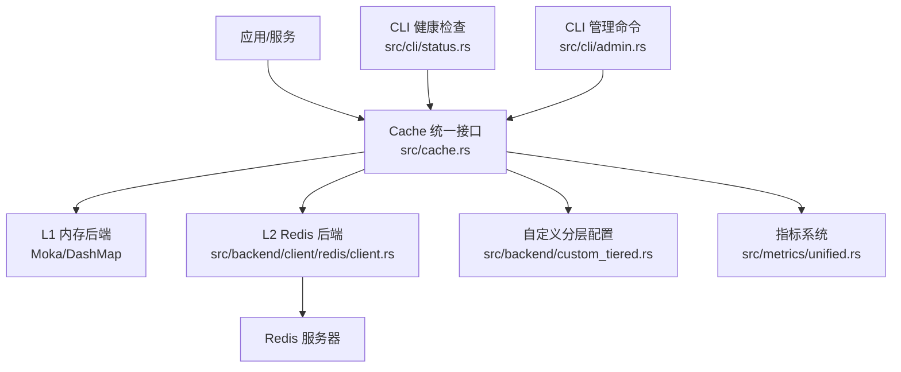
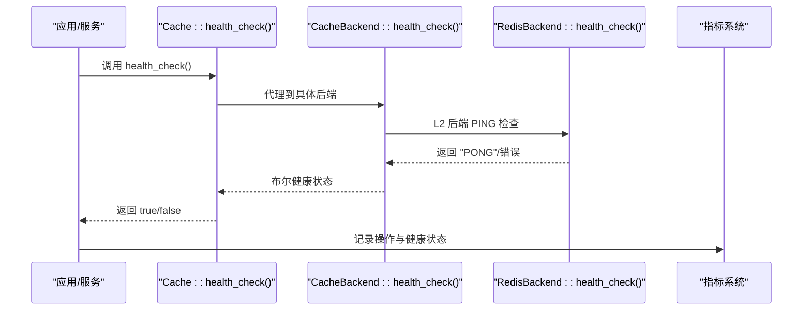
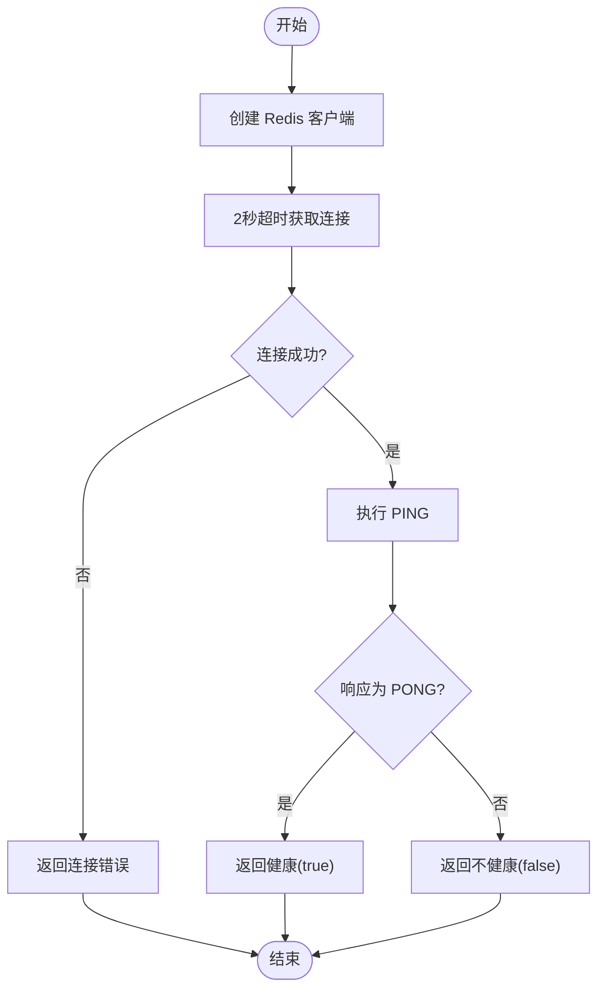
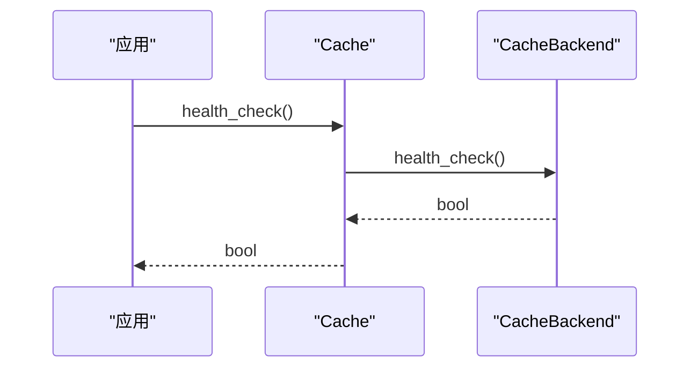
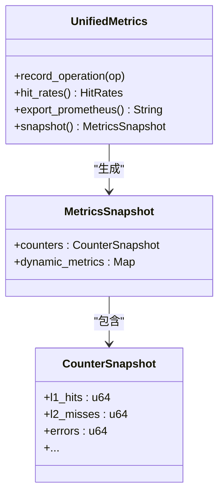
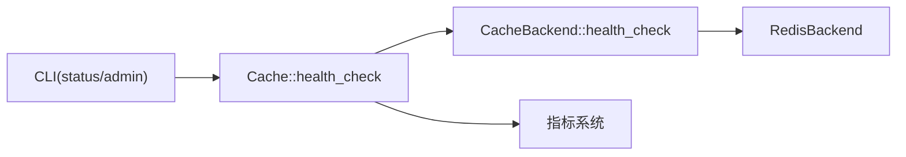

# 健康检查

<cite>
**本文引用的文件**
- [src/cache.rs](file://src/cache.rs)
- [src/backend/client/redis/client.rs](file://src/backend/client/redis/client.rs)
- [src/backend/custom_tiered.rs](file://src/backend/custom_tiered.rs)
- [src/backend/mod.rs](file://src/backend/mod.rs)
- [src/backend/client/mod.rs](file://src/backend/client/mod.rs)
- [src/metrics/unified.rs](file://src/metrics/unified.rs)
- [src/metrics.rs](file://src/metrics.rs)
- [src/cli/status.rs](file://src/cli/status.rs)
- [src/cli/admin.rs](file://src/cli/admin.rs)
- [src/builder/backend_builder.rs](file://src/builder/backend_builder.rs)
- [tests/integration/degradation_tests.rs](file://tests/integration/degradation_tests.rs)
</cite>

## 目录
1. [简介](#简介)
2. [项目结构](#项目结构)
3. [核心组件](#核心组件)
4. [架构总览](#架构总览)
5. [详细组件分析](#详细组件分析)
6. [依赖关系分析](#依赖关系分析)
7. [性能考量](#性能考量)
8. [故障排查指南](#故障排查指南)
9. [结论](#结论)
10. [附录](#附录)

## 简介
本文件系统化阐述 Oxcache 缓存系统的健康检查机制，覆盖 L1 与 L2 后端的连通性检查、性能指标采集、触发条件与频率配置、CLI 手动检查、容器编排集成、失败诊断与自动恢复策略，以及指标阈值与告警配置建议。目标是帮助运维与开发者建立稳定可靠的缓存可观测性与自愈体系。

## 项目结构
围绕健康检查与监控的关键模块与文件如下：
- 缓存统一接口与健康检查入口：src/cache.rs
- L2 Redis 后端健康检查与统计：src/backend/client/redis/client.rs
- 自定义分层后端与后端类型约束：src/backend/custom_tiered.rs
- 后端模块聚合与导出：src/backend/mod.rs、src/backend/client/mod.rs
- 指标系统（统一与历史）：src/metrics/unified.rs、src/metrics.rs
- CLI 健康检查与管理命令：src/cli/status.rs、src/cli/admin.rs
- 构建器健康检查测试：src/builder/backend_builder.rs
- 降级与健康状态测试：tests/integration/degradation_tests.rs

图表来源
- [src/cache.rs](file://src/cache.rs#L534-L556)
- [src/backend/client/redis/client.rs](file://src/backend/client/redis/client.rs#L455-L474)
- [src/backend/custom_tiered.rs](file://src/backend/custom_tiered.rs#L362-L445)
- [src/metrics/unified.rs](file://src/metrics/unified.rs#L159-L509)
- [src/cli/status.rs](file://src/cli/status.rs#L17-L25)
- [src/cli/admin.rs](file://src/cli/admin.rs#L11-L19)

章节来源
- [src/cache.rs](file://src/cache.rs#L534-L556)
- [src/backend/client/redis/client.rs](file://src/backend/client/redis/client.rs#L455-L474)
- [src/backend/custom_tiered.rs](file://src/backend/custom_tiered.rs#L362-L445)
- [src/metrics/unified.rs](file://src/metrics/unified.rs#L159-L509)
- [src/cli/status.rs](file://src/cli/status.rs#L17-L25)
- [src/cli/admin.rs](file://src/cli/admin.rs#L11-L19)

## 核心组件
- 健康检查入口与封装
  - Cache::health_check() 代理至底层 CacheBackend::health_check()，统一对外暴露健康状态布尔值。
- L2 Redis 健康检查
  - RedisBackend::health_check() 通过 PING 命令快速验证连接可用性；同时提供 stats() 输出内存信息，辅助诊断。
- 指标采集与导出
  - UnifiedMetrics 提供命中率、计数器、动态指标与 Prometheus 导出；历史 metrics.rs 提供 L2 健康状态、WAL 条目、操作耗时等指标导出。
- CLI 健康检查
  - status 子命令提示需使用新 Cache API；admin 子命令提供清理与预热控制，间接影响健康状态。
- 自定义分层后端
  - BackendType 与 LayerRestriction 约束后端与层级匹配，避免错误配置导致的健康问题。

章节来源
- [src/cache.rs](file://src/cache.rs#L534-L556)
- [src/backend/client/redis/client.rs](file://src/backend/client/redis/client.rs#L455-L474)
- [src/metrics/unified.rs](file://src/metrics/unified.rs#L159-L509)
- [src/cli/status.rs](file://src/cli/status.rs#L17-L25)
- [src/cli/admin.rs](file://src/cli/admin.rs#L11-L19)
- [src/backend/custom_tiered.rs](file://src/backend/custom_tiered.rs#L362-L445)

## 架构总览
健康检查贯穿“调用层 → 后端层 → 指标层”的链路，形成闭环：调用侧发起检查，后端执行连通性验证，指标系统记录并导出，CLI 与容器编排读取指标进行决策。

图表来源
- [src/cache.rs](file://src/cache.rs#L534-L556)
- [src/backend/client/redis/client.rs](file://src/backend/client/redis/client.rs#L455-L474)
- [src/metrics/unified.rs](file://src/metrics/unified.rs#L176-L273)

## 详细组件分析

### L2 Redis 健康检查实现
- 连接验证流程
  - 构造客户端并快速获取连接管理器，超时 2 秒；若超时或连接错误，返回连接类错误。
  - 执行 PING 命令，期望返回 "PONG"，否则视为不健康。
- 统计信息
  - stats() 返回 INFO memory 片段，便于观察内存占用与碎片情况。
- 错误分类
  - 连接错误与操作错误区分，确保健康检查不会被业务异常污染。

图表来源
- [src/backend/client/redis/client.rs](file://src/backend/client/redis/client.rs#L162-L212)
- [src/backend/client/redis/client.rs](file://src/backend/client/redis/client.rs#L455-L474)

章节来源
- [src/backend/client/redis/client.rs](file://src/backend/client/redis/client.rs#L162-L212)
- [src/backend/client/redis/client.rs](file://src/backend/client/redis/client.rs#L455-L474)

### Cache 统一健康检查入口
- Cache::health_check() 直接委托底层 CacheBackend::health_check()，屏蔽 L1/L2 实现差异。
- 适用于内存后端与 Redis 后端，统一返回布尔值，便于上层编排与告警。

图表来源
- [src/cache.rs](file://src/cache.rs#L534-L556)

章节来源
- [src/cache.rs](file://src/cache.rs#L534-L556)

### 指标系统与健康状态导出
- UnifiedMetrics
  - 记录 L1/L2 命中/未命中/删除/设置/错误等计数器，计算命中率，并支持 Prometheus 导出。
  - 提供 snapshot() 与 export_prometheus()，便于 CLI 与监控系统抓取。
- 历史 metrics.rs
  - 提供 L2 健康状态、WAL 条目、操作耗时等指标导出，适配 Prometheus 格式。
- 指标命名与含义
  - cache_l1_hits_total、cache_l2_misses_total、cache_errors_total 等。
  - cache_l2_health_status、cache_wal_entries、cache_operation_duration_seconds 等。

图表来源
- [src/metrics/unified.rs](file://src/metrics/unified.rs#L159-L509)

章节来源
- [src/metrics/unified.rs](file://src/metrics/unified.rs#L159-L509)
- [src/metrics.rs](file://src/metrics.rs#L294-L504)

### CLI 健康检查与管理
- status 子命令
  - 提示需要使用新 Cache API 的 Cache::memory()/redis()/builder() 创建实例后执行健康检查。
- admin 子命令
  - clean 与 warmup 子命令可用于清理与预热，间接影响健康状态与性能表现。

章节来源
- [src/cli/status.rs](file://src/cli/status.rs#L17-L25)
- [src/cli/admin.rs](file://src/cli/admin.rs#L11-L19)

### 自定义分层后端与健康约束
- BackendType 与 LayerRestriction
  - Moka/DashMap 推荐 L1；Redis/Sqlite 推荐 L2/L3；Tiered/Custom 支持任意层级。
  - 配置校验与自动修复，避免层级与后端类型不匹配导致的健康问题。
- BackendProvider
  - 默认提供者根据层级创建对应后端，支持可插拔扩展。

章节来源
- [src/backend/custom_tiered.rs](file://src/backend/custom_tiered.rs#L362-L445)
- [src/backend/custom_tiered.rs](file://src/backend/custom_tiered.rs#L587-L682)

## 依赖关系分析
- Cache 统一接口依赖底层 CacheBackend trait，健康检查通过该抽象向下委派。
- RedisBackend 实现 CacheBackend，提供 PING 健康检查与 INFO 统计。
- 指标系统独立于后端，通过记录操作与健康状态，统一导出。
- CLI 通过 Cache API 与指标系统交互，实现健康检查与运维管理。

图表来源
- [src/cache.rs](file://src/cache.rs#L534-L556)
- [src/backend/client/redis/client.rs](file://src/backend/client/redis/client.rs#L455-L474)
- [src/metrics/unified.rs](file://src/metrics/unified.rs#L159-L509)
- [src/cli/status.rs](file://src/cli/status.rs#L17-L25)
- [src/cli/admin.rs](file://src/cli/admin.rs#L11-L19)

章节来源
- [src/cache.rs](file://src/cache.rs#L534-L556)
- [src/backend/client/redis/client.rs](file://src/backend/client/redis/client.rs#L455-L474)
- [src/metrics/unified.rs](file://src/metrics/unified.rs#L159-L509)
- [src/cli/status.rs](file://src/cli/status.rs#L17-L25)
- [src/cli/admin.rs](file://src/cli/admin.rs#L11-L19)

## 性能考量
- 健康检查应轻量且低延迟
  - Redis PING 仅做连通性验证，避免复杂操作；默认 2 秒超时，防止阻塞。
- 指标开销控制
  - UnifiedMetrics 使用原子计数器与低频动态指标，Prometheus 导出按需抓取。
- 频率与触发
  - 建议：健康检查每 10–30 秒一次；在高流量场景下可增加采样频率并降低单次检查负载。
  - 触发条件：启动阶段、连接断开后首次操作、周期性巡检、指标异常告警后触发。

[本节为通用指导，无需列出具体文件来源]

## 故障排查指南
- 健康检查失败
  - Redis 连接失败：检查连接串、网络、认证与 TLS 配置；确认 2 秒超时内可获取连接管理器。
  - PING 失败：查看 Redis 日志与内存占用，结合 stats() 输出定位问题。
- 指标异常
  - 命中率骤降：检查 L1 容量与淘汰策略、L2 可用性与延迟；关注 cache_errors_total。
  - L2 健康状态异常：结合 cache_l2_health_status 与 cache_wal_entries 判断后端状态与写放大。
- 自动恢复策略
  - 连续失败达到阈值后，触发降级（如切换到内存 L1）、熔断（短暂停止 L2 写入）、重试与退避。
  - 预热：在 L2 恢复后执行 warmup，逐步提升命中率。
- 测试参考
  - 降级与健康状态测试文件可作为行为基线与回归参考。

章节来源
- [src/backend/client/redis/client.rs](file://src/backend/client/redis/client.rs#L162-L212)
- [src/backend/client/redis/client.rs](file://src/backend/client/redis/client.rs#L455-L474)
- [src/metrics/unified.rs](file://src/metrics/unified.rs#L481-L508)
- [src/metrics.rs](file://src/metrics.rs#L294-L504)
- [tests/integration/degradation_tests.rs](file://tests/integration/degradation_tests.rs#L1-L5)

## 结论
Oxcache 的健康检查机制以 Cache::health_check() 为核心，结合 RedisBackend 的 PING 检查与指标系统，形成“轻量、可观测、可恢复”的健康保障体系。通过 CLI 与容器编排集成，可在多环境下实现自动化巡检与自愈。

[本节为总结性内容，无需列出具体文件来源]

## 附录

### 健康检查触发条件与频率配置建议
- 触发条件
  - 应用启动后立即执行一次健康检查。
  - 连接断开后首次业务操作前触发。
  - 指标异常（如命中率低于阈值、错误计数上升）后触发。
- 检查频率
  - 基准：每 10–30 秒一次。
  - 高风险时段：每 5–10 秒一次。
  - 降级期间：延长至 1–2 分钟，减少额外压力。

[本节为通用指导，无需列出具体文件来源]

### CLI 手动健康检查
- 使用新 Cache API 创建实例后执行健康检查
  - Cache::memory() 或 Cache::redis() 创建缓存实例。
  - 调用 Cache::health_check() 获取健康状态。
- CLI 提示
  - status 子命令提示需使用新 API；admin 子命令用于清理与预热。

章节来源
- [src/cli/status.rs](file://src/cli/status.rs#L17-L25)
- [src/cache.rs](file://src/cache.rs#L140-L203)

### 容器编排集成（Kubernetes/Docker）
- 健康探针
  - livenessProbe：定期执行 Cache::health_check()，失败则重启容器。
  - readinessProbe：等待健康检查通过后再接收流量。
- 指标抓取
  - Prometheus 抓取 /metrics 导出端点，消费 UnifiedMetrics 与历史 metrics 导出。
- 配置要点
  - 为 Redis 设置 rediss:// 并在生产环境强制 TLS。
  - 通过环境变量控制检查超时与频率。

[本节为通用指导，无需列出具体文件来源]

### 健康检查指标阈值与告警配置建议
- 命中率
  - L1 命中率 < 期望阈值（例如 70%）持续 N 分钟触发告警。
  - L2 命中率 < 期望阈值（例如 30%）触发告警。
- 错误与延迟
  - cache_errors_total 增长速率异常触发告警。
  - cache_operation_duration_seconds 中位数/95 分位显著上升触发告警。
- L2 健康状态
  - cache_l2_health_status 非 1 持续一段时间触发告警。
- 自动恢复
  - 连续 N 次失败后，自动降级至 L1、熔断 L2 写入、触发预热。

章节来源
- [src/metrics/unified.rs](file://src/metrics/unified.rs#L481-L508)
- [src/metrics.rs](file://src/metrics.rs#L294-L504)