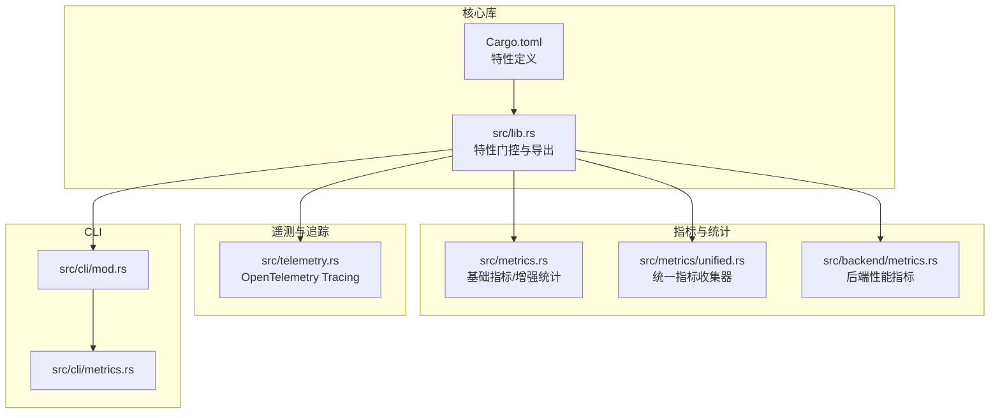
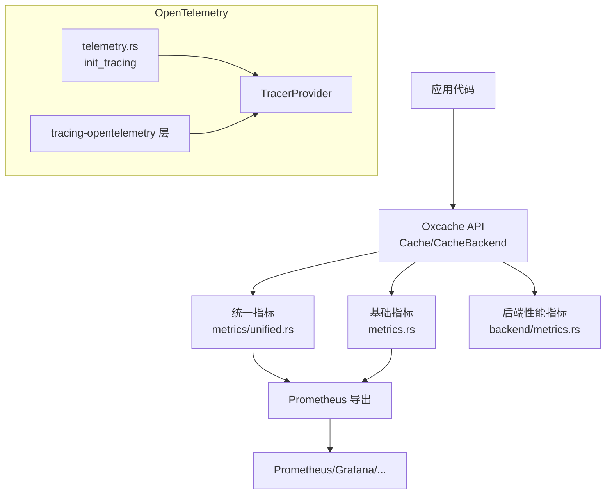
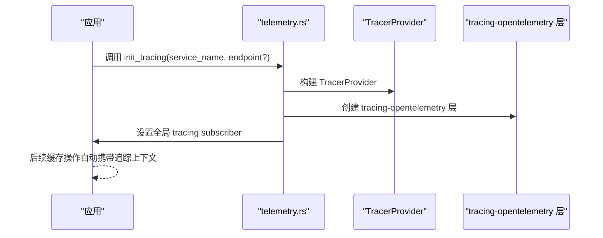
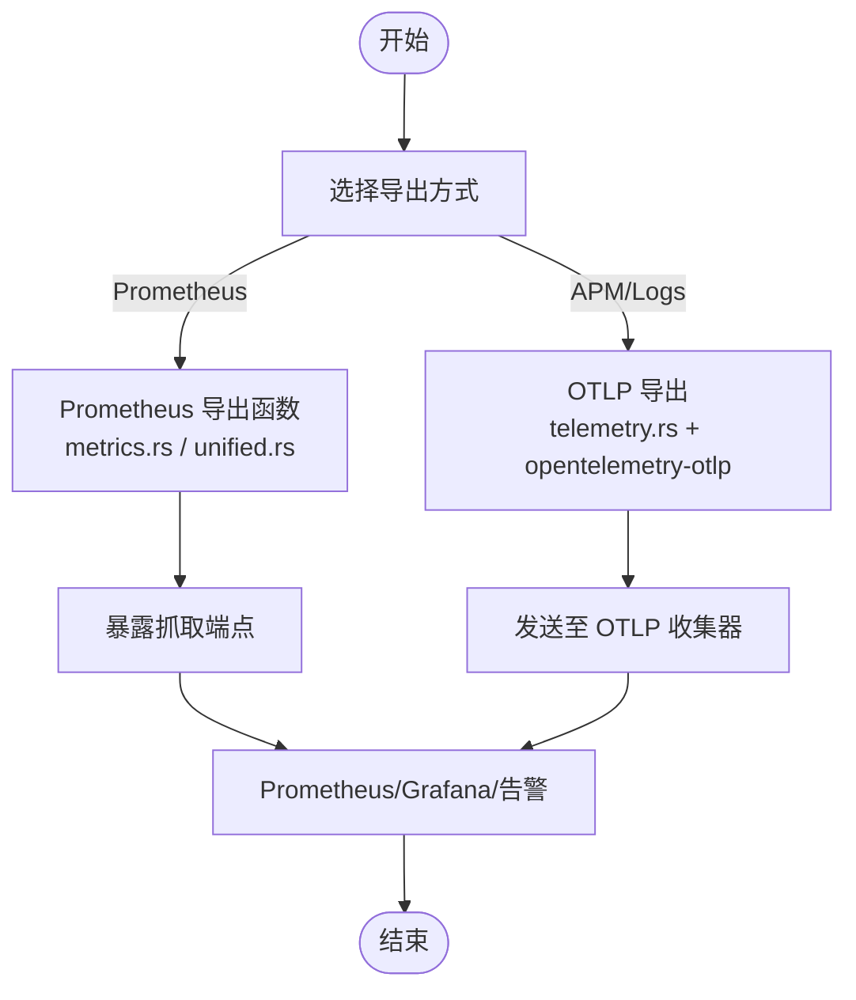
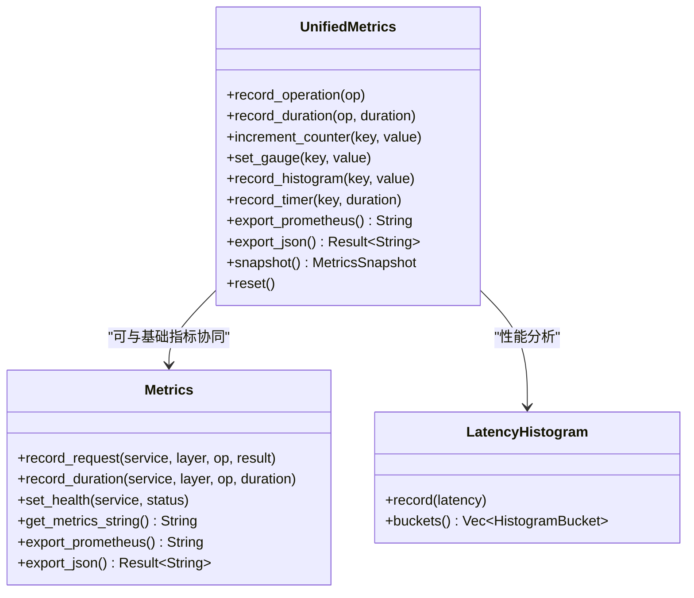
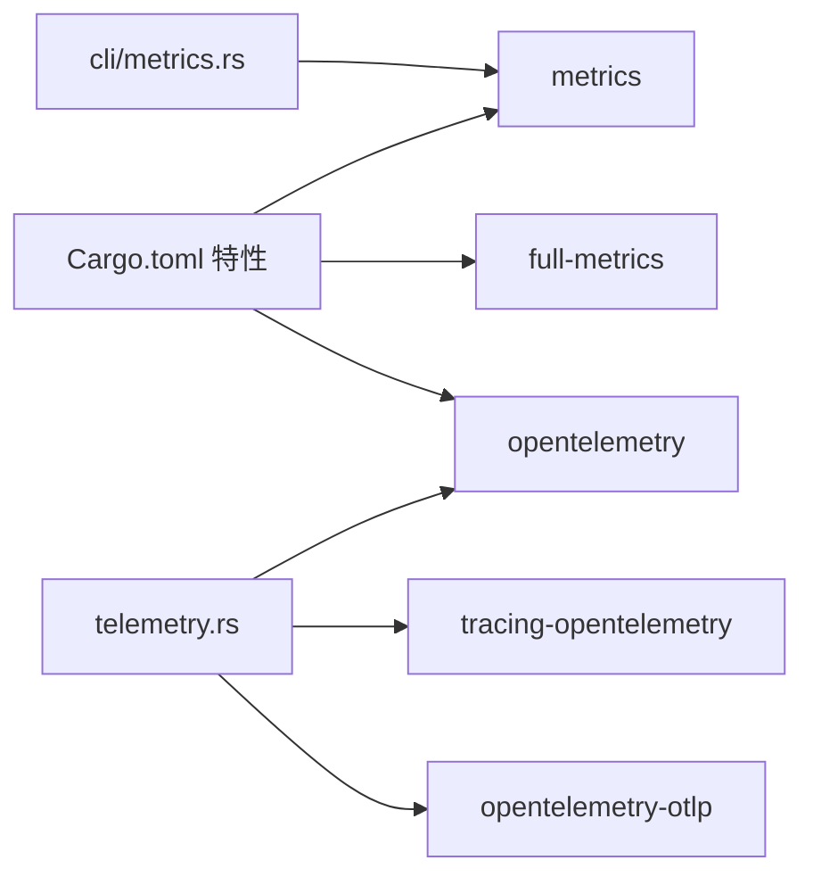

# 外部集成

<cite>
**本文引用的文件**   
- [src/lib.rs](file://src/lib.rs)
- [src/telemetry.rs](file://src/telemetry.rs)
- [src/metrics.rs](file://src/metrics.rs)
- [src/metrics/unified.rs](file://src/metrics/unified.rs)
- [src/backend/metrics.rs](file://src/backend/metrics.rs)
- [src/cli/mod.rs](file://src/cli/mod.rs)
- [src/cli/metrics.rs](file://src/cli/metrics.rs)
- [Cargo.toml](file://Cargo.toml)
- [docs/API_REFERENCE.md](file://docs/API_REFERENCE.md)
- [README.md](file://README.md)
</cite>

## 目录
1. [简介](#简介)
2. [项目结构](#项目结构)
3. [核心组件](#核心组件)
4. [架构总览](#架构总览)
5. [详细组件分析](#详细组件分析)
6. [依赖分析](#依赖分析)
7. [性能考量](#性能考量)
8. [故障排查指南](#故障排查指南)
9. [结论](#结论)
10. [附录](#附录)

## 简介
本文件面向需要将 Oxcache 与第三方监控与观测平台进行外部集成的工程团队，系统阐述以下内容：
- 如何启用与 OpenTelemetry 的集成，包括指标导出器配置、追踪上下文传播、属性标签设置等
- 如何将 Oxcache 指标导入到 Prometheus、Grafana、DataDog、NewRelic 等监控平台
- 自定义指标收集器的实现方法，如何扩展指标体系满足特定需求
- 与 APM 工具的集成配置，覆盖性能分析、错误追踪、用户体验监控等
- 集成部署的最佳实践与常见问题排查

## 项目结构
Oxcache 通过特性门控（feature flags）组织可观测性能力，核心模块与可观测性相关的关键位置如下：
- 指标与统计：基础指标与增强统计、统一指标收集器
- 遥测与追踪：OpenTelemetry 集成入口
- 后端性能指标：延迟直方图、滑动窗口指标等
- CLI：指标查询命令（受特性影响）

**图表来源**
- [src/lib.rs](file://src/lib.rs#L434-L486)
- [src/metrics.rs](file://src/metrics.rs#L1-L120)
- [src/metrics/unified.rs](file://src/metrics/unified.rs#L1-L120)
- [src/backend/metrics.rs](file://src/backend/metrics.rs#L1-L120)
- [src/telemetry.rs](file://src/telemetry.rs#L1-L57)
- [src/cli/mod.rs](file://src/cli/mod.rs#L1-L65)
- [src/cli/metrics.rs](file://src/cli/metrics.rs#L1-L25)
- [Cargo.toml](file://Cargo.toml#L235-L347)

**章节来源**
- [src/lib.rs](file://src/lib.rs#L434-L486)
- [Cargo.toml](file://Cargo.toml#L235-L347)

## 核心组件
- 指标与统计
  - 基础指标与增强统计：提供 L1/L2 命中/未命中、操作总数、容量使用、预取/压缩统计等，并可导出 Prometheus/JSON
  - 统一指标收集器：集中式的高并发指标收集，支持计数器、仪表盘、直方图、定时器与文本信息
  - 后端性能指标：延迟直方图、滑动窗口指标，便于窗口化性能分析
- 遥测与追踪
  - OpenTelemetry Tracing 初始化：提供初始化函数，结合 tracing-opentelemetry 与 opentelemetry-otlp
- CLI 指标查询
  - 指令行工具支持指标查询（受特性影响）

**章节来源**
- [src/metrics.rs](file://src/metrics.rs#L73-L120)
- [src/metrics/unified.rs](file://src/metrics/unified.rs#L15-L120)
- [src/backend/metrics.rs](file://src/backend/metrics.rs#L71-L120)
- [src/telemetry.rs](file://src/telemetry.rs#L12-L56)
- [src/cli/metrics.rs](file://src/cli/metrics.rs#L10-L24)

## 架构总览
Oxcache 的可观测性架构围绕“指标 + 遥测”两条主线展开：
- 指标：通过基础指标与统一指标收集器记录高频/低频指标；通过导出函数输出 Prometheus/JSON 文本
- 遥测：通过 OpenTelemetry Tracing 初始化，将缓存操作纳入分布式追踪上下文

**图表来源**
- [src/metrics.rs](file://src/metrics.rs#L256-L361)
- [src/metrics/unified.rs](file://src/metrics/unified.rs#L468-L509)
- [src/backend/metrics.rs](file://src/backend/metrics.rs#L524-L571)
- [src/telemetry.rs](file://src/telemetry.rs#L26-L56)

## 详细组件分析

### OpenTelemetry 集成
- 初始化入口
  - 提供 init_tracing(service_name, endpoint_opt) 函数，创建 TracerProvider 并注入 tracing-opentelemetry 层
  - 生产环境建议配置 opentelemetry-otlp 以将追踪数据发送至 OTLP 收集器
- 上下文传播
  - 通过 tracing-opentelemetry 层自动传播追踪上下文，确保跨服务调用的链路连贯
- 属性与标签
  - 在记录指标时，统一使用层/操作/结果等维度作为标签键，便于在不同平台进行聚合与过滤

**图表来源**
- [src/telemetry.rs](file://src/telemetry.rs#L26-L56)

**章节来源**
- [src/telemetry.rs](file://src/telemetry.rs#L12-L56)
- [Cargo.toml](file://Cargo.toml#L156-L158)

### 指标导出与平台对接
- Prometheus
  - 基础指标导出：get_metrics_string() 与 export_prometheus_format()/export_json_format()
  - 统一指标导出：UnifiedMetrics.export_prometheus() 与 MetricsSnapshot.export_prometheus()
  - 平台对接要点
    - Prometheus 抓取：将导出文本暴露给 Prometheus 抓取端点
    - 标签与命名：遵循 Prometheus 规范，使用下划线与冒号分隔，避免非法字符
- Grafana
  - 使用 Prometheus 数据源，基于导出指标构建面板
  - 关键指标：命中率、操作总数、延迟直方图、容量使用、错误计数等
- DataDog
  - 方案一：通过 Prometheus 接收器或 OTLP 接收器将指标上报至 DataDog
  - 方案二：在应用侧使用 DataDog APM/Logs 与 OpenTelemetry 集成，结合缓存操作 span
- NewRelic
  - 通过 OTLP 接收器将追踪与指标上报至 NewRelic，或使用 Prometheus 接收器对接

**图表来源**
- [src/metrics.rs](file://src/metrics.rs#L256-L361)
- [src/metrics/unified.rs](file://src/metrics/unified.rs#L468-L509)
- [src/telemetry.rs](file://src/telemetry.rs#L26-L56)
- [Cargo.toml](file://Cargo.toml#L156-L158)

**章节来源**
- [src/metrics.rs](file://src/metrics.rs#L256-L361)
- [src/metrics/unified.rs](file://src/metrics/unified.rs#L468-L509)
- [docs/API_REFERENCE.md](file://docs/API_REFERENCE.md#L27-L92)

### 自定义指标收集器与扩展
- 统一指标收集器（UnifiedMetrics）
  - 支持计数器、仪表盘、直方图、定时器与文本信息
  - 提供增量计数、设置仪表盘值、记录直方图与定时器的能力
  - 支持导出 Prometheus/JSON，便于接入任意监控平台
- 基础指标（Metrics）
  - 高频路径使用原子计数器，低频路径使用无锁哈希表
  - 提供 get_metrics_string() 与增强统计导出
- 后端性能指标
  - 延迟直方图与滑动窗口指标，适合窗口化性能分析与告警

**图表来源**
- [src/metrics/unified.rs](file://src/metrics/unified.rs#L159-L509)
- [src/metrics.rs](file://src/metrics.rs#L103-L254)
- [src/backend/metrics.rs](file://src/backend/metrics.rs#L71-L200)

**章节来源**
- [src/metrics/unified.rs](file://src/metrics/unified.rs#L159-L509)
- [src/metrics.rs](file://src/metrics.rs#L103-L254)
- [src/backend/metrics.rs](file://src/backend/metrics.rs#L71-L200)

### APM 工具集成配置
- 性能分析
  - 使用 OpenTelemetry Tracing 将缓存操作（Get/Set/Delete）包装为 spans
  - 结合延迟直方图与滑动窗口指标，构建 P50/P95/P99 延迟分析
- 错误追踪
  - 在记录指标时区分 CacheOpResult::Error，便于在 APM 中识别错误热点
- 用户体验监控
  - 通过指标导出与告警规则，监控命中率下降、延迟上升、错误率异常等用户体验指标

**章节来源**
- [src/metrics/unified.rs](file://src/metrics/unified.rs#L176-L273)
- [src/backend/metrics.rs](file://src/backend/metrics.rs#L524-L670)

## 依赖分析
- 特性门控与可观测性
  - metrics：启用基础指标与增强统计
  - full-metrics：启用 OpenTelemetry 与 OTLP 导出
  - opentelemetry：启用 OpenTelemetry SDK 与 tracing-subscriber
- 依赖关系
  - telemetry.rs 依赖 opentelemetry/opentelemetry_sdk/tracing-opentelemetry
  - CLI 指令受特性影响，需启用相应特性才能输出指标

**图表来源**
- [Cargo.toml](file://Cargo.toml#L144-L158)
- [src/telemetry.rs](file://src/telemetry.rs#L7-L10)
- [src/cli/metrics.rs](file://src/cli/metrics.rs#L11-L14)

**章节来源**
- [Cargo.toml](file://Cargo.toml#L235-L347)
- [src/telemetry.rs](file://src/telemetry.rs#L7-L10)
- [src/cli/metrics.rs](file://src/cli/metrics.rs#L11-L14)

## 性能考量
- 指标记录的性能
  - 基础指标高频路径使用原子计数器，降低锁竞争
  - 统一指标收集器对高并发场景进行了优化，建议在高 QPS 场景优先使用统一指标
- 导出开销
  - Prometheus 导出为纯文本拼接，建议在独立端点或后台任务中定期导出
- 追踪开销
  - OTLP 导出会带来网络与序列化开销，建议按采样比例配置

## 故障排查指南
- 指标不可见
  - 确认已启用 metrics 或 full-metrics 特性
  - 检查导出函数是否被调用（Prometheus 端点或应用内导出）
- OTLP 无法上报
  - 确认已启用 opentelemetry 与 opentelemetry-otlp 特性
  - 检查 endpoint 配置与网络连通性
- CLI 指标查询无效
  - 确认已启用 cli 与 metrics 特性
  - 按提示使用新 API 获取指标

**章节来源**
- [src/cli/metrics.rs](file://src/cli/metrics.rs#L10-L24)
- [docs/API_REFERENCE.md](file://docs/API_REFERENCE.md#L27-L92)

## 结论
Oxcache 提供了完善的可观测性基础设施：既能通过基础与统一指标收集器满足 Prometheus/Grafana 等平台的监控需求，又能借助 OpenTelemetry 与 OTLP 实现与 APM 工具的深度集成。通过特性门控与模块化设计，用户可根据自身平台与需求灵活启用与扩展。

## 附录
- 快速启用建议
  - Prometheus + Grafana：启用 metrics 特性，使用导出函数暴露端点
  - DataDog/NewRelic：启用 full-metrics 特性，配置 OTLP 接收器
  - APM：启用 opentelemetry 特性，结合 tracing-opentelemetry 传播上下文
- 参考文档与示例
  - API 参考与特性说明：[API_REFERENCE.md](file://docs/API_REFERENCE.md#L27-L92)
  - 项目特性与默认启用：[README.md](file://README.md#L75-L115)
  - 特性定义与依赖：[Cargo.toml](file://Cargo.toml#L235-L347)