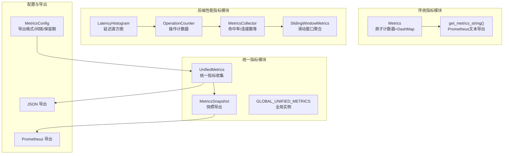
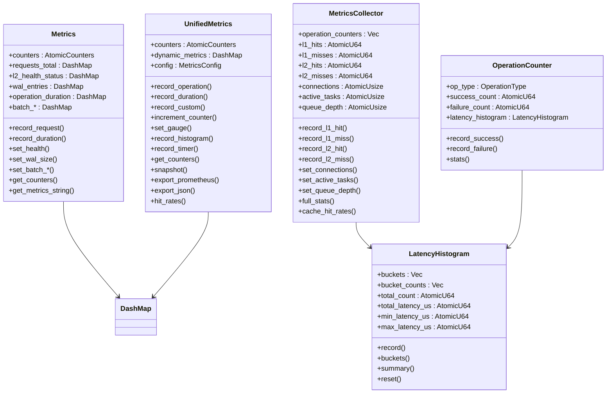
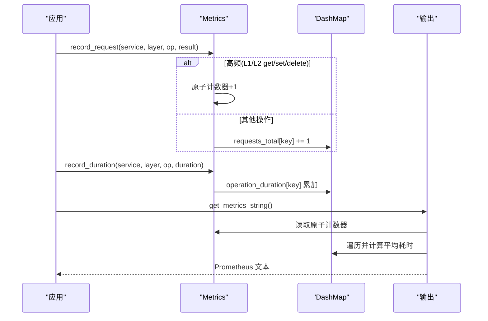
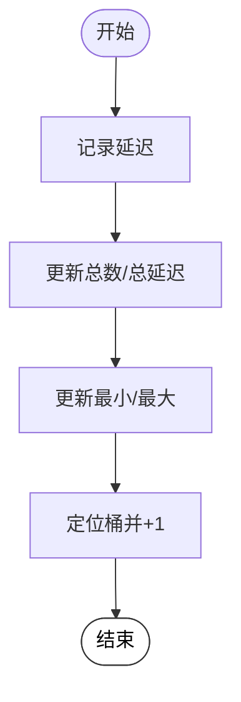
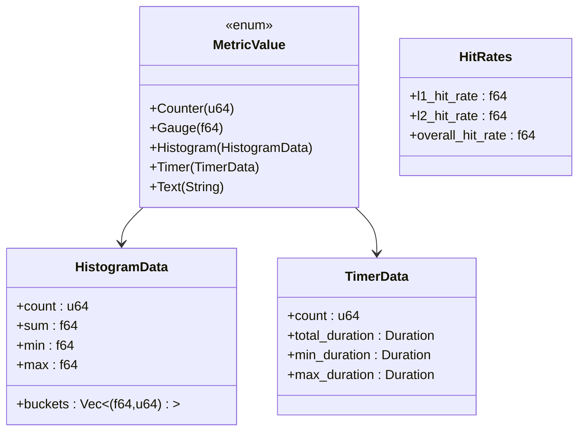
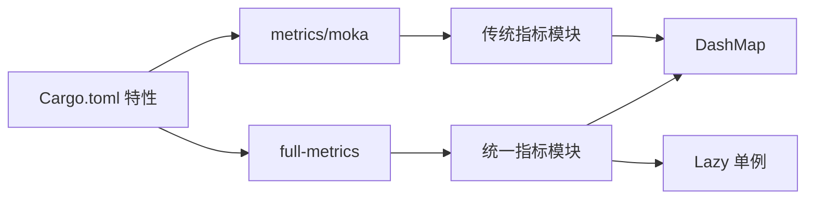

# 指标收集

<cite>
**本文档引用的文件**
- [src/metrics.rs](file://src/metrics.rs)
- [src/backend/metrics.rs](file://src/backend/metrics.rs)
- [src/metrics/unified.rs](file://src/metrics/unified.rs)
- [src/config/unified.rs](file://src/config/unified.rs)
- [Cargo.toml](file://Cargo.toml)
- [src/cli/metrics.rs](file://src/cli/metrics.rs)
- [tests/integration/metrics_test.rs](file://tests/integration/metrics_test.rs)
</cite>

## 目录
1. [简介](#简介)
2. [项目结构](#项目结构)
3. [核心组件](#核心组件)
4. [架构总览](#架构总览)
5. [详细组件分析](#详细组件分析)
6. [依赖关系分析](#依赖关系分析)
7. [性能考量](#性能考量)
8. [故障排查指南](#故障排查指南)
9. [结论](#结论)
10. [附录](#附录)

## 简介
本文件系统性阐述 Oxcache 的指标收集体系与导出机制，覆盖以下方面：
- 指标类型与数据结构：缓存命中率、未命中率、延迟分布、内存使用量、Redis 连接数等
- 计算方法与聚合策略：原子计数器、滑动窗口、直方图、命中率计算
- 访问方式：通过 Cache 实例与全局指标实例获取
- 时间窗口与导出：Prometheus、InfluxDB 等格式导出配置
- 指标解读与性能基线参考

## 项目结构
Oxcache 的指标体系由三层组成：
- 传统指标模块：提供基础计数器与 Prometheus 文本导出
- 后端性能指标模块：提供延迟直方图、命中率、滑动窗口统计
- 统一指标模块：统一的指标类型、导出格式与聚合能力

**图表来源**
- [src/metrics.rs](file://src/metrics.rs#L73-L98)
- [src/backend/metrics.rs](file://src/backend/metrics.rs#L71-L241)
- [src/metrics/unified.rs](file://src/metrics/unified.rs#L15-L51)
- [src/config/unified.rs](file://src/config/unified.rs#L202-L220)

**章节来源**
- [src/metrics.rs](file://src/metrics.rs#L1-L100)
- [src/backend/metrics.rs](file://src/backend/metrics.rs#L1-L60)
- [src/metrics/unified.rs](file://src/metrics/unified.rs#L1-L40)
- [src/config/unified.rs](file://src/config/unified.rs#L173-L220)

## 核心组件
- 传统指标模块
  - 原子计数器：L1/L2 命中/未命中、设置/删除、总操作数、错误数、预取/压缩统计
  - 动态指标：请求总量、L2 健康状态、WAL 条目数、操作耗时（平均）、批量写入缓冲区大小/成功率/吞吐量
  - 导出：Prometheus 文本格式
- 后端性能指标模块
  - 延迟直方图：桶边界、总计数、总延迟、最小/最大延迟
  - 操作计数器：成功/失败计数、成功率、平均/最小/最大延迟
  - 命中率：L1 全局命中率、L2 在 L1 未命中下的命中率
  - 滑动窗口：按时间窗口聚合命中率、成功率、总操作数
- 统一指标模块
  - 指标类型：计数器、仪表盘、直方图、定时器、文本
  - 导出：Prometheus、JSON
  - 聚合：命中率、滑动窗口摘要

**章节来源**
- [src/metrics.rs](file://src/metrics.rs#L17-L98)
- [src/backend/metrics.rs](file://src/backend/metrics.rs#L71-L241)
- [src/metrics/unified.rs](file://src/metrics/unified.rs#L53-L124)

## 架构总览
传统指标与统一指标并存，统一指标提供更丰富的数据类型与导出格式；后端性能指标模块提供延迟分布与滑动窗口聚合。

**图表来源**
- [src/metrics.rs](file://src/metrics.rs#L73-L98)
- [src/backend/metrics.rs](file://src/backend/metrics.rs#L71-L241)
- [src/metrics/unified.rs](file://src/metrics/unified.rs#L15-L51)

## 详细组件分析

### 传统指标模块（Prometheus 文本导出）
- 指标类型与含义
  - L1/L2 命中/未命中：cache_l1_get_hits_total、cache_l1_get_misses_total、cache_l2_get_hits_total、cache_l2_get_misses_total
  - 设置/删除/总操作：cache_l1_set_total、cache_l2_set_total、cache_l1_delete_total、cache_l2_delete_total、cache_operations_total
  - 请求总量（带标签）：cache_requests_total{labels="service:layer:op:result"}
  - L2 健康状态：cache_l2_health_status{service="..."}（0/1/2）
  - WAL 条目数：cache_wal_entries{service="..."}
  - 操作耗时（平均）：cache_operation_duration_seconds{service="...",layer="...",op="..."}
  - 批量写入：cache_batch_buffer_size{service="..."}、cache_batch_success_rate{service="..."}、cache_batch_throughput{service="..."}
- 数据结构与计算
  - 原子计数器：无锁高并发计数，适合高频指标
  - DashMap：低频/动态指标，键为“service:layer:op:result”或“service”
  - 平均耗时：operation_duration 保存累计时长与计数，导出时计算 avg = sum/count
- 访问与导出
  - 通过 GLOBAL_METRICS.record_request()/record_duration()/set_*() 记录
  - 通过 get_metrics_string() 导出 Prometheus 文本

**图表来源**
- [src/metrics.rs](file://src/metrics.rs#L103-L190)
- [src/metrics.rs](file://src/metrics.rs#L192-L202)
- [src/metrics.rs](file://src/metrics.rs#L268-L361)

**章节来源**
- [src/metrics.rs](file://src/metrics.rs#L17-L98)
- [src/metrics.rs](file://src/metrics.rs#L103-L254)
- [src/metrics.rs](file://src/metrics.rs#L268-L361)

### 后端性能指标模块（延迟分布与滑动窗口）
- 指标类型与含义
  - 延迟直方图：按桶边界统计延迟分布，支持最小/最大/平均延迟
  - 操作计数器：记录成功/失败次数与延迟直方图
  - 命中率：L1 全局命中率、L2 在 L1 未命中下的命中率
  - 滑动窗口：按时间窗口聚合命中率、成功率、总操作数
- 数据结构与计算
  - 直方图：最多 100 个桶，记录每个桶计数与累计百分位
  - 操作统计：success_rate = success/(success+failure)，并包含 avg/min/max
  - 窗口摘要：对多个快照求和/平均，过滤过期快照
- 访问与导出
  - 通过 MetricsCollector.record_*()/set_*() 记录
  - 通过 SlidingWindowMetrics.capture()/window_summary() 聚合

**图表来源**
- [src/backend/metrics.rs](file://src/backend/metrics.rs#L127-L179)

**章节来源**
- [src/backend/metrics.rs](file://src/backend/metrics.rs#L71-L241)
- [src/backend/metrics.rs](file://src/backend/metrics.rs#L243-L333)
- [src/backend/metrics.rs](file://src/backend/metrics.rs#L335-L547)
- [src/backend/metrics.rs](file://src/backend/metrics.rs#L573-L695)

### 统一指标模块（丰富指标类型与导出）
- 指标类型与含义
  - 计数器：l1/l2 命中/未命中、设置/删除、总操作、错误、预取/压缩
  - 仪表盘：gauge（如连接数、队列深度）
  - 直方图：记录 count/sum/min/max 与桶边界
  - 定时器：记录总时长、最小/最大持续时间
  - 文本：info 类信息
- 数据结构与计算
  - MetricValue 枚举封装不同指标类型
  - HistogramData/TimerData 结构体
  - 命中率：L1 命中率、L2 命中率、总体命中率
- 访问与导出
  - 通过 GLOBAL_UNIFIED_METRICS.record_operation()/record_duration()/record_custom() 记录
  - 通过 snapshot()/export_prometheus()/export_json() 导出

**图表来源**
- [src/metrics/unified.rs](file://src/metrics/unified.rs#L84-L111)
- [src/metrics/unified.rs](file://src/metrics/unified.rs#L604-L610)

**章节来源**
- [src/metrics/unified.rs](file://src/metrics/unified.rs#L53-L124)
- [src/metrics/unified.rs](file://src/metrics/unified.rs#L159-L509)
- [src/metrics/unified.rs](file://src/metrics/unified.rs#L612-L681)

### 指标聚合与时间窗口
- 传统指标
  - 无内置时间窗口，导出为瞬时值；可通过外部系统进行时间序列聚合
- 后端性能指标
  - SlidingWindowMetrics 维护固定窗口大小与最大快照数，自动清理过期快照
  - 支持 avg_l1_hit_rate、avg_l2_hit_rate、success_rate 等窗口内聚合指标
- 统一指标
  - 通过 MetricsSnapshot 记录时间戳，结合外部系统进行聚合

**章节来源**
- [src/backend/metrics.rs](file://src/backend/metrics.rs#L573-L695)
- [src/metrics/unified.rs](file://src/metrics/unified.rs#L612-L681)

### 指标导出到监控系统
- Prometheus
  - 传统指标：get_metrics_string() 输出 Prometheus 文本
  - 统一指标：export_prometheus() 输出 Prometheus 文本
  - 配置导出格式与间隔：MetricsConfig.export_format=Prometheus、export_interval
- InfluxDB
  - 统一指标支持 JSON 导出，可转换为 InfluxDB 行协议
  - 传统指标未直接提供 InfluxDB 导出函数，需自行转换
- 导出配置
  - 导出格式：Prometheus/JSON/InfluxDB（统一指标）
  - 导出间隔：MetricsConfig.export_interval
  - 保留期：MetricsConfig.retention_period

**章节来源**
- [src/metrics.rs](file://src/metrics.rs#L268-L361)
- [src/metrics/unified.rs](file://src/metrics/unified.rs#L612-L681)
- [src/config/unified.rs](file://src/config/unified.rs#L202-L220)
- [src/config/unified.rs](file://src/config/unified.rs#L435-L444)

### 指标解读与性能基线参考
- 命中率
  - L1 命中率：L1 命中/(L1 命中+L1 未命中)
  - L2 命中率：L2 命中/(L1 未命中+L2 未命中)
  - 总体命中率：(L1 命中+L2 命中)/(总请求数)
- 延迟分布
  - 使用直方图桶查看 P50/P90/P99 延迟
  - 关注最小/最大延迟异常波动
- 连接与队列
  - connections：Redis 连接池使用情况
  - queue_depth：排队任务数，反映背压
- 批量写入
  - batch_success_rate：批量写入成功率
  - batch_throughput：批量吞吐量（ops/sec）

**章节来源**
- [src/backend/metrics.rs](file://src/backend/metrics.rs#L466-L498)
- [src/metrics.rs](file://src/metrics.rs#L450-L496)

## 依赖关系分析
- 特性开关
  - metrics、moka、full-metrics 等特性控制指标功能启用
  - 统一指标模块默认启用，传统指标模块受 metrics/moka 特性影响
- 外部依赖
  - DashMap：无锁哈希表，用于动态指标
  - once_cell/Lazy：全局单例初始化
  - tracing：日志与指标上下文

**图表来源**
- [Cargo.toml](file://Cargo.toml#L235-L346)
- [src/metrics.rs](file://src/metrics.rs#L77-L98)
- [src/metrics/unified.rs](file://src/metrics/unified.rs#L683-L684)

**章节来源**
- [Cargo.toml](file://Cargo.toml#L235-L346)
- [src/metrics.rs](file://src/metrics.rs#L77-L98)
- [src/metrics/unified.rs](file://src/metrics/unified.rs#L683-L684)

## 性能考量
- 原子计数器优先：高频指标（命中/未命中/设置/删除/总操作）使用原子计数器，避免锁竞争
- DashMap 无锁：低频/动态指标使用 DashMap，避免全局锁
- 直方图限制：延迟直方图最多 100 个桶，防止内存膨胀
- 滑动窗口成本：窗口大小与快照数量影响内存占用，需根据场景调整

[本节为通用指导，不涉及具体文件分析]

## 故障排查指南
- 指标为空
  - 检查是否启用 metrics 或 moka 特性
  - 确认是否调用 record_request()/record_duration()/set_*() 记录指标
- 导出格式不符预期
  - 统一指标：确认 MetricsConfig.export_format 与 export_interval
  - 传统指标：get_metrics_string() 默认输出 Prometheus 文本
- CLI 指标查询
  - CLI 模块提示需要启用 metrics 特性与 OpenTelemetry 才能导出

**章节来源**
- [src/cli/metrics.rs](file://src/cli/metrics.rs#L10-L24)
- [tests/integration/metrics_test.rs](file://tests/integration/metrics_test.rs#L10-L27)

## 结论
Oxcache 提供多层次指标体系：传统指标模块满足 Prometheus 文本导出需求，后端性能指标模块提供延迟分布与滑动窗口聚合，统一指标模块提供丰富指标类型与灵活导出。通过合理的特性开关与配置，可在不同部署环境下获得准确、可观测的缓存性能视图。

[本节为总结性内容，不涉及具体文件分析]

## 附录

### 指标清单与计算方法
- 命中率
  - L1 命中率 = L1 命中/(L1 命中+L1 未命中)
  - L2 命中率 = L2 命中/(L1 未命中+L2 未命中)
  - 总体命中率 = (L1 命中+L2 命中)/总请求数
- 平均延迟
  - operation_duration 中的 (sum/count) 即平均延迟
- 直方图
  - 桶边界与计数来自直方图配置，支持累计百分位

**章节来源**
- [src/metrics.rs](file://src/metrics.rs#L450-L496)
- [src/backend/metrics.rs](file://src/backend/metrics.rs#L181-L208)
- [src/backend/metrics.rs](file://src/backend/metrics.rs#L210-L229)

### 通过 Cache 实例访问指标
- 传统指标
  - 通过 GLOBAL_METRICS.record_request()/record_duration()/set_*() 记录
  - 通过 get_metrics_string() 导出
- 统一指标
  - 通过 GLOBAL_UNIFIED_METRICS.record_operation()/record_duration()/record_custom() 记录
  - 通过 export_prometheus()/export_json() 导出
- 后端性能指标
  - 通过 MetricsCollector.record_*()/set_*() 记录
  - 通过 SlidingWindowMetrics.capture()/window_summary() 聚合

**章节来源**
- [src/metrics.rs](file://src/metrics.rs#L103-L254)
- [src/metrics/unified.rs](file://src/metrics/unified.rs#L159-L509)
- [src/backend/metrics.rs](file://src/backend/metrics.rs#L335-L498)