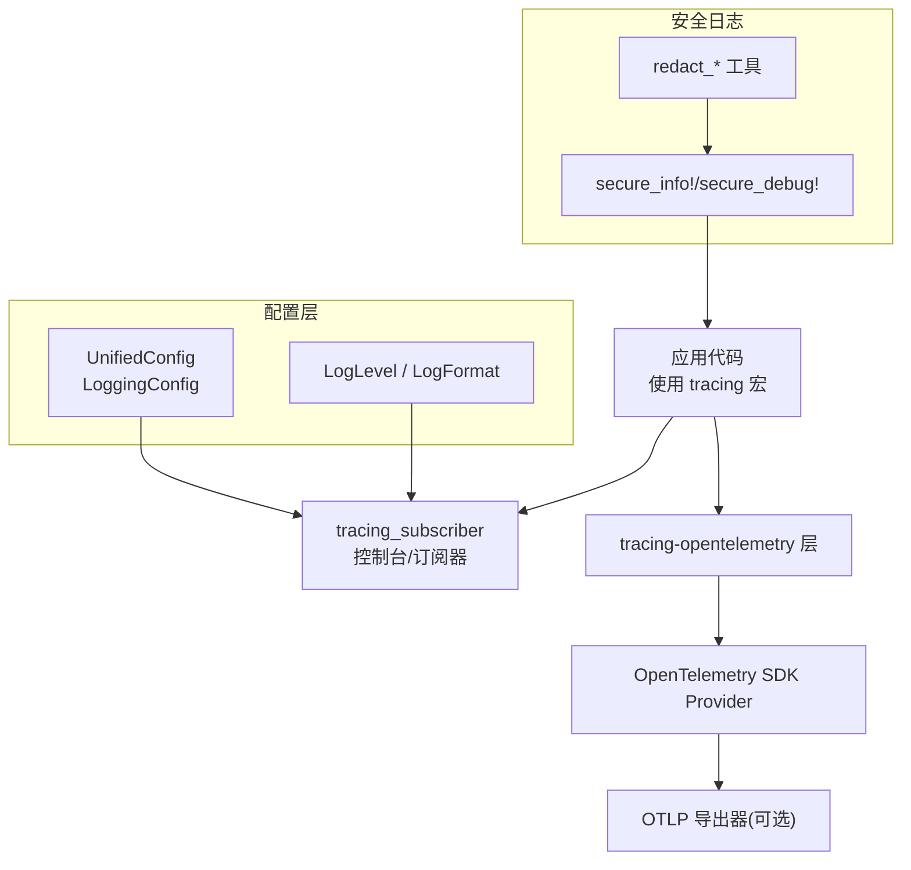
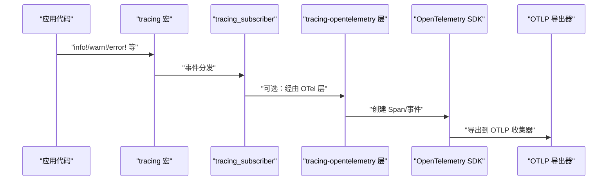
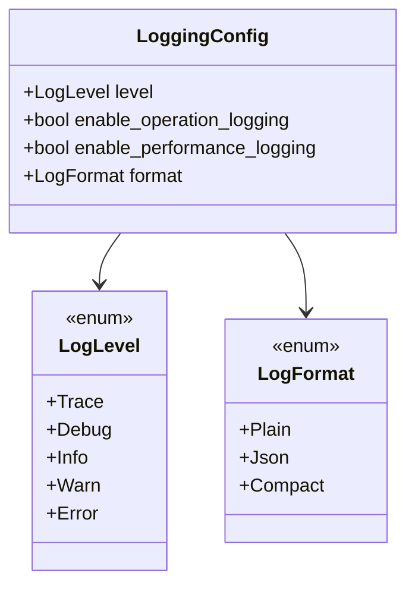
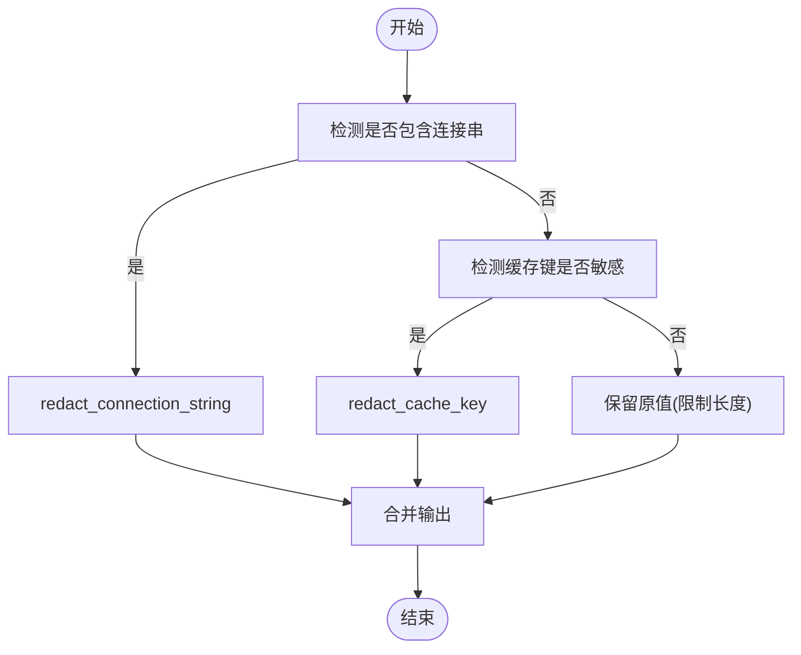
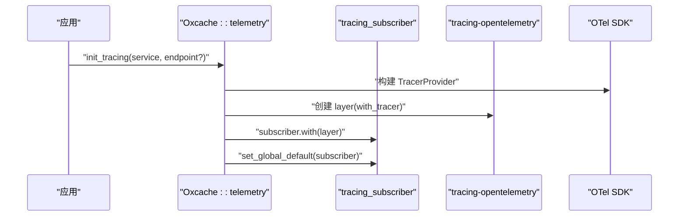
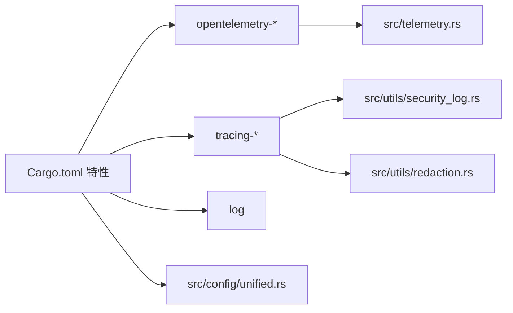

# 日志记录

<cite>
**本文引用的文件**
- [src/lib.rs](file://src/lib.rs)
- [Cargo.toml](file://Cargo.toml)
- [src/telemetry.rs](file://src/telemetry.rs)
- [src/utils/security_log.rs](file://src/utils/security_log.rs)
- [src/utils/redaction.rs](file://src/utils/redaction.rs)
- [src/config/unified.rs](file://src/config/unified.rs)
- [src/config/service.rs](file://src/config/service.rs)
- [tests/feature/telemetry_test.rs](file://tests/feature/telemetry_test.rs)
</cite>

## 目录
1. [简介](#简介)
2. [项目结构](#项目结构)
3. [核心组件](#核心组件)
4. [架构总览](#架构总览)
5. [详细组件分析](#详细组件分析)
6. [依赖关系分析](#依赖关系分析)
7. [性能考量](#性能考量)
8. [故障排查指南](#故障排查指南)
9. [结论](#结论)
10. [附录](#附录)

## 简介
本文件面向 Oxcache 的日志记录系统，系统性阐述其日志架构、配置项、输出格式、轮转策略现状与建议、结构化日志字段、敏感信息脱敏机制、与 OpenTelemetry 的集成方式，以及日志分析与故障排查最佳实践。Oxcache 采用基于 tracing 的可观测性栈，并通过可选的 OpenTelemetry 集成将日志事件转换为追踪数据，同时内置安全日志宏与脱敏工具，保障日志中不泄露敏感信息。

## 项目结构
围绕日志与可观测性的关键文件组织如下：
- 配置层：统一配置模块提供日志级别、格式等配置项，便于集中管理。
- 安全日志：提供安全日志宏与脱敏工具，自动处理连接串、缓存键等敏感信息。
- 遥测：提供 OpenTelemetry Tracing 初始化能力，将日志事件桥接到链路追踪。
- 依赖与特性：通过 Cargo 特性开关控制日志、遥测、序列化等能力的启用范围。

图表来源
- [src/telemetry.rs](file://src/telemetry.rs#L26-L56)
- [src/utils/security_log.rs](file://src/utils/security_log.rs#L27-L95)
- [src/utils/redaction.rs](file://src/utils/redaction.rs#L45-L115)
- [src/config/unified.rs](file://src/config/unified.rs#L235-L264)

章节来源
- [src/lib.rs](file://src/lib.rs#L483-L485)
- [Cargo.toml](file://Cargo.toml#L144-L164)

## 核心组件
- 日志级别与格式配置
  - 日志级别：Trace、Debug、Info、Warn、Error。
  - 输出格式：Plain（普通文本）、Json（结构化）、Compact（紧凑）。
  - 默认级别：Info；默认格式：Plain；可按需开启操作日志与性能日志。
- 安全日志与脱敏
  - 提供 secure_info!/secure_debug! 宏，自动脱敏连接串与敏感字段。
  - 提供 redact_connection_string、redact_cache_key、redact_value 等工具函数。
- OpenTelemetry 集成
  - 提供 init_tracing 初始化函数，创建 TracerProvider 并注入 tracing-opentelemetry 层。
  - 生产环境可扩展配置 OTLP 导出器，将日志事件转换为追踪数据。
- 配置入口
  - UnifiedConfig.Monitoring.LoggingConfig 提供集中化的日志配置能力。

章节来源
- [src/config/unified.rs](file://src/config/unified.rs#L235-L264)
- [src/config/unified.rs](file://src/config/unified.rs#L457-L466)
- [src/utils/security_log.rs](file://src/utils/security_log.rs#L27-L95)
- [src/utils/redaction.rs](file://src/utils/redaction.rs#L45-L115)
- [src/telemetry.rs](file://src/telemetry.rs#L26-L56)

## 架构总览
Oxcache 的日志架构以 tracing 为核心，结合 tracing-subscriber 控制输出，通过 tracing-opentelemetry 将事件桥接至 OpenTelemetry SDK。安全日志模块在记录前对敏感信息进行脱敏处理，避免泄露。

图表来源
- [src/telemetry.rs](file://src/telemetry.rs#L26-L56)

## 详细组件分析

### 日志级别与输出格式
- 日志级别
  - 通过 UnifiedConfig.Monitoring.LoggingConfig.level 控制，默认 Info。
- 输出格式
  - 通过 UnifiedConfig.Monitoring.LoggingConfig.format 控制，默认 Plain；生产推荐 Json。
- 开关项
  - enable_operation_logging：是否记录缓存操作日志。
  - enable_performance_logging：是否记录性能相关日志。

图表来源
- [src/config/unified.rs](file://src/config/unified.rs#L235-L264)

章节来源
- [src/config/unified.rs](file://src/config/unified.rs#L235-L264)
- [src/config/unified.rs](file://src/config/unified.rs#L457-L466)

### 安全日志与脱敏机制
- 宏接口
  - secure_info!/secure_debug!：在记录前自动脱敏连接串与包含敏感关键词的字段。
- 脱敏工具
  - redact_connection_string：脱敏协议头后的用户与密码片段。
  - redact_cache_key：对可能包含 token/password/secret 等关键字的键进行脱敏。
  - redact_value：通用脱敏，保留尾部若干可见字符。
- 使用建议
  - 对外部连接串、用户输入的键、令牌等一律使用安全日志宏或脱敏工具。
  - 避免直接打印原始凭据与长密钥。

图表来源
- [src/utils/security_log.rs](file://src/utils/security_log.rs#L27-L95)
- [src/utils/redaction.rs](file://src/utils/redaction.rs#L45-L115)

章节来源
- [src/utils/security_log.rs](file://src/utils/security_log.rs#L27-L95)
- [src/utils/redaction.rs](file://src/utils/redaction.rs#L45-L115)

### OpenTelemetry 集成与日志到追踪
- 初始化流程
  - init_tracing 创建 SdkTracerProvider，设置为全局 Provider。
  - 通过 tracing_opentelemetry::layer 注入 tracing-subscriber。
  - 生产环境可替换为 OTLP 导出器，将日志事件转换为追踪 Span。
- 注意事项
  - 该初始化函数仅作为库提供的辅助能力，通常由应用层统一管理 tracing subscriber，避免冲突。

图表来源
- [src/telemetry.rs](file://src/telemetry.rs#L26-L56)

章节来源
- [src/telemetry.rs](file://src/telemetry.rs#L26-L56)
- [tests/feature/telemetry_test.rs](file://tests/feature/telemetry_test.rs#L9-L40)

### 结构化日志字段与分类
- 字段建议
  - 时间戳、服务名、实例标识、日志级别、模块路径、请求/事务 ID、缓存操作类型、键摘要、结果状态、耗时、错误码与简要错误信息。
- 分类
  - 缓存操作日志：命中/未命中、写入、删除、批量操作、预热、失效广播等。
  - 错误日志：连接失败、序列化异常、超时、权限拒绝、配置错误等。
  - 安全日志：鉴权尝试、敏感键访问、连接串使用、TLS 状态等。
- 输出格式
  - 生产环境推荐 Json，便于下游日志平台解析与检索。

章节来源
- [src/config/unified.rs](file://src/config/unified.rs#L235-L264)
- [src/utils/security_log.rs](file://src/utils/security_log.rs#L70-L95)

### 日志轮转策略
- 当前状态
  - 仓库未提供内置的日志轮转实现。
- 推荐方案
  - 使用操作系统日志轮转工具（如 systemd-journald、logrotate）或第三方库（如 rolling_file）在应用侧实现按大小/时间的轮转。
  - 与 tracing-subscriber 的文件输出配合，确保高吞吐下的稳定性。

[本节为通用实践说明，不直接分析具体文件]

## 依赖关系分析
- 特性与依赖
  - opentelemetry/opentelemetry_sdk/tracing-opentelemetry/opentelemetry-otlp：用于遥测与日志到追踪的集成。
  - tracing/tracing-subscriber：日志核心与订阅器。
  - log：标准日志门面，便于与传统日志系统互通。
- 特性开关
  - opentelemetry、metrics、full-metrics：控制遥测与日志输出能力。

图表来源
- [Cargo.toml](file://Cargo.toml#L144-L164)
- [src/telemetry.rs](file://src/telemetry.rs#L7-L10)
- [src/utils/security_log.rs](file://src/utils/security_log.rs#L11-L11)
- [src/utils/redaction.rs](file://src/utils/redaction.rs#L9-L9)
- [src/config/unified.rs](file://src/config/unified.rs#L235-L264)

章节来源
- [Cargo.toml](file://Cargo.toml#L144-L164)
- [src/lib.rs](file://src/lib.rs#L483-L485)

## 性能考量
- 日志级别
  - 生产环境建议 Info 或更高，避免大量 Debug/Trace 带来的 I/O 压力。
- 输出格式
  - Json 解析成本略高于 Plain，但利于结构化检索；在高吞吐场景建议评估磁盘与网络开销。
- 脱敏成本
  - 脱敏操作为常量或线性复杂度，对性能影响可忽略；建议在进入日志前完成脱敏。
- 遥测开销
  - tracing-opentelemetry 层在无导出器时为 no-op；启用 OTLP 导出会带来额外 CPU 与网络消耗，应按采样策略优化。

[本节为通用指导，不直接分析具体文件]

## 故障排查指南
- 常见问题与日志模式
  - 连接失败：出现“连接超时/认证失败/网络不可达”等错误日志，优先检查连接串与 TLS 配置。
  - 缓存未命中风暴：频繁的未命中日志伴随高延迟，考虑启用预热、批量写入或布隆过滤器。
  - 权限与鉴权：安全日志中出现大量鉴权失败，检查 ACL、密钥与访问控制配置。
  - 配置错误：配置校验失败导致初始化异常，关注配置模块的校验错误提示。
- 定位步骤
  - 提升日志级别到 Debug/Trace，复现问题并收集上下文。
  - 使用安全日志宏记录关键路径，避免泄露敏感信息。
  - 若启用遥测，确认 tracing-subscriber 初始化顺序，避免全局 subscriber 冲突。
- 测试参考
  - 遥测初始化测试确保函数可被调用且不 panic。

章节来源
- [tests/feature/telemetry_test.rs](file://tests/feature/telemetry_test.rs#L9-L40)

## 结论
Oxcache 的日志体系以 tracing 为核心，结合可选的 OpenTelemetry 遥测与内置的安全日志脱敏工具，提供了灵活且安全的日志记录能力。通过统一配置模块，可在运行时精细调整日志级别与格式；在生产环境中建议采用 Json 格式与 OTLP 导出器，并辅以操作系统级轮转策略，确保日志的可读性、可追踪性与持久化。

[本节为总结性内容，不直接分析具体文件]

## 附录

### 配置清单与建议
- 日志级别
  - 开发：Debug；测试：Info；生产：Info。
- 输出格式
  - 开发：Plain；测试/生产：Json。
- 开关项
  - enable_operation_logging：生产可按需开启。
  - enable_performance_logging：建议开启以辅助性能分析。
- 安全
  - 所有外部连接串、用户输入键、令牌等必须使用安全日志宏或脱敏工具。
- 遥测
  - 生产环境配置 OTLP 导出器，避免全局 subscriber 冲突。

章节来源
- [src/config/unified.rs](file://src/config/unified.rs#L235-L264)
- [src/config/unified.rs](file://src/config/unified.rs#L457-L466)
- [src/utils/security_log.rs](file://src/utils/security_log.rs#L27-L95)
- [src/telemetry.rs](file://src/telemetry.rs#L26-L56)