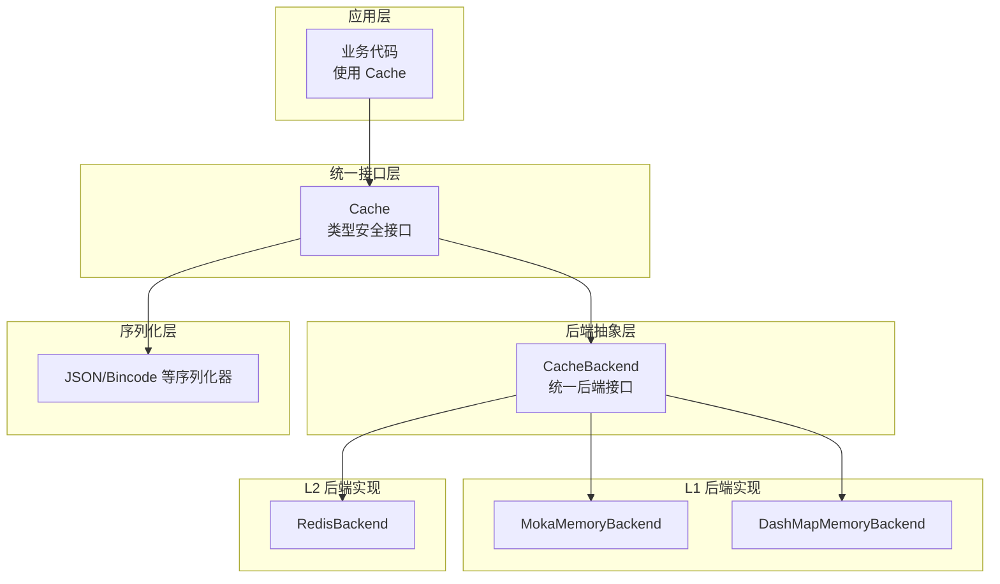
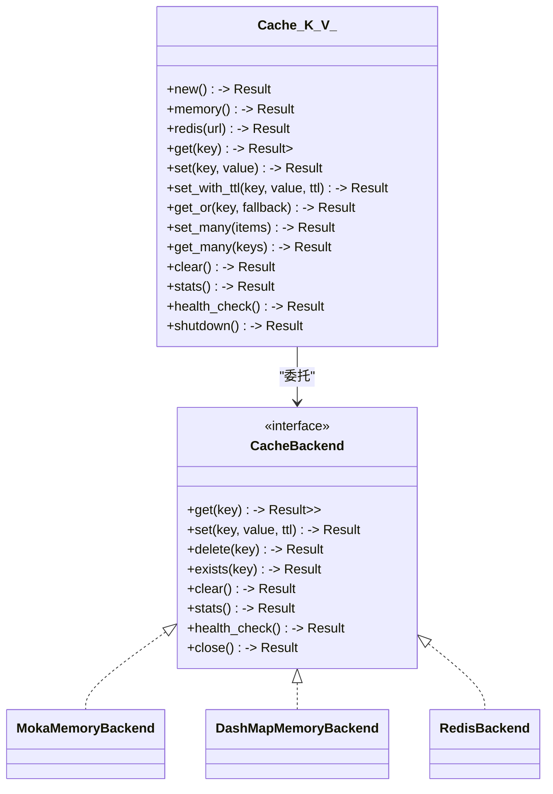
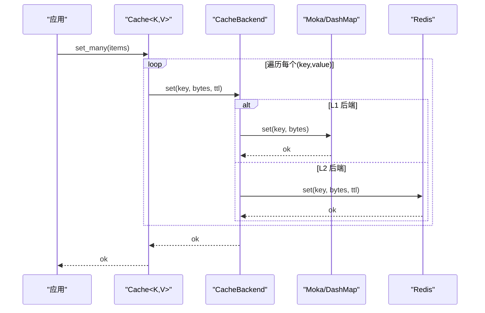
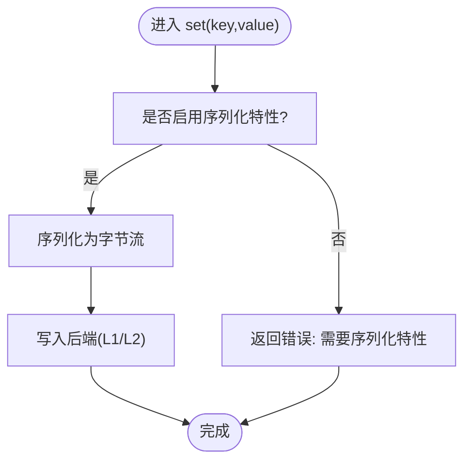
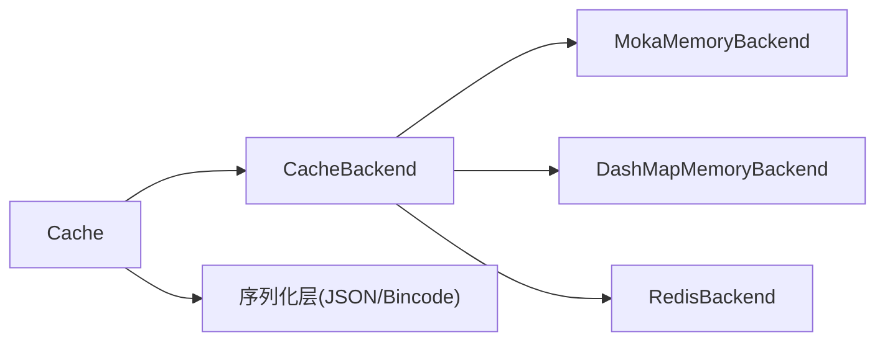

# 性能优化

<cite>
**本文引用的文件**
- [src/lib.rs](file://src/lib.rs)
- [src/cache.rs](file://src/cache.rs)
- [src/backend/mod.rs](file://src/backend/mod.rs)
- [src/backend/client/mod.rs](file://src/backend/client/mod.rs)
- [src/serialization/mod.rs](file://src/serialization/mod.rs)
- [src/sync/warmup.rs](file://src/sync/warmup.rs)
- [benches/cache_benchmark.rs](file://benches/cache_benchmark.rs)
- [benches/modern_api_benchmark.rs](file://benches/modern_api_benchmark.rs)
- [benches/redis_benchmark.rs](file://benches/redis_benchmark.rs)
</cite>

## 目录
1. [简介](#简介)
2. [项目结构](#项目结构)
3. [核心组件](#核心组件)
4. [架构总览](#架构总览)
5. [详细组件分析](#详细组件分析)
6. [依赖分析](#依赖分析)
7. [性能考量](#性能考量)
8. [故障排查指南](#故障排查指南)
9. [结论](#结论)
10. [附录](#附录)

## 简介
本文件聚焦 Oxcache 的性能优化策略与基准测试实践，覆盖以下主题：
- 硬件与网络环境对性能的影响
- L1 与 L2 缓存的性能特点与优化方法
- 批量写入优化的实现原理与收益
- 内存使用优化与 CPU 缓存友好数据结构
- 异步 I/O 与并发控制策略
- 基准测试执行方法与结果解读
- 不同使用场景的调优建议与最佳实践
- 性能监控、瓶颈识别与问题诊断

## 项目结构
Oxcache 采用“现代 API + 可插拔后端”的分层架构，核心入口通过统一的 Cache 接口对外提供类型安全的读写能力；后端可按需启用内存或 Redis 等实现，并支持自定义层级配置。

图表来源
- [src/lib.rs](file://src/lib.rs#L576-L638)
- [src/cache.rs](file://src/cache.rs#L117-L120)
- [src/backend/mod.rs](file://src/backend/mod.rs#L26-L59)
- [src/backend/client/mod.rs](file://src/backend/client/mod.rs#L13-L34)

章节来源
- [src/lib.rs](file://src/lib.rs#L104-L175)
- [src/backend/mod.rs](file://src/backend/mod.rs#L1-L59)
- [src/backend/client/mod.rs](file://src/backend/client/mod.rs#L1-L34)

## 核心组件
- 统一缓存接口：Cache<K, V> 提供 get/set/get_or 等常用操作，并在启用序列化特性时自动完成序列化/反序列化。
- 后端抽象：CacheBackend 作为 L1/L2 的统一抽象，具体实现由特性开关决定。
- 内存后端：MokaMemoryBackend（默认）与 DashMapMemoryBackend，分别面向不同并发与淘汰策略需求。
- Redis 后端：提供 L2 分布式缓存能力，支持连接池、TTL 等高级特性。
- 序列化：支持 JSON、Bincode 等格式，减少跨层数据转换成本。
- 预热：WarmupManager 支持服务启动阶段的数据预热，降低冷启动延迟。

章节来源
- [src/cache.rs](file://src/cache.rs#L117-L120)
- [src/backend/client/mod.rs](file://src/backend/client/mod.rs#L13-L34)
- [src/serialization/mod.rs](file://src/serialization/mod.rs#L45-L97)
- [src/sync/warmup.rs](file://src/sync/warmup.rs#L14-L56)

## 架构总览
Oxcache 的现代 API 将“类型安全 + 序列化 + 后端抽象”整合到一处，既保证易用性，又保留高性能与灵活性。L1 默认使用 Moka，具备 TinyLFU/LRU 混合淘汰与自动过期；L2 可选 Redis，适合跨实例共享与持久化场景。

图表来源
- [src/cache.rs](file://src/cache.rs#L117-L646)
- [src/backend/mod.rs](file://src/backend/mod.rs#L26-L59)

## 详细组件分析

### L1 内存缓存（Moka/DashMap）性能特点与优化
- MokaMemoryBackend
  - 特点：TinyLFU/LRU 混合淘汰、自动过期、高并发读写。
  - 适用：热点数据强命中、低延迟读取场景。
  - 优化要点：合理设置容量、TTL、并发度；避免过大对象导致频繁回收。
- DashMapMemoryBackend
  - 特点：无锁并发哈希表、手动 TTL 控制。
  - 适用：需要细粒度 TTL 控制与高并发写入的场景。
  - 优化要点：键空间分布均匀、避免热点 key；结合预热降低冷启动。

章节来源
- [src/backend/client/mod.rs](file://src/backend/client/mod.rs#L13-L34)
- [src/cache.rs](file://src/cache.rs#L150-L203)

### L2 Redis 缓存性能特点与优化
- 特点：跨实例共享、持久化、原子命令、管道化支持。
- 适用：分布式系统、高可用与跨节点一致性要求场景。
- 优化要点：连接池复用、Pipeline 批处理、合理 TTL 与内存上限、主从延迟与网络 RTT。

章节来源
- [benches/redis_benchmark.rs](file://benches/redis_benchmark.rs#L15-L123)

### 批量写入优化（set_many 与 Pipeline）
- 设计思路：通过 set_many 聚合多次 set 请求，减少系统调用与网络往返；在 Redis 场景下可进一步结合 Pipeline 实现。
- 性能收益：显著降低请求头开销与协议解析成本，提升吞吐。
- 注意事项：批量大小与数据大小平衡，避免单批过大导致延迟尖峰。

图表来源
- [src/cache.rs](file://src/cache.rs#L430-L440)
- [src/backend/mod.rs](file://src/backend/mod.rs#L26-L59)

章节来源
- [src/cache.rs](file://src/cache.rs#L410-L499)

### 序列化与内存使用优化
- 类型安全与零拷贝：在启用序列化特性时，Cache<K,V> 自动进行序列化/反序列化；序列化层提供零拷贝接口，减少中间缓冲与复制。
- 格式选择：JSON 易调试、Bincode 更高效；根据场景选择合适格式。
- 内存占用控制：避免存储超大对象；利用 TTL 与容量限制防止内存膨胀。

图表来源
- [src/cache.rs](file://src/cache.rs#L283-L325)
- [src/serialization/mod.rs](file://src/serialization/mod.rs#L45-L97)

章节来源
- [src/serialization/mod.rs](file://src/serialization/mod.rs#L45-L97)
- [src/cache.rs](file://src/cache.rs#L241-L325)

### 异步 I/O 与并发控制
- 异步模型：统一基于 async/await，后端操作均非阻塞，充分利用事件循环与线程池。
- 并发度：L1 后端（Moka/DashMap）天然支持高并发读写；Redis 后端通过连接池与 Pipeline 控制并发与吞吐。
- 预热：WarmupManager 在启动阶段并发加载热点数据，缩短预热窗口。

章节来源
- [src/sync/warmup.rs](file://src/sync/warmup.rs#L14-L56)
- [benches/cache_benchmark.rs](file://benches/cache_benchmark.rs#L14-L25)

## 依赖分析
- 功能特性与模块映射：通过特性开关启用/禁用模块，避免运行时开销；编译期断言确保依赖合法。
- 关键依赖链：Cache<K,V> → CacheBackend → 具体 L1/L2 实现；序列化层在启用时参与读写路径。

图表来源
- [src/lib.rs](file://src/lib.rs#L436-L443)
- [src/cache.rs](file://src/cache.rs#L117-L120)
- [src/backend/mod.rs](file://src/backend/mod.rs#L26-L59)

章节来源
- [src/lib.rs](file://src/lib.rs#L649-L680)
- [src/backend/mod.rs](file://src/backend/mod.rs#L1-L59)

## 性能考量
- 硬件与网络影响
  - CPU：高频 set/get 对 CPU 缓存局部性敏感，批量写入可提升吞吐。
  - 内存：L1 容量与对象大小直接影响缓存命中率与 GC 压力；建议按业务峰值估算。
  - 网络：Redis 场景下 RTT 与带宽决定延迟与吞吐；建议内网部署与连接池复用。
- 数据大小与键分布
  - 小对象：适合高频读写与批量聚合。
  - 大对象：应谨慎使用，优先考虑拆分或压缩。
  - 键分布：避免热点 key，必要时引入分片或前缀随机化。
- 并发与锁竞争
  - L1：Moka 无锁设计，DashMap 适合高写入；避免全局锁争用。
  - L2：Pipeline 与连接池提升并发；注意 Redis 命令队列长度与阻塞风险。

## 故障排查指南
- 常见问题
  - 序列化错误：未启用序列化特性却使用类型化 get/set。
  - L2 不可用：Redis 连接失败或健康检查失败。
  - 内存泄漏：对象过大或未设置 TTL 导致容量持续增长。
- 诊断步骤
  - 查看 stats 输出，确认类型与命中率。
  - 检查后端 health_check 结果。
  - 使用基准测试定位瓶颈（L1/L2/不同数据大小/批量大小）。
- 解决方案
  - 启用合适特性（如 serialization、redis），调整容量与 TTL。
  - 使用 Pipeline 与合理的批量大小。
  - 启用预热，降低冷启动延迟。

章节来源
- [src/cache.rs](file://src/cache.rs#L517-L572)
- [src/cache.rs](file://src/cache.rs#L534-L556)

## 结论
Oxcache 通过现代 API 与可插拔后端，在保证易用性的同时提供了丰富的性能优化手段。针对不同场景，建议优先优化 L1 命中率与批量写入，结合合适的序列化格式与并发策略，并通过基准测试与监控持续迭代。

## 附录

### 基准测试执行与结果解读
- L1 基准（内存缓存）
  - 测试内容：单次 set/get、不同数据大小、批量写入。
  - 执行方式：使用 Criterion 运行 benches/cache_benchmark.rs 与 benches/modern_api_benchmark.rs。
  - 结果解读：关注 ops/sec、p50/p95 延迟、内存分配；对比不同数据大小与批量大小的吞吐差异。
- L2 基准（Redis）
  - 测试内容：SET/GET/TTL 与不同数据大小。
  - 执行方式：运行 benches/redis_benchmark.rs，确保本地 Redis 服务可用。
  - 结果解读：关注网络 RTT 对延迟的影响，Pipeline 批量对吞吐的提升。

章节来源
- [benches/cache_benchmark.rs](file://benches/cache_benchmark.rs#L14-L100)
- [benches/modern_api_benchmark.rs](file://benches/modern_api_benchmark.rs#L14-L158)
- [benches/redis_benchmark.rs](file://benches/redis_benchmark.rs#L15-L123)

### 不同场景的性能调优建议
- 高并发读取（L1 为主）
  - 选择 Moka 作为 L1 后端；合理设置容量与 TTL；批量读取提升命中率。
- 分布式共享（L2 为主）
  - 使用 Redis 作为 L2；启用连接池与 Pipeline；控制键空间与 TTL。
- 混合场景（两级缓存）
  - L1 作为热数据层，L2 作为冷数据层；通过预热与智能策略提升整体命中率。
- 内存受限
  - 减少对象体积，启用压缩（如适用），定期清理过期键。

### 性能监控与瓶颈识别
- 指标采集：通过增强统计与指标导出接口收集命中率、延迟、吞吐、内存使用等。
- 瓶颈识别：先看 L1 命中率，再看 L2 延迟与网络；最后评估序列化与批量策略。
- 工具链：结合基准测试与生产埋点，形成闭环优化。

章节来源
- [src/lib.rs](file://src/lib.rs#L620-L623)
- [src/cache.rs](file://src/cache.rs#L517-L532)