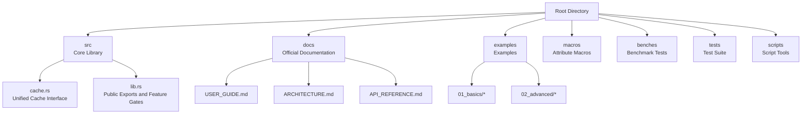
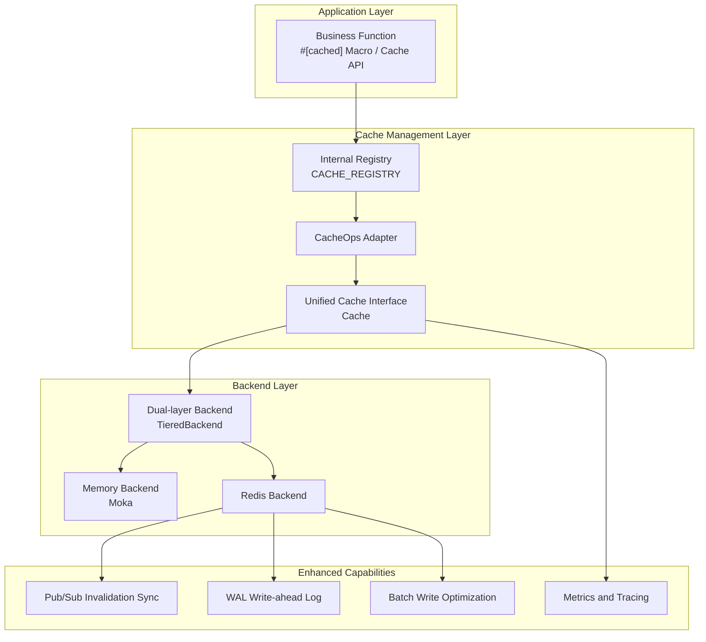
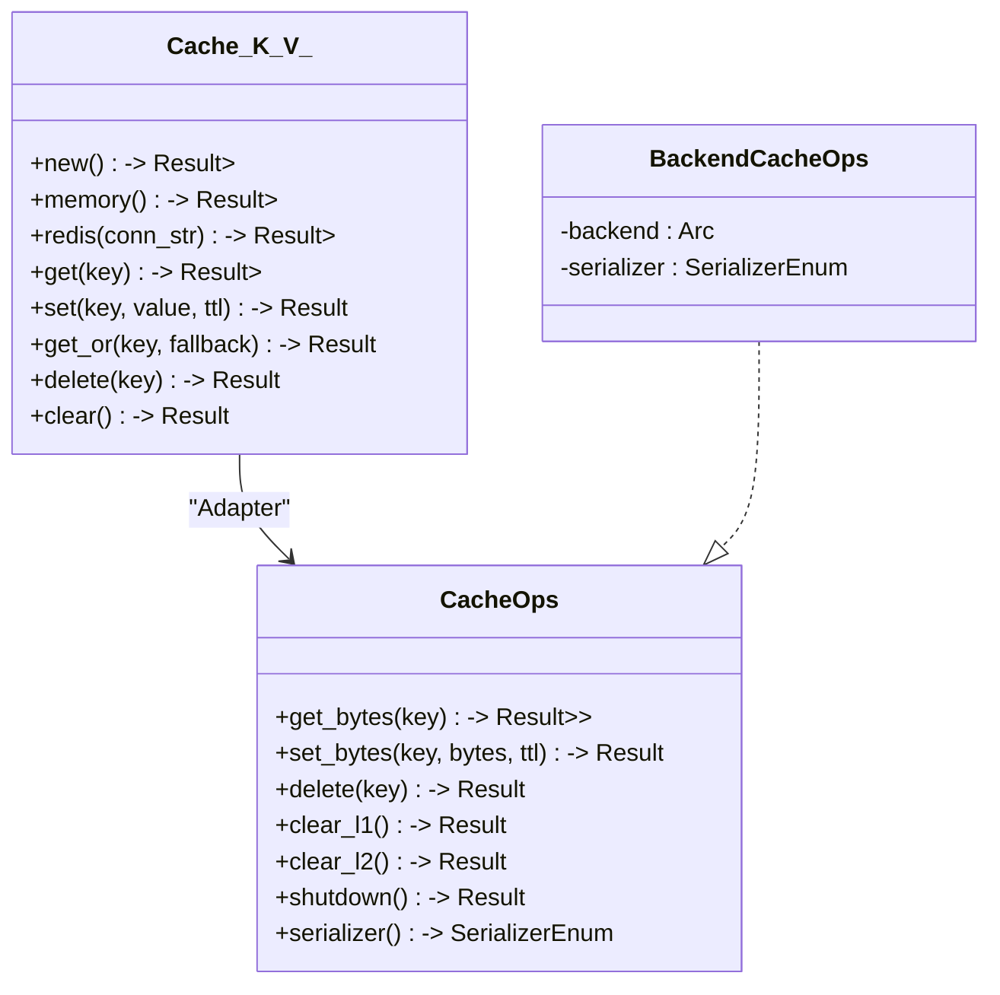
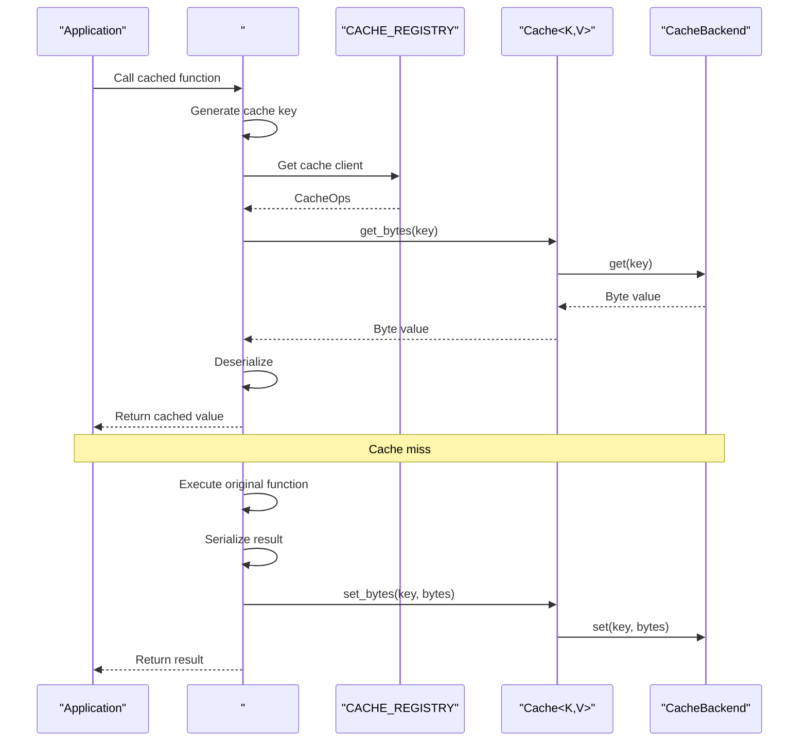
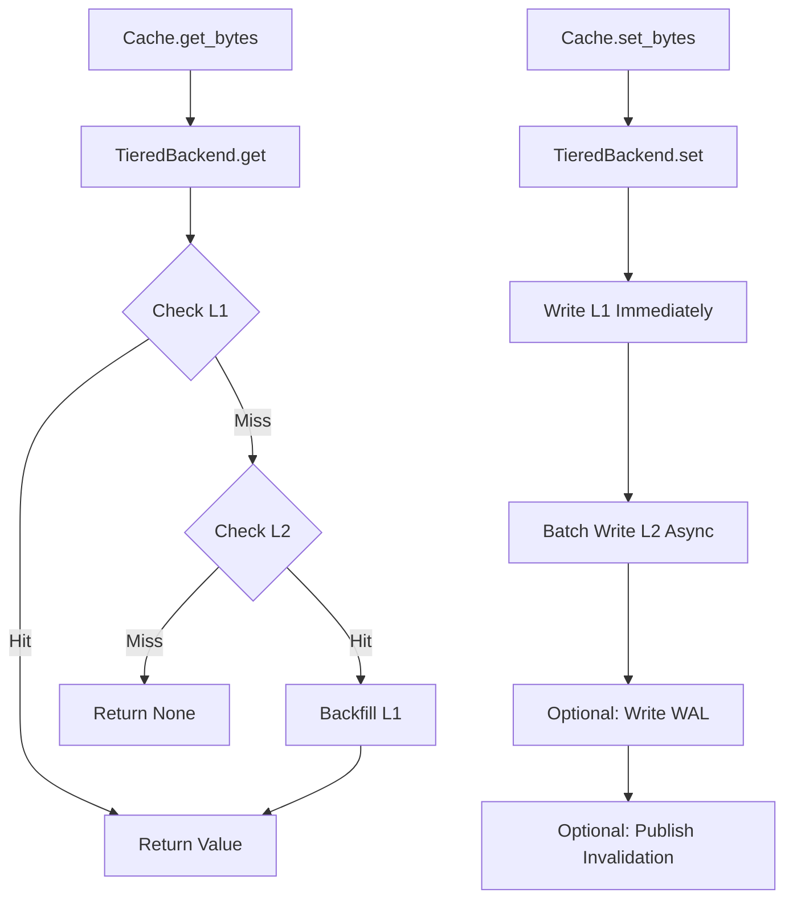
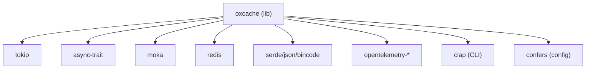

# Project Introduction

<cite>
**Files referenced in this article**
- [README.md](file://README.md)
- [README_zh.md](file://README_zh.md)
- [Cargo.toml](file://Cargo.toml)
- [src/lib.rs](file://src/lib.rs)
- [src/cache.rs](file://src/cache.rs)
- [docs/USER_GUIDE.md](file://docs/USER_GUIDE.md)
- [docs/ARCHITECTURE.md](file://docs/ARCHITECTURE.md)
- [docs/API_REFERENCE.md](file://docs/API_REFERENCE.md)
- [examples/src/01_basics/example_basic_operations.rs](file://examples/src/01_basics/example_basic_operations.rs)
</cite>

## Table of Contents
1. [Introduction](#introduction)
2. [Project Structure](#project-structure)
3. [Core Components](#core-components)
4. [Architecture Overview](#architecture-overview)
5. [Detailed Component Analysis](#detailed-component-analysis)
6. [Dependency Analysis](#dependency-analysis)
7. [Performance Considerations](#performance-considerations)
8. [Troubleshooting Guide](#troubleshooting-guide)
9. [Conclusion](#conclusion)
10. [Appendix](#appendix)

## Introduction
Oxcache is a high-performance, production-grade Rust multi-level cache library providing L1 (in-memory cache, Moka) + L2 (distributed cache, Redis) dual-layer architecture. The project's core mission is "zero code changes, extreme performance, production ready," achieving zero-invasive caching through modern APIs and `#[cached]` macros, combined with batch processing optimization, automatic failure recovery and observability, helping developers achieve exceptional performance and reliability without changing business logic.

- Zero Code Changes: Enable caching with one line through `#[cached]` macro or modern API
- Extreme Performance: L1 nanosecond-level response (P99 < 100ns), L2 millisecond-level response (P99 < 5ms)
- Production Ready: Automatic degradation, WAL recovery, health checks, chaos testing validation, OpenTelemetry integration

## Project Structure
The repository adopts modular organization divided by functional domains, with core directories and responsibilities as follows:
- src: Core library implementation, including new APIs, backend abstractions, clients, configuration, error handling, etc.
- docs: Official documentation, covering user guides, architecture design, API references, security and performance reports, etc.
- examples: Layered examples, from basic CRUD to advanced features (batch writing, invalidation synchronization, warm startup, etc.)
- macros: Attribute macro implementation, providing zero-boilerplate code cache decorators for `#[cached]`
- benches: Benchmark tests, covering cache read/write, modern APIs, Redis integration scenarios, etc.
- tests: Unit, integration, end-to-end and chaos tests, ensuring stability and regression quality
- scripts: Pre-commit audits, security scans, performance testing scripts, etc.

Chart source
- [src/cache.rs](file://src/cache.rs#L87-L132)
- [src/lib.rs](file://src/lib.rs#L414-L638)
- [docs/USER_GUIDE.md](file://docs/USER_GUIDE.md#L17-L38)
- [docs/ARCHITECTURE.md](file://docs/ARCHITECTURE.md#L5-L16)
- [docs/API_REFERENCE.md](file://docs/API_REFERENCE.md#L14-L26)

Section source
- [README.md](file://README.md#L16-L58)
- [README_zh.md](file://README_zh.md#L16-L57)
- [Cargo.toml](file://Cargo.toml#L1-L377)

## Core Components
- Modern unified cache interface: Cache<K, V> provides type-safe read/write and fallback loading capabilities, supporting memory, Redis and dual-layer backends
- Backend abstraction layer: Decouples L1/Moka and L2/Redis through CacheBackend trait, facilitating extension and replacement
- Clients and adapters: CacheOps and BackendCacheOps encapsulate backend operations for registration in internal macro registry
- Feature gates and empty implementations: Validate feature dependencies at compile time through macros, generate empty implementations when features are not enabled, ensuring API stability
- Configuration and builders: Builder pattern simplifies complex configuration, supporting L1 capacity, TTL, Redis connection and batch processing parameters
- Macro system: #[cached] macro automatically handles key generation, serialization, cache read/write and error propagation

Section source
- [src/cache.rs](file://src/cache.rs#L87-L132)
- [src/cache.rs](file://src/cache.rs#L117-L200)
- [src/lib.rs](file://src/lib.rs#L414-L638)
- [docs/API_REFERENCE.md](file://docs/API_REFERENCE.md#L134-L190)

## Architecture Overview
Oxcache's overall architecture revolves around "zero boilerplate code + dual-layer cache + observability." Applications access unified interfaces through `#[cached]` macros or Cache APIs, internally bridging to specific backends through registries and adapters; TieredBackend prioritizes L1 hits on read paths, falls back to L2 on misses and backfills L1; write paths update both L1 and L2 simultaneously, balancing between L2 batch processing optimization and WAL persistence.

Chart source
- [docs/ARCHITECTURE.md](file://docs/ARCHITECTURE.md#L36-L73)
- [src/cache.rs](file://src/cache.rs#L29-L85)
- [src/lib.rs](file://src/lib.rs#L435-L477)

## Detailed Component Analysis

### Component 1: Unified Cache Interface Cache<K, V>
- Type safety: Constrains key and value serialization/deserialization through generics K, V and traits (CacheKey, Cacheable)
- Lifecycle: Supports common operations like get, set, get_or (fallback loading), delete, clear, etc.
- Backend decoupling: Internally holds Arc<dyn CacheBackend>, replaceable with memory or Redis backends
- Builders: CacheBuilder/BackendBuilder provide flexible configuration entry points

Chart source
- [src/cache.rs](file://src/cache.rs#L87-L132)
- [src/cache.rs](file://src/cache.rs#L29-L85)

Section source
- [src/cache.rs](file://src/cache.rs#L87-L200)
- [docs/API_REFERENCE.md](file://docs/API_REFERENCE.md#L215-L277)

### Component 2: #[cached] Macro Workflow
- Key generation: Generate stable keys based on service, key/key_prefix, key_generator and other parameters
- Registry: Get CacheOps instance from internal registry
- Read path: Attempt to read bytes from cache, deserialize to target type
- Write path: Execute original function logic, serialize results and write to cache
- Error propagation: Maintain original function's error semantics

Chart source
- [docs/ARCHITECTURE.md](file://docs/ARCHITECTURE.md#L381-L406)
- [src/lib.rs](file://src/lib.rs#L414-L477)

Section source
- [docs/ARCHITECTURE.md](file://docs/ARCHITECTURE.md#L375-L447)
- [src/lib.rs](file://src/lib.rs#L414-L477)

### Component 3: TieredBackend Read/Write Paths
- Read path: Check L1 first, return on hit; on miss, check L2, and if hit, backfill L1 before returning
- Write path: Immediately write to L1, asynchronously batch write to L2, write to WAL and publish invalidation messages when necessary

Chart source
- [docs/ARCHITECTURE.md](file://docs/ARCHITECTURE.md#L485-L540)

Section source
- [docs/ARCHITECTURE.md](file://docs/ARCHITECTURE.md#L485-L540)

### Component 4: Feature Gates and Empty Implementations
- Compile-time assertions: check_feature_dependence! ensures dependent features are enabled (e.g., bloom-filter needs moka)
- Empty implementation macros: Generate empty structs/methods when features are not enabled, ensuring API stability and controllable binary size
- Runtime feature queries: Provide helper functions like is_l1_enabled/is_l2_enabled

Section source
- [src/lib.rs](file://src/lib.rs#L183-L252)
- [src/lib.rs](file://src/lib.rs#L254-L391)
- [src/lib.rs](file://src/lib.rs#L635-L679)

### Component 5: Modern API and Builder Pattern
- Cache::new/memory/redis: Quickly create cache instances
- CacheBuilder/BackendBuilder: Centralized configuration of TTL, L1 capacity, Redis connection string, batch processing, etc.
- Type-safe keys: Support arbitrary key types through implementing CacheKey trait

Section source
- [src/cache.rs](file://src/cache.rs#L139-L200)
- [docs/API_REFERENCE.md](file://docs/API_REFERENCE.md#L299-L360)

## Dependency Analysis
- Language and ecosystem: Rust 1.70+, Tokio async runtime, Serde serialization, Moka in-memory cache, Redis client
- Feature tiers: minimal (L1 only), core (L1+L2), full (all advanced features)
- Key dependencies: Moka (concurrent in-memory cache), Redis (connection pool, Sentinel/Cluster), OpenTelemetry (metrics and tracing)

Chart source
- [Cargo.toml](file://Cargo.toml#L20-L186)

Section source
- [Cargo.toml](file://Cargo.toml#L20-L186)

## Performance Considerations
- L1: Nanosecond-level latency (P99 < 100ns), TinyLFU eviction policy, lock-free concurrent design
- L2: Millisecond-level latency (P99 < 5ms, local Redis), batch writing (MSET) significantly improves throughput
- Batch processing: Batch buffering, timed flushing, single write throughput can reach hundreds of thousands of ops/sec
- Serialization: JSON/Bincode optional, Bincode is smaller and faster
- Compilation optimization: Release configuration enables LTO, single codegen unit, no stack unwinding, reducing binary size

Section source
- [README.md](file://README.md#L328-L335)
- [README_zh.md](file://README_zh.md#L317-L324)
- [docs/ARCHITECTURE.md](file://docs/ARCHITECTURE.md#L608-L646)
- [Cargo.toml](file://Cargo.toml#L350-L370)

## Troubleshooting Guide
- High cache miss rate: Check TTL, whether promote_on_hit is enabled, if L1 capacity is too small
- Redis connection failure: Verify connection string, network and firewall, authentication information
- Data inconsistency: Confirm Pub/Sub channel and version number mechanism, active invalidation strategies
- Performance degradation: Investigate memory leaks, batch processing configuration, L1 capacity and serialization overhead
- Health checks and graceful shutdown: Enable health checks and WAL, ensure resource release before shutdown

Section source
- [docs/USER_GUIDE.md](file://docs/USER_GUIDE.md#L711-L760)
- [docs/ARCHITECTURE.md](file://docs/ARCHITECTURE.md#L575-L607)

## Conclusion
Oxcache's core value is "zero code changes, extreme performance, production ready," providing a plug-and-play multi-level cache solution for the Rust ecosystem through modern APIs, feature gates and comprehensive observability. Its dual-layer architecture balances between L1's nanosecond-level latency and L2's distributed sharing, combined with batch processing, WAL and invalidation synchronization, meeting the needs of high-concurrency and high-availability scenarios. For teams hoping to achieve exceptional performance and reliability without changing business logic, Oxcache is the ideal choice.

## Appendix

### When to Choose Oxcache
- Need zero-boilerplate code caching: Use #[cached] macro or modern Cache API
- Need dual-layer cache: L1 improves hot hits, L2 supports multi-instance sharing
- Need high-throughput writes: Enable batch writing and appropriate serialization
- Need production-grade reliability: Automatic degradation, WAL, health checks and observability

### Getting Started Example (Basic CRUD)
- Create in-memory cache and demonstrate set/get/delete/update operations
- Reference example: [example_basic_operations.rs](file://examples/src/01_basics/example_basic_operations.rs#L21-L72)

Section source
- [examples/src/01_basics/example_basic_operations.rs](file://examples/src/01_basics/example_basic_operations.rs#L21-L72)
