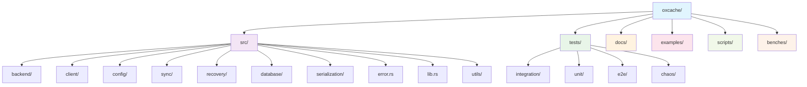
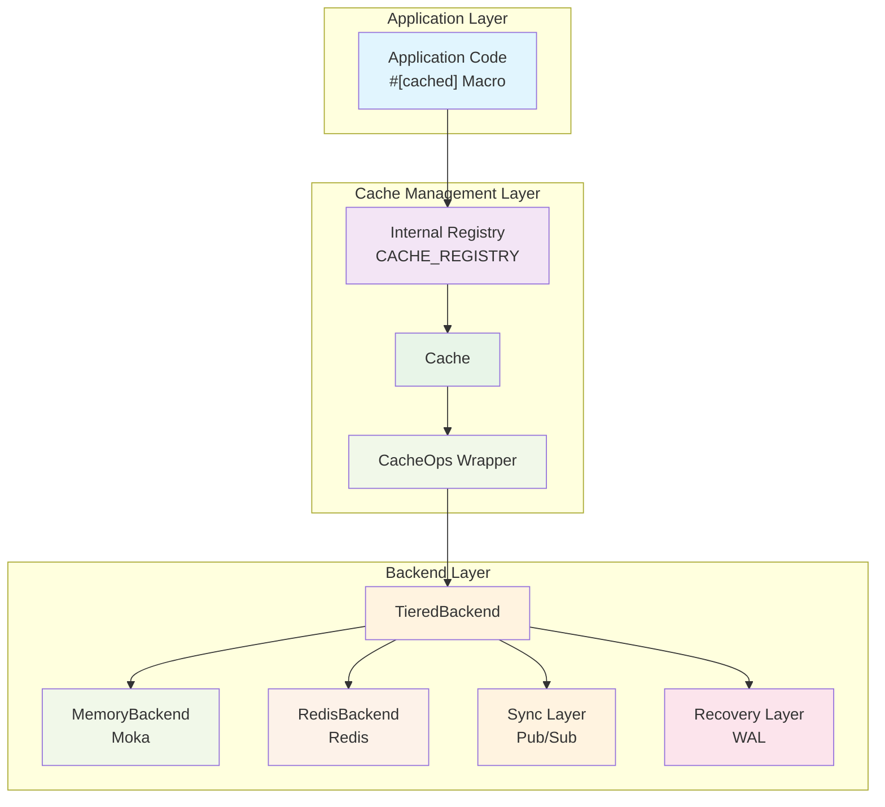
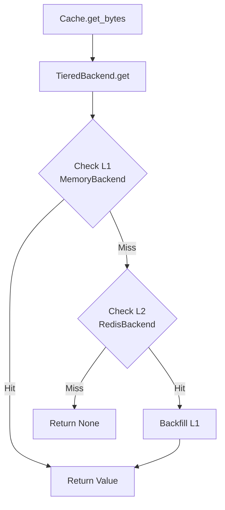
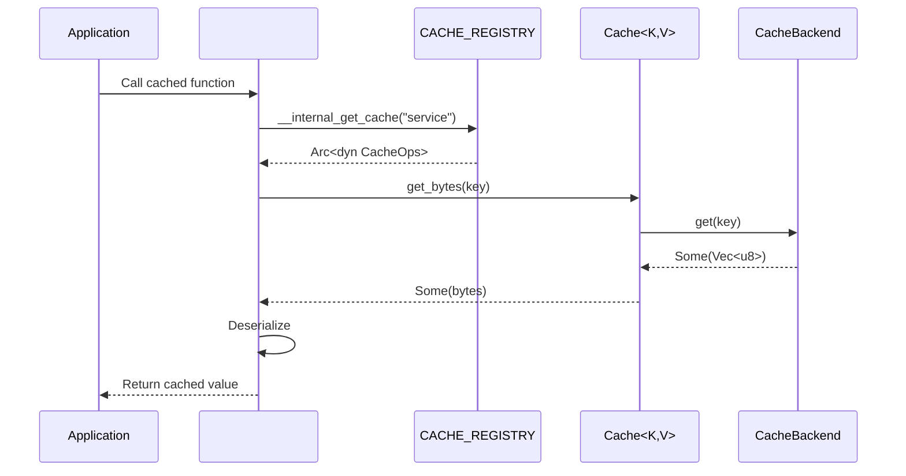
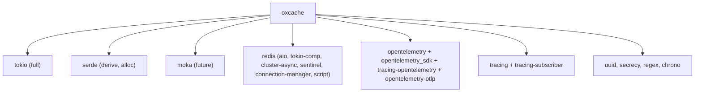

# Project Overview

<cite>
**Files referenced in this article**
- [README.md](file://README.md)
- [Cargo.toml](file://Cargo.toml)
- [src/lib.rs](file://src/lib.rs)
- [docs/USER_GUIDE.md](file://docs/USER_GUIDE.md)
- [docs/API_REFERENCE.md](file://docs/API_REFERENCE.md)
- [docs/ARCHITECTURE.md](file://docs/ARCHITECTURE.md)
- [docs/PERFORMANCE_BENCHMARK_REPORT.md](file://docs/PERFORMANCE_BENCHMARK_REPORT.md)
- [docs/CONTRIBUTING.md](file://docs/CONTRIBUTING.md)
- [docs/CHANGELOG.md](file://docs/CHANGELOG.md)
</cite>

## Table of Contents
1. [Introduction](#introduction)
2. [Project Structure](#project-structure)
3. [Core Components](#core-components)
4. [Architecture Overview](#architecture-overview)
5. [Detailed Component Analysis](#detailed-component-analysis)
6. [Dependency Analysis](#dependency-analysis)
7. [Performance Considerations](#performance-considerations)
8. [Troubleshooting Guide](#troubleshooting-guide)
9. [Conclusion](#conclusion)
10. [Appendix](#appendix)

## Introduction
Oxcache is a high-performance, production-grade Rust multi-level cache library using L1 (in-memory cache, Moka) + L2 (Redis distributed cache) two-tier architecture, providing zero-code-change, automatic recovery, multi-instance synchronization, batch optimization, and other features. The project enables developers to achieve extreme performance and reliability with minimal cost through modern APIs and macro support.

- **Core Objective**: Provide a "plug-and-play" dual-layer cache solution in the Rust ecosystem that balances extreme performance with production usability.
- **Design Philosophy**: Guarantee nanosecond-level access with L1, provide cross-instance sharing and elastic scaling with L2; ensure consistency through Pub/Sub and versioned invalidation; achieve automatic degradation and recovery through WAL and health checks.
- **Applicable Scenarios**: High-concurrency web services, API caching, database query caching, hot data acceleration in distributed systems, etc.

**Section source**
- [README.md](file://README.md#L16-L58)
- [docs/USER_GUIDE.md](file://docs/USER_GUIDE.md#L75-L86)

## Project Structure
The repository adopts modular organization divided around "backend implementation + client + configuration + feature features" to facilitate on-demand feature enablement and backend extension.

**Chart source**
- [docs/CONTRIBUTING.md](file://docs/CONTRIBUTING.md#L122-L154)

**Section source**
- [docs/CONTRIBUTING.md](file://docs/CONTRIBUTING.md#L120-L188)

## Core Components
- Modern API and macro support: Implement zero-boilerplate code caching through Cache type and #[cached] macro.
- L1 in-memory cache (Moka): TinyLFU eviction policy, nanosecond-level access latency.
- L2 distributed cache (Redis): Supports Standalone/Sentinel/Cluster, batch writing and Pub/Sub invalidation.
- Synchronization and recovery: Version-based Pub/Sub invalidation propagation, WAL write-ahead logging ensures persistence and recovery.
- Observability and security: OpenTelemetry metrics, health checks, input validation, timeout protection, connection string desensitization, etc.

**Section source**
- [src/lib.rs](file://src/lib.rs#L10-L176)
- [docs/ARCHITECTURE.md](file://docs/ARCHITECTURE.md#L34-L74)

## Architecture Overview
The dual-layer cache architecture achieves collaborative L1 + L2 operation through unified Cache interface and backend adaptation. The macro registry is responsible for binding #[cached] functions with cache instances, while TieredBackend handles L1/L2 and WAL/Pub/Sub on read/write paths respectively.

**Chart source**
- [docs/ARCHITECTURE.md](file://docs/ARCHITECTURE.md#L36-L73)

**Section source**
- [docs/ARCHITECTURE.md](file://docs/ARCHITECTURE.md#L34-L74)

## Detailed Component Analysis

### L1 In-Memory Cache (Moka)
- Technology selection: Moka provides concurrency-safe, TinyLFU eviction policy, suitable for high-concurrency, low-latency local caching.
- Performance characteristics: Read/write latency typically at sub-microsecond to microsecond levels, throughput can reach millions of ops/s.
- Configuration points: Maximum capacity, key-value size limits, cleanup intervals, etc.

**Section source**
- [docs/ARCHITECTURE.md](file://docs/ARCHITECTURE.md#L136-L158)

### L2 Distributed Cache (Redis)
- Supported modes: Standalone, Sentinel, Cluster, with connection pool, topology awareness and automatic reconnection capabilities.
- Serialization: Supports JSON and Bincode, with Bincode being smaller and faster.
- Batch processing: Significantly improves throughput through commands like MSET.
- Invalidation and synchronization: Combines Pub/Sub with version numbers to achieve cross-instance consistency.

**Section source**
- [docs/ARCHITECTURE.md](file://docs/ARCHITECTURE.md#L159-L176)

### TieredBackend Read/Write Paths
- Read path: Prioritize L1, return on hit; on miss, check L2, and if hit, backfill L1 before returning.
- Write path: Immediately write to L1, asynchronously batch write to L2, write to WAL and publish invalidation messages when necessary.

**Chart source**
- [docs/ARCHITECTURE.md](file://docs/ARCHITECTURE.md#L485-L504)

**Section source**
- [docs/ARCHITECTURE.md](file://docs/ARCHITECTURE.md#L201-L216)

### #[cached] Macro Workflow
- Automatically generate cache keys, get cache instances from registry, serialize/deserialize, automatically write back to cache.
- Supports TTL, key formatting, key prefix, key generation strategy and other parameters.

**Chart source**
- [docs/ARCHITECTURE.md](file://docs/ARCHITECTURE.md#L381-L406)

**Section source**
- [docs/ARCHITECTURE.md](file://docs/ARCHITECTURE.md#L375-L447)

### Synchronization and Recovery
- Versioned invalidation: Publish invalidation messages through Pub/Sub, receivers decide whether to delete L1 based on version numbers.
- WAL: When L2 is unavailable, record write operations and replay after recovery to ensure no data loss.
- Health checks: Periodically detect L1/L2/WAL status, trigger degradation or recovery processes.

**Section source**
- [docs/ARCHITECTURE.md](file://docs/ARCHITECTURE.md#L257-L312)

### Observability and Security
- Metrics: Hit rate, operation latency, L2 health status, WAL entry count, batch buffer size, etc.
- Tracing: OpenTelemetry integration, supports OTLP.
- Security: Input validation (keys, Lua scripts, SCAN patterns), timeout protection, UUID lock values, connection string desensitization, injection prevention rules, etc.

**Section source**
- [docs/ARCHITECTURE.md](file://docs/ARCHITECTURE.md#L647-L668)

## Dependency Analysis
Oxcache flexibly enables functionality through feature flags, with core dependencies including:
- Async runtime: Tokio (full feature)
- Serialization: Serde (derive + alloc)
- In-memory cache: Moka (future feature)
- Distributed cache: Redis (aio, tokio-comp, cluster-async, sentinel, connection-manager, script)
- Observability: OpenTelemetry, Tracing, Prometheus output
- Utilities: UUID, Secret, Regex, Chrono, etc.

**Chart source**
- [Cargo.toml](file://Cargo.toml#L20-L120)

**Section source**
- [Cargo.toml](file://Cargo.toml#L20-L377)

## Performance Considerations
- L1 (Moka): Sub-microsecond latency, millions of ops/s; can be optimized through capacity and serialization methods.
- L2 (Redis): Local loopback about 1-5ms; batch writing can increase throughput to 200-500K ops/s.
- Batch processing: Reduce network round trips and protocol overhead through batch buffering and commands like MSET.
- Compilation optimization: Release configuration enables LTO, single codegen unit, panic abort, strip, etc., significantly improving performance and reducing binary size.

**Section source**
- [docs/PERFORMANCE_BENCHMARK_REPORT.md](file://docs/PERFORMANCE_BENCHMARK_REPORT.md#L8-L68)
- [docs/ARCHITECTURE.md](file://docs/ARCHITECTURE.md#L608-L646)
- [Cargo.toml](file://Cargo.toml#L352-L370)

## Troubleshooting Guide
- High cache miss rate: Check TTL, whether promote_on_hit is enabled, if L1 capacity is too small.
- Redis connection failure: Verify connection string, network and firewall, credentials and TLS.
- Data inconsistency: Confirm Pub/Sub channel and version number configuration, consider shortening TTL or active invalidation.
- Performance degradation: Check for memory leaks, batch write configuration, L1 capacity and serialization methods.

**Section source**
- [docs/USER_GUIDE.md](file://docs/USER_GUIDE.md#L711-L760)

## Conclusion
Oxcache centers on "L1 + L2" dual-layer architecture, combined with macros and modern APIs, providing zero-code-change, automatic recovery, multi-instance synchronization and batch optimization capabilities. Its feature gate design and observability and security measures make it suitable for both beginners to get started quickly and experienced developers with strict requirements for performance and reliability. With comprehensive testing and documentation systems, it is suitable for large-scale deployment in production environments.

## Appendix

### Technology Stack Overview
- Async runtime: Tokio
- In-memory cache: Moka
- Distributed cache: Redis (Standalone/Sentinel/Cluster)
- Serialization: Serde (JSON/Bincode, etc.)
- Observability: OpenTelemetry, Tracing, Prometheus
- Utility libraries: UUID, Secret, Regex, Chrono, etc.

**Section source**
- [Cargo.toml](file://Cargo.toml#L24-L120)

### Feature Tiers and Selection
- minimal: L1 only (Moka), suitable for pure in-memory cache scenarios.
- core: L1 + L2 (Redis), default recommendation.
- full: Includes all advanced features such as macros, batch processing, WAL, bloom filter, rate limiting, database integration, CLI, metrics, smart strategies, etc.

**Section source**
- [README.md](file://README.md#L75-L115)
- [docs/API_REFERENCE.md](file://docs/API_REFERENCE.md#L27-L91)

### Applicable Scenarios and Target Users
- Scenarios: User information caching, API response caching, database query caching, hot data acceleration, multi-instance shared caching.
- Users: Rust developers pursuing extreme performance and usability, teams needing stable operation in production environments.

**Section source**
- [README.md](file://README.md#L244-L276)

### Development History and Version Information
- v0.1.4: Refactored examples and tests, unified new API, enhanced security and stability.
- v0.1.2: Fixed multiple high-risk security vulnerabilities, introduced several performance optimizations.
- v0.1.1: Introduced comprehensive compiler optimizations, significantly improving runtime performance and reducing binary size.
- v0.1.0: Implemented graceful shutdown, degradation strategies, database fallback, HTTP metric endpoints, Redis compatibility, etc.

**Section source**
- [docs/CHANGELOG.md](file://docs/CHANGELOG.md#L8-L163)

### License
- The project uses MIT license, allowing free use, modification and distribution.

**Section source**
- [README.md](file://README.md#L401-L404)
