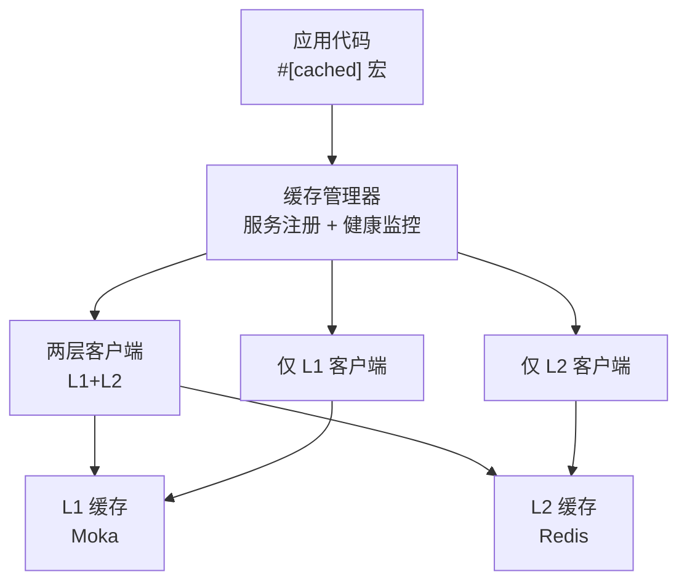
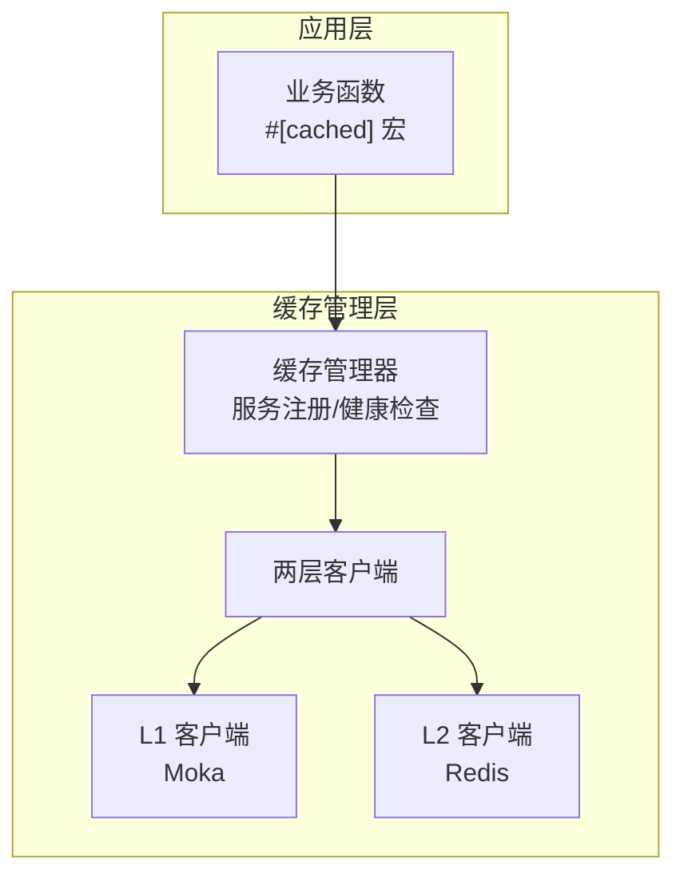
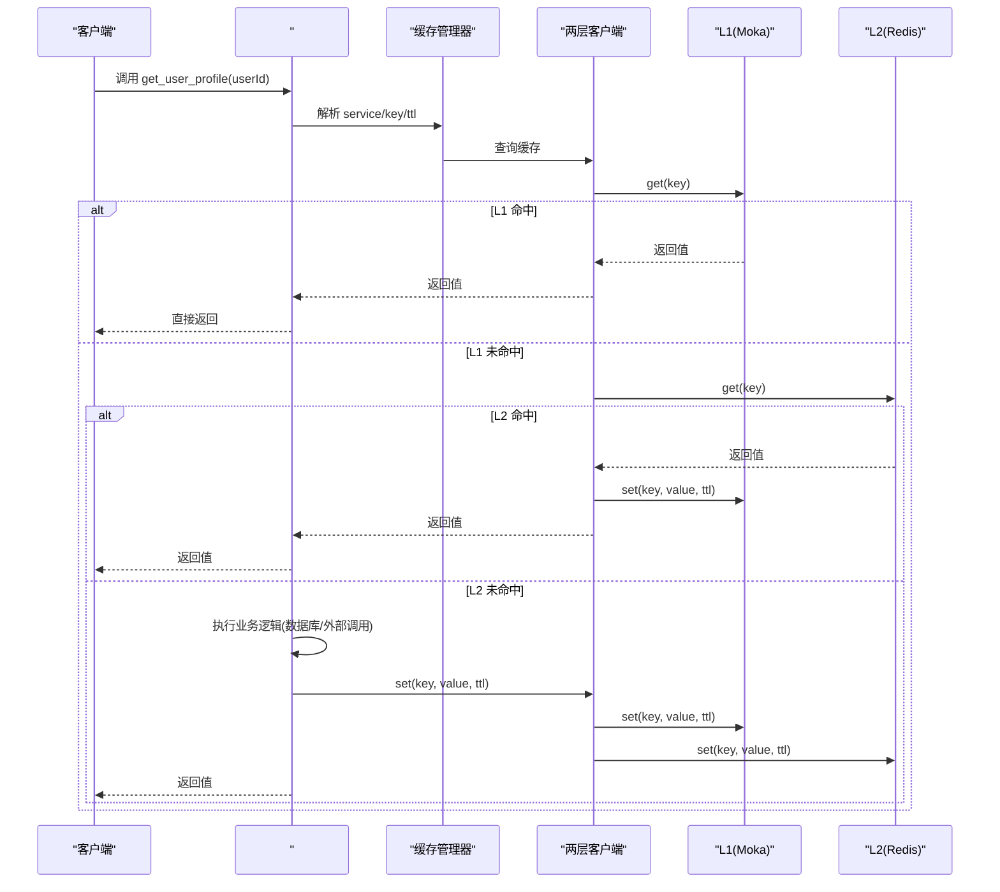
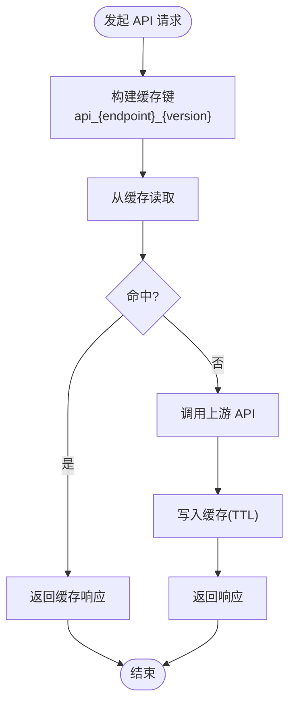
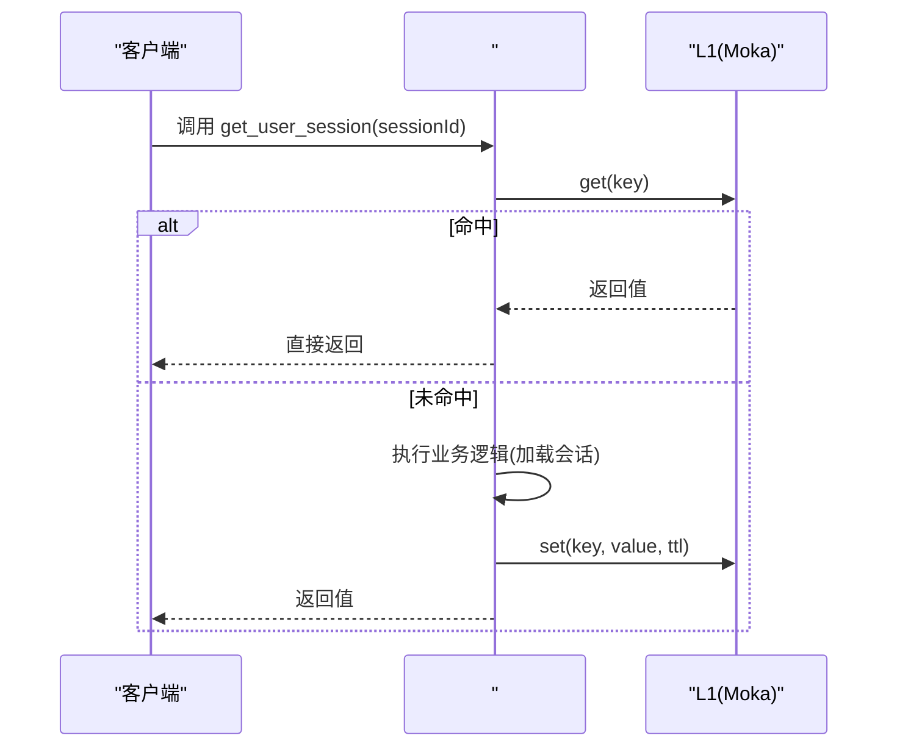
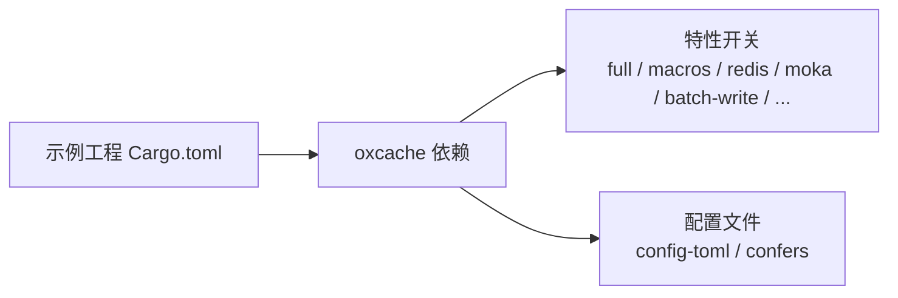

# 应用场景

<cite>
**本文引用的文件**
- [README.md](file://README.md)
- [USER_GUIDE.md](file://docs/USER_GUIDE.md)
- [http_cache.rs](file://examples/src/http_cache.rs)
- [dynamic_config.rs](file://examples/src/dynamic_config.rs)
- [smart_strategy.rs](file://examples/src/smart_strategy.rs)
- [example_cache_promotion.rs](file://examples/src/02_advanced/example_cache_promotion.rs)
- [example_batch_write.rs](file://examples/src/02_advanced/example_batch_write.rs)
- [example_invalidation.rs](file://examples/src/02_advanced/example_invalidation.rs)
- [Cargo.toml（示例工程）](file://examples/Cargo.toml)
- [batch_write_test.rs](file://tests/integration/batch_write_test.rs)
- [metrics.rs](file://src/metrics.rs)
</cite>

## 目录
1. [简介](#简介)
2. [项目结构](#项目结构)
3. [核心组件](#核心组件)
4. [架构总览](#架构总览)
5. [详细组件分析](#详细组件分析)
6. [依赖关系分析](#依赖关系分析)
7. [性能考量](#性能考量)
8. [故障排查指南](#故障排查指南)
9. [结论](#结论)
10. [附录](#附录)

## 简介
本章节面向 Oxcache 的三种典型应用场景：用户信息缓存、API 响应缓存、L1 独占缓存（热数据）。我们将结合 README 中的场景描述与示例工程，系统讲解业务需求、技术挑战、实现方案、最佳实践、性能优化与适用性评估，帮助你在实际项目中正确选择与落地缓存策略。

## 项目结构
围绕“应用场景”的文档，我们重点关注以下模块与示例：
- 场景示例：用户信息缓存、API 响应缓存、L1 独占缓存（热数据）
- 高阶能力：缓存提升、批量写入、失效策略、智能策略
- 配置与初始化：TOML 配置、服务注册、宏启用
- 性能与度量：吞吐、延迟、批量写入指标

图表来源
- [README.md](file://README.md#L277-L300)

章节来源
- [README.md](file://README.md#L244-L276)
- [USER_GUIDE.md](file://docs/USER_GUIDE.md#L335-L368)

## 核心组件
- 宏启用缓存：通过 #[cached] 将任意异步函数变为带缓存的函数，自动处理键生成、TTL、序列化等。
- 客户端 API：提供 get/set/delete/exists/clear 等统一接口，支持 L1/L2/L1+L2 三种模式。
- 配置体系：TOML 配置文件集中管理全局参数与服务级参数（TTL、L1/L2 参数、两层策略等）。
- 高级特性：Promote on hit、批量写入、失效策略、智能策略（预取/压缩/访问模式优化）。

章节来源
- [README.md](file://README.md#L174-L242)
- [USER_GUIDE.md](file://docs/USER_GUIDE.md#L402-L495)

## 架构总览
Oxcache 采用 L1（Moka 内存缓存）+ L2（Redis 分布式缓存）双层架构。L1 提供纳秒级访问，L2 提供跨实例共享与持久化能力。通过“写透”“提升”“失效”等策略实现性能与一致性的平衡。

图表来源
- [README.md](file://README.md#L277-L300)

## 详细组件分析

### 场景一：用户信息缓存（两层缓存）
- 业务需求
  - 用户资料属于高频读取、低频变更的数据，适合两层缓存：L1 提升热数据访问速度，L2 保证多实例一致性与共享。
- 技术挑战
  - 如何生成稳定且可读的缓存键
  - 如何设置合理的 TTL，避免脏读
  - 如何在 L2 命中时将热数据提升到 L1
- 解决方案
  - 使用 #[cached] 宏指定 service 与 key 模板
  - 在配置中设置两层策略：write_through、promote_on_hit、enable_batch_write
  - 通过 Cache::tiered 或配置文件初始化
- 最佳实践
  - key 使用“user:{id}”等稳定模板
  - TTL 设为 5-10 分钟，结合业务更新频率
  - 启用 promote_on_hit，让热用户数据常驻 L1
  - 对写入开启批量写入，降低 L2 压力
- 代码与配置参考
  - 宏启用与函数缓存：[README.md](file://README.md#L246-L253)
  - 两层缓存配置片段：[README.md](file://README.md#L132-L153)
  - 两层客户端创建与使用：[USER_GUIDE.md](file://docs/USER_GUIDE.md#L432-L472)
- 性能与度量
  - L1 命中延迟 P99 < 100ns，L2 命中 P99 < 5ms
  - 批量写入吞吐可达 200-500K ops/sec（参考基准）

图表来源
- [README.md](file://README.md#L246-L253)
- [USER_GUIDE.md](file://docs/USER_GUIDE.md#L402-L422)

章节来源
- [README.md](file://README.md#L246-L253)
- [README.md](file://README.md#L132-L153)
- [USER_GUIDE.md](file://docs/USER_GUIDE.md#L402-L472)

### 场景二：API 响应缓存（HTTP 缓存）
- 业务需求
  - 对外部 API 或内部接口的响应进行缓存，减少重复请求与下游压力。
- 技术挑战
  - 如何为不同 endpoint/version 生成稳定的缓存键
  - 如何处理响应头（如 Cache-Control）与私有/公共缓存
  - 如何在需要时强制刷新或失效
- 解决方案
  - 使用 #[cached] 宏，key 模板中包含 endpoint 与 version
  - 使用 Cache::new 或 Cache::redis 创建缓存实例
  - 通过 delete 主动失效或设置 TTL 自动过期
- 最佳实践
  - key 模板：api_{endpoint}_{version}
  - TTL 根据接口稳定性设置（如 5 分钟）
  - 对私有数据（含用户上下文）使用私有缓存策略
- 代码与示例参考
  - 宏启用与 key 模板：[README.md](file://README.md#L255-L266)
  - HTTP 缓存示例（通用 Cache 使用）：[http_cache.rs](file://examples/src/http_cache.rs#L1-L108)
  - 手动控制缓存（set/get/delete）：[USER_GUIDE.md](file://docs/USER_GUIDE.md#L424-L472)

图表来源
- [README.md](file://README.md#L255-L266)
- [http_cache.rs](file://examples/src/http_cache.rs#L27-L86)

章节来源
- [README.md](file://README.md#L255-L266)
- [http_cache.rs](file://examples/src/http_cache.rs#L1-L108)
- [USER_GUIDE.md](file://docs/USER_GUIDE.md#L424-L472)

### 场景三：L1 独占缓存（热数据）
- 业务需求
  - 对极热、极短生命周期的数据（如会话、临时令牌）使用仅 L1 缓存，避免跨实例共享与网络开销。
- 技术挑战
  - 如何确保数据只在进程内有效
  - 如何设置合适的 TTL 与容量，避免内存膨胀
- 解决方案
  - 使用 #[cached] 宏指定 cache_type = "l1"
  - 或使用 Cache::new 创建仅 L1 缓存
- 最佳实践
  - TTL 设置为分钟级（如 60s）
  - 容量按峰值并发与对象大小估算
  - 与两层缓存区分用途，避免混用
- 代码与示例参考
  - L1 独占缓存示例：[README.md](file://README.md#L268-L275)
  - 仅 L1 客户端创建与使用：[USER_GUIDE.md](file://docs/USER_GUIDE.md#L287-L331)

图表来源
- [README.md](file://README.md#L268-L275)
- [USER_GUIDE.md](file://docs/USER_GUIDE.md#L287-L331)

章节来源
- [README.md](file://README.md#L268-L275)
- [USER_GUIDE.md](file://docs/USER_GUIDE.md#L287-L331)

### 高级能力：缓存提升（Promote on hit）
- 作用：当 L2 命中时，将数据提升到 L1，使后续访问走 L1，降低 L2 压力。
- 配置：在服务配置中启用 promote_on_hit。
- 示例：[example_cache_promotion.rs](file://examples/src/02_advanced/example_cache_promotion.rs#L1-L66)

章节来源
- [example_cache_promotion.rs](file://examples/src/02_advanced/example_cache_promotion.rs#L1-L66)

### 高级能力：批量写入优化
- 作用：批量写入显著提升 L2 写入吞吐，降低网络与命令开销。
- 配置：enable_batch_write、batch_size、batch_interval_ms。
- 示例与测试：[example_batch_write.rs](file://examples/src/02_advanced/example_batch_write.rs#L1-L154)、[batch_write_test.rs](file://tests/integration/batch_write_test.rs#L1-L45)

章节来源
- [example_batch_write.rs](file://examples/src/02_advanced/example_batch_write.rs#L1-L154)
- [batch_write_test.rs](file://tests/integration/batch_write_test.rs#L1-L45)

### 高级能力：失效策略
- 支持：单 key 失效、批量清空、TTL 自动失效、写入时失效（Write-Invalidation）。
- 示例：[example_invalidation.rs](file://examples/src/02_advanced/example_invalidation.rs#L1-L154)

章节来源
- [example_invalidation.rs](file://examples/src/02_advanced/example_invalidation.rs#L1-L154)

### 高级能力：智能策略（预取/压缩/访问模式优化）
- 作用：根据访问模式自动预取热点数据，对大对象启用压缩，优化吞吐与内存占用。
- 示例：[smart_strategy.rs](file://examples/src/smart_strategy.rs#L1-L109)

章节来源
- [smart_strategy.rs](file://examples/src/smart_strategy.rs#L1-L109)

## 依赖关系分析
- 宏启用缓存依赖 features：macros、serialization、moka、redis（视服务类型）
- 示例工程启用 full 与多种高级特性，便于演示
- 配置文件需启用 config-toml 与 confers 才能从文件初始化

图表来源
- [Cargo.toml（示例工程）](file://examples/Cargo.toml#L15-L34)
- [README.md](file://README.md#L116-L124)

章节来源
- [Cargo.toml（示例工程）](file://examples/Cargo.toml#L15-L34)
- [README.md](file://README.md#L116-L124)

## 性能考量
- 延迟与吞吐
  - L1：P99 < 100ns
  - L2：P99 < 5ms
  - 批量写入：单线程吞吐可达 200-500K ops/sec（参考基准）
- 批量写入参数
  - enable_batch_write、batch_size、batch_interval_ms
- 指标采集
  - 命中率、操作次数、L2 健康状态、WAL 条目数、批量缓冲大小
  - 参考：[metrics.rs](file://src/metrics.rs#L229-L254)

章节来源
- [README.md](file://README.md#L305-L335)
- [metrics.rs](file://src/metrics.rs#L229-L254)

## 故障排查指南
- 缓存未命中率高
  - 检查 TTL 是否过短、是否启用 promote_on_hit、L1 容量是否合理
- Redis 连接失败
  - 检查连接字符串、网络与防火墙、认证信息
- 数据不一致
  - 检查 Pub/Sub 与版本号配置，考虑缩短 TTL 或主动失效
- 性能下降
  - 检查内存泄漏、批量写入配置、L1 容量与淘汰策略

章节来源
- [USER_GUIDE.md](file://docs/USER_GUIDE.md#L711-L759)

## 结论
- 用户信息缓存：优先两层缓存，启用 promote_on_hit 与批量写入，合理设置 TTL。
- API 响应缓存：使用 #[cached] 宏，key 包含 endpoint 与 version，支持主动失效与 TTL。
- L1 独占缓存：针对热、短生命周期数据，仅使用 L1，避免跨实例共享。
- 配置与特性：通过 TOML 配置集中管理，结合宏与客户端 API 快速落地。
- 性能与可靠性：利用批量写入、智能策略与健康检查，保障高吞吐与稳定性。

## 附录
- 快速上手
  - 添加依赖与特性：[README.md](file://README.md#L61-L98)
  - 配置文件与初始化：[README.md](file://README.md#L116-L172)
  - 宏启用与手动使用：[README.md](file://README.md#L174-L242)
- 示例清单
  - 用户信息缓存：[README.md](file://README.md#L246-L253)
  - API 响应缓存：[README.md](file://README.md#L255-L266)
  - L1 独占缓存：[README.md](file://README.md#L268-L275)
  - HTTP 缓存示例：[http_cache.rs](file://examples/src/http_cache.rs#L1-L108)
  - 动态配置示例：[dynamic_config.rs](file://examples/src/dynamic_config.rs#L1-L133)
  - 智能策略示例：[smart_strategy.rs](file://examples/src/smart_strategy.rs#L1-L109)
  - 缓存提升示例：[example_cache_promotion.rs](file://examples/src/02_advanced/example_cache_promotion.rs#L1-L66)
  - 批量写入示例：[example_batch_write.rs](file://examples/src/02_advanced/example_batch_write.rs#L1-L154)
  - 失效策略示例：[example_invalidation.rs](file://examples/src/02_advanced/example_invalidation.rs#L1-L154)
