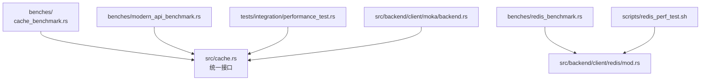
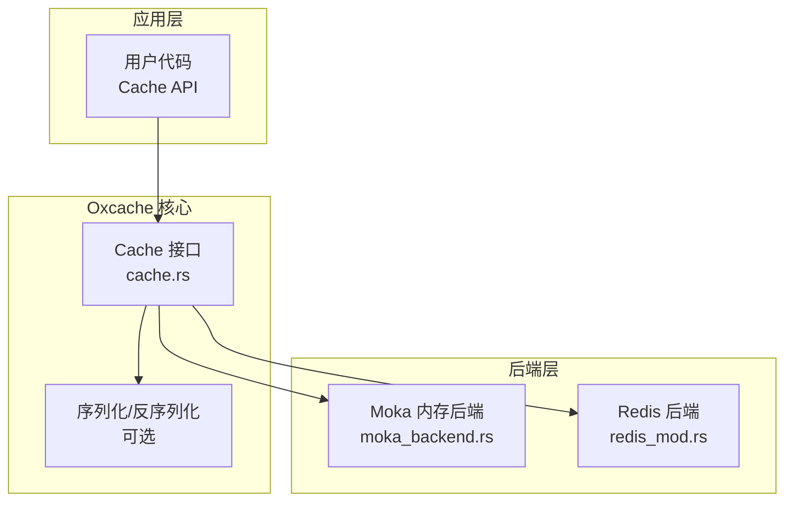
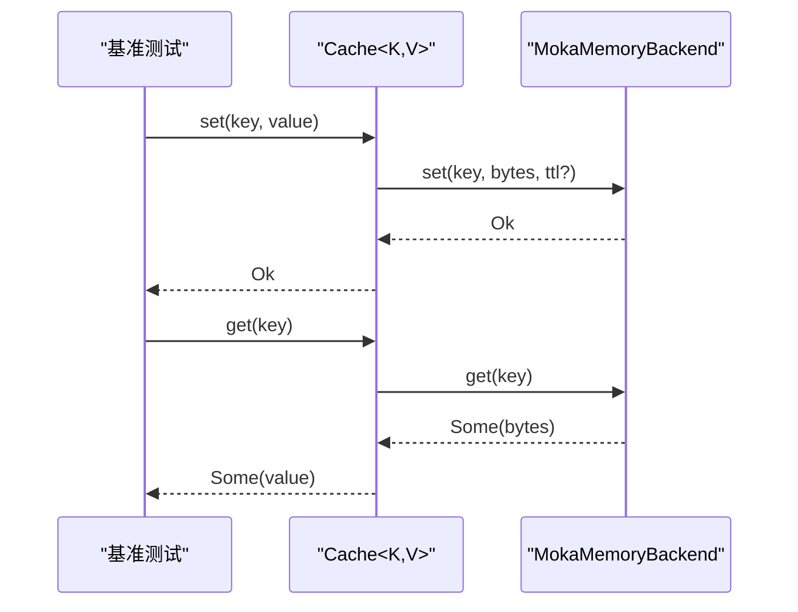
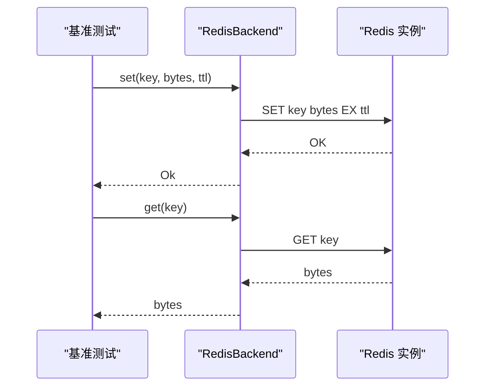
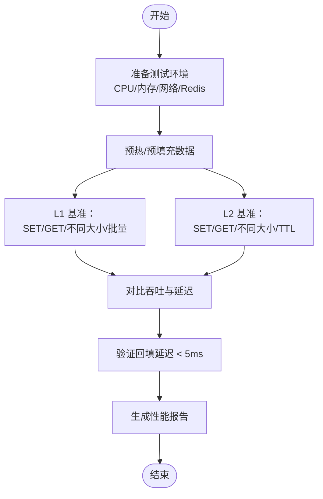
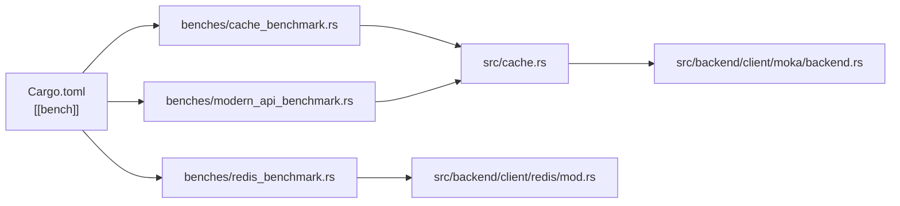

# 性能基准

<cite>
**本文引用的文件**
- [README.md](file://README.md)
- [cache_benchmark.rs](file://benches/cache_benchmark.rs)
- [modern_api_benchmark.rs](file://benches/modern_api_benchmark.rs)
- [redis_benchmark.rs](file://benches/redis_benchmark.rs)
- [redis_perf_test.sh](file://scripts/redis_perf_test.sh)
- [performance_test.rs](file://tests/integration/performance_test.rs)
- [Cargo.toml](file://Cargo.toml)
- [cache.rs](file://src/cache.rs)
- [backend.rs](file://src/backend/client/mod.rs)
- [moka_backend.rs](file://src/backend/client/moka/backend.rs)
- [redis_mod.rs](file://src/backend/client/redis/mod.rs)
</cite>

## 目录
1. [简介](#简介)
2. [项目结构](#项目结构)
3. [核心组件](#核心组件)
4. [架构总览](#架构总览)
5. [详细组件分析](#详细组件分析)
6. [依赖关系分析](#依赖关系分析)
7. [性能考量](#性能考量)
8. [故障排查指南](#故障排查指南)
9. [结论](#结论)
10. [附录](#附录)

## 简介
本文件围绕 Oxcache 的性能基准与测试方法展开，结合仓库中已有的基准测试脚本、集成测试与 README 中的性能数据，系统性地分析 L1（内存）缓存、L2（Redis）缓存与数据库查询三者的性能差异与吞吐特征，并给出测试方法论、环境配置建议、优化参数与容量规划参考。

## 项目结构
与性能基准相关的关键目录与文件：
- benches：Criterion 基准测试
  - cache_benchmark.rs：L1 缓存基准（设置、获取、不同数据大小、批量）
  - modern_api_benchmark.rs：现代 API 的 L1 基准（命中/未命中、不同数据大小、顺序与吞吐）
  - redis_benchmark.rs：Redis L2 后端基准（SET/GET/不同大小/TTL）
- scripts：外部 Redis 性能测试脚本（redis_perf_test.sh）
- tests/integration：集成测试（含回填延迟与 Redis 故障降级）
- src：核心实现与后端抽象
  - cache.rs：统一 Cache 接口与现代 API
  - backend/client/mod.rs：后端模块导出与枚举
  - backend/client/moka/backend.rs：Moka 内存后端实现
  - backend/client/redis/mod.rs：Redis 客户端模块导出

**图表来源**
- [cache_benchmark.rs](file://benches/cache_benchmark.rs#L1-L100)
- [modern_api_benchmark.rs](file://benches/modern_api_benchmark.rs#L1-L158)
- [redis_benchmark.rs](file://benches/redis_benchmark.rs#L1-L123)
- [redis_perf_test.sh](file://scripts/redis_perf_test.sh#L1-L111)
- [performance_test.rs](file://tests/integration/performance_test.rs#L1-L99)
- [cache.rs](file://src/cache.rs#L117-L646)
- [backend.rs](file://src/backend/client/mod.rs#L1-L34)
- [moka_backend.rs](file://src/backend/client/moka/backend.rs#L1-L259)
- [redis_mod.rs](file://src/backend/client/redis/mod.rs#L1-L15)

**章节来源**
- [Cargo.toml](file://Cargo.toml#L374-L377)
- [README.md](file://README.md#L305-L335)

## 核心组件
- 统一缓存接口（现代 API）
  - 提供类型安全的 get/set/get_or 等操作，内部委托给具体后端（Moka/DashMap/Redis）
  - 支持统计查询与健康检查
- L1 后端（Moka）
  - 基于 moka::future::Cache，支持容量、TTL、TTI 配置；适合高并发、低延迟的本地缓存
- L2 后端（Redis）
  - 通过 redis 客户端提供 SET/GET/TTL 等操作；支持 Pipeline 等优化
- 基准测试与集成测试
  - Criterion 基准覆盖 L1/L2 不同数据规模与吞吐
  - 集成测试覆盖回填延迟与 Redis 故障降级

**章节来源**
- [cache.rs](file://src/cache.rs#L117-L646)
- [moka_backend.rs](file://src/backend/client/moka/backend.rs#L1-L259)
- [redis_mod.rs](file://src/backend/client/redis/mod.rs#L1-L15)

## 架构总览
下图展示现代 API 与后端的关系，以及基准测试所覆盖的路径。

**图表来源**
- [cache.rs](file://src/cache.rs#L117-L646)
- [moka_backend.rs](file://src/backend/client/moka/backend.rs#L1-L259)
- [redis_mod.rs](file://src/backend/client/redis/mod.rs#L1-L15)

## 详细组件分析

### L1 缓存（Moka）基准
- 测试维度
  - 单次 SET/GET
  - 不同数据大小（字节级吞吐）
  - 批量写入（批量大小与总字节数）
- 关键实现点
  - Moka 后端直接插入/查询，容量与 TTL 在构建期设定
  - 现代 API 对外暴露 set/get/get_or 等操作，内部进行序列化/反序列化（如启用）

**图表来源**
- [cache.rs](file://src/cache.rs#L241-L325)
- [moka_backend.rs](file://src/backend/client/moka/backend.rs#L68-L123)

**章节来源**
- [cache_benchmark.rs](file://benches/cache_benchmark.rs#L14-L90)
- [modern_api_benchmark.rs](file://benches/modern_api_benchmark.rs#L14-L148)
- [moka_backend.rs](file://src/backend/client/moka/backend.rs#L1-L259)

### L2 缓存（Redis）基准
- 测试维度
  - 单次 SET/GET
  - 不同数据大小
  - TTL 设置
- 关键实现点
  - Redis 后端通过 redis 客户端执行命令；Pipeline 可显著提升吞吐
  - 外部脚本 redis_perf_test.sh 展示了 PING/SET/GET/Pipeline 等指标

**图表来源**
- [redis_benchmark.rs](file://benches/redis_benchmark.rs#L15-L113)
- [redis_perf_test.sh](file://scripts/redis_perf_test.sh#L15-L90)

**章节来源**
- [redis_benchmark.rs](file://benches/redis_benchmark.rs#L1-L123)
- [redis_perf_test.sh](file://scripts/redis_perf_test.sh#L1-L111)

### 数据库查询性能定位
- README 中提供了数据库查询的典型延迟范围（10-50ms），用于与 L1/L2 做对比
- 在实际系统中，数据库延迟受索引、锁、网络与负载影响较大，应作为性能瓶颈识别的重要参照

**章节来源**
- [README.md](file://README.md#L328-L335)

### 吞吐量对比与场景分析
- README 性能摘要（环境：M1 Pro，macOS，Redis 7.0）
  - L1 操作：5-10M ops/sec
  - L2 单次写入：50-100K ops/sec
  - L2 批量写入：200-500K ops/sec
- 基准测试与集成测试的侧重点
  - Criterion 基准：覆盖不同数据规模与批量写入，便于横向比较
  - 集成测试：验证回填延迟（NF2 要求 < 5ms）与故障降级

**图表来源**
- [README.md](file://README.md#L305-L335)
- [performance_test.rs](file://tests/integration/performance_test.rs#L19-L70)

**章节来源**
- [README.md](file://README.md#L305-L335)
- [performance_test.rs](file://tests/integration/performance_test.rs#L1-L99)

## 依赖关系分析
- Cargo.toml 中定义了基准测试目标与 dev-dependencies（criterion），确保基准测试独立运行
- 现代 API 通过统一接口调用后端，后端分别由 Moka 或 Redis 提供

**图表来源**
- [Cargo.toml](file://Cargo.toml#L374-L377)
- [cache_benchmark.rs](file://benches/cache_benchmark.rs#L1-L100)
- [modern_api_benchmark.rs](file://benches/modern_api_benchmark.rs#L1-L158)
- [redis_benchmark.rs](file://benches/redis_benchmark.rs#L1-L123)
- [cache.rs](file://src/cache.rs#L117-L646)
- [backend.rs](file://src/backend/client/mod.rs#L1-L34)
- [moka_backend.rs](file://src/backend/client/moka/backend.rs#L1-L259)
- [redis_mod.rs](file://src/backend/client/redis/mod.rs#L1-L15)

**章节来源**
- [Cargo.toml](file://Cargo.toml#L374-L377)

## 性能考量
- 硬件与环境影响
  - CPU/内存/磁盘 I/O 与网络延迟直接影响 L2 与数据库性能
  - README 明确指出性能随硬件、网络与数据大小变化
- 数据规模与序列化
  - 大对象会显著增加序列化/反序列化与网络传输成本，需关注吞吐与延迟权衡
- 批量写入策略
  - README 指出批量写入吞吐远高于单次写入，应优先采用批量策略
- 回填延迟（NF2）
  - 集成测试验证 L1 未命中时从 L2 加载数据的延迟应小于 5ms

**章节来源**
- [README.md](file://README.md#L305-L335)
- [performance_test.rs](file://tests/integration/performance_test.rs#L14-L70)

## 故障排查指南
- Redis 连接失败
  - 集成测试展示了在无效端口下首次操作报错的预期行为
- 回填延迟过高
  - 若超过 5ms，需检查 L2 延迟、网络质量与批量策略
- 基准测试异常
  - 确认 Criterion 运行环境与 Redis 服务可用；必要时调整数据规模与批量大小

**章节来源**
- [performance_test.rs](file://tests/integration/performance_test.rs#L72-L99)

## 结论
- L1（Moka）具备纳秒级延迟与极高吞吐，适合热点数据与强并发场景
- L2（Redis）在本地回填延迟可达毫秒级，批量写入可显著提升吞吐
- 数据库查询通常在几十毫秒级别，应通过缓存与批量策略降低直连频率
- README 的性能摘要与基准测试共同构成性能基线，建议在目标硬件上复测以获得更准确的容量与参数建议

## 附录

### 性能测试方法论与环境配置
- 测试方法
  - 使用 Criterion 进行微基准测试，覆盖单次与批量、不同数据规模
  - 使用外部脚本对 Redis 进行 PING/SET/GET/Pipeline 基准
  - 集成测试验证回填延迟与故障降级
- 环境配置
  - 使用 README 中的硬件与软件版本作为参考环境
  - 确保 Redis 服务可用且网络稳定
  - 在 release 配置下运行，避免调试开销

**章节来源**
- [README.md](file://README.md#L305-L335)
- [redis_perf_test.sh](file://scripts/redis_perf_test.sh#L1-L111)
- [Cargo.toml](file://Cargo.toml#L352-L370)

### 参数与容量规划建议
- L1（Moka）
  - 容量：根据热点键数量与对象大小估算，预留 20%-30% 安全余量
  - TTL/TTI：按业务访问模式设置，避免频繁驱逐
- L2（Redis）
  - 批量写入：优先采用批量策略，结合 README 的吞吐范围规划批大小
  - 网络与持久化：评估网络 RTT 与 Redis 持久化策略对延迟的影响
- 数据库
  - 通过缓存与批量策略减少直连次数，将延迟控制在合理区间

**章节来源**
- [README.md](file://README.md#L328-L335)
- [moka_backend.rs](file://src/backend/client/moka/backend.rs#L125-L175)
