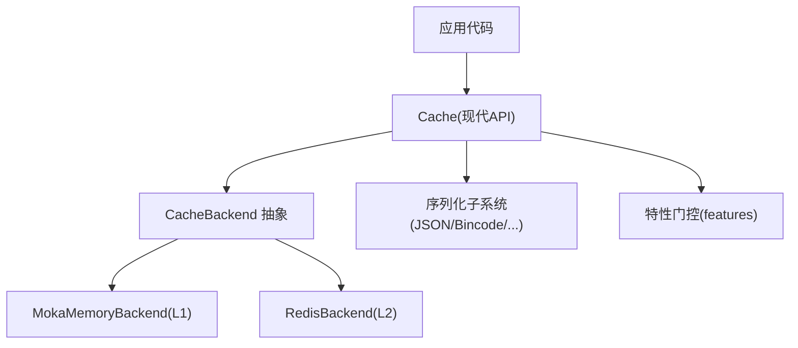
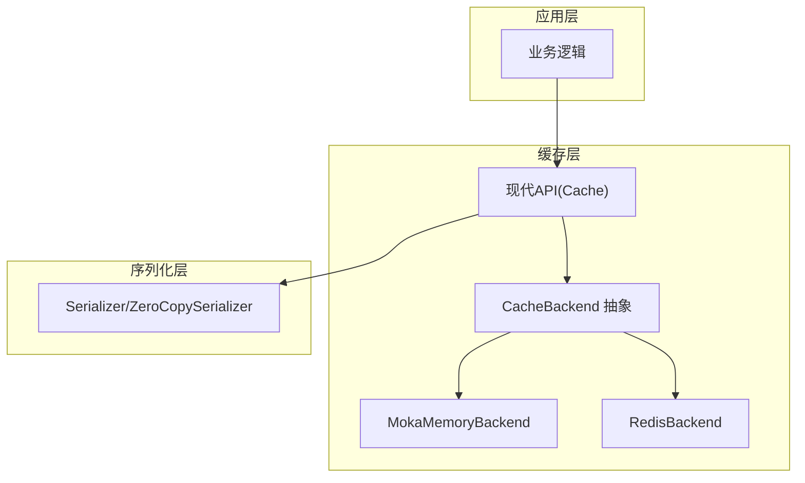
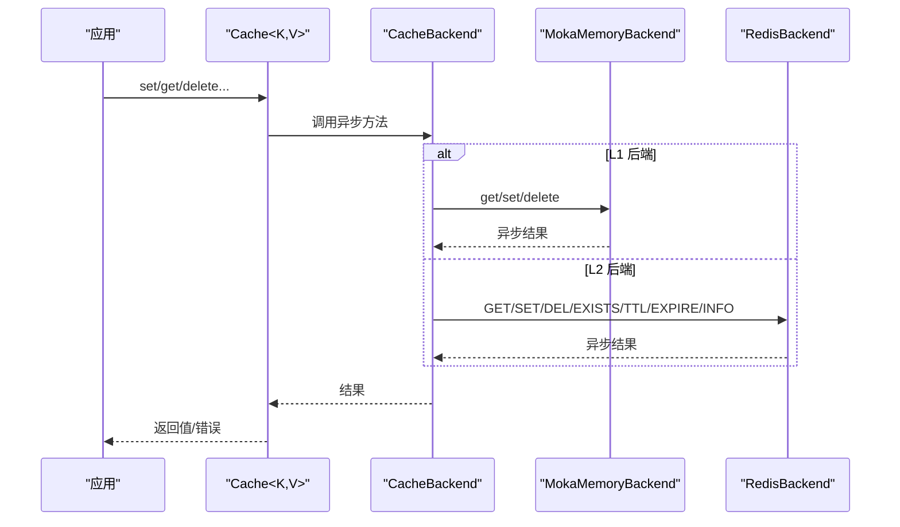
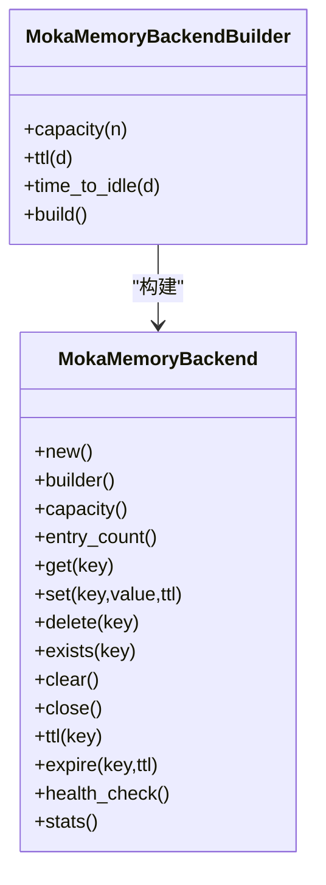
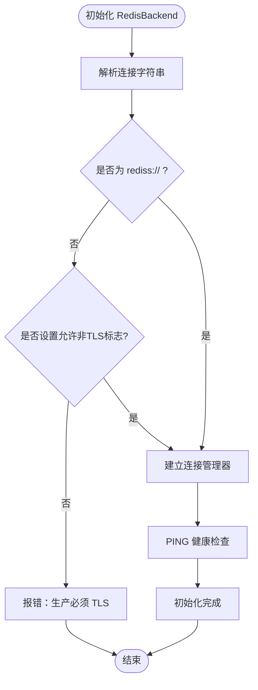
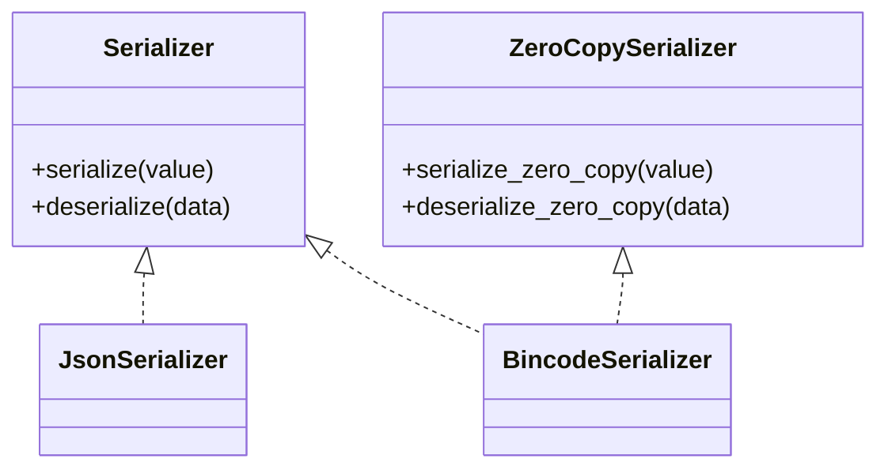
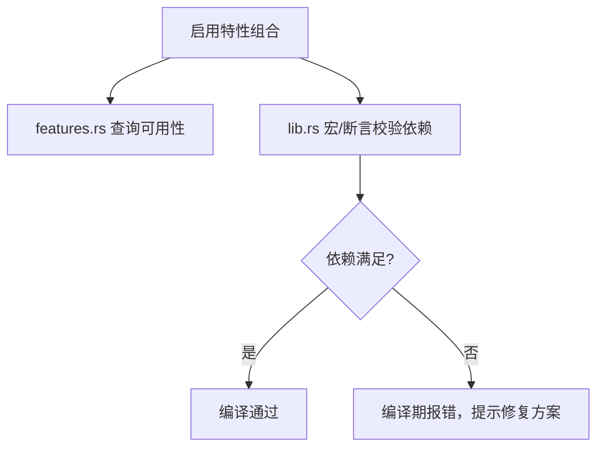
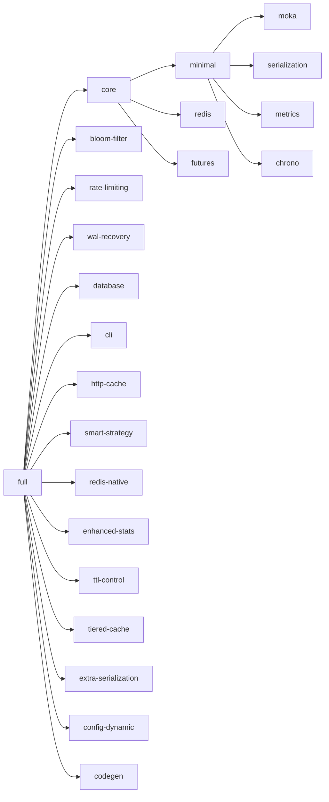

# 技术栈

<cite>
**本文引用的文件**
- [Cargo.toml](file://Cargo.toml)
- [src/lib.rs](file://src/lib.rs)
- [src/features.rs](file://src/features.rs)
- [src/backend/mod.rs](file://src/backend/mod.rs)
- [src/backend/client/moka/mod.rs](file://src/backend/client/moka/mod.rs)
- [src/backend/client/moka/backend.rs](file://src/backend/client/moka/backend.rs)
- [src/backend/client/redis/mod.rs](file://src/backend/client/redis/mod.rs)
- [src/backend/client/redis/client.rs](file://src/backend/client/redis/client.rs)
- [src/serialization/mod.rs](file://src/serialization/mod.rs)
- [src/cache.rs](file://src/cache.rs)
- [README.md](file://README.md)
- [benches/redis_benchmark.rs](file://benches/redis_benchmark.rs)
- [benches/modern_api_benchmark.rs](file://benches/modern_api_benchmark.rs)
</cite>

## 目录
1. [简介](#简介)
2. [项目结构](#项目结构)
3. [核心组件](#核心组件)
4. [架构总览](#架构总览)
5. [详细组件分析](#详细组件分析)
6. [依赖关系分析](#依赖关系分析)
7. [性能考量](#性能考量)
8. [故障排查指南](#故障排查指南)
9. [结论](#结论)
10. [附录](#附录)

## 简介
本文件面向 Oxcache 的技术栈与实现，聚焦以下关键技术与依赖：
- 异步运行时：Tokio 异步运行时与 async-trait
- L1 内存缓存：Moka（基于 future 特性，无阻塞并发）
- L2 分布式缓存：Redis 客户端（支持 standalone/sentinel/cluster，aio 与连接池）
- 序列化：Serde 生态（JSON、Bincode 及扩展序列化）
- 观测性：OpenTelemetry + tracing
- 特性门控：features 精细控制功能组合与编译期校验
- 性能优化：编译器优化配置、批量写入、零拷贝序列化接口

这些技术共同支撑 Oxcache 的高性能、可观测、可扩展与生产就绪能力。

## 项目结构
Oxcache 采用“现代 API + 插件化后端”的架构组织方式：
- 现代 API 入口位于 lib.rs，导出 Cache、CacheOps、Builder 等类型
- 后端抽象通过 backend::interface::CacheBackend 实现，分别由 MokaMemoryBackend 与 RedisBackend 提供
- 序列化子系统提供统一接口与多种实现
- 特性门控集中于 features.rs 与 Cargo.toml 的 features 定义

图表来源
- [src/lib.rs](file://src/lib.rs#L417-L639)
- [src/backend/mod.rs](file://src/backend/mod.rs#L14-L59)
- [src/backend/client/moka/backend.rs](file://src/backend/client/moka/backend.rs#L14-L123)
- [src/backend/client/redis/client.rs](file://src/backend/client/redis/client.rs#L66-L499)
- [src/serialization/mod.rs](file://src/serialization/mod.rs#L41-L98)

章节来源
- [src/lib.rs](file://src/lib.rs#L417-L639)
- [src/backend/mod.rs](file://src/backend/mod.rs#L14-L59)
- [src/serialization/mod.rs](file://src/serialization/mod.rs#L1-L98)

## 核心组件
- 现代 API 与缓存接口
  - Cache<K,V> 提供类型安全的 get/set/delete/exists/stats 等操作，并支持 get_or 缓存穿透策略
  - CacheOps 适配器用于注册到全局服务管理器
- L1 后端：MokaMemoryBackend
  - 基于 Moka future Cache，支持容量、TTL、TTI 等配置；适合本地高并发读取
- L2 后端：RedisBackend
  - 支持 standalone/sentinel/cluster 模式；内置连接池与安全校验（键、SCAN 模式、超时）
- 序列化子系统
  - Serializer/ZeroCopySerializer 接口；默认 JSON，可选 Bincode、MessagePack、CBOR 等
- 特性门控系统
  - features.rs 提供统一查询；lib.rs 中的宏与 const 断言在编译期强制特性依赖关系

章节来源
- [src/cache.rs](file://src/cache.rs#L117-L646)
- [src/backend/client/moka/backend.rs](file://src/backend/client/moka/backend.rs#L14-L123)
- [src/backend/client/redis/client.rs](file://src/backend/client/redis/client.rs#L66-L499)
- [src/serialization/mod.rs](file://src/serialization/mod.rs#L41-L98)
- [src/features.rs](file://src/features.rs#L86-L212)
- [src/lib.rs](file://src/lib.rs#L183-L276)

## 架构总览
Oxcache 的两级缓存架构如下：
- L1：进程内 Moka，极低延迟（纳秒级），适合热点数据
- L2：Redis 分布式缓存，支持哨兵/集群，跨实例共享
- 现代 API 通过 CacheBackend 抽象屏蔽后端差异，统一对外接口

图表来源
- [src/cache.rs](file://src/cache.rs#L117-L120)
- [src/backend/client/moka/backend.rs](file://src/backend/client/moka/backend.rs#L66-L123)
- [src/backend/client/redis/client.rs](file://src/backend/client/redis/client.rs#L215-L283)
- [src/serialization/mod.rs](file://src/serialization/mod.rs#L41-L98)

## 详细组件分析

### 组件一：Tokio 异步运行时与 async-trait
- Tokio
  - 版本 1.32，启用 full 特性，提供多核调度、IO 多路复用、任务取消与超时
  - 与 redis、moka、criterion 等异步生态无缝协作
- async-trait
  - 为 CacheBackend、Serializer 等 trait 提供异步方法的统一抽象

图表来源
- [src/cache.rs](file://src/cache.rs#L241-L572)
- [src/backend/client/moka/backend.rs](file://src/backend/client/moka/backend.rs#L66-L123)
- [src/backend/client/redis/client.rs](file://src/backend/client/redis/client.rs#L215-L499)

章节来源
- [Cargo.toml](file://Cargo.toml#L24-L28)
- [src/cache.rs](file://src/cache.rs#L24-L85)

### 组件二：Moka 内存缓存（L1）
- 特点
  - 基于 moka future::Cache，支持 max_capacity、time_to_live、time_to_idle
  - 无阻塞并发，适合高吞吐读取
- 关键行为
  - set 不支持单条 TTL 插入，需在构建时设置全局 TTL
  - stats 输出类型、容量、条目数等指标

图表来源
- [src/backend/client/moka/backend.rs](file://src/backend/client/moka/backend.rs#L14-L123)
- [src/backend/client/moka/backend.rs](file://src/backend/client/moka/backend.rs#L125-L175)

章节来源
- [src/backend/client/moka/mod.rs](file://src/backend/client/moka/mod.rs#L7-L14)
- [src/backend/client/moka/backend.rs](file://src/backend/client/moka/backend.rs#L14-L123)

### 组件三：Redis 客户端（L2）
- 特点
  - 支持 standalone/sentinel/cluster 模式
  - aio、tokio-comp、cluster-async、sentinel、connection-manager、script 等特性
  - 内置连接池与健康检查
- 安全与健壮性
  - 键名校验、SCAN 模式校验、超时保护、PING 健康检查
  - 生产环境强制 TLS（rediss://），测试可覆盖

图表来源
- [src/backend/client/redis/client.rs](file://src/backend/client/redis/client.rs#L162-L213)

章节来源
- [src/backend/client/redis/mod.rs](file://src/backend/client/redis/mod.rs#L7-L15)
- [src/backend/client/redis/client.rs](file://src/backend/client/redis/client.rs#L66-L132)

### 组件四：序列化框架（Serde）
- 接口
  - Serializer/ZeroCopySerializer 提供统一序列化能力
  - 默认 JSON，可选 Bincode、MessagePack、CBOR 等
- 设计
  - 通过统一适配器对接 Cache 层，保证类型安全与零拷贝路径

图表来源
- [src/serialization/mod.rs](file://src/serialization/mod.rs#L41-L98)

章节来源
- [src/serialization/mod.rs](file://src/serialization/mod.rs#L1-L98)

### 组件五：特性门控系统（Features）
- 功能
  - features.rs 提供统一查询接口（如 l1_available、redis_available 等）
  - lib.rs 中宏与 const 断言在编译期校验特性依赖（如 bloom-filter 需 moka，wal-recovery 需 redis 等）
  - 支持 has_feature!、require_feature!、check_feature_dependence! 等宏，保障配置正确性

图表来源
- [src/features.rs](file://src/features.rs#L86-L212)
- [src/lib.rs](file://src/lib.rs#L183-L276)
- [src/lib.rs](file://src/lib.rs#L670-L680)

章节来源
- [src/features.rs](file://src/features.rs#L86-L212)
- [src/lib.rs](file://src/lib.rs#L183-L276)
- [src/lib.rs](file://src/lib.rs#L670-L680)

## 依赖关系分析
- Cargo.toml 中 features 定义了三层特性层级：minimal/core/full，并在此基础上拆分组件特性（如 moka、redis、serialization、metrics、bloom-filter、batch-write、wal-recovery、database、cli、http-cache 等）
- 特性之间存在显式依赖（例如 bloom-filter 依赖 moka；wal-recovery 依赖 redis；metrics 依赖 opentelemetry 等）
- 编译器优化配置（release/profile）提升二进制体积与运行时性能

图表来源
- [Cargo.toml](file://Cargo.toml#L235-L347)

章节来源
- [Cargo.toml](file://Cargo.toml#L235-L347)

## 性能考量
- 异步编程模型
  - Tokio 提供高效的事件循环与任务调度，配合 Moka 的无阻塞并发与 Redis 的异步客户端，最大化吞吐与低延迟
- 编译器优化
  - release 配置启用 LTO、单代码单元、panic abort、strip、关闭溢出检查，显著降低二进制体积与提升运行时性能
- 批量写入与零拷贝
  - 批量写入特性（batch-write）与 ZeroCopySerializer 接口减少内存拷贝与系统调用次数
- 基准测试
  - 现代 API 基准与 Redis 基准展示了不同场景下的吞吐与延迟表现，便于评估与调优

章节来源
- [Cargo.toml](file://Cargo.toml#L352-L377)
- [benches/modern_api_benchmark.rs](file://benches/modern_api_benchmark.rs#L124-L157)
- [benches/redis_benchmark.rs](file://benches/redis_benchmark.rs#L39-L67)

## 故障排查指南
- Redis 连接问题
  - 确认连接字符串使用 rediss://（生产）或设置允许非 TLS 的开发标志
  - 检查连接超时与命令超时配置，确认 PING 健康检查可达
- 键名校验失败
  - 避免空键、过长键、包含危险字符；遵循库内校验规则
- 特性依赖错误
  - 编译期断言会明确提示缺少的前置特性，按提示启用相应 features 或使用 full
- 健康检查与清理
  - 使用 health_check 确认后端状态；使用 clear 清理时采用 SCAN+DEL 避免影响其他连接

章节来源
- [src/backend/client/redis/client.rs](file://src/backend/client/redis/client.rs#L162-L213)
- [src/backend/client/redis/client.rs](file://src/backend/client/redis/client.rs#L215-L499)
- [src/lib.rs](file://src/lib.rs#L670-L680)

## 结论
Oxcache 通过“现代 API + 插件化后端 + 特性门控 + 观测性”的设计，实现了高性能、可观测、可扩展且生产就绪的两级缓存体系。Tokio 异步运行时与 Moka/Redis 的组合，结合精细的特性控制与编译器优化，使系统在不同部署场景下均能稳定高效地运行。

## 附录
- 学习路径建议
  - Rust 异步基础：Tokio、async-trait、Future/Stream
  - 内存缓存：Moka 特性与 TTL/TTI 策略
  - 分布式缓存：Redis 模式（standalone/sentinel/cluster）、连接池与脚本
  - 序列化：Serde JSON/Bincode/MessagePack/CBOR 的选择与权衡
  - 特性门控：features 的分层设计与编译期校验
  - 观测性：OpenTelemetry + tracing 的集成与指标导出

章节来源
- [README.md](file://README.md#L1-L414)