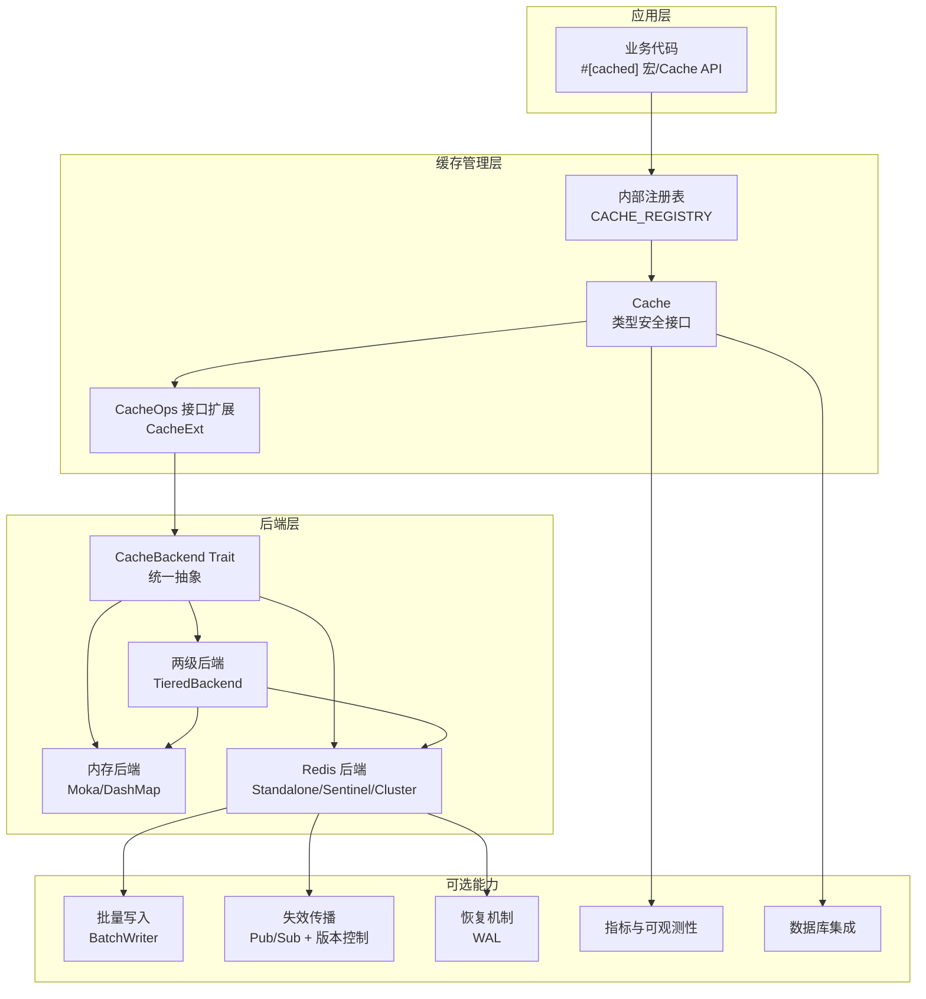
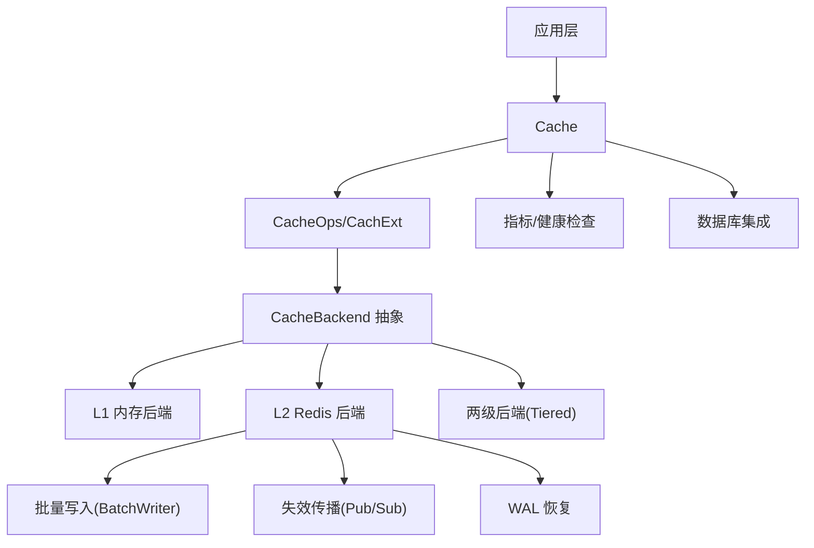
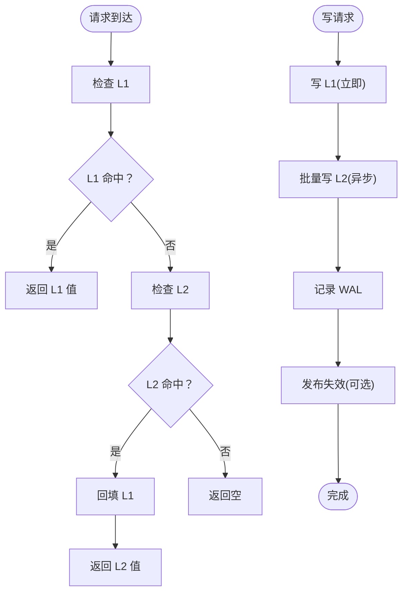
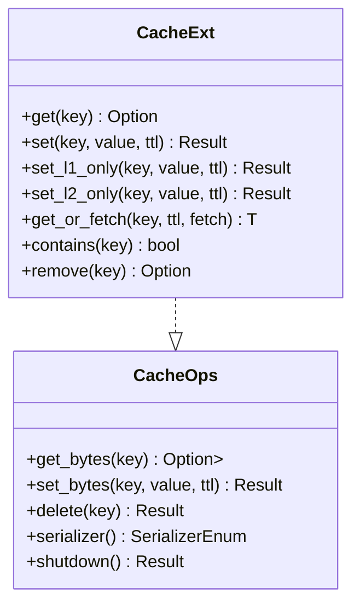
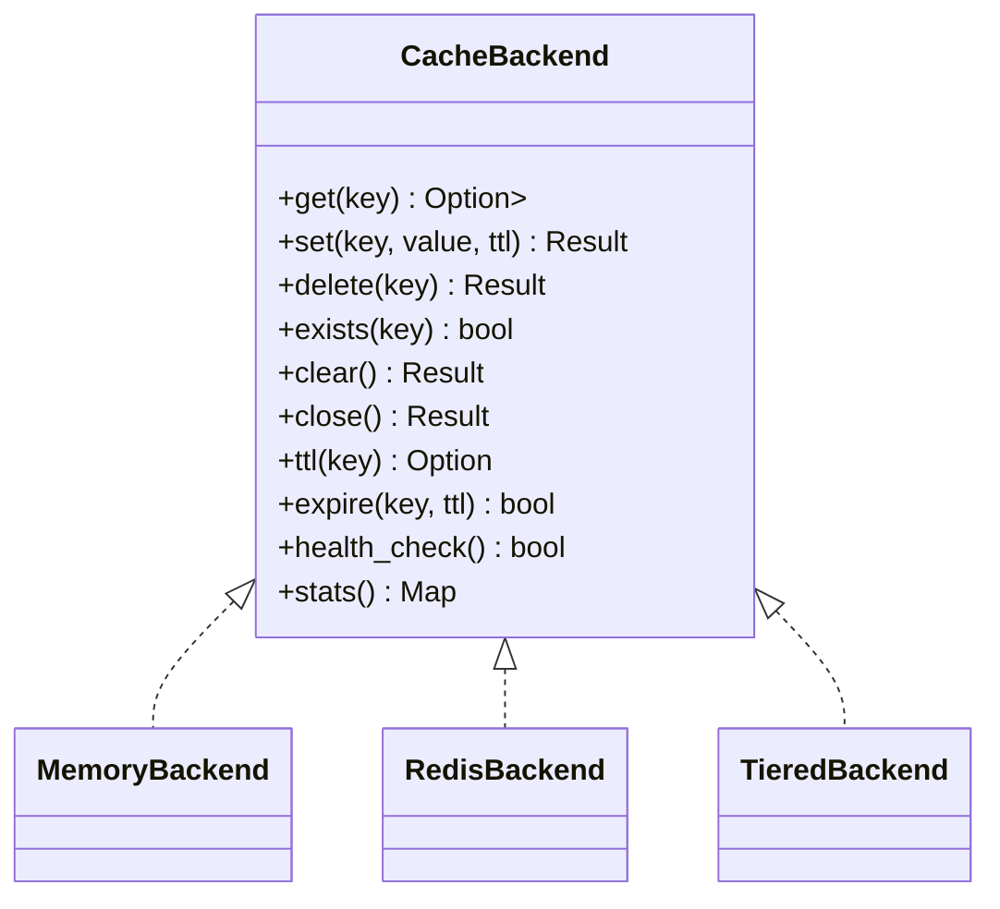
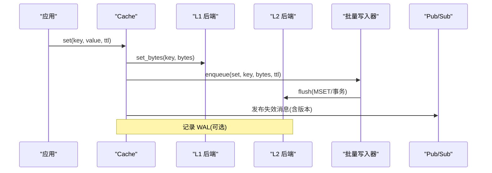
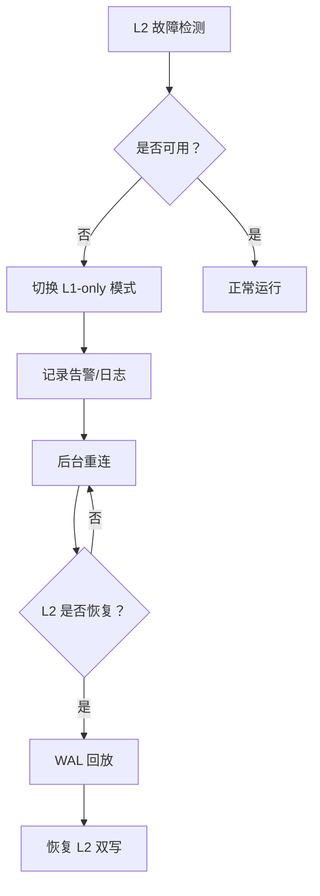
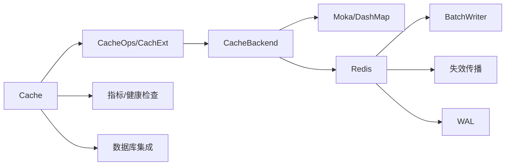
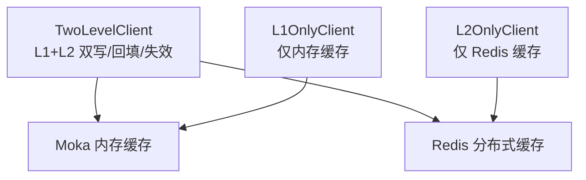

# 架构概览

<cite>
**本文引用的文件**
- [README.md](file://README.md)
- [ARCHITECTURE.md](file://docs/ARCHITECTURE.md)
- [lib.rs](file://src/lib.rs)
- [cache.rs](file://src/cache.rs)
- [client/mod.rs](file://src/client/mod.rs)
- [backend/mod.rs](file://src/backend/mod.rs)
- [backend/client/mod.rs](file://src/backend/client/mod.rs)
- [backend/interface.rs](file://src/backend/interface.rs)
- [internal.rs](file://src/internal.rs)
- [sync/mod.rs](file://src/sync/mod.rs)
- [recovery/mod.rs](file://src/recovery/mod.rs)
</cite>

## 目录
1. [引言](#引言)
2. [项目结构](#项目结构)
3. [核心组件](#核心组件)
4. [架构总览](#架构总览)
5. [详细组件分析](#详细组件分析)
6. [依赖关系分析](#依赖关系分析)
7. [性能考量](#性能考量)
8. [故障处理与一致性](#故障处理与一致性)
9. [客户端模式与使用场景](#客户端模式与使用场景)
10. [结论](#结论)

## 引言
本文件面向 Oxcache 的整体架构，聚焦 L1（内存缓存）+ L2（Redis 分布式缓存）两级架构的设计理念、实现原理与运行机制。文档将系统阐述：
- 数据流向与访问路径（命中优先级、读写策略）
- 数据同步机制与一致性模型
- 三种缓存客户端模式（TwoLevelClient、L1OnlyClient、L2OnlyClient）的职责与适用场景
- 管理组件（服务注册表、健康监控、批处理、失效与恢复）的作用
- 架构优势与权衡（性能、一致性、可用性）

## 项目结构
Oxcache 采用“现代 API + 插件化后端”的设计，核心模块围绕 Cache 接口、Backend 抽象、客户端扩展与可选功能（批处理、失效、恢复、度量、数据库集成等）展开。

**图表来源**
- [lib.rs](file://src/lib.rs#L417-L680)
- [cache.rs](file://src/cache.rs#L117-L646)
- [client/mod.rs](file://src/client/mod.rs#L18-L304)
- [backend/interface.rs](file://src/backend/interface.rs#L46-L166)
- [backend/mod.rs](file://src/backend/mod.rs#L1-L59)
- [backend/client/mod.rs](file://src/backend/client/mod.rs#L1-L34)
- [internal.rs](file://src/internal.rs#L15-L50)
- [sync/mod.rs](file://src/sync/mod.rs#L1-L311)
- [recovery/mod.rs](file://src/recovery/mod.rs#L1-L86)

**章节来源**
- [lib.rs](file://src/lib.rs#L417-L680)
- [README.md](file://README.md#L277-L304)

## 核心组件
- Cache<K,V>：类型安全的统一缓存接口，封装后端抽象，提供 get/set/get_or 等常用操作。
- CacheOps/CachExt：面向字节级与类型级操作的扩展接口，支持序列化、L1/L2 单独写入、锁等。
- CacheBackend：后端统一抽象，定义 get/set/delete/exists/clear/close/ttl/expire/health_check/stats 等能力。
- 内部注册表（CACHE_REGISTRY）：为 #[cached] 宏提供服务名到 CacheOps 的映射。
- 可选能力：批量写入（BatchWriter）、失效传播（Pub/Sub + 版本）、WAL 恢复、指标与健康检查、数据库集成。

**章节来源**
- [cache.rs](file://src/cache.rs#L117-L646)
- [client/mod.rs](file://src/client/mod.rs#L18-L304)
- [backend/interface.rs](file://src/backend/interface.rs#L46-L166)
- [internal.rs](file://src/internal.rs#L15-L50)

## 架构总览
Oxcache 的两级架构以“L1 内存 + L2 Redis”为核心，结合批处理优化、失效传播与 WAL 恢复，形成高性能、高可用、可扩展的缓存体系。其关键特性包括：
- L1：内存缓存（Moka/DashMap），极低延迟，强一致。
- L2：Redis 分布式缓存，支持多种部署形态（单机/哨兵/集群），提供跨实例一致性。
- 两级协同：读路径优先 L1，命中则直接返回；未命中再查 L2，并回填 L1。
- 写路径：同时写 L1 与 L2（可批量），并记录 WAL 以保障持久化与故障恢复。
- 失效传播：基于 Pub/Sub 的版本化失效消息，避免惊群与竞态。
- 健康监控与降级：自动检测 L2 故障，进入 L1-only 模式并后台重连与 WAL 回放。

**图表来源**
- [cache.rs](file://src/cache.rs#L117-L646)
- [backend/interface.rs](file://src/backend/interface.rs#L46-L166)
- [sync/mod.rs](file://src/sync/mod.rs#L1-L311)
- [recovery/mod.rs](file://src/recovery/mod.rs#L1-L86)

**章节来源**
- [ARCHITECTURE.md](file://docs/ARCHITECTURE.md#L34-L73)

## 详细组件分析

### 1) 两级后端与数据流
- 读流程（命中优先级：L1 > L2）：
  - 先查 L1，命中即返回；
  - L1 未命中再查 L2，命中则回填 L1 后返回；
  - L2 也未命中则返回空。
- 写流程（双写 + 批处理）：
  - 立即写 L1；
  - 异步批量写 L2；
  - 记录 WAL 以备恢复；
  - 可选发布失效消息（版本化）。

**图表来源**
- [ARCHITECTURE.md](file://docs/ARCHITECTURE.md#L201-L216)

**章节来源**
- [ARCHITECTURE.md](file://docs/ARCHITECTURE.md#L201-L216)

### 2) 客户端扩展与序列化
- CacheExt：在 CacheOps 基础上提供类型安全的 get/set/remove/contains/get_or_fetch 等便捷方法，内部通过序列化器进行字节转换。
- CacheOps：定义 get_bytes/set_bytes/delete 等底层操作，以及 L1/L2 单独写入、锁、清空、优雅关闭等扩展能力。
- 序列化：默认 JSON，也可使用二进制序列化（如 bincode）以降低体积与提升吞吐。

**图表来源**
- [client/mod.rs](file://src/client/mod.rs#L18-L304)

**章节来源**
- [client/mod.rs](file://src/client/mod.rs#L18-L304)

### 3) 后端抽象与实现
- CacheBackend：统一抽象，屏蔽 L1/L2 差异，便于替换与组合。
- L1 后端：Moka/DashMap，支持并发、淘汰策略与统计。
- L2 后端：Redis，支持连接池、重连、集群拓扑、批量写、Pub/Sub 失效。
- TieredBackend：组合 L1 与 L2，实现两级协同。

**图表来源**
- [backend/interface.rs](file://src/backend/interface.rs#L46-L166)
- [backend/client/mod.rs](file://src/backend/client/mod.rs#L13-L34)
- [backend/mod.rs](file://src/backend/mod.rs#L28-L45)

**章节来源**
- [backend/interface.rs](file://src/backend/interface.rs#L46-L166)
- [backend/client/mod.rs](file://src/backend/client/mod.rs#L13-L34)
- [backend/mod.rs](file://src/backend/mod.rs#L28-L45)

### 4) 批量写入与失效传播
- 批量写入（BatchWriter）：缓冲多条写入，定时或达阈值后一次性批量写入 L2，显著提升吞吐。
- 失效传播（Pub/Sub + 版本）：更新 L2 后发布失效消息，接收方按版本判断是否清理本地 L1，避免竞态与惊群。

**图表来源**
- [ARCHITECTURE.md](file://docs/ARCHITECTURE.md#L506-L540)
- [sync/mod.rs](file://src/sync/mod.rs#L1-L311)

**章节来源**
- [ARCHITECTURE.md](file://docs/ARCHITECTURE.md#L506-L540)
- [sync/mod.rs](file://src/sync/mod.rs#L1-L311)

### 5) 恢复与健康监控
- WAL：在 L2 不可用期间记录写操作，待 L2 恢复后回放，确保数据不丢失。
- 健康检查：定期检查 L1 内存、L2 连接、磁盘空间等，异常时进入降级模式（如 L1-only）。

**图表来源**
- [ARCHITECTURE.md](file://docs/ARCHITECTURE.md#L575-L607)
- [recovery/mod.rs](file://src/recovery/mod.rs#L1-L86)

**章节来源**
- [ARCHITECTURE.md](file://docs/ARCHITECTURE.md#L575-L607)
- [recovery/mod.rs](file://src/recovery/mod.rs#L1-L86)

## 依赖关系分析
- 模块耦合与内聚：
  - Cache 与 CacheOps/CachExt 解耦后端实现，通过 CacheBackend 抽象实现高内聚、低耦合。
  - 可选能力（批处理、失效、恢复）通过特性开关引入，避免对核心路径的影响。
- 外部依赖与集成：
  - L1：Moka/DashMap 并发缓存；
  - L2：Redis 客户端与连接管理；
  - 度量与可观测性：OpenTelemetry（可选）；
  - 数据库：sqlx（可选）。

**图表来源**
- [lib.rs](file://src/lib.rs#L417-L680)
- [cache.rs](file://src/cache.rs#L117-L646)
- [backend/interface.rs](file://src/backend/interface.rs#L46-L166)
- [sync/mod.rs](file://src/sync/mod.rs#L1-L311)
- [recovery/mod.rs](file://src/recovery/mod.rs#L1-L86)

**章节来源**
- [lib.rs](file://src/lib.rs#L417-L680)

## 性能考量
- L1：纳秒级读写延迟，适合热数据与强一致要求。
- L2：毫秒级读写延迟，适合跨实例共享与持久化需求。
- 批量写入：通过缓冲与 MSET/事务减少网络往返，显著提升写吞吐。
- 序列化优化：二进制序列化（如 bincode）降低体积与 CPU 开销。
- 并发与无锁：Moka 的并发设计与 DashMap 的无锁哈希表提升高并发下的稳定性。

[本节为通用性能讨论，无需特定文件引用]

## 故障处理与一致性
- 一致性模型：实例内强一致（L1/L2 同步），实例间最终一致（通过 Pub/Sub + 版本化失效）。
- 故障处理：L2 不可用时自动降级为 L1-only，后台重连并 WAL 回放恢复。
- 安全与健壮性：输入校验、超时保护、分布式锁、敏感信息脱敏等。

**章节来源**
- [ARCHITECTURE.md](file://docs/ARCHITECTURE.md#L542-L607)
- [README.md](file://README.md#L336-L386)

## 客户端模式与使用场景
- TwoLevelClient（两级缓存）：适用于需要跨实例共享与高吞吐写的场景。读命中 L1，未命中回源 L2 并回填；写同时更新 L1/L2，并可批量落盘与发布失效。
- L1OnlyClient（仅内存缓存）：适用于进程内热数据、强一致与极致低延迟场景，无需外部依赖。
- L2OnlyClient（仅 Redis 缓存）：适用于需要跨实例共享、持久化与复杂部署形态（单机/哨兵/集群）的场景。

**图表来源**
- [README.md](file://README.md#L277-L304)
- [ARCHITECTURE.md](file://docs/ARCHITECTURE.md#L34-L73)

**章节来源**
- [README.md](file://README.md#L277-L304)
- [ARCHITECTURE.md](file://docs/ARCHITECTURE.md#L34-L73)

## 结论
Oxcache 的两级架构在性能、一致性与可用性之间取得良好平衡：
- 性能：L1 提供纳秒级响应，L2 提供跨实例共享与高吞吐写入，批处理进一步放大吞吐。
- 一致性：实例内强一致，实例间通过版本化失效实现最终一致。
- 可用性：自动降级、健康检查、WAL 恢复与后台重连，保障系统韧性。
- 可扩展性：插件化后端与特性开关，允许按需启用功能，兼顾最小依赖与完整能力。
